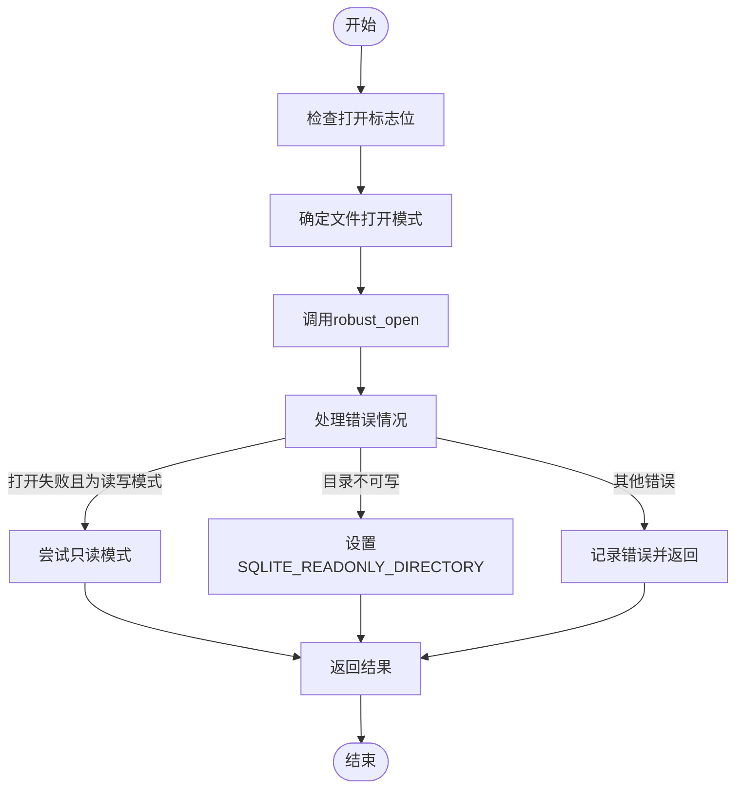
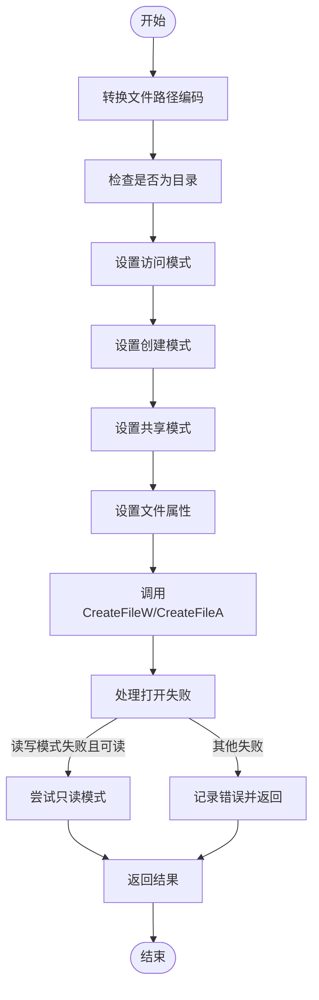
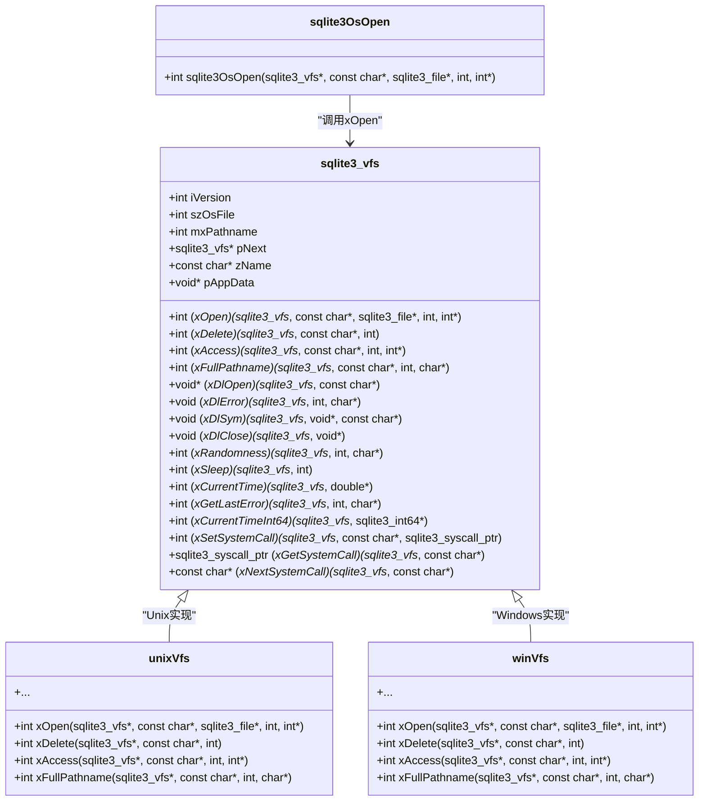
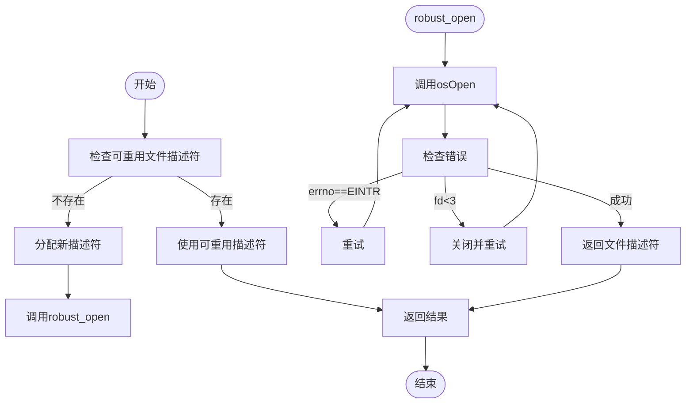
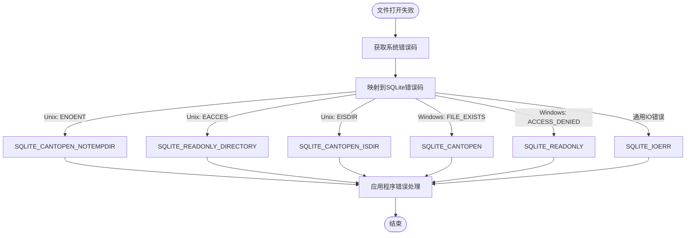

# 文件打开操作

<cite>
**本文档中引用的文件**   
- [os.c](file://src/os.c)
- [os.h](file://src/os.h)
- [os_unix.c](file://src/os_unix.c)
- [os_win.c](file://src/os_win.c)
- [os_common.h](file://src/os_common.h)
</cite>

## 目录
1. [简介](#简介)
2. [核心组件分析](#核心组件分析)
3. [Unix系统文件打开机制](#unix系统文件打开机制)
4. [Windows系统文件打开机制](#windows系统文件打开机制)
5. [VFS层抽象与跨平台兼容性](#vfs层抽象与跨平台兼容性)
6. [文件描述符管理策略](#文件描述符管理策略)
7. [常见打开失败原因及错误码映射](#常见打开失败原因及错误码映射)
8. [自定义VFS中open操作的实现范例](#自定义vfs中open操作的实现范例)

## 简介
SQLite数据库系统通过虚拟文件系统（VFS）层提供了跨平台的文件操作抽象。`sqlite3OsOpen`函数作为VFS层的核心接口，负责在不同操作系统上统一处理文件打开操作。该函数通过VFS抽象层屏蔽了底层操作系统的差异，实现了在Unix和Windows等不同平台上的兼容性。本文档详细分析`sqlite3OsOpen`函数在不同平台下的实现机制，包括文件句柄创建、权限设置、锁定模式以及错误处理等关键方面。

## 核心组件分析

`sqlite3OsOpen`函数是SQLite操作系统接口层的核心函数之一，它作为VFS（Virtual File System）层的入口点，负责协调不同平台的文件打开操作。该函数的主要职责是将高层的数据库操作请求转换为特定操作系统的文件系统调用。在实现上，`sqlite3OsOpen`函数通过调用VFS结构中的`xOpen`方法来实现平台特定的文件打开逻辑。这种设计模式使得SQLite能够通过插件化的方式支持多种不同的文件系统后端，同时保持上层API的一致性。

**Section sources**
- [os.c](file://src/os.c#L214-L231)
- [os.h](file://src/os.h#L202-L202)

## Unix系统文件打开机制

在Unix系统中，文件打开操作由`unixOpen`函数实现，该函数是VFS结构中`xOpen`方法的具体实现。`unixOpen`函数首先根据传入的标志位（flags）确定适当的打开模式，然后调用底层的`robust_open`函数来执行实际的文件打开操作。在处理标志位时，函数会检查`SQLITE_OPEN_READONLY`、`SQLITE_OPEN_READWRITE`、`SQLITE_OPEN_CREATE`等标志，并相应地设置`O_RDONLY`、`O_RDWR`、`O_CREAT`等POSIX文件打开标志。

文件权限设置是Unix系统文件打开的重要环节。当创建新文件时，`findCreateFileMode`函数会被调用来确定文件的创建模式。对于主数据库文件，通常使用默认的文件权限`SQLITE_DEFAULT_FILE_PERMISSIONS`（通常为0644），并受系统umask的影响。然而，对于WAL（Write-Ahead Logging）文件和日志文件，SQLite会尝试获取关联数据库文件的权限，并使用相同的权限创建这些辅助文件，以确保权限的一致性。

文件锁定模式在Unix系统中通过多种机制实现，包括POSIX建议性锁、flock()锁、dot-file锁等。`unixOpen`函数会根据文件类型和配置选择适当的锁定策略。对于主数据库文件，通常会启用文件锁定以支持多进程并发访问，而对于临时文件或内存数据库，则可能禁用锁定以提高性能。



**Diagram sources **
- [os_unix.c](file://src/os_unix.c#L6264-L6463)

**Section sources**
- [os_unix.c](file://src/os_unix.c#L6264-L6463)
- [os_unix.c](file://src/os_unix.c#L703-L740)
- [os_unix.c](file://src/os_unix.c#L6185-L6209)

## Windows系统文件打开机制

在Windows系统中，文件打开操作由`winOpen`函数实现，该函数是Windows VFS结构中`xOpen`方法的具体实现。与Unix系统不同，Windows使用`CreateFileW`或`CreateFileA`等Win32 API函数来创建文件句柄。`winOpen`函数首先根据打开标志位确定适当的访问模式、共享模式和创建模式，然后调用相应的Win32 API函数执行文件打开操作。

在权限设置方面，Windows系统使用不同的机制。`winOpen`函数通过`dwFlagsAndAttributes`参数来设置文件属性，如`FILE_ATTRIBUTE_NORMAL`表示普通文件，`FILE_ATTRIBUTE_TEMPORARY | FILE_ATTRIBUTE_HIDDEN | FILE_FLAG_DELETE_ON_CLOSE`表示临时文件并在关闭时自动删除。对于只读访问，函数设置`GENERIC_READ`访问权限；对于读写访问，则设置`GENERIC_READ | GENERIC_WRITE`权限。

文件锁定在Windows系统中有多种实现方式。在Win9x系统中，由于缺乏`LockFileEx`函数，SQLite使用`LockFile`函数实现强制性文件锁定。而在WinNT/2K/XP系统中，可以使用`LockFileEx`和`UnlockFileEx`函数实现读写锁，从而支持更高效的并发访问。`winOpen`函数会根据操作系统版本和配置选择适当的锁定策略。

当文件打开失败时，`winOpen`函数会进行智能的错误处理。如果以读写模式打开失败但文件存在且可读，函数会自动尝试以只读模式重新打开文件。这种机制提高了数据库的容错能力，允许在只读权限下访问数据库文件。



**Diagram sources **
- [os_win.c](file://src/os_win.c#L5484-L5683)

**Section sources**
- [os_win.c](file://src/os_win.c#L5484-L5683)
- [os_win.c](file://src/os_win.c#L535-L573)

## VFS层抽象与跨平台兼容性

VFS（Virtual File System）层是SQLite实现跨平台兼容性的核心机制。通过VFS抽象，SQLite将底层操作系统的文件系统差异封装起来，为上层提供统一的文件操作接口。`sqlite3_vfs`结构体定义了VFS的接口规范，其中包含`xOpen`、`xClose`、`xRead`、`xWrite`等一系列函数指针，每个函数指针对应一种文件操作。

`sqlite3OsOpen`函数作为VFS层的入口点，通过调用`pVfs->xOpen`来执行平台特定的文件打开操作。这种设计模式实现了完美的抽象分离：上层代码只需调用`sqlite3OsOpen`，而无需关心底层是Unix还是Windows系统；底层则通过实现`xOpen`方法来提供平台特定的功能。这种插件化的架构使得SQLite能够轻松支持新的文件系统或存储后端。

VFS层还支持运行时的VFS切换和注册。通过`sqlite3_vfs_register`函数，可以注册新的VFS实现，并将其设置为默认VFS。这为SQLite提供了极大的灵活性，允许开发者根据应用需求选择最适合的文件系统后端。例如，可以注册一个使用内存映射文件的VFS来提高性能，或注册一个加密VFS来增强数据安全性。



**Diagram sources **
- [os.h](file://src/os.h#L199-L224)
- [os.c](file://src/os.c#L214-L231)

**Section sources**
- [os.h](file://src/os.h#L199-L224)
- [os.c](file://src/os.c#L214-L231)

## 文件描述符管理策略

SQLite在Unix系统中采用了精细的文件描述符管理策略，以提高性能和资源利用率。`unixFile`结构体作为Unix文件句柄的容器，包含了文件描述符、锁定信息、控制标志等多种状态信息。其中，`pPreallocatedUnused`字段用于存储预分配的未使用文件描述符，这在频繁打开和关闭数据库文件的场景下可以显著减少系统调用开销。

对于主数据库文件，SQLite会尝试重用文件描述符。`findReusableFd`函数会检查是否存在可重用的文件描述符，如果存在则直接使用，避免了重复的`open`系统调用。这种策略在多线程环境中尤为重要，可以减少文件系统竞争和系统调用开销。

在错误处理方面，`robust_open`函数实现了健壮的文件打开逻辑。该函数会循环调用`osOpen`，直到操作成功或遇到非`EINTR`错误。这种设计确保了在信号中断等临时性错误情况下能够自动重试，提高了系统的可靠性。同时，函数还会检查文件描述符是否小于`SQLITE_MINIMUM_FILE_DESCRIPTOR`（通常为3），以避免占用标准输入、输出和错误的文件描述符。



**Diagram sources **
- [os_unix.c](file://src/os_unix.c#L703-L740)

**Section sources**
- [os_unix.c](file://src/os_unix.c#L703-L740)
- [os_unix.c](file://src/os_unix.c#L6264-L6463)

## 常见打开失败原因及错误码映射

文件打开操作可能因多种原因失败，SQLite定义了一套完整的错误码系统来精确描述各种错误情况。常见的打开失败原因包括：文件不存在、权限不足、路径是目录而非文件、磁盘已满、文件名过长等。每种错误情况都有对应的SQLite错误码，便于应用程序进行针对性的错误处理。

当`unixOpen`或`winOpen`函数执行失败时，会根据具体的系统错误码映射到相应的SQLite错误码。例如，在Unix系统中，如果`open`系统调用返回`ENOENT`错误且文件不存在，则映射为`SQLITE_CANTOPEN_NOTEMPDIR`；如果目录不可写，则映射为`SQLITE_READONLY_DIRECTORY`。在Windows系统中，如果`CreateFile`调用失败且文件存在但为只读，则会尝试以只读模式重新打开。

错误码映射不仅提高了错误诊断的准确性，还增强了应用程序的可移植性。开发者可以基于SQLite的错误码编写跨平台的错误处理逻辑，而无需关心底层操作系统的具体错误码。这种抽象层的设计是SQLite跨平台能力的重要体现。



**Diagram sources **
- [os_unix.c](file://src/os_unix.c#L6400-L6599)
- [os_win.c](file://src/os_win.c#L5600-L5799)

**Section sources**
- [os_unix.c](file://src/os_unix.c#L6400-L6599)
- [os_win.c](file://src/os_win.c#L5600-L5799)
- [main.c](file://src/main.c#L1541-L1590)

## 自定义VFS中open操作的实现范例

实现自定义VFS中的`open`操作需要遵循SQLite的VFS接口规范。以下是一个简化的实现范例，展示了如何创建一个自定义的`xOpen`函数：

```c
static int customOpen(
  sqlite3_vfs *pVfs,           /* VFS结构体 */
  const char *zPath,           /* 文件路径 */
  sqlite3_file *pFile,         /* 文件句柄 */
  int flags,                   /* 打开标志 */
  int *pOutFlags               /* 输出标志 */
){
  /* 初始化文件结构体 */
  memset(pFile, 0, sizeof(sqlite3_file));
  
  /* 根据标志位确定打开模式 */
  int openFlags = 0;
  if( flags & SQLITE_OPEN_READONLY ){
    openFlags |= CUSTOM_OPEN_READONLY;
  }else if( flags & SQLITE_OPEN_READWRITE ){
    openFlags |= CUSTOM_OPEN_READWRITE;
  }
  
  if( flags & SQLITE_OPEN_CREATE ){
    openFlags |= CUSTOM_OPEN_CREATE;
  }
  
  /* 执行自定义的文件打开操作 */
  int rc = customFileSystemOpen(zPath, openFlags, pFile);
  if( rc != CUSTOM_OK ){
    return SQLITE_CANTOPEN;
  }
  
  /* 设置输出标志 */
  if( pOutFlags ){
    *pOutFlags = flags & (SQLITE_OPEN_READONLY | SQLITE_OPEN_READWRITE);
  }
  
  /* 设置文件操作方法 */
  pFile->pMethods = &customIoMethods;
  
  return SQLITE_OK;
}
```

在注册自定义VFS时，需要将`xOpen`指针指向上述实现的函数，并通过`sqlite3_vfs_register`将其注册到SQLite系统中。这种机制使得开发者可以轻松地为SQLite添加新的存储后端，如网络文件系统、加密文件系统或内存数据库等。

**Section sources**
- [test_onefile.c](file://src/test_onefile.c#L175-L205)
- [test_vfs.c](file://src/test_vfs.c#L1445-L1478)