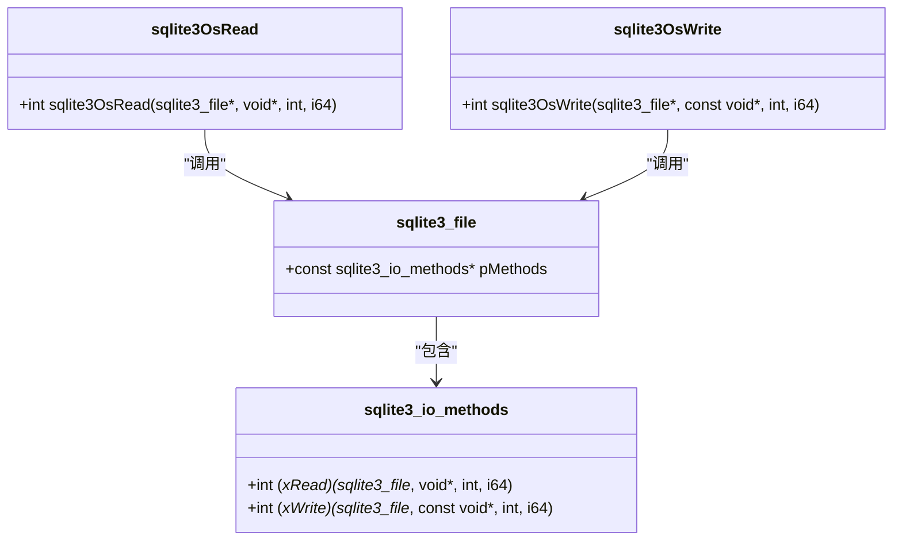
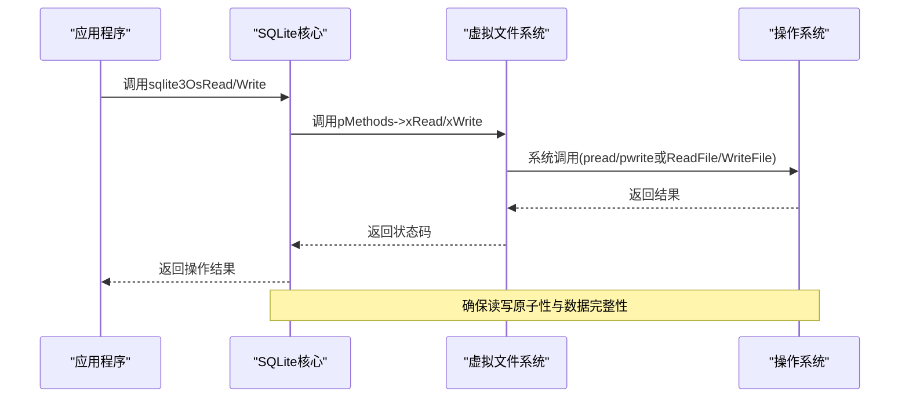
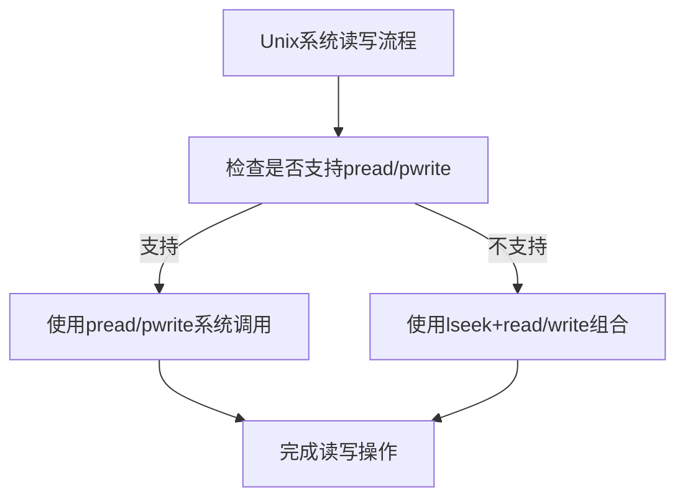
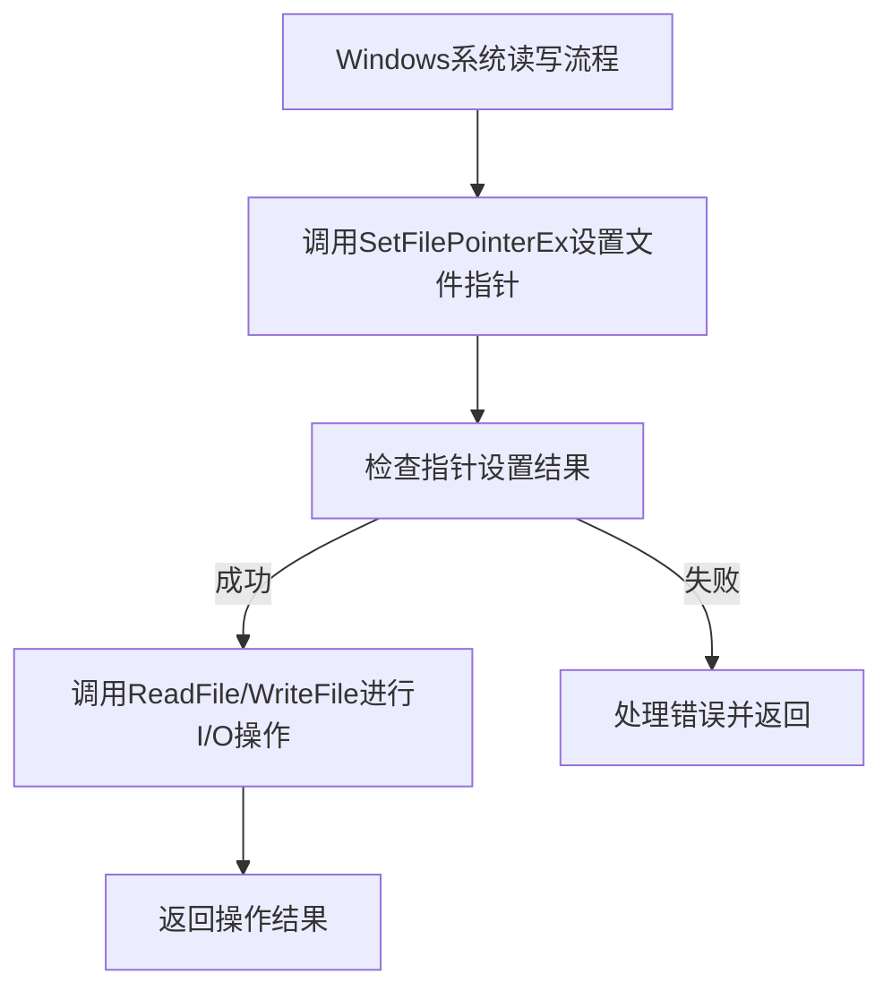
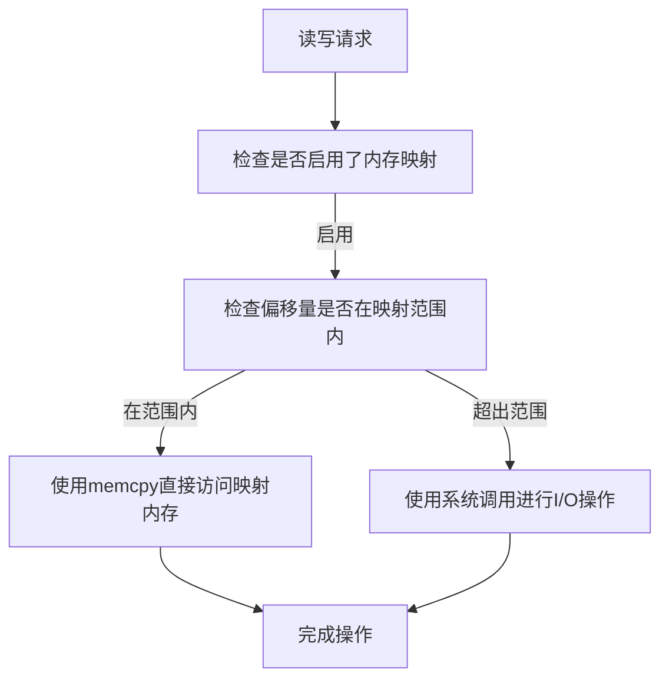
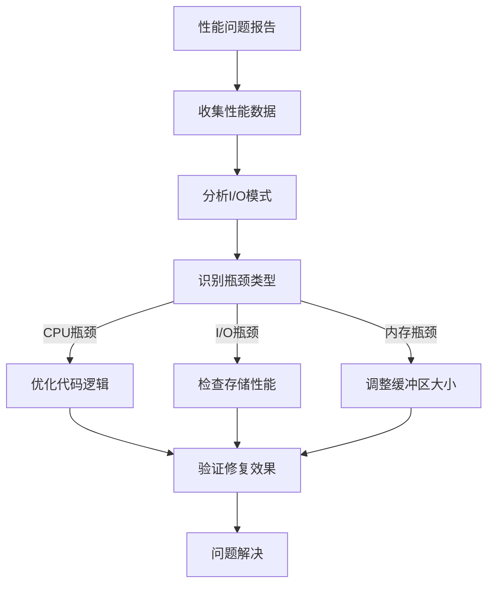
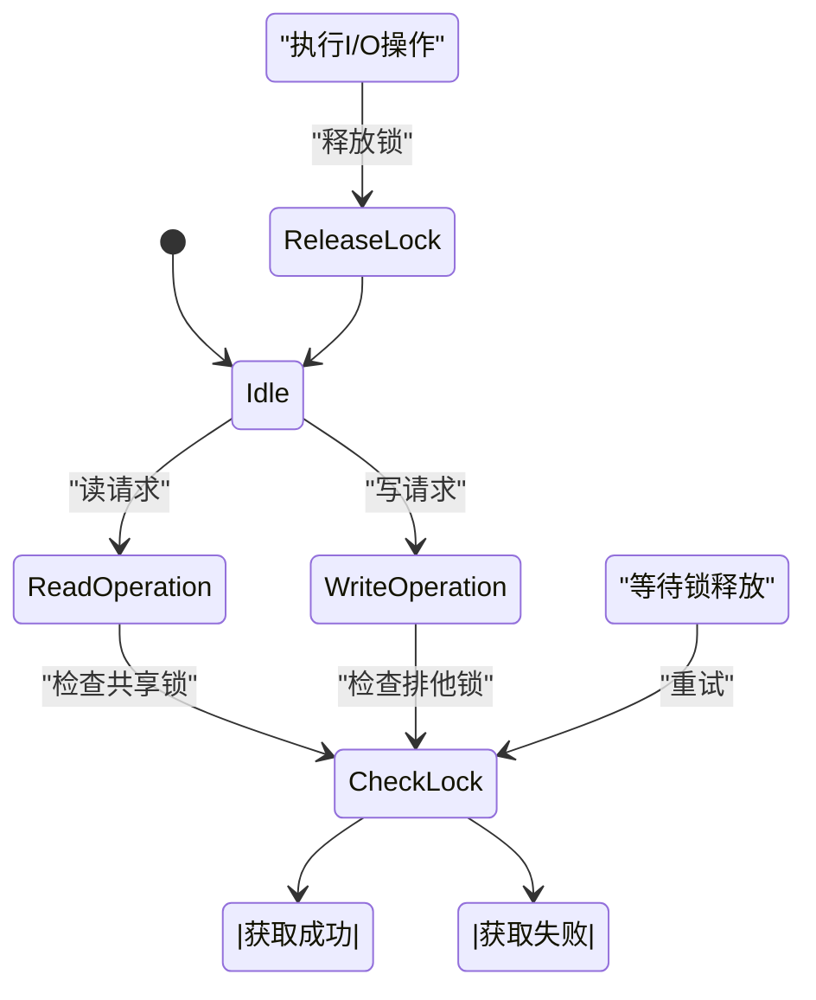

# 文件读写操作

<cite>
**本文档中引用的文件**  
- [os.h](file://src/os.h)
- [os.c](file://src/os.c)
- [os_unix.c](file://src/os_unix.c)
- [os_win.c](file://src/os_win.c)
</cite>

## 目录
1. [引言](#引言)
2. [核心函数分析](#核心函数分析)
3. [数据传输机制与原子性保证](#数据传输机制与原子性保证)
4. [Unix与Windows系统实现差异](#unix与windows系统实现差异)
5. [I/O缓冲区与性能优化](#io缓冲区与性能优化)
6. [存储介质优化策略](#存储介质优化策略)
7. [性能瓶颈诊断方法](#性能瓶颈诊断方法)
8. [高并发I/O争用避免策略](#高并发io争用避免策略)
9. [结论](#结论)

## 引言
SQLite数据库系统通过抽象层实现了跨平台的文件I/O操作，其中`sqlite3OsRead`和`sqlite3OsWrite`函数是核心的读写接口。这些函数通过虚拟文件系统（VFS）层与底层操作系统进行交互，确保了数据读写的原子性和完整性。本文将深入分析这些函数的数据传输机制，比较不同操作系统下的实现差异，并探讨性能优化策略。

## 核心函数分析

`sqlite3OsRead`和`sqlite3OsWrite`函数是SQLite中用于文件读写的两个核心函数。它们位于`os.c`文件中，作为操作系统抽象层的一部分，负责将读写请求转发到底层操作系统的具体实现。



**Diagram sources**  
- [os.h](file://src/os.h#L176-L177)
- [os.c](file://src/os.c#L87-L94)

**Section sources**  
- [os.h](file://src/os.h#L176-L177)
- [os.c](file://src/os.c#L87-L94)

## 数据传输机制与原子性保证

SQLite通过VFS层的`xRead`和`xWrite`方法实现数据传输。在`sqlite3OsRead`和`sqlite3OsWrite`函数中，实际的读写操作由`sqlite3_file`结构体中的`pMethods`成员指向的具体实现完成。

数据完整性通过以下机制保证：
1. 使用预分配的内存测试宏`DO_OS_MALLOC_TEST`检测内存分配
2. 通过文件描述符和偏移量精确控制读写位置
3. 在发生错误时返回适当的错误码并记录系统错误



**Diagram sources**  
- [os.c](file://src/os.c#L87-L94)
- [os_unix.c](file://src/os_unix.c#L3383-L3514)
- [os_win.c](file://src/os_win.c#L2939-L3019)

**Section sources**  
- [os.c](file://src/os.c#L87-L94)
- [os_unix.c](file://src/os_unix.c#L3383-L3514)
- [os_win.c](file://src/os_win.c#L2939-L3019)

## Unix与Windows系统实现差异

Unix和Windows系统在文件I/O实现上存在显著差异，主要体现在系统调用的选择上。

### Unix系统实现
Unix系统优先使用`pread`和`pwrite`系统调用，这些调用是原子操作，能够在一个系统调用中完成定位和读写，避免了传统`lseek+read/write`组合可能产生的竞态条件。



### Windows系统实现
Windows系统使用`SetFilePointer`和`ReadFile`/`WriteFile`的组合来实现文件读写操作。由于Windows API的设计，需要先设置文件指针位置，然后再进行读写操作。



**Diagram sources**  
- [os_unix.c](file://src/os_unix.c#L466-L493)
- [os_win.c](file://src/os_win.c#L944-L959)
- [os_win.c](file://src/os_win.c#L1043-L1048)

**Section sources**  
- [os_unix.c](file://src/os_unix.c#L466-L493)
- [os_win.c](file://src/os_win.c#L944-L1048)

## I/O缓冲区与性能优化

SQLite通过多种机制优化I/O性能，包括内存映射和缓冲区管理。

### 内存映射优化
当启用了内存映射功能时（`SQLITE_MAX_MMAP_SIZE>0`），SQLite会优先使用内存映射来处理读写请求，这可以显著提高性能。



### 缓冲区管理
SQLite通过预读和预写机制优化I/O性能，减少系统调用次数。同时，通过批量操作和适当的缓冲区大小选择来平衡内存使用和性能。

**Diagram sources**  
- [os_unix.c](file://src/os_unix.c#L3383-L3514)
- [os_win.c](file://src/os_win.c#L2939-L3019)

**Section sources**  
- [os_unix.c](file://src/os_unix.c#L3383-L3514)
- [os_win.c](file://src/os_win.c#L2939-L3019)

## 存储介质优化策略

不同的存储介质（SSD和HDD）需要不同的优化策略。

### SSD优化策略
- 启用更大的内存映射区域以充分利用SSD的随机访问性能
- 减少不必要的同步操作，因为SSD的写入耐久性较高
- 使用更大的I/O缓冲区以提高吞吐量

### HDD优化策略
- 优化I/O模式以减少磁头移动
- 使用适当的预读策略来提高顺序读取性能
- 控制并发I/O操作数量以避免过度的磁盘寻道

```mermaid
erDiagram
STORAGE_MEDIUM ||--o{ OPTIMIZATION_STRATEGY : "has"
STORAGE_MEDIUM {
string type
int random_access_speed
int sequential_access_speed
int seek_time
}
OPTIMIZATION_STRATEGY {
string name
string description
string适用场景
}
OPTIMIZATION_STRATEGY ||--o{ IO_PATTERN : "defines"
IO_PATTERN {
string type
int size
string access_pattern
}
```

**Diagram sources**  
- [os_unix.c](file://src/os_unix.c#L3383-L3514)
- [os_win.c](file://src/os_win.c#L2939-L3019)

**Section sources**  
- [os_unix.c](file://src/os_unix.c#L3383-L3514)
- [os_win.c](file://src/os_win.c#L2939-L3019)

## 性能瓶颈诊断方法

诊断SQLite文件I/O性能瓶颈需要系统性的方法和工具。

### 诊断工具
- 使用`sqlite3_io_error_hit`等测试宏模拟I/O错误
- 通过`OSTRACE`宏跟踪I/O操作
- 使用系统级性能分析工具监控文件I/O

### 诊断流程


**Diagram sources**  
- [os_common.h](file://src/os_common.h#L40-L79)
- [os.c](file://src/os.c#L87-L94)

**Section sources**  
- [os_common.h](file://src/os_common.h#L40-L79)
- [os.c](file://src/os.c#L87-L94)

## 高并发I/O争用避免策略

在高并发场景下，避免I/O争用是保证性能的关键。

### 锁机制优化
- 使用细粒度锁减少锁争用
- 实现锁超时机制避免死锁
- 使用无锁数据结构在适当场景下

### 并发控制策略
- 限制并发连接数
- 使用连接池管理数据库连接
- 实现读写分离以减少写操作争用



**Diagram sources**  
- [os_unix.c](file://src/os_unix.c#L5562-L5581)
- [os_win.c](file://src/os_win.c#L5123-L5147)

**Section sources**  
- [os_unix.c](file://src/os_unix.c#L5562-L5581)
- [os_win.c](file://src/os_win.c#L5123-L5147)

## 结论
SQLite通过精心设计的VFS层实现了跨平台的高效文件I/O操作。`sqlite3OsRead`和`sqlite3OsWrite`函数作为核心接口，通过抽象层与底层操作系统交互，确保了数据读写的原子性和完整性。不同操作系统下的实现差异反映了各自平台的特点，而各种性能优化策略则针对不同的使用场景和硬件环境进行了优化。通过合理的诊断方法和并发控制策略，可以在高负载环境下保持良好的性能表现。