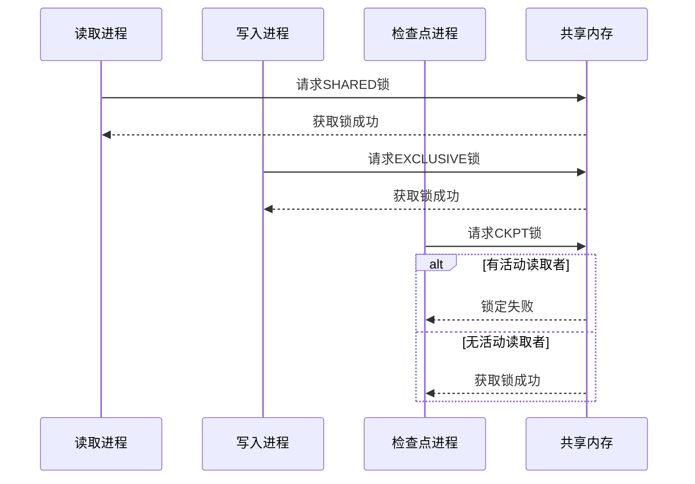
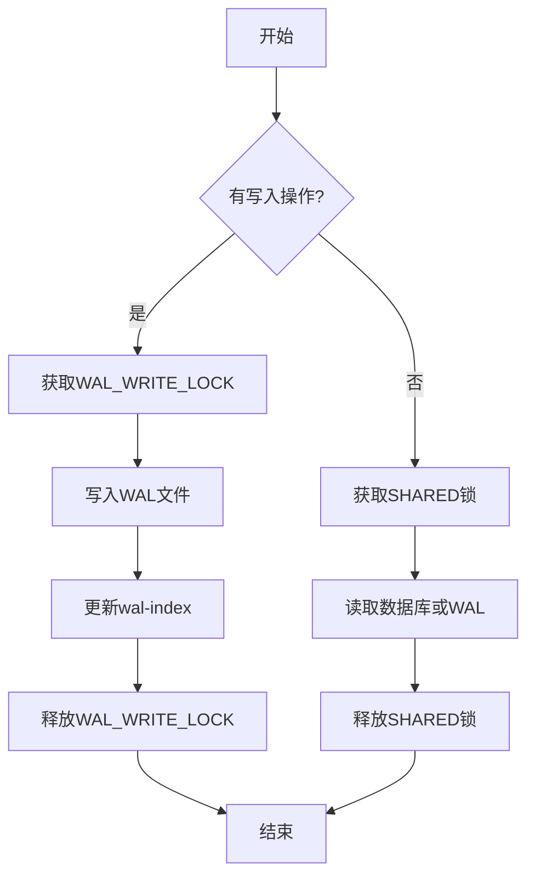

# 共享内存锁（WAL模式）

<cite>
**本文档引用的文件**   
- [wal.h](file://src/wal.h)
- [os.h](file://src/os.h)
- [os.c](file://src/os.c)
- [wal.c](file://src/wal.c)
- [os_unix.c](file://src/os_unix.c)
- [os_win.c](file://src/os_win.c)
</cite>

## 目录
1. [简介](#简介)
2. [WAL模式与共享内存锁概述](#wal模式与共享内存锁概述)
3. [核心接口分析](#核心接口分析)
4. [共享内存锁的实现机制](#共享内存锁的实现机制)
5. [平台特定实现](#平台特定实现)
6. [并发性能分析](#并发性能分析)
7. [总结](#总结)

## 简介

本文档深入讲解SQLite中WAL（Write-Ahead Logging）模式下共享内存锁（shmLock）的工作机制。详细说明`sqlite3OsShmMap`、`sqlite3OsShmLock`等接口如何用于在多个进程间共享内存区域以协调WAL日志的读写。分析共享内存锁在提升WAL模式并发性能中的关键作用，并结合os.h中的WAL相关宏定义和平台实现代码进行说明。

## WAL模式与共享内存锁概述

WAL（Write-Ahead Logging）模式是SQLite提供的一种替代传统回滚日志的持久化机制。在WAL模式下，数据库的修改首先被写入一个独立的WAL文件，而不是直接修改主数据库文件。这种机制允许多个读操作与写操作并发执行，极大地提高了数据库的并发性能。

共享内存锁（shmLock）是WAL模式实现高并发的关键组件。它通过在共享内存区域中维护一个索引（wal-index），使得多个进程能够高效地协调对WAL文件的访问。wal-index文件通常以数据库文件名加上"-shm"后缀命名，它包含了WAL文件中所有有效帧的索引信息，使得读取操作可以快速定位到所需的数据页。

**Section sources**
- [wal.c](file://src/wal.c#L1-L100)
- [wal.h](file://src/wal.h#L1-L50)

## 核心接口分析

### 共享内存映射接口

`sqlite3OsShmMap`接口负责将共享内存区域映射到进程的地址空间。该接口在os.h头文件中声明，并在不同平台的VFS实现中提供具体实现。

```c
int sqlite3OsShmMap(sqlite3_file *,int,int,int,void volatile **);
```

此接口的参数包括：
- `sqlite3_file *`: 数据库文件句柄
- `int iPage`: 要映射的页号
- `int pgsz`: 页大小
- `int bExtend`: 是否在必要时扩展文件
- `void volatile **pp`: 输出参数，指向映射内存的指针

**Section sources**
- [os.h](file://src/os.h#L200-L210)
- [os.c](file://src/os.c#L400-L420)

### 共享内存锁接口

`sqlite3OsShmLock`接口用于在共享内存区域上获取或释放锁。这是实现进程间同步的核心机制。

```c
int sqlite3OsShmLock(sqlite3_file *id, int, int, int);
```

此接口的参数包括：
- `sqlite3_file *id`: 文件标识符
- `int offset`: 要锁定的第一个字节的偏移量
- `int n`: 要锁定的字节数
- `int flags`: 锁定操作的标志

**Section sources**
- [os.h](file://src/os.h#L210-L220)
- [os.c](file://src/os.c#L420-L440)

### 内存屏障接口

`sqlite3OsShmBarrier`接口用于确保内存操作的顺序性，防止编译器或硬件对内存访问进行重排序。

```c
void sqlite3OsShmBarrier(sqlite3_file *id);
```

这个接口在多处理器系统中尤为重要，它确保了不同CPU核心之间的内存视图一致性。

**Section sources**
- [os.h](file://src/os.h#L220-L230)
- [os.c](file://src/os.c#L440-L450)

## 共享内存锁的实现机制

### WAL索引文件结构

WAL索引文件（-shm文件）的前136字节包含了一个固定的头部结构，其中包括两个`WalIndexHdr`对象和一个`WalCkptInfo`对象。这个头部结构定义了锁的位置和共享内存的布局。

```mermaid
graph TD
A[WAL索引文件] --> B[WalIndexHdr (48字节)]
A --> C[WalIndexHdr (48字节)]
A --> D[WalCkptInfo (40字节)]
D --> E[nBackfill]
D --> F[aReadMark[5]]
D --> G[aLock[8]]
D --> H[nBackfillAttempted]
```

**Diagram sources**
- [wal.c](file://src/wal.c#L400-L450)
- [wal.h](file://src/wal.h#L150-L200)

### 锁的布局与分配

在WAL索引文件中，从偏移量120开始的8个字节被用作锁的存储区域。这些锁字节的分配如下：

| 锁类型 | 偏移量 | 用途 |
|--------|--------|------|
| WAL_WRITE_LOCK | 120 | 写锁 |
| WAL_CKPT_LOCK | 121 | 检查点锁 |
| WAL_RECOVER_LOCK | 122 | 恢复锁 |
| WAL_READ_LOCK(0) | 123 | 读锁0 |
| WAL_READ_LOCK(1) | 124 | 读锁1 |
| WAL_READ_LOCK(2) | 125 | 读锁2 |
| WAL_READ_LOCK(3) | 126 | 读锁3 |
| WAL_READ_LOCK(4) | 127 | 读锁4 |

这些锁的定义在wal.c文件中通过宏定义实现：

```c
#define WAL_WRITE_LOCK         0
#define WAL_CKPT_LOCK          1
#define WAL_RECOVER_LOCK       2
#define WAL_READ_LOCK(I)       (3+(I))
#define WAL_NREADER            (SQLITE_SHM_NLOCK-3)
```

**Section sources**
- [wal.c](file://src/wal.c#L280-L300)
- [os.h](file://src/os.h#L150-L170)

### 锁操作的实现

锁操作通过`walLockShared`、`walLockExclusive`等静态函数实现。这些函数最终调用`sqlite3OsShmLock`接口来执行实际的锁操作。



**Diagram sources**
- [wal.c](file://src/wal.c#L1000-L1200)
- [os.c](file://src/os.c#L300-L350)

## 平台特定实现

### Unix平台实现

在Unix平台上，共享内存锁通过`unixShmLock`函数实现。该函数使用文件锁机制来协调多个进程对共享内存的访问。

```c
static int unixShmLock(sqlite3_file *fd, int ofst, int n, int flags){
  unixFile *pDbFd = (unixFile*)fd;
  unixShm *p = pDbFd->pShm;
  unixShmNode *pShmNode = p->pShmNode;
  u16 mask = (1<<(ofst+n)) - (1<<ofst);
  int *aLock = pShmNode->aLock;
  // 锁操作实现...
}
```

Unix实现使用一个`aLock`数组来跟踪每个锁槽的状态，其中0表示无锁，正数表示共享锁计数，-1表示独占锁。

**Section sources**
- [os_unix.c](file://src/os_unix.c#L5000-L5100)
- [os.h](file://src/os.h#L150-L170)

### Windows平台实现

在Windows平台上，共享内存锁通过`winShmLock`函数实现。Windows使用不同的API来处理共享内存和文件映射。

```c
static int winShmLock(sqlite3_file *fd, int ofst, int n, int flags){
  winFile *pDbFd = (winFile*)fd;
  winShm *p = pDbFd->pShm;
  winShmNode *pShmNode = p->pShmNode;
  u16 mask = (u16)((1U<<(ofst+n)) - (1U<<ofst));
  // 锁操作实现...
}
```

Windows实现使用`CreateFileMapping`和`MapViewOfFile`等API来创建和映射共享内存区域。

**Section sources**
- [os_win.c](file://src/os_win.c#L4500-L4600)
- [os.h](file://src/os.h#L150-L170)

## 并发性能分析

### 读写并发机制

WAL模式通过共享内存锁实现了高效的读写并发。多个读取进程可以同时持有共享锁，而写入进程需要获取独占锁。这种机制允许多个读操作与单个写操作并发执行。



**Diagram sources**
- [wal.c](file://src/wal.c#L1300-L1500)
- [os.c](file://src/os.c#L350-L400)

### 检查点并发控制

检查点操作需要协调所有活动的读取者。检查点进程会尝试获取`WAL_CKPT_LOCK`，但只有当没有活动的读取者时才能成功。这种机制确保了检查点操作不会干扰正在进行的读取操作。

```c
static int walBusyLock(Wal *pWal, int (*xBusy)(void*), void *pBusyArg, 
                      int lockIdx, int n){
  int rc;
  do {
    rc = walLockExclusive(pWal, lockIdx, n);
  }while( xBusy && rc==SQLITE_BUSY && xBusy(pBusyArg) );
  return rc;
}
```

**Section sources**
- [wal.c](file://src/wal.c#L2090-L2120)
- [os.h](file://src/os.h#L200-L230)

## 总结

共享内存锁是SQLite WAL模式实现高并发性能的核心机制。通过`sqlite3OsShmMap`、`sqlite3OsShmLock`等接口，SQLite能够在多个进程间高效地协调对WAL文件的访问。这种机制不仅提高了数据库的并发性能，还保证了数据的一致性和完整性。

WAL模式下的共享内存锁设计充分考虑了跨平台兼容性，在Unix和Windows系统上都有相应的实现。通过合理的锁粒度和并发控制策略，SQLite实现了读操作的完全并发和写操作的高效协调。

**Section sources**
- [wal.c](file://src/wal.c#L1-L4622)
- [os.h](file://src/os.h#L1-L226)
- [os.c](file://src/os.c#L1-L448)
- [os_unix.c](file://src/os_unix.c#L1-L8339)
- [os_win.c](file://src/os_win.c#L1-L6774)