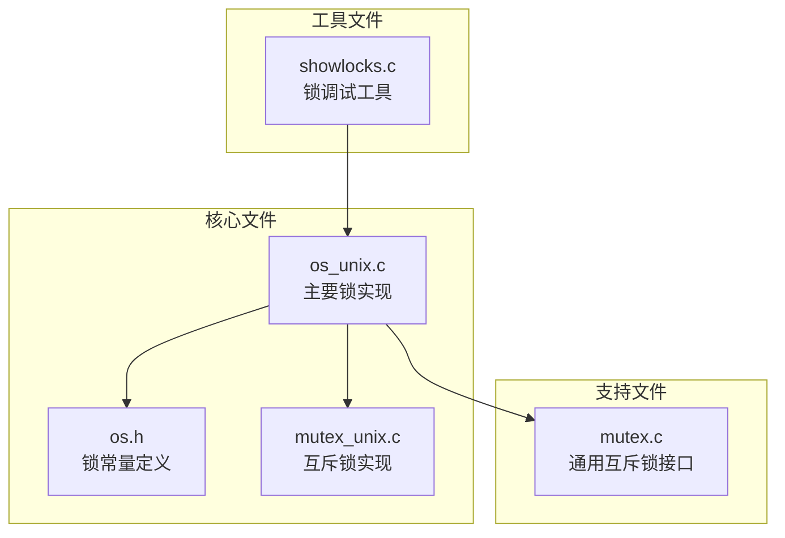
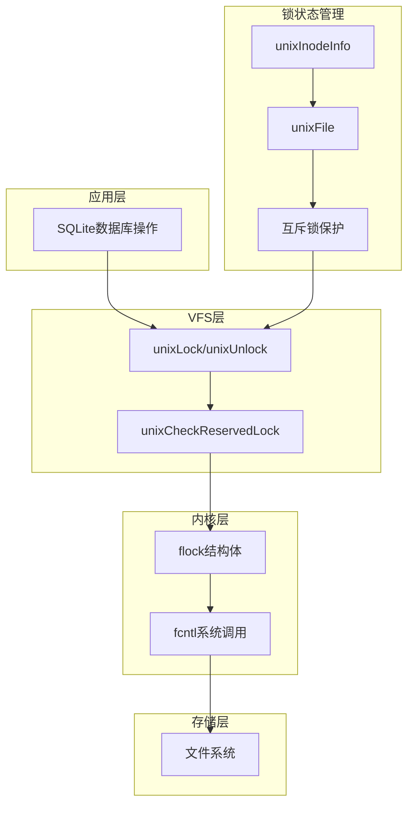
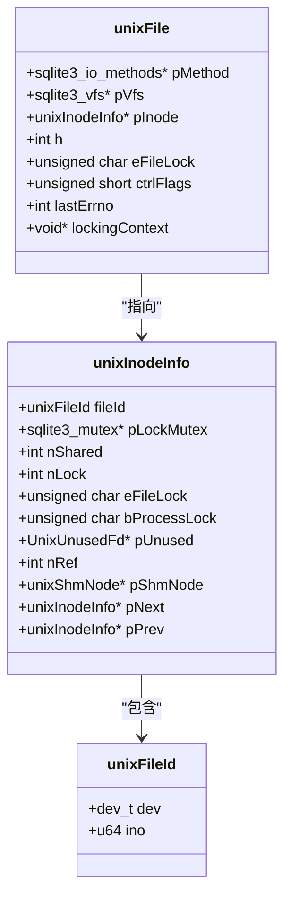
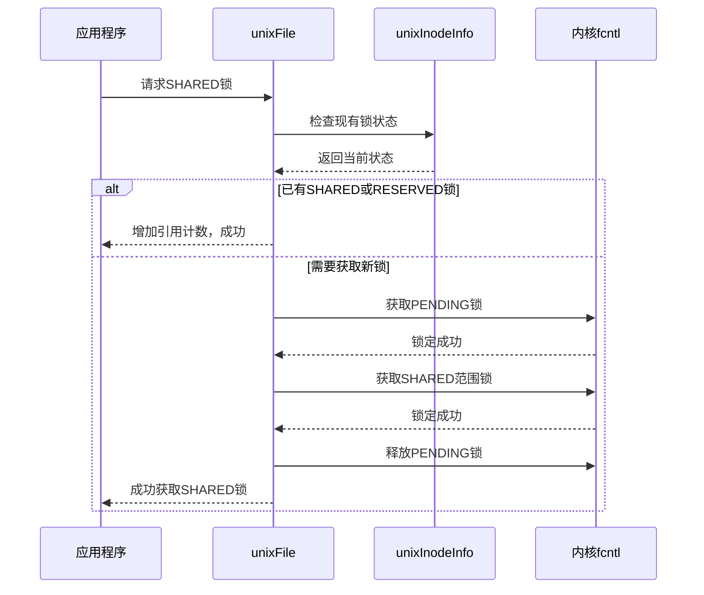
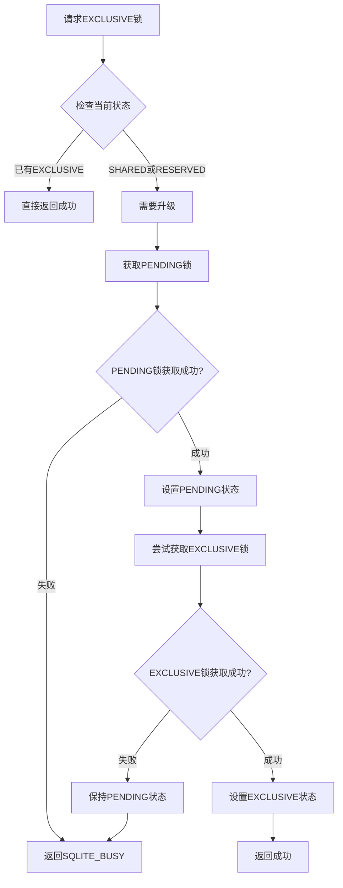
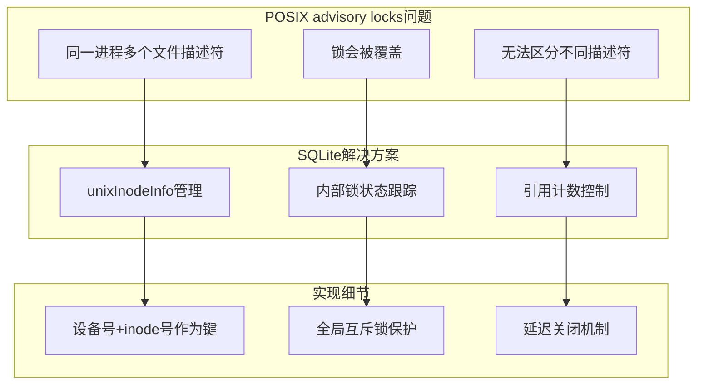
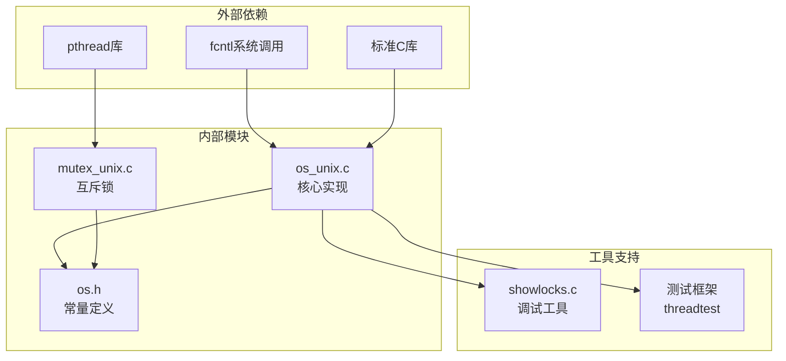

# Unix平台锁实现

<cite>
**本文档中引用的文件**
- [os_unix.c](file://src/os_unix.c)
- [os.h](file://src/os.h)
- [mutex_unix.c](file://src/mutex_unix.c)
- [mutex.c](file://src/mutex.c)
- [showlocks.c](file://tool/showlocks.c)
</cite>

## 目录
1. [简介](#简介)
2. [项目结构概述](#项目结构概述)
3. [核心组件分析](#核心组件分析)
4. [架构概览](#架构概览)
5. [详细组件分析](#详细组件分析)
6. [依赖关系分析](#依赖关系分析)
7. [性能考虑](#性能考虑)
8. [故障排除指南](#故障排除指南)
9. [结论](#结论)

## 简介

SQLite在Unix平台上实现了基于`fcntl()`系统调用的字节范围锁机制，这是一种POSIX advisory locks的实现方式。该机制通过精心设计的锁层次结构，支持并发读取和独占写入，同时解决了POSIX advisory locks固有的缺陷。

本文档深入分析了SQLite在Unix平台下的锁实现机制，重点关注SHARED锁如何通过随机字节锁定实现并发读取，EXCLUSIVE锁如何通过全范围锁定保证写入独占性，以及POSIX advisory locks的工作原理。

## 项目结构概述

SQLite的Unix锁实现主要集中在以下关键文件中：



**图表来源**
- [os_unix.c](file://src/os_unix.c#L1-L50)
- [os.h](file://src/os.h#L1-L30)

**章节来源**
- [os_unix.c](file://src/os_unix.c#L1-L100)
- [os.h](file://src/os.h#L1-L50)

## 核心组件分析

### 锁层次结构

SQLite的Unix锁实现采用分层的锁策略，包含以下层次：

| 锁类型 | 数值 | 描述 | 用途 |
|--------|------|------|------|
| NO_LOCK | 0 | 无锁 | 初始状态 |
| SHARED_LOCK | 1 | 共享锁 | 支持并发读取 |
| RESERVED_LOCK | 2 | 预留锁 | 准备升级到排他锁 |
| PENDING_LOCK | 3 | 待定锁 | 防止新共享锁获取 |
| EXCLUSIVE_LOCK | 4 | 排他锁 | 独占写入 |

### 字节范围锁定常量


**图表来源**
- [os.h](file://src/os.h#L147-L165)

**章节来源**
- [os.h](file://src/os.h#L100-L165)

## 架构概览

SQLite的Unix锁实现架构如下：



**图表来源**
- [os_unix.c](file://src/os_unix.c#L1745-L1940)
- [os_unix.c](file://src/os_unix.c#L1209-L1228)

## 详细组件分析

### lockInfo结构体分析

SQLite使用`unixInodeInfo`结构体来管理每个inode的锁状态：



**图表来源**
- [os_unix.c](file://src/os_unix.c#L256-L311)
- [os_unix.c](file://src/os_unix.c#L1209-L1228)

### SHARED锁实现机制

SHARED锁通过随机字节锁定实现并发读取：



**图表来源**
- [os_unix.c](file://src/os_unix.c#L1745-L1940)

### EXCLUSIVE锁实现机制

EXCLUSIVE锁通过全范围锁定保证写入独占性：



**图表来源**
- [os_unix.c](file://src/os_unix.c#L1745-L1940)

### POSIX advisory locks工作原理

POSIX advisory locks存在固有问题，SQLite通过内部状态管理来解决：



**图表来源**
- [os_unix.c](file://src/os_unix.c#L1074-L1145)

**章节来源**
- [os_unix.c](file://src/os_unix.c#L1745-L1940)
- [os_unix.c](file://src/os_unix.c#L1074-L1145)

### 多线程环境下的锁状态管理

SQLite在多线程环境下通过以下机制确保锁的安全性：


**图表来源**
- [os_unix.c](file://src/os_unix.c#L790-L800)
- [mutex_unix.c](file://src/mutex_unix.c#L37-L58)

**章节来源**
- [os_unix.c](file://src/os_unix.c#L790-L800)
- [mutex_unix.c](file://src/mutex_unix.c#L253-L341)

## 依赖关系分析

SQLite Unix锁实现的依赖关系图：



**图表来源**
- [os_unix.c](file://src/os_unix.c#L1-L100)
- [mutex_unix.c](file://src/mutex_unix.c#L1-L50)

**章节来源**
- [os_unix.c](file://src/os_unix.c#L1-L100)
- [mutex_unix.c](file://src/mutex_unix.c#L1-L50)

## 性能考虑

### 锁竞争优化

SQLite通过以下策略优化锁竞争：

1. **局部性原则**：优先在同一进程内复用锁
2. **延迟获取**：只在必要时才调用`fcntl()`
3. **批量操作**：合并多个锁操作
4. **超时机制**：避免无限等待

### 内存使用优化

- 使用引用计数减少锁结构体分配
- 实现延迟关闭机制避免资源泄漏
- 采用紧凑的数据结构减少内存占用

## 故障排除指南

### 常见锁问题及解决方案

| 问题类型 | 症状 | 可能原因 | 解决方案 |
|----------|------|----------|----------|
| 死锁 | 应用程序挂起 | 锁获取顺序错误 | 检查锁获取逻辑 |
| 锁竞争 | 性能下降 | 过度频繁的锁操作 | 优化事务边界 |
| 文件描述符泄漏 | 资源耗尽 | 锁未正确释放 | 检查异常处理 |
| 并发冲突 | SQLITE_BUSY错误 | 锁超时设置过短 | 调整超时参数 |

### 调试工具使用

`showlocks.c`工具可以帮助诊断锁问题：

```bash
# 编译调试工具
gcc -o showlocks tool/showlocks.c

# 显示文件上的所有锁
./showlocks database.db
```

**章节来源**
- [showlocks.c](file://tool/showlocks.c#L1-L50)

## 结论

SQLite在Unix平台下的字节范围锁实现是一个精心设计的并发控制系统。通过结合POSIX advisory locks的便利性和SQLite内部状态管理的精确性，成功解决了传统POSIX锁的固有问题。

该实现的主要优势包括：

1. **高并发性**：SHARED锁支持多个读者并发访问
2. **数据完整性**：EXCLUSIVE锁确保写入操作的原子性
3. **线程安全**：完善的多线程保护机制
4. **可扩展性**：灵活的锁状态管理架构
5. **兼容性**：广泛的Unix系统支持

这种设计使得SQLite能够在各种Unix环境中提供可靠的并发访问能力，同时保持简单高效的实现方式。