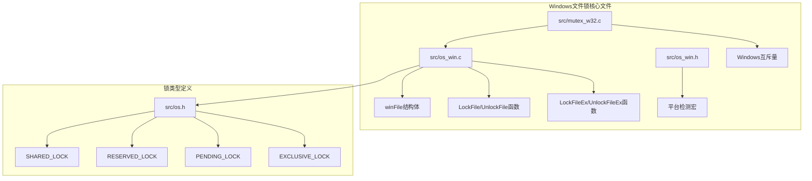
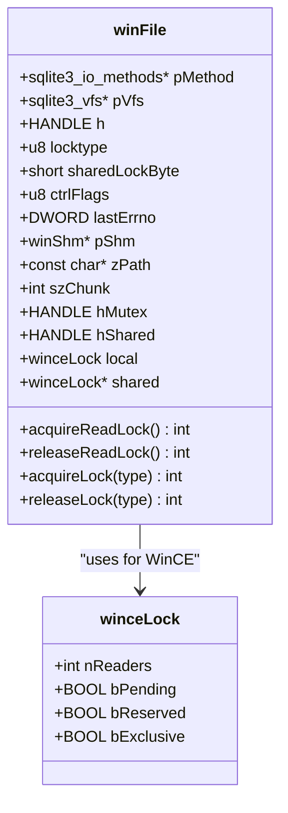
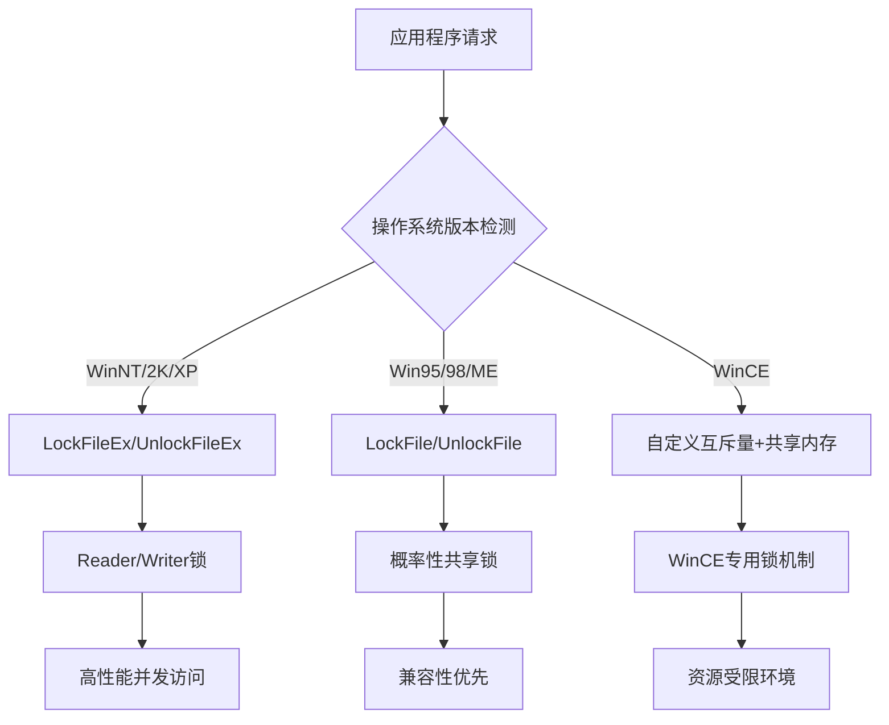
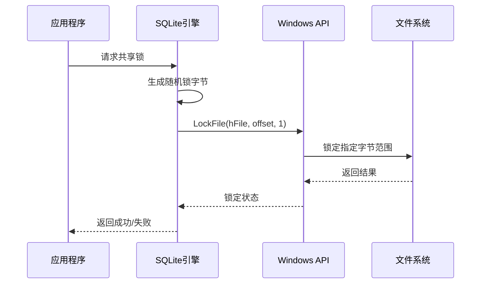
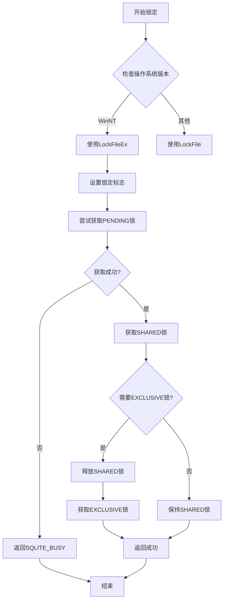
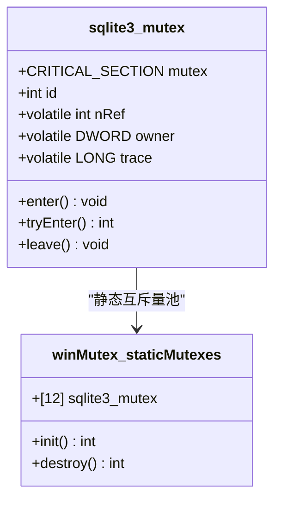
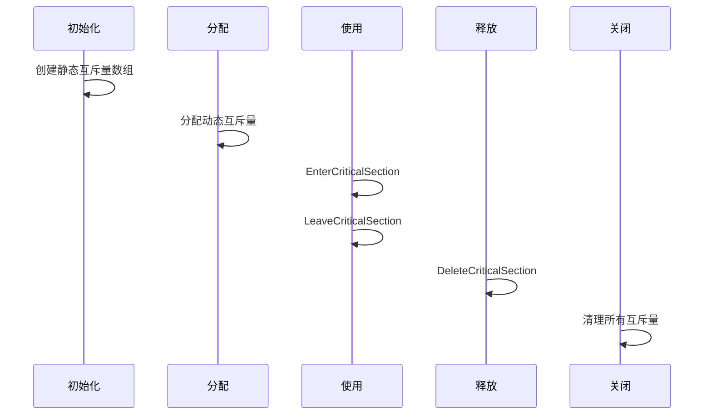
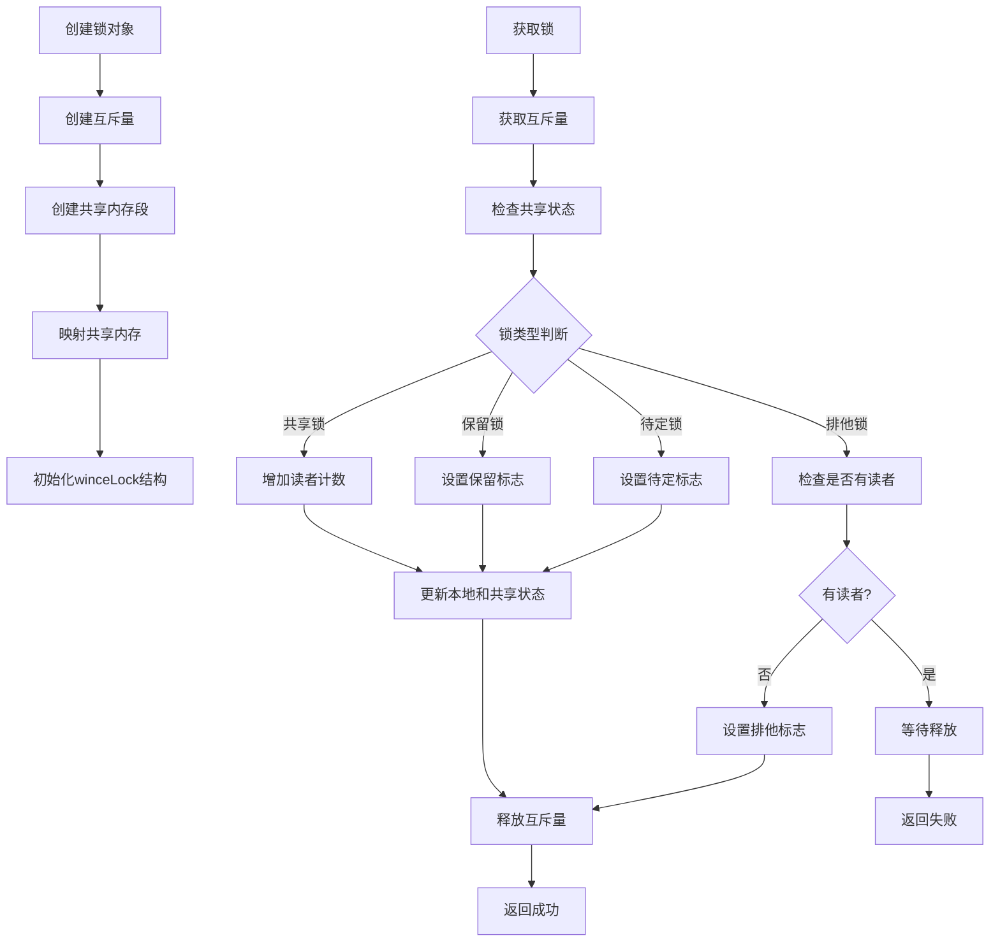
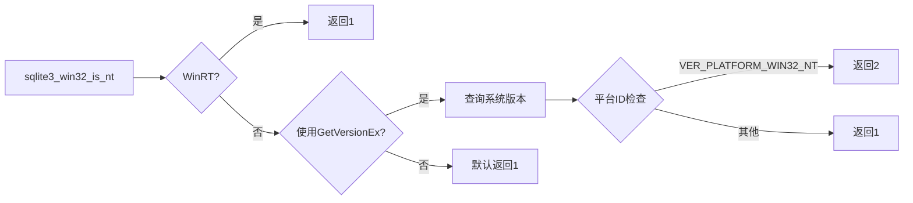
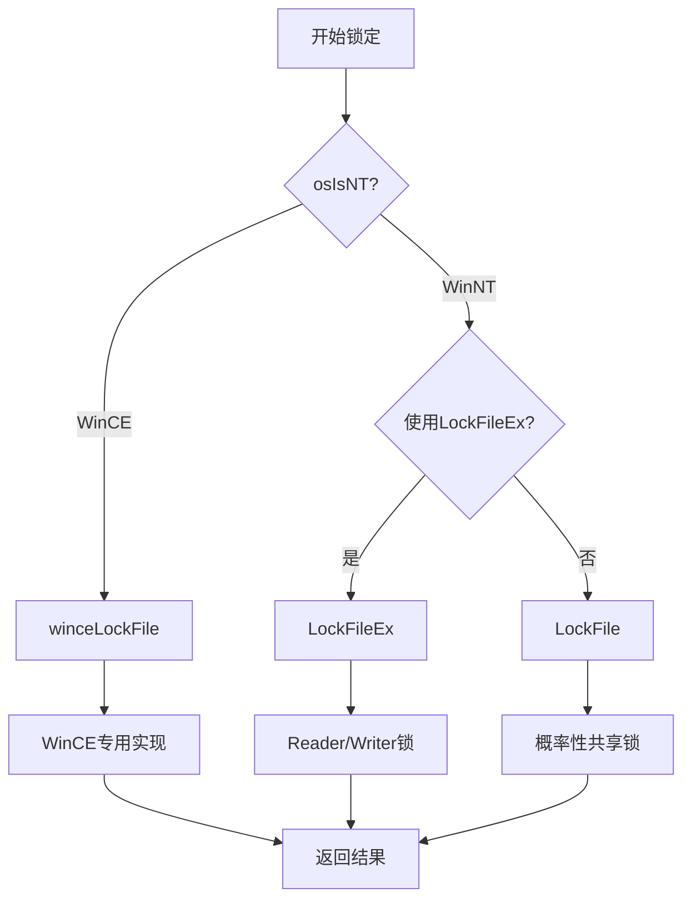

# Windows平台锁实现

<cite>
**本文档引用的文件**
- [src/os_win.c](file://src/os_win.c)
- [src/os_win.h](file://src/os_win.h)
- [src/os.h](file://src/os.h)
- [src/mutex_w32.c](file://src/mutex_w32.c)
</cite>

## 目录
1. [简介](#简介)
2. [项目结构概述](#项目结构概述)
3. [核心组件分析](#核心组件分析)
4. [架构概览](#架构概览)
5. [详细组件分析](#详细组件分析)
6. [依赖关系分析](#依赖关系分析)
7. [性能考虑](#性能考虑)
8. [故障排除指南](#故障排除指南)
9. [结论](#结论)

## 简介

SQLite在Windows平台上实现了复杂的文件锁定机制，以确保数据库文件在多进程环境下的安全访问。该实现支持多种Windows版本，从Win95到最新的WinNT系统，并针对不同平台特性提供了相应的优化策略。

Windows平台的文件锁定实现主要包含两个层次：基于字节范围的传统文件锁定和基于互斥量的高级同步机制。这种双重设计既保证了向后兼容性，又充分利用了现代Windows系统的功能。

## 项目结构概述

SQLite的Windows文件锁实现主要分布在以下关键文件中：

**图表来源**
- [src/os_win.c](file://src/os_win.c#L1-L100)
- [src/os_win.h](file://src/os_win.h#L1-L50)
- [src/os.h](file://src/os.h#L80-L100)

**章节来源**
- [src/os_win.c](file://src/os_win.c#L1-L200)
- [src/os_win.h](file://src/os_win.h#L1-L91)

## 核心组件分析

### winFile结构体

winFile是Windows平台文件操作的核心数据结构，其中包含了与文件锁定相关的关键字段：

**图表来源**
- [src/os_win.c](file://src/os_win.c#L280-L320)

#### 锁相关字段详解

1. **locktype字段**：表示当前持有的锁级别，取值为NO_LOCK、SHARED_LOCK、RESERVED_LOCK、PENDING_LOCK或EXCLUSIVE_LOCK
2. **sharedLockByte字段**：在Win9x系统中用于随机选择共享锁字节的位置
3. **hMutex字段**：Windows互斥量句柄，用于保护WinCE环境下的锁操作
4. **hShared字段**：共享内存段句柄，用于跨进程同步

**章节来源**
- [src/os_win.c](file://src/os_win.c#L280-L320)

## 架构概览

Windows文件锁实现采用分层架构设计，根据操作系统版本提供不同的锁定策略：

**图表来源**
- [src/os_win.c](file://src/os_win.c#L1537-L1584)
- [src/os_win.c](file://src/os_win.c#L3429-L3465)

## 详细组件分析

### 基本文件锁定操作

#### LockFile()和UnlockFile()实现

对于Win9x系统，SQLite使用传统的LockFile()和UnlockFile()函数：

**图表来源**
- [src/os_win.c](file://src/os_win.c#L3429-L3465)

#### LockFileEx()和UnlockFileEx()实现

在WinNT/2K/XP系统上，SQLite优先使用LockFileEx()实现更精细的读写锁控制：

**图表来源**
- [src/os_win.c](file://src/os_win.c#L3491-L3699)

**章节来源**
- [src/os_win.c](file://src/os_win.c#L3429-L3699)

### Windows互斥量实现

#### CRITICAL_SECTION互斥量

SQLite在Windows平台上使用CRITICAL_SECTION作为互斥量实现：

**图表来源**
- [src/mutex_w32.c](file://src/mutex_w32.c#L25-L45)

#### 互斥量生命周期管理

**图表来源**
- [src/mutex_w32.c](file://src/mutex_w32.c#L110-L180)

**章节来源**
- [src/mutex_w32.c](file://src/mutex_w32.c#L1-L400)

### WinCE特殊处理

#### 共享内存段实现

WinCE由于缺乏标准的文件锁定API，SQLite实现了基于共享内存的锁机制：

**图表来源**
- [src/os_win.c](file://src/os_win.c#L2400-L2513)

**章节来源**
- [src/os_win.c](file://src/os_win.c#L2400-L2602)

### 锁常量定义

#### 字节范围布局

SQLite在数据库文件中预留了特定的字节范围用于文件锁定：

| 常量 | 值 | 用途 |
|------|-----|------|
| PENDING_BYTE | 0x40000000 | 待定锁位置 |
| RESERVED_BYTE | PENDING_BYTE+1 | 保留锁位置 |
| SHARED_FIRST | PENDING_BYTE+2 | 共享锁起始位置 |
| SHARED_SIZE | 510 | 共享锁可用字节数 |

这些字节范围的设计确保了：
1. **向后兼容性**：与Unix系统使用相同的字节范围
2. **安全性**：避免在实际数据页中存储锁定信息
3. **效率**：所有锁信息可以容纳在单个页面内

**章节来源**
- [src/os.h](file://src/os.h#L135-L165)

## 依赖关系分析

### 平台检测机制

**图表来源**
- [src/os_win.c](file://src/os_win.c#L1537-L1584)

### API选择策略

SQLite根据操作系统版本自动选择合适的锁定API：

**图表来源**
- [src/os_win.c](file://src/os_win.c#L3429-L3465)

**章节来源**
- [src/os_win.c](file://src/os_win.c#L1537-L1584)

## 性能考虑

### 锁竞争优化

1. **重试机制**：在获取PENDING锁时最多重试3次，以应对索引软件和防病毒软件的干扰
2. **非阻塞策略**：大多数锁操作使用LOCKFILE_FAIL_IMMEDIATELY标志，避免长时间等待
3. **批量操作**：共享锁通过锁定整个范围来提高并发性能

### 内存使用优化

1. **静态互斥量池**：预分配12个静态互斥量，减少动态分配开销
2. **延迟初始化**：互斥量子系统采用延迟初始化策略
3. **智能指针**：使用智能指针管理共享内存段的生命周期

## 故障排除指南

### 常见问题诊断

#### 锁超时问题

当遇到SQLITE_BUSY错误时，可能的原因包括：
1. **防病毒软件干扰**：某些防病毒软件会临时锁定文件
2. **索引软件冲突**：数据库索引软件可能会干扰锁定操作
3. **网络文件系统延迟**：在UNC路径下访问数据库时可能出现延迟

#### WinCE环境问题

在WinCE环境下，常见的问题包括：
1. **共享内存创建失败**：检查可用内存和权限设置
2. **互斥量获取超时**：可能是系统资源不足
3. **锁状态不一致**：确保正确调用winceDestroyLock

**章节来源**
- [src/os_win.c](file://src/os_win.c#L3560-L3595)

## 结论

SQLite的Windows文件锁实现展现了优秀的跨平台设计理念。通过精心设计的分层架构，它成功地在不同Windows版本之间提供了统一的锁定接口，同时充分利用了各平台的特性和优势。

主要特点包括：

1. **向后兼容性**：支持从Win95到WinNT的所有Windows版本
2. **性能优化**：针对不同平台特性采用最优的锁定策略
3. **可靠性**：完善的错误处理和重试机制
4. **可维护性**：清晰的代码结构和详细的注释

这种实现不仅确保了SQLite在Windows平台上的稳定运行，也为其他需要跨平台文件锁定的应用程序提供了宝贵的参考。