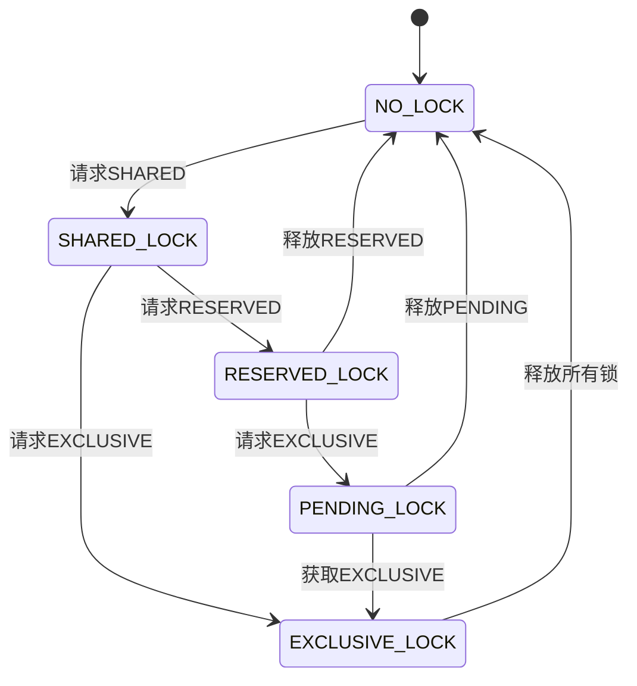
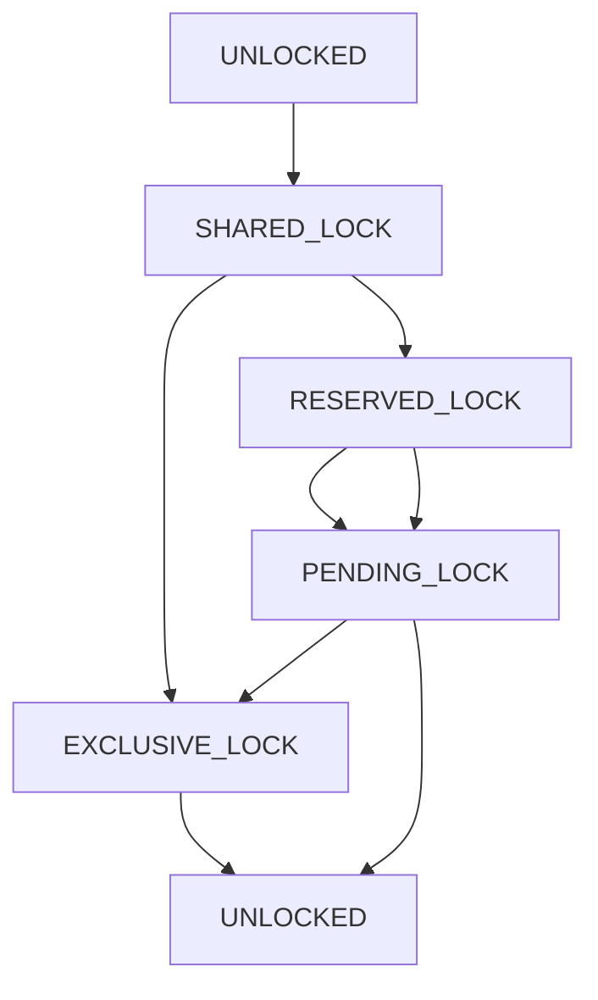
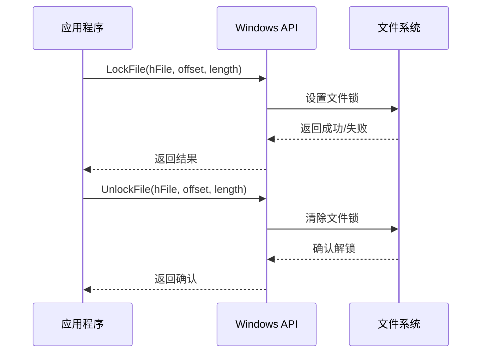
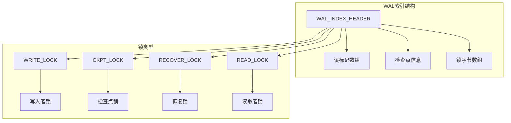
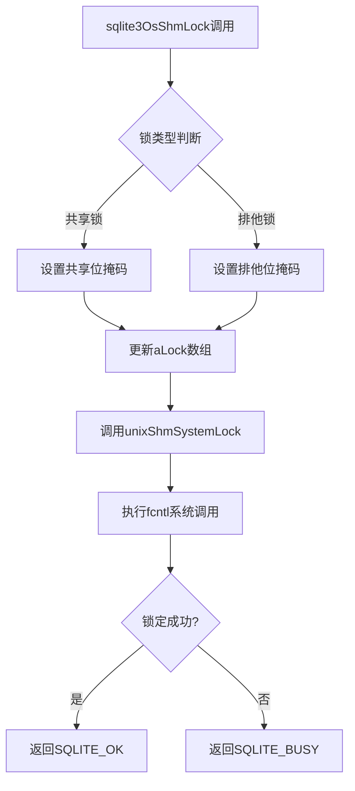
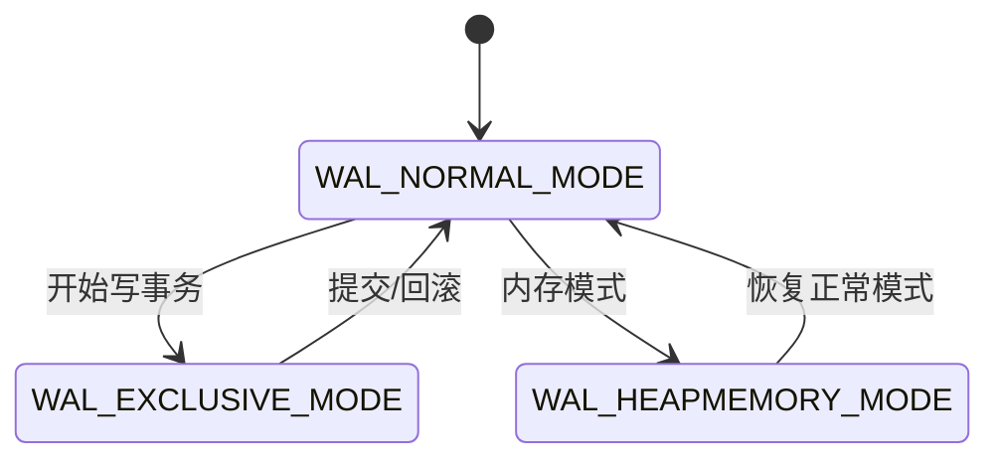
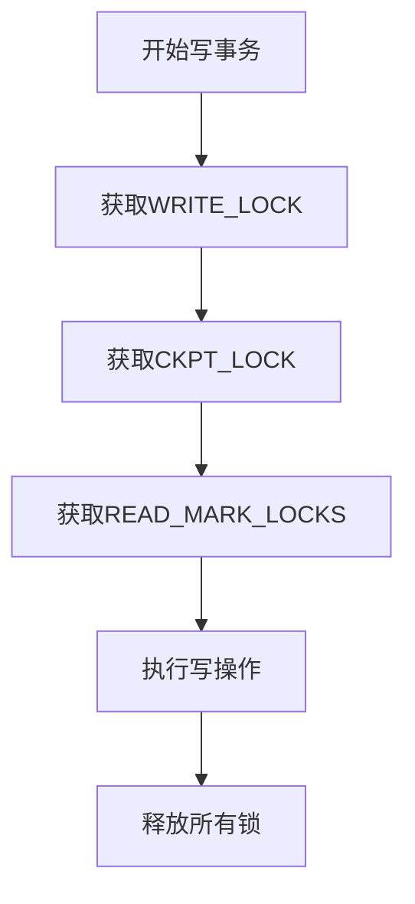

# SQLite锁管理机制深度解析

<cite>
**本文档引用的文件**
- [os.h](file://src/os.h)
- [os_unix.c](file://src/os_unix.c)
- [os_win.c](file://src/os_win.c)
- [wal.h](file://src/wal.h)
- [wal.c](file://src/wal.c)
- [os_common.h](file://src/os_common.h)
- [pager.h](file://src/pager.h)
- [doc/wal-lock.md](file://doc/wal-lock.md)
</cite>

## 目录
1. [引言](#引言)
2. [锁状态体系](#锁状态体系)
3. [跨平台锁实现](#跨平台锁实现)
4. [WAL模式下的共享内存锁](#wal模式下的共享内存锁)
5. [关键宏定义分析](#关键宏定义分析)
6. [死锁预防策略](#死锁预防策略)
7. [性能优化考虑](#性能优化考虑)
8. [故障排除指南](#故障排除指南)
9. [总结](#总结)

## 引言

SQLite采用了一套精密的跨平台锁管理系统来确保数据库文件在多进程环境下的数据一致性。该系统基于经典的"锁升级"机制，通过四种核心锁状态（SHARED、RESERVED、PENDING和EXCLUSIVE）实现细粒度的并发控制。本文档深入分析SQLite的锁管理机制，涵盖Unix和Windows平台的具体实现差异，以及WAL模式下的特殊处理。

## 锁状态体系

### 四种核心锁状态

SQLite的锁系统建立在以下四种基本锁状态之上：



**图表来源**
- [os.h](file://src/os.h#L80-L101)

#### SHARED_LOCK（共享锁）
- **语义**：允许多个进程同时持有共享锁
- **用途**：用于只读事务，允许多个读者并发访问
- **限制**：不能升级到EXCLUSIVE锁，必须先释放再重新获取

#### RESERVED_LOCK（保留锁）
- **语义**：单个进程可以持有的最高级别共享锁
- **用途**：为写操作做准备，防止其他进程获取新的共享锁
- **特点**：可以升级到PENDING或EXCLUSIVE锁

#### PENDING_LOCK（待定锁）
- **语义**：阻止新共享锁的获取，但允许现有共享锁继续存在
- **用途**：作为EXCLUSIVE锁获取过程中的中间状态
- **特点**：只能升级到EXCLUSIVE锁

#### EXCLUSIVE_LOCK（排他锁）
- **语义**：独占所有其他锁类型
- **用途**：执行写操作时的最终锁状态
- **特点**：完全禁止其他进程的任何访问

**章节来源**
- [os.h](file://src/os.h#L80-L101)

### 锁状态转换规则

锁状态转换遵循严格的顺序规则，确保数据一致性：



**图表来源**
- [os_unix.c](file://src/os_unix.c#L1721-L1753)

## 跨平台锁实现

### Unix系统实现

Unix系统使用POSIX Advisory Locks实现文件锁定：

#### 字节范围锁机制

SQLite在数据库文件中定义了特定的字节范围用于锁管理：

| 宏定义 | 偏移量 | 大小 | 用途 |
|--------|--------|------|------|
| PENDING_BYTE | 默认值：0x40000000 | 1字节 | 待定锁位置 |
| RESERVED_BYTE | PENDING_BYTE+1 | 1字节 | 保留锁位置 |
| SHARED_FIRST | PENDING_BYTE+2 | 510字节 | 共享锁池起始位置 |
| SHARED_SIZE | 510字节 | 510字节 | 共享锁池大小 |

#### 锁获取算法

Unix平台的锁获取遵循以下步骤：

1. **SHARED锁获取**：
   - 首先尝试获取PENDING_BYTE的读锁
   - 成功后获取SHARED_FIRST到SHARED_FIRST+SHARED_SIZE的读锁
   - 最后释放PENDING_BYTE锁

2. **RESERVED锁获取**：
   - 必须先持有SHARED锁
   - 获取RESERVED_BYTE的写锁

3. **EXCLUSIVE锁获取**：
   - 可以从SHARED或RESERVED锁升级
   - 直接获取整个SHARED区域的写锁

**章节来源**
- [os_unix.c](file://src/os_unix.c#L1721-L1777)

### Windows系统实现

Windows系统使用不同的锁机制，主要区别在于：

#### LockFile API

Windows使用LockFile和UnlockFile函数进行文件锁定：



**图表来源**
- [os_win.c](file://src/os_win.c#L3491-L3527)

#### 平台兼容性处理

Windows系统区分不同版本的操作系统：

- **Win95/98/ME**：仅支持LockFile/UnlockFile，使用概率性锁策略
- **WinNT/2K/XP及更高版本**：支持LockFileEx/UnlockFileEx，支持读写锁分离

**章节来源**
- [os.h](file://src/os.h#L103-L128)

## WAL模式下的共享内存锁

### WAL锁架构

Write-Ahead Logging (WAL) 模式引入了专门的共享内存锁机制：



**图表来源**
- [wal.c](file://src/wal.c#L4452-L4493)

### shmLock实现机制

共享内存锁通过以下方式实现：

#### Unix平台shmLock



**图表来源**
- [os_unix.c](file://src/os_unix.c#L5018-L5049)

#### Windows平台shmLock

Windows平台使用互斥量和共享内存实现：

- **互斥量保护**：每个锁槽都有独立的互斥量
- **原子操作**：使用Interlocked系列函数保证线程安全
- **超时机制**：支持可配置的阻塞等待时间

**章节来源**
- [os_win.c](file://src/os_win.c#L4555-L4580)

### WAL锁状态图

WAL模式下的锁状态转换更加复杂：



**图表来源**
- [wal.c](file://src/wal.c#L4452-L4493)

## 关键宏定义分析

### PENDING_BYTE和SHARED_SIZE的重要性

这两个宏定义对并发性能有重大影响：

#### PENDING_BYTE的作用

- **默认位置**：通常设置在1GB边界之后
- **设计目的**：避免与实际数据页冲突
- **性能考虑**：过低的位置可能导致页面跳过逻辑频繁触发

#### SHARED_SIZE的优化

- **当前值**：510字节
- **历史背景**：最初设计为支持Windows95的随机选择
- **现代意义**：足够容纳多个并发读者而不产生冲突

### 宏定义对性能的影响

| 宏定义 | 性能影响 | 推荐值 | 说明 |
|--------|----------|--------|------|
| PENDING_BYTE | 页面布局 | 0x40000000+ | 避免与数据页重叠 |
| SHARED_SIZE | 并发度 | 510字节 | 支持最多510个并发读者 |
| SQLITE_SHM_NLOCK | WAL并发度 | 8 | WAL读锁数量 |

**章节来源**
- [os.h](file://src/os.h#L126-L148)

## 死锁预防策略

### 锁排序原则

SQLite严格遵循锁排序原则来预防死锁：

#### 基本规则

1. **层级化锁**：按SHARED→RESERVED→PENDING→EXCLUSIVE顺序获取
2. **避免循环等待**：不同时持有多个锁层级
3. **及时释放**：完成操作后立即释放锁

#### WAL模式特殊处理

WAL模式下的锁排序更加严格：



**图表来源**
- [doc/wal-lock.md](file://doc/wal-lock.md#L41-L68)

### 超时和重试机制

#### SQLITE_ENABLE_SETLK_TIMEOUT

该编译选项启用阻塞锁功能：

- **优点**：减少轮询开销，提高优先级转移效率
- **缺点**：可能增加响应延迟
- **适用场景**：高优先级进程需要等待低优先级进程的情况

#### 死锁检测

操作系统层面的死锁检测：

- **Unix**：依赖内核的死锁检测机制
- **Windows**：使用超时机制自动解除死锁

**章节来源**
- [doc/wal-lock.md](file://doc/wal-lock.md#L0-L88)

## 性能优化考虑

### 锁竞争缓解

#### 共享锁池优化

- **随机选择**：Windows95兼容性要求
- **现代改进**：大多数现代系统不再需要随机选择
- **性能提升**：固定选择第一个可用字节可减少竞争

#### WAL模式优势

WAL模式相比传统日志模式具有更好的并发性能：

- **读写分离**：读操作不影响写操作
- **无锁读取**：多个读取者可以同时访问
- **批量写入**：写操作可以批量处理

### 内存映射优化

共享内存的内存映射优化：

- **Unix**：使用mmap系统调用
- **Windows**：使用CreateFileMapping API
- **缓存策略**：合理设置缓存大小

**章节来源**
- [wal.c](file://src/wal.c#L1071-L1105)

## 故障排除指南

### 常见锁问题

#### SQLITE_BUSY错误

最常见的锁相关错误：

1. **临时性问题**：通常是由于其他进程持有锁
2. **永久性问题**：可能是死锁或资源泄漏
3. **解决方案**：使用忙处理器回调或增加超时时间

#### WAL模式问题

WAL模式特有的问题：

- **共享内存损坏**：检查shm文件完整性
- **锁超时**：调整超时参数
- **并发冲突**：优化事务粒度

### 调试技巧

#### 启用调试输出

```c
// 编译时定义
#define SQLITE_DEBUG 1
#define SQLITE_ENABLE_IOTRACE 1
```

#### 锁状态监控

使用工具监控锁状态：

- **showlocks工具**：显示当前锁状态
- **strace**：跟踪系统调用
- **Process Monitor**：Windows上的类似工具

**章节来源**
- [os_unix.c](file://src/os_unix.c#L4485-L4534)

## 总结

SQLite的锁管理机制是一个精心设计的系统，它：

1. **跨平台兼容**：统一的API接口，底层适配不同操作系统
2. **高性能并发**：通过WAL模式和共享内存锁实现高并发访问
3. **容错性强**：完善的错误处理和恢复机制
4. **可配置灵活**：支持多种锁策略和超时设置

理解这些机制对于：
- 数据库应用开发人员优化并发性能
- 数据库管理员诊断锁相关问题
- SQLite贡献者改进系统设计

都具有重要意义。随着多核处理器和分布式系统的普及，SQLite的锁管理机制将继续演进，以适应新的挑战和需求。