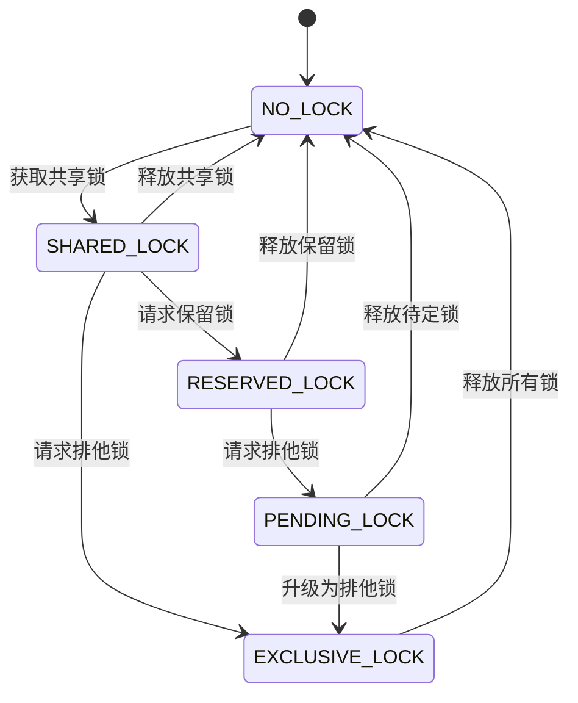
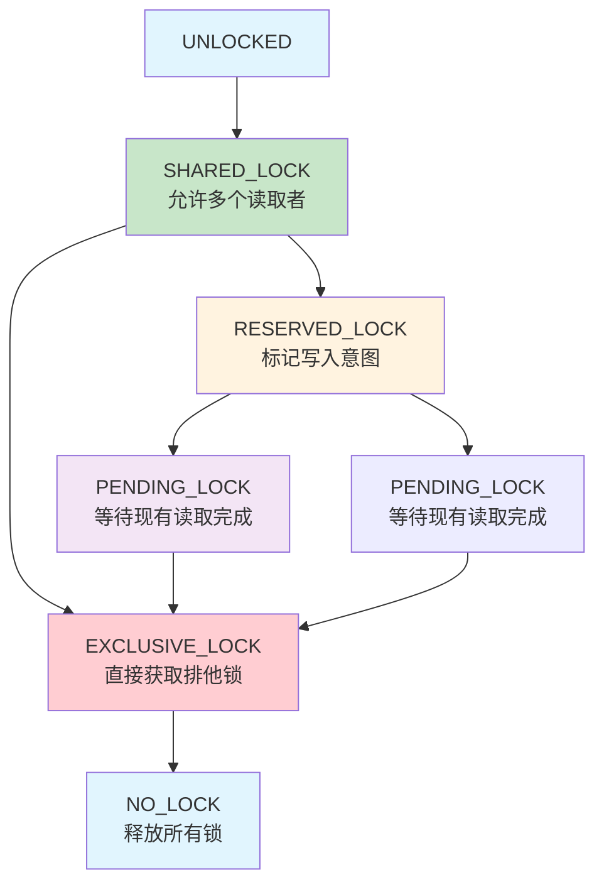
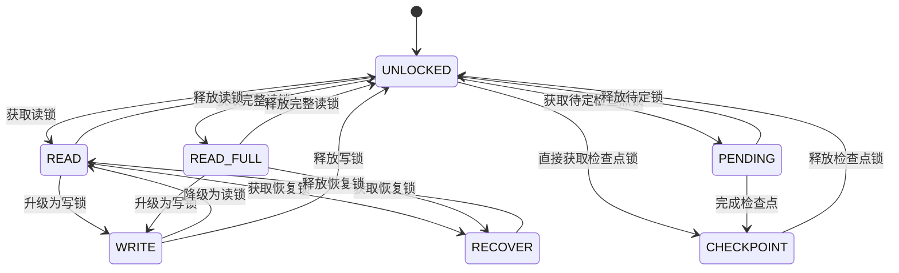
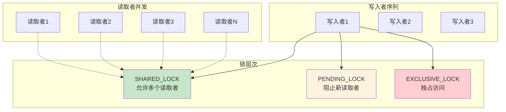
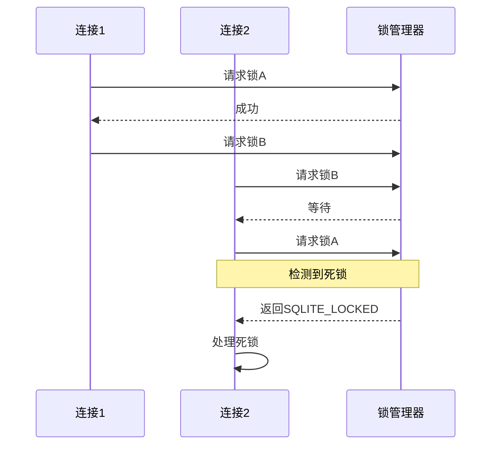
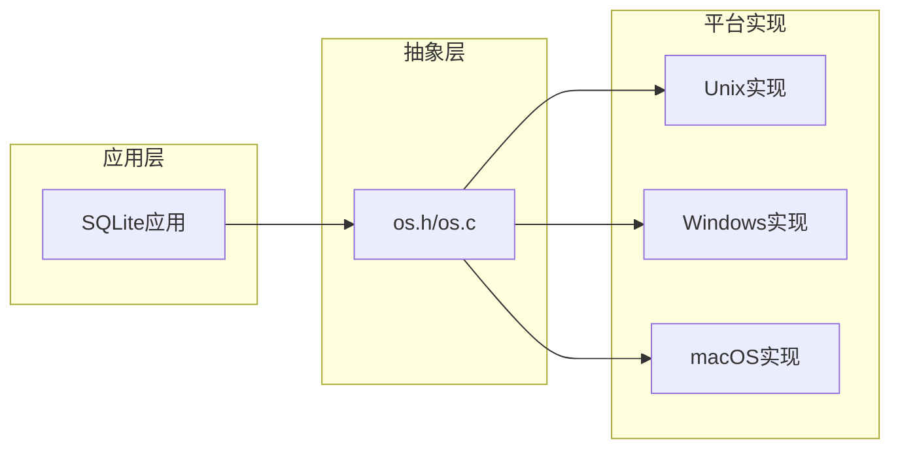

# 锁类型与状态

<cite>
**本文档中引用的文件**
- [os.h](file://src/os.h)
- [os_unix.c](file://src/os_unix.c)
- [os_win.c](file://src/os_win.c)
- [pager.c](file://src/pager.c)
- [vfs-shm.txt](file://doc/vfs-shm.txt)
- [pager-invariants.txt](file://doc/pager-invariants.txt)
- [wal-lock.md](file://doc/wal-lock.md)
</cite>

## 目录
1. [简介](#简介)
2. [锁状态概述](#锁状态概述)
3. [核心锁状态详解](#核心锁状态详解)
4. [锁状态转换机制](#锁状态转换机制)
5. [WAL模式下的锁状态](#wal模式下的锁状态)
6. [并发控制与事务隔离](#并发控制与事务隔离)
7. [平台特定实现](#平台特定实现)
8. [性能考虑](#性能考虑)
9. [故障排除指南](#故障排除指南)
10. [总结](#总结)

## 简介

SQLite采用了一套精密的锁机制来确保数据库的一致性和并发安全性。该系统基于五种基本锁状态：NO_LOCK、SHARED_LOCK、RESERVED_LOCK、PENDING_LOCK和EXCLUSIVE_LOCK。这些锁状态协同工作，实现了高效的并发控制和事务隔离。

本文档深入分析SQLite中五种核心锁状态的语义、转换规则以及它们在并发控制中的作用，特别关注SHARED锁允许多个读取者、RESERVED锁标记写入意图、PENDING锁阻塞新读取者以及EXCLUSIVE锁独占访问的机制。

## 锁状态概述

SQLite的锁系统建立在POSIX和Windows文件锁定原语之上，通过字节级别的锁定实现细粒度的并发控制。系统定义了以下五种主要锁状态：



**图表来源**
- [os.h](file://src/os.h#L80-L101)
- [os_unix.c](file://src/os_unix.c#L1721-L1753)

**章节来源**
- [os.h](file://src/os.h#L80-L101)

## 核心锁状态详解

### NO_LOCK（无锁）

NO_LOCK是SQLite中最低级别的锁状态，表示没有任何锁被持有。在这种状态下，数据库文件可以被任何进程自由访问。

**特性：**
- 数据库文件完全开放
- 没有任何并发限制
- 可以立即开始读取或写入操作
- 默认初始状态

### SHARED_LOCK（共享锁）

SHARED_LOCK允许多个进程同时持有，是SQLite中最宽松的锁类型。它用于支持并发读取操作。

**语义特征：**
- **允许多个读者**：任意数量的进程可以同时持有SHARED_LOCK
- **互斥于写入**：当有SHARED_LOCK存在时，不能获取RESERVED_LOCK或EXCLUSIVE_LOCK
- **兼容性**：多个SHARED_LOCK可以共存
- **实现机制**：通过锁定共享字节范围（510字节）实现

**并发行为：**
- 允许多个读取者同时访问数据库
- 阻止新的写入者进入
- 不影响现有读取者的继续操作

### RESERVED_LOCK（保留锁）

RESERVED_LOCK标记一个进程准备进行写入操作，但尚未开始实际修改数据。它是从读取到写入的过渡状态。

**语义特征：**
- **单进程独占**：同一时间只能有一个进程持有RESERVED_LOCK
- **写入意图**：表明进程准备进行写入操作
- **阻塞新读者**：阻止新的SHARED_LOCK获取
- **允许现有读者**：不影响已经持有的SHARED_LOCK

**转换规则：**
- 必须先获得SHARED_LOCK才能获取RESERVED_LOCK
- 一旦获得RESERVED_LOCK，可以升级为EXCLUSIVE_LOCK
- 可以降级为SHARED_LOCK

### PENDING_LOCK（待定锁）

PENDING_LOCK是一个特殊的中间状态，用于协调从读取到写入的转换过程。它阻止新的读取者，但允许现有读取者完成当前操作。

**语义特征：**
- **单进程待定**：同一时间只能有一个进程持有PENDING_LOCK
- **阻塞新读者**：阻止新的SHARED_LOCK获取
- **允许现有读者**：现有SHARED_LOCK可以继续
- **写入准备**：为获取EXCLUSIVE_LOCK做准备

**转换机制：**
- 从RESERVED_LOCK升级EXCLUSIVE_LOCK时需要先获取PENDING_LOCK
- 从SHARED_LOCK直接升级EXCLUSIVE_LOCK时也需要PENDING_LOCK
- PENDING_LOCK完成后可以升级为EXCLUSIVE_LOCK

### EXCLUSIVE_LOCK（排他锁）

EXCLUSIVE_LOCK是最严格的锁类型，确保数据库文件的独占访问。它防止任何其他进程访问数据库。

**语义特征：**
- **完全独占**：阻止所有其他锁的获取
- **写入权限**：允许对数据库进行任意修改
- **事务完整性**：确保事务的原子性和一致性
- **强制性**：必须持有EXCLUSIVE_LOCK才能修改数据库

**使用场景：**
- 开始写入事务
- 执行数据库维护操作
- 进行数据库备份
- 修改数据库结构

**章节来源**
- [os.h](file://src/os.h#L80-L101)
- [os_unix.c](file://src/os_unix.c#L1721-L1753)

## 锁状态转换机制

SQLite的锁状态转换遵循严格的顺序规则，确保并发安全和数据一致性。转换过程涉及多个中间状态和复杂的同步机制。

### 转换规则概览



**图表来源**
- [os_unix.c](file://src/os_unix.c#L1721-L1753)
- [os_win.c](file://src/os_win.c#L4582-L4604)

### 详细转换流程

#### 从UNLOCKED到SHARED_LOCK
1. **检查现有锁**：确认没有其他进程持有更高优先级的锁
2. **获取PENDING_LOCK**：临时锁定PENDING_BYTE字节
3. **获取SHARED_LOCK**：锁定SHARED_FIRST开始的510字节范围
4. **释放PENDING_LOCK**：完成转换后释放临时锁

#### 从SHARED_LOCK到RESERVED_LOCK
1. **验证当前状态**：确认持有SHARED_LOCK
2. **获取RESERVED_LOCK**：锁定RESERVED_BYTE字节
3. **更新状态**：标记写入意图

#### 从SHARED_LOCK到EXCLUSIVE_LOCK
1. **获取PENDING_LOCK**：阻止新读取者
2. **尝试获取EXCLUSIVE_LOCK**：锁定整个共享字节范围
3. **处理冲突**：如果失败，保持PENDING_LOCK状态

#### 从RESERVED_LOCK到EXCLUSIVE_LOCK
1. **获取PENDING_LOCK**：确保没有活跃的读取者
2. **升级为EXCLUSIVE_LOCK**：锁定整个数据库文件
3. **清理状态**：更新内部锁状态

### 平台特定实现差异

不同操作系统平台对锁状态转换有不同的实现方式：

#### Unix系统实现
- 使用POSIX文件锁定（flock）
- 基于字节范围的细粒度锁定
- 支持共享锁和排他锁的混合使用

#### Windows系统实现
- 使用Windows文件锁定API
- 支持基于扇区的锁定
- 实现兼容性层以支持多种锁定策略

**章节来源**
- [os_unix.c](file://src/os_unix.c#L1721-L1753)
- [os_win.c](file://src/os_win.c#L4582-L4604)

## WAL模式下的锁状态

Write-Ahead Logging (WAL) 模式引入了额外的锁状态来管理日志文件的并发访问。这些状态专门用于WAL索引文件的锁定管理。

### WAL锁状态层次



**图表来源**
- [vfs-shm.txt](file://doc/vfs-shm.txt#L41-L68)

### WAL锁状态详解

#### UNLOCKED（未锁定）
- WAL索引文件不处于使用状态
- 所有WAL相关操作都可以开始

#### READ（读取锁）
- 正在读取WAL索引文件的部分内容
- 可以追加新的WAL索引信息
- 新追加的内容对当前持有者不可见

#### READ_FULL（完整读取锁）
- 正在读取整个WAL索引文件
- 不能添加新的WAL索引信息
- 持有者承诺不会读取数据库文件中已存在于WAL索引中的页面

#### WRITE（写入锁）
- 可以向WAL索引文件追加内容
- 可以调整头部指示新的"最后有效帧"
- 不能修改WAL索引文件本身（除了头部）

#### PENDING（待定锁）
- 等待所有READ锁清除以便获取CHECKPOINT锁
- 阻止新的读取操作
- 允许现有读取操作完成

#### CHECKPOINT（检查点锁）
- 可以将WAL数据写入数据库文件
- 可以清零WAL索引头部的最后有效帧字段
- 不能修改WAL索引文件本身（除了清零最后有效帧字段）

#### RECOVER（恢复锁）
- 在WAL索引恢复期间持有
- 防止多个客户端同时恢复WAL索引时的竞争条件

### WAL锁转换规则

WAL模式下的锁转换遵循严格的规则以确保数据一致性：

| 原始状态 | 请求操作 | 新状态 |
|---------|---------|--------|
| UNLOCKED | READ | READ 或 READ_FULL |
| UNLOCKED | CHECKPOINT | PENDING 或 CHECKPOINT |
| READ | UNLOCK | UNLOCKED |
| READ | WRITE | WRITE |
| READ | RECOVER | RECOVER |
| READ_FULL | UNLOCK | UNLOCKED |
| READ_FULL | WRITE | WRITE |
| READ_FULL | RECOVER | RECOVER |
| WRITE | READ | READ |
| PENDING | UNLOCK | UNLOCKED |
| PENDING | CHECKPOINT | CHECKPOINT |
| CHECKPOINT | UNLOCK | UNLOCKED |
| RECOVER | READ | READ |

**章节来源**
- [vfs-shm.txt](file://doc/vfs-shm.txt#L41-L129)

## 并发控制与事务隔离

SQLite的锁机制设计旨在实现有效的并发控制和事务隔离，同时保持高性能和简单性。

### 并发模型



**图表来源**
- [os.h](file://src/os.h#L80-L101)
- [pager.c](file://src/pager.c#L1148-L1170)

### 事务隔离级别

SQLite提供以下事务隔离保证：

#### 读取一致性
- **SHARED_LOCK要求**：读取操作必须持有SHARED_LOCK
- **快照隔离**：读取操作看到的是事务开始时的数据快照
- **并发读取**：多个读取者可以同时访问相同的数据

#### 写入保护
- **EXCLUSIVE_LOCK要求**：写入操作必须持有EXCLUSIVE_LOCK
- **排他访问**：写入期间阻止所有其他访问
- **原子性保证**：事务要么全部成功，要么全部失败

#### 并发限制
- **读写互斥**：读取和写入操作不能同时进行
- **写写互斥**：多个写入操作必须序列化
- **读读兼容**：多个读取操作可以并发执行

### 死锁检测与预防

SQLite实现了死锁检测机制来处理复杂的锁竞争情况：



**图表来源**
- [notify.c](file://src/notify.c#L175-L207)

**章节来源**
- [pager.c](file://src/pager.c#L1148-L1170)
- [notify.c](file://src/notify.c#L175-L207)

## 平台特定实现

SQLite在不同操作系统平台上采用了不同的锁实现策略，以充分利用各平台的特性和优化性能。

### Unix系统实现

Unix系统使用POSIX文件锁定API实现细粒度的锁控制：

#### 字节级锁定
- **PENDING_BYTE**：待定锁字节（偏移量PENDING_BYTE）
- **RESERVED_BYTE**：保留锁字节（偏移量RESERVED_BYTE）
- **SHARED_FIRST**：共享锁起始位置（偏移量SHARED_FIRST）
- **SHARED_SIZE**：共享锁字节范围大小（默认510字节）

#### 锁定策略
- **共享锁**：锁定随机选择的共享字节范围
- **保留锁**：锁定指定的保留字节
- **排他锁**：锁定整个共享字节范围

### Windows系统实现

Windows系统提供了多种锁定策略以适应不同的环境：

#### 文件级锁定
- **LockFileEx/UnlockFileEx**：现代Windows系统的推荐API
- **LockFile/UnlockFile**：兼容旧版Windows系统
- **扇区级锁定**：基于磁盘扇区的锁定

#### 锁定层次
- **恢复锁**（偏移量2）
- **检查点锁**（偏移量1）
- **写入锁**（偏移量0）
- **读取锁**（偏移量≥3）

### 跨平台兼容性

SQLite通过抽象层确保跨平台的一致性：



**图表来源**
- [os_unix.c](file://src/os_unix.c#L1721-L1753)
- [os_win.c](file://src/os_win.c#L4582-L4604)

**章节来源**
- [os_unix.c](file://src/os_unix.c#L1721-L1753)
- [os_win.c](file://src/os_win.c#L4582-L4604)

## 性能考虑

锁机制的设计直接影响SQLite的性能表现。理解各种锁状态的性能特征对于优化应用程序至关重要。

### 锁开销分析

| 锁状态 | 获取开销 | 维护开销 | 并发度 | 适用场景 |
|-------|---------|---------|--------|----------|
| NO_LOCK | 极低 | 极低 | 最高 | 临时内存数据库 |
| SHARED_LOCK | 低 | 低 | 高 | 多读少写场景 |
| RESERVED_LOCK | 中等 | 中等 | 中等 | 准备写入 |
| PENDING_LOCK | 中等 | 中等 | 低 | 过渡状态 |
| EXCLUSIVE_LOCK | 高 | 高 | 最低 | 独占写入 |

### 性能优化策略

#### 读取优化
- **长共享锁**：保持SHARED_LOCK直到事务结束
- **批量读取**：减少锁获取和释放的频率
- **连接池**：重用数据库连接避免重复锁定

#### 写入优化
- **延迟写入**：推迟到事务结束时才获取EXCLUSIVE_LOCK
- **批量操作**：合并多个写入操作减少锁竞争
- **写入调度**：避免在高峰期进行大量写入

#### 并发调优
- **锁超时设置**：合理配置sqlite3_busy_timeout
- **重试机制**：实现指数退避的重试策略
- **死锁预防**：按固定顺序获取锁

### 内存使用优化

锁状态信息占用的内存相对较少，但累积效应不容忽视：

- **每个文件句柄**：约16字节用于锁状态跟踪
- **每个进程**：根据连接数线性增长
- **WAL模式**：额外的共享内存映射

## 故障排除指南

理解和诊断SQLite锁相关问题对于维护数据库应用至关重要。

### 常见问题诊断

#### SQLITE_BUSY错误
**症状**：应用程序收到SQLITE_BUSY错误
**原因**：
- 数据库被其他进程锁定
- 死锁情况
- 锁超时设置过短

**解决方案**：
- 增加busy_timeout值
- 检查是否有长时间运行的事务
- 实现重试逻辑

#### 死锁检测
**症状**：应用程序陷入循环等待
**诊断方法**：
- 启用调试模式观察锁状态
- 检查连接列表中的阻塞关系
- 分析锁请求的时间戳

**解决策略**：
- 实现超时机制
- 重新排序锁获取顺序
- 简化事务逻辑

#### 性能问题
**症状**：数据库响应缓慢
**可能原因**：
- 频繁的锁竞争
- 过长的事务持续时间
- 不合理的锁超时设置

**优化建议**：
- 减少事务持续时间
- 使用适当的锁超时值
- 考虑使用WAL模式

### 调试工具和技术

#### 锁状态监控
```sql
-- 检查数据库锁定状态
PRAGMA lock_status;

-- 查看WAL模式状态
PRAGMA journal_mode;
PRAGMA wal_checkpoint;
```

#### 日志分析
- 启用OSTRACE宏收集锁事件
- 分析锁获取和释放的时间戳
- 监控锁竞争频率

#### 性能分析
- 使用strace（Unix）或Process Monitor（Windows）跟踪系统调用
- 分析锁等待时间分布
- 监控CPU和I/O使用率

**章节来源**
- [pager.c](file://src/pager.c#L3915-L3960)
- [notify.c](file://src/notify.c#L175-L207)

## 总结

SQLite的锁机制是一套精心设计的并发控制系统，通过五种核心锁状态（NO_LOCK、SHARED_LOCK、RESERVED_LOCK、PENDING_LOCK、EXCLUSIVE_LOCK）实现了高效的数据并发访问控制。

### 关键要点

1. **分层锁架构**：从NO_LOCK到EXCLUSIVE_LOCK的渐进式锁升级确保了数据一致性和并发性之间的平衡
2. **读写分离**：SHARED_LOCK允许多个读取者并发访问，而写入操作需要独占访问
3. **中间状态**：PENDING_LOCK作为读写转换的桥梁，确保平滑的状态迁移
4. **平台适配**：针对不同操作系统采用最优的实现策略
5. **WAL扩展**：在WAL模式下引入额外的锁状态以支持高效的并发写入

### 设计优势

- **简单性**：清晰的锁状态定义和转换规则
- **可靠性**：经过充分测试的并发控制机制
- **性能**：最小化的锁开销和高效的并发处理
- **兼容性**：跨平台的一致行为

### 最佳实践建议

1. **合理设置超时**：根据应用需求配置适当的busy_timeout值
2. **优化事务**：保持事务尽可能短，减少锁持有时间
3. **监控性能**：定期检查锁竞争情况和性能指标
4. **错误处理**：实现健壮的重试和错误恢复机制

SQLite的锁机制为构建可靠的数据库应用提供了坚实的基础，理解其工作原理有助于开发出高性能、高可用的应用程序。