# SQLite核心架构详细文档

<cite>
**本文档引用的文件**
- [main.c](file://src/main.c)
- [sqliteInt.h](file://src/sqliteInt.h)
- [parse.y](file://src/parse.y)
- [vdbe.h](file://src/vdbe.h)
- [vdbe.c](file://src/vdbe.c)
- [vdbeInt.h](file://src/vdbeInt.h)
- [btree.h](file://src/btree.h)
- [btree.c](file://src/btree.c)
- [btreeInt.h](file://src/btreeInt.h)
- [pager.h](file://src/pager.h)
- [pager.c](file://src/pager.c)
- [os.h](file://src/os.h)
- [os_unix.c](file://src/os_unix.c)
- [prepare.c](file://src/prepare.c)
</cite>

## 目录
1. [简介](#简介)
2. [整体架构概览](#整体架构概览)
3. [分层设计详解](#分层设计详解)
4. [语法分析层](#语法分析层)
5. [代码生成层](#代码生成层)
6. [虚拟机执行层](#虚拟机执行层)
7. [存储引擎层](#存储引擎层)
8. [查询执行生命周期](#查询执行生命周期)
9. [性能调优指南](#性能调优指南)
10. [总结](#总结)

## 简介

SQLite是一个嵌入式关系型数据库管理系统，采用单文件数据库格式，具有零配置、跨平台和高性能的特点。其核心架构采用了经典的分层设计模式，从上到下分为API接口层、语法分析层、代码生成层、虚拟机执行层和存储引擎层，每一层都有明确的职责和接口。

## 整体架构概览

SQLite的整体架构可以概括为五个主要层次，每个层次都承担着特定的功能：

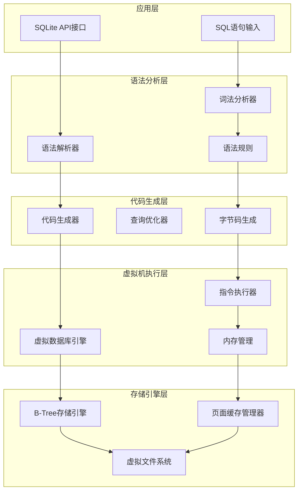

**图表来源**
- [main.c](file://src/main.c#L1-L50)
- [sqliteInt.h](file://src/sqliteInt.h#L1-L100)

## 分层设计详解

### 层次结构说明

SQLite的分层设计遵循了软件工程中的关注点分离原则，每一层都有清晰的边界和职责：

1. **API接口层**：提供给应用程序使用的公共接口
2. **语法分析层**：负责SQL语句的解析和验证
3. **代码生成层**：将解析后的SQL转换为可执行的字节码
4. **虚拟机执行层**：执行字节码并管理执行状态
5. **存储引擎层**：负责数据的物理存储和检索

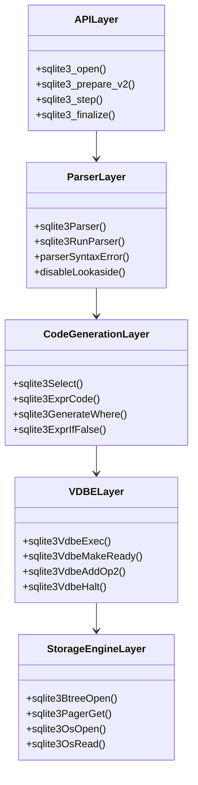

**章节来源**
- [main.c](file://src/main.c#L1-L100)
- [sqliteInt.h](file://src/sqliteInt.h#L1-L200)

## 语法分析层

### YACC语法文件解析

SQLite使用自定义的Lemon语法分析器替代传统的YACC工具。parse.y文件定义了完整的SQL语法规范：

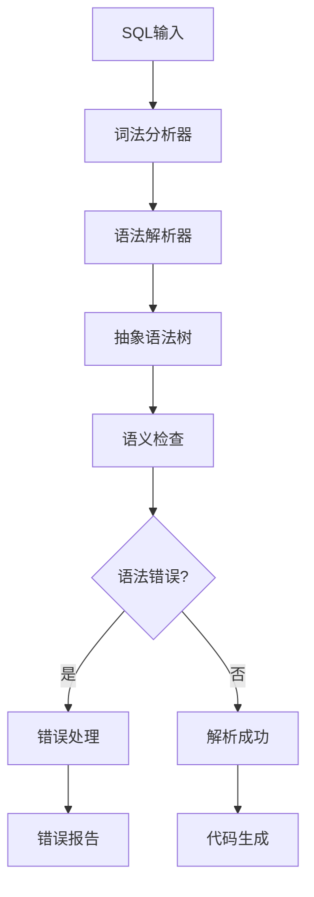

**图表来源**
- [parse.y](file://src/parse.y#L1-L100)

### 语法解析过程

语法解析器通过以下步骤处理SQL语句：

1. **词法分析**：将SQL文本分解为标记（tokens）
2. **语法分析**：根据语法规则构建语法树
3. **语义分析**：验证语法树的语义正确性
4. **错误恢复**：处理语法错误并提供诊断信息

**章节来源**
- [parse.y](file://src/parse.y#L1-L200)

## 代码生成层

### 查询优化器

查询优化器负责将抽象语法树转换为高效的执行计划：

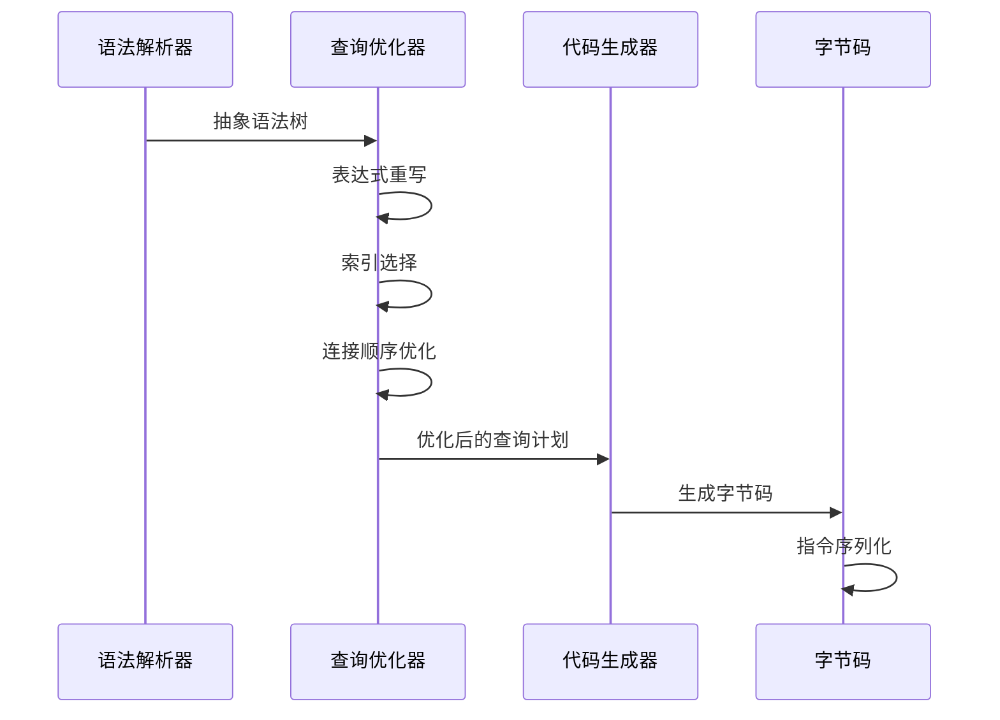

**图表来源**
- [prepare.c](file://src/prepare.c#L1-L100)

### 字节码生成

字节码是SQLite虚拟机的可执行指令集，包含以下特点：

- **紧凑性**：指令长度固定，便于快速执行
- **高效性**：针对常见操作进行了优化
- **可移植性**：与硬件无关的中间表示

**章节来源**
- [prepare.c](file://src/prepare.c#L1-L200)

## 虚拟机执行层

### 虚拟数据库引擎（VDBE）

VDBE是SQLite的核心执行引擎，负责执行字节码指令：

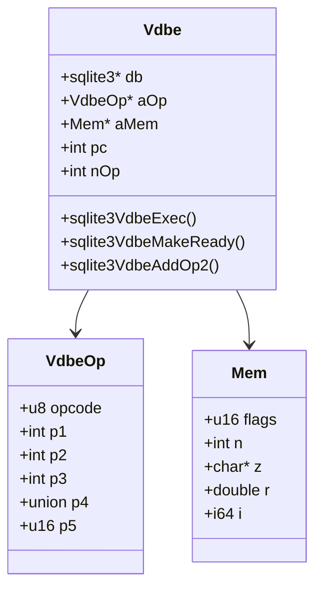

**图表来源**
- [vdbe.h](file://src/vdbe.h#L1-L100)
- [vdbeInt.h](file://src/vdbeInt.h#L450-L500)

### 指令执行流程

VDBE按照以下流程执行指令：

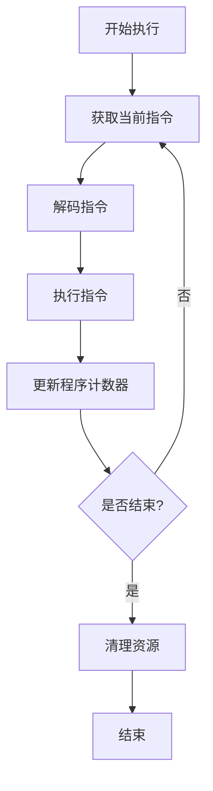

**图表来源**
- [vdbe.c](file://src/vdbe.c#L839-L872)

**章节来源**
- [vdbe.c](file://src/vdbe.c#L1-L200)
- [vdbeInt.h](file://src/vdbeInt.h#L450-L650)

## 存储引擎层

### B-Tree存储引擎

B-Tree是SQLite的主要存储结构，提供了高效的键值对存储：

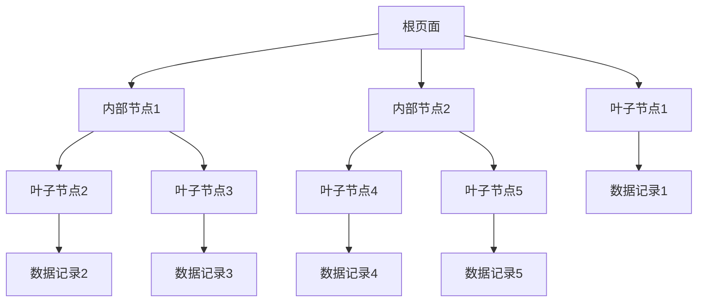

**图表来源**
- [btree.h](file://src/btree.h#L1-L100)
- [btreeInt.h](file://src/btreeInt.h#L100-L200)

### 页面缓存管理器（Pager）

Pager负责管理数据库页面的缓存和持久化：

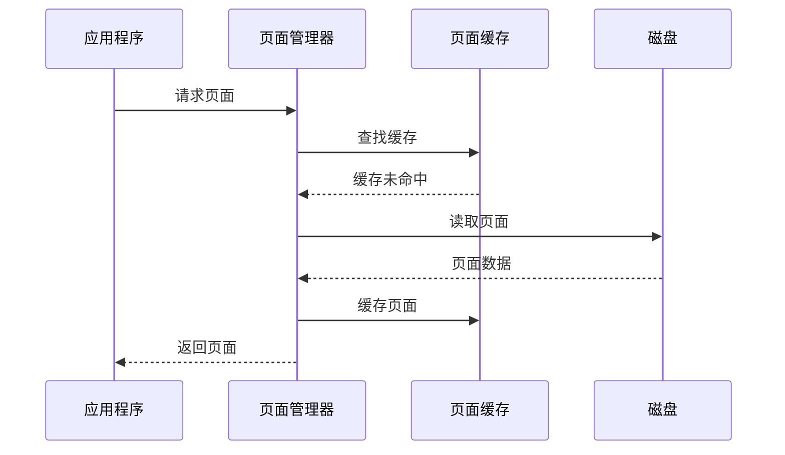

**图表来源**
- [pager.h](file://src/pager.h#L1-L100)
- [pager.c](file://src/pager.c#L5524-L5539)

### 虚拟文件系统（VFS）

VFS提供了跨平台的文件操作接口：

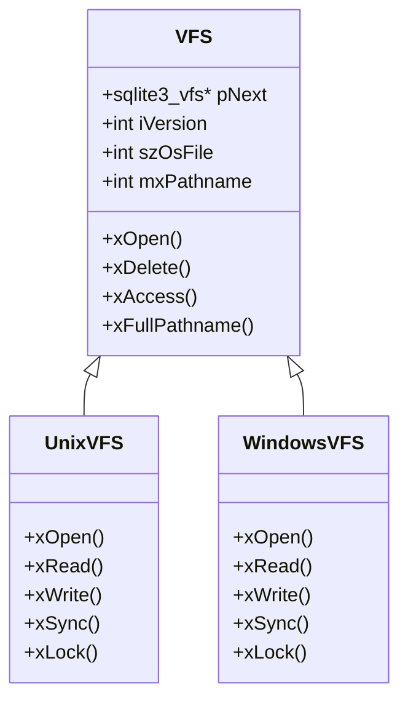

**图表来源**
- [os.h](file://src/os.h#L1-L100)
- [os_unix.c](file://src/os_unix.c#L1-L50)

**章节来源**
- [btree.c](file://src/btree.c#L1-L200)
- [pager.c](file://src/pager.c#L5473-L5501)
- [os.h](file://src/os.h#L1-L226)

## 查询执行生命周期

### 完整的查询执行流程

从接收SQL语句到返回结果的完整生命周期：

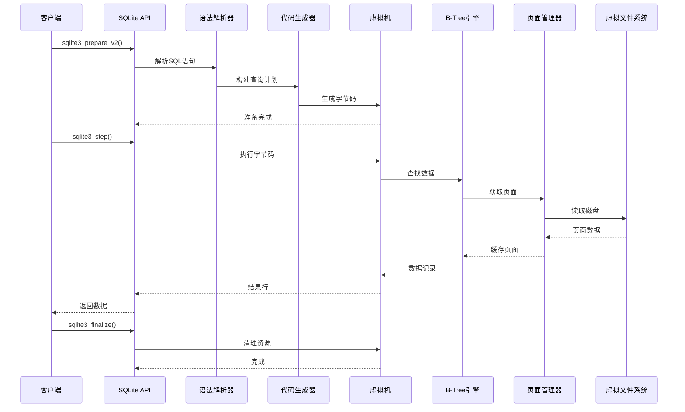

**图表来源**
- [main.c](file://src/main.c#L1-L100)
- [vdbe.c](file://src/vdbe.c#L839-L872)

### 关键执行阶段

1. **准备阶段**：解析SQL、生成执行计划、分配资源
2. **执行阶段**：逐行执行字节码、访问数据、处理结果
3. **清理阶段**：释放资源、关闭游标、清理状态

**章节来源**
- [vdbeaux.c](file://src/vdbeaux.c#L2624-L2652)
- [vdbe.c](file://src/vdbe.c#L839-L872)

## 性能调优指南

### 页面大小配置

页面大小直接影响数据库的性能特征：

| 页面大小 | 适用场景 | 优势 | 劣势 |
|---------|---------|------|------|
| 512字节 | 小型数据库 | 内存占用少 | 随机访问效率低 |
| 1024字节 | 中等数据库 | 平衡性能 | 仍可能浪费空间 |
| 4096字节 | 大型数据库 | 高效随机访问 | 内存占用较多 |
| 8192字节 | 大型数据库 | 最大化I/O效率 | 内存需求高 |

### 缓存配置优化

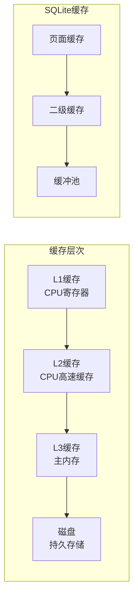

### 性能监控指标

关键性能指标包括：

- **查询执行时间**：单个查询的响应时间
- **页面命中率**：缓存命中次数与总请求次数的比例
- **I/O操作次数**：读写磁盘的频率
- **内存使用量**：数据库进程的内存占用

### 高级调优技巧

1. **WAL模式**：启用Write-Ahead Logging提高并发性能
2. **预编译语句**：重用编译后的查询计划
3. **索引优化**：合理创建和使用索引
4. **事务管理**：适当使用事务减少I/O开销

**章节来源**
- [pager.h](file://src/pager.h#L1-L100)
- [btree.h](file://src/btree.h#L1-L100)

## 总结

SQLite的核心架构体现了优秀的软件设计原则：

1. **模块化设计**：清晰的分层结构便于维护和扩展
2. **性能优化**：多层次的缓存机制和高效的算法
3. **跨平台兼容**：抽象的VFS层支持多种操作系统
4. **可靠性保证**：完善的事务机制和错误处理

这种架构设计使得SQLite能够在各种环境中稳定运行，同时保持高性能和易用性。对于高级开发者而言，理解这些底层机制有助于更好地利用SQLite的特性，进行针对性的性能优化和功能扩展。

通过深入理解SQLite的核心架构，开发者可以：
- 更好地编写高效的SQL查询
- 合理配置数据库参数
- 识别和解决性能瓶颈
- 扩展SQLite的功能特性

SQLite的成功在于其简洁而强大的架构设计，这为其他数据库系统的开发提供了宝贵的参考价值。