# 事务控制

<cite>
**本文档中引用的文件**
- [vdbe.c](file://src/vdbe.c)
- [build.c](file://src/build.c)
- [pager.c](file://src/pager.c)
- [wal.c](file://src/wal.c)
- [btree.c](file://src/btree.c)
- [vtab.c](file://src/vtab.c)
- [fkey.c](file://src/fkey.c)
- [vdbeaux.c](file://src/vdbeaux.c)
- [main.c](file://src/main.c)
- [sqliteInt.h](file://src/sqliteInt.h)
- [vdbe.h](file://src/vdbe.h)
- [pager-invariants.txt](file://doc/pager-invariants.txt)
</cite>

## 目录
1. [简介](#简介)
2. [项目结构概述](#项目结构概述)
3. [VDBE事务控制核心组件](#vdbetransaction-control-core-components)
4. [事务字节码生成机制](#transaction-bytecode-generation-mechanism)
5. [保存点实现原理](#savepoint-implementation-principle)
6. [事务状态机与锁机制](#transaction-state-machine-and-locking-mechanism)
7. [崩溃恢复流程](#crash-recovery-process)
8. [自动提交与显式事务](#auto-commit-vs-explicit-transactions)
9. [ACID特性的保证](#acid-properties-assurance)
10. [性能考虑](#performance-considerations)
11. [故障排除指南](#troubleshooting-guide)
12. [结论](#conclusion)

## 简介

SQLite的虚拟数据库引擎（VDBE）在事务控制中扮演着核心角色，负责将SQL语句转换为字节码指令，并协调底层页面管理器（Pager）和日志系统（WAL或回滚日志）的操作。本文档深入分析VDBE在事务控制中的实现机制，包括BEGIN、COMMIT、ROLLBACK等SQL语句的字节码生成过程，保存点的嵌套管理，事务状态机，锁机制，以及崩溃恢复流程。

## 项目结构概述

SQLite的事务控制系统由多个核心模块组成，形成了一个层次化的架构：

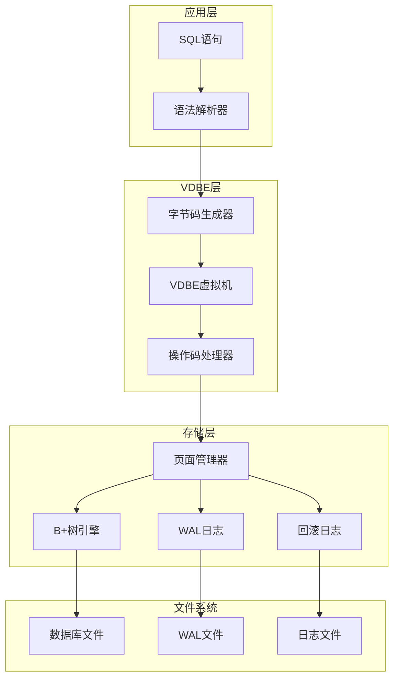

**图表来源**
- [vdbe.c](file://src/vdbe.c#L1-L50)
- [pager.c](file://src/pager.c#L1-L50)
- [wal.c](file://src/wal.c#L1-L50)

## VDBE事务控制核心组件

### 字节码操作码定义

VDBE使用三个核心操作码来处理事务控制：

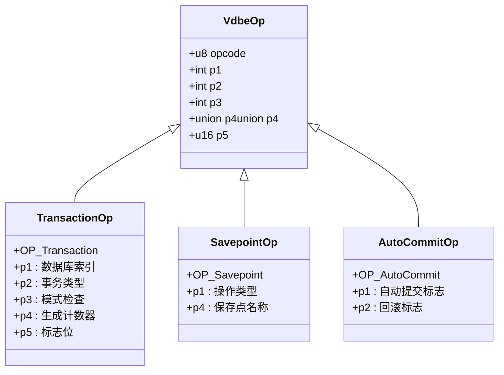

**图表来源**
- [vdbe.h](file://src/vdbe.h#L50-L150)
- [vdbe.c](file://src/vdbe.c#L3810-L3847)

### 事务类型枚举

VDBE支持多种事务类型，通过参数p2控制：

| 事务类型 | 值 | 描述 |
|---------|---|------|
| 读事务 | 0 | 只读事务，不修改数据 |
| 写事务 | 1 | 读写事务，允许修改数据 |
| 排他事务 | 2+ | 独占事务，阻止其他连接访问 |

**段落来源**
- [vdbe.c](file://src/vdbe.c#L4061-L4086)

## 事务字节码生成机制

### BEGIN语句的字节码生成

当解析器遇到BEGIN语句时，会调用`sqlite3BeginTransaction`函数生成相应的VDBE字节码：

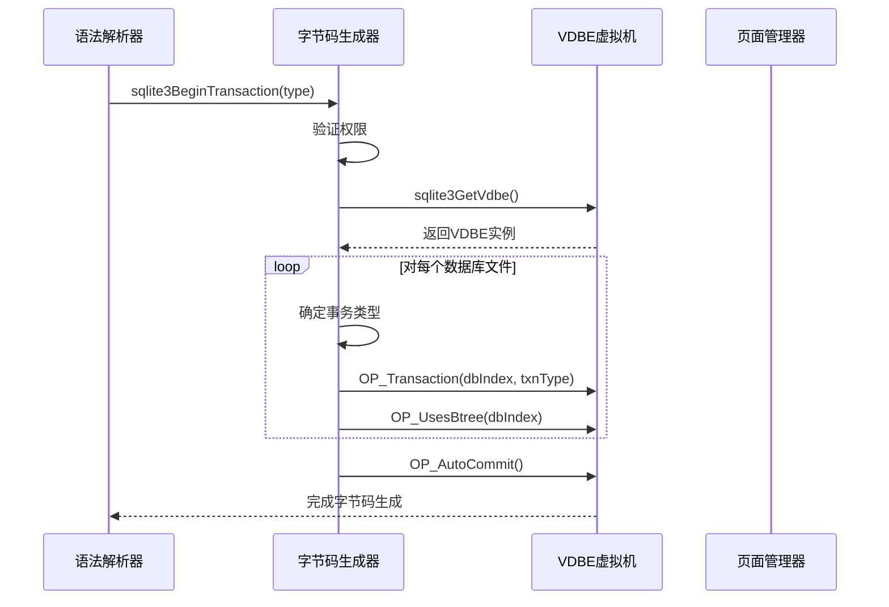

**图表来源**
- [build.c](file://src/build.c#L5235-L5290)

### COMMIT和ROLLBACK的字节码生成

COMMIT和ROLLBACK语句的处理逻辑类似，主要区别在于是否设置回滚标志：

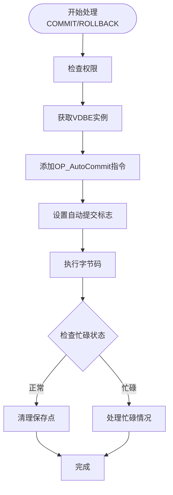

**图表来源**
- [build.c](file://src/build.c#L5260-L5290)

**段落来源**
- [build.c](file://src/build.c#L5235-L5290)

## 保存点实现原理

### 保存点数据结构

SQLite使用链表结构管理保存点，每个保存点包含以下信息：

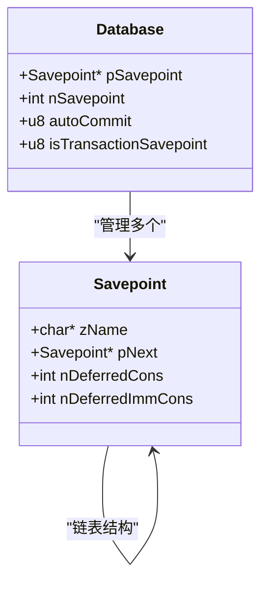

**图表来源**
- [vdbe.c](file://src/vdbe.c#L3849-L3884)

### 保存点操作流程

保存点支持三种操作：创建、释放和回滚：

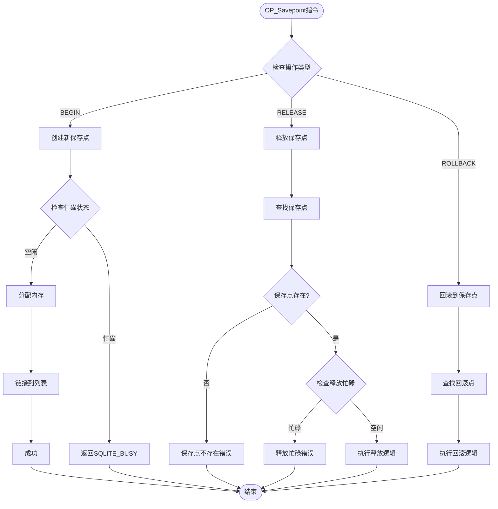

**图表来源**
- [vdbe.c](file://src/vdbe.c#L3810-L3965)

### 嵌套保存点管理

保存点支持嵌套结构，内部保存点会被自动销毁：

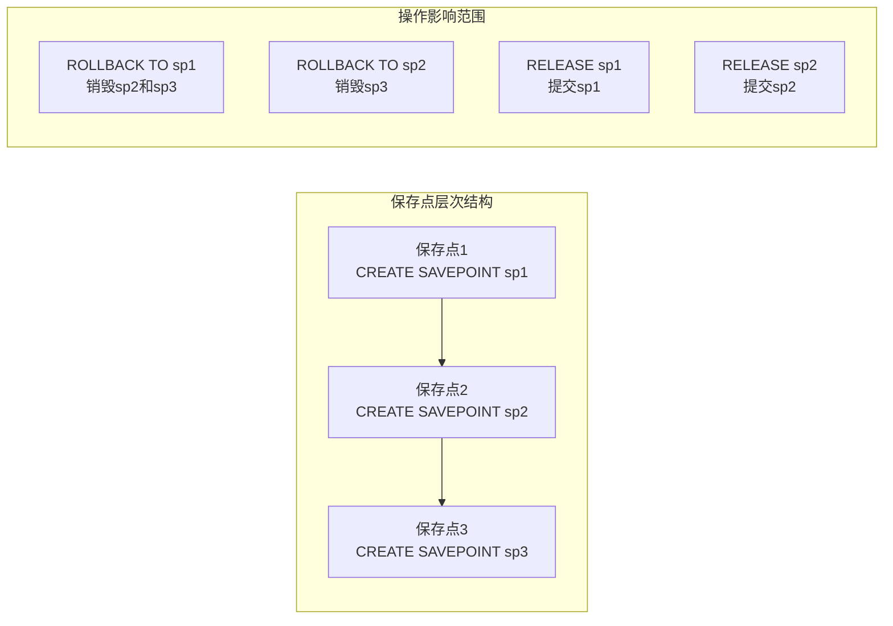

**段落来源**
- [vdbe.c](file://src/vdbe.c#L3940-L3965)

## 事务状态机与锁机制

### 事务状态转换

VDBE维护一个事务状态机，处理不同状态间的转换：

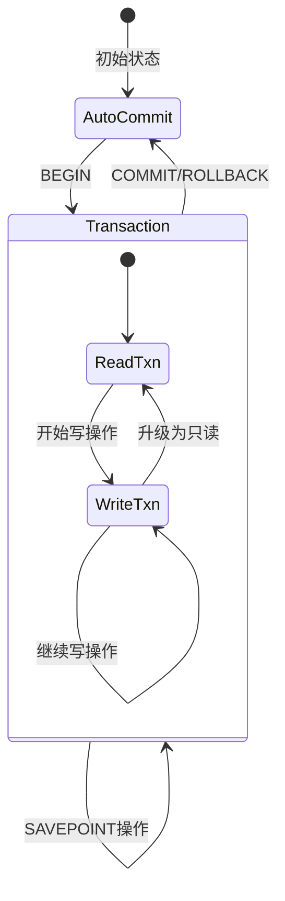

### 锁机制层次

SQLite采用分层锁机制确保并发安全：

| 锁类型 | 用途 | 获取时机 | 释放时机 |
|--------|------|----------|----------|
| 共享锁 | 读取数据 | 开始读事务 | 事务结束 |
| 保留锁 | 准备写入 | 开始写事务 | 写入完成 |
| 排他锁 | 独占访问 | 提交/回滚 | 文件解锁 |
| WAL写锁 | WAL写入 | WAL写事务 | WAL同步完成 |

**段落来源**
- [pager.c](file://src/pager.c#L5924-L5955)

### WAL与回滚日志的选择

SQLite根据配置自动选择合适的日志机制：

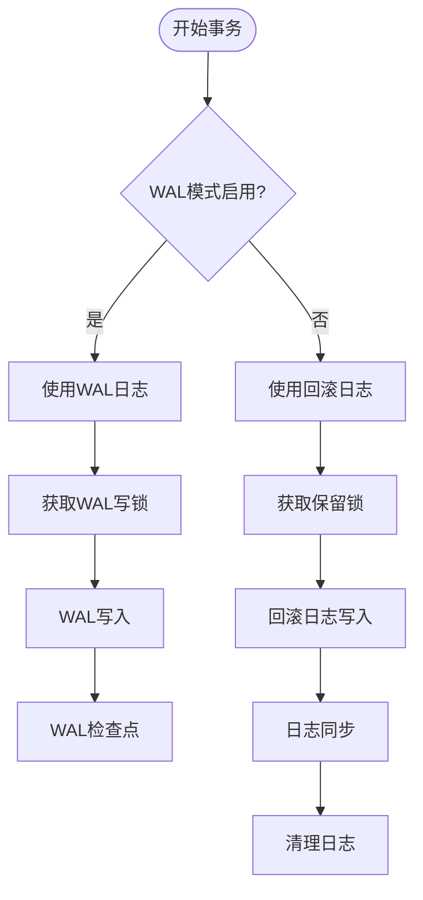

**图表来源**
- [pager.c](file://src/pager.c#L5924-L5955)
- [wal.c](file://src/wal.c#L4423-L4450)

**段落来源**
- [pager.c](file://src/pager.c#L5900-L6100)

## 崩溃恢复流程

### WAL恢复机制

WAL模式下的崩溃恢复通过以下步骤进行：

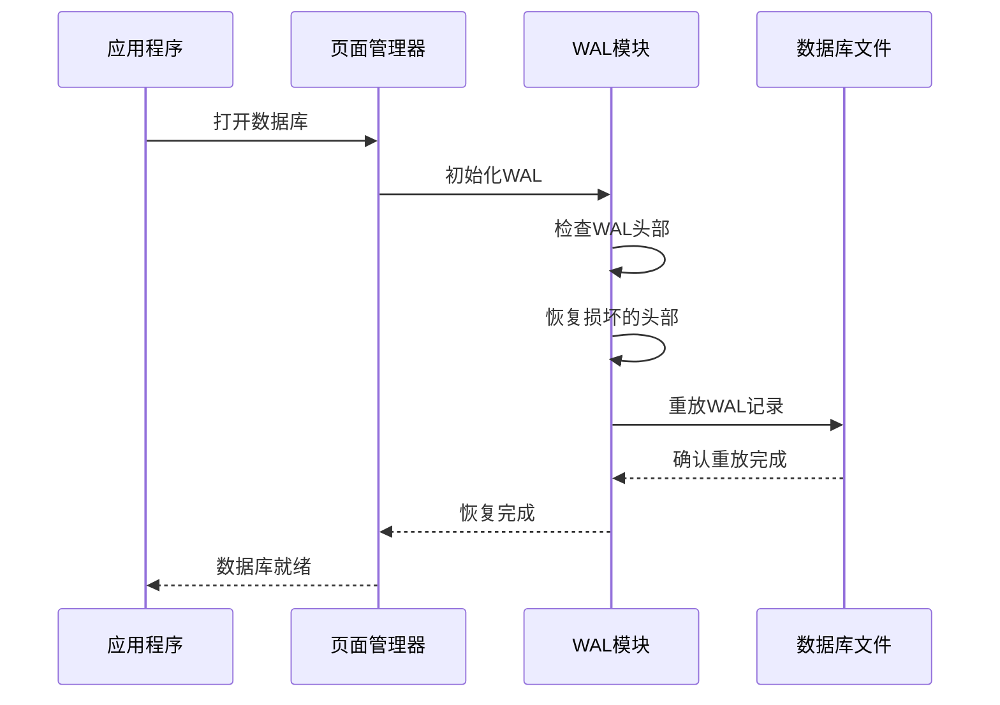

**图表来源**
- [wal.c](file://src/wal.c#L1369-L1431)

### 回滚日志恢复

传统回滚日志的恢复过程更加复杂：

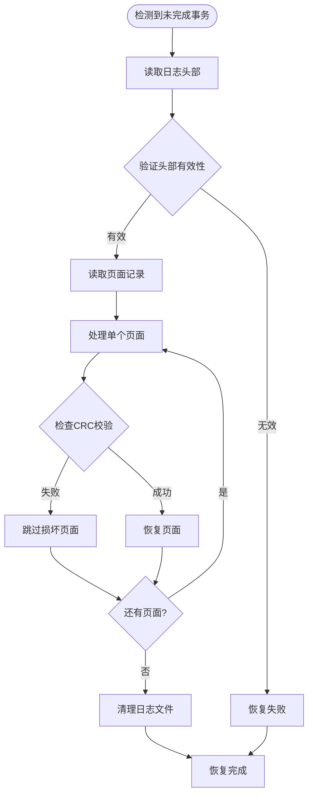

**图表来源**
- [wal.c](file://src/wal.c#L1405-L1431)
- [pager.c](file://src/pager.c#L3367-L3395)

**段落来源**
- [wal.c](file://src/wal.c#L1369-L1431)

## 自动提交与显式事务

### 自动提交模式

自动提交模式下，每个SQL语句都作为一个独立的事务执行：

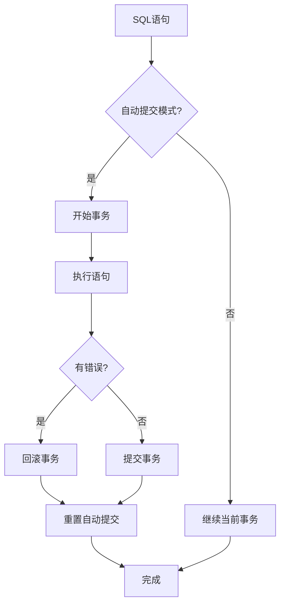

### 显式事务控制

显式事务通过BEGIN、COMMIT、ROLLBACK语句控制：

| 操作 | 字节码指令 | 行为描述 |
|------|------------|----------|
| BEGIN | OP_Transaction + OP_AutoCommit | 开始事务，禁用自动提交 |
| COMMIT | OP_AutoCommit(1,0) | 提交事务，重置自动提交 |
| ROLLBACK | OP_AutoCommit(1,1) | 回滚事务，重置自动提交 |

**段落来源**
- [main.c](file://src/main.c#L3899-L3913)
- [vdbe.c](file://src/vdbe.c#L4018-L4059)

## ACID特性的保证

### 原子性（Atomicity）

VDBE通过以下机制保证原子性：

1. **保存点机制**：支持部分回滚
2. **语句级事务**：单个语句的原子性
3. **WAL/回滚日志**：持久化变更记录

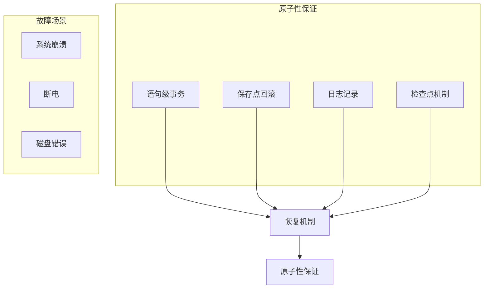

### 一致性（Consistency）

一致性通过约束检查和外键验证保证：

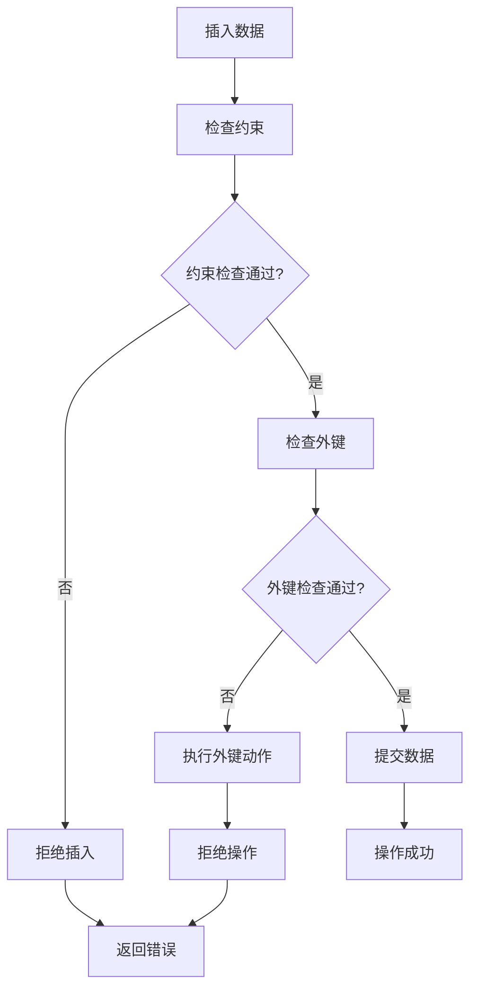

**图表来源**
- [fkey.c](file://src/fkey.c#L18-L45)
- [vdbeaux.c](file://src/vdbeaux.c#L3268-L3295)

### 隔离性（Isolation）

SQLite通过锁机制和WAL模式提供隔离性：

| 隔离级别 | 实现方式 | 并发控制 |
|----------|----------|----------|
| 读已提交 | 共享锁/排他锁 | 读写互斥 |
| 可重复读 | WAL快照 | 多版本并发控制 |
| 序列化 | 排他锁 | 完全串行化 |

### 持久性（Durability）

持久性通过以下机制保证：

1. **WAL同步**：WAL文件的fsync操作
2. **回滚日志**：事务完成前的完整记录
3. **检查点**：定期将WAL内容合并到主数据库

**段落来源**
- [sqliteInt.h](file://src/sqliteInt.h#L2603-L2624)

## 性能考虑

### 事务大小优化

大型事务会影响性能和恢复时间：

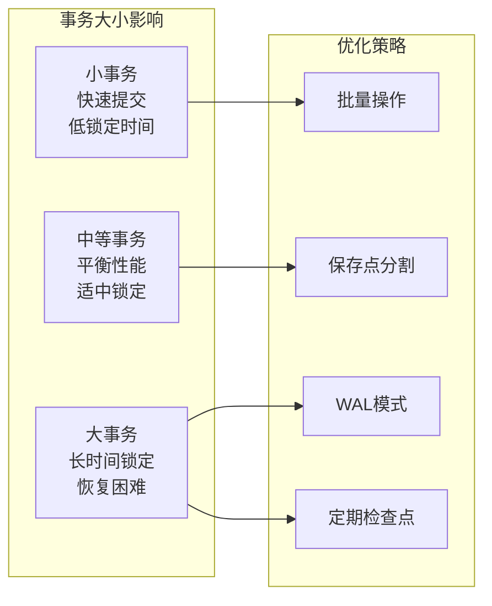

### 锁竞争缓解

SQLite通过以下机制减少锁竞争：

1. **WAL模式**：允许多个读取者同时访问
2. **延迟锁获取**：按需获取锁
3. **超时机制**：避免无限等待

## 故障排除指南

### 常见事务问题

| 问题类型 | 症状 | 解决方案 |
|----------|------|----------|
| 死锁 | SQLITE_BUSY错误 | 重新排序操作顺序 |
| 保存点冲突 | 无法创建/释放保存点 | 检查当前事务状态 |
| WAL锁定 | 数据库文件被锁定 | 检查WAL进程状态 |
| 日志损坏 | 恢复失败 | 使用备份或重建数据库 |

### 调试工具

VDBE提供了多种调试和监控功能：

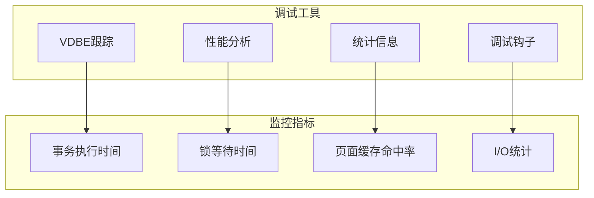

**段落来源**
- [vdbe.c](file://src/vdbe.c#L4018-L4059)

## 结论

SQLite的VDBE在事务控制中发挥了关键作用，通过精心设计的字节码生成机制、保存点管理系统、状态机控制和多层次的锁机制，实现了高效、可靠的事务处理能力。其支持的ACID特性、自动提交与显式事务模式、以及强大的崩溃恢复机制，使得SQLite能够在各种应用场景中提供稳定的数据持久化服务。

理解VDBE在事务控制中的实现机制，对于优化SQLite应用程序的性能、诊断事务相关问题以及开发高质量的数据库应用具有重要意义。随着SQLite的持续发展，这些核心机制将继续演进以适应新的需求和挑战。