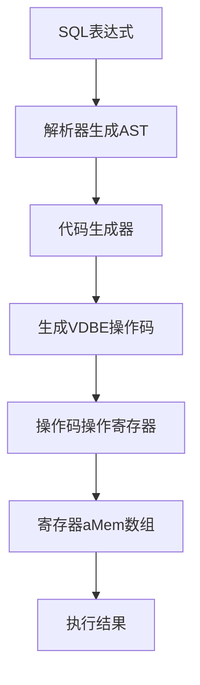

# 内存管理

<cite>
**本文档引用的文件**   
- [vdbemem.c](file://src/vdbemem.c)
- [vdbeInt.h](file://src/vdbeInt.h)
- [malloc.c](file://src/malloc.c)
- [mem1.c](file://src/mem1.c)
- [mem2.c](file://src/mem2.c)
- [expr.c](file://src/expr.c)
- [vdbeaux.c](file://src/vdbeaux.c)
- [vdbe.c](file://src/vdbe.c)
</cite>

## 目录
1. [引言](#引言)
2. [内存单元（Mem）结构体设计](#内存单元mem结构体设计)
3. [数据类型统一表示与自动转换](#数据类型统一表示与自动转换)
4. [寄存器（Register）组织与表达式计算](#寄存器register组织与表达式计算)
5. [内存分配与生命周期管理](#内存分配与生命周期管理)
6. [与全局内存分配器的交互](#与全局内存分配器的交互)
7. [内存使用优化与泄漏避免](#内存使用优化与泄漏避免)
8. [结论](#结论)

## 引言
SQLite的VDBE（虚拟数据库引擎）采用高效的内存管理机制来处理SQL语句执行过程中的数据。其核心是内存单元（Mem）结构体，它统一表示各种数据类型并支持自动类型转换。VDBE通过寄存器数组组织这些内存单元，在表达式计算中发挥关键作用。本文档详细分析这一内存管理机制的设计与实现。

## 内存单元（Mem）结构体设计

内存单元（Mem）是VDBE中存储单个值的基本结构，其设计旨在高效地统一表示多种数据类型。该结构体在`vdbeInt.h`中定义为`sqlite3_value`，包含用于存储不同类型值的联合体、字符串指针、长度、标志位、编码信息以及与数据库连接的关联。

Mem结构体通过标志位（flags）来标识其当前的数据类型和状态，如`MEM_Int`表示整数，`MEM_Real`表示浮点数，`MEM_Str`表示字符串，`MEM_Blob`表示BLOB数据。这种设计允许一个Mem对象在不同时间点持有不同类型的数据，而无需重新分配内存。

**Section sources**
- [vdbeInt.h](file://src/vdbeInt.h#L600-L643)

## 数据类型统一表示与自动转换

Mem结构体通过其内部的联合体（`MemValue`）和标志位系统，实现了对整数、浮点数、字符串和BLOB等数据类型的统一表示。当一个Mem对象需要在不同类型间转换时，VDBE提供了一系列函数来执行自动转换。

例如，`sqlite3VdbeMemIntegerify()`函数将Mem对象转换为整数类型，`sqlite3VdbeMemRealify()`将其转换为浮点数类型。对于从字符串到数值的转换，`sqlite3VdbeMemNumerify()`函数会尝试解析字符串内容并根据结果设置相应的整数或浮点数标志。这种自动转换机制确保了在表达式计算中，不同类型的数据可以无缝地参与运算。

**Section sources**
- [vdbemem.c](file://src/vdbemem.c#L1000-L1100)

## 寄存器（Register）组织与表达式计算

在VDBE中，寄存器（Register）本质上是一个Mem结构体的数组。这个数组在`Vdbe`结构体中由`aMem`字段表示，并在`sqlite3VdbeMakeReady()`函数中通过`initMemArray()`进行初始化。每个寄存器可以独立地存储不同类型的数据，并在虚拟机执行过程中作为临时存储和计算的场所。

在表达式计算中，编译器会将表达式的结果编码到特定的寄存器中。`expr.c`文件中的`sqlite3ExprCode()`系列函数负责生成将表达式结果存入寄存器的字节码指令。例如，`sqlite3ExprCodeTarget()`函数会生成必要的操作码（如`OP_Integer`、`OP_String8`）来将常量值加载到目标寄存器。这种基于寄存器的架构使得复杂的表达式求值过程变得高效且易于管理。

**Diagram sources **
- [expr.c](file://src/expr.c#L5811-L5853)
- [vdbeaux.c](file://src/vdbeaux.c#L2697-L2739)

## 内存分配与生命周期管理

Mem对象的内存管理是精细且分层的。对于字符串和BLOB数据，Mem结构体使用`zMalloc`字段指向动态分配的内存块，其大小由`szMalloc`记录。`sqlite3VdbeMemGrow()`函数负责在需要时扩展这块内存，它会调用底层的内存分配器进行实际的内存分配或重分配。

Mem对象的生命周期由`sqlite3VdbeMemRelease()`函数管理。该函数会检查Mem的标志位，如果存在动态分配的内容（如`MEM_Dyn`或`MEM_Agg`），则会调用相应的析构函数（`xDel`）或释放`zMalloc`指向的内存。`sqlite3VdbeMemSetNull()`函数在重置Mem内容时，会调用`vdbeMemClearExternAndSetNull()`来清理外部资源，确保不会发生内存泄漏。

**Section sources**
- [vdbemem.c](file://src/vdbemem.c#L370-L400)
- [vdbemem.c](file://src/vdbemem.c#L586-L609)

## 与全局内存分配器的交互

VDBE的内存管理紧密依赖于SQLite的全局内存分配器。所有通过`sqlite3VdbeMemGrow()`进行的内存分配最终都会调用`sqlite3DbMallocRaw()`或`sqlite3Realloc()`等函数，这些函数又会委托给由`sqlite3GlobalConfig.m`配置的底层内存分配方法。

在`malloc.c`中，`sqlite3Malloc()`和`sqlite3Realloc()`等函数构成了内存分配的核心，它们在分配内存前会检查软硬内存限制，并在必要时触发内存清理回调。VDBE通过`db`字段与特定的数据库连接关联，从而确保其内存分配行为受到该连接的内存管理策略（如`mallocFailed`标志）的约束。

**Section sources**
- [malloc.c](file://src/malloc.c#L200-L300)
- [vdbemem.c](file://src/vdbemem.c#L233-L249)

## 内存使用优化与泄漏避免

为优化内存使用，VDBE采用了多种策略。首先，它尽可能重用已分配的内存。`sqlite3VdbeMemClearAndResize()`函数在调整大小时，如果新大小小于已分配大小，则直接复用现有内存块，避免不必要的分配和复制。其次，VDBE利用`allocSpace()`函数尝试重用已编译字节码数组末尾的未使用内存来存放寄存器数组，从而减少整体内存占用。

为避免内存泄漏，关键在于正确管理Mem对象的生命周期。开发者必须确保在重用或释放Mem对象前调用`sqlite3VdbeMemRelease()`或`sqlite3VdbeMemSetNull()`。此外，应避免创建循环引用或在异常路径中遗漏资源释放。使用`sqlite3_release_memory()`等接口可以帮助在内存紧张时主动释放非关键缓存。

**Section sources**
- [vdbeaux.c](file://src/vdbeaux.c#L2551-L2595)
- [vdbemem.c](file://src/vdbemem.c#L314-L330)

## 结论
VDBE的内存管理机制通过精心设计的Mem结构体和寄存器数组，实现了对多种数据类型的高效统一表示和自动转换。其内存分配策略与全局内存分配器紧密结合，并通过精细的生命周期管理来防止内存泄漏。理解这一机制对于优化SQLite应用的性能和稳定性至关重要。