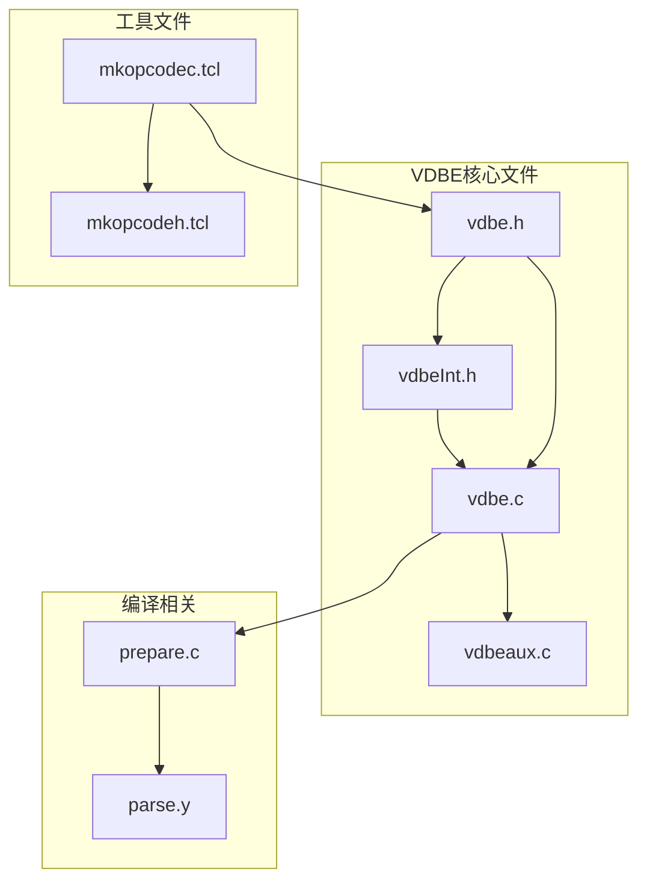
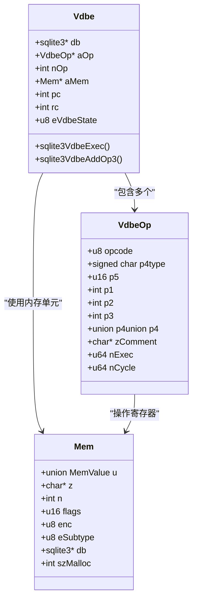
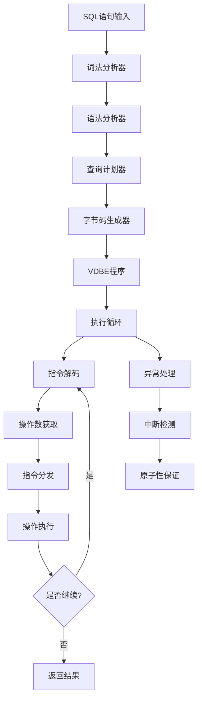
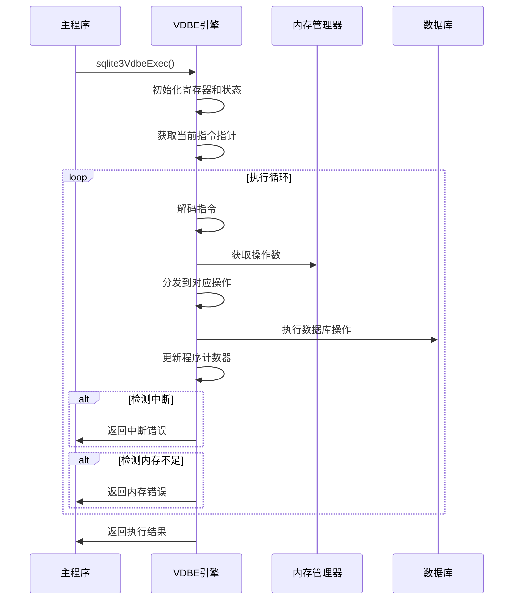
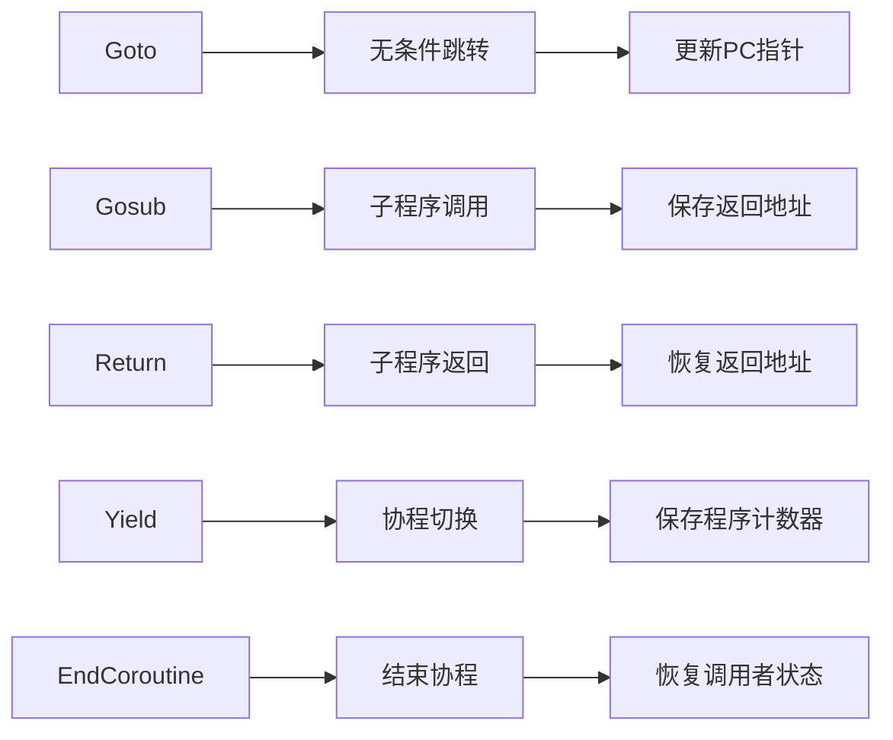
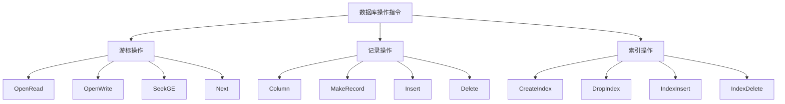
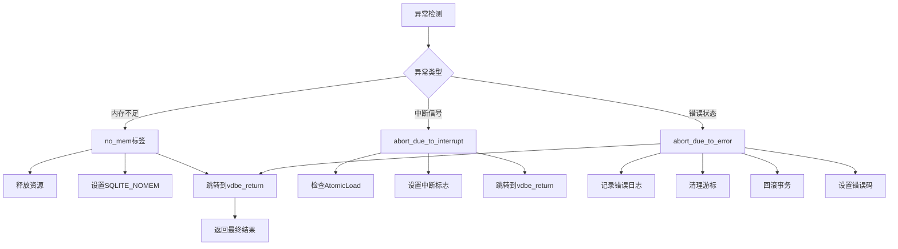
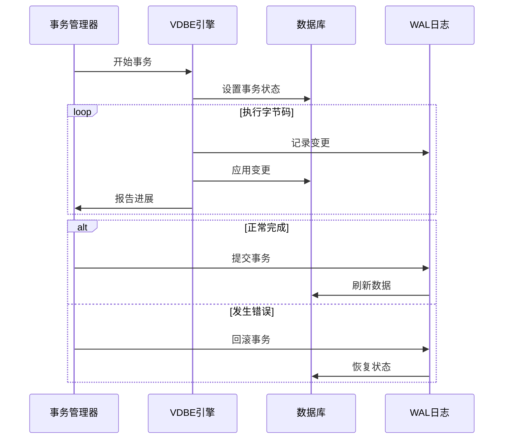
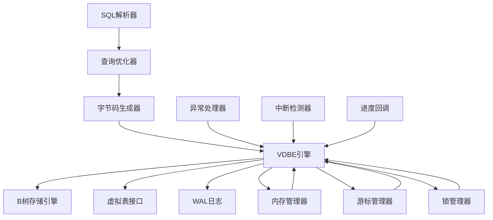

# 字节码执行

<cite>
**本文档引用的文件**
- [vdbe.h](file://src/vdbe.h)
- [vdbeInt.h](file://src/vdbeInt.h)
- [vdbe.c](file://src/vdbe.c)
- [vdbeaux.c](file://src/vdbeaux.c)
- [prepare.c](file://src/prepare.c)
- [mkopcodeh.tcl](file://tool/mkopcodec.tcl)
</cite>

## 目录
1. [简介](#简介)
2. [项目结构](#项目结构)
3. [核心组件](#核心组件)
4. [架构概览](#架构概览)
5. [详细组件分析](#详细组件分析)
6. [依赖关系分析](#依赖关系分析)
7. [性能考虑](#性能考虑)
8. [故障排除指南](#故障排除指南)
9. [结论](#结论)

## 简介

SQLite虚拟数据库引擎（VDBE）是SQLite的核心组件，它实现了一个抽象的虚拟机器来执行SQL语句。VDBE通过将SQL语句编译为字节码程序，然后在虚拟机上逐条执行这些指令，实现了高效的数据库操作。本文档深入分析了VDBE的字节码执行机制，包括指令集架构、执行循环、异常处理和中断机制。

## 项目结构

SQLite的VDBE相关文件主要位于`src`目录下，包含以下关键组件：

**图表来源**
- [vdbe.h](file://src/vdbe.h#L1-L50)
- [vdbeInt.h](file://src/vdbeInt.h#L1-L50)
- [vdbe.c](file://src/vdbe.c#L1-L50)

**章节来源**
- [vdbe.h](file://src/vdbe.h#L1-L435)
- [vdbeInt.h](file://src/vdbeInt.h#L1-L752)

## 核心组件

### VDBE指令结构

VDBE的核心是`VdbeOp`结构，它定义了单个虚拟机指令的格式：

**图表来源**
- [vdbe.h](file://src/vdbe.h#L40-L120)
- [vdbeInt.h](file://src/vdbeInt.h#L300-L400)

### 操作码类型系统

VDBE支持多种操作码类型，每种类型都有特定的用途：

| P4类型 | 数值 | 描述 |
|--------|------|------|
| P4_NOTUSED | 0 | 不使用P4参数 |
| P4_INT32 | -3 | 32位有符号整数 |
| P4_DYNAMIC | -6 | 动态分配的内存指针 |
| P4_FUNCDEF | -7 | 函数定义结构指针 |
| P4_KEYINFO | -8 | 键信息结构指针 |
| P4_TABLE | -5 | 表结构指针 |
| P4_VTAB | -11 | 虚拟表结构指针 |

**章节来源**
- [vdbe.h](file://src/vdbe.h#L120-L180)

## 架构概览

VDBE的整体架构展示了从SQL到字节码再到执行的完整流程：

**图表来源**
- [vdbe.c](file://src/vdbe.c#L850-L950)
- [prepare.c](file://src/prepare.c#L50-L100)

## 详细组件分析

### 执行循环（Execution Loop）

VDBE的执行循环是整个系统的核心，它负责逐条执行字节码指令：

**图表来源**
- [vdbe.c](file://src/vdbe.c#L850-L1000)

执行循环的关键特性包括：

1. **指令解码**：从`aOp`数组中获取当前指令
2. **操作数验证**：确保操作数的有效性
3. **指令分发**：根据操作码跳转到对应的处理函数
4. **状态更新**：维护寄存器状态和程序计数器

**章节来源**
- [vdbe.c](file://src/vdbe.c#L850-L1200)

### 指令集架构

VDBE指令集按功能分为几个主要类别：

#### 控制流指令

**图表来源**
- [vdbe.c](file://src/vdbe.c#L1050-L1200)

#### 算术逻辑指令

算术运算指令支持基本的数学计算：

| 指令 | 功能 | 操作数 |
|------|------|--------|
| OP_Add | 加法运算 | P1 + P2 → P3 |
| OP_Subtract | 减法运算 | P2 - P1 → P3 |
| OP_Multiply | 乘法运算 | P1 × P2 → P3 |
| OP_Divide | 除法运算 | P2 ÷ P1 → P3 |
| OP_Remainder | 取余运算 | P2 mod P1 → P3 |

#### 数据库操作指令

数据库操作指令直接与底层存储引擎交互：

**图表来源**
- [vdbe.c](file://src/vdbe.c#L1840-L2000)

**章节来源**
- [vdbe.c](file://src/vdbe.c#L1840-L2300)

### 异常处理和中断机制

VDBE实现了多层次的异常处理和中断机制：

**图表来源**
- [vdbe.c](file://src/vdbe.c#L880-L950)

中断机制的关键实现：

1. **原子性检查**：使用`AtomicLoad(&db->u1.isInterrupted)`检测中断
2. **进度回调**：定期调用用户定义的进度回调函数
3. **优雅退出**：确保在中断时正确清理资源

**章节来源**
- [vdbe.c](file://src/vdbe.c#L880-L950)

### 原子性和一致性保证

VDBE通过多种机制保证执行的原子性和一致性：

**图表来源**
- [vdbe.c](file://src/vdbe.c#L1300-L1400)

**章节来源**
- [vdbe.c](file://src/vdbe.c#L1300-L1500)

## 依赖关系分析

VDBE系统的依赖关系展现了各组件之间的相互作用：

**图表来源**
- [vdbe.h](file://src/vdbe.h#L200-L300)
- [vdbeInt.h](file://src/vdbeInt.h#L500-L600)

**章节来源**
- [vdbe.h](file://src/vdbe.h#L200-L435)
- [vdbeInt.h](file://src/vdbeInt.h#L500-L752)

## 性能考虑

VDBE在设计时充分考虑了性能优化：

1. **指令缓存**：频繁使用的指令具有快速路径
2. **寄存器重用**：智能的寄存器分配策略
3. **分支预测**：对常见分支模式的优化
4. **内存池**：减少动态内存分配开销

## 故障排除指南

### 常见问题诊断

1. **内存不足错误**
   - 检查可用内存
   - 优化查询复杂度
   - 使用适当的内存限制

2. **中断超时**
   - 调整进度回调频率
   - 优化长时间运行的操作
   - 检查死锁情况

3. **字节码损坏**
   - 验证SQL语法
   - 检查编译器版本兼容性
   - 重新编译受影响的语句

**章节来源**
- [vdbe.c](file://src/vdbe.c#L880-L950)

## 结论

SQLite的VDBE字节码执行机制是一个精心设计的虚拟机系统，它成功地平衡了性能、可移植性和功能完整性。通过将SQL语句编译为紧凑的字节码程序，VDBE实现了高效的数据库操作，同时保持了代码的简洁性和可维护性。

VDBE的设计体现了以下关键原则：
- **模块化**：清晰的组件分离和接口定义
- **性能优化**：多层次的优化策略
- **可靠性**：完善的异常处理和资源管理
- **扩展性**：灵活的指令集和插件机制

这种设计使得SQLite能够在各种平台上提供一致且高性能的数据库服务，成为嵌入式数据库领域的标杆解决方案。