# 游标操作

<cite>
**本文档引用的文件**
- [vdbeInt.h](file://src/vdbeInt.h)
- [btreeInt.h](file://src/btreeInt.h)
- [vdbe.c](file://src/vdbe.c)
- [btree.c](file://src/btree.c)
- [vdbeaux.c](file://src/vdbeaux.c)
</cite>

## 目录
1. [简介](#简介)
2. [游标架构概述](#游标架构概述)
3. [VDBE游标结构](#vdbe游标结构)
4. [B-Tree游标结构](#b-tree游标结构)
5. [游标状态机](#游标状态机)
6. [游标位置管理](#游标位置管理)
7. [键值序列化与反序列化](#键值序列化与反序列化)
8. [字节码指令详解](#字节码指令详解)
9. [游标资源管理](#游标资源管理)
10. [事务隔离级别影响](#事务隔离级别影响)
11. [性能优化策略](#性能优化策略)
12. [故障排除指南](#故障排除指南)
13. [总结](#总结)

## 简介

VDBE（虚拟数据库引擎）游标是SQLite中实现数据访问的核心机制。游标作为连接VDBE虚拟机和B-Tree存储引擎的桥梁，负责管理表和索引的遍历、查找、插入、更新和删除操作。本文档将深入探讨游标的操作机制，包括其状态管理、位置控制、键值处理以及在查询执行中的实际应用。

## 游标架构概述

SQLite的游标系统采用分层架构设计，主要包含以下组件：

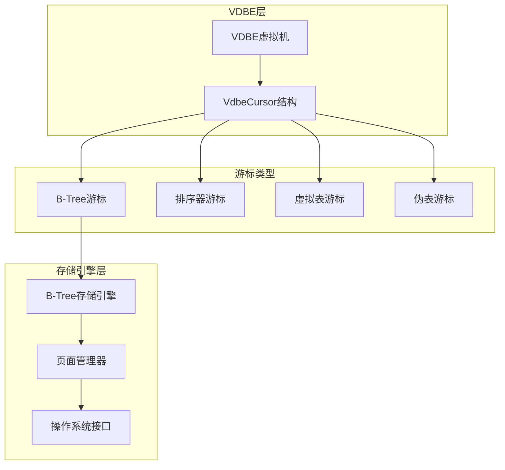
```mermaid
graph TB
subgraph "VDBE层"
VDBE[VDBE虚拟机]
VdbeCursor[VdbeCursor结构]
end
subgraph "游标类型"
BtreeCursor[B-Tree游标]
SorterCursor[排序器游标]
VtabCursor[虚拟表游标]
PseudoCursor[伪表游标]
end
subgraph "存储引擎层"
BTree[B-Tree存储引擎]
Pager[页面管理器]
OS[操作系统接口]
end
VDBE --> VdbeCursor
VdbeCursor --> BtreeCursor
VdbeCursor --> SorterCursor
VdbeCursor --> VtabCursor
VdbeCursor --> PseudoCursor
BtreeCursor --> BTree
BTree --> Pager
Pager --> OS
```

**图表来源**
- [vdbeInt.h](file://src/vdbeInt.h#L78-L138)
- [btreeInt.h](file://src/btreeInt.h#L530-L556)

## VDBE游标结构

VdbeCursor是VDBE虚拟机中游标的抽象表示，包含了游标的所有元数据和状态信息：

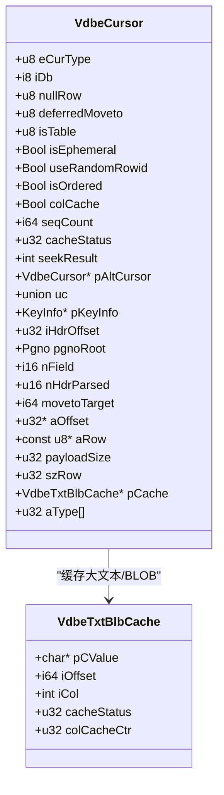
```mermaid
classDiagram
class VdbeCursor {
+u8 eCurType
+i8 iDb
+u8 nullRow
+u8 deferredMoveto
+u8 isTable
+Bool isEphemeral
+Bool useRandomRowid
+Bool isOrdered
+Bool colCache
+i64 seqCount
+u32 cacheStatus
+int seekResult
+VdbeCursor* pAltCursor
+union uc
+KeyInfo* pKeyInfo
+u32 iHdrOffset
+Pgno pgnoRoot
+i16 nField
+u16 nHdrParsed
+i64 movetoTarget
+u32* aOffset
+const u8* aRow
+u32 payloadSize
+u32 szRow
+VdbeTxtBlbCache* pCache
+u32 aType[]
}
class VdbeTxtBlbCache {
+char* pCValue
+i64 iOffset
+int iCol
+u32 cacheStatus
+u32 colCacheCtr
}
VdbeCursor --> VdbeTxtBlbCache : "缓存大文本/BLOB"
```

**图表来源**
- [vdbeInt.h](file://src/vdbeInt.h#L78-L138)

**章节来源**
- [vdbeInt.h](file://src/vdbeInt.h#L78-L138)

## B-Tree游标结构

BtCursor是直接与B-Tree存储引擎交互的底层游标结构：

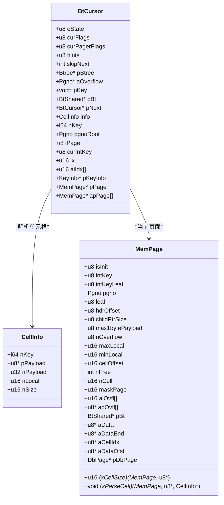
```mermaid
classDiagram
class BtCursor {
+u8 eState
+u8 curFlags
+u8 curPagerFlags
+u8 hints
+int skipNext
+Btree* pBtree
+Pgno* aOverflow
+void* pKey
+BtShared* pBt
+BtCursor* pNext
+CellInfo info
+i64 nKey
+Pgno pgnoRoot
+i8 iPage
+u8 curIntKey
+u16 ix
+u16 aiIdx[]
+KeyInfo* pKeyInfo
+MemPage* pPage
+MemPage* apPage[]
}
class CellInfo {
+i64 nKey
+u8* pPayload
+u32 nPayload
+u16 nLocal
+u16 nSize
}
class MemPage {
+u8 isInit
+u8 intKey
+u8 intKeyLeaf
+Pgno pgno
+u8 leaf
+u8 hdrOffset
+u8 childPtrSize
+u8 max1bytePayload
+u8 nOverflow
+u16 maxLocal
+u16 minLocal
+u16 cellOffset
+int nFree
+u16 nCell
+u16 maskPage
+u16 aiOvfl[]
+u8* apOvfl[]
+BtShared* pBt
+u8* aData
+u8* aDataEnd
+u8* aCellIdx
+u8* aDataOfst
+DbPage* pDbPage
+u16 (*xCellSize)(MemPage*, u8*)
+void (*xParseCell)(MemPage*, u8*, CellInfo*)
}
BtCursor --> CellInfo : "解析单元格"
BtCursor --> MemPage : "当前页面"
```

**图表来源**
- [btreeInt.h](file://src/btreeInt.h#L530-L556)

**章节来源**
- [btreeInt.h](file://src/btreeInt.h#L530-L556)

## 游标状态机

游标遵循严格的状态转换机制，确保数据访问的一致性和可靠性：

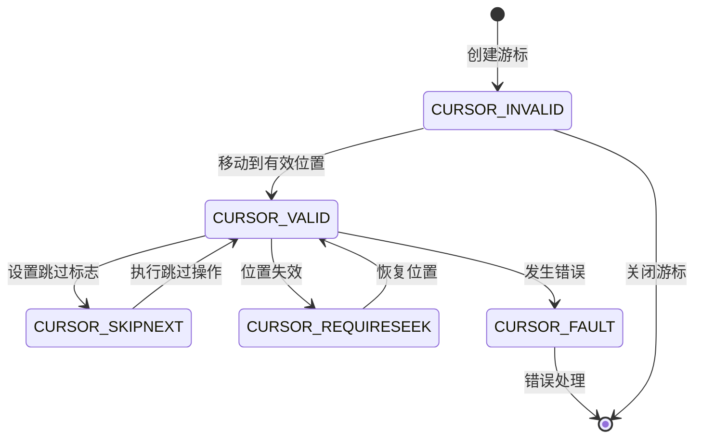
```mermaid
stateDiagram-v2
[*] --> CURSOR_INVALID : 创建游标
CURSOR_INVALID --> CURSOR_VALID : 移动到有效位置
CURSOR_VALID --> CURSOR_SKIPNEXT : 设置跳过标志
CURSOR_VALID --> CURSOR_REQUIRESEEK : 位置失效
CURSOR_VALID --> CURSOR_FAULT : 发生错误
CURSOR_SKIPNEXT --> CURSOR_VALID : 执行跳过操作
CURSOR_REQUIRESEEK --> CURSOR_VALID : 恢复位置
CURSOR_FAULT --> [*] : 错误处理
CURSOR_INVALID --> [*] : 关闭游标
```

**状态定义：**
- **CURSOR_VALID (0)**: 游标指向有效条目
- **CURSOR_INVALID (1)**: 游标不指向有效条目
- **CURSOR_SKIPNEXT (2)**: 游标有效但下一个操作应被跳过
- **CURSOR_REQUIRESEEK (3)**: 需要重新定位游标
- **CURSOR_FAULT (4)**: 游标处于不可恢复的错误状态

**章节来源**
- [btreeInt.h](file://src/btreeInt.h#L640-L660)

## 游标位置管理

游标的位置管理涉及多种状态和边界条件的处理：

### EOF（文件结束）检测

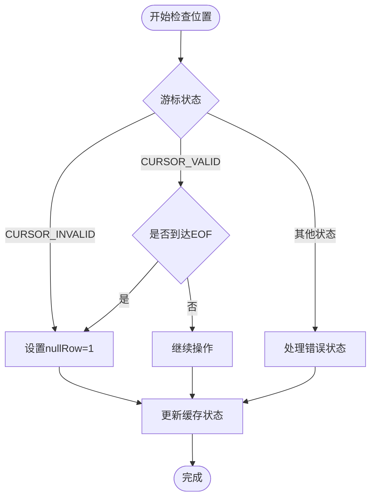
```mermaid
flowchart TD
Start([开始检查位置]) --> CheckState{游标状态}
CheckState --> |CURSOR_VALID| CheckEof{是否到达EOF}
CheckState --> |CURSOR_INVALID| SetNullRow[设置nullRow=1]
CheckState --> |其他状态| HandleError[处理错误状态]
CheckEof --> |是| SetNullRow
CheckEof --> |否| ContinueOperation[继续操作]
SetNullRow --> UpdateCache[更新缓存状态]
ContinueOperation --> UpdateCache
HandleError --> UpdateCache
UpdateCache --> End([完成])
```

### 有效行与无效行处理

游标通过`nullRow`字段区分有效行和无效行：

- **nullRow = 0**: 游标指向有效数据行
- **nullRow = 1**: 游标指向无效或不存在的行

**章节来源**
- [vdbe.c](file://src/vdbe.c#L2974-L2998)

## 键值序列化与反序列化

游标使用高效的序列化格式处理键值数据：

### 序列化类型系统

SQLite使用变长整数和特殊编码处理不同类型的键值：

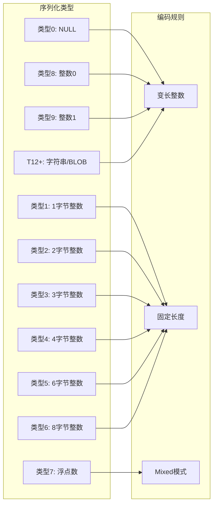
```mermaid
graph LR
subgraph "序列化类型"
T0[类型0: NULL]
T1[类型1: 1字节整数]
T2[类型2: 2字节整数]
T3[类型3: 3字节整数]
T4[类型4: 4字节整数]
T5[类型5: 6字节整数]
T6[类型6: 8字节整数]
T7[类型7: 浮点数]
T8[类型8: 整数0]
T9[类型9: 整数1]
T12[T12+: 字符串/BLOB]
end
subgraph "编码规则"
Varint[变长整数]
FixedLength[固定长度]
Mixed[Mixed模式]
end
T0 --> Varint
T1 --> FixedLength
T2 --> FixedLength
T3 --> FixedLength
T4 --> FixedLength
T5 --> FixedLength
T6 --> FixedLength
T7 --> Mixed
T8 --> Varint
T9 --> Varint
T12 --> Varint
```

### 列提取过程

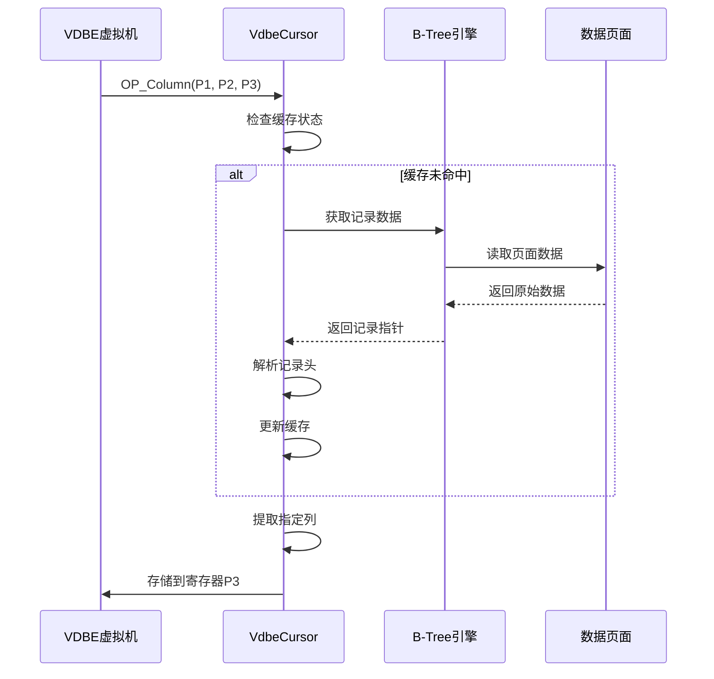
```mermaid
sequenceDiagram
participant VDBE as VDBE虚拟机
participant Cursor as VdbeCursor
participant Btree as B-Tree引擎
participant Page as 数据页面
VDBE->>Cursor : OP_Column(P1, P2, P3)
Cursor->>Cursor : 检查缓存状态
alt 缓存未命中
Cursor->>Btree : 获取记录数据
Btree->>Page : 读取页面数据
Page-->>Btree : 返回原始数据
Btree-->>Cursor : 返回记录指针
Cursor->>Cursor : 解析记录头
Cursor->>Cursor : 更新缓存
end
Cursor->>Cursor : 提取指定列
Cursor->>VDBE : 存储到寄存器P3
```

**图表来源**
- [vdbe.c](file://src/vdbe.c#L2974-L3129)

**章节来源**
- [vdbe.c](file://src/vdbe.c#L2974-L3129)
- [vdbeaux.c](file://src/vdbeaux.c#L4168-L4280)

## 字节码指令详解

### OpenRead指令

OpenRead指令用于打开只读游标：

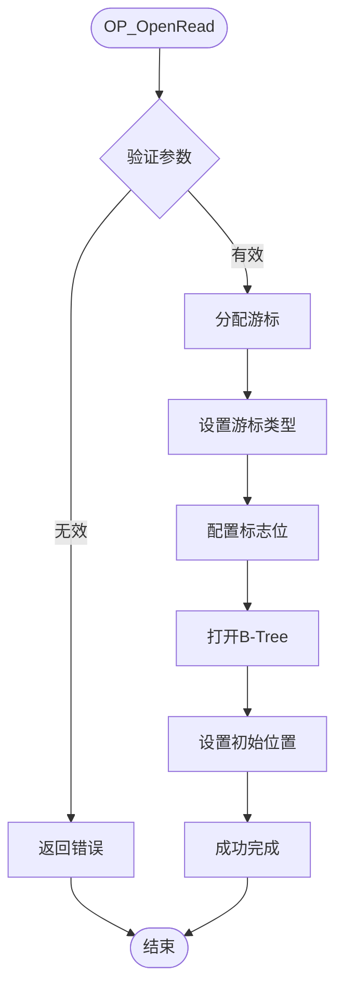
```mermaid
flowchart TD
Start([OP_OpenRead]) --> ValidateParams{验证参数}
ValidateParams --> |有效| AllocateCursor[分配游标]
ValidateParams --> |无效| Error[返回错误]
AllocateCursor --> SetType[设置游标类型]
SetType --> ConfigureFlags[配置标志位]
ConfigureFlags --> OpenBtree[打开B-Tree]
OpenBtree --> SetPosition[设置初始位置]
SetPosition --> Success[成功完成]
Error --> End([结束])
Success --> End
```

### Rewind指令

Rewind指令将游标移动到结果集的开头：

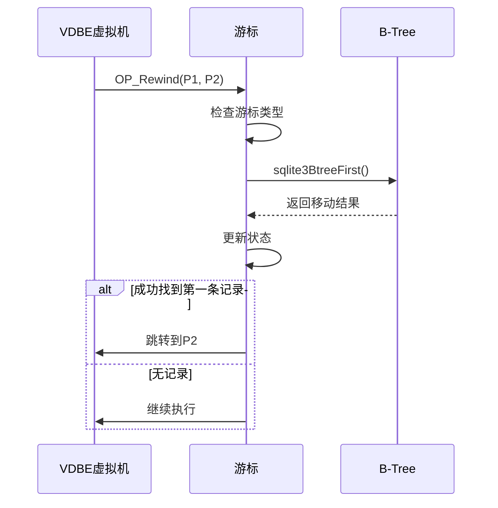
```mermaid
sequenceDiagram
participant VDBE as VDBE虚拟机
participant Cursor as 游标
participant Btree as B-Tree
VDBE->>Cursor : OP_Rewind(P1, P2)
Cursor->>Cursor : 检查游标类型
Cursor->>Btree : sqlite3BtreeFirst()
Btree-->>Cursor : 返回移动结果
Cursor->>Cursor : 更新状态
alt 成功找到第一条记录
Cursor->>VDBE : 跳转到P2
else 无记录
Cursor->>VDBE : 继续执行
end
```

### Column指令

Column指令从当前记录中提取指定列的数据：

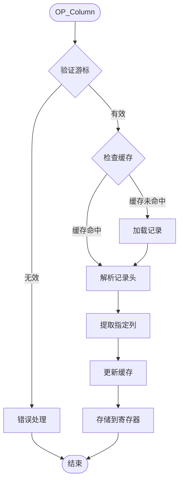
```mermaid
flowchart TD
Start([OP_Column]) --> ValidateCursor{验证游标}
ValidateCursor --> |有效| CheckCache{检查缓存}
ValidateCursor --> |无效| Error[错误处理]
CheckCache --> |缓存命中| ParseHeader[解析记录头]
CheckCache --> |缓存未命中| LoadRecord[加载记录]
LoadRecord --> ParseHeader
ParseHeader --> ExtractColumn[提取指定列]
ExtractColumn --> UpdateCache[更新缓存]
UpdateCache --> StoreResult[存储到寄存器]
Error --> End([结束])
StoreResult --> End
```

### MakeRecord指令

MakeRecord指令将多个寄存器组合成一个记录格式：

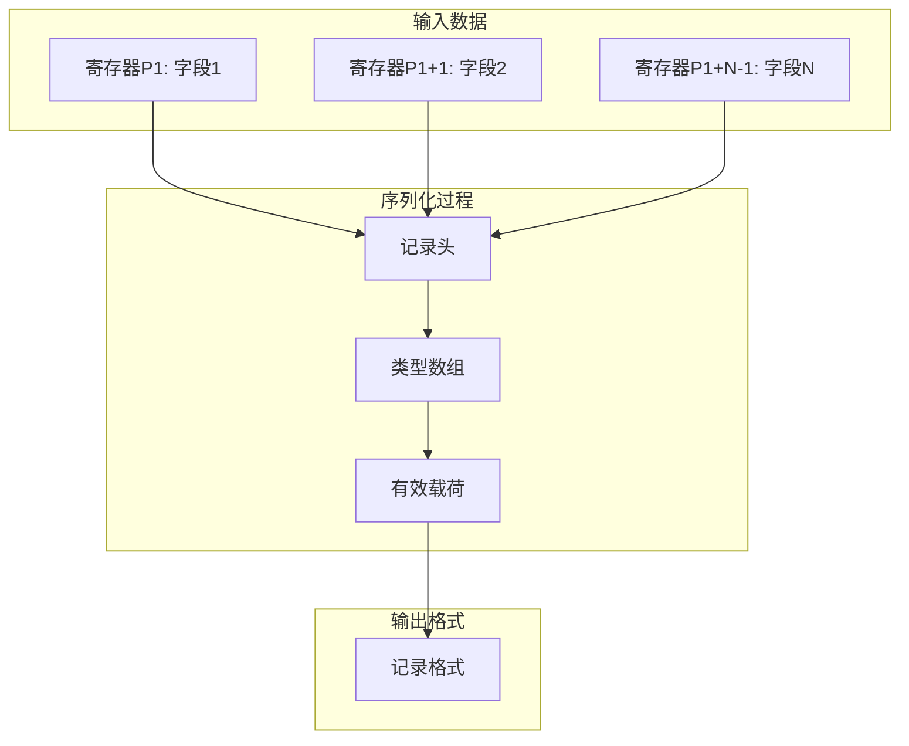
```mermaid
graph TB
subgraph "输入数据"
Reg1[寄存器P1: 字段1]
Reg2[寄存器P1+1: 字段2]
RegN[寄存器P1+N-1: 字段N]
end
subgraph "序列化过程"
Header[记录头]
TypeArray[类型数组]
Payload[有效载荷]
end
subgraph "输出格式"
Record[记录格式]
end
Reg1 --> Header
Reg2 --> Header
RegN --> Header
Header --> TypeArray
TypeArray --> Payload
Payload --> Record
```

**图表来源**
- [vdbe.c](file://src/vdbe.c#L3466-L3477)

**章节来源**
- [vdbe.c](file://src/vdbe.c#L2974-L3200)
- [vdbe.c](file://src/vdbe.c#L5500-L5800)

## 游标资源管理

### 内存管理

游标使用分层的内存管理策略：

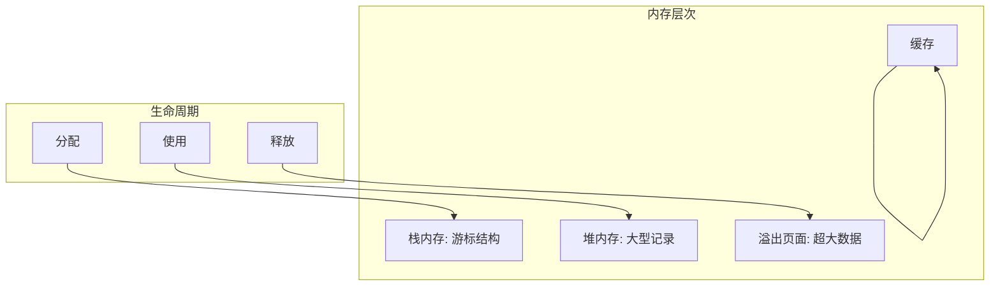
```mermaid
graph TB
subgraph "内存层次"
Stack[栈内存: 游标结构]
Heap[堆内存: 大型记录]
Cache[缓存: 文本/BLOB]
Overflow[溢出页面: 超大数据]
end
subgraph "生命周期"
Alloc[分配]
Use[使用]
Cache[缓存]
Release[释放]
end
Alloc --> Stack
Use --> Heap
Cache --> Cache
Release --> Overflow
```

### 游标关闭流程

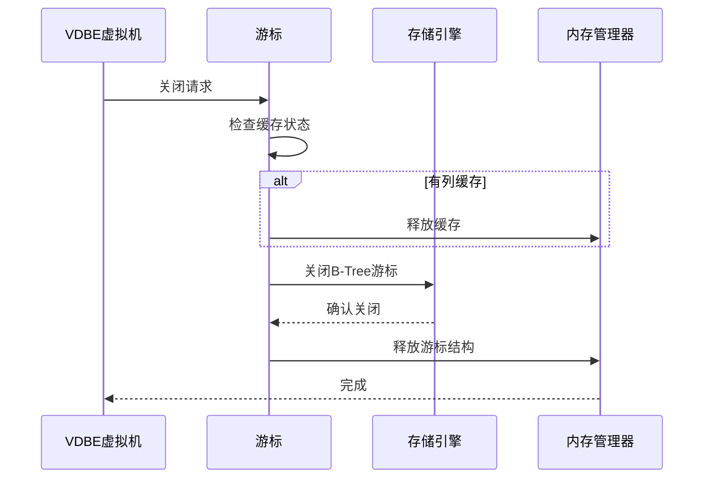
```mermaid
sequenceDiagram
participant VDBE as VDBE虚拟机
participant Cursor as 游标
participant Engine as 存储引擎
participant Memory as 内存管理器
VDBE->>Cursor : 关闭请求
Cursor->>Cursor : 检查缓存状态
alt 有列缓存
Cursor->>Memory : 释放缓存
end
Cursor->>Engine : 关闭B-Tree游标
Engine-->>Cursor : 确认关闭
Cursor->>Memory : 释放游标结构
Memory-->>VDBE : 完成
```

**章节来源**
- [vdbe.c](file://src/vdbe.c#L2741-L2800)

## 事务隔离级别影响

游标的行为受到事务隔离级别的显著影响：

### 隔离级别对比

| 隔离级别 | 游标行为 | 并发控制 | 性能影响 |
|---------|---------|---------|---------|
| READ UNCOMMITTED | 可见未提交更改 | 最低 | 最高 |
| READ COMMITTED | 只可见已提交更改 | 中等 | 中等 |
| REPEATABLE READ | 事务内一致性视图 | 较高 | 较低 |
| SERIALIZABLE | 完全隔离 | 最高 | 最低 |

### 游标状态同步

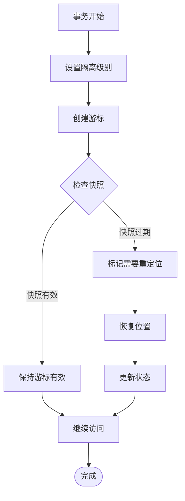
```mermaid
flowchart TD
Transaction[事务开始] --> SetLevel[设置隔离级别]
SetLevel --> CreateCursor[创建游标]
CreateCursor --> CheckSnapshot{检查快照}
CheckSnapshot --> |快照过期| RequireSeek[标记需要重定位]
CheckSnapshot --> |快照有效| ValidCursor[保持游标有效]
RequireSeek --> RestorePosition[恢复位置]
RestorePosition --> UpdateState[更新状态]
ValidCursor --> ContinueAccess[继续访问]
UpdateState --> ContinueAccess
ContinueAccess --> End([完成])
```

## 性能优化策略

### 缓存优化

游标实现了多级缓存机制以提高性能：

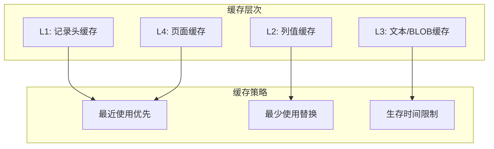
```mermaid
graph TB
subgraph "缓存层次"
L1[L1: 记录头缓存]
L2[L2: 列值缓存]
L3[L3: 文本/BLOB缓存]
L4[L4: 页面缓存]
end
subgraph "缓存策略"
MRU[最近使用优先]
LRU[最少使用替换]
TTL[生存时间限制]
end
L1 --> MRU
L2 --> LRU
L3 --> TTL
L4 --> MRU
```

### 位置预取

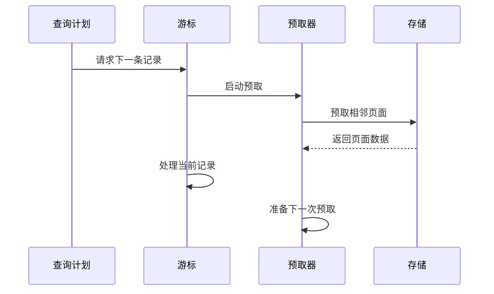
```mermaid
sequenceDiagram
participant Query as 查询计划
participant Cursor as 游标
participant Prefetch as 预取器
participant Storage as 存储
Query->>Cursor : 请求下一条记录
Cursor->>Prefetch : 启动预取
Prefetch->>Storage : 预取相邻页面
Storage-->>Prefetch : 返回页面数据
Cursor->>Cursor : 处理当前记录
Prefetch->>Prefetch : 准备下一次预取
```

### 批量操作优化

对于批量插入和更新操作，游标支持特殊的优化路径：

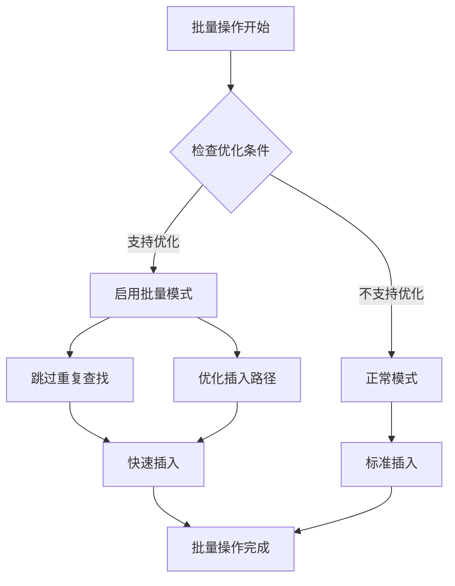
```mermaid
flowchart TD
BatchStart[批量操作开始] --> CheckOptimization{检查优化条件}
CheckOptimization --> |支持优化| EnableBulkMode[启用批量模式]
CheckOptimization --> |不支持优化| NormalMode[正常模式]
EnableBulkMode --> SkipSeek[跳过重复查找]
EnableBulkMode --> OptimizeInsert[优化插入路径]
SkipSeek --> FastInsert[快速插入]
OptimizeInsert --> FastInsert
NormalMode --> StandardInsert[标准插入]
FastInsert --> BatchComplete[批量操作完成]
StandardInsert --> BatchComplete
```

**章节来源**
- [vdbe.c](file://src/vdbe.c#L4455-L4500)

## 故障排除指南

### 常见游标问题

#### 游标状态异常

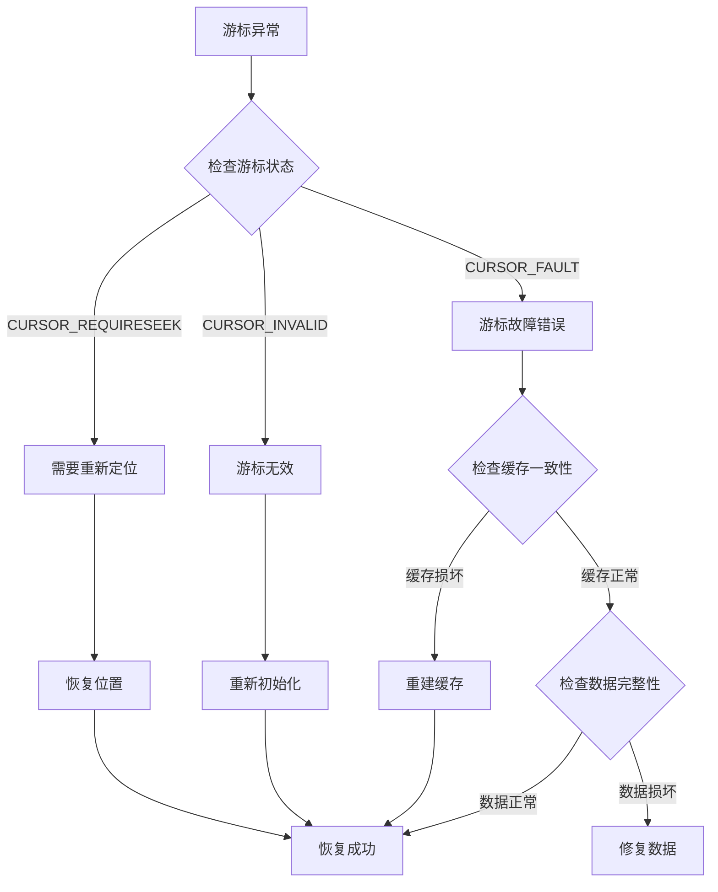
```mermaid
flowchart TD
Problem[游标异常] --> CheckState{检查游标状态}
CheckState --> |CURSOR_FAULT| FaultError[游标故障错误]
CheckState --> |CURSOR_REQUIRESEEK| SeekError[需要重新定位]
CheckState --> |CURSOR_INVALID| InvalidError[游标无效]
FaultError --> CheckCache{检查缓存一致性}
SeekError --> RestorePosition[恢复位置]
InvalidError --> Reinitialize[重新初始化]
CheckCache --> |缓存损坏| RecreateCache[重建缓存]
CheckCache --> |缓存正常| CheckData{检查数据完整性}
RestorePosition --> Success[恢复成功]
Reinitialize --> Success
RecreateCache --> Success
CheckData --> |数据损坏| RepairData[修复数据]
CheckData --> |数据正常| Success
```

#### 性能问题诊断

常见的性能问题及其解决方案：

| 问题类型 | 症状 | 原因 | 解决方案 |
|---------|------|------|---------|
| 缓存未命中率高 | 查询速度慢 | 缓存大小不足 | 增加页面缓存 |
| 频繁的磁盘I/O | 响应时间长 | 缺少预取 | 启用预取功能 |
| 内存使用过高 | 系统内存不足 | 大型记录未缓存 | 实施流式处理 |
| 游标频繁重定位 | 重复扫描 | 隔离级别过高 | 调整事务隔离级别 |

**章节来源**
- [vdbe.c](file://src/vdbe.c#L3080-L3092)

## 总结

VDBE游标操作机制是SQLite数据库引擎的核心组件，它通过精心设计的状态机、高效的序列化格式和智能的缓存策略，实现了高性能的数据访问。理解游标的内部工作原理对于优化查询性能、调试复杂问题以及开发高效的应用程序至关重要。

关键要点：
1. **分层架构**：VDBE游标提供统一的抽象接口，屏蔽了底层存储引擎的复杂性
2. **状态管理**：严格的游标状态转换确保数据访问的一致性和可靠性
3. **序列化优化**：高效的键值序列化机制支持各种数据类型的快速处理
4. **缓存策略**：多级缓存系统显著提升查询性能
5. **事务集成**：游标行为与事务隔离级别紧密集成，保证并发安全性

通过深入理解这些机制，开发者可以更好地利用SQLite的强大功能，构建高性能、可靠的数据应用程序。