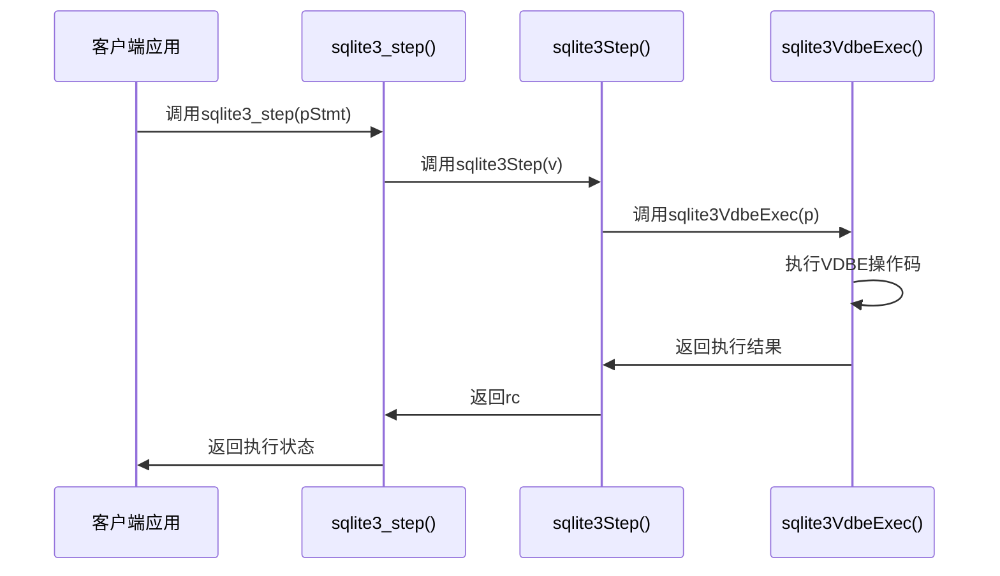
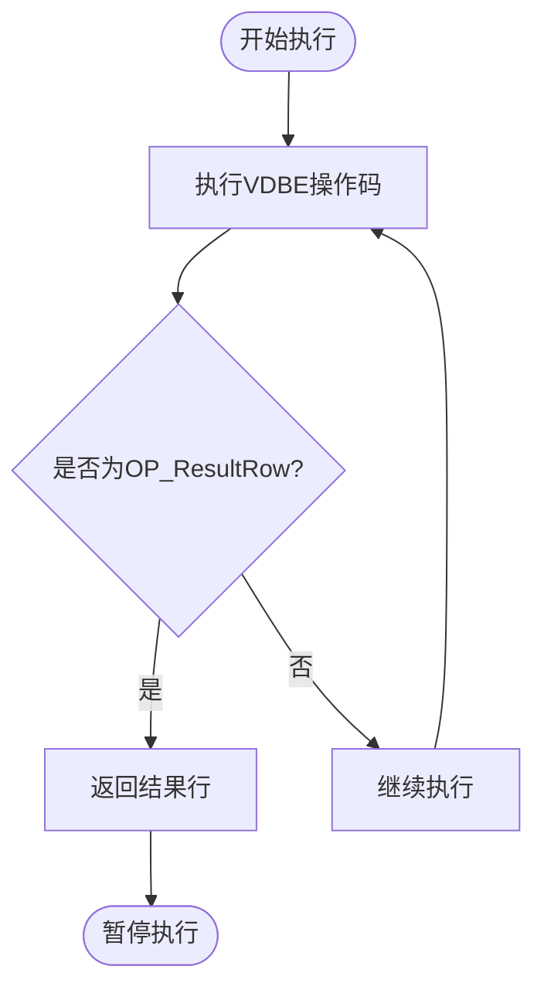
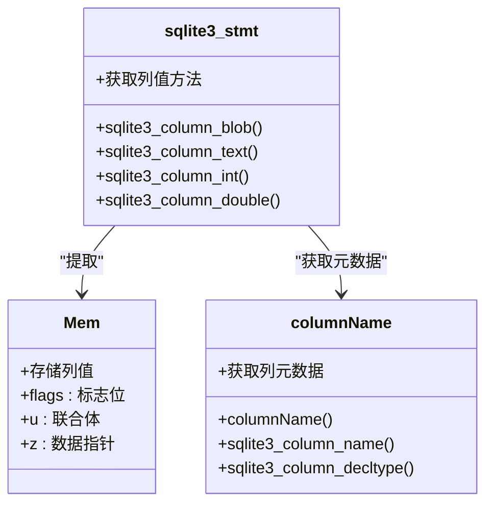
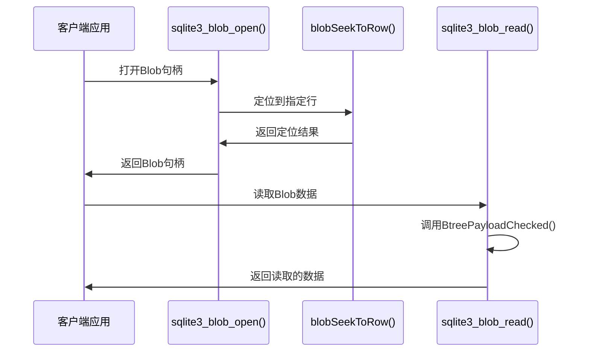
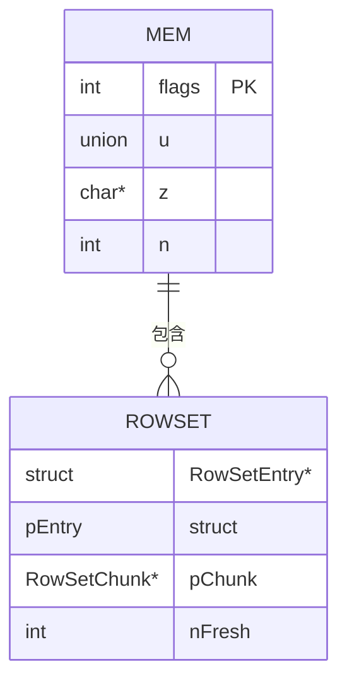
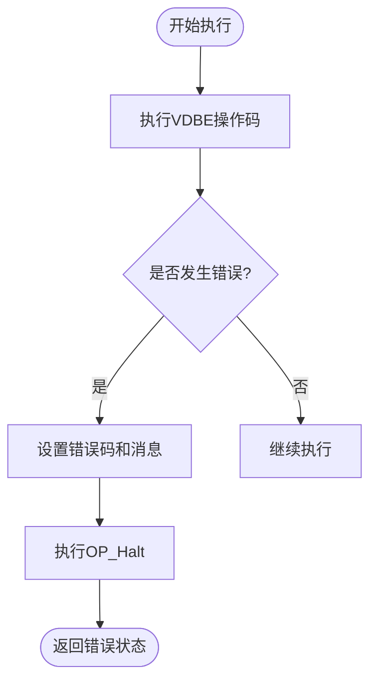

# 结果处理

<cite>
**本文档中引用的文件**   
- [vdbeapi.c](file://src/vdbeapi.c)
- [vdbe.c](file://src/vdbe.c)
- [vdbe.h](file://src/vdbe.h)
- [main.c](file://src/main.c)
- [vdbeblob.c](file://src/vdbeblob.c)
</cite>

## 目录
1. [引言](#引言)
2. [VDBE执行与结果生成](#vdbe执行与结果生成)
3. [结果集逐行处理机制](#结果集逐行处理机制)
4. [列值提取与元数据获取](#列值提取与元数据获取)
5. [Blob流式读取支持](#blob流式读取支持)
6. [大型结果集内存管理](#大型结果集内存管理)
7. [错误码生成与诊断信息](#错误码生成与诊断信息)
8. [结果处理最佳实践](#结果处理最佳实践)
9. [结论](#结论)

## 引言
SQLite数据库引擎通过虚拟数据库引擎（VDBE）执行SQL语句并返回结果给客户端。本文档详细说明VDBE如何处理和返回执行结果，重点分析sqlite3_step() API如何驱动VDBE执行并获取结果行，包括列值提取（sqlite3_column_*系列函数）和元数据获取。文档还描述了结果集的逐行生成机制、Blob流式读取支持以及大型结果集的内存管理策略，同时分析错误码生成、错误消息传递和诊断信息收集流程，并提供高效结果处理的最佳实践。

## VDBE执行与结果生成
VDBE是SQLite的核心执行引擎，负责执行预编译的SQL语句。sqlite3_step() API是驱动VDBE执行的主要接口，它通过调用sqlite3Step()函数来执行VDBE程序，直到生成一行结果、语句完全执行或发生错误。

**图源**
- [vdbeapi.c](file://src/vdbeapi.c#L894-L941)
- [vdbe.c](file://src/vdbe.c#L839-L872)

**节源**
- [vdbeapi.c](file://src/vdbeapi.c#L894-L941)
- [vdbe.c](file://src/vdbe.c#L839-L872)

## 结果集逐行处理机制
VDBE通过OP_ResultRow操作码生成结果行，该操作码将当前游标的数据作为结果行返回。结果集采用逐行生成的方式，每次调用sqlite3_step()时，VDBE执行到下一个OP_ResultRow操作码，生成一行结果并暂停执行，等待下一次调用。

**图源**
- [vdbe.c](file://src/vdbe.c#L2974-L2998)
- [vdbe.c](file://src/vdbe.c#L3000-L3036)

**节源**
- [vdbe.c](file://src/vdbe.c#L2974-L3036)

## 列值提取与元数据获取
客户端通过sqlite3_column_*系列函数提取结果行中的列值。这些函数通过columnMem()宏获取对应列的内存单元（Mem结构），然后调用sqlite3_value_*系列函数提取具体值。元数据获取包括列名、数据类型、声明类型等信息，通过columnName()函数实现。

**图源**
- [vdbeapi.c](file://src/vdbeapi.c#L1358-L1557)
- [vdbe.h](file://src/vdbe.h#L0-L434)

**节源**
- [vdbeapi.c](file://src/vdbeapi.c#L1358-L1557)

## Blob流式读取支持
SQLite通过增量Blob I/O机制支持Blob数据的流式读取。sqlite3_blob_open()函数创建一个Incrblob结构，该结构包含指向B树游标的指针和保持游标打开的语句。客户端通过sqlite3_blob_read()和sqlite3_blob_write()函数直接读写Blob数据，而无需将整个Blob加载到内存中。

**图源**
- [vdbeblob.c](file://src/vdbeblob.c#L0-L534)
- [vdbeblob.c](file://src/vdbeblob.c#L36-L61)

**节源**
- [vdbeblob.c](file://src/vdbeblob.c#L0-L534)

## 大型结果集内存管理
VDBE通过内存单元（Mem结构）管理结果集数据，采用惰性求值策略，只在需要时才将数据从存储格式转换为内存格式。对于大型结果集，VDBE利用游标的缓存机制，避免重复解析记录头。RowSet结构用于管理行集合，通过预分配的内存块减少内存分配开销。

**图源**
- [vdbe.c](file://src/vdbe.c#L2974-L2998)
- [rowset.c](file://src/rowset.c#L66-L100)

**节源**
- [vdbe.c](file://src/vdbe.c#L2974-L2998)
- [rowset.c](file://src/rowset.c#L66-L100)

## 错误码生成与诊断信息
VDBE在执行过程中检测到错误时，通过OP_Halt操作码终止执行，并设置相应的错误码。错误码通过sqlite3VdbeError()函数设置，错误消息存储在Vdbe结构的zErrMsg字段中。诊断信息包括执行时间、虚拟机步数等，可通过sqlite3_stmt_status()函数获取。

**图源**
- [vdbe.c](file://src/vdbe.c#L9220-L9257)
- [main.c](file://src/main.c#L3915-L3950)

**节源**
- [vdbe.c](file://src/vdbe.c#L9220-L9257)
- [main.c](file://src/main.c#L3915-L3950)

## 结果处理最佳实践
为了高效处理结果，建议重用预编译语句，避免重复解析SQL。遍历结果集时，应使用适当的列值提取函数，并注意内存管理。对于大型结果集，考虑使用增量Blob I/O或分页查询。错误处理应检查返回码，并在必要时获取详细的错误消息。

**节源**
- [vdbeapi.c](file://src/vdbeapi.c#L894-L941)
- [vdbe.c](file://src/vdbe.c#L839-L872)

## 结论
SQLite的VDBE引擎通过高效的逐行结果生成机制和灵活的内存管理策略，为客户端提供了强大的结果处理能力。通过理解sqlite3_step() API的执行流程、列值提取机制、Blob流式读取支持和错误处理模式，开发者可以编写出高效、可靠的数据库应用程序。遵循最佳实践，如预编译语句重用和结果集遍历优化，可以进一步提升应用性能。