# 虚拟数据库引擎

<cite>
**本文档引用的文件**
- [vdbe.h](file://src/vdbe.h)
- [vdbeInt.h](file://src/vdbeInt.h)
- [vdbe.c](file://src/vdbe.c)
- [vdbeapi.c](file://src/vdbeapi.c)
- [vdbemem.c](file://src/vdbemem.c)
- [vdbeaux.c](file://src/vdbeaux.c)
- [vdbesort.c](file://src/vdbesort.c)
</cite>

## 目录
1. [简介](#简介)
2. [项目结构](#项目结构)
3. [核心组件](#核心组件)
4. [架构概览](#架构概览)
5. [详细组件分析](#详细组件分析)
6. [依赖关系分析](#依赖关系分析)
7. [性能考虑](#性能考虑)
8. [故障排除指南](#故障排除指南)
9. [结论](#结论)

## 简介

SQLite虚拟数据库引擎（VDBE，Virtual Database Engine）是SQLite数据库系统的核心组件，它实现了一个字节码虚拟机，用于执行SQL语句编译后的字节码程序。VDBE作为SQLite的中间层，将高级SQL语言转换为底层的字节码指令序列，这些指令在虚拟机中逐条执行，最终完成数据库操作。

VDBE的主要特点包括：
- 字节码虚拟机架构
- 寄存器模型的数据存储
- 游标（Cursor）机制用于数据库访问
- 内存单元（Mem）管理系统
- 子程序和触发器支持
- 性能优化和缓存机制

## 项目结构

VDBE相关的源代码主要分布在以下文件中：

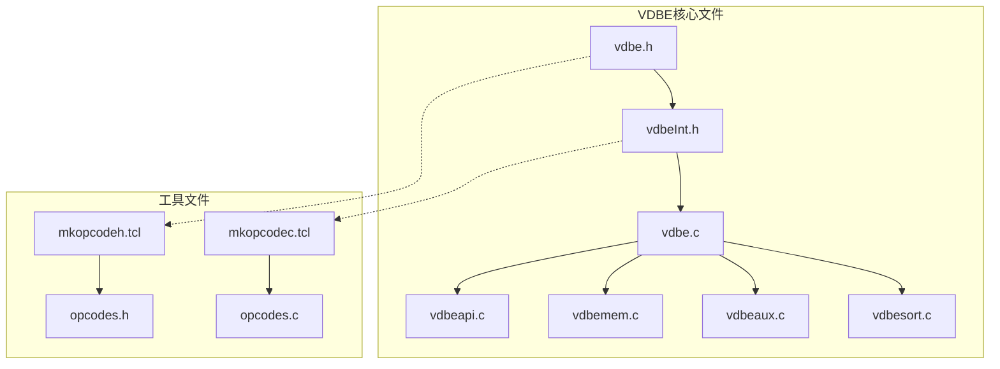

**图表来源**
- [vdbe.h](file://src/vdbe.h#L1-L50)
- [vdbeInt.h](file://src/vdbeInt.h#L1-L50)
- [vdbe.c](file://src/vdbe.c#L1-L50)

**章节来源**
- [vdbe.h](file://src/vdbe.h#L1-L435)
- [vdbeInt.h](file://src/vdbeInt.h#L1-L752)

## 核心组件

### VDBE结构体

VDBE的核心数据结构定义了虚拟机的完整状态：

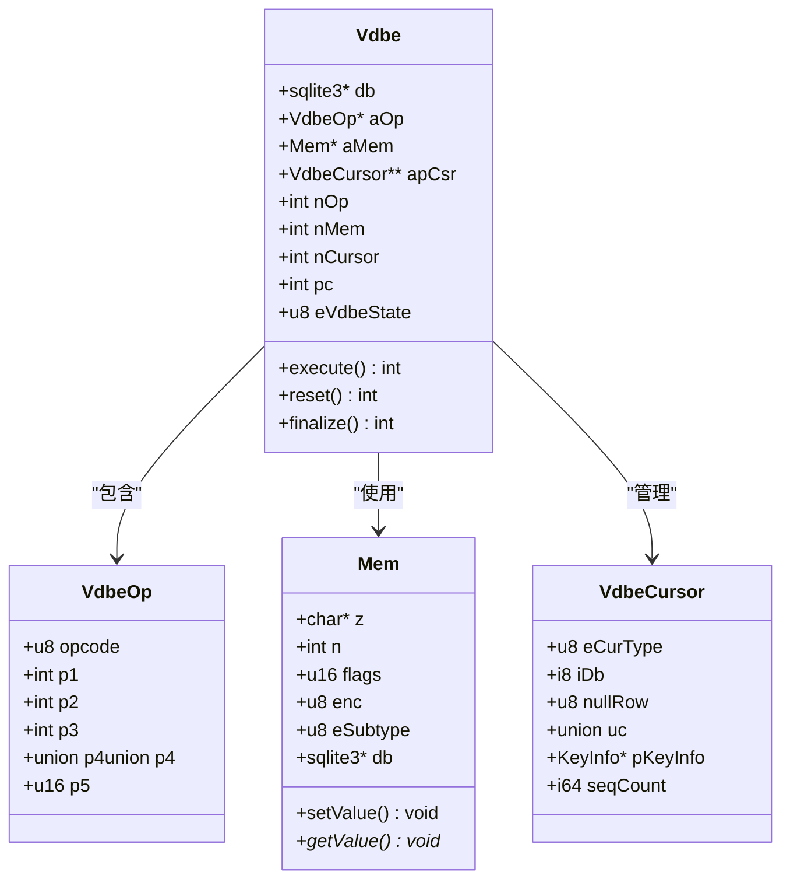

**图表来源**
- [vdbe.h](file://src/vdbe.h#L100-L200)
- [vdbeInt.h](file://src/vdbeInt.h#L100-L200)

### 指令集架构

VDBE使用基于寄存器的指令集架构，每条指令包含操作码和最多三个操作数：

| 操作码类型 | 描述 | 示例 |
|------------|------|------|
| OP_Noop | 无操作 | 用于调试和填充 |
| OP_Goto | 跳转指令 | 实现条件跳转和循环 |
| OP_Halt | 停止指令 | 终止查询执行 |
| OP_Column | 列访问 | 从游标读取列值 |
| OP_Function | 函数调用 | 执行用户定义函数 |
| OP_Jump | 分支指令 | 条件判断和跳转 |

**章节来源**
- [vdbe.c](file://src/vdbe.c#L1013-L1035)

## 架构概览

VDBE的整体架构采用分层设计，从上到下包括：

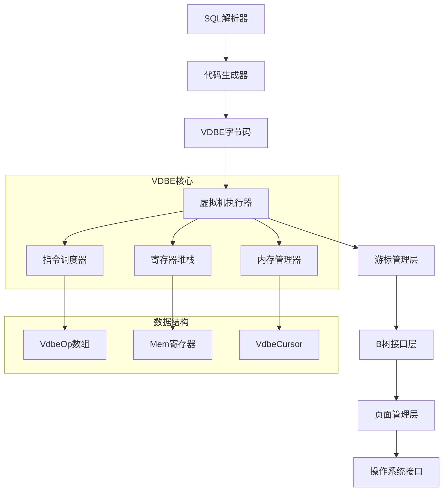

**图表来源**
- [vdbe.c](file://src/vdbe.c#L839-L872)
- [vdbeInt.h](file://src/vdbeInt.h#L100-L200)

## 详细组件分析

### 字节码执行循环

VDBE的主执行循环是整个系统的核心，负责逐条执行字节码指令：

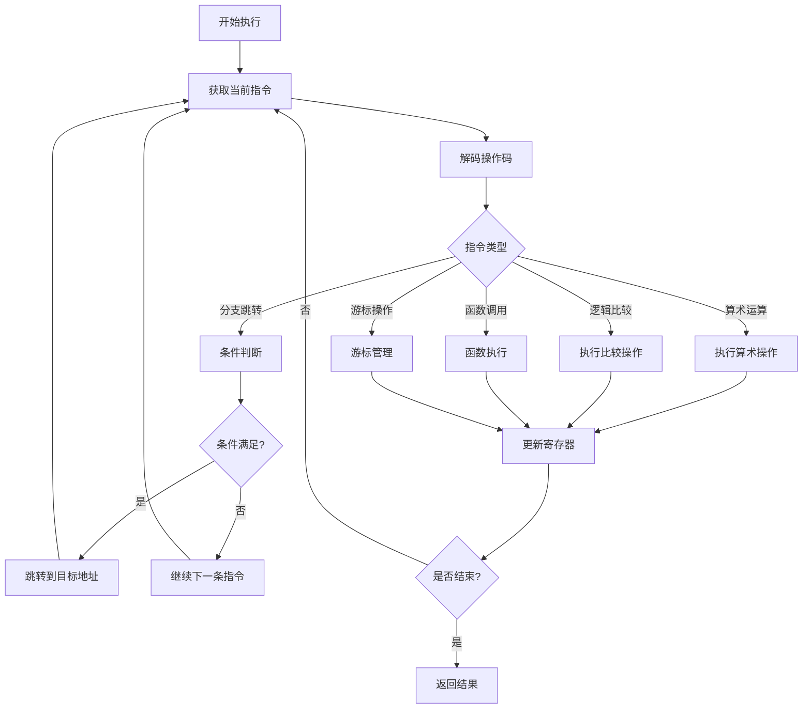

**图表来源**
- [vdbe.c](file://src/vdbe.c#L839-L872)

### 寄存器模型

VDBE使用寄存器模型来存储和传递数据，每个寄存器对应一个内存单元：

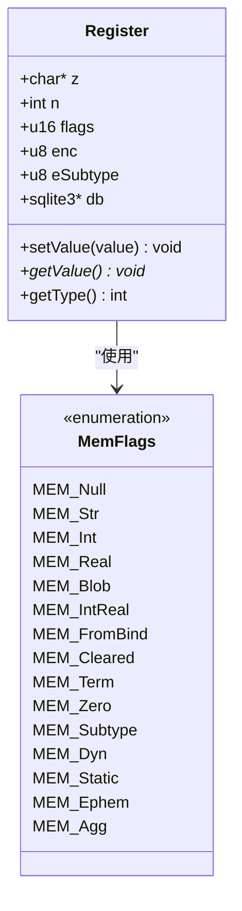

**图表来源**
- [vdbemem.c](file://src/vdbemem.c#L100-L200)

### 游标（Cursor）系统

游标是VDBE访问数据库的核心机制，支持多种类型的游标：

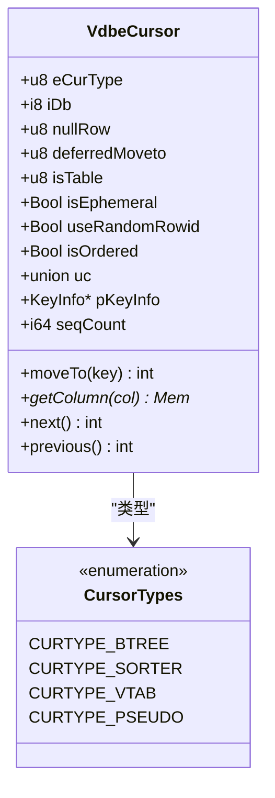

**图表来源**
- [vdbeInt.h](file://src/vdbeInt.h#L50-L150)

### 内存单元（Mem）管理

内存单元是VDBE中最重要的数据结构，用于存储各种类型的数据：

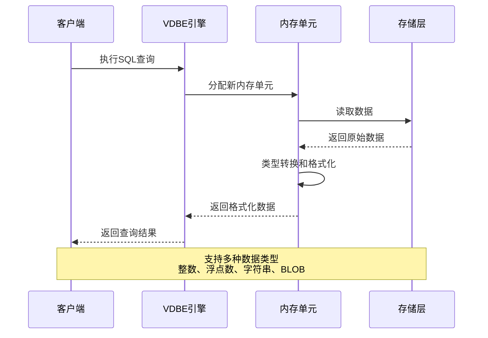

**图表来源**
- [vdbemem.c](file://src/vdbemem.c#L300-L400)

**章节来源**
- [vdbe.c](file://src/vdbe.c#L8000-L8799)
- [vdbemem.c](file://src/vdbemem.c#L1-L799)

### 子程序和触发器

VDBE支持子程序和触发器机制，实现复杂的控制流程：

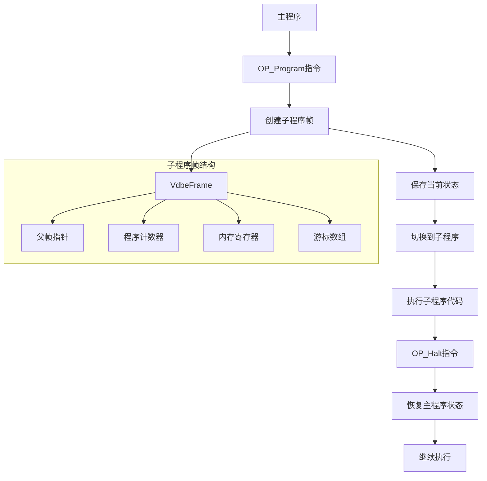

**图表来源**
- [vdbe.c](file://src/vdbe.c#L7391-L7501)

**章节来源**
- [vdbe.c](file://src/vdbe.c#L7391-L7501)
- [vdbeInt.h](file://src/vdbeInt.h#L172-L224)

### 排序器（Sorter）

VDBE内置了高效的排序器，支持大表的外部排序：

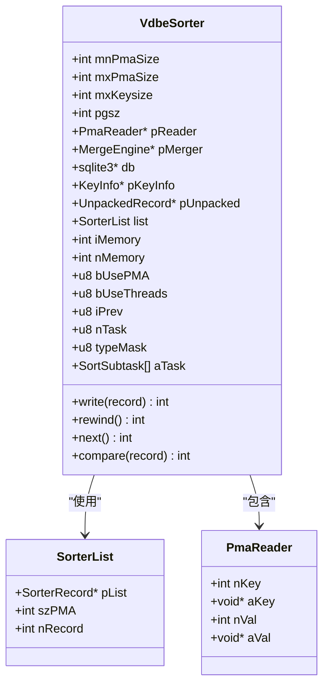

**图表来源**
- [vdbesort.c](file://src/vdbesort.c#L308-L336)

**章节来源**
- [vdbesort.c](file://src/vdbesort.c#L916-L942)

## 依赖关系分析

VDBE系统的依赖关系复杂，涉及多个层次的模块：

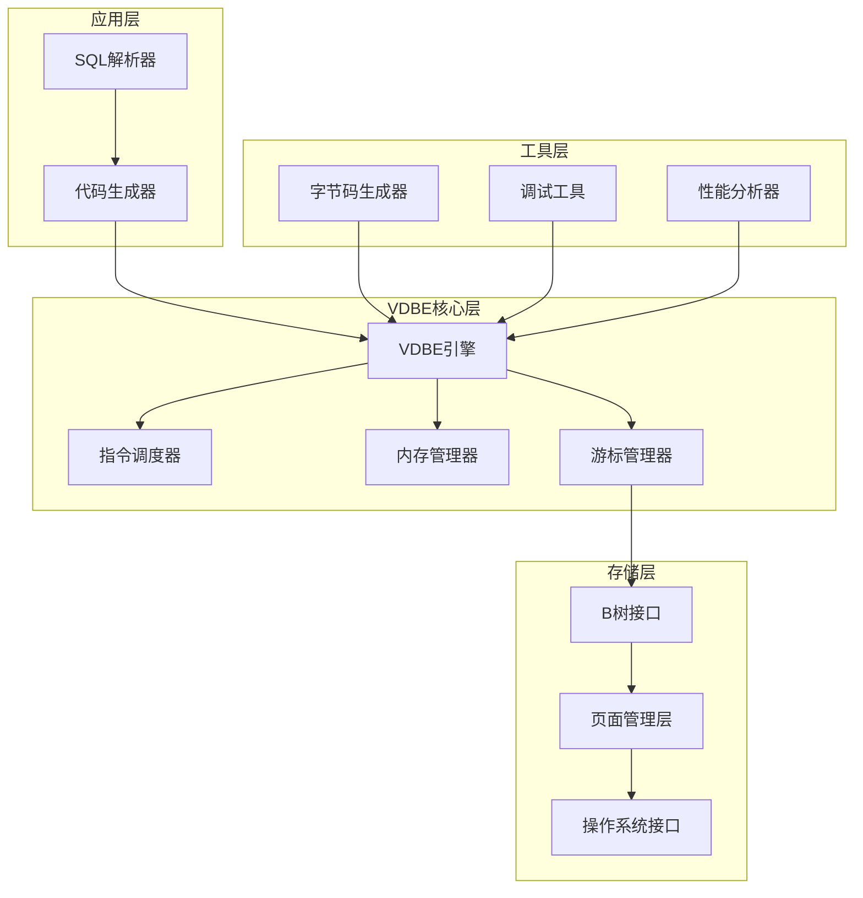

**图表来源**
- [vdbe.h](file://src/vdbe.h#L1-L50)
- [vdbeInt.h](file://src/vdbeInt.h#L1-L50)

**章节来源**
- [vdbe.h](file://src/vdbe.h#L1-L435)
- [vdbeInt.h](file://src/vdbeInt.h#L1-L752)

## 性能考虑

### 字节码优化

VDBE实现了多种字节码优化技术：

1. **指令合并**：将连续的相似指令合并为单个指令
2. **常量折叠**：在编译时计算常量表达式
3. **死代码消除**：移除不会执行的代码路径
4. **寄存器重用**：优化寄存器分配和重用

### 执行计划缓存

VDBE支持执行计划缓存以提高性能：

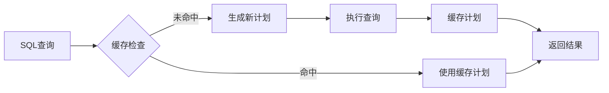

### 内存管理优化

VDBE采用多种内存管理策略：

- **延迟分配**：按需分配内存
- **内存池**：减少频繁的内存分配和释放
- **引用计数**：自动管理内存生命周期
- **垃圾回收**：定期清理不再使用的内存

## 故障排除指南

### 常见错误类型

VDBE可能遇到的常见错误包括：

| 错误类型 | 描述 | 解决方案 |
|----------|------|----------|
| 内存不足 | 分配内存失败 | 增加可用内存或优化查询 |
| 数据类型不匹配 | 寄存器类型错误 | 检查类型转换逻辑 |
| 游标状态异常 | 游标位置错误 | 重新打开游标或重置状态 |
| 触发器递归 | 触发器调用深度超限 | 检查触发器逻辑和递归条件 |

### 调试技巧

1. **启用调试模式**：使用`SQLITE_DEBUG`宏获取详细信息
2. **跟踪执行**：通过`PRAGMA vdbe_trace=ON`跟踪指令执行
3. **性能分析**：使用`VDBE_PROFILE`宏分析性能瓶颈
4. **内存检查**：利用内存泄漏检测工具

**章节来源**
- [vdbe.c](file://src/vdbe.c#L839-L872)
- [vdbeapi.c](file://src/vdbeapi.c#L834-L872)

## 结论

SQLite虚拟数据库引擎是一个精心设计的字节码虚拟机，它成功地将复杂的SQL语言转换为高效的机器代码。VDBE的核心优势包括：

1. **简洁性**：基于寄存器的简单指令集
2. **高效性**：优化的执行循环和内存管理
3. **灵活性**：支持多种数据类型和控制流
4. **可扩展性**：模块化设计便于功能扩展

VDBE的设计体现了软件工程中的重要原则：通过抽象简化复杂性，通过优化提升性能，通过模块化保证可维护性。这种设计理念不仅适用于数据库系统，也为其他编译器和虚拟机的设计提供了宝贵的参考。

随着SQLite的不断发展，VDBE也在持续演进，引入新的优化技术和功能特性，以满足现代应用对数据库性能和功能的需求。对于开发者而言，深入理解VDBE的工作原理有助于编写更高效的SQL查询和更好的应用程序。