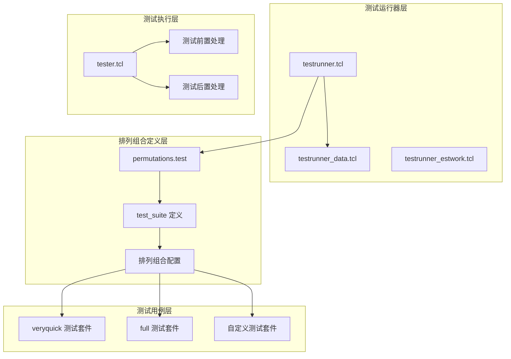
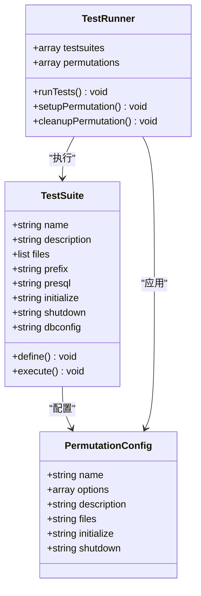
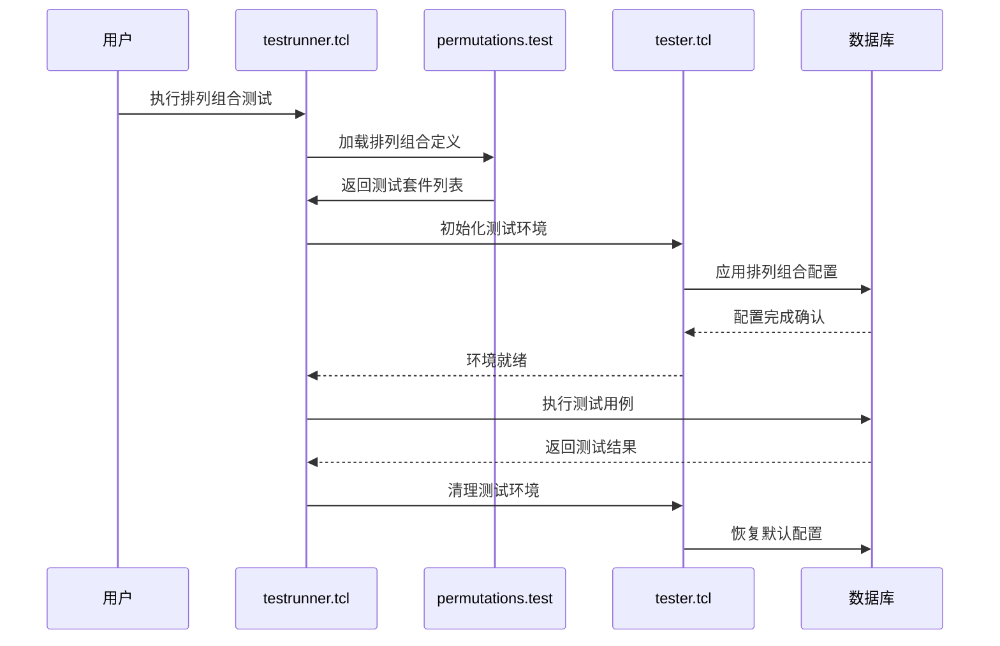
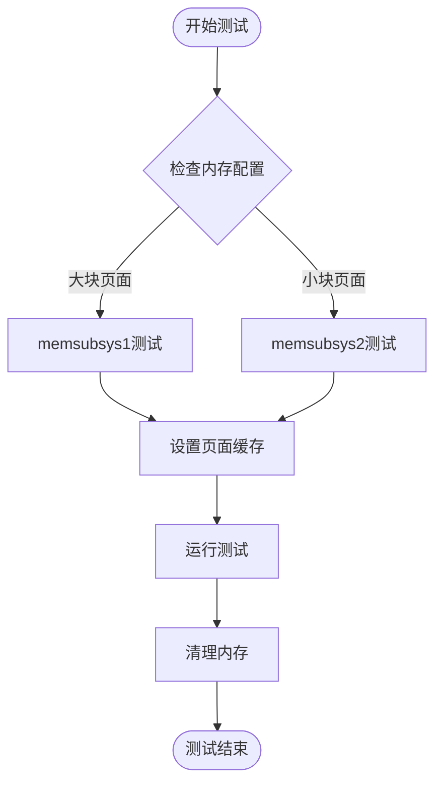
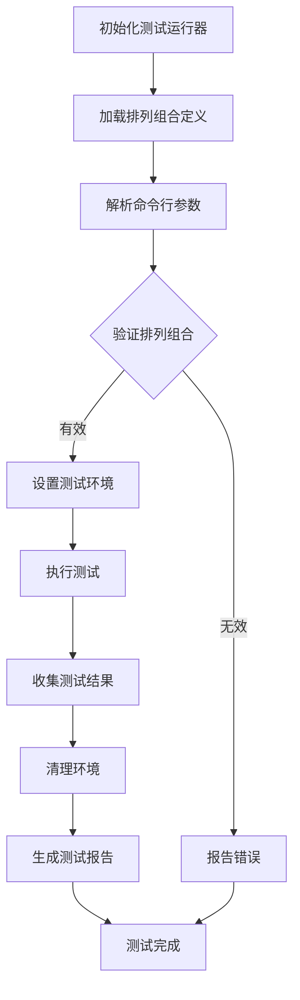

# SQLite排列组合测试系统

<cite>
**本文档中引用的文件**
- [testrunner.tcl](file://test/testrunner.tcl)
- [permutations.test](file://test/permutations.test)
- [testrunner_data.tcl](file://test/testrunner_data.tcl)
- [tester.tcl](file://test/tester.tcl)
- [testrunner.md](file://doc/testrunner.md)
</cite>

## 目录
1. [简介](#简介)
2. [排列组合测试架构概述](#排列组合测试架构概述)
3. [排列组合定义系统](#排列组合定义系统)
4. [测试运行器集成](#测试运行器集成)
5. [排列组合类型详解](#排列组合类型详解)
6. [自定义排列组合开发](#自定义排列组合开发)
7. [测试执行流程](#测试执行流程)
8. [故障排除指南](#故障排除指南)
9. [最佳实践](#最佳实践)
10. [总结](#总结)

## 简介

SQLite的排列组合测试系统是一个强大的框架，用于在多种运行时配置下验证数据库的行为和稳定性。该系统通过定义不同的"排列"（permutations）来模拟各种可能的配置组合，包括启用或禁用特定功能、设置不同的页面大小、配置内存管理策略等。

排列组合测试的核心价值在于：
- **全面性**：覆盖各种配置组合，确保代码在不同环境下的正确性
- **自动化**：自动化的测试执行和结果收集
- **可扩展性**：易于添加新的排列组合和测试用例
- **并行执行**：支持多核并行测试，提高测试效率

## 排列组合测试架构概述

排列组合测试系统由以下核心组件构成：



**图表来源**
- [testrunner.tcl](file://test/testrunner.tcl#L1-L50)
- [permutations.test](file://test/permutations.test#L1-L100)

**章节来源**
- [testrunner.tcl](file://test/testrunner.tcl#L1-L100)
- [permutations.test](file://test/permutations.test#L1-L100)

## 排列组合定义系统

### test_suite 宏定义

排列组合测试系统使用 `test_suite` 宏来定义测试套件。每个测试套件包含以下关键元素：



**图表来源**
- [permutations.test](file://test/permutations.test#L20-L50)
- [testrunner_data.tcl](file://test/testrunner_data.tcl#L1-L50)

### 核心排列组合类型

#### 内存管理系统排列组合

| 排列组合 | 描述 | 主要特性 |
|---------|------|----------|
| `memsubsys1` | 预分配页面块测试 | 使用4096字节页面和24个预分配块 |
| `memsubsys2` | 小页面块测试 | 使用512字节页面和5个预分配块 |
| `memsys3` | mem3.c分配器测试 | 使用自定义内存分配器 |
| `memsys5` | mem5.c分配器测试 | 使用内存池分配器 |
| `nolookaside` | 禁用lookaside缓存 | 强制OOM测试 |

#### 锁定模式排列组合

| 排列组合 | 描述 | 应用场景 |
|---------|------|----------|
| `exclusive` | 独占锁定模式 | 单用户环境测试 |
| `fullmutex` | 全互斥锁模式 | 多线程安全测试 |
| `multithread` | 多线程模式 | 并发访问测试 |
| `singlethread` | 单线程模式 | 性能基准测试 |

#### 日志模式排列组合

| 排列组合 | 描述 | 特点 |
|---------|------|------|
| `persistent_journal` | 持久化日志模式 | 数据库崩溃恢复测试 |
| `no_journal` | 无日志模式 | 性能优化测试 |
| `inmemory_journal` | 内存日志模式 | 快速事务测试 |
| `wal` | WAL模式 | 并发读写测试 |

**章节来源**
- [permutations.test](file://test/permutations.test#L400-L800)

## 测试运行器集成

### testrunner.tcl 的排列组合处理

测试运行器通过以下机制处理排列组合：



**图表来源**
- [testrunner.tcl](file://test/testrunner.tcl#L1100-L1200)
- [tester.tcl](file://test/tester.tcl#L80-L120)

### 排列组合生命周期管理

每个排列组合都有明确的生命周期：

1. **初始化阶段**：设置测试前的环境状态
2. **执行阶段**：运行测试用例
3. **清理阶段**：恢复原始环境状态

**章节来源**
- [testrunner.tcl](file://test/testrunner.tcl#L1150-L1250)

## 排列组合类型详解

### 基础排列组合

#### veryquick 排列组合
这是最基础的快速测试套件，包含所有基本功能测试，但排除了内存和IO错误测试。

#### full 排列组合
包含所有可用的测试用例，是最完整的测试套件。

### 内存管理排列组合

#### 预分配页面块测试 (`memsubsys1`, `memsubsys2`)
这些排列组合测试SQLite的页面缓存机制：



**图表来源**
- [permutations.test](file://test/permutations.test#L600-L650)

#### 分配器测试 (`memsys3`, `memsys5`)
测试不同的内存分配策略对数据库性能和稳定性的影响。

### 锁定模式排列组合

#### 独占模式 (`exclusive`)
适用于单用户环境，提供最佳性能。

#### 多线程模式 (`multithread`)
允许多个线程同时访问数据库，测试并发安全性。

#### 全互斥模式 (`fullmutex`)
提供最高级别的线程安全保证。

### 日志模式排列组合

#### WAL模式 (`wal`)
支持并发读写操作，提供更好的并发性能。

#### 内存日志模式 (`inmemory_journal`)
将日志存储在内存中，提供最快的事务处理速度。

**章节来源**
- [permutations.test](file://test/permutations.test#L700-L900)

## 自定义排列组合开发

### 创建新的排列组合

开发者可以通过以下步骤创建自定义排列组合：

1. **定义测试套件**：使用 `test_suite` 宏
2. **设置初始化脚本**：配置测试环境
3. **设置清理脚本**：恢复原始状态
4. **指定测试文件**：选择要运行的测试用例

### 排列组合配置选项

每个排列组合可以配置以下选项：

| 选项 | 类型 | 描述 |
|------|------|------|
| `-description` | string | 排列组合的描述信息 |
| `-initialize` | script | 测试前的初始化脚本 |
| `-shutdown` | script | 测试后的清理脚本 |
| `-presql` | sql | 在测试前执行的SQL语句 |
| `-files` | list | 要运行的测试文件列表 |
| `-prefix` | string | 测试结果的前缀标识 |
| `-dbconfig` | script | 数据库配置脚本 |

### 示例：创建自定义排列组合

```tcl
test_suite "custom_permutation" \
    -description "自定义测试排列组合" \
    -initialize {
        # 设置自定义配置
        catch {db close}
        sqlite3_shutdown
        # 应用自定义配置
        sqlite3_initialize
        autoinstall_test_functions
    } \
    -shutdown {
        # 恢复默认配置
        catch {db close}
        sqlite3_shutdown
        sqlite3_initialize
        autoinstall_test_functions
    } \
    -files {
        # 指定要运行的测试文件
        select1.test
        insert.test
        update.test
    }
```

**章节来源**
- [permutations.test](file://test/permutations.test#L20-L80)

## 测试执行流程

### 排列组合测试执行顺序



**图表来源**
- [testrunner.tcl](file://test/testrunner.tcl#L1200-L1300)

### 并行测试执行

测试运行器支持多进程并行执行，通过以下机制实现：

1. **工作队列管理**：将测试任务分配给多个工作进程
2. **资源监控**：动态调整并行度以避免系统过载
3. **结果聚合**：收集和合并各进程的测试结果

**章节来源**
- [testrunner.tcl](file://test/testrunner.tcl#L200-L300)

## 故障排除指南

### 常见问题及解决方案

#### 排列组合测试失败

**问题症状**：
- 某些排列组合测试频繁失败
- 测试结果不一致

**排查步骤**：
1. 检查排列组合配置是否正确
2. 验证测试环境的一致性
3. 查看测试日志中的错误信息

**解决方案**：
```bash
# 运行特定排列组合进行调试
tclsh test/testrunner.tcl veryquick

# 使用详细模式运行
tclsh test/testrunner.tcl veryquick -verbose
```

#### 内存泄漏检测

对于内存相关的排列组合，可以使用以下工具：
- Valgrind（Linux）
- AddressSanitizer（跨平台）

#### 性能测试

对于性能敏感的排列组合，建议：
1. 使用 `--explain` 选项查看测试计划
2. 监控系统资源使用情况
3. 对比不同排列组合的性能数据

**章节来源**
- [testrunner.tcl](file://test/testrunner.tcl#L1400-L1500)

## 最佳实践

### 排列组合设计原则

1. **最小化原则**：每个排列组合应该测试最少的配置变化
2. **独立性原则**：排列组合之间应该相互独立
3. **可重现性原则**：测试结果应该在相同环境下可重现
4. **完整性原则**：覆盖关键的功能路径和边界条件

### 测试用例组织

- **按功能分组**：将相关的测试用例组织在一起
- **按复杂度排序**：从简单到复杂的测试顺序
- **按依赖关系**：考虑测试之间的依赖关系

### 性能优化

- **并行执行**：充分利用多核处理器
- **增量测试**：只运行发生变化的测试
- **智能调度**：根据测试历史优化执行顺序

### 维护策略

- **定期更新**：随着SQLite功能的发展更新排列组合
- **文档维护**：保持排列组合文档的及时更新
- **社区协作**：鼓励社区贡献新的排列组合

## 总结

SQLite的排列组合测试系统是一个精心设计的测试框架，它通过定义各种运行时配置组合来全面验证数据库的行为。该系统具有以下关键优势：

1. **全面覆盖**：通过多种排列组合覆盖各种使用场景
2. **高度自动化**：从测试执行到结果收集完全自动化
3. **灵活扩展**：易于添加新的排列组合和测试用例
4. **高效执行**：支持并行测试，提高测试效率

对于开发者而言，理解和掌握排列组合测试系统不仅有助于编写更可靠的测试，还能深入理解SQLite的各种特性和行为。随着SQLite项目的持续发展，这个测试系统将继续发挥重要作用，确保数据库引擎的质量和稳定性。

通过合理使用排列组合测试系统，开发团队可以在不同配置下验证SQLite的功能，发现潜在的问题，并确保代码在各种环境下的正确性和鲁棒性。