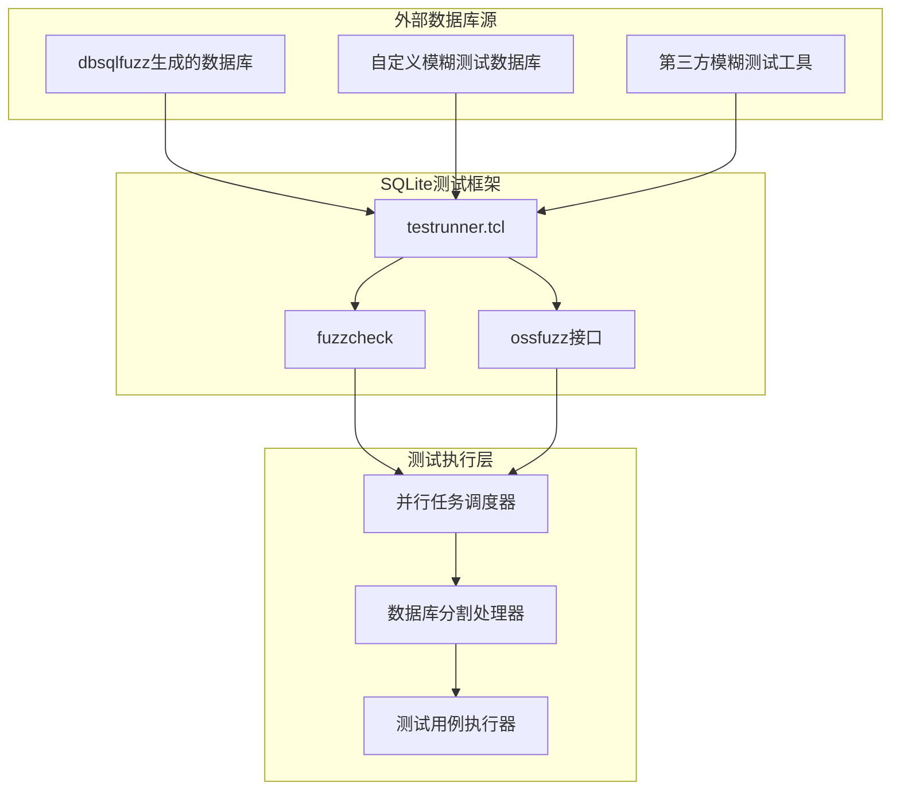
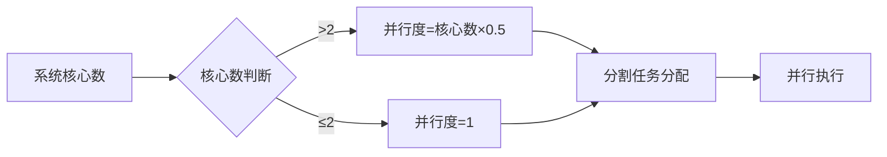
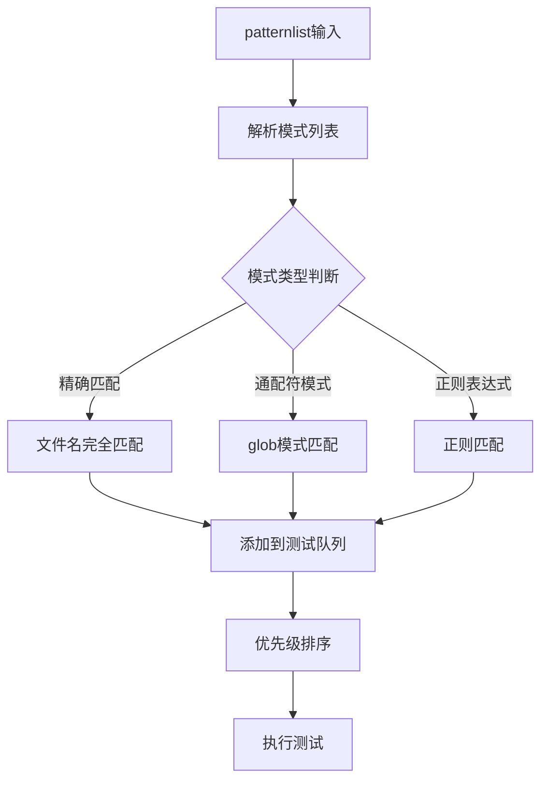
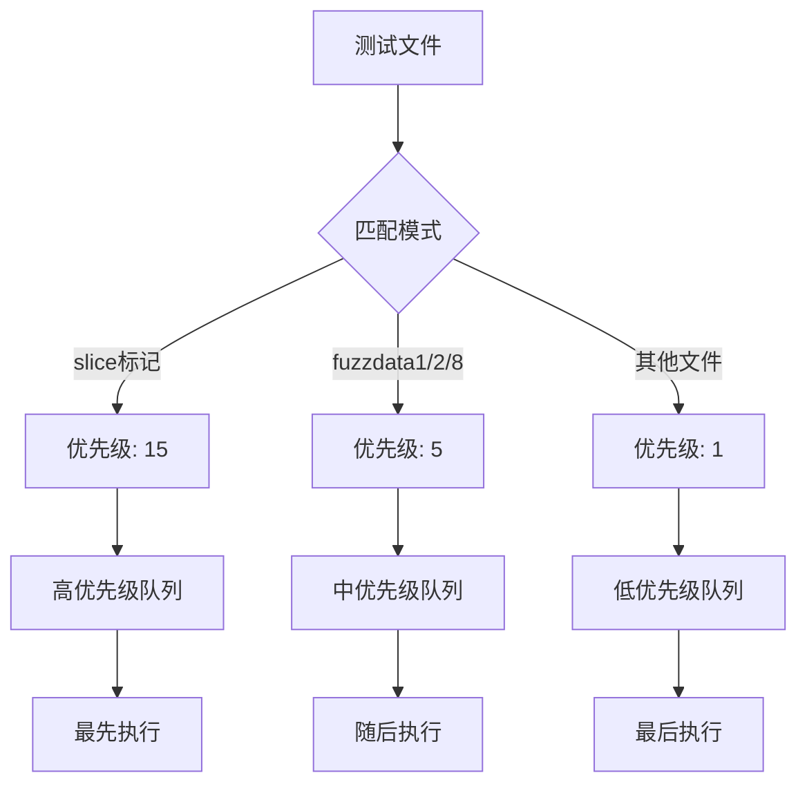
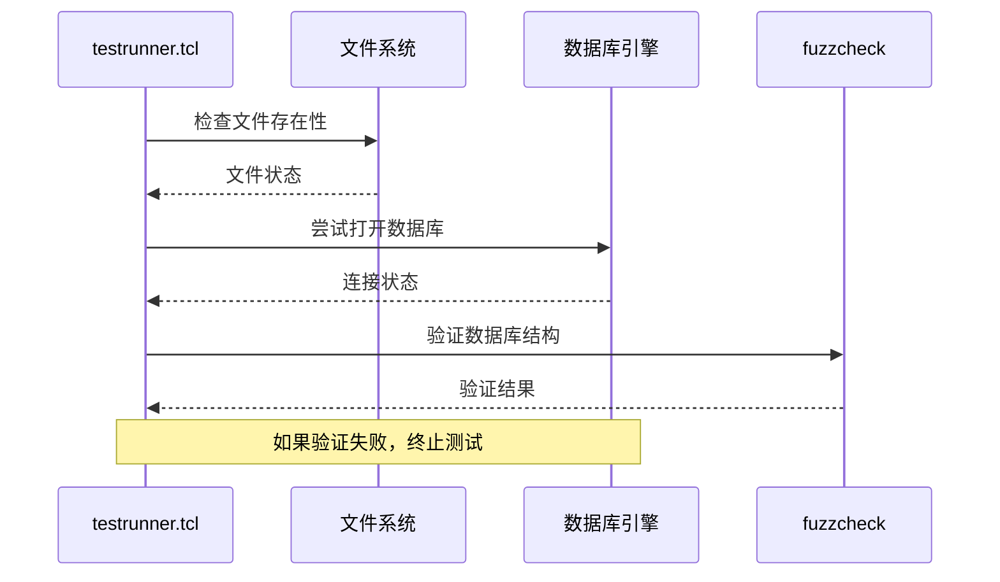
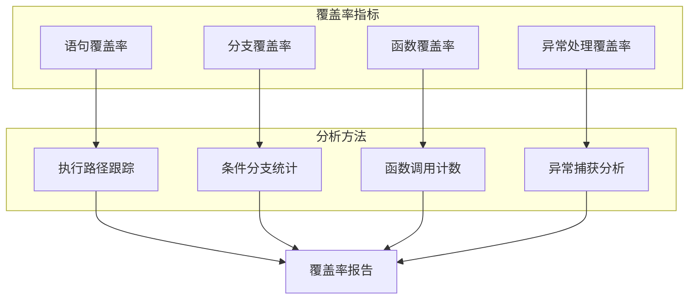
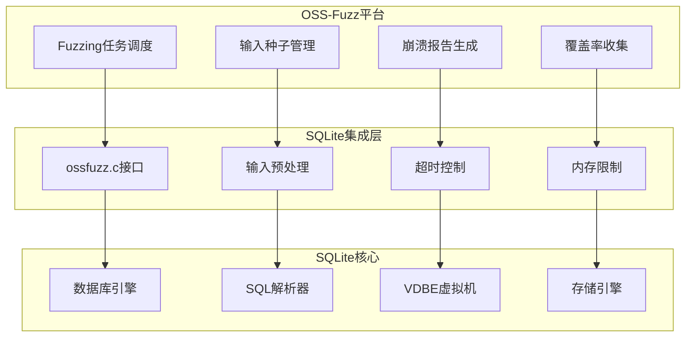
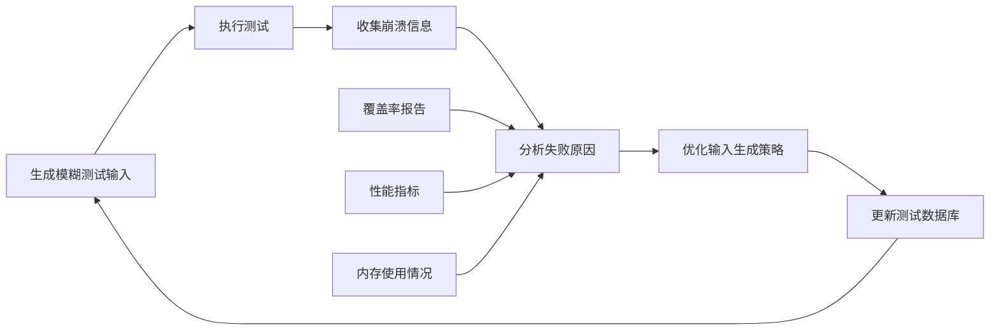
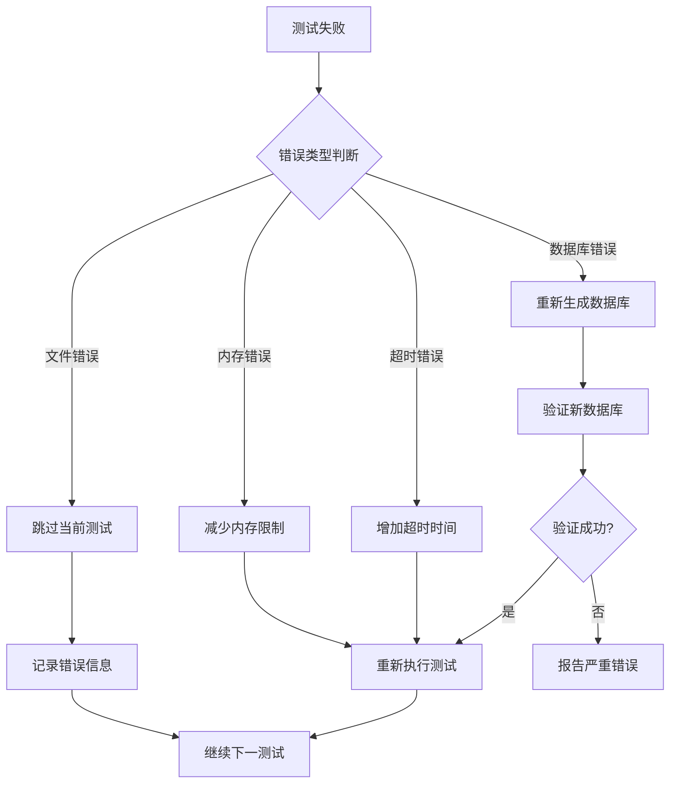

# 外部模糊测试数据库集成

<cite>
**本文档引用的文件**
- [testrunner.md](file://doc/testrunner.md)
- [testrunner.tcl](file://test/testrunner.tcl)
- [fuzzcheck.c](file://test/fuzzcheck.c)
- [testrunner_data.tcl](file://test/testrunner_data.tcl)
- [ossfuzz.c](file://test/ossfuzz.c)
- [fuzzdata1.db](file://test/fuzzdata1.db)
- [fuzzdata2.db](file://test/fuzzdata2.db)
- [fuzzdata3.db](file://test/fuzzdata3.db)
- [fuzzdata4.db](file://test/fuzzdata4.db)
- [fuzzdata5.db](file://test/fuzzdata5.db)
- [fuzzdata6.db](file://test/fuzzdata6.db)
- [fuzzdata7.db](file://test/fuzzdata7.db)
- [fuzzdata8.db](file://test/fuzzdata8.db)
</cite>

## 目录
1. [概述](#概述)
2. [外部数据库集成架构](#外部数据库集成架构)
3. [命令行参数与环境变量配置](#命令行参数与环境变量配置)
4. [testrunner.tcl的自动分割机制](#testrunnertcl的自动分割机制)
5. [patternlist机制详解](#patternlist机制详解)
6. [数据库验证与覆盖分析](#数据库验证与覆盖分析)
7. [持续集成环境中的应用](#持续集成环境中的应用)
8. [配置指南与最佳实践](#配置指南与最佳实践)
9. [故障排除与调试](#故障排除与调试)
10. [总结](#总结)

## 概述

SQLite的模糊测试框架提供了强大的外部数据库集成能力，允许开发者将由dbsqlfuzz等工具生成的外部模糊测试数据库无缝集成到测试流程中。这种集成不仅扩展了测试范围，还通过并行处理和智能分割机制显著提升了测试效率。

外部模糊测试数据库的核心价值在于：
- **扩展测试覆盖范围**：使用真实世界生成的复杂数据库结构
- **提高测试效率**：通过并行处理和智能分割
- **支持持续集成**：在CI环境中自动化模糊测试
- **促进反馈循环**：基于测试结果优化输入集

## 外部数据库集成架构

### 系统架构概览



**图表来源**
- [testrunner.tcl](file://test/testrunner.tcl#L1246-L1277)
- [fuzzcheck.c](file://test/fuzzcheck.c#L1924-L1947)

### 核心组件交互

外部数据库集成涉及以下核心组件的协同工作：

1. **testrunner.tcl**：负责协调整个测试流程
2. **fuzzcheck**：执行具体的模糊测试逻辑
3. **数据库分割器**：处理大型数据库的并行化
4. **环境检测器**：验证外部数据库的有效性

**章节来源**
- [testrunner.tcl](file://test/testrunner.tcl#L1246-L1277)
- [fuzzcheck.c](file://test/fuzzcheck.c#L1924-L1947)

## 命令行参数与环境变量配置

### --fuzzdb命令行参数

`--fuzzdb`参数是连接外部数据库到SQLite测试框架的主要入口点。该参数接受外部数据库文件的完整路径作为参数。

**基本用法：**
```bash
tclsh test/testrunner.tcl releasetest --fuzzdb ../fuzz/20250415.db
```

**支持的数据库格式：**
- `.db` SQLite数据库文件
- `.sqlite` SQLite数据库文件
- 自定义扩展名的数据库文件

### FUZZDB环境变量

除了命令行参数，系统还支持通过环境变量设置外部数据库路径：

**Unix/Linux/MacOS：**
```bash
export FUZZDB=../fuzz/20250415.db
make releasetest
```

**Windows：**
```cmd
set FUZZDB=..\fuzz\20250415.db
nmake /f Makefile.msc releasetest
```

### 参数优先级

当同时使用命令行参数和环境变量时，遵循以下优先级规则：
1. 命令行参数具有最高优先级
2. 环境变量次之
3. 默认情况下不使用外部数据库

**章节来源**
- [testrunner.md](file://doc/testrunner.md#L308-L335)
- [testrunner.tcl](file://test/testrunner.tcl#L1246-L1277)

## testrunner.tcl的自动分割机制

### --slice功能的工作原理

对于大型外部数据库，testrunner.tcl会自动启用`--slice`功能，将测试工作分割为多个并行任务。这种机制基于数据库大小动态调整分割策略。

```mermaid
flowchart TD
A[检测外部数据库] --> B{数据库大小检查}
B --> |小于5MB| C[单个任务执行]
B --> |大于等于5MB| D[计算分割数量]
D --> E[N = (文件大小 + 4999999) / 5000000]
E --> F[创建分割任务]
F --> G[并行执行分割]
G --> H[汇总测试结果]
C --> I[完成测试]
H --> I
```

**图表来源**
- [testrunner.tcl](file://test/testrunner.tcl#L1246-L1277)

### 分割算法实现

分割算法的核心逻辑如下：

| 数据库大小范围 | 分割数量 | 单个任务目标大小 |
|----------------|----------|------------------|
| 0-4.99MB | 1 | 完整数据库 |
| 5-9.99MB | 2 | ~5MB每个 |
| 10-14.99MB | 3 | ~5MB每个 |
| ... | ... | ... |

**分割参数传递：**
```bash
fuzzcheck --slice 0 2 ../fuzz/20250415.db
fuzzcheck --slice 1 2 ../fuzz/20250415.db
```

### 并行度优化

testrunner.tcl根据系统资源自动优化并行度：



**图表来源**
- [testrunner.tcl](file://test/testrunner.tcl#L1277-L1317)

**章节来源**
- [testrunner.tcl](file://test/testrunner.tcl#L1246-L1277)

## patternlist机制详解

### 文件名模式匹配

patternlist机制允许用户精确控制哪些外部数据库文件参与测试。该机制基于glob模式匹配算法，支持通配符和特殊字符。



**图表来源**
- [testrunner.tcl](file://test/testrunner.tcl#L1277-L1317)

### 支持的模式语法

| 模式类型 | 示例 | 匹配规则 |
|----------|------|----------|
| 精确匹配 | `20250415` | 完全相同的文件名 |
| 前缀匹配 | `202504*` | 以202504开头的所有文件 |
| 后缀匹配 | `*.db` | 所有.db扩展名文件 |
| 范围匹配 | `202504[1-3]` | 2025041、2025042、2025043 |
| 多重模式 | `*2025*,*fuzz*` | 包含2025或fuzz的文件 |

### 测试优先级机制

patternlist不仅用于过滤，还影响测试执行的优先级：



**图表来源**
- [testrunner.tcl](file://test/testrunner.tcl#L1277-L1317)

### 实际应用场景

**仅测试特定数据库：**
```bash
tclsh test/testrunner.tcl releasetest 20250415 --fuzzdb ../fuzz/20250415.db
```

**测试多个数据库：**
```bash
tclsh test/testrunner.tcl releasetest *2025* --fuzzdb ../fuzz/*.db
```

**章节来源**
- [testrunner.md](file://doc/testrunner.md#L308-L335)
- [testrunner.tcl](file://test/testrunner.tcl#L1277-L1317)

## 数据库验证与覆盖分析

### 外部数据库有效性验证

系统在使用外部数据库前会进行多层次的验证：



**图表来源**
- [testrunner.tcl](file://test/testrunner.tcl#L1246-L1277)

### 验证检查项目

| 验证项目 | 检查内容 | 失败处理 |
|----------|----------|----------|
| 文件存在性 | 检查文件是否可访问 | 报告错误并跳过 |
| 文件权限 | 验证读取权限 | 提示权限问题 |
| SQLite格式 | 检查数据库文件格式 | 标记为无效 |
| 表结构完整性 | 验证必需表的存在 | 跳过相关测试 |
| 数据一致性 | 检查数据完整性约束 | 标记警告 |

### 测试覆盖率分析

外部数据库的测试覆盖率通过以下维度进行分析：



**图表来源**
- [fuzzcheck.c](file://test/fuzzcheck.c#L33-L64)

**章节来源**
- [testrunner.tcl](file://test/testrunner.tcl#L1246-L1277)
- [fuzzcheck.c](file://test/fuzzcheck.c#L33-L64)

## 持续集成环境中的应用

### OSS-Fuzz集成架构

SQLite与Google OSS-Fuzz的深度集成展示了外部数据库在持续集成环境中的最佳实践：



**图表来源**
- [ossfuzz.c](file://test/ossfuzz.c#L125-L160)

### CI/CD流水线集成

**GitHub Actions配置示例：**
```yaml
name: SQLite Fuzz Testing
on: [push, pull_request]
jobs:
  fuzz-test:
    runs-on: ubuntu-latest
    steps:
      - uses: actions/checkout@v2
      - name: Build SQLite
        run: make
      - name: Download fuzz database
        run: wget https://example.com/fuzz.db
      - name: Run fuzz tests
        run: FUZZDB=fuzz.db make releasetest
```

### 反馈循环优化

外部数据库在持续集成中的反馈循环包括：



**图表来源**
- [ossfuzz.c](file://test/ossfuzz.c#L125-L160)

### 自动化测试策略

| 测试阶段 | 目标 | 关键指标 |
|----------|------|----------|
| 初始化 | 快速验证数据库有效性 | 启动时间 < 5秒 |
| 基础测试 | 确保基本功能正常 | 成功率 > 95% |
| 深度测试 | 发现潜在缺陷 | 覆盖率 > 80% |
| 回归测试 | 验证修复效果 | 无回归缺陷 |

**章节来源**
- [ossfuzz.c](file://test/ossfuzz.c#L125-L160)

## 配置指南与最佳实践

### 数据库准备最佳实践

**数据库生成建议：**
1. **多样化数据结构**：包含各种表结构和索引
2. **边界值测试**：包含最大最小值的数据
3. **异常数据**：故意引入损坏或异常数据
4. **并发场景**：模拟多线程访问场景

**推荐的数据库大小：**
- 小型测试：< 10MB
- 中型测试：10-100MB  
- 大型测试：> 100MB

### 性能优化配置

**内存限制设置：**
```bash
# 设置内存限制为20MB
export FUZZDB_MEMORY_LIMIT=20000000
```

**超时配置：**
```bash
# 设置单个测试超时时间为120秒
export FUZZDB_TIMEOUT=120000
```

### 并行处理优化

**CPU核心利用率优化：**
```bash
# 显式设置并行任务数
export FUZZDB_PARALLEL=8

# 或通过testrunner参数
tclsh test/testrunner.tcl releasetest --jobs 8 --fuzzdb database.db
```

### 监控与日志配置

**详细日志输出：**
```bash
# 启用详细日志
tclsh test/testrunner.tcl releasetest --fuzzdb database.db -v

# 输出到文件
tclsh test/testrunner.tcl releasetest --fuzzdb database.db > fuzz.log 2>&1
```

**监控指标收集：**
- 测试执行时间
- 内存使用峰值
- CPU利用率
- 错误发生频率

**章节来源**
- [testrunner.tcl](file://test/testrunner.tcl#L220-L242)
- [fuzzcheck.c](file://test/fuzzcheck.c#L1945-L1966)

## 故障排除与调试

### 常见问题诊断

**问题分类与解决方案：**

| 问题类型 | 症状 | 可能原因 | 解决方案 |
|----------|------|----------|----------|
| 文件访问错误 | "文件不存在" | 路径错误或权限不足 | 检查文件路径和权限 |
| 数据库格式错误 | "不是SQLite数据库" | 文件损坏或格式不正确 | 验证数据库文件完整性 |
| 内存不足 | "内存耗尽" | 数据库过大或内存限制过小 | 增加内存限制或分割数据库 |
| 超时错误 | "测试超时" | 测试用例过于复杂 | 减少超时时间或优化测试 |

### 调试工具与技术

**数据库完整性检查：**
```bash
# 使用SQLite命令行工具检查
sqlite3 database.db ".tables"
sqlite3 database.db "PRAGMA integrity_check;"
```

**测试日志分析：**
```bash
# 查看详细测试日志
grep "fuzz" testrunner.log

# 分析失败测试
grep "FAILED" testrunner.log
```

**性能分析：**
```bash
# 监控资源使用
top -p $(pgrep testfixture)

# 分析内存使用
valgrind --tool=memcheck testfixture
```

### 错误恢复策略



**图表来源**
- [fuzzcheck.c](file://test/fuzzcheck.c#L1945-L1966)

**章节来源**
- [testrunner.tcl](file://test/testrunner.tcl#L1246-L1277)
- [fuzzcheck.c](file://test/fuzzcheck.c#L1945-L1966)

## 总结

外部模糊测试数据库集成是SQLite测试框架的重要组成部分，它通过以下关键特性实现了高效的模糊测试：

### 核心优势

1. **灵活的集成方式**：支持命令行参数和环境变量两种配置方式
2. **智能的并行处理**：自动分割大型数据库，最大化利用系统资源
3. **精确的测试控制**：通过patternlist机制实现细粒度的测试选择
4. **全面的质量保证**：提供多层次的数据库验证和覆盖率分析

### 最佳实践要点

- **合理规划数据库大小**：平衡测试覆盖率和执行效率
- **优化并行配置**：根据系统资源调整并行度
- **建立监控体系**：实时跟踪测试进度和质量指标
- **维护反馈循环**：基于测试结果持续改进输入生成策略

### 未来发展方向

随着SQLite项目的不断发展，外部模糊测试数据库集成将在以下方面继续演进：

- **智能化的测试调度**：基于历史数据预测最优测试顺序
- **增强的覆盖率分析**：提供更详细的代码覆盖率和路径覆盖率
- **更好的CI/CD集成**：与更多持续集成平台的深度集成
- **自动化的输入优化**：基于测试结果自动调整模糊测试输入策略

通过合理运用这些技术和方法，开发团队可以构建更加健壮和可靠的SQLite应用程序，确保在面对复杂和异常输入时仍能保持稳定性和安全性。