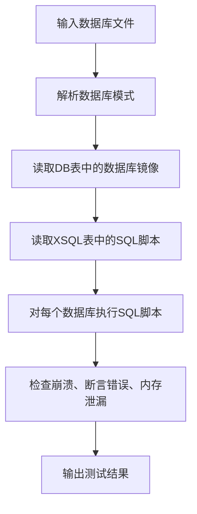
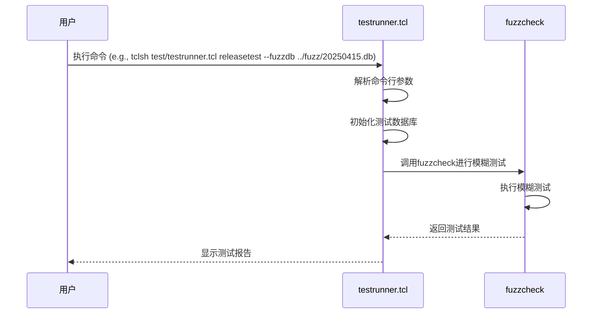
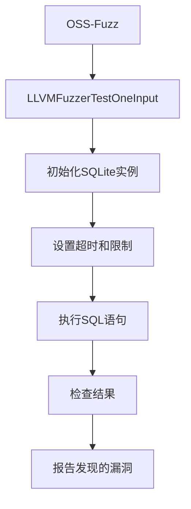

# 模糊测试

<cite>
**本文档引用的文件**   
- [fuzzcheck.c](file://test/fuzzcheck.c)
- [testrunner.tcl](file://test/testrunner.tcl)
- [dbfuzz.c](file://test/dbfuzz.c)
- [ossfuzz.c](file://test/ossfuzz.c)
- [fuzz_common.tcl](file://test/fuzz_common.tcl)
- [fuzzinvariants.c](file://test/fuzzinvariants.c)
- [sessionfuzz.c](file://test/sessionfuzz.c)
- [optfuzz.c](file://test/optfuzz.c)
- [testrunner.md](file://doc/testrunner.md)
</cite>

## 目录
1. [简介](#简介)
2. [核心模糊测试工具](#核心模糊测试工具)
3. [fuzzcheck.c工具详解](#fuzzcheckc工具详解)
4. [使用testrunner.tcl集成模糊测试](#使用testrunner-tcl集成模糊测试)
5. [外部模糊测试数据库](#外部模糊测试数据库)
6. [与OSS-Fuzz集成](#与oss-fuzz集成)
7. [模糊测试指南](#模糊测试指南)

## 简介
模糊测试是一种通过向SQLite数据库引擎提供大量随机或半随机输入来发现潜在崩溃、内存错误和逻辑缺陷的安全测试技术。本指南旨在为安全研究人员和开发者提供全面的文档，介绍如何使用`fuzzcheck.c`等工具进行模糊测试，如何利用`testrunner.tcl`的fuzz测试类型来集成和运行测试，以及如何利用外部模糊测试数据库（通过`--fuzzdb`选项）进行更有效的测试。同时，本文档还将描述与OSS-Fuzz等持续模糊测试平台的集成方法，以增强SQLite的健壮性。

## 核心模糊测试工具
SQLite代码库中包含多个核心的模糊测试工具，每个工具都有其特定的用途和功能。这些工具共同构成了一个强大的模糊测试生态系统，用于确保SQLite数据库引擎的稳定性和安全性。

**Section sources**
- [fuzzcheck.c](file://test/fuzzcheck.c#L1-L2739)
- [dbfuzz.c](file://test/dbfuzz.c#L1-L754)
- [ossfuzz.c](file://test/ossfuzz.c#L1-L206)

## fuzzcheck.c工具详解
`fuzzcheck.c`是SQLite中用于回归测试的主要工具，它通过外部模糊器生成的数据来测试SQLite库。该工具读取具有特定模式的SQLite数据库文件，对每个数据库文件运行XSQL表中的SQL文本，并寻找崩溃、断言错误或内存泄漏。

**Diagram sources**
- [fuzzcheck.c](file://test/fuzzcheck.c#L1-L2739)

**Section sources**
- [fuzzcheck.c](file://test/fuzzcheck.c#L1-L2739)

## 使用testrunner.tcl集成模糊测试
`testrunner.tcl`是运行SQLite测试的脚本，它支持多种测试类型，包括模糊测试。通过使用`testrunner.tcl`，可以方便地集成和运行模糊测试，自动化整个测试过程。

**Diagram sources**
- [testrunner.tcl](file://test/testrunner.tcl#L1-L1843)

**Section sources**
- [testrunner.tcl](file://test/testrunner.tcl#L1-L1843)

## 外部模糊测试数据库
`testrunner.tcl`支持使用外部（树外）数据库进行模糊测试，例如由dbsqlfuzz生成的模糊测试数据库。通过添加`--fuzzdb FILENAME`命令行选项或设置FUZZDB环境变量，可以指定外部数据库。对于大型外部数据库，`testrunner.tcl`会自动使用`--slice`选项将工作分成多个任务，以增加并行性。

**Section sources**
- [testrunner.md](file://doc/testrunner.md#L308-L335)
- [testrunner.tcl](file://test/testrunner.tcl#L1246-L1277)

## 与OSS-Fuzz集成
OSS-Fuzz是一个由Google提供的模糊测试即服务（Fuzzer as a Service）平台。`ossfuzz.c`模块将SQLite与OSS-Fuzz集成，通过`LLVMFuzzerTestOneInput`函数接收模糊测试输入，并在SQLite实例中执行SQL语句。该模块设置了各种限制，如10秒的超时、25000个VDBE操作的限制和250个字符的LIKE/GLOB模式长度限制，以防止超时和资源耗尽。

**Diagram sources**
- [ossfuzz.c](file://test/ossfuzz.c#L1-L206)

**Section sources**
- [ossfuzz.c](file://test/ossfuzz.c#L1-L206)

## 模糊测试指南
为了有效地进行模糊测试，建议遵循以下步骤：

1. **准备环境**：确保已安装必要的工具和依赖项。
2. **选择工具**：根据测试需求选择合适的模糊测试工具，如`fuzzcheck.c`或`dbfuzz.c`。
3. **配置测试**：使用`testrunner.tcl`配置模糊测试，包括指定外部数据库和设置测试参数。
4. **运行测试**：执行模糊测试，并监控测试进度和结果。
5. **分析结果**：检查测试输出，识别和修复发现的漏洞。

通过遵循这些指南，可以有效地增强SQLite的健壮性和安全性。

**Section sources**
- [fuzzcheck.c](file://test/fuzzcheck.c#L1-L2739)
- [testrunner.tcl](file://test/testrunner.tcl#L1-L1843)
- [ossfuzz.c](file://test/ossfuzz.c#L1-L206)