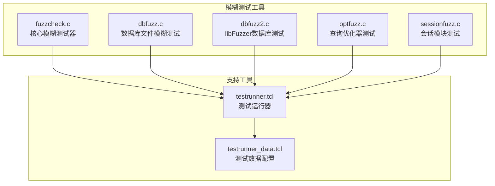
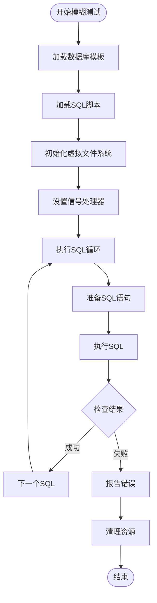
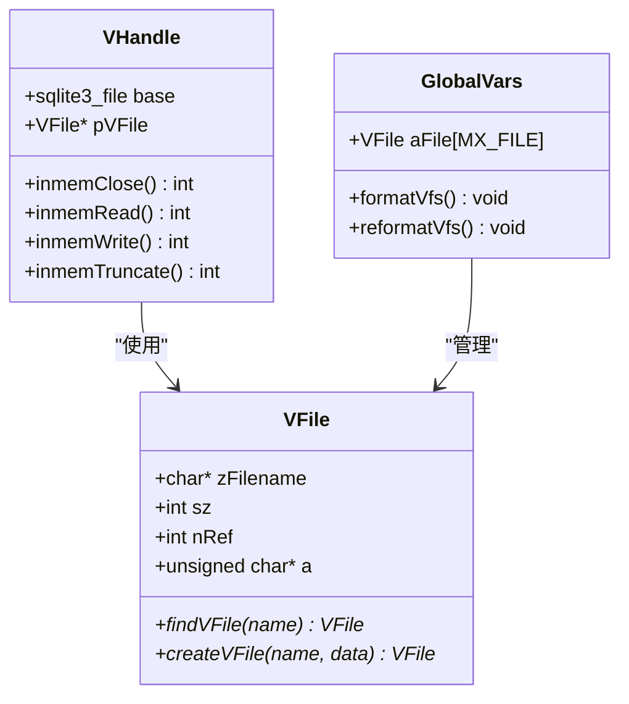
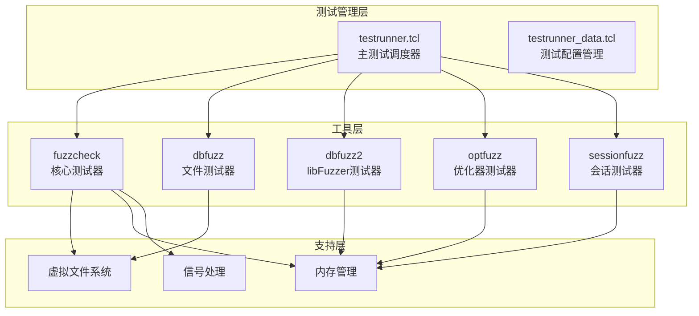
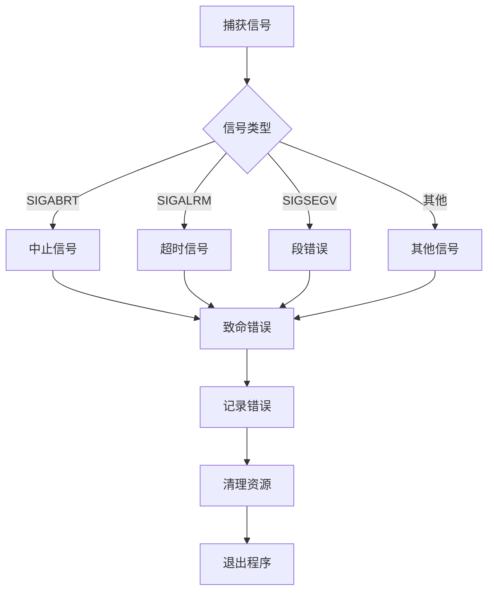
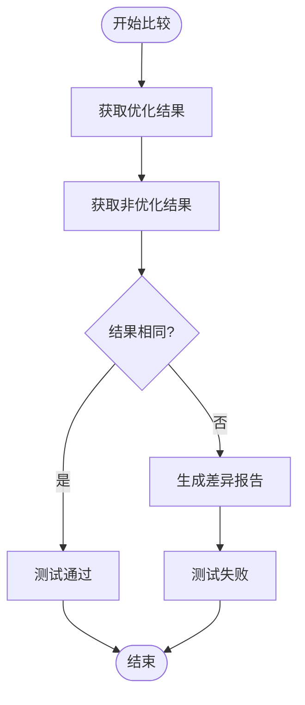
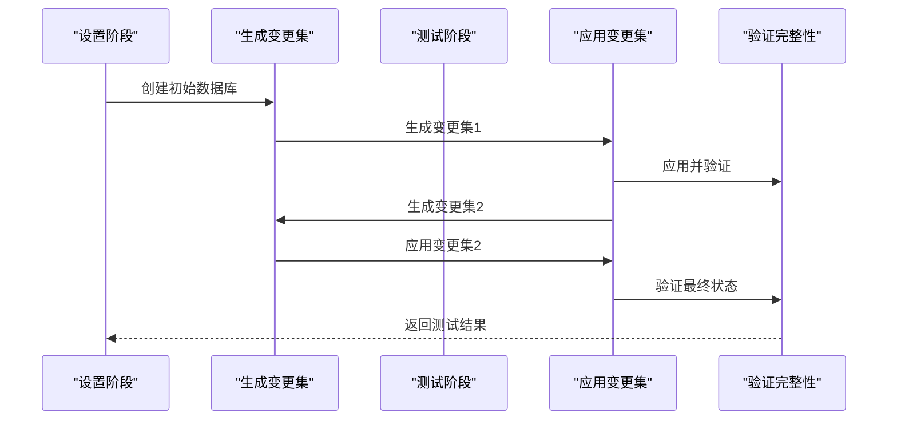
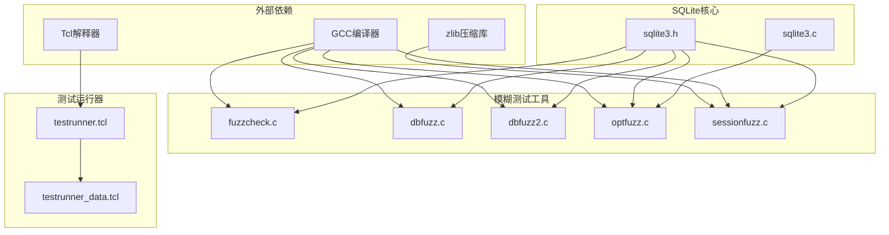

# SQLite模糊测试工具详细说明

<cite>
**本文档引用的文件**
- [test/fuzzcheck.c](file://test/fuzzcheck.c)
- [test/dbfuzz.c](file://test/dbfuzz.c)
- [test/dbfuzz2.c](file://test/dbfuzz2.c)
- [test/optfuzz.c](file://test/optfuzz.c)
- [test/sessionfuzz.c](file://test/sessionfuzz.c)
- [test/testrunner_data.tcl](file://test/testrunner_data.tcl)
- [test/testrunner.tcl](file://test/testrunner.tcl)
- [doc/testrunner.md](file://doc/testrunner.md)
</cite>

## 目录
1. [概述](#概述)
2. [项目结构](#项目结构)
3. [核心模糊测试工具](#核心模糊测试工具)
4. [架构概览](#架构概览)
5. [详细组件分析](#详细组件分析)
6. [依赖关系分析](#依赖关系分析)
7. [性能考虑](#性能考虑)
8. [故障排除指南](#故障排除指南)
9. [结论](#结论)

## 概述

SQLite包含了一套完整的模糊测试工具集，用于检测数据库引擎的稳定性和安全性。这些工具通过生成随机输入、破坏数据库文件、测试查询优化器和会话模块等方式，全面验证SQLite在各种异常情况下的行为。

主要的模糊测试工具包括：
- **fuzzcheck.c**: 核心模糊测试执行器，生成随机SQL语句和数据库操作
- **dbfuzz.c**: 针对数据库文件结构的二进制层面模糊测试
- **dbfuzz2.c**: 使用libFuzzer框架的数据库文件模糊测试
- **optfuzz.c**: 查询优化器路径测试机制
- **sessionfuzz.c**: 会话扩展模块变更集处理逻辑验证

## 项目结构

SQLite的模糊测试工具位于`test/`目录下，每个工具都有特定的功能和用途：



**图表来源**
- [test/fuzzcheck.c](file://test/fuzzcheck.c#L1-L50)
- [test/dbfuzz.c](file://test/dbfuzz.c#L1-L50)
- [test/dbfuzz2.c](file://test/dbfuzz2.c#L1-L50)
- [test/optfuzz.c](file://test/optfuzz.c#L1-L50)
- [test/sessionfuzz.c](file://test/sessionfuzz.c#L1-L50)

## 核心模糊测试工具

### fuzzcheck.c - 核心模糊测试执行器

fuzzcheck.c是SQLite中最复杂的模糊测试工具，负责生成和执行随机SQL语句来测试数据库引擎的稳定性。

#### 主要功能特性

1. **数据库模板系统**: 支持从预定义的数据库模板生成测试用例
2. **SQL脚本执行**: 能够执行任意SQL脚本并监控异常
3. **虚拟文件系统**: 实现内存中的虚拟文件系统来保护原始数据库
4. **超时控制**: 提供SQL执行时间限制防止无限循环
5. **错误检测**: 自动检测崩溃、断言失败和内存泄漏

#### 输入格式和执行流程



**图表来源**
- [test/fuzzcheck.c](file://test/fuzzcheck.c#L100-L200)

#### 输出诊断信息

fuzzcheck.c生成详细的诊断信息，包括：
- 测试用例标识符（测试名称）
- 执行状态（成功/失败）
- 错误类型（崩溃、断言、内存泄漏）
- 数据库文件和SQL脚本的内容

**章节来源**
- [test/fuzzcheck.c](file://test/fuzzcheck.c#L1-L800)

### dbfuzz.c - 数据库文件二进制测试

dbfuzz.c专门针对SQLite数据库文件的二进制结构进行模糊测试，通过破坏数据库文件来检测引擎的健壮性。

#### 核心特性

1. **内存虚拟文件系统**: 完全在内存中模拟文件系统
2. **文件操作模拟**: 模拟真实的文件读写操作
3. **数据库完整性检查**: 执行`PRAGMA integrity_check`
4. **进度回调控制**: 防止无限循环的SQL执行

#### 文件系统架构



**图表来源**
- [test/dbfuzz.c](file://test/dbfuzz.c#L60-L120)

**章节来源**
- [test/dbfuzz.c](file://test/dbfuzz.c#L1-L755)

### dbfuzz2.c - libFuzzer集成测试

dbfuzz2.c利用Google的libFuzzer框架进行数据库文件的模糊测试，特别适合与AFL等模糊测试工具配合使用。

#### libFuzzer接口

该工具实现了标准的libFuzzer接口：

```c
int LLVMFuzzerTestOneInput(const uint8_t *aData, size_t nByte);
int LLVMFuzzerInitialize(int *pArgc, char ***pArgv);
```

#### 主要功能

1. **快速测试循环**: 针对单个输入文件的高效测试
2. **内存跟踪**: 可选的内存分配跟踪功能
3. **进度控制**: 限制SQL执行的回调次数
4. **调试选项**: 支持多种调试和诊断模式

**章节来源**
- [test/dbfuzz2.c](file://test/dbfuzz2.c#L1-L403)

### optfuzz.c - 查询优化器测试

optfuzz.c专门测试SQLite查询优化器的正确性，通过对比启用和禁用优化器时的输出来验证优化器的行为。

#### 测试机制

```mermaid
sequenceDiagram
participant Test as "测试程序"
participant Opt as "启用优化器"
participant NoOpt as "禁用优化器"
participant Compare as "结果比较"
Test->>Opt : 执行SQL启用优化
Opt-->>Test : 返回结果集1
Test->>NoOpt : 执行SQL禁用优化
NoOpt-->>Test : 返回结果集2
Test->>Compare : 比较两个结果集
Compare-->>Test : 验证一致性
Test->>Test : 报告差异或通过
```

**图表来源**
- [test/optfuzz.c](file://test/optfuzz.c#L100-L200)

#### 测试策略

1. **双重执行**: 同一SQL语句分别在两种优化状态下执行
2. **结果验证**: 确保优化前后输出完全一致
3. **错误检测**: 发现优化器导致的不正确行为

**章节来源**
- [test/optfuzz.c](file://test/optfuzz.c#L1-L309)

### sessionfuzz.c - 会话模块测试

sessionfuzz.c测试SQLite的会话扩展模块，特别是变更集（changeset）的处理逻辑。

#### 功能特性

1. **变更集生成**: 自动生成测试用的变更集文件
2. **SQL归档支持**: 处理包含多个变更集的SQL归档文件
3. **冲突解决**: 实现冲突回调函数处理合并冲突
4. **完整性检查**: 验证应用变更集后的数据库完整性

#### 工具使用方式

```bash
# 生成初始测试用例
./sessionfuzz setup

# 运行模糊测试
./sessionfuzz run FILE...

# 处理SQL归档文件
./sessionfuzz run SQLAR...
```

**章节来源**
- [test/sessionfuzz.c](file://test/sessionfuzz.c#L1-L1017)

## 架构概览

SQLite的模糊测试工具采用分层架构设计，每层负责不同的测试职责：



**图表来源**
- [test/testrunner.tcl](file://test/testrunner.tcl#L1246-L1317)
- [test/testrunner_data.tcl](file://test/testrunner_data.tcl#L421-L514)

## 详细组件分析

### fuzzcheck.c详细分析

#### 全局变量管理

fuzzcheck.c使用全局变量结构体来管理测试状态：

```c
static struct GlobalVars {
  const char *zArgv0;              /* 程序名称 */
  const char *zDbFile;             /* 数据库文件名 */
  VFile aFile[MX_FILE];            /* 虚拟文件系统 */
  int nDb;                         /* 模板数据库数量 */
  Blob *pFirstDb;                  /* 第一个数据库模板 */
  int nSql;                        /* SQL脚本数量 */
  Blob *pFirstSql;                 /* 第一个SQL脚本 */
  unsigned int uRandom;            /* SQLite PRNG种子 */
  unsigned int nInvariant;         /* 不变量检查次数 */
  char zTestName[100];             /* 当前测试名称 */
} g;
```

#### 内存管理策略

工具实现了多层内存管理策略：

1. **Blob对象系统**: 用于存储数据库文件和SQL脚本
2. **虚拟文件系统**: 在内存中模拟文件操作
3. **OOM模拟**: 模拟内存不足情况测试恢复能力

#### 信号处理机制



**图表来源**
- [test/fuzzcheck.c](file://test/fuzzcheck.c#L150-L200)

**章节来源**
- [test/fuzzcheck.c](file://test/fuzzcheck.c#L100-L400)

### dbfuzz.c详细分析

#### 虚拟文件系统实现

dbfuzz.c的核心是其虚拟文件系统实现，它完全在内存中模拟文件操作：

```c
typedef struct VFile VFile;
struct VFile {
  char *zFilename;      /* 文件名 */
  int sz;               /* 文件大小 */
  int nRef;             /* 引用计数 */
  unsigned char *a;     /* 文件内容 */
};
```

#### 文件操作方法表

```c
static sqlite3_io_methods VHandleMethods = {
  /* iVersion    */  1,
  /* xClose      */  inmemClose,
  /* xRead       */  inmemRead,
  /* xWrite      */  inmemWrite,
  /* xTruncate   */  inmemTruncate,
  /* xSync       */  inmemSync,
  /* xFileSize   */  inmemFileSize,
  /* xLock       */  inmemLock,
  /* xUnlock     */  inmemUnlock,
  /* xCheck...   */  inmemCheckReservedLock,
  /* xFileCtrl   */  inmemFileControl,
  /* xSectorSz   */  inmemSectorSize,
  /* xDevchar    */  inmemDeviceCharacteristics,
};
```

#### 内存泄漏检测

工具提供了完善的内存泄漏检测机制：

```c
if( sqlite3_memory_used()>0 ){
  free(azDb);
  reformatVfs();
  fatalError("memory leak of %lld bytes", sqlite3_memory_used());
}
```

**章节来源**
- [test/dbfuzz.c](file://test/dbfuzz.c#L60-L200)

### dbfuzz2.c详细分析

#### libFuzzer集成

dbfuzz2.c实现了标准的libFuzzer接口，使其能够与各种模糊测试工具配合使用：

```c
int LLVMFuzzerTestOneInput(const uint8_t *aData, size_t nByte){
  // 测试逻辑实现
  return 0; // 成功返回0，失败返回非0
}

int LLVMFuzzerInitialize(int *pArgc, char ***pArgv){
  // 初始化逻辑
  return 0;
}
```

#### SQL语句集合

工具预定义了一组测试SQL语句：

```c
static const char *azSql[] = {
  "PRAGMA integrity_check;",
  "SELECT * FROM sqlite_schema;",
  "SELECT sum(length(name)) FROM dbstat;",
  "UPDATE t1 SET b=a, a=b WHERE a<b;",
  "ALTER TABLE t1 RENAME TO alkjalkjdfiiiwuer987lkjwer82mx9789s;",
  // 更多测试语句...
};
```

#### 内存跟踪功能

提供了可选的内存分配跟踪功能：

```c
int sqlite3MemTraceActivate(FILE *out){
  // 激活内存跟踪
  return rc;
}

int sqlite3MemTraceDeactivate(void){
  // 停用内存跟踪
  return rc;
}
```

**章节来源**
- [test/dbfuzz2.c](file://test/dbfuzz2.c#L100-L300)

### optfuzz.c详细分析

#### 双重执行机制

optfuzz.c的核心是双重执行机制，确保优化器不会改变查询结果：

```c
// 禁用优化器执行
sqlite3_test_control(SQLITE_TESTCTRL_OPTIMIZATIONS, dbRun, 0);
rc = optfuzz_exec(dbRun, zSql, dbOut, "opt", &nStmt, &nRow, bTrace);

// 启用优化器执行
sqlite3_test_control(SQLITE_TESTCTRL_OPTIMIZATIONS, dbRun, 0xffff);
rc = optfuzz_exec(dbRun, zSql, dbOut, "noopt", &nStmt, &nRow, bTrace);
```

#### 结果比较算法



**图表来源**
- [test/optfuzz.c](file://test/optfuzz.c#L250-L300)

**章节来源**
- [test/optfuzz.c](file://test/optfuzz.c#L150-L309)

### sessionfuzz.c详细分析

#### 变更集处理流程

sessionfuzz.c处理变更集的完整流程：



**图表来源**
- [test/sessionfuzz.c](file://test/sessionfuzz.c#L850-L950)

#### SQL归档处理

工具支持处理包含多个变更集的SQL归档文件：

```c
if( nChgset >= 512 && memcmp(pChgset, "SQLite format 3", 16)==0 ){
  // 处理SQL归档文件
  sqlite3_open_v2(":memory:", &db2, SQLITE_OPEN_CREATE|SQLITE_OPEN_READWRITE, "memdb");
  sqlite3_deserialize(db2, 0, pChgset, nChgset, nChgset,
        SQLITE_DESERIALIZE_READONLY | SQLITE_DESERIALIZE_FREEONCLOSE);
}
```

**章节来源**
- [test/sessionfuzz.c](file://test/sessionfuzz.c#L800-L1017)

## 依赖关系分析

SQLite模糊测试工具之间的依赖关系如下：



**图表来源**
- [test/testrunner_data.tcl](file://test/testrunner_data.tcl#L421-L456)

### 编译要求

每个工具都有特定的编译要求：

| 工具 | 编译器 | 特殊要求 | 示例命令 |
|------|--------|----------|----------|
| fuzzcheck | GCC/Clang | 无 | `gcc -o fuzzcheck test/fuzzcheck.c` |
| dbfuzz | GCC/Clang | 无 | `gcc -o dbfuzz test/dbfuzz.c` |
| dbfuzz2 | GCC/Clang | 需要libFuzzer | `clang-6.0 -fsanitize=fuzzer dbfuzz2.c` |
| optfuzz | GCC/Clang | 需要sqlite3.c | `gcc -o optfuzz test/optfuzz.c` |
| sessionfuzz | GCC/Clang | 需要zlib | `gcc -o sessionfuzz test/sessionfuzz.c -lz` |

**章节来源**
- [test/sessionfuzz.c](file://test/sessionfuzz.c#L25-L47)

## 性能考虑

### 并行测试执行

testrunner.tcl支持并行测试执行，可以显著提高测试效率：

```bash
# 并行运行所有模糊测试
tclsh test/testrunner.tcl fuzztest

# 指定并行进程数
tclsh test/testrunner.tcl fuzztest -njob 8
```

### 内存使用优化

各个工具都实现了内存使用优化：

1. **虚拟文件系统**: 减少磁盘I/O开销
2. **内存池管理**: 避免频繁的内存分配
3. **及时清理**: 测试完成后立即释放资源

### 超时控制

为防止无限循环，所有工具都实现了超时控制：

```c
static void setAlarm(int N){
#ifdef __unix__
  alarm(N);
#else
  (void)N;
#endif
}
```

## 故障排除指南

### 常见问题及解决方案

#### 1. 编译错误

**问题**: 缺少必要的头文件或库
**解决方案**: 
- 确保安装了开发版本的Tcl和zlib
- 检查编译器路径是否正确

#### 2. 测试失败

**问题**: 模糊测试工具报告错误
**解决方案**:
- 检查测试数据文件的完整性
- 查看testrunner.log文件获取详细错误信息
- 使用调试模式重新运行测试

#### 3. 内存泄漏

**问题**: 工具检测到内存泄漏
**解决方案**:
- 检查工具的清理逻辑
- 使用valgrind等工具进一步分析

### 日志分析

testrunner.tcl会将所有测试输出记录到testrunner.log文件中：

```bash
# 查找失败的测试
grep "^!" testrunner.log

# 查找特定工具的错误
grep "fuzzcheck" testrunner.log

# 分析内存使用情况
grep "memory leak" testrunner.log
```

**章节来源**
- [doc/testrunner.md](file://doc/testrunner.md#L23-L62)

## 结论

SQLite的模糊测试工具集是一个全面而强大的测试框架，涵盖了数据库引擎的各个方面。通过合理使用这些工具，可以有效地发现和修复潜在的安全漏洞和稳定性问题。

### 主要优势

1. **全面覆盖**: 涵盖数据库文件、查询优化器、会话模块等多个方面
2. **自动化程度高**: 与testrunner.tcl集成，支持大规模自动化测试
3. **灵活配置**: 支持多种编译选项和运行时参数
4. **诊断能力强**: 提供详细的错误报告和调试信息

### 最佳实践建议

1. **定期运行**: 将模糊测试纳入持续集成流程
2. **并行执行**: 利用多核CPU加速测试过程
3. **结果分析**: 仔细分析测试报告，及时修复发现的问题
4. **工具组合**: 结合使用不同类型的模糊测试工具

通过深入理解和正确使用这些模糊测试工具，可以显著提高SQLite数据库引擎的质量和可靠性。