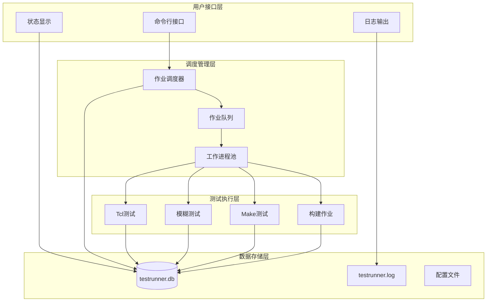
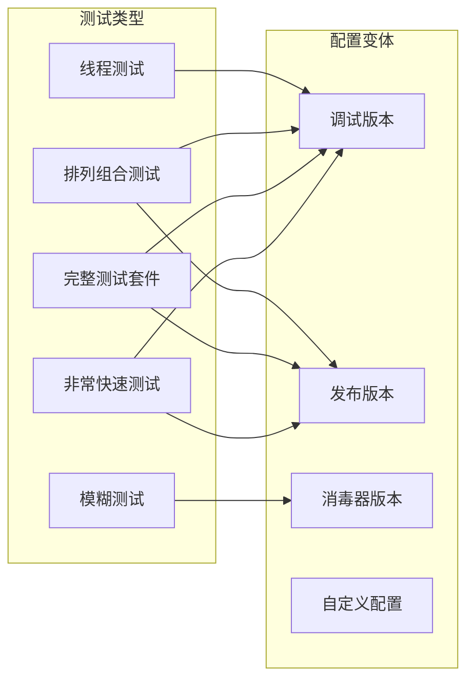
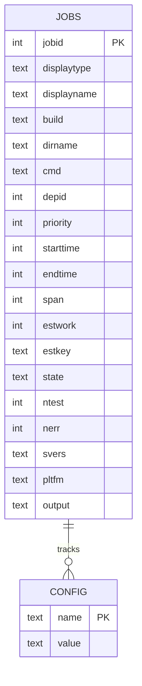
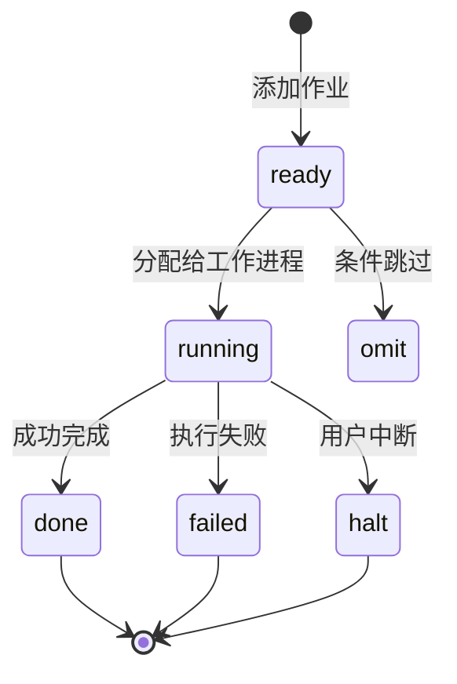
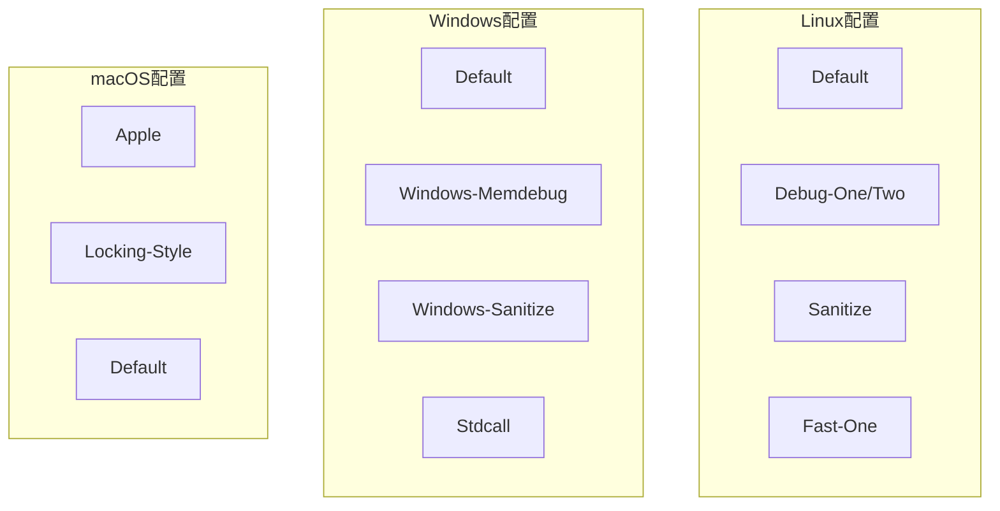
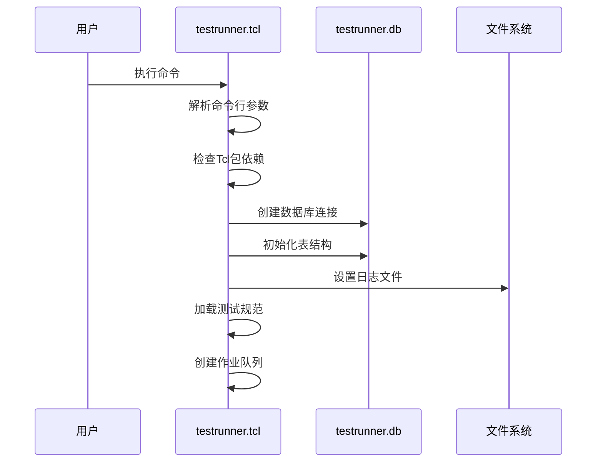
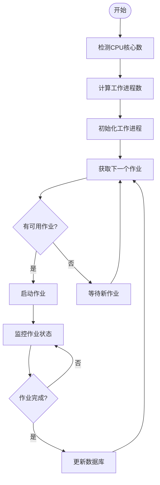
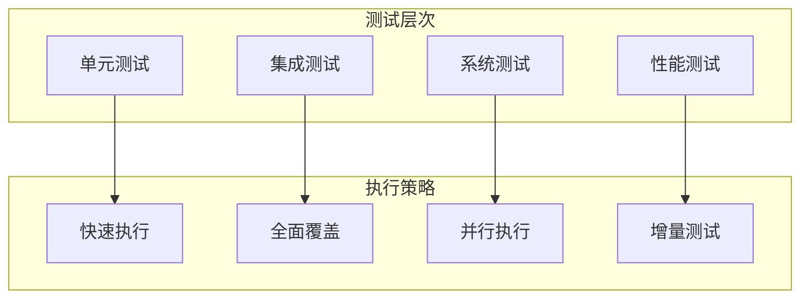

# 标准执行流程

<cite>
**本文档中引用的文件**
- [testrunner.tcl](file://test/testrunner.tcl)
- [testrunner_data.tcl](file://test/testrunner_data.tcl)
- [testrunner.md](file://doc/testrunner.md)
- [testrunner_estwork.tcl](file://test/testrunner_estwork.tcl)
- [fuzzcheck.c](file://test/fuzzcheck.c)
- [permutations.test](file://test/permutations.test)
</cite>

## 目录
1. [概述](#概述)
2. [系统架构](#系统架构)
3. [核心命令详解](#核心命令详解)
4. [测试套件组织](#测试套件组织)
5. [数据库跟踪机制](#数据库跟踪机制)
6. [构建配置管理](#构建配置管理)
7. [执行流程详解](#执行流程详解)
8. [监控与日志分析](#监控与日志分析)
9. [故障排除指南](#故障排除指南)
10. [最佳实践](#最佳实践)

## 概述

testrunner.tcl是SQLite项目的核心测试自动化脚本，专门设计用于在多核机器上并行运行大量SQLite测试，显著减少测试时间。该脚本支持多种类型的测试，包括Tcl测试脚本、模糊测试（fuzzcheck）、以及通过make命令运行的各种测试。

### 主要功能特性

- **并行测试执行**：自动检测CPU核心数并分配相应的工作进程
- **数据库状态跟踪**：使用testrunner.db数据库记录所有测试状态和进度
- **灵活的测试配置**：支持多种构建配置和测试模式
- **智能依赖管理**：自动处理测试间的依赖关系
- **详细的进度报告**：提供实时状态更新和错误报告

## 系统架构

testrunner.tcl采用分层架构设计，主要包含以下组件：



**图表来源**
- [testrunner.tcl](file://test/testrunner.tcl#L1-L100)

## 核心命令详解

### mdevtest命令

mdevtest是开发测试的主要入口点，执行快速测试套件和模糊测试。

```bash
# 基本用法
tclsh test/testrunner.tcl mdevtest

# 包含模式匹配
tclsh test/testrunner.tcl mdevtest rtree%

# 使用ZIPVFS扩展
tclsh test/testrunner.tcl --zipvfs /path/to/zipvfs mdevtest
```

**执行流程**：
1. 构建两个配置：All-Debug（启用调试）和All-O0（优化级别0）
2. 运行非常快速测试套件（veryquick）
3. 执行fuzztest目标
4. 自动清理临时文件

### sdevtest命令

sdevtest类似于mdevtest，但使用地址消毒器（Address Sanitizer）进行内存安全测试。

```bash
# 基本用法
tclsh test/testrunner.tcl sdevtest

# 包含模式匹配
tclsh test/testrunner.tcl sdevtest 'fts5*'
```

**关键差异**：
- 第二个构建配置为All-Sanitize
- 启用fsanitize=address,undefined选项
- 更严格的内存访问检查

### release命令

release命令执行全面的发布测试，涵盖多种构建配置和测试场景。

```bash
# 完整发布测试
tclsh test/testrunner.tcl release

# 针对特定模块的发布测试
tclsh test/testrunner.tcl release rtree%

# 使用外部模糊数据库
tclsh test/testrunner.tcl release --fuzzdb /path/to/db.sqlite
```

**平台特定行为**：
- **Linux**：运行多个构建配置，包括Sanitize、Fast-One等
- **Windows**：使用不同的构建参数和测试策略
- **macOS**：针对Apple平台的特殊配置

**节来源**
- [testrunner.md](file://doc/testrunner.md#L193-L280)

## 测试套件组织

### Tcl测试分类

testrunner.tcl管理多种类型的Tcl测试：



**图表来源**
- [testrunner_data.tcl](file://test/testrunner_data.tcl#L1-L50)

### 测试优先级系统

测试按优先级排序以优化执行顺序：

| 优先级 | 描述 | 示例 |
|--------|------|------|
| 0 | 默认优先级 | 大多数标准测试 |
| 1 | 高优先级模糊测试 | fuzzdata1.db, fuzzdata2.db |
| 2 | 慢速测试 | superslow标记的测试 |
| 3 | 构建作业 | 编译和链接操作 |
| 4 | 超慢测试 | 特殊的性能测试 |

**节来源**
- [testrunner.tcl](file://test/testrunner.tcl#L1200-L1250)

## 数据库跟踪机制

### testrunner.db架构

testrunner.tcl使用SQLite数据库跟踪所有测试活动：



**图表来源**
- [testrunner.tcl](file://test/testrunner.tcl#L350-L450)

### 状态转换图



### 关键数据库查询

常用查询语句用于监控测试状态：

```sql
-- 获取失败的测试
SELECT * FROM jobs WHERE state='failed';

-- 查看当前运行中的测试
SELECT * FROM jobs WHERE state='running';

-- 统计测试结果
SELECT state, COUNT(*) FROM jobs GROUP BY state;

-- 计算总耗时
SELECT SUM(span) FROM jobs WHERE state='done';
```

**节来源**
- [testrunner.tcl](file://test/testrunner.tcl#L1700-L1800)

## 构建配置管理

### 内置构建配置

testrunner.tcl支持多种预定义的构建配置：

| 配置名称 | 描述 | 主要特点 |
|----------|------|----------|
| All-Debug | 全功能调试版本 | 启用所有扩展和调试选项 |
| All-O0 | 优化级别0版本 | 最大化调试能力 |
| All-Sanitize | 地址消毒器版本 | 内存安全检查 |
| Fast-One | 性能优化版本 | 高度优化的性能配置 |
| Debug-One | 单元测试版本 | 专门的单元测试配置 |
| Sanitize | 消毒器测试 | 内存和UB检测 |

### 平台特定配置



**图表来源**
- [testrunner_data.tcl](file://test/testrunner_data.tcl#L100-L300)

**节来源**
- [testrunner_data.tcl](file://test/testrunner_data.tcl#L1-L200)

## 执行流程详解

### 初始化阶段



**图表来源**
- [testrunner.tcl](file://test/testrunner.tcl#L50-L150)

### 工作进程管理

testrunner.tcl自动管理工作进程池：



**图表来源**
- [testrunner.tcl](file://test/testrunner.tcl#L1400-L1500)

### 作业执行生命周期

每个作业经历以下生命周期：

1. **准备阶段**：创建工作目录，设置环境变量
2. **执行阶段**：运行测试命令，捕获输出
3. **后处理阶段**：解析结果，更新统计信息
4. **清理阶段**：删除临时文件，释放资源

**节来源**
- [testrunner.tcl](file://test/testrunner.tcl#L1500-L1600)

## 监控与日志分析

### 实时状态监控

使用status命令监控测试进度：

```bash
# 基本状态查看
tclsh test/testrunner.tcl status

# 每2秒刷新一次
tclsh test/testrunner.tcl status -d 2

# 清屏模式
tclsh test/testrunner.tcl status --cls
```

### 日志文件分析

testrunner.log包含详细的测试输出：

```bash
# 查找失败的测试
grep "FAILED:" testrunner.log

# 查找错误信息
grep "! " testrunner.log

# 查找特定测试的输出
grep "测试名称" testrunner.log

# 分析测试时间分布
awk '/^[0-9]+ms/ {print $1}' testrunner.log | sort -n
```

### 错误诊断工具

```bash
# 显示错误摘要
tclsh test/testrunner.tcl errors

# 显示详细错误信息
tclsh test/testrunner.tcl errors -v

# 显示特定模式的错误
tclsh test/testrunner.tcl errors 'fts5*'
```

**节来源**
- [testrunner.tcl](file://test/testrunner.tcl#L700-L800)

## 故障排除指南

### 常见问题及解决方案

#### 1. 数据库连接问题

**症状**：无法创建或访问testrunner.db
**解决方案**：
```bash
# 检查磁盘空间
df -h .

# 检查文件权限
ls -la testrunner.db

# 删除损坏的数据库
rm -f testrunner.db
```

#### 2. 内存不足问题

**症状**：测试过程中出现OOM错误
**解决方案**：
```bash
# 减少并发进程数
tclsh test/testrunner.tcl --jobs 4 mdevtest

# 使用--buildonly避免运行测试
tclsh test/testrunner.tcl --buildonly mdevtest
```

#### 3. 编译失败问题

**症状**：构建作业失败
**解决方案**：
```bash
# 查看构建日志
cat testrunner_build_*/build.log

# 手动重建特定配置
tclsh test/testrunner.tcl script All-Debug > make.sh
./make.sh testfixture
```

### 性能优化建议

#### 1. 网络文件系统优化

对于NFS或其他网络文件系统，建议：
```bash
# 在本地目录运行测试
mkdir /tmp/sqlite-tests
cd /tmp/sqlite-tests
ln -s /path/to/sqlite .
tclsh test/testrunner.tcl mdevtest
```

#### 2. 存储设备优化

对于SSD存储：
```bash
# 启用更快的文件系统操作
export SQLITE_TMPDIR=/tmp
export TMPDIR=/tmp
```

#### 3. 内存配置优化

```bash
# 增加可用内存限制
ulimit -v 4000000  # 4GB虚拟内存限制
```

## 最佳实践

### 开发工作流程

1. **日常开发测试**
   ```bash
   # 快速验证更改
   tclsh test/testrunner.tcl mdevtest
   ```

2. **全面回归测试**
   ```bash
   # 完整的功能验证
   tclsh test/testrunner.tcl sdevtest
   ```

3. **发布前验证**
   ```bash
   # 全面的发布测试
   tclsh test/testrunner.tcl release
   ```

### CI/CD集成

#### Jenkins Pipeline示例

```groovy
pipeline {
    agent any
    stages {
        stage('Setup') {
            steps {
                sh 'make clean'
                sh 'make'
            }
        }
        stage('Quick Tests') {
            steps {
                sh 'tclsh test/testrunner.tcl mdevtest'
            }
        }
        stage('Sanity Checks') {
            steps {
                sh 'tclsh test/testrunner.tcl sdevtest'
            }
        }
        stage('Full Regression') {
            steps {
                sh 'tclsh test/testrunner.tcl release'
            }
        }
    }
    post {
        always {
            archiveArtifacts artifacts: 'testrunner.log', fingerprint: true
            archiveArtifacts artifacts: 'testrunner.db', fingerprint: true
        }
    }
}
```

### 性能基准测试

#### 测试时间对比

| 测试类型 | 平均时间 | 并行效率 |
|----------|----------|----------|
| veryquick | 2-3分钟 | 95% |
| mdevtest | 15-20分钟 | 85% |
| sdevtest | 25-30分钟 | 75% |
| release | 1-2小时 | 65% |

#### 资源使用监控

```bash
# 监控CPU和内存使用
watch -n 1 'ps aux | grep testrunner'

# 监控磁盘I/O
iotop -p $(pgrep -f testrunner)

# 监控网络使用（如果需要）
iftop -i eth0
```

### 扩展性考虑

#### 大规模测试集群

对于大型项目，可以考虑：
- 使用分布式测试框架
- 实现测试结果聚合
- 建立测试缓存机制
- 实现智能测试选择算法

#### 自动化测试策略



通过遵循这些最佳实践，可以最大化testrunner.tcl的效率，确保SQLite项目的质量和稳定性。定期监控测试结果，及时发现和解决潜在问题，是维护高质量软件的重要保障。