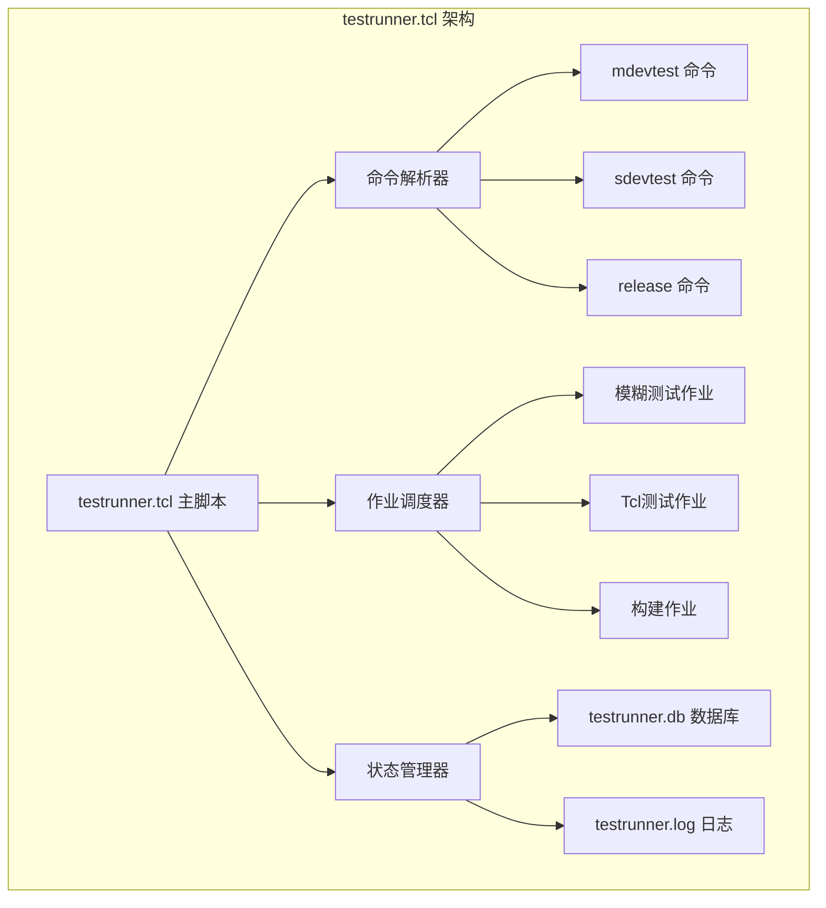
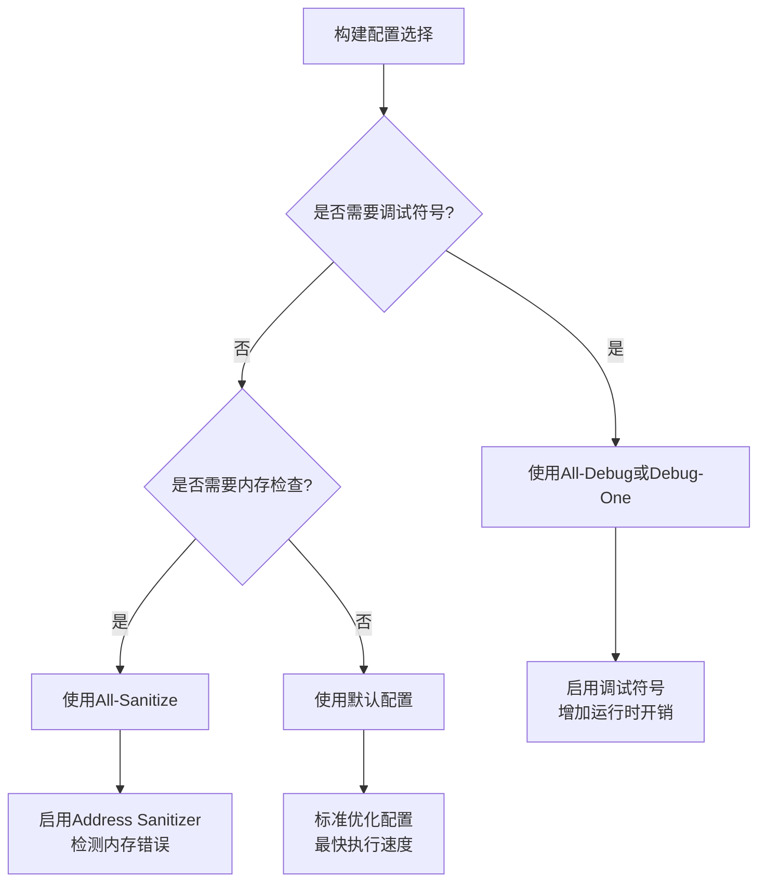
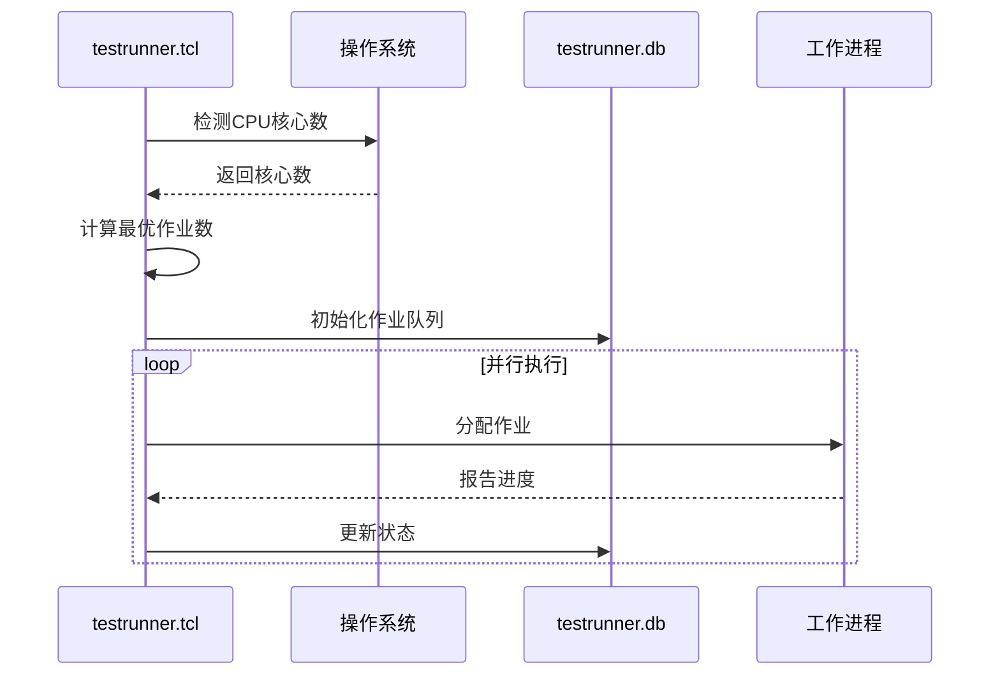
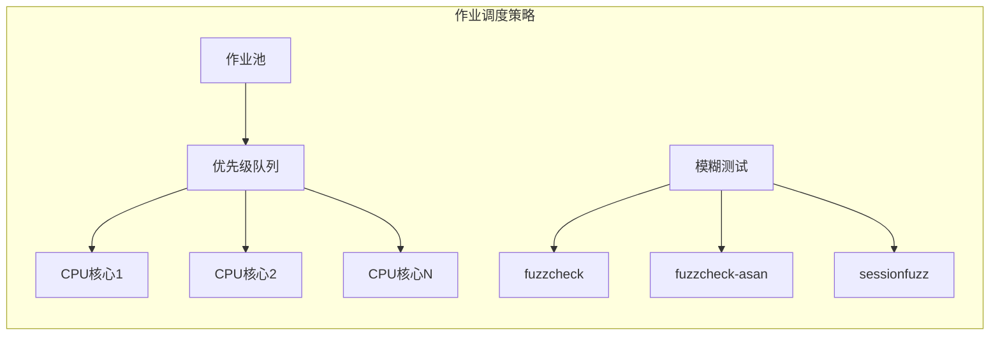

# 模糊测试执行方法

<cite>
**本文档引用的文件**
- [testrunner.tcl](file://test/testrunner.tcl)
- [fuzzcheck.c](file://test/fuzzcheck.c)
- [fuzz_common.tcl](file://test/fuzz_common.tcl)
- [testrunner_data.tcl](file://test/testrunner_data.tcl)
- [testrunner.md](file://doc/testrunner.md)
- [testrunner_estwork.tcl](file://test/testrunner_estwork.tcl)
</cite>

## 目录
1. [概述](#概述)
2. [testrunner.tcl脚本架构](#testrunnertcl脚本架构)
3. [模糊测试命令详解](#模糊测试命令详解)
4. [构建配置与调试选项](#构建配置与调试选项)
5. [并行化与性能优化](#并行化与性能优化)
6. [测试状态跟踪与监控](#测试状态跟踪与监控)
7. [故障排除与调试](#故障排除与调试)
8. [实际工作流示例](#实际工作流示例)
9. [最佳实践建议](#最佳实践建议)

## 概述

SQLite的模糊测试系统通过testrunner.tcl脚本提供了一个强大的框架，用于自动化执行各种模糊测试任务。该系统支持多种测试类型，包括传统的Tcl测试、fuzzcheck模糊测试以及外部数据库测试。通过并行化处理和智能调度，testrunner能够充分利用多核处理器资源，在合理时间内完成大量测试用例。

### 核心特性

- **多类型测试支持**：同时运行Tcl测试、fuzzcheck模糊测试和外部数据库测试
- **智能并行化**：自动检测CPU核心数并优化作业分配
- **状态持久化**：通过testrunner.db数据库跟踪测试进度和结果
- **灵活配置**：支持多种构建配置和调试选项
- **实时监控**：提供status命令进行实时进度监控

## testrunner.tcl脚本架构

### 主要组件结构



**图表来源**
- [testrunner.tcl](file://test/testrunner.tcl#L848-L1450)

### 数据库模式设计

testrunner.db采用关系型数据库设计，包含以下关键表：

| 表名 | 字段 | 描述 |
|------|------|------|
| jobs | jobid, displaytype, displayname, state, priority | 存储所有待执行和已执行的测试作业 |
| config | name, value | 存储全局配置信息和统计信息 |

**节来源**
- [testrunner.tcl](file://test/testrunner.tcl#L350-L450)

## 模糊测试命令详解

### mdevtest命令

mdevtest是开发前推荐的测试套件，包含两个主要构建配置：

1. **All-O0构建**：启用调试符号的优化级别为-O0的构建
2. **All-Debug构建**：启用调试功能的完整构建

```bash
# 执行mdevtest测试
tclsh test/testrunner.tcl mdevtest

# 包含特定模式的mdevtest
tclsh test/testrunner.tcl mdevtest rtree%
```

### sdevtest命令

sdevtest专门用于安全开发测试，包含Address Sanitizer和Undefined Behavior Sanitizer：

```bash
# 执行sdevtest测试
tclsh test/testrunner.tcl sdevtest

# 使用ASAN和UBSAN的测试配置
# 自动添加：-fsanitize=address,undefined
```

### release命令

release命令执行最全面的测试套件，针对不同平台运行多种构建配置：

```bash
# 执行完整发布测试
tclsh test/testrunner.tcl release

# 针对特定平台的测试
tclsh test/testrunner.tcl release linux
```

**节来源**
- [testrunner.tcl](file://test/testrunner.tcl#L1388-L1420)
- [testrunner_data.tcl](file://test/testrunner_data.tcl#L421-L456)

## 构建配置与调试选项

### 支持的构建配置

testrunner.tcl支持多种构建配置，每种配置都有特定的用途：

| 配置名称 | 编译器选项 | 用途 |
|----------|------------|------|
| All-Debug | --enable-all --with-debug | 完整调试版本 |
| All-O0 | --enable-all -O0 | 无优化调试版本 |
| All-Sanitize | -fsanitize=address,undefined | 启用ASAN和UBSAN |
| Debug-One | -DSQLITE_DEBUG=1 -DSQLITE_MEMDEBUG=1 | 内存调试版本 |
| Sanitize | clang -fsanitize=address,undefined | Clang编译器版本 |

### 调试符号与Sanitizer配置



**图表来源**
- [testrunner_data.tcl](file://test/testrunner_data.tcl#L100-L200)

**节来源**
- [testrunner_data.tcl](file://test/testrunner_data.tcl#L100-L200)

## 并行化与性能优化

### CPU核心检测与作业分配

testrunner.tcl自动检测可用的CPU核心数，并根据核心数量智能分配作业：



**图表来源**
- [testrunner.tcl](file://test/testrunner.tcl#L250-L300)

### 作业优先级系统

模糊测试作业按优先级排序，确保重要测试优先执行：

| 优先级 | 测试类型 | 描述 |
|--------|----------|------|
| 15 | --slice参数 | 大型外部数据库测试 |
| 5 | fuzzdata1-2.db | 核心模糊测试数据 |
| 1 | 其他模糊测试 | 标准模糊测试数据 |

### 并行化策略



**节来源**
- [testrunner.tcl](file://test/testrunner.tcl#L1277-L1317)

## 测试状态跟踪与监控

### 实时状态监控

testrunner提供多种监控方式：

```bash
# 显示实时状态
tclsh test/testrunner.tcl status

# 每2秒刷新一次状态
tclsh test/testrunner.tcl status -d 2

# 清屏显示
tclsh test/testrunner.tcl status --cls
```

### 状态报告内容

状态报告包含以下关键信息：

| 项目 | 描述 |
|------|------|
| 命令行 | 当前执行的命令 |
| 总结 | 运行时间、完成百分比、错误计数 |
| 进度 | 正在运行的作业列表 |
| 失败 | 失败的作业及其简要信息 |

### 动态作业数调整

```bash
# 查看当前作业数
tclsh test/testrunner.tcl njob

# 设置新的作业数
tclsh test/testrunner.tcl njob 8
```

**节来源**
- [testrunner.tcl](file://test/testrunner.tcl#L600-L700)

## 故障排除与调试

### 错误诊断工具

testrunner提供多种错误诊断选项：

```bash
# 显示详细的错误信息
tclsh test/testrunner.tcl errors -v

# 显示摘要信息
tclsh test/testrunner.tcl errors -s

# 按模式过滤错误
tclsh test/testrunner.tcl errors fuzz*
```

### 日志文件分析

测试输出同时记录到两个文件：
- **testrunner.log**：详细的命令和输出日志
- **testrunner.db**：结构化的测试状态数据库

### 外部数据库测试

支持使用外部fuzzcheck数据库进行测试：

```bash
# 使用外部数据库
tclsh test/testrunner.tcl --fuzzdb ../fuzz/20250415.db release

# 环境变量方式
export FUZZDB=../fuzz/20250415.db
tclsh test/testrunner.tcl release
```

**节来源**
- [testrunner.tcl](file://test/testrunner.tcl#L750-L850)

## 实际工作流示例

### 开发前测试工作流

```bash
#!/bin/bash
# 开发前完整测试脚本

echo "开始开发前测试..."

# 1. 执行mdevtest（基础测试）
echo "执行mdevtest..."
tclsh test/testrunner.tcl mdevtest

# 2. 监控测试进度
echo "监控测试进度..."
watch tclsh test/testrunner.tcl status

# 3. 检查错误
echo "检查测试结果..."
tclsh test/testrunner.tcl errors -v

echo "开发前测试完成！"
```

### 发布前全面测试

```bash
#!/bin/bash
# 发布前全面测试脚本

echo "开始发布前测试..."

# 1. 执行release测试
echo "执行release测试..."
tclsh test/testrunner.tcl release

# 2. 特定平台测试
echo "执行Linux平台测试..."
tclsh test/testrunner.tcl release linux

# 3. 安全测试
echo "执行sdevtest测试..."
tclsh test/testrunner.tcl sdevtest

echo "发布前测试完成！"
```

### 调试工作流

```bash
#!/bin/bash
# 调试工作流示例

# 1. 预览测试行为
echo "预览测试行为..."
tclsh test/testrunner.tcl --explain mdevtest

# 2. 仅构建不运行
echo "仅构建测试二进制文件..."
tclsh test/testrunner.tcl --buildonly release

# 3. 干运行测试
echo "干运行测试..."
tclsh test/testrunner.tcl --dryrun mdevtest

# 4. 执行实际测试
echo "执行测试..."
tclsh test/testrunner.tcl mdevtest
```

## 最佳实践建议

### 性能优化建议

1. **合理设置作业数**：根据系统资源调整njob参数
2. **选择合适的构建配置**：平衡测试覆盖率和执行时间
3. **使用外部数据库分片**：对于大型外部数据库，利用--slice参数

### 调试技巧

1. **使用--explain选项**：在执行前了解将要运行的内容
2. **监控实时状态**：使用status命令跟踪测试进度
3. **分析失败原因**：结合testrunner.log和testrunner.db进行深入分析

### 平台特定注意事项

- **Windows平台**：注意路径分隔符和可执行文件扩展名
- **Unix/Linux平台**：确保脚本具有可执行权限
- **macOS平台**：考虑沙盒限制和权限问题

### 自动化集成

```bash
# CI/CD集成示例
export NOJOB=4  # 设置固定作业数
export FUZZDB=/path/to/fuzz/db

# 执行测试并生成报告
tclsh test/testrunner.tcl release > test_report.log 2>&1
```

通过遵循这些最佳实践，开发者可以有效地利用SQLite的模糊测试系统，确保代码质量和稳定性。