# 高级控制选项

<cite>
**本文档中引用的文件**
- [testrunner.tcl](file://test/testrunner.tcl)
- [testrunner.md](file://doc/testrunner.md)
- [testrunner_data.tcl](file://test/testrunner_data.tcl)
</cite>

## 目录
1. [概述](#概述)
2. [核心高级控制选项](#核心高级控制选项)
3. [预览和调试选项](#预览和调试选项)
4. [构建控制选项](#构建控制选项)
5. [动态资源管理](#动态资源管理)
6. [状态监控和辅助命令](#状态监控和辅助命令)
7. [使用场景和最佳实践](#使用场景和最佳实践)
8. [故障排除指南](#故障排除指南)

## 概述

testrunner.tcl是SQLite项目的核心测试框架，提供了丰富的高级控制选项来优化测试执行、调试问题和管理资源。这些选项允许开发者在不同阶段预览测试行为、控制构建过程、动态调整并发作业数，并实时监控测试状态。

## 核心高级控制选项

### 命令行参数解析机制

testrunner.tcl通过专门的命令行解析器处理各种高级选项：

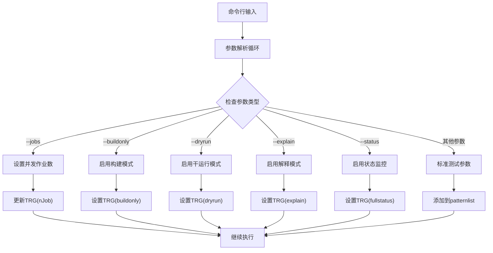

**图表来源**
- [testrunner.tcl](file://test/testrunner.tcl#L820-L880)

### 并发作业控制

系统默认根据CPU核心数自动计算最优的并发作业数：

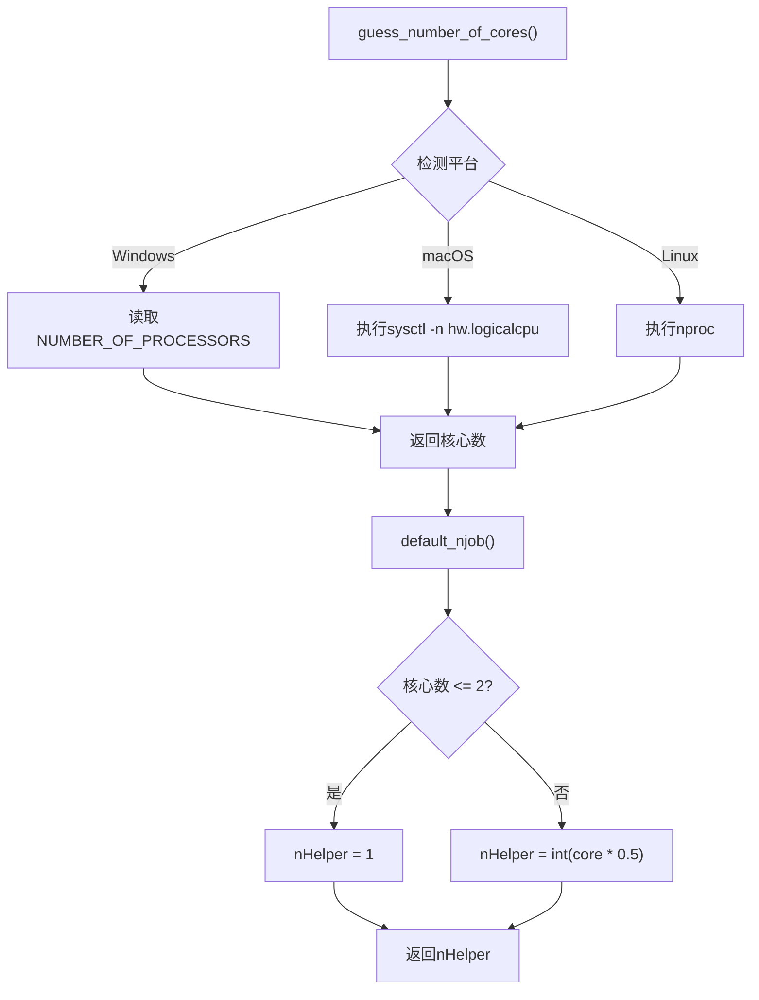

**图表来源**
- [testrunner.tcl](file://test/testrunner.tcl#L150-L180)

**节来源**
- [testrunner.tcl](file://test/testrunner.tcl#L220-L242)
- [testrunner.tcl](file://test/testrunner.tcl#L150-L180)

## 预览和调试选项

### --dryrun 选项：安全预览测试行为

--dryrun选项允许用户在不实际执行任何测试的情况下预览testrunner.tcl将要执行的操作。

#### 工作原理

当启用--dryrun时，testrunner.tcl会：
1. 构建完整的测试集但不执行
2. 将所有计划执行的shell命令写入testrunner.log文件
3. 不创建或修改任何测试目录
4. 不启动任何子进程

#### 使用场景

- **构建验证**：确认测试配置正确但不实际运行
- **CI/CD集成**：在部署前验证测试计划
- **性能分析**：评估测试执行时间而不浪费资源
- **权限检查**：验证所需文件和目录的访问权限

#### 命令示例

```bash
# 预览mdevtest测试的完整流程
tclsh test/testrunner.tcl --dryrun mdevtest

# 预览特定配置的构建过程
tclsh test/testrunner.tcl --dryrun --config Debug-One release

# 结合其他选项进行综合预览
tclsh test/testrunner.tcl --dryrun --jobs 4 release
```

### --explain 选项：人类可读的测试计划

--explain选项提供详细的测试执行计划，以人类可读的格式输出。

#### 输出内容

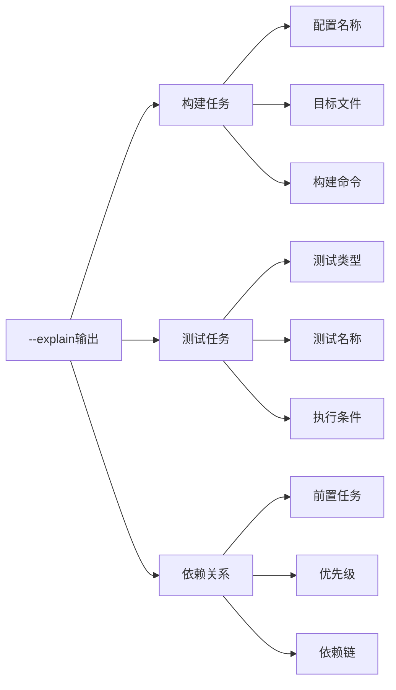

**图表来源**
- [testrunner.tcl](file://test/testrunner.tcl#L1803-L1841)

#### 使用场景

- **学习测试结构**：理解复杂测试套件的组织方式
- **调试配置问题**：识别配置错误或缺失的测试
- **文档生成**：为测试文档提供自动化内容
- **团队培训**：帮助新成员了解测试架构

#### 命令示例

```bash
# 显示mdevtest的详细测试计划
tclsh test/testrunner.tcl --explain mdevtest

# 显示特定配置的测试详情
tclsh test/testrunner.tcl --explain --config All-Debug release

# 结合模式匹配过滤输出
tclsh test/testrunner.tcl --explain release fts5*
```

**节来源**
- [testrunner.tcl](file://test/testrunner.tcl#L820-L880)
- [testrunner.md](file://doc/testrunner.md#L336-L373)

## 构建控制选项

### --buildonly 选项：独立构建验证

--buildonly选项专注于构建过程，跳过所有测试执行，仅验证二进制文件的正确性。

#### 实现机制

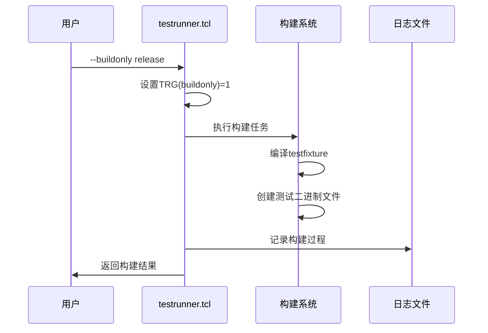

**图表来源**
- [testrunner.tcl](file://test/testrunner.tcl#L1803-L1841)

#### 使用场景

- **编译器兼容性测试**：验证不同编译器的兼容性
- **依赖关系验证**：确保所有必需库都可用
- **交叉编译测试**：验证目标平台的构建能力
- **持续集成**：在测试前确保构建成功

#### 命令示例

```bash
# 构建release测试所需的所有二进制文件
tclsh test/testrunner.tcl --buildonly release

# 仅构建特定配置
tclsh test/testrunner.tcl --buildonly --config All-Debug release

# 结合ZIPVFS进行扩展构建
tclsh test/testrunner.tcl --buildonly --zipvfs /path/to/zipvfs release

# 验证外部模糊测试数据库
tclsh test/testrunner.tcl --buildonly --fuzzdb /path/to/fuzzdb.db release
```

**节来源**
- [testrunner.tcl](file://test/testrunner.tcl#L220-L242)
- [testrunner.md](file://doc/testrunner.md#L336-L373)

## 动态资源管理

### njob 命令：实时调整并发作业数

njob命令允许在测试运行过程中动态调整并发作业数，以优化资源利用率和响应速度。

#### 命令语法和功能

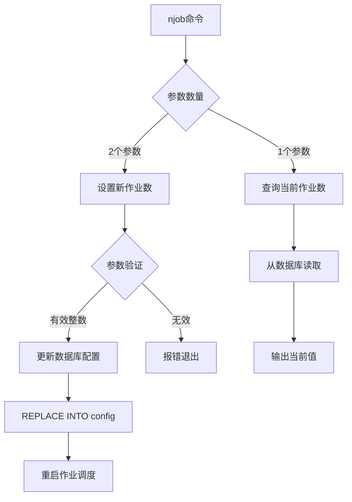

**图表来源**
- [testrunner.tcl](file://test/testrunner.tcl#L418-L461)

#### 资源优化策略

| 场景 | 推荐作业数 | 调整原因 |
|------|------------|----------|
| 内存受限环境 | CPU核心数×0.5 | 减少内存占用 |
| 磁盘I/O密集 | CPU核心数×0.3 | 避免磁盘瓶颈 |
| 网络延迟高 | CPU核心数×0.7 | 平衡网络和计算 |
| 测试稳定性优先 | CPU核心数×0.2 | 降低资源竞争 |
| 最大吞吐量 | CPU核心数 | 充分利用硬件 |

#### 使用示例

```bash
# 查询当前并发作业数
./testfixture test/testrunner.tcl njob

# 动态增加到8个作业
./testfixture test/testrunner.tcl njob 8

# 在资源紧张时减少到2个作业
./testfixture test/testrunner.tcl njob 2

# 在负载较低时最大化并发
./testfixture test/testrunner.tcl njob 16
```

### 自适应作业调度算法

testrunner.tcl采用智能的作业调度算法来优化测试执行：

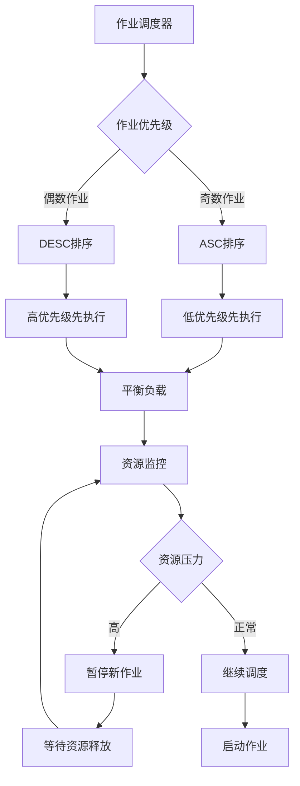

**图表来源**
- [testrunner.tcl](file://test/testrunner.tcl#L961-L1038)

**节来源**
- [testrunner.tcl](file://test/testrunner.tcl#L418-L461)
- [testrunner.tcl](file://test/testrunner.tcl#L1713-L1761)

## 状态监控和辅助命令

### --status 选项：全屏状态显示

--status选项使用VT100转义序列提供实时的全屏状态监控，类似于`watch test/testrunner status`的效果。

#### VT100转义序列实现

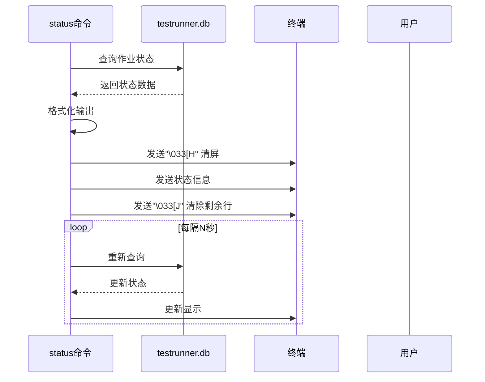

**图表来源**
- [testrunner.tcl](file://test/testrunner.tcl#L620-L680)

#### 状态信息层次结构

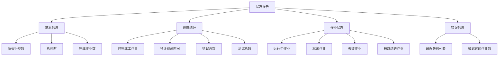

**图表来源**
- [testrunner.tcl](file://test/testrunner.tcl#L620-L680)

#### 使用场景和参数

| 参数 | 功能 | 使用场景 |
|------|------|----------|
| `-d N` | 每N秒刷新一次 | 实时监控测试进度 |
| `--cls` | 启用全屏清除 | 避免屏幕混乱 |
| 无参数 | 单次显示 | 快速查看当前状态 |

#### 命令示例

```bash
# 实时监控测试状态（每2秒刷新）
tclsh test/testrunner.tcl status -d 2

# 全屏状态显示（支持VT100终端）
tclsh test/testrunner.tcl status --cls

# 结合延迟参数进行长时间监控
tclsh test/testrunner.tcl status -d 5 --cls

# 单次状态快照
tclsh test/testrunner.tcl status
```

### halt 命令：优雅中断测试

halt命令用于优雅地中断正在运行的测试，标记所有待执行作业为"halt"状态。

#### 中断机制

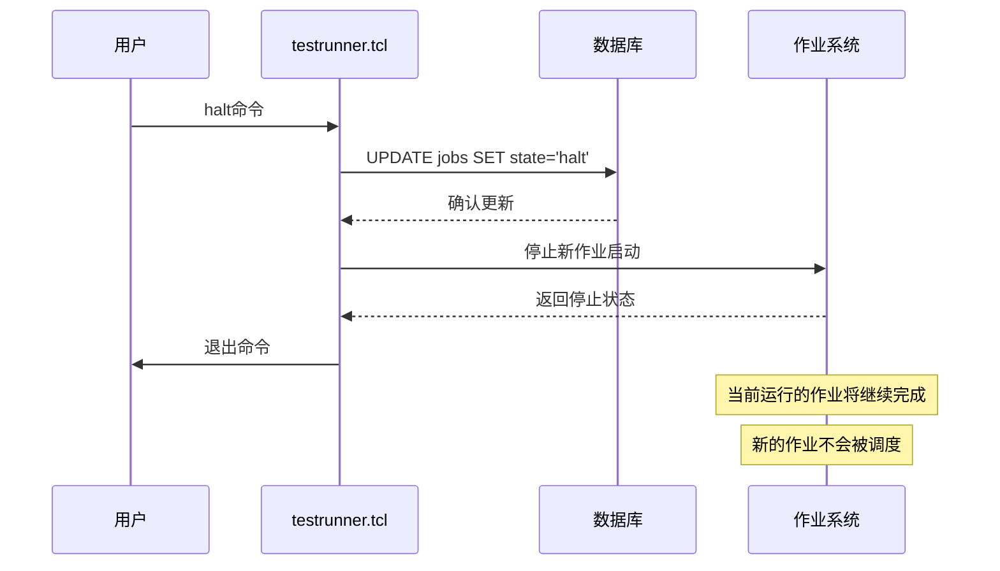

**图表来源**
- [testrunner.tcl](file://test/testrunner.tcl#L440-L461)

#### 应用场景

- **资源回收**：在系统资源不足时中断测试
- **紧急修复**：发现严重问题时立即停止
- **维护操作**：在进行系统维护时安全停止
- **测试取消**：在不需要继续执行时优雅终止

### errors 命令：详细错误分析

errors命令提供详细的测试失败分析，支持多种输出模式和过滤选项。

#### 错误输出模式

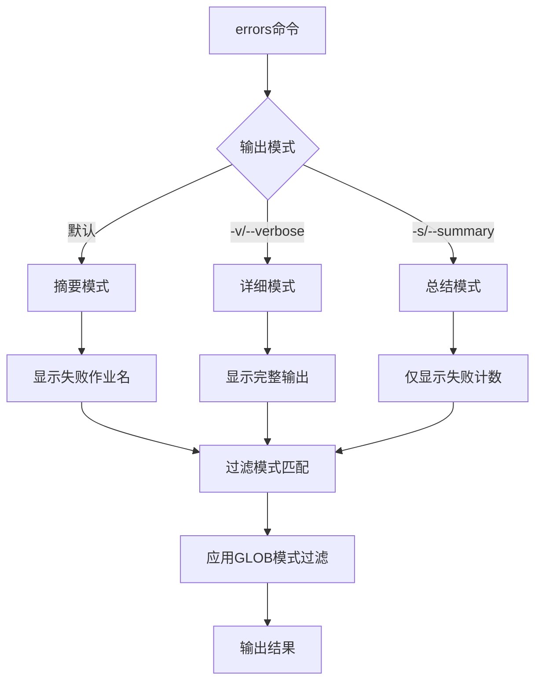

**图表来源**
- [testrunner.tcl](file://test/testrunner.tcl#L800-L850)

#### 错误分析功能

| 功能 | 描述 | 使用场景 |
|------|------|----------|
| 失败作业列表 | 显示所有失败的测试 | 快速定位问题范围 |
| 完整输出 | 显示测试的全部日志 | 深度调试分析 |
| 错误摘要 | 统计错误总数和测试数 | 性能指标分析 |
| 模式过滤 | 支持GLOB模式匹配 | 集中分析特定问题 |

#### 命令示例

```bash
# 显示所有失败测试的摘要
tclsh test/testrunner.tcl errors

# 显示详细错误信息
tclsh test/testrunner.tcl errors -v

# 仅显示错误统计
tclsh test/testrunner.tcl errors -s

# 分析特定类型的错误
tclsh test/testrunner.tcl errors "fts5*"

# 结合模式过滤显示详细信息
tclsh test/testrunner.tcl errors -v "corrupt*"
```

**节来源**
- [testrunner.tcl](file://test/testrunner.tcl#L620-L700)
- [testrunner.tcl](file://test/testrunner.tcl#L440-L461)
- [testrunner.tcl](file://test/testrunner.tcl#L800-L850)

## 使用场景和最佳实践

### 开发阶段的最佳实践

#### 快速迭代开发

```bash
# 1. 预览测试计划（不执行）
tclsh test/testrunner.tcl --dryrun --explain mdevtest

# 2. 快速验证构建（不运行测试）
tclsh test/testrunner.tcl --buildonly mdevtest

# 3. 运行快速测试套件
./testfixture test/testrunner.tcl veryquick
```

#### 调试和问题排查

```bash
# 1. 监控测试进度
tclsh test/testrunner.tcl status -d 2

# 2. 分析失败原因
tclsh test/testrunner.tcl errors -v

# 3. 中断异常测试
tclsh test/testrunner.tcl halt

# 4. 查看作业状态
tclsh test/testrunner.tcl joblist
```

### CI/CD集成策略

#### 持续集成流水线

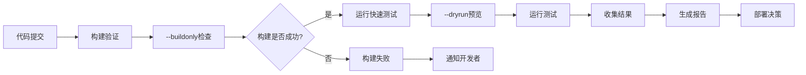

#### 环境适配策略

| 环境类型 | 推荐配置 | 原因 |
|----------|----------|------|
| 开发机 | 默认并发数 | 快速反馈 |
| CI服务器 | CPU核心数×0.7 | 避免资源竞争 |
| 虚拟机 | CPU核心数×0.5 | 资源限制 |
| 容器环境 | CPU核心数×0.3 | 资源隔离 |
| 生产测试 | CPU核心数×0.2 | 稳定性优先 |

### 性能优化建议

#### 资源利用率优化

```bash
# 根据系统负载动态调整
if [free_memory < 2GB]; then
    ./testfixture test/testrunner.tcl njob 2
else
    ./testfixture test/testrunner.tcl njob 8
fi

# 监控磁盘I/O进行调整
if [disk_iops > threshold]; then
    ./testfixture test/testrunner.tcl njob 4
fi
```

#### 测试策略组合

```bash
# 开发阶段：快速验证
tclsh test/testrunner.tcl --dryrun --explain veryquick

# 测试阶段：全面验证
tclsh test/testrunner.tcl --buildonly release

# 生产阶段：稳定运行
./testfixture test/testrunner.tcl release
```

## 故障排除指南

### 常见问题和解决方案

#### VT100转义序列问题

**问题描述**：在Windows系统上--status选项显示异常

**解决方案**：
```bash
# 使用替代方案
tclsh test/testrunner.tcl status -d 2

# 或者使用非VT100版本
tclsh test/testrunner.tcl status --cls
```

#### 并发作业数过高

**症状**：系统响应缓慢，测试超时

**诊断步骤**：
```bash
# 检查当前作业数
./testfixture test/testrunner.tcl njob

# 降低并发数
./testfixture test/testrunner.tcl njob 2

# 监控系统资源
tclsh test/testrunner.tcl status -d 5
```

#### 数据库锁定问题

**问题描述**：testrunner.db被锁定无法访问

**解决方法**：
```bash
# 检查是否有残留进程
ps aux | grep testrunner

# 强制终止相关进程
kill -9 <PID>

# 删除损坏的数据库文件
rm testrunner.db

# 重新开始测试
./testfixture test/testrunner.tcl veryquick
```

### 调试技巧

#### 日志分析

```bash
# 查看详细构建日志
cat testrunner.log | grep "BUILD"

# 分析测试失败
cat testrunner.log | grep "FAILED"

# 监控实时输出
tail -f testrunner.log
```

#### 状态监控

```bash
# 实时监控测试进度
watch -n 2 tclsh test/testrunner.tcl status

# 详细状态信息
tclsh test/testrunner.tcl status -d 1 --cls

# 作业状态检查
tclsh test/testrunner.tcl joblist
```

### 性能调优

#### 系统资源监控

```bash
# CPU使用率监控
top -p $(pgrep -f testrunner)

# 内存使用监控
ps aux | grep testrunner

# 磁盘I/O监控
iotop -p $(pgrep -f testrunner)
```

#### 测试执行优化

```bash
# 根据系统特性调整
case "$(uname -s)" in
    Darwin)
        # macOS优化
        export NOJOB=$(sysctl -n hw.ncpu)
        ;;
    Linux)
        # Linux优化
        export NOJOB=$(nproc)
        ;;
    *)
        # 默认值
        export NOJOB=4
        ;;
esac

# 应用优化配置
./testfixture test/testrunner.tcl --jobs $NOJOB release
```

通过合理使用这些高级控制选项，开发者可以显著提高测试效率，更好地理解和调试测试过程，并在不同环境中优化测试性能。这些工具不仅适用于日常开发，也是持续集成和生产部署的重要组成部分。