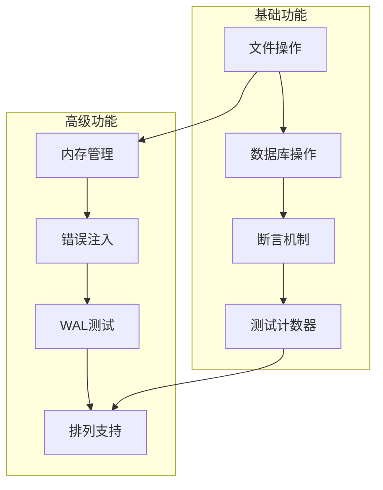
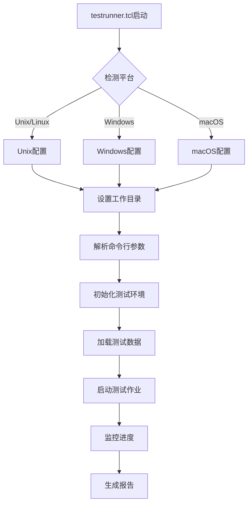
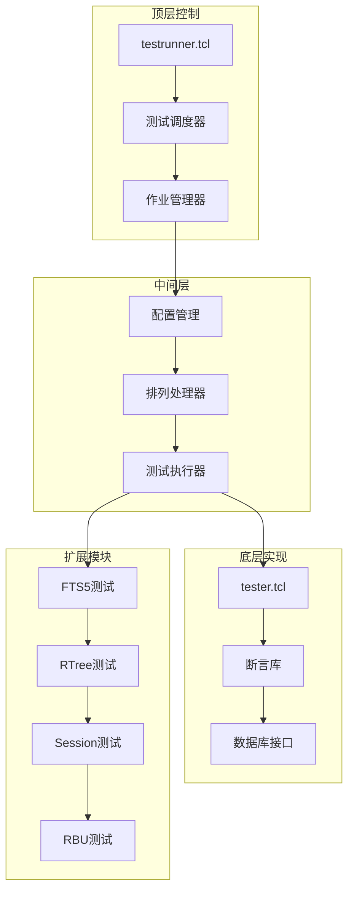
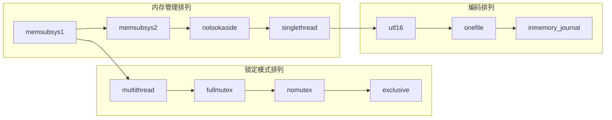
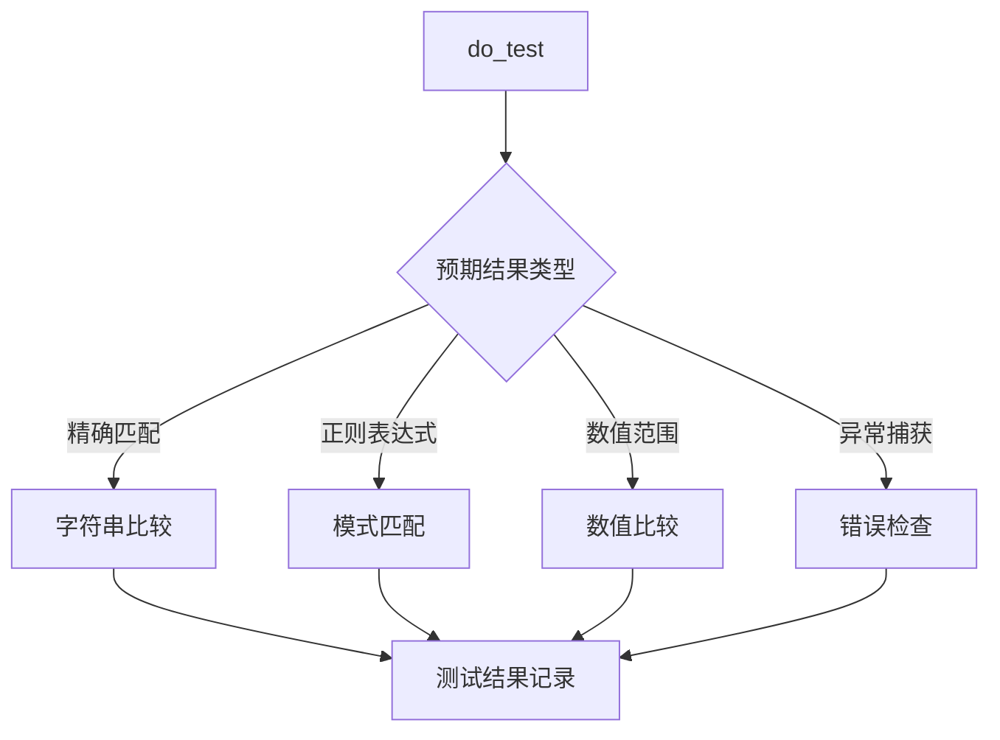
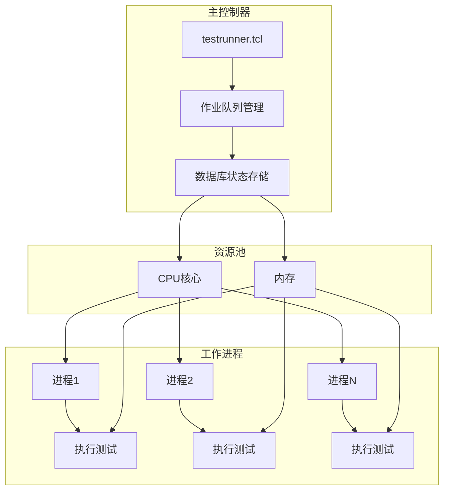
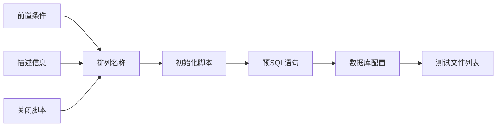
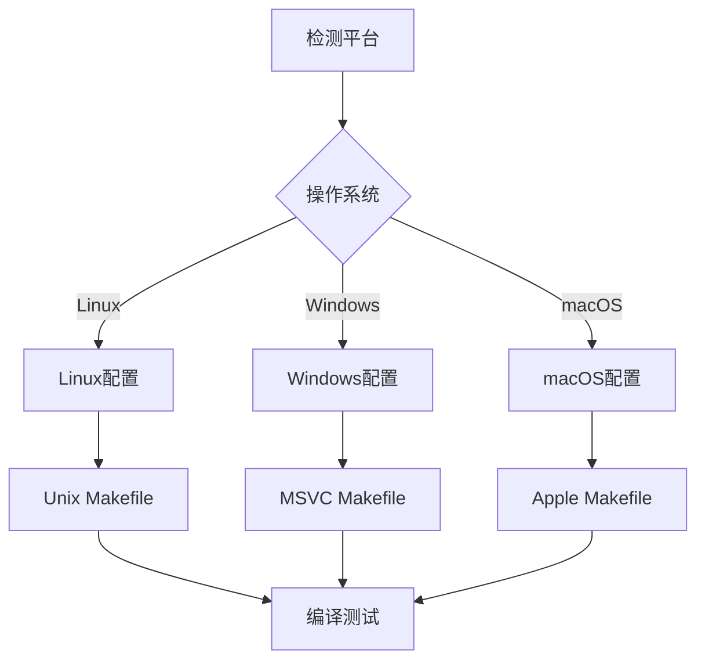
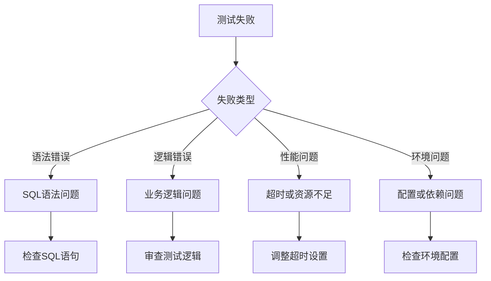
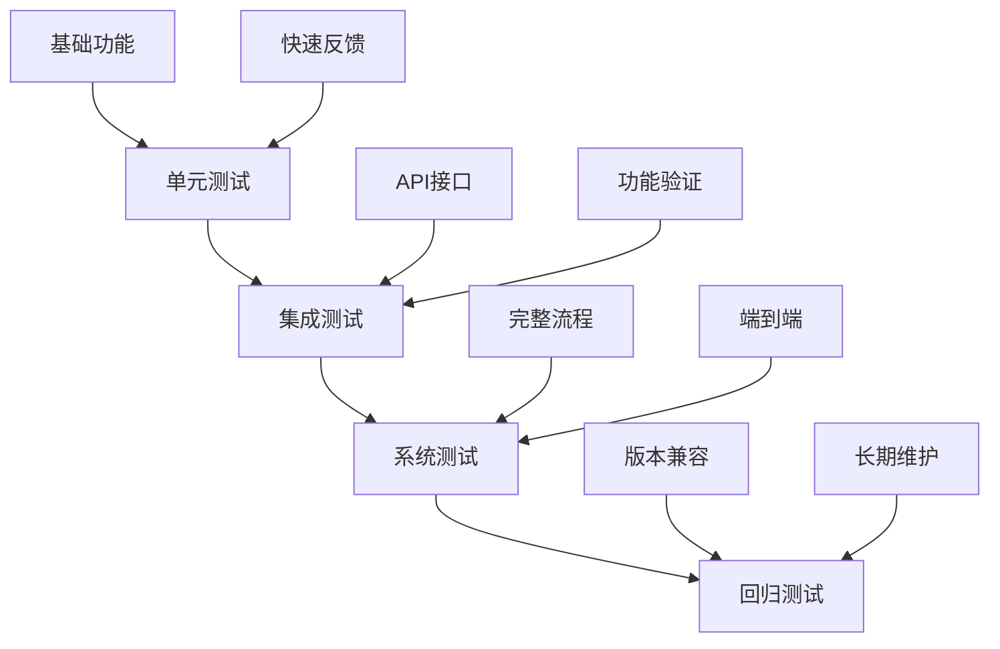

# SQLite测试框架详细文档

<cite>
**本文档引用的文件**
- [tester.tcl](file://test/tester.tcl)
- [testrunner.tcl](file://test/testrunner.tcl)
- [testrunner.md](file://doc/testrunner.md)
- [tcl-extension-testing.md](file://doc/tcl-extension-testing.md)
- [testrunner_data.tcl](file://test/testrunner_data.tcl)
- [testrunner_estwork.tcl](file://test/testrunner_estwork.tcl)
- [permutations.test](file://test/permutations.test)
- [main.test](file://test/main.test)
- [veryquick.test](file://test/veryquick.test)
- [full.test](file://test/full.test)
</cite>

## 目录
1. [概述](#概述)
2. [核心测试脚本](#核心测试脚本)
3. [测试套件架构](#测试套件架构)
4. [测试类型与分类](#测试类型与分类)
5. [断言与测试函数](#断言与测试函数)
6. [测试运行器](#测试运行器)
7. [测试配置与排列](#测试配置与排列)
8. [编写新测试用例](#编写新测试用例)
9. [调试与故障排除](#调试与故障排除)
10. [最佳实践](#最佳实践)

## 概述

SQLite测试框架是一个基于Tcl的强大测试系统，用于验证SQLite数据库引擎的正确性和稳定性。该框架包含多个层次的测试组件，从简单的单元测试到复杂的集成测试和回归测试。

### 主要特性

- **多层次测试架构**：支持单元测试、集成测试、回归测试和性能测试
- **并行执行**：通过testrunner.tcl实现多进程并行测试
- **灵活的配置**：支持多种编译选项和运行时配置的排列组合
- **完善的断言机制**：提供丰富的测试断言和验证工具
- **自动化报告**：生成详细的测试结果和统计信息

## 核心测试脚本

### tester.tcl - 基础测试框架

tester.tcl是SQLite测试框架的核心，提供了所有基础的测试功能和断言机制。

#### 主要功能模块



**图表来源**
- [tester.tcl](file://test/tester.tcl#L15-L57)

#### 核心命令

| 功能类别 | 命令 | 描述 |
|---------|------|------|
| 文件操作 | `copy_file`, `delete_file` | 高级文件复制和删除操作 |
| 数据库操作 | `execsql`, `catchsql` | SQL语句执行和捕获 |
| 断言机制 | `do_test`, `do_execsql_test` | 测试断言和验证 |
| 计数器管理 | `set_test_counter`, `fail_test` | 测试状态跟踪 |

**章节来源**
- [tester.tcl](file://test/tester.tcl#L15-L57)

### testrunner.tcl - 测试运行器

testrunner.tcl是测试框架的主要入口点，负责协调和管理整个测试过程。

#### 运行模式



**图表来源**
- [testrunner.tcl](file://test/testrunner.tcl#L100-L200)

**章节来源**
- [testrunner.tcl](file://test/testrunner.tcl#L1-L100)

## 测试套件架构

### 层次化组织结构

SQLite测试框架采用分层的组织结构，确保测试的系统性和可维护性。



**图表来源**
- [testrunner_data.tcl](file://test/testrunner_data.tcl#L1-L50)
- [permutations.test](file://test/permutations.test#L1-L50)

### 测试文件分类

| 测试类型 | 文件扩展名 | 描述 |
|---------|-----------|------|
| 核心测试 | *.test | 主要的SQLite功能测试 |
| 扩展测试 | *.test | 各个扩展模块的测试 |
| 性能测试 | *.speed | 性能基准测试 |
| 故障注入 | *_fault.test | 内存和I/O错误模拟测试 |
| 回归测试 | *_err.test | 错误处理测试 |

**章节来源**
- [testrunner_data.tcl](file://test/testrunner_data.tcl#L10-L100)

## 测试类型与分类

### 排列测试（Permutations）

排列测试是SQLite测试框架的核心创新，允许在不同的编译选项和运行时配置下重复执行相同的测试。

#### 主要排列类型



**图表来源**
- [permutations.test](file://test/permutations.test#L400-L600)

#### 排列定义示例

每个排列通过test_suite命令定义：

```tcl
test_suite "veryquick" -prefix "" -description {
  "Very" quick test suite. Runs in minutes on a workstation.
  This test suite is the same as the "quick" tests, except that some files
  that test malloc and IO errors are omitted.
} -files [
  test_set $allquicktests -exclude *malloc* *ioerr* *fault* *bigfile* *_err* \
      *fts5corrupt* *fts5big* *fts5aj* *rbucrash*
]
```

**章节来源**
- [permutations.test](file://test/permutations.test#L200-L250)

### 测试套件层次

| 套件名称 | 覆盖范围 | 执行时间 | 包含测试 |
|---------|---------|---------|---------|
| veryquick | 基础功能 | 几分钟 | 排除故障注入测试 |
| quick | 完整功能 | 10-15分钟 | 包含基本故障测试 |
| full | 全部功能 | 数小时 | 所有可用测试 |
| all | 扩展排列 | 数小时 | full + 排列组合 |

**章节来源**
- [permutations.test](file://test/permutations.test#L150-L200)

## 断言与测试函数

### 核心断言函数

SQLite测试框架提供了丰富的断言函数来验证测试结果。

#### 基本测试函数



**图表来源**
- [tester.tcl](file://test/tester.tcl#L800-L900)

#### 断言函数详解

| 函数名 | 用途 | 示例 |
|-------|------|------|
| `do_test` | 基本测试断言 | `do_test testname {command} {expected}` |
| `do_execsql_test` | SQL执行测试 | `do_execsql_test testname {SQL} {expected}` |
| `do_catchsql_test` | 异常SQL测试 | `do_catchsql_test testname {SQL} {expected}` |
| `do_ioerr_test` | I/O错误测试 | `do_ioerr_test testname args...` |

#### 高级断言功能

```tcl
# 正则表达式匹配
do_test main-1.6 {
  db complete {DROP TABLE 'xyz';}
} {1}

# 数值范围比较
do_test main-2.1 {
  execsql {SELECT count(*) FROM t1}
} {#/100..200/#}

# 反向匹配
do_test main-3.1 {
  execsql {SELECT * FROM t1 WHERE x LIKE '%abc%'}
} ~/pattern/
```

**章节来源**
- [tester.tcl](file://test/tester.tcl#L800-L1000)
- [main.test](file://test/main.test#L20-L50)

### 测试辅助函数

#### 数据库操作函数

| 函数 | 功能 | 参数 |
|------|------|------|
| `reset_db` | 重置测试数据库 | 无 |
| `drop_all_tables` | 删除所有表 | ?DB? |
| `drop_all_indexes` | 删除所有索引 | ?DB? |
| `integrity_check` | 完整性检查 | ?DB? |

#### 文件系统操作

| 函数 | 功能 | 特点 |
|------|------|------|
| `copy_file` | 文件复制 | 支持重试机制 |
| `delete_file` | 文件删除 | 支持强制删除 |
| `forcecopy` | 强制复制 | 忽略权限问题 |
| `forcedelete` | 强制删除 | 处理被占用文件 |

**章节来源**
- [tester.tcl](file://test/tester.tcl#L200-L400)

## 测试运行器

### testrunner.tcl功能概览

testrunner.tcl是SQLite测试框架的中央控制器，负责：

- **测试调度**：管理和调度大量并发测试作业
- **资源管理**：优化CPU和内存资源使用
- **进度监控**：实时显示测试进度和状态
- **结果收集**：汇总和报告测试结果

#### 并行执行架构



**图表来源**
- [testrunner.tcl](file://test/testrunner.tcl#L300-L500)

### 命令行接口

#### 基本用法

```bash
# 运行快速测试套件
./testfixture test/testrunner.tcl veryquick

# 运行完整测试套件
./testfixture test/testrunner.tcl full

# 运行特定排列
./testfixture test/testrunner.tcl autovacuum_ioerr

# 运行特定测试文件
./testfixture test/main.test
```

#### 高级选项

| 选项 | 功能 | 示例 |
|------|------|------|
| `--jobs N` | 设置并发进程数 | `--jobs 8` |
| `--dryrun` | 显示但不执行 | `--dryrun` |
| `--explain` | 解释测试计划 | `--explain` |
| `--status` | 实时状态监控 | `--status` |

**章节来源**
- [testrunner.md](file://doc/testrunner.md#L50-L150)

### 状态监控

#### 实时状态显示

testrunner.tcl提供多种方式监控测试进度：

```bash
# 实时监控
tclsh test/testrunner.tcl status

# 自动刷新监控
watch tclsh test/testrunner.tcl status

# 延迟刷新监控
tclsh test/testrunner.tcl status -d 2
```

#### 状态报告内容

- **总体进度**：已完成/总任务数
- **当前运行**：正在执行的测试列表
- **失败统计**：失败的测试数量和详情
- **预计时间**：剩余时间和完成时间估算

**章节来源**
- [testrunner.tcl](file://test/testrunner.tcl#L600-L800)

## 测试配置与排列

### 排列系统设计

排列系统是SQLite测试框架的核心创新，允许在不同配置下重复执行测试。

#### 排列定义格式



**图表来源**
- [permutations.test](file://test/permutations.test#L20-L60)

#### 常用排列配置

| 排列名称 | 编译选项 | 运行时配置 | 适用场景 |
|---------|---------|-----------|---------|
| `memsubsys1` | 页面缓存配置 | 4096字节×24页 | 内存受限环境 |
| `nolookaside` | 禁用预分配器 | 关闭lookaside | OOM测试 |
| `multithread` | 多线程模式 | SQLITE_CONFIG_MULTITHREAD | 并发测试 |
| `utf16` | UTF-16编码 | pragma encoding=UTF-16 | 字符编码测试 |

**章节来源**
- [permutations.test](file://test/permutations.test#L600-L800)

### 构建配置系统

#### 配置模板

testrunner_data.tcl定义了各种构建配置：

```tcl
set build(Default) {
  -O2
  --disable-amalgamation --disable-shared
  --enable-session
  -DSQLITE_ENABLE_RBU
  -DSQLITE_ENABLE_STMT_SCANSTATUS
}
```

#### 平台适配



**图表来源**
- [testrunner_data.tcl](file://test/testrunner_data.tcl#L200-L400)

**章节来源**
- [testrunner_data.tcl](file://test/testrunner_data.tcl#L100-L300)

## 编写新测试用例

### 测试文件结构

#### 基本模板

```tcl
# 测试文件头部
set testdir [file dirname $argv0]
source $testdir/tester.tcl

# 条件测试
ifcapable {complete} {
  # 测试内容
  do_test testname {
    # 测试逻辑
  } {expected_result}
}

# 结束测试
finish_test
```

#### 测试命名规范

- **格式**：`模块-编号.子编号`
- **示例**：`main-1.1`, `fts5-3.2.1`
- **规则**：保持唯一性和层次性

### 断言编写指南

#### 基本断言模式

```tcl
# 单步测试
do_test main-1.1 {
  db eval {SELECT count(*) FROM t1}
} {100}

# 多步测试
do_test main-1.2 {
  db eval {
    CREATE TABLE test(a, b);
    INSERT INTO test VALUES(1, 2);
    INSERT INTO test VALUES(3, 4);
    SELECT count(*) FROM test;
  }
} {2}

# 异常测试
do_catchsql_test main-1.3 {
  db eval {SELECT * FROM non_existent_table}
} {1} {SQLITE_ERROR}
```

#### 高级断言技巧

```tcl
# 正则表达式匹配
do_test main-2.1 {
  execsql {SELECT * FROM t1 WHERE x LIKE '%abc%'}
} {/abc.*/}

# 数值范围测试
do_test main-2.2 {
  execsql {SELECT count(*) FROM t1}
} {#/100..200/#}

# 条件测试
ifcapable {fts5} {
  do_test fts5-1.1 {
    # FTS5相关测试
  } {expected}
}
```

**章节来源**
- [main.test](file://test/main.test#L20-L100)
- [tester.tcl](file://test/tester.tcl#L800-L900)

### 扩展模块测试

#### FTS5测试示例

```tcl
# FTS5测试文件结构
set testdir [file dirname $argv0]
source $testdir/tester.tcl

# FTS5特定测试
do_test fts5-1.1 {
  execsql {
    CREATE VIRTUAL TABLE ft USING fts5(content);
    INSERT INTO ft VALUES('test document');
    SELECT * FROM ft WHERE ft MATCH 'test';
  }
} {test document}
```

#### 自定义排列测试

```tcl
# 定义自定义排列
test_suite "custom_permutation" -description {
  Custom test permutation for specific scenarios
} -files {
  test1.test test2.test test3.test
} -initialize {
  # 初始化逻辑
  set ::G(custom_setting) 1
} -shutdown {
  # 清理逻辑
  unset -nocomplain ::G(custom_setting)
}
```

**章节来源**
- [permutations.test](file://test/permutations.test#L800-L1000)

## 调试与故障排除

### 测试失败诊断

#### 常见失败类型



#### 调试工具和技巧

| 工具 | 用途 | 使用方法 |
|------|------|----------|
| `--verbose=1` | 详细输出 | `testrunner.tcl --verbose=1` |
| `--dryrun` | 显示计划 | `testrunner.tcl --dryrun` |
| `--explain` | 解释执行 | `testrunner.tcl --explain` |
| `status` | 实时监控 | `testrunner.tcl status` |

### 日志分析

#### 关键日志位置

- **testrunner.log**：测试运行日志
- **testrunner.db**：测试状态数据库
- **test-out.txt**：输出重定向文件

#### 日志分析命令

```bash
# 查找失败测试
grep "^!" testrunner.log

# 查看详细错误
grep -A 5 -B 5 "failed" testrunner.log

# 查询数据库状态
sqlite3 testrunner.db "SELECT * FROM jobs WHERE state='failed'"
```

**章节来源**
- [testrunner.md](file://doc/testrunner.md#L20-L50)

### 性能调优

#### 并行度优化

```bash
# 设置合适的并行度
export NJOB=4
./testfixture test/testrunner.tcl --jobs 4

# 动态调整并行度
./testfixture test/testrunner.tcl njob 8
```

#### 资源限制

```bash
# 设置内存限制
export SOFT_HEAP_LIMIT=1000000000

# 设置最大错误数
./testfixture test/testrunner.tcl --maxerror 10
```

**章节来源**
- [testrunner.tcl](file://test/testrunner.tcl#L200-L300)

## 最佳实践

### 测试设计原则

#### 单一职责原则

每个测试应该只验证一个特定的功能或行为：

```tcl
# 好的例子：单一功能测试
do_test auth-1.1 {
  db eval {CREATE TABLE test(id, value)}
  db eval {INSERT INTO test VALUES(1, 'test')}
  db eval {SELECT value FROM test WHERE id=1}
} {test}

# 避免：混合功能测试
do_test auth-1.2 {
  # 创建表、插入数据、查询、删除数据
  # 应该拆分为多个独立的测试
}
```

#### 可重复性原则

测试应该在任何环境下都能产生相同的结果：

```tcl
# 使用固定种子
do_test random-1.1 {
  db eval {PRAGMA random_seed=12345}
  db eval {SELECT random()}
} {12345}

# 清理测试环境
finish_test
reset_db
```

### 测试组织策略

#### 分层测试结构



#### 测试优先级

| 优先级 | 测试类型 | 执行频率 | 重要性 |
|-------|---------|---------|--------|
| 高 | veryquick | 每次提交 | 必须通过 |
| 中 | quick | 开发阶段 | 推荐通过 |
| 低 | full | 发布前 | 可选通过 |

### 维护和更新

#### 测试版本控制

```bash
# 创建测试分支
git checkout -b feature/test-improvements

# 运行相关测试
./testfixture test/testrunner.tcl veryquick

# 提交测试变更
git add test/*.test
git commit -m "Add new authentication tests"
```

#### 测试质量保证

```tcl
# 添加测试覆盖率检查
do_test coverage-1.1 {
  # 执行测试逻辑
  set result [perform_operation]
  
  # 验证覆盖率
  set coverage [get_coverage_percentage]
  expr {$coverage >= 90}
} {1}
```

**章节来源**
- [tester.tcl](file://test/tester.tcl#L1000-L1200)

### 贡献指南

#### 提交测试要求

1. **新功能测试**：为每个新功能添加相应的测试用例
2. **边界条件测试**：覆盖正常和异常输入情况
3. **性能测试**：对于性能敏感的功能添加基准测试
4. **回归测试**：修复bug后添加防止回归的测试

#### 代码审查要点

- 测试是否覆盖了所有主要路径
- 断言是否准确反映了预期行为
- 测试命名是否清晰易懂
- 是否有适当的错误处理

通过遵循这些最佳实践，开发者可以创建高质量、可维护的测试套件，确保SQLite数据库引擎的稳定性和可靠性。