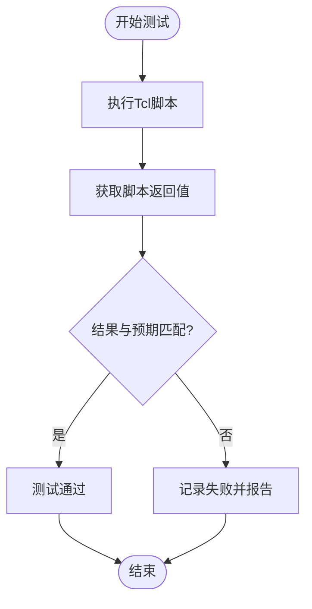
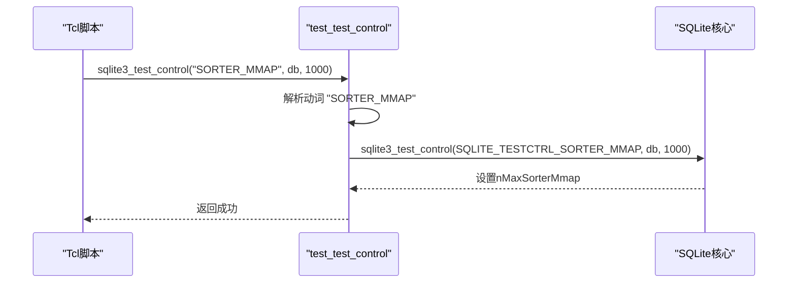

# 基础测试命令

<cite>
**本文档引用的文件**   
- [test/tester.tcl](file://test/tester.tcl)
- [src/test1.c](file://src/test1.c)
- [src/tclsqlite.c](file://src/tclsqlite.c)
</cite>

## 目录
1. [简介](#简介)
2. [核心测试命令](#核心测试命令)
3. [测试控制接口](#测试控制接口)
4. [测试结果断言与错误报告](#测试结果断言与错误报告)
5. [编写测试用例的最佳实践](#编写测试用例的最佳实践)
6. [结论](#结论)

## 简介
SQLite的测试框架基于Tcl脚本语言构建，提供了一套强大而灵活的工具来验证数据库引擎的正确性和稳定性。该框架的核心是`tester.tcl`文件，它定义了一系列用于创建和运行测试用例的Tcl过程。这些过程使得开发者能够轻松地定义测试场景、执行SQL语句并验证预期结果。本指南将深入解析`do_test`、`do_execsql_test`和`catchsql`等核心Tcl过程的实现机制，并通过`src/test1.c`中的`test_test_control`函数示例，展示测试控制接口的使用方法。

**Section sources**
- [test/tester.tcl](file://test/tester.tcl#L1-L50)

## 核心测试命令
SQLite的测试框架提供了多个核心命令来简化测试用例的编写。其中，`do_test`、`do_execsql_test`和`catchsql`是最常用的三个命令。

### do_test 命令
`do_test`是定义和运行单个测试用例的基础命令。它接受三个参数：测试名称、要执行的Tcl脚本以及预期的结果。该命令的实现位于`test/tester.tcl`文件中，其核心逻辑是通过`uplevel`命令在当前解释器上下文中执行提供的脚本，然后将实际结果与预期结果进行比较。如果两者不匹配，则记录测试失败。

**Diagram sources**
- [test/tester.tcl](file://test/tester.tcl#L702-L799)

### do_execsql_test 命令
`do_execsql_test`是一个专门用于测试SQL语句执行结果的便捷命令。它内部调用了`execsql`过程来执行SQL并获取结果，然后使用`do_test`来验证结果。该命令支持通过`-db`参数指定不同的数据库连接。其设计目的是简化SQL测试用例的编写，使开发者可以专注于SQL逻辑本身，而无需关心底层的执行和验证细节。

**Section sources**
- [test/tester.tcl](file://test/tester.tcl#L940-L955)

### catchsql 命令
`catchsql`命令用于执行SQL语句并捕获可能发生的错误。它的返回值是一个包含两个元素的列表：第一个元素是SQLite错误代码（如`SQLITE_OK`或`SQLITE_ERROR`），第二个元素是错误消息（如果有的话）。这个命令对于测试错误路径和异常处理逻辑至关重要。例如，可以使用`do_catchsql_test`来验证一个无效的SQL语句是否会产生预期的错误。

**Section sources**
- [test/tester.tcl](file://test/tester.tcl#L1459-L1470)

## 测试控制接口
SQLite提供了一个名为`sqlite3_test_control`的C API，用于在运行时控制和查询测试相关的内部状态。这个接口在`src/test1.c`文件中通过`test_test_control`函数暴露给Tcl解释器。`test_test_control`函数接受一个动词（VERB）和若干参数，根据不同的动词执行相应的操作。

### test_test_control 函数示例
`test_test_control`函数的实现使用了一个结构体数组`aVerb`来映射字符串动词到整数常量。例如，`SQLITE_TESTCTRL_SORTER_MMAP`动词允许设置排序器的最大内存映射大小。该函数通过`Tcl_GetIndexFromObjStruct`来解析动词参数，然后根据解析出的索引执行相应的分支逻辑。这种设计使得添加新的测试控制功能变得非常简单。

**Diagram sources**
- [src/test1.c](file://src/test1.c#L7965-L7997)
- [src/main.c](file://src/main.c#L4530-L4560)

## 测试结果断言与错误报告
测试框架的断言逻辑是其核心功能之一。当`do_test`命令发现实际结果与预期结果不匹配时，它会调用`fail_test`过程来记录失败。`fail_test`不仅会增加错误计数器，还会将失败的测试名称添加到`fail_list`中。如果错误数量超过了`maxerror`限制，测试框架会提前终止。

错误报告机制非常详细。当测试失败时，框架会输出类似`! $name expected: [$expected]`和`! $name got: [$result]`的信息，清晰地展示出预期值和实际值的差异。这种透明的报告方式极大地简化了调试过程。

**Section sources**
- [test/tester.tcl](file://test/tester.tcl#L750-L799)

## 编写测试用例的最佳实践
为了编写清晰、可读性强的测试用例，建议遵循以下最佳实践：

### 命名规范
测试名称应具有描述性，能够清晰地表达测试的目的。通常采用`模块名.功能名.场景`的格式，例如`select.basic.where_clause`。避免使用模糊或无意义的名称。

### 预期结果格式化
对于`do_execsql_test`，预期结果应以列表形式提供。如果SQL查询返回多行多列，结果列表应按行优先的顺序排列。例如，`SELECT 1, 2; SELECT 3, 4;`的预期结果应为`{1 2 3 4}`。

### 异常处理策略
使用`do_catchsql_test`来测试错误条件。预期结果应是一个包含错误代码和错误消息的列表。例如，`{1 {no such table: nonexistent}}`表示预期一个`SQLITE_ERROR`（代码1）和特定的错误消息。

## 结论
SQLite的测试框架通过`do_test`、`do_execsql_test`和`catchsql`等核心命令，为开发者提供了一个强大且易于使用的工具集。`test_test_control`等测试控制接口进一步增强了框架的灵活性，允许在运行时调整内部行为。通过遵循命名规范、正确格式化预期结果和采用适当的异常处理策略，可以编写出高质量、可维护的测试用例，从而确保SQLite数据库引擎的稳定性和可靠性。