# 完整性验证

<cite>
**本文档引用的文件**
- [btree.c](file://src/btree.c)
- [pragma.c](file://src/pragma.c)
- [btreeInt.h](file://src/btreeInt.h)
- [dbhash.c](file://tool/dbhash.c)
- [spaceanal.tcl](file://tool/spaceanal.tcl)
- [checkfreelist.c](file://ext/repair/checkfreelist.c)
- [checkindex.c](file://ext/repair/checkindex.c)
- [sqlite3_checker.tcl](file://ext/repair/sqlite3_checker.tcl)
- [fts3integrity.test](file://test/fts3integrity.test)
- [fts5integrity.test](file://ext/fts5/test/fts5integrity.test)
- [tester.tcl](file://test/tester.tcl)
</cite>

## 目录
1. [简介](#简介)
2. [核心完整性检查机制](#核心完整性检查机制)
3. [integrity_check命令详解](#integrity_check命令详解)
4. [dbcksum工具实现](#dbcksum工具实现)
5. [诊断工具集](#诊断工具集)
6. [测试脚本中的完整性检查](#测试脚本中的完整性检查)
7. [最佳实践与故障排除](#最佳实践与故障排除)
8. [总结](#总结)

## 简介

SQLite数据库完整性验证是确保数据库文件结构正确性和数据一致性的关键机制。本文档深入解析SQLite的完整性检查系统，包括内置的`integrity_check`和`dbcksum`命令，以及tool目录下的一系列诊断工具。这些工具共同构成了一个完整的数据库健康监控体系，帮助开发者及时发现和修复数据损坏问题。

## 核心完整性检查机制

### B-Tree结构验证架构

SQLite的完整性检查基于B-Tree数据结构的深度验证机制。核心验证流程通过`IntegrityCk`结构体管理整个检查过程的状态和上下文。

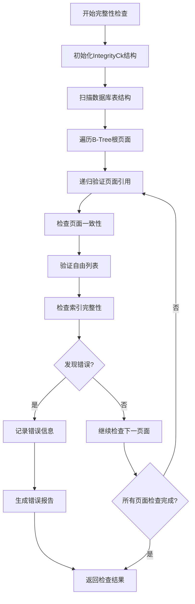

**图表来源**
- [btree.c](file://src/btree.c#L11103-L11167)
- [btreeInt.h](file://src/btreeInt.h#L688-L716)

### 页面引用跟踪机制

完整性检查器维护一个位图数组来跟踪每个页面的使用情况，防止重复使用和孤立页面的问题。

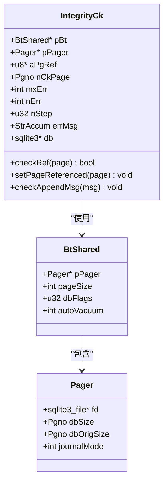

**图表来源**
- [btreeInt.h](file://src/btreeInt.h#L688-L716)
- [btree.c](file://src/btree.c#L11120-L11167)

**章节来源**
- [btree.c](file://src/btree.c#L11103-L11167)
- [btreeInt.h](file://src/btreeInt.h#L688-L716)

## integrity_check命令详解

### 命令语法与参数

`PRAGMA integrity_check`命令提供多种检查模式和配置选项：

| 参数类型 | 描述 | 默认值 | 示例 |
|---------|------|--------|------|
| 基础检查 | 完整的B-Tree验证 | 100个错误限制 | `PRAGMA integrity_check;` |
| 快速检查 | 减少的验证范围 | 100个错误限制 | `PRAGMA quick_check;` |
| 错误数量限制 | 自定义最大错误数 | 100 | `PRAGMA integrity_check(50);` |
| 表级检查 | 验证特定表 | 全库检查 | `PRAGMA main.integrity_check('users');` |

### 检查算法实现

完整性检查的核心算法分为以下几个阶段：

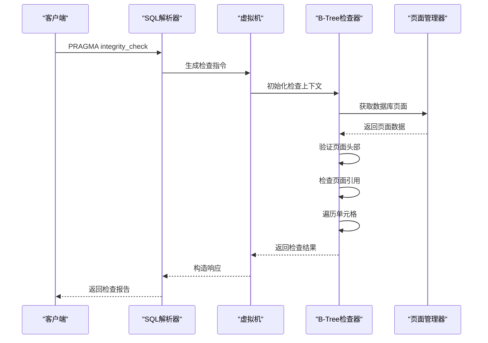

**图表来源**
- [pragma.c](file://src/pragma.c#L1698-L1741)
- [pragma.c](file://src/pragma.c#L1775-L1819)

### 自由列表验证机制

自由列表检查专门验证数据库的空闲页面链表是否正确：

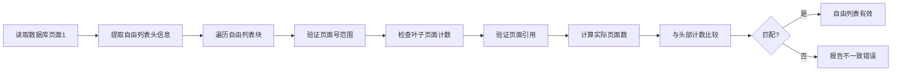

**图表来源**
- [btree.c](file://src/btree.c#L10676-L10714)

**章节来源**
- [pragma.c](file://src/pragma.c#L1665-L1819)
- [btree.c](file://src/btree.c#L10676-L11167)

## dbcksum工具实现

### 哈希计算原理

dbcksum工具通过SHA1哈希算法对数据库内容进行完整性校验，忽略元数据差异：

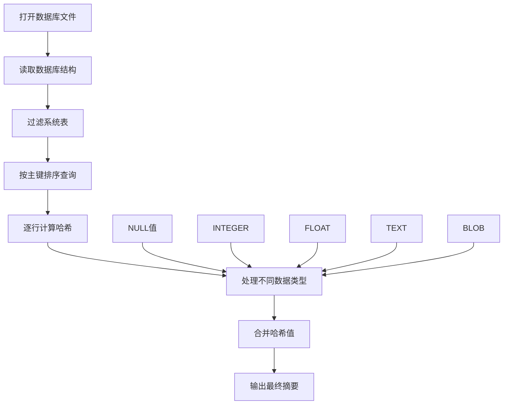

**图表来源**
- [dbhash.c](file://tool/dbhash.c#L362-L491)

### 数据类型处理策略

dbcksum对不同数据类型采用统一的序列化方法：

| 数据类型 | 序列化格式 | 前缀标识 | 处理方式 |
|---------|-----------|----------|----------|
| NULL | 字符串"0" | 0 | 直接哈希 |
| INTEGER | 8字节大端序 | 1 | 内存拷贝转换 |
| FLOAT | 8字节IEEE754 | 2 | 浮点数编码 |
| TEXT | UTF-8编码 | 3 | 字节数组 |
| BLOB | 原始二进制 | 4 | 原样处理 |

**章节来源**
- [dbhash.c](file://tool/dbhash.c#L362-L491)

## 诊断工具集

### checkfreelist扩展模块

checkfreelist是一个独立的SQLite扩展，专门用于验证自由列表的完整性：

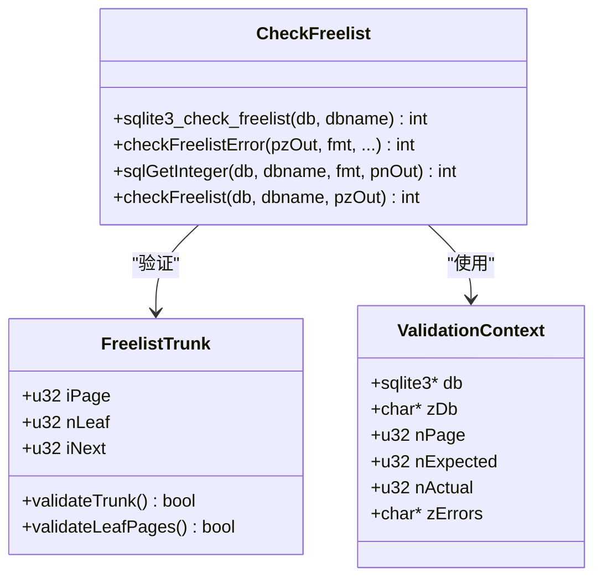

**图表来源**
- [checkfreelist.c](file://ext/repair/checkfreelist.c#L0-L310)

### checkindex虚拟表

checkindex提供增量索引验证功能，支持分批处理大型索引：

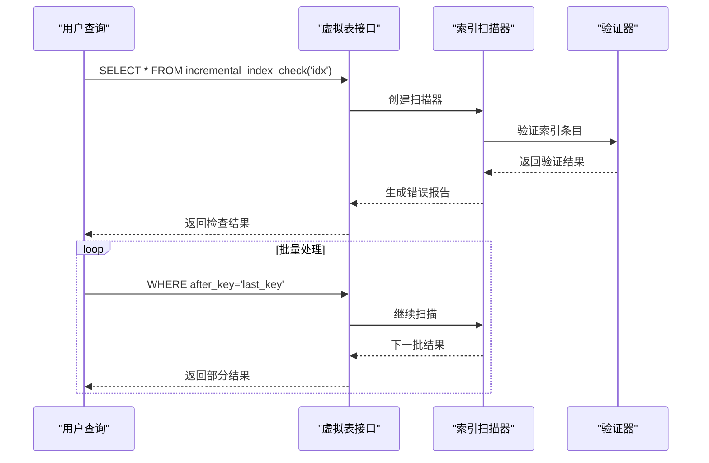

**图表来源**
- [checkindex.c](file://ext/repair/checkindex.c#L0-L799)

### spaceanal空间分析工具

spaceanal提供详细的数据库空间使用分析：

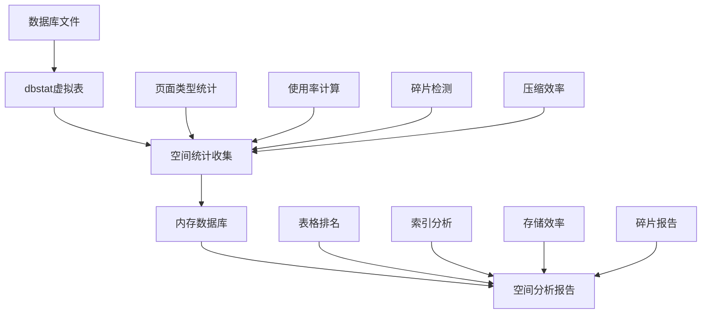

**图表来源**
- [spaceanal.tcl](file://tool/spaceanal.tcl#L214-L245)

**章节来源**
- [checkfreelist.c](file://ext/repair/checkfreelist.c#L0-L310)
- [checkindex.c](file://ext/repair/checkindex.c#L0-L799)
- [spaceanal.tcl](file://tool/spaceanal.tcl#L214-L245)

## 测试脚本中的完整性检查

### tester.tcl框架

SQLite测试框架提供了完整的完整性检查支持：

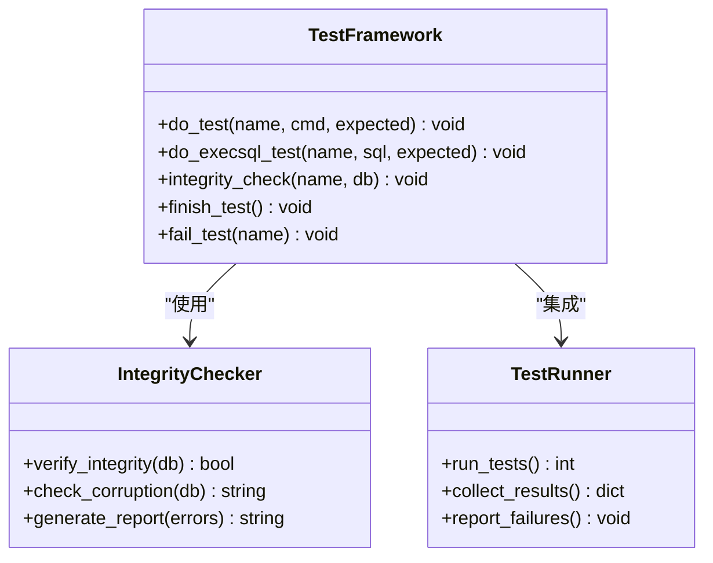

**图表来源**
- [tester.tcl](file://test/tester.tcl#L0-L199)

### FTS完整性测试示例

FTS（全文搜索）模块的完整性测试展示了复杂场景下的验证方法：

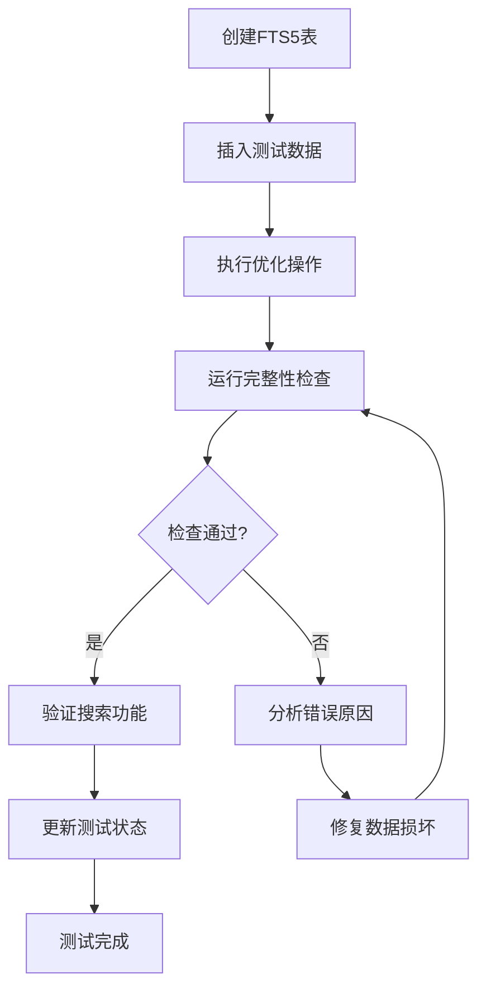

**图表来源**
- [fts5integrity.test](file://ext/fts5/test/fts5integrity.test#L0-L418)

### 自动化测试流程

完整的测试自动化流程包括多个层次的验证：

| 测试层级 | 验证内容 | 执行频率 | 失败处理 |
|---------|---------|----------|----------|
| 单元测试 | 基础功能 | 每次构建 | 立即停止 |
| 集成测试 | 模块交互 | 每日构建 | 标记失败 |
| 完整性测试 | 数据一致性 | 每周执行 | 报告汇总 |
| 性能测试 | 查询效率 | 每月执行 | 性能回归分析 |

**章节来源**
- [tester.tcl](file://test/tester.tcl#L0-L199)
- [fts3integrity.test](file://test/fts3integrity.test#L0-L42)
- [fts5integrity.test](file://ext/fts5/test/fts5integrity.test#L0-L418)

## 最佳实践与故障排除

### 完整性检查时机选择

根据不同的应用场景选择合适的检查时机：

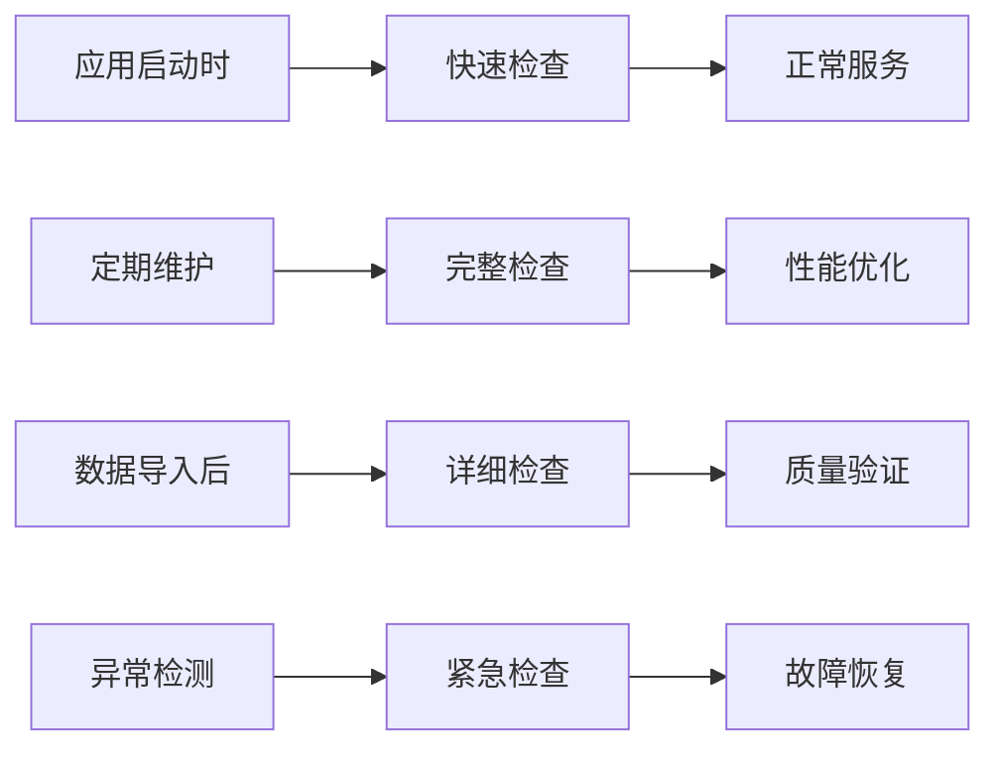

### 错误分类与处理策略

| 错误类型 | 可能原因 | 检查方法 | 修复建议 |
|---------|---------|----------|----------|
| 页面引用错误 | 自由列表损坏 | 检查自由列表一致性 | 重建自由列表 |
| 索引不一致 | 更新冲突 | 验证索引条目顺序 | 重建索引 |
| 页面格式错误 | 硬件故障 | 验证页面头部信息 | 从备份恢复 |
| 数据类型错误 | 编码问题 | 检查字符集设置 | 转换编码格式 |

### 故障排除工作流

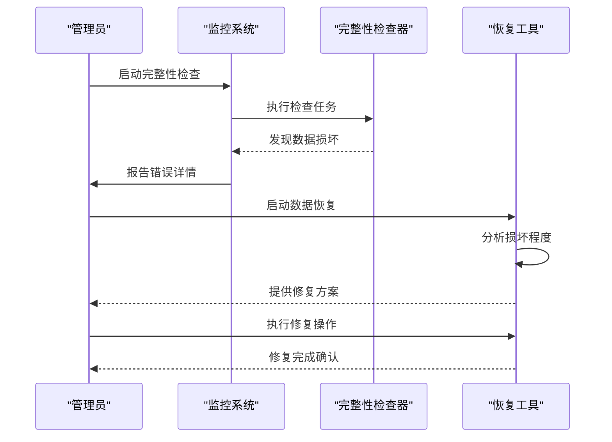

### 性能优化建议

为了提高完整性检查的效率，可以采用以下策略：

1. **分批处理**：对于大型数据库，使用批量检查避免长时间锁定
2. **并行验证**：利用多核处理器同时检查不同的表或索引
3. **缓存优化**：合理配置页面缓存大小以平衡内存使用和性能
4. **索引优先**：优先检查关键业务表的索引完整性

**章节来源**
- [sqlite3_checker.tcl](file://ext/repair/sqlite3_checker.tcl#L0-L264)
- [checkfreelist.c](file://ext/repair/checkfreelist.c#L0-L310)

## 总结

SQLite的完整性验证系统是一个多层次、全方位的数据保护机制。从基础的`integrity_check`命令到专业的诊断工具集，每个组件都发挥着不可或缺的作用。

通过本文档的深入分析，我们可以看到：

1. **多层次验证**：从页面级别的物理完整性到逻辑层面的数据一致性
2. **专业工具支持**：丰富的诊断工具满足不同场景的验证需求
3. **自动化集成**：完善的测试框架确保验证过程的可重复性和可靠性
4. **灵活配置选项**：适应各种性能和准确性要求的检查策略

掌握这些完整性验证技术，不仅能够确保SQLite数据库的稳定运行，还能为构建可靠的数据应用系统奠定坚实基础。随着数据重要性的不断提升，这些验证机制的价值将日益凸显。