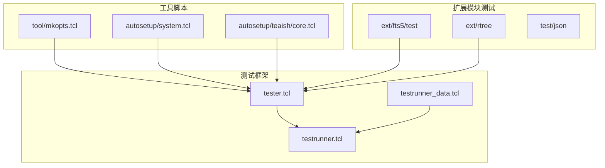
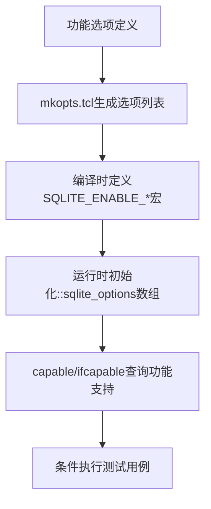
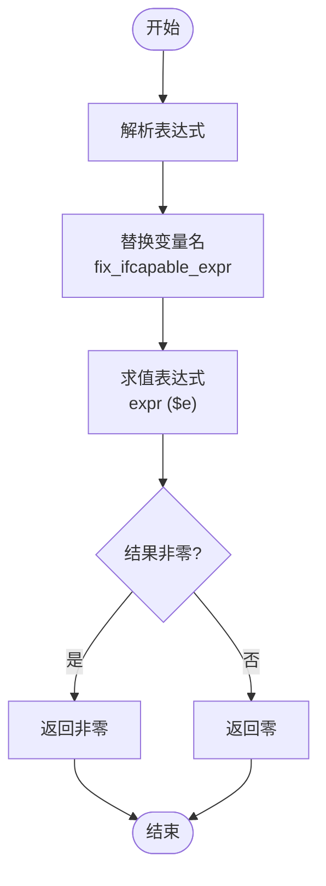
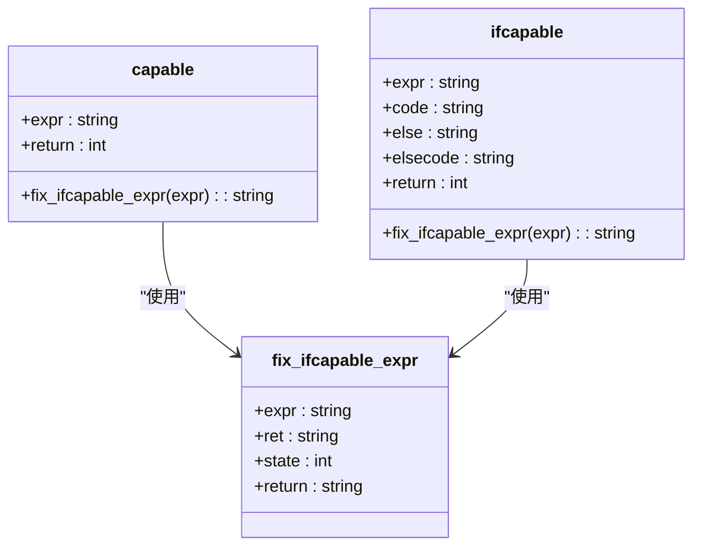
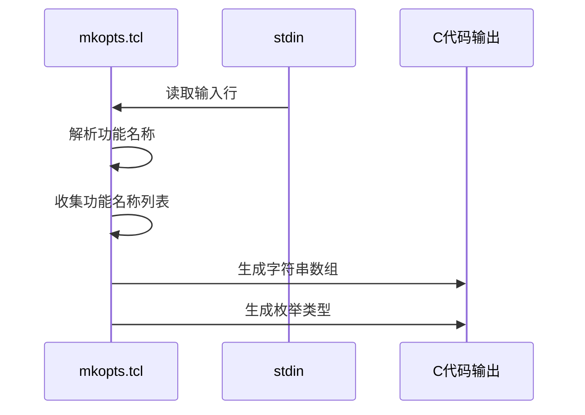
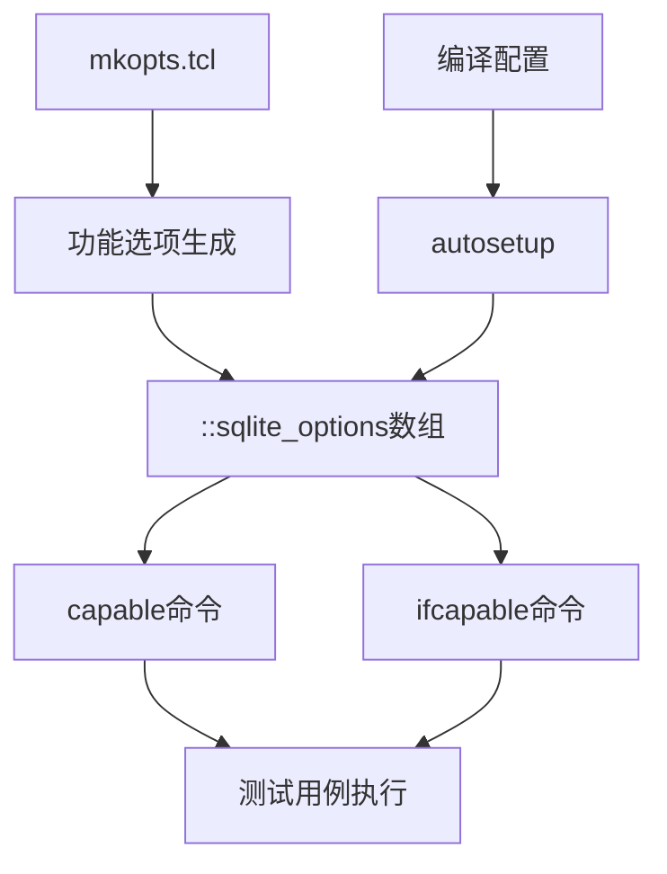

# 条件化测试

<cite>
**本文档中引用的文件**   
- [tester.tcl](file://test/tester.tcl)
- [mkopts.tcl](file://tool/mkopts.tcl)
- [fts5_common.tcl](file://ext/fts5/test/fts5_common.tcl)
- [rtree_perf.tcl](file://ext/rtree/rtree_perf.tcl)
- [boundary4.tcl](file://test/boundary4.tcl)
- [testrunner_data.tcl](file://test/testrunner_data.tcl)
- [system.tcl](file://autosetup/system.tcl)
- [core.tcl](file://autosetup/teaish/core.tcl)
</cite>

## 目录
1. [简介](#简介)
2. [项目结构](#项目结构)
3. [核心组件](#核心组件)
4. [架构概述](#架构概述)
5. [详细组件分析](#详细组件分析)
6. [依赖分析](#依赖分析)
7. [性能考虑](#性能考虑)
8. [故障排除指南](#故障排除指南)
9. [结论](#结论)
10. [附录](#附录)（如有必要）

## 简介
本文档全面介绍了SQLite中条件化测试的实现机制，重点分析了`capable`和`ifcapable`命令的实现原理。文档详细解释了这些命令如何根据当前构建的功能支持情况（如JSON、FTS5、RTREE等）动态启用或跳过测试用例。同时，文档还分析了`tool/mkopts.tcl`如何生成功能选项列表，并与测试框架集成。通过在`contrib`和`ext`目录下扩展模块中的实践示例，指导开发者如何正确声明功能依赖和编写可移植的测试代码。

## 项目结构
SQLite项目采用模块化设计，测试相关的文件主要分布在`test`、`ext`和`tool`目录中。`test`目录包含核心测试框架和测试用例，`ext`目录包含各种扩展模块的测试，而`tool`目录则包含生成测试配置和选项的工具脚本。



**图表来源**
- [tester.tcl](file://test/tester.tcl)
- [testrunner.tcl](file://test/testrunner.tcl)
- [testrunner_data.tcl](file://test/testrunner_data.tcl)
- [mkopts.tcl](file://tool/mkopts.tcl)
- [system.tcl](file://autosetup/system.tcl)
- [core.tcl](file://autosetup/teaish/core.tcl)

**章节来源**
- [tester.tcl](file://test/tester.tcl#L1-L50)
- [testrunner.tcl](file://test/testrunner.tcl#L1-L50)
- [testrunner_data.tcl](file://test/testrunner_data.tcl#L1-L50)

## 核心组件
条件化测试的核心组件包括`capable`和`ifcapable`两个Tcl过程，它们定义在`test/tester.tcl`文件中。这两个过程通过查询`::sqlite_options`数组来判断当前构建是否支持特定功能，从而决定是否执行相应的测试代码。

**章节来源**
- [tester.tcl](file://test/tester.tcl#L34-L35)
- [tester.tcl](file://test/tester.tcl#L1696-L1733)

## 架构概述
SQLite的条件化测试架构基于Tcl脚本实现，通过`tool/mkopts.tcl`生成功能选项列表，并在测试运行时通过`capable`和`ifcapable`命令进行条件判断。这种设计使得测试框架能够灵活适应不同的构建配置，确保测试的可移植性和可靠性。



**图表来源**
- [mkopts.tcl](file://tool/mkopts.tcl)
- [tester.tcl](file://test/tester.tcl)

## 详细组件分析

### capable和ifcapable命令分析
`capable`和`ifcapable`是SQLite测试框架中用于条件化测试的核心命令。它们通过解析表达式并查询`::sqlite_options`数组来判断当前构建是否支持特定功能。

#### 实现原理


**图表来源**
- [tester.tcl](file://test/tester.tcl#L1696-L1733)

#### 对象导向分析


**图表来源**
- [tester.tcl](file://test/tester.tcl#L1696-L1733)

### 扩展模块中的条件测试示例
在`contrib`和`ext`目录下的扩展模块中，条件化测试被广泛使用来确保测试代码的可移植性。

#### FTS5模块示例
```tcl
ifcapable !fts5 {
  proc return_if_no_fts5 {} {
    finish_test
    return -code return
  }
  return
} else {
  proc return_if_no_fts5 {} {}
}
```

**章节来源**
- [fts5_common.tcl](file://ext/fts5/test/fts5_common.tcl#L1-L20)

#### RTREE模块示例
```tcl
ifcapable !rtree {
  finish_test
  return
}
```

**章节来源**
- [rtree_perf.tcl](file://ext/rtree/rtree_perf.tcl#L4-L7)

#### ALTER TABLE功能测试示例
```tcl
ifcapable !altertable { finish_test; return }
```

**章节来源**
- [boundary4.tcl](file://test/boundary4.tcl#L22-L23)

### tool/mkopts.tcl分析
`tool/mkopts.tcl`脚本负责生成Tcl命令的子命令列表和枚举值，这些生成的代码被用于定义和管理功能选项。

#### 功能选项生成流程


**图表来源**
- [mkopts.tcl](file://tool/mkopts.tcl)

## 依赖分析
条件化测试系统依赖于多个组件的协同工作，包括功能检测、选项管理、测试执行等。



**图表来源**
- [mkopts.tcl](file://tool/mkopts.tcl)
- [tester.tcl](file://test/tester.tcl)
- [system.tcl](file://autosetup/system.tcl)

**章节来源**
- [mkopts.tcl](file://tool/mkopts.tcl#L1-L52)
- [tester.tcl](file://test/tester.tcl#L1696-L1733)
- [system.tcl](file://autosetup/system.tcl#L37-L138)

## 性能考虑
条件化测试对性能的影响主要体现在测试执行的条件判断上。由于`capable`和`ifcapable`命令的执行开销很小，主要是字符串操作和数组查找，因此对整体测试性能的影响可以忽略不计。更重要的是，通过条件化测试避免执行不支持功能的测试用例，实际上提高了测试效率，减少了不必要的测试执行。

## 故障排除指南
在使用条件化测试时，可能会遇到一些常见问题，以下是一些故障排除建议：

1. **功能检测失败**：确保编译时正确定义了相应的`SQLITE_ENABLE_*`宏。
2. **测试用例被意外跳过**：检查`::sqlite_options`数组中的功能标志是否正确设置。
3. **表达式解析错误**：确保`capable`和`ifcapable`的表达式语法正确，功能名称拼写无误。

**章节来源**
- [tester.tcl](file://test/tester.tcl#L1696-L1733)
- [testrunner_data.tcl](file://test/testrunner_data.tcl#L550-L576)

## 结论
SQLite的条件化测试机制通过`capable`和`ifcapable`命令实现了灵活的测试用例控制，使得测试框架能够适应不同的构建配置。`tool/mkopts.tcl`脚本在功能选项的生成和管理中扮演了重要角色，确保了功能检测的一致性和可维护性。通过在`contrib`和`ext`目录下的实践示例，开发者可以学习如何正确声明功能依赖和编写可移植的测试代码，从而提高测试的可靠性和效率。

## 附录
### 功能选项命名规范
- 功能名称转换为宏定义时，非字母数字字符替换为下划线
- 前缀`HAVE_`用于表示功能存在性
- 例如：`sys/stat.h` 转换为 `HAVE_SYS_STAT_H`

### 常用功能标志
- `fts5`: FTS5全文搜索支持
- `rtree`: R-Tree空间索引支持
- `json1`: JSON支持
- `altertable`: ALTER TABLE语句支持
- `windowfunc`: 窗口函数支持