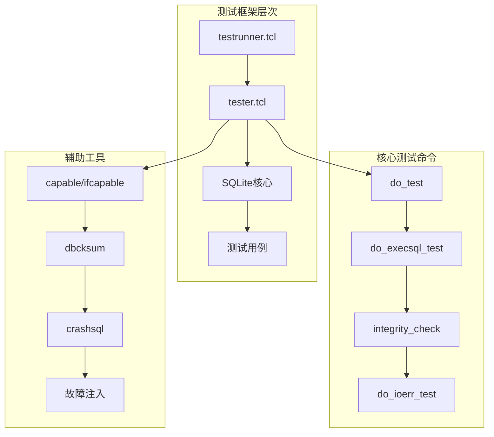
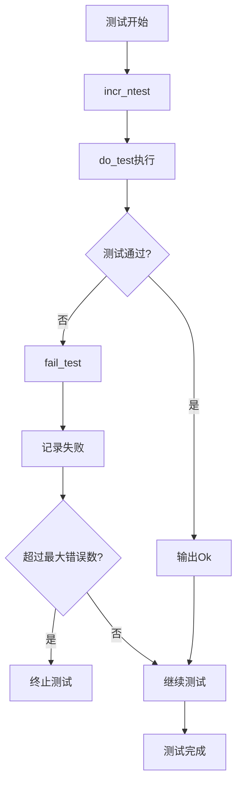
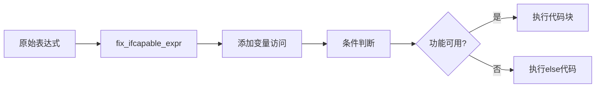
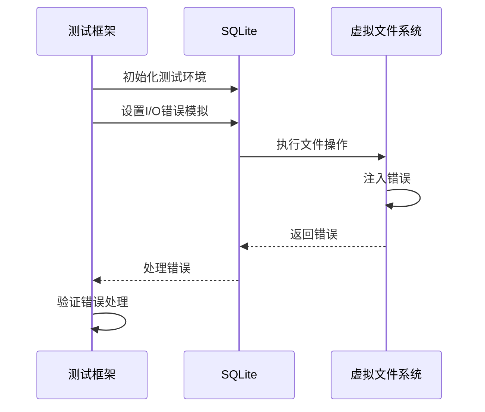
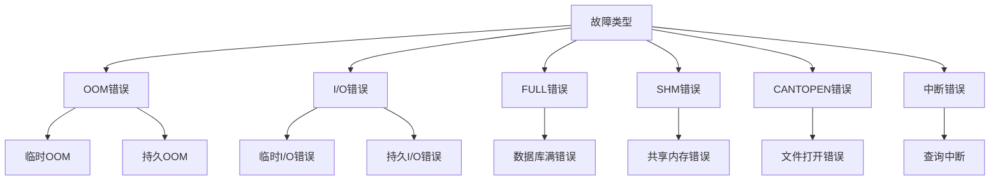
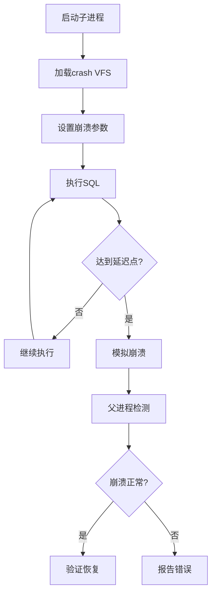

# SQLite测试脚本编写详细指南

<cite>
**本文档引用的文件**
- [tester.tcl](file://autosetup/teaish/tester.tcl)
- [tester.tcl](file://test/tester.tcl)
- [testrunner.tcl](file://test/testrunner.tcl)
- [testrunner.md](file://doc/testrunner.md)
- [tcl-extension-testing.md](file://doc/tcl-extension-testing.md)
- [malloc_common.tcl](file://test/malloc_common.tcl)
- [cksumvfs.c](file://ext/misc/cksumvfs.c)
- [testrunner_data.tcl](file://test/testrunner_data.tcl)
</cite>

## 目录
1. [概述](#概述)
2. [核心测试框架](#核心测试框架)
3. [基础测试命令](#基础测试命令)
4. [SQL执行与验证](#sql执行与验证)
5. [条件测试与功能检测](#条件测试与功能检测)
6. [数据库完整性校验](#数据库完整性校验)
7. [I/O错误模拟测试](#io错误模拟测试)
8. [崩溃恢复测试](#崩溃恢复测试)
9. [测试最佳实践](#测试最佳实践)
10. [故障排除指南](#故障排除指南)

## 概述

SQLite提供了完整的测试框架，用于确保数据库引擎的正确性和可靠性。该框架包含两个主要组件：`autosetup/teaish/tester.tcl`提供通用的Tcl测试工具，而`test/tester.tcl`提供专门针对SQLite的测试命令。

### 测试框架架构



**图表来源**
- [testrunner.tcl](file://test/testrunner.tcl#L1-L50)
- [tester.tcl](file://test/tester.tcl#L1-L100)

## 核心测试框架

### tester.tcl模块结构

SQLite测试框架的核心是`test/tester.tcl`文件，它提供了丰富的测试命令和工具函数。

#### 主要功能分类

| 功能类别 | 命令示例 | 描述 |
|---------|---------|------|
| 文件系统操作 | `copy_file`, `delete_file` | 高级文件操作，支持重试机制 |
| 数据库操作 | `execsql`, `catchsql` | SQL语句执行和异常捕获 |
| 测试控制 | `do_test`, `do_execsql_test` | 基础测试执行框架 |
| 完整性检查 | `integrity_check`, `dbcksum` | 数据库一致性验证 |
| 故障注入 | `do_ioerr_test`, `crashsql` | I/O错误和崩溃模拟 |

**章节来源**
- [tester.tcl](file://test/tester.tcl#L15-L57)

### 测试计数器系统

测试框架维护多个全局计数器来跟踪测试状态：



**图表来源**
- [tester.tcl](file://test/tester.tcl#L800-L850)

**章节来源**
- [tester.tcl](file://test/tester.tcl#L700-L750)

## 基础测试命令

### do_test命令

`do_test`是最基础的测试命令，用于执行任意Tcl代码并验证其结果。

#### 基本语法
```tcl
do_test TESTNAME SCRIPT EXPECTED_RESULT
```

#### 高级特性

1. **正则表达式匹配**：支持`/pattern/`格式的模式匹配
2. **数值范围比较**：使用`#/value-list/#`格式进行近似数值比较
3. **通配符匹配**：支持`*pattern*`格式的glob模式

#### 示例用法

```tcl
# 基本测试
do_test basic-1 {
    expr 1 + 1
} {2}

# 正则表达式匹配
do_test regex-1 {
    string length "hello world"
} {/^[0-9]+$/}

# 数值范围比较
do_test numeric-1 {
    expr sqrt(2)
} {#/1.414213562373095/}
```

**章节来源**
- [tester.tcl](file://test/tester.tcl#L750-L850)

### do_execsql_test命令

专门用于执行SQL语句并验证查询结果的测试命令。

#### 语法结构
```tcl
do_execsql_test TESTNAME SQL ?EXPECTED_RESULT?
```

#### 特殊选项

| 选项 | 描述 | 使用场景 |
|------|------|----------|
| `-db DB` | 指定数据库连接 | 多数据库测试 |
| 空结果 | 忽略结果验证 | 只验证执行成功 |

#### 实际应用示例

```tcl
# 创建表并插入数据
do_execsql_test create-1 {
    CREATE TABLE test(id INTEGER PRIMARY KEY, name TEXT);
    INSERT INTO test VALUES(1, 'Alice');
    INSERT INTO test VALUES(2, 'Bob');
} {}

# 查询验证
do_execsql_test query-1 {
    SELECT name FROM test WHERE id = 1
} {Alice}

# 多行结果验证
do_execsql_test multi-1 {
    SELECT id, name FROM test ORDER BY id
} {1 Alice 2 Bob}
```

**章节来源**
- [tester.tcl](file://test/tester.tcl#L900-L950)

### do_catchsql_test命令

用于测试SQL语句的异常处理，验证错误码和错误消息。

#### 语法格式
```tcl
do_catchsql_test TESTNAME SQL EXPECTED_RESULT
```

#### 结果格式

返回值是一个列表，格式为：
```
{error_code error_message}
```

#### 应用示例

```tcl
# 语法错误测试
do_catchsql_test syntax-1 {
    SELECT FROM test
} {1 {near "FROM": syntax error}}

# 约束违反测试
do_catchsql_test constraint-1 {
    CREATE UNIQUE INDEX idx_unique ON test(name);
    INSERT INTO test VALUES(3, 'Alice');
} {19 {UNIQUE constraint failed: test.name}}
```

**章节来源**
- [tester.tcl](file://test/tester.tcl#L950-L960)

## SQL执行与验证

### 执行SQL语句的多种方式

#### execsql命令
直接执行SQL语句，返回查询结果。

```tcl
proc execsql {sql {db db}} {
    uplevel [list $db eval $sql]
}
```

#### catchsql命令
捕获SQL执行过程中的异常。

```tcl
proc catchsql {sql {db db}} {
    set r [catch [list uplevel [list $db eval $sql]] msg]
    lappend r $msg
    return $r
}
```

#### 性能测试工具

##### speed_trial命令
测量SQL语句执行性能。

```tcl
proc speed_trial {name numstmt units sql} {
    output2 -nonewline [format {%-21.21s } $name...]
    set speed [time {sqlite3_exec_nr db $sql}]
    set tm [lindex $speed 0]
    set rate [format %20.5f [expr {1000000.0*$numstmt/$tm}]]
    output2 [format {%12d uS %s %s} $tm $rate $units/s]
}
```

**章节来源**
- [tester.tcl](file://test/tester.tcl#L1300-L1400)

### 内存数据库测试

#### memdbsql命令
在内存数据库中执行SQL语句，避免磁盘I/O影响。

```tcl
proc memdbsql {sql} {
    sqlite3 memdb :memory:
    set result [memdb eval $sql]
    memdb close
    return $result
}
```

#### 应用场景
- 快速测试复杂的SQL逻辑
- 避免磁盘空间限制
- 提高测试执行速度

**章节来源**
- [tester.tcl](file://test/tester.tcl#L1620-L1630)

## 条件测试与功能检测

### capable和ifcapable命令

这两个命令用于检测SQLite编译时的功能支持情况，实现条件化测试。

#### capable命令
```tcl
proc capable {expr} {
    set e [fix_ifcapable_expr $expr]; return [expr ($e)]
}
```

#### ifcapable命令
```tcl
proc ifcapable {expr code {else ""} {elsecode ""}} {
    set e2 [fix_ifcapable_expr $expr]
    if ($e2) {
        set c [catch {uplevel 1 $code} r]
    } else {
        set c [catch {uplevel 1 $elsecode} r]
    }
    return -code $c $r
}
```

#### 表达式转换机制



**图表来源**
- [tester.tcl](file://test/tester.tcl#L1696-L1733)

#### 使用示例

```tcl
# 基本功能检测
ifcapable fts5 {
    puts "FTS5功能可用"
} else {
    puts "FTS5功能不可用"
}

# 复杂条件组合
ifcapable "fts5 && json" {
    do_test fts5-json-1 {
        # FTS5和JSON功能都可用时的测试
    } {...}
}

# 嵌套条件
ifcapable "fts5" {
    ifcapable "json" {
        do_test fts5-json-2 {
            # 同时支持FTS5和JSON的测试
        } {...}
    }
}
```

**章节来源**
- [tester.tcl](file://test/tester.tcl#L1735-L1766)

## 数据库完整性校验

### integrity_check命令

执行SQLite的完整性检查，验证数据库结构的一致性。

#### 基本用法
```tcl
proc integrity_check {name {db db}} {
    ifcapable integrityck {
        do_test $name [list execsql {PRAGMA integrity_check} $db] {ok}
    }
}
```

#### 完整性检查类型

| 检查类型 | 描述 | 返回值 |
|---------|------|--------|
| `integrity_check` | 基本完整性检查 | `ok` 或 错误信息 |
| `quick_check` | 快速完整性检查 | `ok` 或 错误信息 |
| `foreign_key_check` | 外键约束检查 | 空或外键违规信息 |

#### 实际应用

```tcl
# 基本完整性检查
do_test integrity-basic-1 {
    CREATE TABLE t1(a INTEGER PRIMARY KEY, b TEXT);
    INSERT INTO t1 VALUES(1, 'test');
    PRAGMA integrity_check
} {ok}

# 外键完整性检查
do_test fk-integrity-1 {
    CREATE TABLE t2(x INTEGER PRIMARY KEY, y INTEGER REFERENCES t1);
    INSERT INTO t2 VALUES(1, 1);
    PRAGMA foreign_key_check
} {}
```

**章节来源**
- [tester.tcl](file://test/tester.tcl#L1650-L1660)

### 数据库校验和

#### dbcksum命令
生成特定数据库对象的校验和。

```tcl
proc dbcksum {db dbname} {
    if {$dbname=="temp"} {
        set master sqlite_temp_master
    } else {
        set master $dbname.sqlite_master
    }
    set alltab [$db eval "SELECT name FROM $master WHERE type='table'"]
    set txt [$db eval "SELECT * FROM $master"]\n
    foreach tab $alltab {
        append txt [$db eval "SELECT * FROM $dbname.$tab"]\n
    }
    return [md5 $txt]
}
```

#### allcksum命令
生成整个数据库的综合校验和。

```tcl
proc allcksum {{db db}} {
    set ret [list]
    set sql {
        SELECT name FROM sqlite_master WHERE type = 'table' UNION
        SELECT name FROM sqlite_temp_master WHERE type = 'table' UNION
        SELECT 'sqlite_master' UNION
        SELECT 'sqlite_temp_master' ORDER BY 1
    }
    set tbllist [$db eval $sql]
    set txt {}
    foreach tbl $tbllist {
        append txt [$db eval "SELECT * FROM $tbl"]
    }
    foreach prag {default_cache_size} {
        append txt $prag-[$db eval "PRAGMA $prag"]\n
    }
    return [md5 $txt]
}
```

#### 校验和应用场景

1. **回归测试**：确保修改不改变数据库内容
2. **备份验证**：验证备份文件的完整性
3. **性能对比**：比较不同配置下的数据库状态

**章节来源**
- [tester.tcl](file://test/tester.tcl#L2114-L2194)

## I/O错误模拟测试

### do_ioerr_test命令

专门用于测试SQLite对I/O错误的处理能力。

#### 命令语法
```tcl
do_ioerr_test TESTNAME ?OPTIONS...?
```

#### 支持的选项

| 选项 | 类型 | 描述 |
|------|------|------|
| `-tclprep` | 字符串 | 准备阶段的Tcl脚本 |
| `-sqlprep` | 字符串 | 准备阶段的SQL脚本 |
| `-tclbody` | 字符串 | 包含I/O错误的Tcl脚本 |
| `-sqlbody` | 字符串 | 包含I/O错误的SQL脚本 |
| `-persist` | 布尔值 | 是否使用持久性错误 |
| `-start` | 整数 | 开始测试的错误编号 |
| `-exclude` | 列表 | 排除的错误编号 |

#### 错误模拟流程



**图表来源**
- [tester.tcl](file://test/tester.tcl#L1913-L1944)

#### 实际使用示例

```tcl
# 基本I/O错误测试
do_ioerr_test ioerr-basic-1 {
    -sqlprep {
        CREATE TABLE test(id INTEGER PRIMARY KEY, data TEXT);
        INSERT INTO test VALUES(1, 'test data');
    }
    -sqlbody {
        UPDATE test SET data = 'modified data' WHERE id = 1;
    }
    -persist 1
}

# 多种错误类型的测试
do_ioerr_test ioerr-types-1 {
    -faults {ioerr-transient ioerr-persistent}
    -body {
        # 在不同错误类型下执行测试
        INSERT INTO test VALUES(2, 'more data');
    }
}
```

**章节来源**
- [tester.tcl](file://test/tester.tcl#L1913-L1993)

### 故障注入机制

#### 内置故障类型



**图表来源**
- [malloc_common.tcl](file://test/malloc_common.tcl#L30-L80)

#### 故障模拟配置

```tcl
# OOM错误配置
set FAULTSIM(oom-transient) [list \
  -injectstart   {oom_injectstart 0} \
  -injectstop    oom_injectstop \
  -injecterrlist {{1 {out of memory}}} \
]

# I/O错误配置
set FAULTSIM(ioerr-transient) [list \
  -injectstart   {ioerr_injectstart 0} \
  -injectstop    ioerr_injectstop \
  -injecterrlist {{1 {disk I/O error}}} \
]
```

**章节来源**
- [malloc_common.tcl](file://test/malloc_common.tcl#L30-L100)

## 崩溃恢复测试

### crashsql命令

模拟数据库进程崩溃，测试SQLite的崩溃恢复能力。

#### 命令语法
```tcl
crashsql ?OPTIONS? SQL
```

#### 支持的选项

| 选项 | 类型 | 描述 |
|------|------|------|
| `-delay` | 整数 | 崩溃前等待的同步次数 |
| `-file` | 字符串 | 模拟崩溃的文件名 |
| `-blocksize` | 整数 | 块大小设置 |
| `-seed` | 整数 | 随机种子 |
| `-tclbody` | 字符串 | 崩溃前执行的Tcl代码 |

#### 崩溃模拟机制



**图表来源**
- [tester.tcl](file://test/tester.tcl#L1735-L1800)

#### 实际应用示例

```tcl
# 基本崩溃测试
do_test crash-basic-1 {
    CREATE TABLE crash_test(id INTEGER PRIMARY KEY, data TEXT);
    INSERT INTO crash_test VALUES(1, 'before crash');
} {}

# 模拟崩溃后恢复
do_test crash-recovery-1 {
    crashsql -delay 1 -file test.db-journal {
        INSERT INTO crash_test VALUES(2, 'after crash');
    }
} {1 {child process exited abnormally}}

# 验证崩溃后的数据库状态
do_execsql_test crash-verify-1 {
    SELECT COUNT(*) FROM crash_test
} {1}
```

**章节来源**
- [tester.tcl](file://test/tester.tcl#L1735-L1900)

### 崩溃写入测试

#### crash_on_write命令
模拟在写入过程中崩溃的情况。

```tcl
proc crash_on_write {args} {
    set nArg [llength $args]
    if {$nArg<2 || $nArg%2} {
        error "bad args: $args"
    }
    set zSql [lindex $args end]
    set nDelay [lindex $args end-1]
    
    # 设置崩溃参数并执行SQL
    set f [open crash.tcl w]
    puts $f "sqlite3_crash_on_write $nDelay"
    puts $f "sqlite3_test_control_pending_byte $::sqlite_pending_byte"
    puts $f "sqlite3 db test.db -vfs writecrash"
    puts $f "db eval {$zSql}"
    close $f
    
    # 执行并捕获结果
    set r [catch {exec [info nameofexec] crash.tcl >@stdout} msg]
    return [list $r $msg]
}
```

**章节来源**
- [tester.tcl](file://test/tester.tcl#L1850-L1900)

## 测试最佳实践

### 测试设计原则

#### 1. 清晰的测试命名
```tcl
# 推荐：描述性命名
do_test "fts5-query-syntax-1" {
    # 测试FTS5查询语法
} {...}

# 不推荐：模糊命名
do_test "test1" {
    # 测试内容不明确
} {...}
```

#### 2. 完整的前置准备
```tcl
# 推荐：完整的测试准备
do_test "setup-complete-1" {
    # 清理旧数据
    catch {db eval "DROP TABLE IF EXISTS test_table"}
    
    # 创建测试表
    db eval {
        CREATE TABLE test_table(
            id INTEGER PRIMARY KEY,
            name TEXT,
            value REAL
        )
    }
    
    # 插入测试数据
    db eval {
        INSERT INTO test_table VALUES(1, 'test1', 1.0)
    }
    
    # 验证初始状态
    db eval "SELECT COUNT(*) FROM test_table"
} {1}
```

#### 3. 全面的结果验证
```tcl
# 推荐：多维度验证
do_execsql_test "validation-1" {
    INSERT INTO test_table VALUES(2, 'test2', 2.0)
} {}

# 验证插入结果
do_test "insert-verify-1" {
    db eval "SELECT name, value FROM test_table WHERE id = 2"
} {test2 2.0}

# 验证索引状态
do_test "index-verify-1" {
    db eval {
        EXPLAIN QUERY PLAN 
        SELECT * FROM test_table WHERE name = 'test2'
    }
} {/*SEARCH TABLE test_table USING INDEX*}
```

### 错误处理策略

#### 1. 异常捕获和验证
```tcl
# 推荐：明确的错误预期
do_catchsql_test "error-handling-1" {
    INSERT INTO test_table VALUES(NULL, 'test', 1.0)
} {19 {NOT NULL constraint failed: test_table.id}}

# 推荐：使用正则表达式匹配
do_catchsql_test "error-pattern-1" {
    SELECT * FROM non_existent_table
} {1 {no such table: non_existent_table}}
```

#### 2. 条件化测试
```tcl
# 推荐：根据功能可用性选择测试
ifcapable fts5 {
    do_test "fts5-available-1" {
        # FTS5功能可用时的测试
    } {...}
} else {
    omit_test "fts5-not-available-1" "FTS5 not compiled"
}
```

### 性能测试实践

#### 1. 基准测试
```tcl
# 推荐：标准化的性能测试
do_test "performance-baseline-1" {
    speed_trial "simple-select" 1000 "ops" {
        SELECT * FROM test_table WHERE id <= 1000
    }
} {...}
```

#### 2. 内存使用监控
```tcl
# 推荐：内存泄漏检测
do_test "memory-leak-1" {
    # 执行可能产生内存分配的操作
    db eval {
        CREATE INDEX idx_name ON test_table(name)
    }
    
    # 检查内存使用
    sqlite3_memory_used
} {/^[0-9]+$/}
```

### 测试组织结构

#### 1. 分层测试设计
```tcl
# 单元测试层
do_test "unit-basic-operations-1" {
    # 基本操作测试
} {...}

# 集成测试层
do_test "integration-database-1" {
    # 多表关联测试
} {...}

# 系统测试层
do_test "system-performance-1" {
    # 大量数据处理测试
} {...}
```

#### 2. 测试数据管理
```tcl
# 推荐：测试数据隔离
proc setup_test_data {} {
    db eval {
        CREATE TABLE test_data_$::test_id (
            id INTEGER PRIMARY KEY,
            data TEXT
        )
    }
    
    for {set i 1} {$i <= 100} {incr i} {
        db eval "INSERT INTO test_data_$::test_id VALUES($i, 'data$i')"
    }
}

# 在每个测试前调用
do_test "data-isolation-1" {
    setup_test_data
    # 测试逻辑
} {...}
```

## 故障排除指南

### 常见问题诊断

#### 1. 测试超时问题

**症状**：测试长时间无响应
**原因**：死锁、无限循环、阻塞操作
**解决方案**：
```tcl
# 添加超时保护
set timeout 30
if {[catch {timeout $timeout {your_test_code}} result]} {
    error "测试超时: $result"
}
```

#### 2. 内存泄漏检测

**症状**：测试执行时间逐渐增加
**诊断方法**：
```tcl
# 在测试前后检查内存使用
proc check_memory_leak {test_name} {
    set before [sqlite3_memory_used]
    uplevel 1 $test_name
    set after [sqlite3_memory_used]
    if {$after > $before} {
        error "内存泄漏: $test_name - 增加了 $after bytes"
    }
}
```

#### 3. 并发测试问题

**症状**：间歇性测试失败
**解决方案**：
```tcl
# 使用互斥锁避免竞争条件
proc synchronized_test {test_name code} {
    global test_mutex
    if {![info exists test_mutex]} {
        set test_mutex [dict create]
    }
    
    dict set test_mutex $test_name 1
    uplevel 1 $code
    dict unset test_mutex $test_name
}
```

### 调试技巧

#### 1. 详细日志记录
```tcl
# 启用详细输出
proc debug_test {test_name code} {
    puts "开始测试: $test_name"
    set result [uplevel 1 $code]
    puts "测试完成: $test_name - 结果: $result"
    return $result
}
```

#### 2. 中断点调试
```tcl
# 在关键位置添加调试点
proc debug_point {message} {
    if {[info exists ::debug_mode]} {
        puts "调试点: $message"
        # 可以在这里添加交互式调试
    }
}
```

#### 3. 状态快照
```tcl
# 在测试失败时保存状态
proc save_test_state {test_name} {
    set snapshot [dict create \
        time [clock seconds] \
        memory [sqlite3_memory_used] \
        file_size [file size test.db] \
        tables [db eval {SELECT name FROM sqlite_master WHERE type='table'}] \
    ]
    set snapshot_file "test_state_${test_name}.tcl"
    set fd [open $snapshot_file w]
    puts $fd [array2tcl $snapshot]
    close $fd
}
```

### 性能优化建议

#### 1. 测试并行化
```tcl
# 使用多个进程并行执行测试
proc parallel_test_execution {test_list} {
    set jobs {}
    foreach test $test_list {
        lappend jobs [exec tclsh test_script.tcl $test &]
    }
    
    foreach job $jobs {
        wait $job
    }
}
```

#### 2. 缓存优化
```tcl
# 缓存重复的数据库操作
proc cached_query {sql} {
    global query_cache
    if {[info exists query_cache($sql)]} {
        return $query_cache($sql)
    }
    
    set result [db eval $sql]
    set query_cache($sql) $result
    return $result
}
```

#### 3. 资源管理
```tcl
# 自动资源清理
proc with_resource {resource cleanup_code} {
    uplevel 1 $resource
    try {
        uplevel 1 $cleanup_code
    } finally {
        uplevel 1 $cleanup_code
    }
}
```

通过遵循这些最佳实践和故障排除指南，开发者可以编写出更加可靠、可维护和高效的SQLite测试脚本，确保数据库引擎的质量和稳定性。