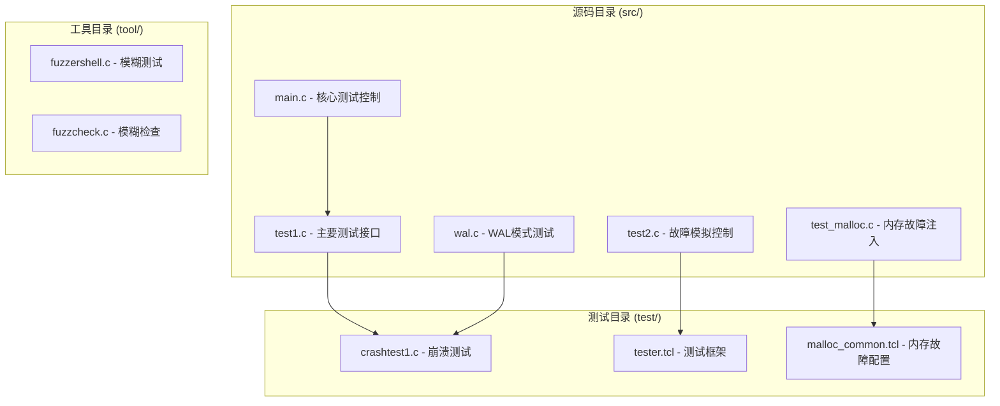
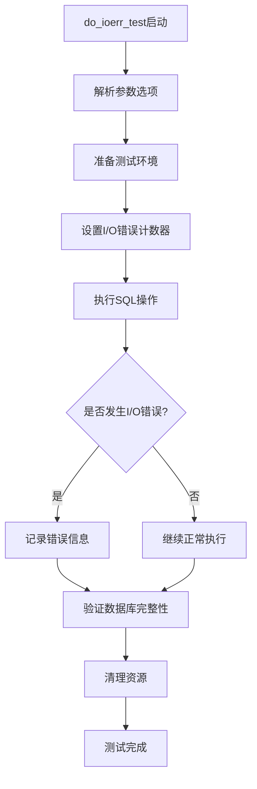
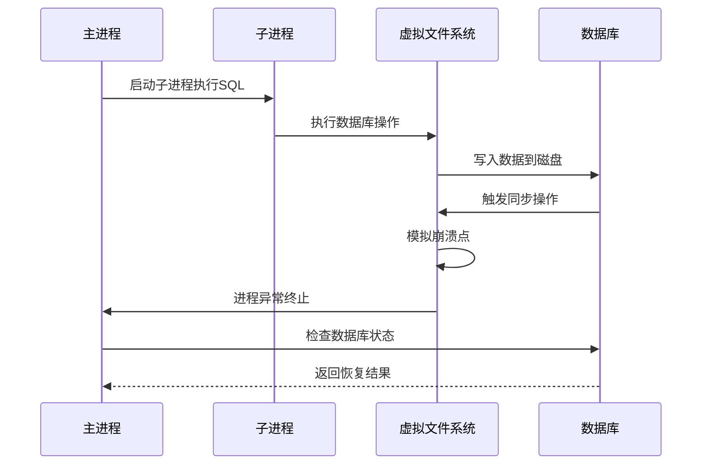
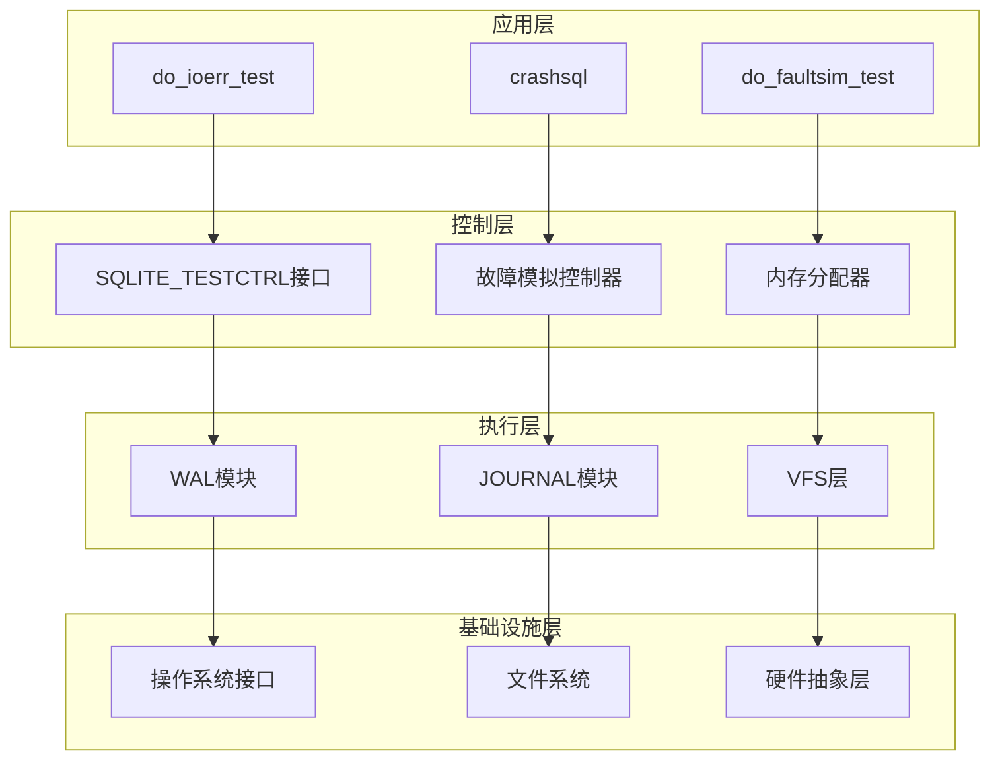
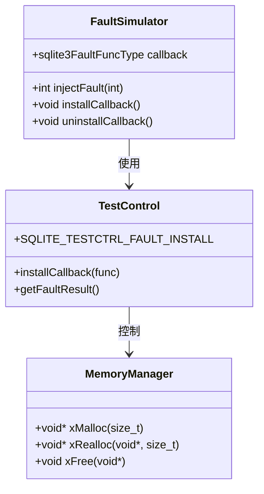
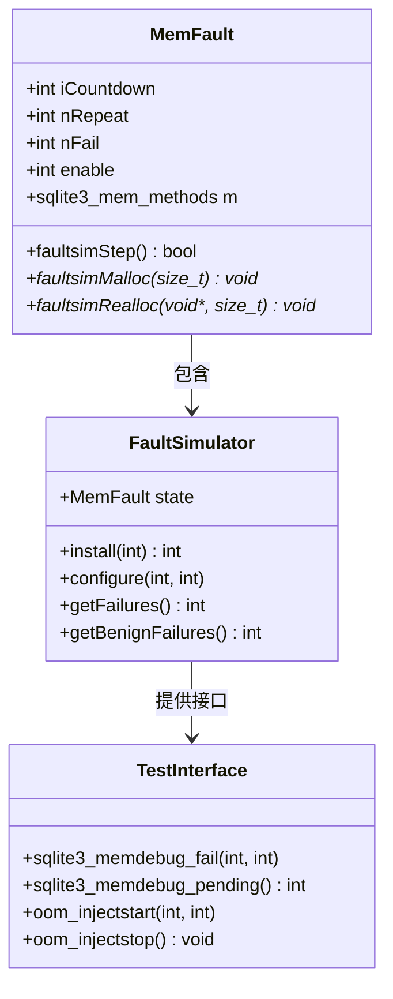
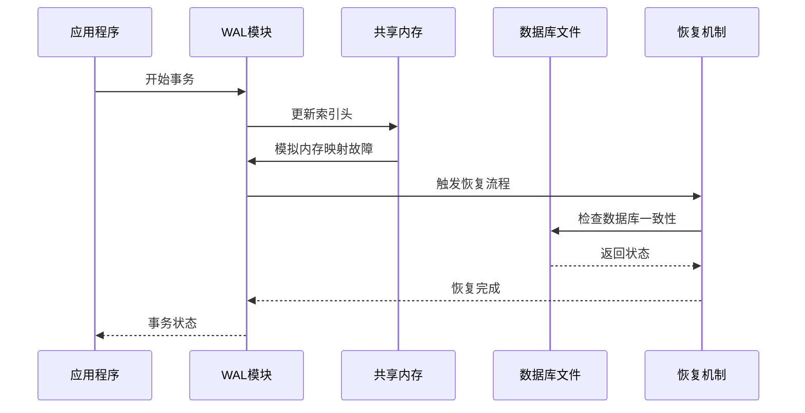
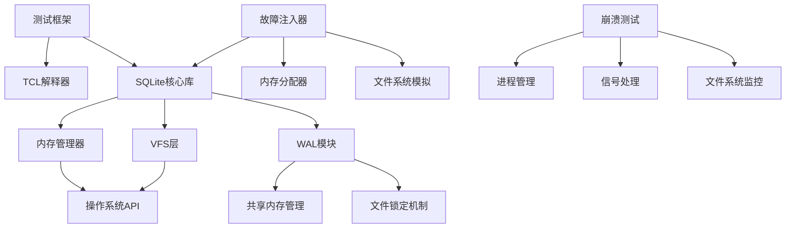

# 错误注入测试深度指南

<cite>
**本文档中引用的文件**
- [src/test1.c](file://src/test1.c)
- [src/test2.c](file://src/test2.c)
- [src/test_malloc.c](file://src/test_malloc.c)
- [src/wal.c](file://src/wal.c)
- [src/main.c](file://src/main.c)
- [test/crashtest1.c](file://test/crashtest1.c)
- [test/tester.tcl](file://test/tester.tcl)
- [test/malloc_common.tcl](file://test/malloc_common.tcl)
- [test/fuzzcheck.c](file://test/fuzzcheck.c)
- [src/test6.c](file://src/test6.c)
</cite>

## 目录
1. [简介](#简介)
2. [项目结构概览](#项目结构概览)
3. [核心组件分析](#核心组件分析)
4. [架构概览](#架构概览)
5. [详细组件分析](#详细组件分析)
6. [依赖关系分析](#依赖关系分析)
7. [性能考虑](#性能考虑)
8. [故障排除指南](#故障排除指南)
9. [结论](#结论)

## 简介

SQLite的错误注入测试系统是一个精密设计的框架，用于模拟各种硬件和软件故障条件，确保数据库在极端情况下仍能保持ACID特性。该系统通过do_ioerr_test和crashsql等命令提供了强大的故障模拟能力，支持内存分配失败、I/O错误、磁盘满、文件锁定等多种异常场景的测试。

本文档深入探讨了SQLite错误注入测试的内部工作机制，重点分析了do_ioerr_test和crashsql命令的工作原理，详细说明了SQLITE_TESTCTRL系列测试控制指令的使用方法，并提供了编写崩溃恢复测试的完整流程。

## 项目结构概览

SQLite的错误注入测试系统分布在多个关键目录中：

**图表来源**
- [src/test1.c](file://src/test1.c#L1-L50)
- [src/test2.c](file://src/test2.c#L1-L50)
- [src/test_malloc.c](file://src/test_malloc.c#L1-L50)

## 核心组件分析

### do_ioerr_test命令

do_ioerr_test是SQLite中最重要的I/O错误测试命令，它提供了系统化的I/O错误模拟功能：

**图表来源**
- [test/tester.tcl](file://test/tester.tcl#L1913-L1944)

### crashsql命令

crashsql命令专门用于模拟进程崩溃场景，通过创建子进程来测试数据库的崩溃恢复能力：

**图表来源**
- [test/tester.tcl](file://test/tester.tcl#L1735-L1766)

**章节来源**
- [test/tester.tcl](file://test/tester.tcl#L1735-L1993)

## 架构概览

SQLite错误注入测试系统采用分层架构设计，从底层的内存管理到上层的测试接口：

**图表来源**
- [src/test1.c](file://src/test1.c#L7965-L8034)
- [src/test_malloc.c](file://src/test_malloc.c#L145-L201)

## 详细组件分析

### SQLITE_TESTCTRL系列测试控制指令

SQLite提供了丰富的测试控制指令，用于精确控制测试行为：

#### SQLITE_TESTCTRL_FAULT_INSTALL

该指令用于安装自定义的故障模拟回调函数：

**图表来源**
- [src/main.c](file://src/main.c#L4272-L4296)
- [src/test2.c](file://src/test2.c#L619-L661)

#### SQLITE_TESTCTRL_IMPOSTER

IMPOSTER模式允许创建虚拟数据库连接，用于测试特定场景：

**图表来源**
- [src/test1.c](file://src/test1.c#L8010-L8034)

### 内存故障注入机制

内存故障注入是SQLite测试系统的核心功能之一：

**图表来源**
- [src/test_malloc.c](file://src/test_malloc.c#L38-L97)
- [src/test_malloc.c](file://src/test_malloc.c#L100-L143)

### WAL模式下的故障测试

WAL（Write-Ahead Logging）模式的故障测试需要特殊的处理机制：

**图表来源**
- [src/wal.c](file://src/wal.c#L655-L678)
- [src/wal.c](file://src/wal.c#L1369-L1407)

**章节来源**
- [src/test1.c](file://src/test1.c#L7965-L8034)
- [src/test_malloc.c](file://src/test_malloc.c#L145-L201)
- [src/wal.c](file://src/wal.c#L655-L726)

## 依赖关系分析

SQLite错误注入测试系统的依赖关系复杂且层次分明：

**图表来源**
- [src/test1.c](file://src/test1.c#L1-L50)
- [test/tester.tcl](file://test/tester.tcl#L1-L50)

**章节来源**
- [src/main.c](file://src/main.c#L4270-L4469)
- [test/malloc_common.tcl](file://test/malloc_common.tcl#L51-L196)

## 性能考虑

错误注入测试系统在设计时充分考虑了性能因素：

### 故障注入开销最小化

- **延迟初始化**: 只有在需要时才激活故障注入机制
- **条件编译**: 生产版本中完全移除测试代码
- **快速路径**: 正常情况下不增加额外开销

### 内存使用优化

- **内存池管理**: 避免频繁的内存分配和释放
- **缓存友好**: 优化数据结构布局以提高缓存命中率
- **垃圾回收**: 自动清理不再需要的测试状态

### 并发安全

- **无锁设计**: 在可能的情况下避免使用锁
- **原子操作**: 使用原子操作保证线程安全
- **读写分离**: 分离读取和写入操作以提高并发性

## 故障排除指南

### 常见问题及解决方案

#### 内存泄漏检测

当使用内存故障注入时，可能会遇到内存泄漏问题：

1. **启用内存调试**: 使用`sqlite3_memdebug_fail()`进行调试
2. **检查分配计数**: 监控内存分配和释放的平衡
3. **使用工具**: 利用Valgrind等工具检测泄漏

#### WAL恢复失败

WAL模式下的故障恢复可能出现问题：

1. **检查文件权限**: 确保WAL文件和共享内存文件可访问
2. **验证磁盘空间**: 确保有足够的磁盘空间进行恢复
3. **检查时间戳**: 验证系统时间和文件时间戳的一致性

#### 进程崩溃测试不稳定

crashsql测试可能因为环境差异而表现不一致：

1. **统一测试环境**: 在相同的硬件和操作系统环境下运行
2. **调整超时设置**: 根据系统性能调整测试超时
3. **检查资源限制**: 确保进程有足够的资源可用

**章节来源**
- [test/crashtest1.c](file://test/crashtest1.c#L1-L96)
- [test/fuzzcheck.c](file://test/fuzzcheck.c#L1244-L1272)

## 结论

SQLite的错误注入测试系统是一个设计精良、功能完备的故障模拟框架。它通过多层次的架构设计，提供了从内存管理到文件系统级别的全面故障测试能力。

该系统的主要优势包括：

1. **全面覆盖**: 支持各种类型的故障场景
2. **精确控制**: 提供细粒度的故障注入控制
3. **易于使用**: 简单的API接口便于集成到测试流程中
4. **高性能**: 最小化正常操作的性能影响
5. **可扩展性**: 易于添加新的故障类型和测试场景

对于开发者而言，理解这个系统的工作原理不仅有助于编写更可靠的数据库应用程序，还能为构建健壮的分布式系统提供宝贵的参考。随着硬件技术的发展和新存储介质的出现，这样的故障注入测试系统将继续发挥重要作用，确保数据库系统在各种极端条件下的可靠性和稳定性。