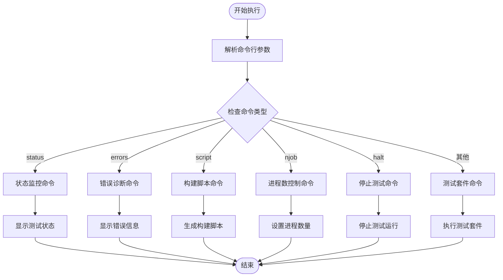
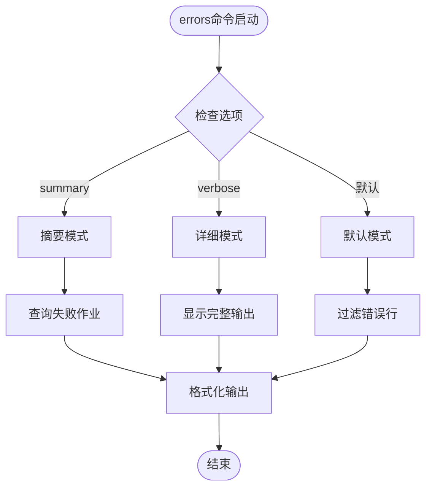
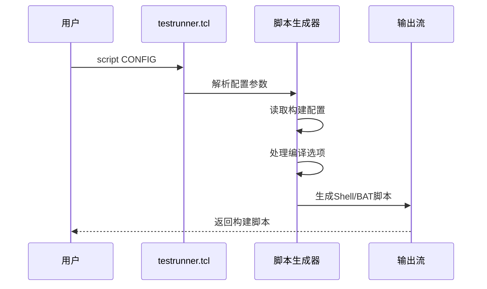
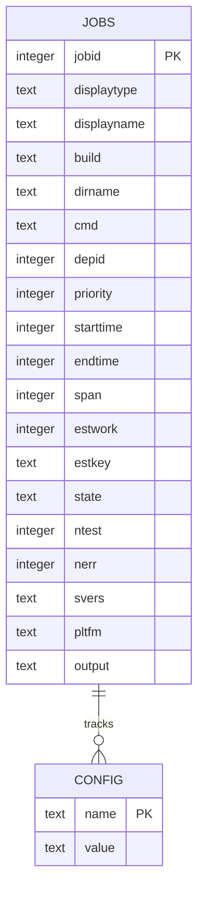
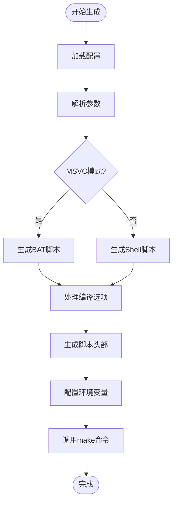
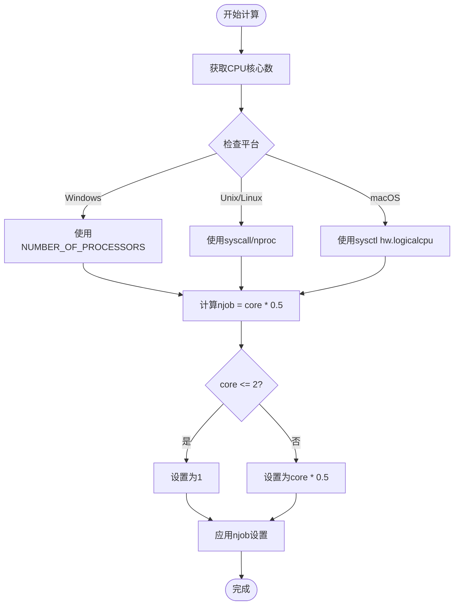

# SQLite测试运行器命令行接口详细文档

<cite>
**本文档引用的文件**
- [testrunner.tcl](file://test/testrunner.tcl)
- [testrunner.md](file://doc/testrunner.md)
- [testrunner_data.tcl](file://test/testrunner_data.tcl)
</cite>

## 目录
1. [概述](#概述)
2. [命令行接口架构](#命令行接口架构)
3. [核心命令详解](#核心命令详解)
4. [命令分发机制](#命令分发机制)
5. [状态监控系统](#状态监控系统)
6. [错误诊断功能](#错误诊断功能)
7. [构建脚本生成](#构建脚本生成)
8. [运行时控制](#运行时控制)
9. [实用命令组合示例](#实用命令组合示例)
10. [故障排除指南](#故障排除指南)

## 概述

SQLite测试运行器(`testrunner.tcl`)是一个功能强大的命令行工具，用于管理和执行SQLite的各种测试套件。它支持多种测试类型，包括Tcl测试脚本、模糊测试、源代码构建测试等，并提供了丰富的监控和诊断功能。

### 主要特性

- **多测试套件支持**：支持veryquick、full、all、release等多种测试配置
- **实时监控**：提供status命令进行实时进度监控
- **错误诊断**：errors命令帮助定位和分析测试失败
- **构建管理**：script命令生成可重现的构建脚本
- **运行时控制**：njob和halt命令动态调整测试进程

## 命令行接口架构

testrunner.tcl采用模块化的命令分发架构，通过解析命令行参数确定执行的操作。



**图表来源**
- [testrunner.tcl](file://test/testrunner.tcl#L820-L880)

## 核心命令详解

### 测试套件命令

#### 基本语法
```
testrunner.tcl ?SWITCHES? ?PERMUTATION? ?PATTERNS?
```

#### 支持的测试套件

| 测试套件 | 描述 | 典型用途 |
|---------|------|----------|
| `veryquick` | 快速测试子集 | 日常开发验证 |
| `full` | 完整测试套件 | 全面功能验证 |
| `all` | 所有测试 + 排列组合 | 综合质量保证 |
| `release` | 发布测试 | 发布前最终验证 |

#### 特殊值(permutations)

| 值 | 功能 | 使用场景 |
|----|------|----------|
| `list` | 显示所有允许的permutation参数 | 查看可用测试配置 |
| `mdevtest` | 开发前推荐测试 | 日常开发检查 |
| `sdevtest` | 启用地址和UBSAN的开发测试 | 内存安全检查 |
| `release` | 完整发布测试 | 发布前验证 |

**节来源**
- [testrunner.tcl](file://test/testrunner.tcl#L100-L180)

### 状态监控命令

#### 语法
```
testrunner.tcl status ?-d SECS? ?--cls?
```

#### 参数说明

| 参数 | 类型 | 描述 | 默认值 |
|------|------|------|--------|
| `-d SECS` | 整数 | 实时更新间隔（秒） | 0（一次性显示） |
| `--cls` | 标志 | 使用VT100转义序列清屏 | 关闭 |

#### 详细选项

- **`-d`选项**：指定实时更新间隔，实现持续监控
- **`--cls`选项**：启用终端清屏功能，提供更清晰的显示效果

#### 实时监控示例

```bash
# 实时监控，每2秒刷新一次
tclsh testrunner.tcl status -d 2

# 使用cls选项获得更好的视觉效果
tclsh testrunner.tcl status -d 2 --cls
```

**节来源**
- [testrunner.tcl](file://test/testrunner.tcl#L670-L725)

### 错误诊断命令

#### 语法
```
testrunner.tcl errors ?-v|--verbose? ?-s|--summary? ?PATTERN?
```

#### 选项详解

| 选项 | 别名 | 功能 | 输出内容 |
|------|------|------|----------|
| `-v` | `--verbose` | 详细输出模式 | 显示完整测试输出 |
| `-s` | `--summary` | 摘要模式 | 只显示失败作业列表 |

#### 错误处理流程



**图表来源**
- [testrunner.tcl](file://test/testrunner.tcl#L800-L880)

**节来源**
- [testrunner.tcl](file://test/testrunner.tcl#L800-L880)

### 构建脚本生成命令

#### 语法
```
testrunner.tcl script ?-msvc? CONFIG
```

#### 参数说明

| 参数 | 类型 | 描述 | 示例 |
|------|------|------|------|
| `-msvc` | 标志 | 生成Windows兼容脚本 | `-msvc` |
| `CONFIG` | 字符串 | 构建配置名称 | `Default`, `All-Debug` |

#### 配置生成流程



**图表来源**
- [testrunner.tcl](file://test/testrunner.tcl#L527-L540)

**节来源**
- [testrunner.tcl](file://test/testrunner.tcl#L527-L540)

### 运行时控制命令

#### njob命令 - 进程数控制

##### 语法
```
testrunner.tcl njob ?NJOB?
```

##### 功能
- **查询当前进程数**：不带参数时显示当前设置
- **修改进程数**：设置新的并发进程数量

##### 限制
- 数值范围：0-128
- 默认值：根据CPU核心数自动计算

#### halt命令 - 停止测试

##### 语法
```
testrunner.tcl halt
```

##### 功能
立即停止所有待运行和正在运行的测试任务。

**节来源**
- [testrunner.tcl](file://test/testrunner.tcl#L420-L480)

## 命令分发机制

testrunner.tcl使用基于字符串比较的命令分发机制，通过检查第一个命令行参数确定执行的操作。

### 分发算法

```mermaid
flowchart TD
Start([解析argv[0]]) --> IsEmpty{是否为空?}
IsEmpty --> |是| DefaultAction[执行默认操作]
IsEmpty --> |否| CompareStatus{与status比较}
CompareStatus --> |匹配| StatusCmd[status命令]
CompareStatus --> |不匹配| CompareErrors{与errors比较}
CompareErrors --> |匹配| ErrorsCmd[errors命令]
CompareErrors --> |不匹配| CompareScript{与script比较}
CompareScript --> |匹配| ScriptCmd[script命令]
CompareScript --> |不匹配| CompareNjob{与njob比较}
CompareNjob --> |匹配| NjobCmd[njob命令]
CompareNjob --> |不匹配| CompareHalt{与halt比较}
CompareHalt --> |匹配| HaltCmd[halt命令]
CompareHalt --> |不匹配| PermCmd[permutation命令]
StatusCmd --> ExecStatus[执行状态监控]
ErrorsCmd --> ExecErrors[执行错误诊断]
ScriptCmd --> ExecScript[生成构建脚本]
NjobCmd --> ExecNjob[控制进程数]
HaltCmd --> ExecHalt[停止测试]
PermCmd --> ExecPerm[执行测试套件]
DefaultAction --> ExecPerm
```

**图表来源**
- [testrunner.tcl](file://test/testrunner.tcl#L420-L520)

### argv解析逻辑

testrunner.tcl通过以下步骤解析命令行参数：

1. **预处理**：保存原始参数并清空argv
2. **加载数据**：导入测试配置和估计工作量
3. **命令识别**：逐个检查argv中的元素
4. **参数验证**：确保参数格式正确
5. **执行对应命令**：调用相应的处理函数

**节来源**
- [testrunner.tcl](file://test/testrunner.tcl#L820-L880)

## 状态监控系统

### 状态报告结构

testrunner.tcl维护一个数据库(`testrunner.db`)来跟踪所有测试作业的状态。

#### 数据库架构



**图表来源**
- [testrunner.tcl](file://test/testrunner.tcl#L320-L380)

### 状态显示功能

#### 实时更新机制

- **定时刷新**：使用`after`命令实现定时更新
- **VT100支持**：在支持的终端上使用转义序列清屏
- **智能截断**：根据终端大小动态调整显示内容

#### 状态信息层次

1. **总体概览**：命令行、总时间、完成百分比
2. **运行状态**：正在运行的作业列表
3. **失败统计**：失败作业数量和最近的失败记录
4. **性能指标**：预计剩余时间和ETC估算

**节来源**
- [testrunner.tcl](file://test/testrunner.tcl#L555-L725)

## 错误诊断功能

### 错误分类系统

testrunner.tcl将测试结果分为以下状态：

| 状态 | 描述 | 处理方式 |
|------|------|----------|
| `ready` | 准备就绪 | 等待执行 |
| `running` | 正在运行 | 监控中 |
| `done` | 成功完成 | 记录成功 |
| `failed` | 执行失败 | 标记为错误 |
| `omit` | 被跳过 | 不计入统计 |
| `halt` | 被停止 | 异常终止 |

### 诊断输出策略

#### 默认模式
- **错误行过滤**：只显示包含"!"或"failed"的行
- **上下文保留**：保持错误信息的上下文
- **简洁性**：最小化输出内容

#### 详细模式
- **完整输出**：显示整个测试输出
- **调试信息**：包含所有中间结果
- **完整堆栈**：提供完整的错误追踪

#### 摘要模式
- **作业列表**：只显示失败的作业名称
- **统计信息**：提供失败总数和测试总数
- **快速浏览**：便于快速了解整体状况

**节来源**
- [testrunner.tcl](file://test/testrunner.tcl#L800-L880)

## 构建脚本生成

### 配置系统

testrunner.tcl支持多种构建配置，每种配置定义了特定的编译选项和优化级别。

#### 预定义配置

| 配置名称 | 用途 | 主要特性 |
|----------|------|----------|
| `Default` | 标准构建 | 优化级别-O2，禁用合并 |
| `All-Debug` | 调试版本 | 启用所有功能，调试模式 |
| `All-O0` | 无优化 | -O0优化，便于调试 |
| `All-Sanitize` | 检测版本 | AddressSanitizer + UBSan |
| `Fast-One` | 性能测试 | 最高优化级别 |
| `Device-One` | 移动设备 | 小内存配置 |

### 脚本生成流程



**图表来源**
- [testrunner.tcl](file://test/testrunner.tcl#L527-L540)

### 编译选项映射

testrunner.tcl自动将内部配置转换为平台特定的编译选项：

#### Unix/Linux系统
- **GCC选项**：直接映射到CFLAGS
- **优化级别**：从-O0到-O3
- **调试信息**：-g选项

#### Windows系统
- **MSVC选项**：转换为NMAKE变量
- **优化开关**：OPTIMIZATIONS参数
- **调试模式**：DEBUG参数

**节来源**
- [testrunner.tcl](file://test/testrunner.tcl#L527-L540)

## 运行时控制

### 进程管理

#### 自动进程数计算

testrunner.tcl根据系统资源自动计算最优的并发进程数：



**图表来源**
- [testrunner.tcl](file://test/testrunner.tcl#L200-L240)

#### 动态调整机制

用户可以通过以下方式动态调整进程数：

1. **环境变量**：设置`NJOB`环境变量
2. **命令行**：使用`--jobs`参数
3. **运行时命令**：使用`njob`命令

### 中断和恢复

#### 停止机制

- **正常停止**：使用`halt`命令优雅终止
- **异常停止**：检测到核心转储时自动停止
- **错误停止**：遇到测试错误时可选择停止

#### 恢复功能

- **数据库持久化**：测试状态保存在数据库中
- **增量执行**：可以从上次中断的位置继续
- **状态重建**：重新加载现有数据库状态

**节来源**
- [testrunner.tcl](file://test/testrunner.tcl#L420-L480)

## 实用命令组合示例

### 实时监控工作流

#### 使用watch命令
```bash
# 在独立窗口中运行实时监控
watch tclsh test/testrunner.tcl status
```

#### 使用内置实时功能
```bash
# 直接使用testrunner的实时功能
tclsh test/testrunner.tcl status -d 2
```

### 故障排查流程

#### 第一步：查看错误摘要
```bash
# 获取失败作业的简要信息
tclsh test/testrunner.tcl errors -s
```

#### 第二步：深入分析错误
```bash
# 查看详细错误输出
tclsh test/testrunner.tcl errors -v
```

#### 第三步：定位具体问题
```bash
# 按模式过滤错误信息
tclsh test/testrunner.tcl errors "*specific_test*"
```

### 构建环境重现

#### 生成构建脚本
```bash
# 生成Linux兼容的构建脚本
tclsh test/testrunner.tcl script Default > make.sh

# 生成Windows兼容的构建脚本
tclsh test/testrunner.tcl script -msvc Default > make.bat
```

#### 手动执行构建
```bash
# 执行生成的构建脚本
./make.sh testfixture

# 或者手动指定目标
./make.sh testfixture
```

### 性能分析工作流

#### 监控测试进度
```bash
# 实时监控测试进度
tclsh test/testrunner.tcl status -d 5 --cls
```

#### 分析性能瓶颈
```bash
# 查看详细的工作负载分布
tclsh test/testrunner.tcl estwork
```

**节来源**
- [testrunner.tcl](file://test/testrunner.tcl#L670-L725)

## 故障排除指南

### 常见问题及解决方案

#### 数据库访问问题

**问题**：无法访问testrunner.db
```
Database missing: testrunner.db
```

**解决方案**：
1. 确认testrunner.tcl仍在运行目录中
2. 检查数据库文件权限
3. 验证磁盘空间充足

#### 平台兼容性问题

**问题**：--status选项在Windows上不可用
```
The --status option is not available on Windows.
```

**解决方案**：
1. 使用外部监控工具替代
2. 在其他平台上运行status命令
3. 使用`njob`和`errors`命令进行基本监控

#### 内存不足问题

**症状**：大量并发进程导致系统内存耗尽

**解决方案**：
1. 减少并发进程数
   ```bash
   tclsh test/testrunner.tcl njob 4
   ```
2. 使用`--buildonly`选项减少内存使用
3. 分批执行测试

#### 权限问题

**问题**：无法执行生成的构建脚本
```
Permission denied
```

**解决方案**：
1. 设置可执行权限
   ```bash
   chmod +x make.sh
   ```
2. 检查文件系统权限
3. 确保有足够的写入权限

### 调试技巧

#### 启用详细日志
```bash
# 使用--explain选项查看计划
tclsh test/testrunner.tcl --explain release

# 使用--dryrun选项模拟执行
tclsh test/testrunner.tcl --dryrun mdevtest
```

#### 模式匹配调试
```bash
# 使用通配符精确匹配测试
tclsh test/testrunner.tcl 'fts5*' errors -v

# 查看特定配置的作业
tclsh test/testrunner.tcl joblist '*config=All-Debug*'
```

#### 数据库查询
```bash
# 直接查询数据库获取详细信息
sqlite3 testrunner.db "SELECT * FROM jobs WHERE state='failed'"

# 查看作业列表
sqlite3 testrunner.db "SELECT displayname, state FROM jobs ORDER BY starttime"
```

**节来源**
- [testrunner.tcl](file://test/testrunner.tcl#L820-L880)