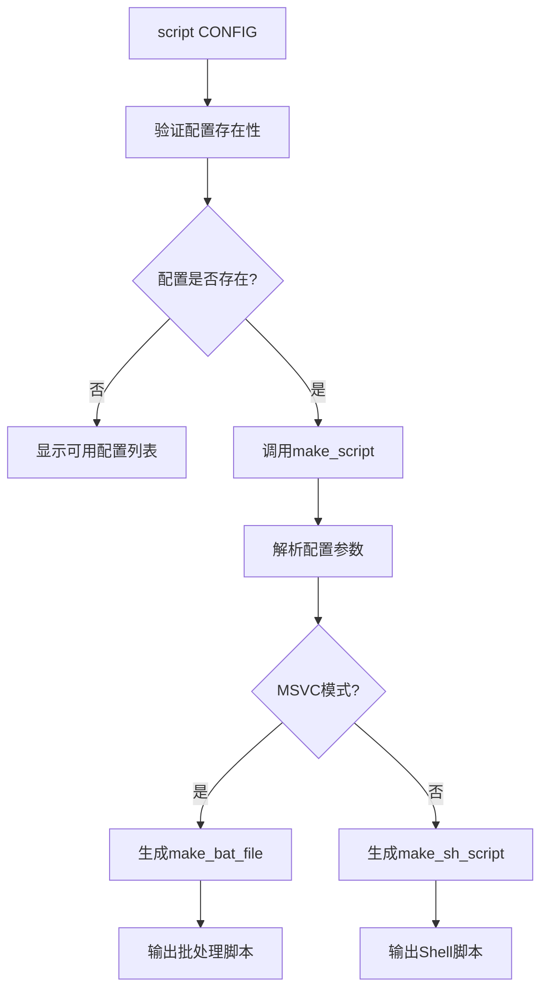
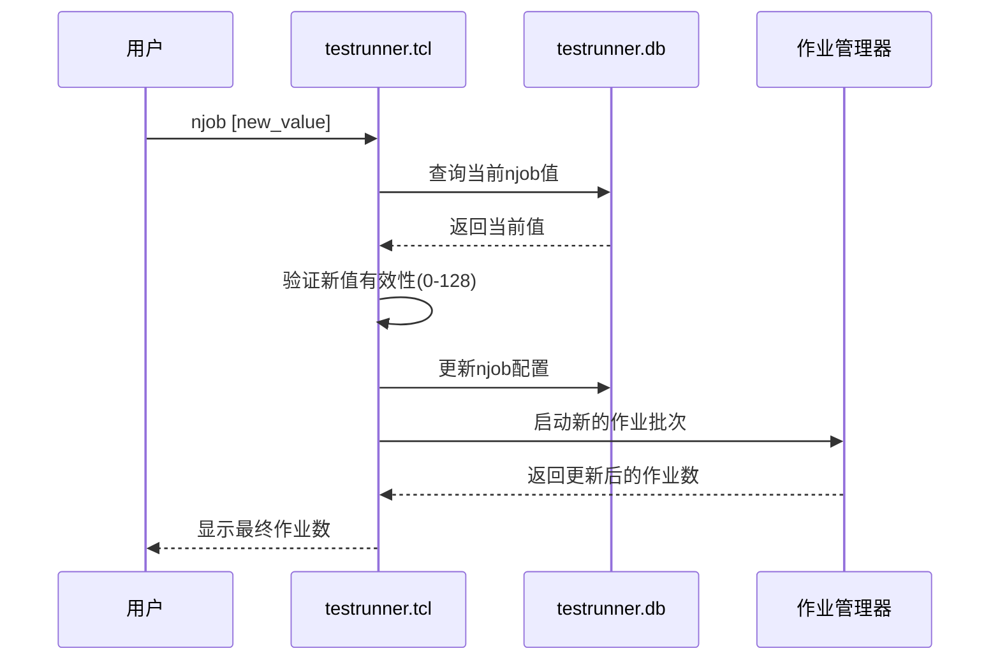
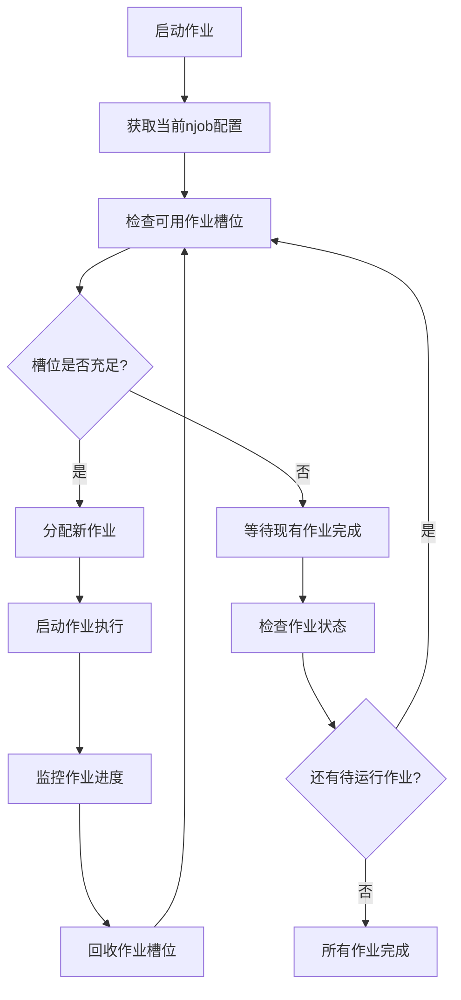
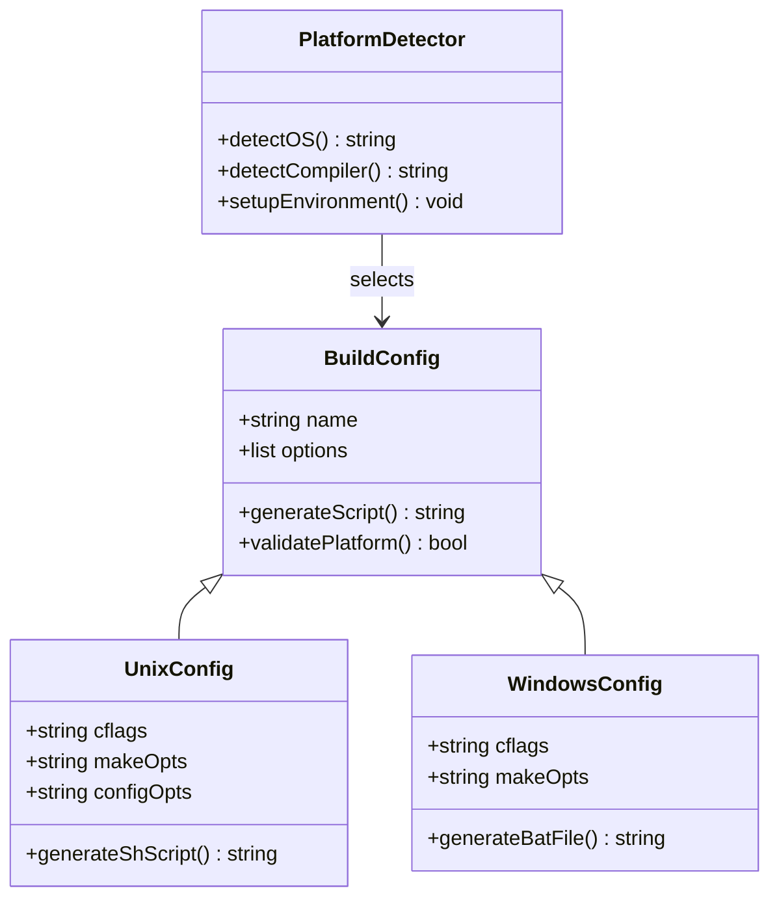
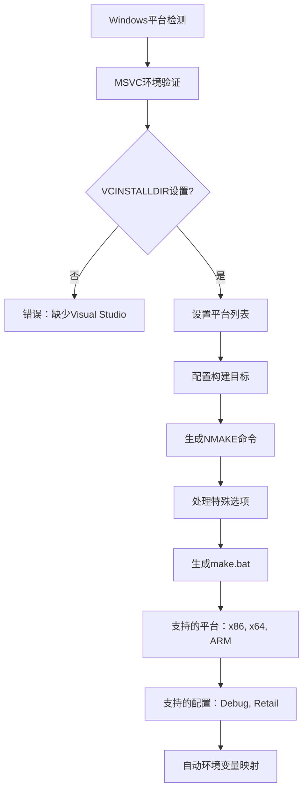
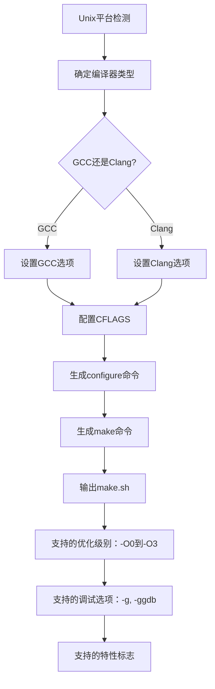

# 构建控制

<cite>
**本文档中引用的文件**
- [test/testrunner_data.tcl](file://test/testrunner_data.tcl)
- [test/testrunner.tcl](file://test/testrunner.tcl)
- [doc/testrunner.md](file://doc/testrunner.md)
- [tool/build-all-msvc.bat](file://tool/build-all-msvc.bat)
- [tool/build-shell.sh](file://tool/build-shell.sh)
</cite>

## 目录
1. [概述](#概述)
2. [script命令详解](#script命令详解)
3. [njob命令详解](#njob命令详解)
4. [构建配置系统](#构建配置系统)
5. [平台特定构建](#平台特定构建)
6. [实际使用示例](#实际使用示例)
7. [故障排除指南](#故障排除指南)
8. [总结](#总结)

## 概述

SQLite测试运行器提供了强大的构建控制功能，主要通过两个核心命令实现：`script`命令用于生成平台特定的构建脚本，`njob`命令用于动态调整并行作业数量。这些功能对于重现特定测试环境、调试构建问题以及优化测试执行效率至关重要。

构建控制系统的核心价值在于：
- **精确重现**：能够精确重建特定的编译配置
- **灵活调试**：支持在不同环境下调试构建问题
- **性能优化**：动态调整并行度以充分利用硬件资源
- **跨平台兼容**：支持Unix/Linux和Windows环境

## script命令详解

### 基本语法

```bash
tclsh testrunner.tcl script CONFIG > make.sh
tclsh testrunner.tcl script -msvc CONFIG > make.bat
```

### 功能特性

`script`命令根据指定的构建配置生成相应的构建脚本，支持以下特性：

#### 平台检测与适配
- 自动检测操作系统类型（Windows NT、Linux、macOS）
- 根据平台生成对应的构建脚本格式
- 处理平台特定的编译器选项

#### 配置解析机制


**图表来源**
- [test/testrunner_data.tcl](file://test/testrunner_data.tcl#L623-L665)
- [test/testrunner.tcl](file://test/testrunner.tcl#L530-L540)

#### 编译器选项处理
脚本自动处理不同编译器的特定选项：
- **GCC/Clang**: `-g`用于调试符号，`-O2`用于优化级别
- **MSVC**: `-Zi`用于调试信息，`OPTIMIZATIONS=<level>`用于优化设置

#### 环境变量集成
- 支持从环境变量`OPTS`继承额外的编译选项
- 自动设置目标目录和Tcl库路径
- 处理交叉编译和特定平台需求

**章节来源**
- [test/testrunner_data.tcl](file://test/testrunner_data.tcl#L516-L665)
- [test/testrunner.tcl](file://test/testrunner.tcl#L530-L540)

## njob命令详解

### 基本语法

```bash
# 查询当前并行作业数
./testfixture testrunner.tcl njob

# 设置新的并行作业数
./testfixture testrunner.tcl njob 8
```

### 工作原理

`njob`命令实现了动态资源调配功能，通过以下机制工作：



**图表来源**
- [test/testrunner.tcl](file://test/testrunner.tcl#L418-L440)

### 资源管理策略

#### 默认作业数计算
系统根据可用CPU核心数自动计算最优作业数：
- Windows环境：优先检查`NUMBER_OF_PROCESSORS`环境变量
- Unix/Linux环境：使用`sysctl -n hw.logicalcpu`或`nproc`命令
- 默认策略：逻辑核心数的50%（最小为1）

#### 动态调整机制
- 运行时可随时调整并行度
- 新设置立即生效，不影响已运行的作业
- 支持范围限制（0-128个作业）

#### 作业分配算法


**图表来源**
- [test/testrunner.tcl](file://test/testrunner.tcl#L1713-L1761)

**章节来源**
- [test/testrunner.tcl](file://test/testrunner.tcl#L418-L440)
- [test/testrunner.tcl](file://test/testrunner.tcl#L1713-L1761)

## 构建配置系统

### 配置架构

SQLite测试运行器采用分层配置系统，支持多种预定义构建配置：



**图表来源**
- [test/testrunner_data.tcl](file://test/testrunner_data.tcl#L548-L665)

### 预定义配置

#### 核心配置类别

| 配置名称 | 描述 | 主要用途 |
|---------|------|----------|
| `Default` | 标准发布配置 | 生产环境测试 |
| `Debug-One` | 调试版本配置 | 开发调试 |
| `Fast-One` | 性能优化配置 | 性能测试 |
| `Device-One` | 移动设备配置 | 移动平台测试 |
| `Android` | Android平台配置 | 移动应用测试 |
| `Apple` | macOS/iOS配置 | 苹果生态系统测试 |

#### 特殊配置用途

| 配置名称 | 用途 | 关键特性 |
|---------|------|----------|
| `Sanitize` | 内存安全测试 | AddressSanitizer, UndefinedBehaviorSanitizer |
| `Have-Not` | 功能缺失测试 | 强制禁用特定系统功能 |
| `Unlock-Notify` | 线程同步测试 | 解锁通知机制 |
| `Secure-Delete` | 安全删除测试 | 加密数据覆盖 |
| `Valgrind` | 内存泄漏检测 | Valgrind工具集成 |

**章节来源**
- [test/testrunner_data.tcl](file://test/testrunner_data.tcl#L65-L400)

## 平台特定构建

### Windows环境支持

#### MSVC编译器集成
Windows平台支持Microsoft Visual C++编译器，通过以下特性实现：



**图表来源**
- [tool/build-all-msvc.bat](file://tool/build-all-msvc.bat#L201-L256)

#### 环境变量配置
Windows构建系统支持多个环境变量来控制构建行为：

| 变量名 | 用途 | 示例值 |
|--------|------|--------|
| `PLATFORMS` | 目标平台列表 | `x86 x86_amd64 x86_arm` |
| `CONFIGURATIONS` | 构建配置 | `Debug Retail` |
| `NMAKE_CMD` | NMAKE命令路径 | `nmake -B -f Makefile.msc` |
| `NMAKE_ARGS` | 额外NMAKE参数 | `FOR_WINRT=1` |
| `NOMEMDEBUG` | 禁用内存调试 | `1` |

#### 调试符号处理
- 支持`.pdb`符号文件的自动生成和复制
- 可通过`NOSYMBOLS`环境变量禁用符号文件生成
- 自动处理调试和发布版本的差异

**章节来源**
- [tool/build-all-msvc.bat](file://tool/build-all-msvc.bat#L49-L108)
- [tool/build-all-msvc.bat](file://tool/build-all-msvc.bat#L452-L522)

### Unix/Linux环境支持

#### GCC/Clang编译器支持
Unix/Linux平台默认使用GCC或Clang编译器：



**图表来源**
- [test/testrunner_data.tcl](file://test/testrunner_data.tcl#L516-L548)

#### 跨平台兼容性
- 统一的配置接口，屏蔽平台差异
- 自动处理路径分隔符转换
- 条件编译宏确保代码可移植性

**章节来源**
- [test/testrunner_data.tcl](file://test/testrunner_data.tcl#L516-L548)

## 实际使用示例

### 创建Device-One配置的构建脚本

#### Linux/macOS环境
```bash
# 生成Shell脚本用于构建Device-One配置
tclsh test/testrunner.tcl script Device-One > make.sh

# 添加可执行权限
chmod +x make.sh

# 使用脚本构建SQLite
./make.sh sqlite3
```

#### Windows环境
```batch
REM 生成批处理文件用于MSVC构建
tclsh test/testrunner.tcl script -msvc Device-One > make.bat

REM 使用批处理文件构建
call make.bat sqlite3
```

### 动态调整并行作业数

#### 性能优化场景
```bash
# 查看当前并行作业数
./testfixture testrunner.tcl njob
# 输出: 8

# 根据CPU核心数调整作业数
./testfixture testrunner.tcl njob 16

# 在资源受限环境中降低并行度
./testfixture testrunner.tcl njob 4
```

#### 测试调试场景
```bash
# 快速验证构建配置
./testfixture testrunner.tcl njob 1
tclsh test/testrunner.tcl script Device-One > make.sh
./make.sh testfixture
```

### 故障排除工作流

#### 重现构建失败
```bash
# 1. 获取失败作业的构建配置
./testfixture testrunner.tcl joblist | grep FAILED

# 2. 生成对应的构建脚本
tclsh test/testrunner.tcl script Device-One > reproduce-build.sh

# 3. 手动执行构建过程
./reproduce-build.sh sqlite3

# 4. 运行测试验证
./sqlite3 test/tester.tcl veryquick
```

#### 性能分析
```bash
# 1. 启动大量并行作业进行压力测试
./testfixture testrunner.tcl njob 32

# 2. 监控系统资源使用情况
watch -n 1 'ps aux | grep testfixture'

# 3. 根据结果调整作业数
./testfixture testrunner.tcl njob 16
```

## 故障排除指南

### 常见问题及解决方案

#### script命令相关问题

**问题：配置不存在**
```bash
# 错误信息
No such build config: NonExistentConfig
Available configurations: Default Debug-One Fast-One ...
```

**解决方案：**
```bash
# 查看所有可用配置
tclsh test/testrunner.tcl script help
```

**问题：MSVC环境配置错误**
```bash
# 错误信息
The VCINSTALLDIR environment variable must be defined
```

**解决方案：**
```batch
REM 确保Visual Studio已正确安装
REM 设置正确的环境变量
call "C:\Program Files (x86)\Microsoft Visual Studio\2019\Community\VC\Auxiliary\Build\vcvars64.bat"
```

#### njob命令相关问题

**问题：无效的作业数**
```bash
# 错误信息
parameter must be an integer between 0 and 128
```

**解决方案：**
```bash
# 设置合理的作业数
./testfixture testrunner.tcl njob 8  # 推荐值
```

**问题：数据库锁定**
```bash
# 错误信息
Cannot read database: testrunner.db
```

**解决方案：**
```bash
# 确保testrunner.db文件可访问
chmod 644 testrunner.db
# 或检查是否有其他实例正在运行
ps aux | grep testrunner
```

### 性能调优建议

#### CPU利用率优化
- 核心数 ≤ 4：设置njob = 核心数
- 核心数 4-8：设置njob = 核心数 × 0.75
- 核心数 > 8：设置njob = 核心数 × 0.5

#### 内存使用优化
- 每个作业平均占用内存：200MB - 500MB
- 总内存 ÷ 单作业内存 ≥ njob
- 高内存消耗配置时减少njob值

#### I/O性能考虑
- SSD存储：可以增加njob值
- HDD存储：建议减少njob值
- 网络存储：大幅减少njob值

## 总结

SQLite测试运行器的构建控制系统提供了强大而灵活的功能，通过`script`和`njob`命令实现了：

### 核心优势
- **精确重现**：能够完全重现特定的编译环境和配置
- **动态调整**：实时调整并行作业数以优化资源利用
- **跨平台支持**：统一接口支持Windows、Linux、macOS等多个平台
- **调试友好**：便于定位和解决构建相关问题

### 最佳实践
1. **配置选择**：根据测试目标选择合适的构建配置
2. **资源规划**：基于硬件能力合理设置并行作业数
3. **环境隔离**：使用独立的构建目录避免冲突
4. **持续监控**：定期检查构建脚本的有效性和性能

### 应用场景
- **CI/CD集成**：自动化测试流水线中的构建控制
- **本地开发**：快速验证不同编译配置
- **性能测试**：优化测试执行时间和资源使用
- **故障诊断**：重现和分析构建失败问题

通过掌握这些构建控制功能，开发者可以更高效地进行SQLite的测试和开发工作，确保代码质量和系统稳定性。