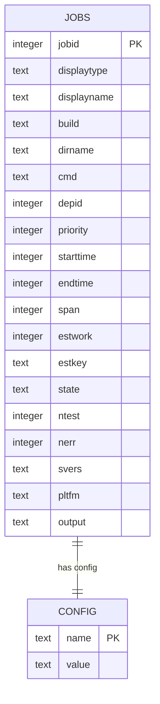
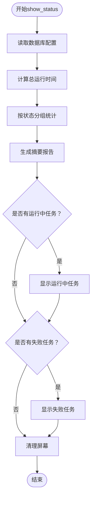
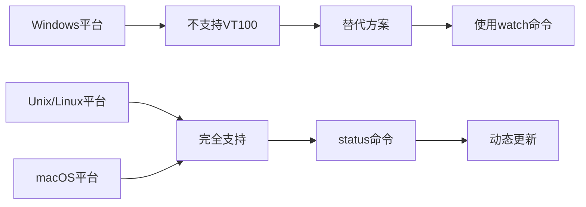
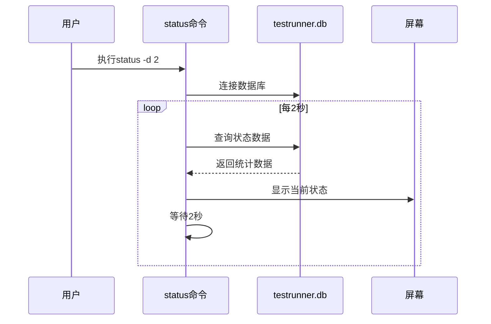
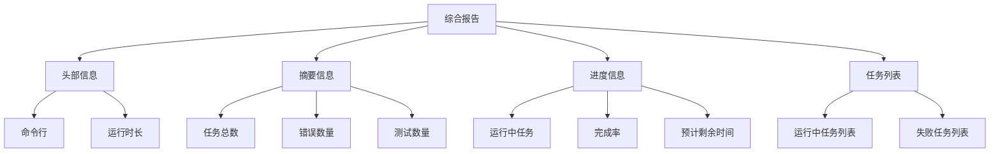

# 状态监控

<cite>
**本文档引用的文件**
- [testrunner.tcl](file://test/testrunner.tcl)
- [testrunner.md](file://doc/testrunner.md)
- [testrunner_data.tcl](file://test/testrunner_data.tcl)
- [testrunner_estwork.tcl](file://test/testrunner_estwork.tcl)
</cite>

## 目录
1. [概述](#概述)
2. [status命令基础](#status命令基础)
3. [数据库架构](#数据库架构)
4. [状态监控机制](#状态监控机制)
5. [VT100转义序列支持](#vt100转义序列支持)
6. [自动刷新功能](#自动刷新功能)
7. [综合报告生成](#综合报告生成)
8. [实用示例](#实用示例)
9. [故障排除](#故障排除)
10. [最佳实践](#最佳实践)

## 概述

SQLite测试运行器的状态监控功能是一个强大的实时监控系统，通过读取`testrunner.db`数据库实时展示测试任务的执行状态。该系统能够监控运行中、已完成、失败和待处理的任务统计，并提供详细的进度报告和预计剩余时间（ETC）计算。

状态监控功能的核心特性包括：
- 实时显示测试任务状态
- 自动刷新间隔控制
- VT100终端兼容性
- 清屏显示模式
- 预计完成时间估算
- 多种输出格式支持

## status命令基础

### 基本语法

```bash
tclsh testrunner.tcl status
```

### 参数选项

| 参数 | 描述 | 示例 |
|------|------|------|
| `-d SECS` | 设置自动刷新间隔（秒） | `tclsh testrunner.tcl status -d 2` |
| `--cls` | 启用清屏显示模式 | `tclsh testrunner.tcl status --cls` |

### 命令组合

```bash
# 结合watch命令使用
watch tclsh testrunner.tcl status

# 使用-d参数实现定时刷新
tclsh testrunner.tcl status -d 2

# 同时使用刷新和清屏模式
tclsh testrunner.tcl status -d 2 --cls
```

**节来源**
- [testrunner.tcl](file://test/testrunner.tcl#L680-L725)

## 数据库架构

### jobs表结构

`testrunner.db`数据库的核心是`jobs`表，它存储了所有测试任务的详细信息：



**图表来源**
- [testrunner.tcl](file://test/testrunner.tcl#L308-L365)

### 关键字段说明

| 字段名 | 类型 | 描述 |
|--------|------|------|
| `jobid` | INTEGER | 唯一标识符，正整数 |
| `displaytype` | TEXT | 测试类型（如tcl、fuzz、make等） |
| `displayname` | TEXT | 人类可读的作业名称 |
| `state` | TEXT | 任务状态：ready、running、done、failed、omit、halt |
| `starttime` | INTEGER | 开始时间（毫秒自1970年） |
| `endtime` | INTEGER | 结束时间（毫秒自1970年） |
| `estwork` | INTEGER | 预估工作量 |
| `ntest` | INTEGER | 运行的测试案例数量 |
| `nerr` | INTEGER | 报告的错误数量 |

**节来源**
- [testrunner.tcl](file://test/testrunner.tcl#L344-L365)

## 状态监控机制

### show_status过程

`show_status`过程是状态监控的核心函数，负责生成综合报告：



**图表来源**
- [testrunner.tcl](file://test/testrunner.tcl#L575-L680)

### 状态统计逻辑

系统通过以下步骤进行状态统计：

1. **初始化统计变量**：设置各类状态的计数器
2. **查询数据库**：执行聚合查询获取状态分布
3. **计算进度**：基于完成的工作量计算进度百分比
4. **估算剩余时间**：使用线性插值法计算ETC
5. **生成报告**：格式化输出结果

**节来源**
- [testrunner.tcl](file://test/testrunner.tcl#L596-L622)

## VT100转义序列支持

### 转义序列详解

状态监控系统使用VT100转义序列实现动态屏幕更新：

| 序列 | 功能 | 用途 |
|------|------|------|
| `\033[H` | 光标移动到左上角 | 清屏后定位光标 |
| `\033[2J` | 清屏 | 完全清除屏幕内容 |
| `\033[0J` | 清除光标到屏幕末尾 | 清理多余内容 |

### 终端兼容性



**图表来源**
- [testrunner.tcl](file://test/testrunner.tcl#L886-L904)

### 不同终端环境下的显示效果

- **Linux/macOS终端**：完整VT100支持，实现真正的动态刷新
- **Windows命令提示符**：部分支持，可能需要使用第三方终端
- **远程SSH连接**：通常支持VT100序列
- **CI/CD环境**：可能需要禁用VT100序列

**节来源**
- [testrunner.tcl](file://test/testrunner.tcl#L575-L594)

## 自动刷新功能

### 刷新机制

自动刷新功能通过循环调用`show_status`过程实现：



**图表来源**
- [testrunner.tcl](file://test/testrunner.tcl#L700-L725)

### 刷新间隔控制

- **最小间隔**：1秒（推荐2秒以上）
- **最大间隔**：无限制（受系统资源影响）
- **默认行为**：单次显示，不刷新

### --cls选项的作用

`--cls`选项启用清屏显示模式，确保每次刷新都从干净的屏幕开始：

```bash
# 清屏模式示例
tclsh testrunner.tcl status --cls
tclsh testrunner.tcl status -d 2 --cls
```

**节来源**
- [testrunner.tcl](file://test/testrunner.tcl#L680-L725)

## 综合报告生成

### 报告结构

状态监控生成的综合报告包含以下信息：



**图表来源**
- [testrunner.tcl](file://test/testrunner.tcl#L575-L680)

### 时间计算算法

系统使用线性插值法计算预计剩余时间（ETC）：

1. **计算已完成工作量**：`fin = W(done) + W(failed) + W(omit)`
2. **计算总工作量**：`totalw = Σ(estwork)`
3. **计算平均速度**：`speed = fin / tm`
4. **估算剩余时间**：`tmleft = (totalw - fin) / speed`

### 任务列表显示

- **运行中任务**：显示正在执行的任务及其运行时间
- **失败任务**：显示失败的任务列表，最多显示18个（终端限制）
- **任务名称截断**：超过65字符的任务名称会被截断并添加省略号

**节来源**
- [testrunner.tcl](file://test/testrunner.tcl#L624-L680)

## 实用示例

### 基础监控

```bash
# 基本状态查看
tclsh testrunner.tcl status

# 每2秒刷新一次
tclsh testrunner.tcl status -d 2

# 清屏模式刷新
tclsh testrunner.tcl status -d 2 --cls
```

### 结合watch命令

```bash
# 使用watch命令监控
watch -n 2 tclsh testrunner.tcl status

# 带颜色高亮的watch
watch -n 2 -c tclsh testrunner.tcl status
```

### 大规模测试套件监控

对于大型测试套件，建议使用以下配置：

```bash
# 长期监控，每5秒刷新一次
tclsh testrunner.tcl status -d 5 --cls

# 结合日志记录
tclsh testrunner.tcl status -d 10 > status.log 2>&1 &
```

### CI/CD集成

在持续集成环境中使用：

```bash
# Docker容器内监控
docker exec -it sqlite-container tclsh /sqlite/test/testrunner.tcl status -d 3

# Kubernetes Pod监控
kubectl exec -it sqlite-pod -- tclsh /sqlite/test/testrunner.tcl status -d 5
```

**节来源**
- [testrunner.md](file://doc/testrunner.md#L50-L60)

## 故障排除

### 常见问题及解决方案

| 问题 | 原因 | 解决方案 |
|------|------|----------|
| 数据库不存在 | testrunner.db文件缺失 | 确保在正确的目录下运行 |
| VT100不支持 | Windows平台或非兼容终端 | 使用`--cls`选项或watch命令 |
| 刷新异常 | 数据库锁定或权限问题 | 检查数据库文件权限 |
| 显示混乱 | 终端宽度不足 | 调整终端窗口大小 |

### 调试技巧

1. **检查数据库连接**：
   ```bash
   sqlite3 testrunner.db ".tables"
   ```

2. **验证状态数据**：
   ```bash
   sqlite3 testrunner.db "SELECT state, COUNT(*) FROM jobs GROUP BY state"
   ```

3. **监控进程**：
   ```bash
   ps aux | grep testrunner
   ```

### 性能优化

- **减少刷新频率**：对于长时间运行的测试，使用较长的刷新间隔
- **避免频繁切换**：不要同时使用多个状态监控实例
- **监控系统资源**：确保有足够的内存和CPU资源

**节来源**
- [testrunner.tcl](file://test/testrunner.tcl#L700-L725)

## 最佳实践

### 监控策略

1. **选择合适的刷新间隔**
   - 快速测试：2-5秒
   - 中等测试：10-30秒
   - 长时间测试：60秒以上

2. **根据环境选择显示模式**
   - 生产环境：使用`--cls`避免屏幕混乱
   - 开发环境：可以使用标准输出
   - CI/CD：考虑静默模式

3. **结合其他监控工具**
   - 日志文件分析
   - 系统资源监控
   - 错误报告收集

### 团队协作

1. **标准化监控流程**
   - 制定统一的监控参数
   - 建立监控报告模板
   - 设立响应时间标准

2. **文档化监控结果**
   - 记录关键指标变化
   - 分析性能趋势
   - 建立基线数据

3. **自动化集成**
   - 将状态监控集成到构建流程
   - 设置告警阈值
   - 自动化报告生成

### 安全考虑

1. **访问控制**
   - 限制数据库文件访问权限
   - 使用专用用户运行测试
   - 避免在生产环境中暴露详细状态信息

2. **数据保护**
   - 定期备份测试数据库
   - 清理过期的日志文件
   - 加密敏感的测试数据

通过遵循这些最佳实践，可以最大化状态监控功能的价值，提高测试效率和质量。