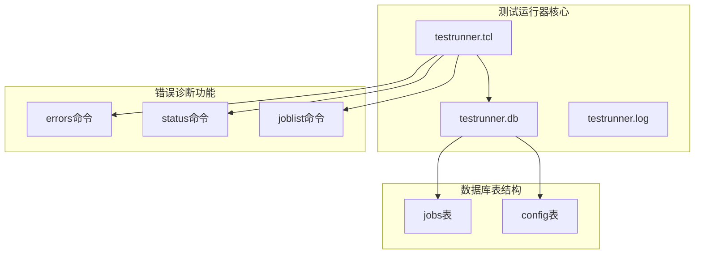
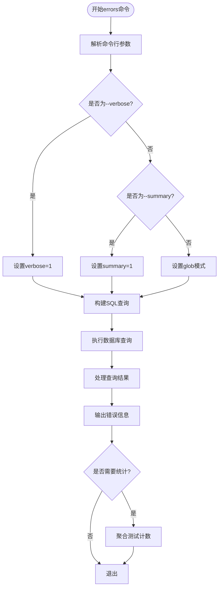
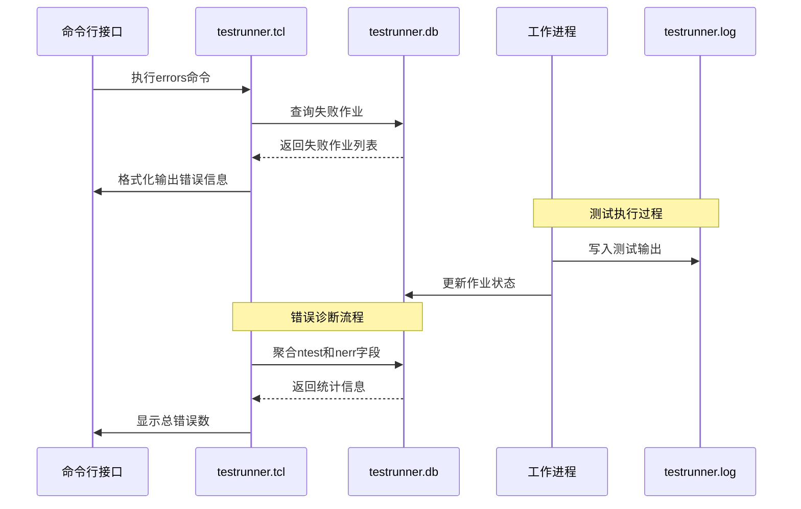
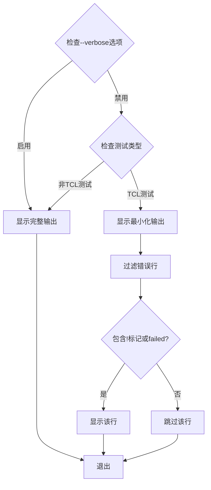
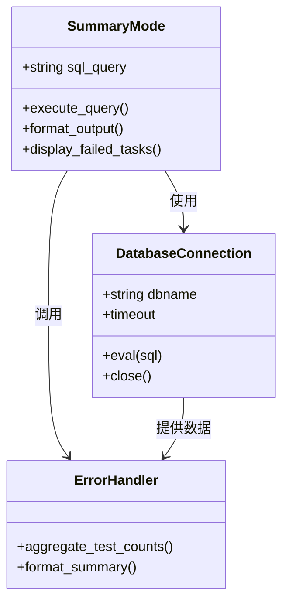
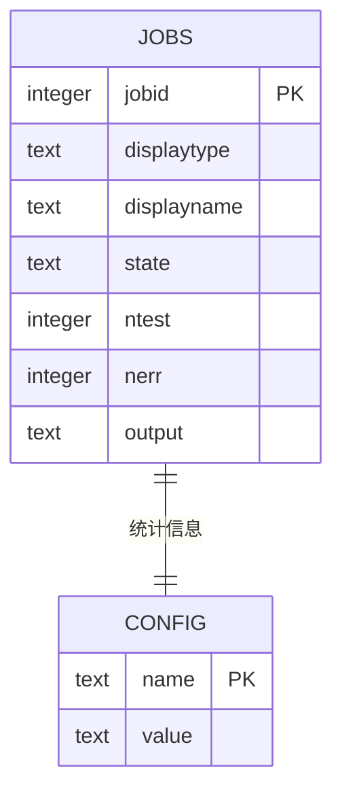
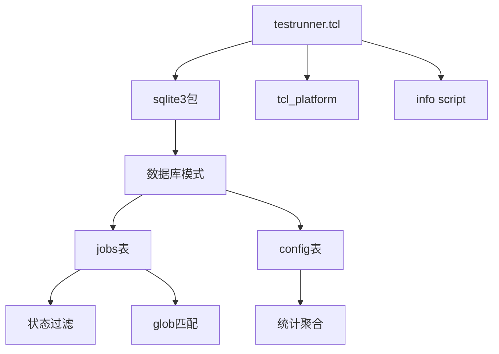

# 错误诊断

<cite>
**本文档中引用的文件**
- [testrunner.tcl](file://test/testrunner.tcl)
- [testrunner.md](file://doc/testrunner.md)
- [testrunner_data.tcl](file://test/testrunner_data.tcl)
</cite>

## 目录
1. [简介](#简介)
2. [项目结构概览](#项目结构概览)
3. [核心组件分析](#核心组件分析)
4. [架构概览](#架构概览)
5. [详细组件分析](#详细组件分析)
6. [依赖关系分析](#依赖关系分析)
7. [性能考虑](#性能考虑)
8. [故障排除指南](#故障排除指南)
9. [结论](#结论)

## 简介

SQLite测试运行器的错误诊断功能是一个强大的工具，用于从testrunner.db数据库中提取、格式化和展示失败测试的输出日志。该系统提供了多种诊断选项，包括详细的错误输出、摘要报告以及基于glob模式的测试过滤功能，帮助开发者快速定位和解决测试失败问题。

## 项目结构概览

SQLite测试运行器采用分层架构设计，主要包含以下核心组件：



**图表来源**
- [testrunner.tcl](file://test/testrunner.tcl#L220-L242)
- [testrunner.tcl](file://test/testrunner.tcl#L308-L365)

**章节来源**
- [testrunner.tcl](file://test/testrunner.tcl#L220-L242)
- [testrunner.md](file://doc/testrunner.md#L1-L50)

## 核心组件分析

### 数据库架构

测试运行器使用SQLite数据库存储所有测试作业的状态和结果信息。核心数据结构包括：

| 字段名 | 类型 | 描述 | 约束 |
|--------|------|------|------|
| jobid | INTEGER | 唯一标识符 | PRIMARY KEY |
| displaytype | TEXT | 测试类型（tcl、fuzz等） | NOT NULL |
| displayname | TEXT | 人类可读的作业名称 | NOT NULL |
| state | TEXT | 作业状态（ready、running、done、failed等） | CHECK约束 |
| ntest | INTEGER | 执行的测试用例数量 | 可为空 |
| nerr | INTEGER | 报告的错误数量 | 可为空 |
| output | TEXT | 测试输出内容 | 完整的测试输出 |

### 错误诊断命令实现

errors命令是测试运行器的核心诊断工具，支持多种输出模式和过滤选项：



**图表来源**
- [testrunner.tcl](file://test/testrunner.tcl#L785-L846)

**章节来源**
- [testrunner.tcl](file://test/testrunner.tcl#L308-L365)
- [testrunner.tcl](file://test/testrunner.tcl#L785-L846)

## 架构概览

测试运行器采用多进程并发架构，每个测试作业在独立进程中执行，确保测试的隔离性和稳定性：



**图表来源**
- [testrunner.tcl](file://test/testrunner.tcl#L1489-L1532)
- [testrunner.tcl](file://test/testrunner.tcl#L785-L846)

## 详细组件分析

### 错误诊断命令详解

#### 基本语法和选项

errors命令支持以下语法格式：
- `errors` - 显示所有失败测试的基本信息
- `errors -v` 或 `errors --verbose` - 显示完整的测试输出
- `errors -s` 或 `errors --summary` - 仅列出失败的任务名称
- `errors PATTERN` - 过滤特定模式的测试失败信息

#### 详细输出模式 (-v/--verbose)

当使用--verbose选项时，系统会显示测试的完整输出内容：



**图表来源**
- [testrunner.tcl](file://test/testrunner.tcl#L820-L835)

#### 摘要模式 (--summary)

摘要模式提供简洁的失败任务列表，便于快速浏览：



**图表来源**
- [testrunner.tcl](file://test/testrunner.tcl#L800-L810)

#### Glob模式匹配

系统支持基于glob模式的测试过滤，允许用户精确筛选特定的测试失败：

| 模式类型 | 示例 | 匹配规则 | 应用场景 |
|----------|------|----------|----------|
| 通配符匹配 | `fts5*` | 匹配以fts5开头的所有测试 | 全文搜索模块测试 |
| 复杂模式 | `*test*` | 包含test关键字的测试 | 特定功能测试 |
| 精确匹配 | `test1.test` | 完全匹配的单个测试 | 具体测试案例 |
| 组合模式 | `*fts5*test*` | 多条件组合匹配 | 复杂测试场景 |

**章节来源**
- [testrunner.tcl](file://test/testrunner.tcl#L800-L810)
- [testrunner.tcl](file://test/testrunner.tcl#L820-L835)

### 数据库查询逻辑

#### Jobs表查询策略

errors命令根据不同的输出模式构建相应的SQL查询：



**图表来源**
- [testrunner.tcl](file://test/testrunner.tcl#L344-L365)

#### 错误统计聚合

系统通过aggregate_test_counts函数计算全局错误统计：

```mermaid
flowchart LR
QUERY[SELECT sum(nerr), sum(ntest) FROM jobs]
QUERY --> AGGREGATE[聚合计算]
AGGREGATE --> RESULT[返回[错误数, 测试总数]]
RESULT --> FORMAT[格式化输出]
FORMAT --> DISPLAY[显示统计信息]
```

**图表来源**
- [testrunner.tcl](file://test/testrunner.tcl#L740-L750)

**章节来源**
- [testrunner.tcl](file://test/testrunner.tcl#L740-L750)
- [testrunner.tcl](file://test/testrunner.tcl#L800-L846)

### 日志文件集成

#### testrunner.log文件格式

测试运行器将所有测试输出写入testrunner.log文件，使用特定标记指示错误状态：

| 标记类型 | 格式 | 含义 | 用途 |
|----------|------|------|------|
| `!` | `!` 开头的行 | 关键错误信息 | 快速识别严重错误 |
| `failed` | 包含"failed"的行 | 测试失败标记 | 自动过滤失败信息 |
| `SQLite版本` | `SQLite YYYY-MM-DD HH:MM:SS` | 版本信息 | 调试版本兼容性 |

#### 日志文件搜索技巧

推荐的日志搜索命令：
- `grep "^!" testrunner.log` - 查找关键错误标记
- `grep failed testrunner.log` - 查找测试失败记录
- `grep -A 5 -B 5 "failed" testrunner.log` - 查看失败前后的上下文

**章节来源**
- [testrunner.md](file://doc/testrunner.md#L50-L100)

## 依赖关系分析

### 核心依赖关系



**图表来源**
- [testrunner.tcl](file://test/testrunner.tcl#L1-L50)
- [testrunner.tcl](file://test/testrunner.tcl#L308-L365)

### 外部依赖

测试运行器依赖以下外部组件：
- **Tcl解释器**：运行测试脚本的基础环境
- **SQLite 3.31.1+**：数据库操作和查询功能
- **testfixture**：二进制测试框架
- **操作系统工具**：make、bash等构建工具

**章节来源**
- [testrunner.tcl](file://test/testrunner.tcl#L1-L50)
- [testrunner.md](file://doc/testrunner.md#L100-L150)

## 性能考虑

### 并发处理优化

测试运行器采用多进程架构，支持并行测试执行：
- 默认工作进程数量基于CPU核心数自动调整
- 支持动态调整工作进程数量
- 使用WAL模式提高数据库并发性能

### 内存管理

系统实现了智能的内存管理策略：
- 及时释放已完成作业的资源
- 使用索引优化数据库查询性能
- 限制状态报告中的失败作业显示数量

### I/O优化

- 数据库操作使用事务批量提交
- 日志文件采用异步写入机制
- 测试输出缓冲区优化

## 故障排除指南

### 常见错误诊断场景

#### 场景1：查看详细错误堆栈

使用以下命令获取完整的错误信息：
```bash
tclsh testrunner.tcl errors -v
```

这将显示每个失败测试的完整输出，包括错误堆栈和调试信息。

#### 场景2：定位特定模块的测试失败

使用glob模式过滤特定模块的测试失败：
```bash
tclsh testrunner.tcl errors fts5*
```

这将只显示与全文搜索模块相关的测试失败信息。

#### 场景3：快速概览失败任务

使用摘要模式获得简洁的失败列表：
```bash
tclsh testrunner.tcl errors -s
```

#### 场景4：分析整体测试质量

不带任何参数直接运行errors命令：
```bash
tclsh testrunner.tcl errors
```

这将显示失败测试的详细信息以及总体的错误统计。

### 调试技巧

1. **结合日志文件**：errors命令的结果可以与testrunner.log文件配合使用
2. **使用状态监控**：运行`status`命令实时监控测试进度
3. **模式匹配**：利用glob模式精确筛选相关测试
4. **统计分析**：关注ntest和nerr字段了解测试覆盖率

**章节来源**
- [testrunner.tcl](file://test/testrunner.tcl#L162-L180)
- [testrunner.md](file://doc/testrunner.md#L200-L250)

## 结论

SQLite测试运行器的错误诊断功能提供了一个全面而强大的测试故障排除解决方案。通过errors命令，开发者可以：

- 快速定位和识别测试失败的根本原因
- 使用多种输出模式适应不同的调试需求
- 利用glob模式精确筛选相关测试
- 获取详细的错误统计和测试覆盖率信息

该系统的模块化设计和丰富的配置选项使其能够适应各种测试环境和调试场景，是SQLite项目质量保证体系的重要组成部分。通过合理使用这些诊断工具，开发团队可以显著提高测试效率和软件质量。