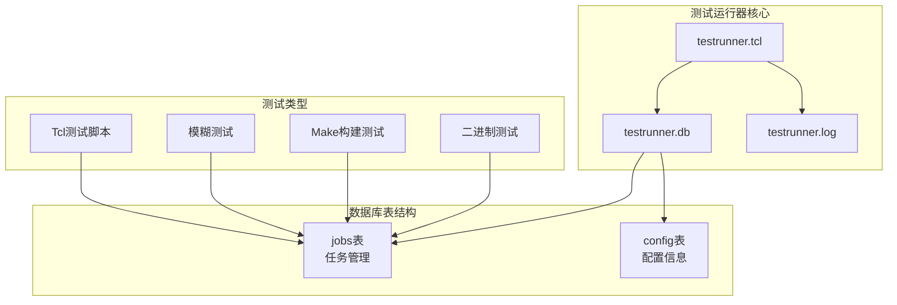
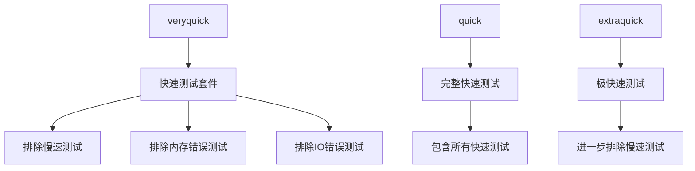
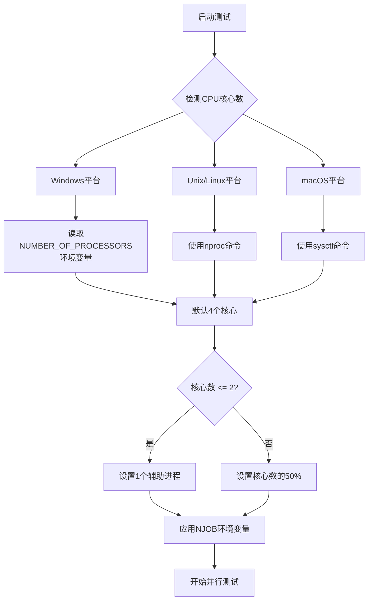
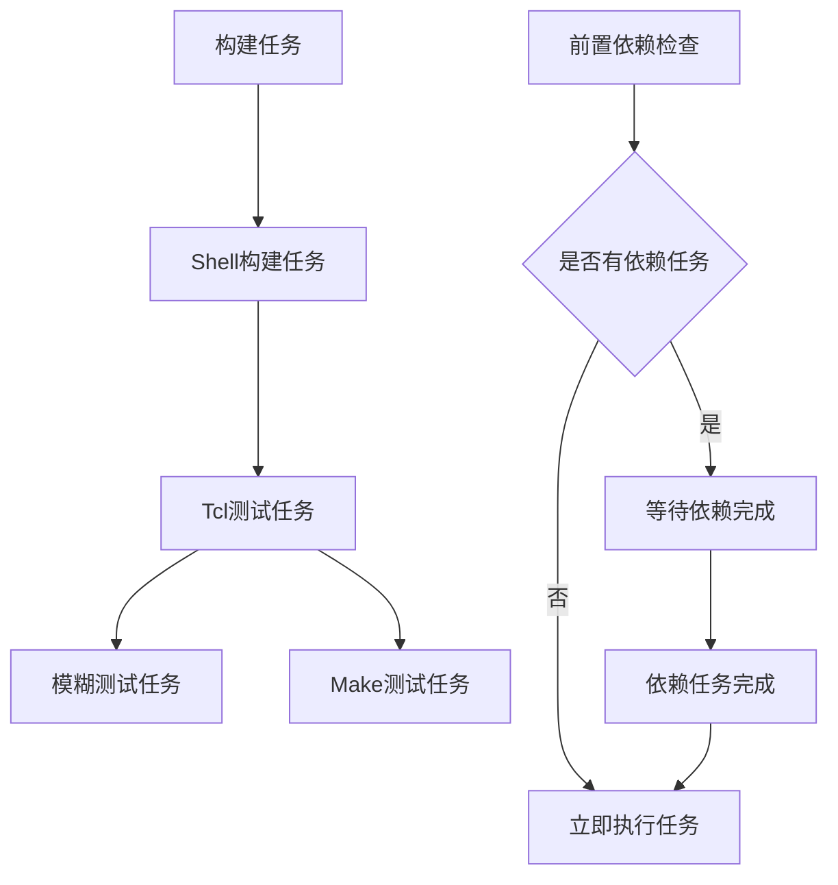
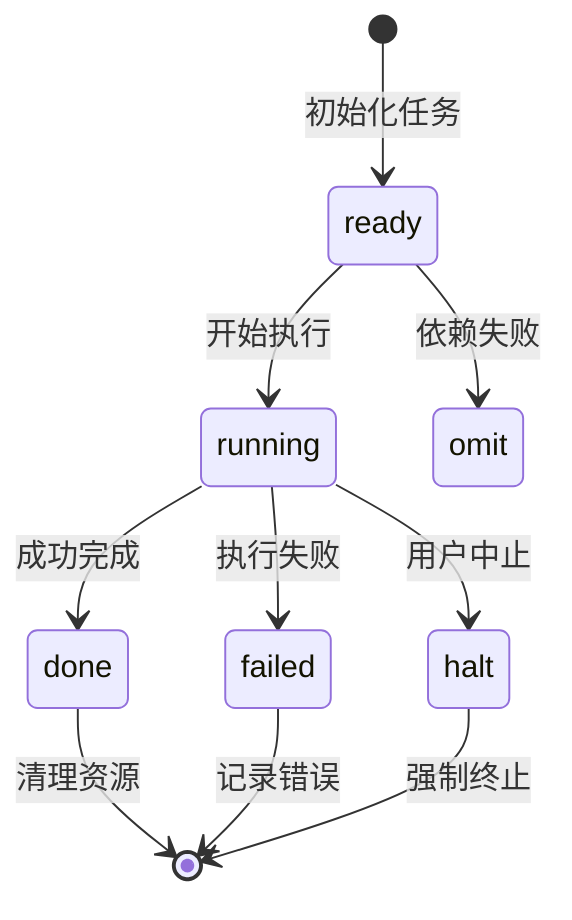
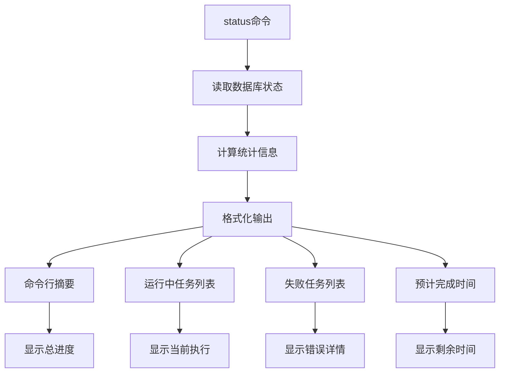

# SQLite测试运行器testrunner.tcl详细文档

<cite>
**本文档中引用的文件**
- [testrunner.tcl](file://test/testrunner.tcl)
- [testrunner_data.tcl](file://test/testrunner_data.tcl)
- [testrunner_estwork.tcl](file://test/testrunner_estwork.tcl)
- [permutations.test](file://test/permutations.test)
- [testrunner.md](file://doc/testrunner.md)
</cite>

## 目录
1. [概述](#概述)
2. [核心架构](#核心架构)
3. [测试模式详解](#测试模式详解)
4. [并行测试调度](#并行测试调度)
5. [数据库管理系统](#数据库管理系统)
6. [配置与选项](#配置与选项)
7. [监控与诊断](#监控与诊断)
8. [实际使用示例](#实际使用示例)
9. [故障排除指南](#故障排除指南)
10. [总结](#总结)

## 概述

SQLite测试运行器testrunner.tcl是一个强大的并行测试调度系统，专门用于管理和执行SQLite的各种测试套件。它通过testrunner.db数据库跟踪测试任务的完整生命周期，并通过testrunner.log记录详细的测试输出。

### 主要功能特性

- **并行测试执行**：支持多进程并行运行测试，充分利用多核CPU资源
- **智能任务调度**：基于工作量估算和优先级的任务分配算法
- **完整的测试生命周期管理**：从准备到完成的全过程跟踪
- **多种测试模式支持**：包括快速测试、完整测试、开发测试等预设组合
- **实时状态监控**：提供status命令进行实时进度监控
- **详细的错误诊断**：通过errors命令展示失败测试的详细信息

## 核心架构

### 系统架构图



**图表来源**
- [testrunner.tcl](file://test/testrunner.tcl#L302-L367)

### 数据库架构设计

testrunner.db采用两层表结构设计：

#### jobs表结构
| 字段名 | 类型 | 描述 |
|--------|------|------|
| jobid | INTEGER PRIMARY KEY | 唯一任务标识符 |
| displaytype | TEXT NOT NULL | 测试类型（如tcl、fuzz、make） |
| displayname | TEXT NOT NULL | 人类可读的任务名称 |
| build | TEXT NOT NULL | 构建配置名称 |
| dirname | TEXT NOT NULL | 子目录名称 |
| cmd | TEXT NOT NULL | 执行的Shell命令 |
| depid | INTEGER | 依赖任务ID |
| priority | INTEGER NOT NULL | 优先级值 |

#### 运行时状态字段
| 字段名 | 类型 | 描述 |
|--------|------|------|
| starttime | INTEGER | 开始时间戳（毫秒） |
| endtime | INTEGER | 结束时间戳 |
| span | INTEGER | 总运行时间（毫秒） |
| estwork | INTEGER | 预估工作量 |
| estkey | TEXT | 工作量计算键 |
| state | TEXT | 任务状态（ready、running、done、failed、omit、halt） |
| ntest | INTEGER | 运行的测试用例数 |
| nerr | INTEGER | 报告的错误数 |
| svers | TEXT | SQLite版本信息 |
| pltfm | TEXT | 平台报告 |
| output | TEXT | 测试输出内容 |

**节来源**
- [testrunner.tcl](file://test/testrunner.tcl#L302-L367)

## 测试模式详解

### 预设测试模式

testrunner.tcl支持多种预设测试模式，每种模式针对不同的测试需求：

#### 1. 快速测试系列



**图表来源**
- [permutations.test](file://test/permutations.test#L200-L250)

#### 2. 开发测试模式

- **mdevtest**：推荐在正常开发检查前运行的测试
  - 包含调试和非调试两种构建配置
  - 覆盖基本功能验证

- **sdevtest**：使用ASAN和UBSAN的开发测试
  - 启用地址和未定义行为检测
  - 更严格的内存安全检查

#### 3. 发布测试模式

- **release**：完整的发布测试套件
  - 在多个平台上运行各种构建配置
  - 包含模糊测试、线程测试等全面验证

#### 4. 全部测试模式

- **all**：包含所有Tcl测试脚本
  - 扩展了"full"测试集
  - 添加了多个排列组合测试

**节来源**
- [testrunner.tcl](file://test/testrunner.tcl#L1364-L1420)

## 并行测试调度

### 并行度控制机制

testrunner.tcl通过智能算法确定最优的并行度：



**图表来源**
- [testrunner.tcl](file://test/testrunner.tcl#L250-L280)

### 工作量估算系统

testrunner.tcl使用动态工作量估算来优化任务分配：

#### 预设工作量值
| 测试类型 | 相对工作量 |
|----------|------------|
| tcl | 1 |
| fuzz | 22 |
| bld | 66 |
| make | 102 |

#### 动态估算算法
系统会根据历史测试数据自动调整工作量估算：
- 计算已完成任务的中位数运行时间
- 基于tcl测试的平均时间标准化其他类型的测试
- 生成新的estwork配置文件

**节来源**
- [testrunner.tcl](file://test/testrunner.tcl#L10-L15)
- [testrunner_estwork.tcl](file://test/testrunner_estwork.tcl#L1-L50)

### 任务依赖关系



**图表来源**
- [testrunner.tcl](file://test/testrunner.tcl#L1489-L1532)

## 数据库管理系统

### 测试任务生命周期

testrunner.tcl通过数据库精确跟踪每个测试任务的状态变化：



### 状态转换规则

#### 正常流程
1. **ready** → **running**：任务开始执行
2. **running** → **done**：任务成功完成
3. **running** → **failed**：任务执行失败

#### 错误处理流程
1. **running** → **failed**：主任务失败
2. **failed** → **omit**：后续依赖任务被跳过

#### 特殊状态
- **omit**：由于依赖失败而跳过的任务
- **halt**：用户手动中止的任务

**节来源**
- [testrunner.tcl](file://test/testrunner.tcl#L355-L365)

### 数据持久化机制

#### 自动提交策略
```tcl
proc r_write_db {script} {
  global TRG
  trdb eval BEGIN
  uplevel $script
  trdb eval COMMIT
}
```

#### 事务保护
- 使用BEGIN/COMMIT确保数据一致性
- 支持嵌套事务操作
- 提供回滚机制防止数据损坏

**节来源**
- [testrunner.tcl](file://test/testrunner.tcl#L1489-L1532)

## 配置与选项

### 核心命令行选项

#### 并行控制选项
- `--jobs NUM`：指定并行进程数量
- `--buildonly`：仅构建测试二进制文件，不运行测试
- `--dryrun`：模拟执行但不实际运行测试

#### 调试和诊断选项
- `--explain`：显示测试计划摘要而不执行
- `--status`：显示实时测试状态
- `--stop-on-error`：遇到第一个错误时停止
- `--stop-on-coredump`：遇到核心转储时停止

#### 高级选项
- `--config CONFIGS`：指定特定的构建配置
- `--omit CONFIGS`：排除特定的构建配置
- `--fuzzdb FILENAME`：使用外部模糊测试数据库
- `--zipvfs DIR`：启用ZipVFS测试

### 环境变量支持

#### NJOB
- 默认并行进程数
- 基于CPU核心数自动计算

#### QUICKTEST_INCLUDE
- 包含额外的测试文件
- 逗号分隔的文件列表

#### QUICKTEST_OMIT
- 排除特定的测试文件
- 支持正则表达式匹配

#### FUZZDB
- 外部模糊测试数据库路径
- 支持大型外部数据库的切片处理

**节来源**
- [testrunner.tcl](file://test/testrunner.tcl#L108-L134)

## 监控与诊断

### 实时状态监控

#### status命令功能


**图表来源**
- [testrunner.tcl](file://test/testrunner.tcl#L600-L700)

#### 状态显示格式
```
Command: [testrunner.tcl 参数列表]
Summary: 01:30:25, 145/200 jobs, 12 errors, 1567 tests
Running: 8 (max: 16) ETC 00:45:30
  testfixture.exe (00:15:23)
  fuzzcheck.exe (00:12:45)
  make.sh (00:08:30)
Failed:  3 (must recent 3 shown)
  sessionfuzz (00:02:15)
  fts5optimize3 (00:01:45)
  rbu10 (00:00:55)
  ... 2 jobs omitted due to failures
```

### 错误诊断工具

#### errors命令功能
- 显示失败测试的详细输出
- 支持详细(verbose)和摘要(summary)模式
- 支持按模式过滤错误信息

#### joblist命令功能
- 列出所有任务及其状态
- 支持按模式搜索任务
- 显示任务类型和状态

### 日志文件系统

#### testrunner.log
- 记录所有测试的详细输出
- 包含错误信息和调试数据
- 支持grep搜索特定错误类型

#### testrunner.db
- 存储任务状态和元数据
- 支持复杂查询和分析
- 提供完整的测试历史记录

**节来源**
- [testrunner.tcl](file://test/testrunner.tcl#L700-L800)

## 实际使用示例

### 基础使用场景

#### 1. 快速开发测试
```bash
# 运行快速测试套件
./testfixture test/testrunner.tcl veryquick

# 指定并行度为8
./testfixture test/testrunner.tcl --jobs 8 veryquick

# 只构建不运行
./testfixture test/testrunner.tcl --buildonly mdevtest
```

#### 2. 完整测试验证
```bash
# 运行完整测试套件
./testfixture test/testrunner.tcl full

# 运行特定模式的测试
./testfixture test/testrunner.tcl release rtree%

# 使用外部模糊测试数据库
./testfixture test/testrunner.tcl --fuzzdb /path/to/db.sqlite releasetest
```

#### 3. 开发阶段测试
```bash
# 开发测试（调试版）
./testfixture test/testrunner.tcl mdevtest

# 开发测试（Sanitizer版）
./testfixture test/testrunner.tcl sdevtest

# 特定配置测试
./testfixture test/testrunner.tcl --config Debug-One,Release-One veryquick
```

### 高级使用场景

#### 1. 并行度调优
```bash
# 查看当前并行度
./testfixture test/testrunner.tcl njob

# 设置新的并行度
./testfixture test/testrunner.tcl njob 12

# 动态调整并行度
echo "12" > testrunner.db
```

#### 2. 测试计划预览
```bash
# 显示测试计划而不执行
./testfixture test/testrunner.tcl --explain mdevtest

# 模拟执行
./testfixture test/testrunner.tcl --dryrun release > dryrun.log
```

#### 3. 状态监控
```bash
# 实时监控状态
./testfixture test/testrunner.tcl status -d 2

# 全屏状态显示（Linux/macOS）
./testfixture test/testrunner.tcl --status

# 查看任务列表
./testfixture test/testrunner.tcl joblist

# 查看错误详情
./testfixture test/testrunner.tcl errors -v
```

### 构建脚本生成

#### 生成构建脚本
```bash
# 生成Linux构建脚本
./testfixture test/testrunner.tcl script Device-One > make.sh

# 生成Windows构建脚本
./testfixture test/testrunner.tcl script -msvc Win32-MemDebug > make.bat

# 查看可用配置
./testfixture test/testrunner.tcl script help
```

**节来源**
- [testrunner.md](file://doc/testrunner.md#L100-L200)

## 故障排除指南

### 常见问题及解决方案

#### 1. 测试运行缓慢
**症状**：测试执行时间异常长
**原因**：并行度设置不当或系统资源不足
**解决方案**：
```bash
# 检查当前并行度
./testfixture test/testrunner.tcl njob

# 调整并行度
./testfixture test/testrunner.tcl njob 4

# 使用--dryrun检查任务分布
./testfixture test/testrunner.tcl --dryrun veryquick
```

#### 2. 内存不足错误
**症状**：测试过程中出现内存分配失败
**原因**：并行度过高或系统内存不足
**解决方案**：
```bash
# 减少并行度
./testfixture test/testrunner.tcl njob 2

# 使用--buildonly减少内存使用
./testfixture test/testrunner.tcl --buildonly mdevtest
```

#### 3. 数据库锁定问题
**症状**：testrunner.db无法访问
**原因**：多个实例同时运行或权限问题
**解决方案**：
```bash
# 检查数据库文件
ls -la testrunner.db

# 删除损坏的数据库
rm testrunner.db

# 重新初始化
./testfixture test/testrunner.tcl veryquick
```

#### 4. 测试失败分析
**步骤1**：查看失败任务
```bash
./testfixture test/testrunner.tcl errors
```

**步骤2**：查看详细错误
```bash
./testfixture test/testrunner.tcl errors -v
```

**步骤3**：查看任务列表
```bash
./testfixture test/testrunner.tcl joblist failed
```

#### 5. 状态监控问题
**症状**：status命令显示不正确
**解决方案**：
```bash
# 检查数据库完整性
sqlite3 testrunner.db ".schema"

# 重置状态
./testfixture test/testrunner.tcl halt
```

### 性能优化建议

#### 1. 网络存储优化
- 将测试目录移动到本地磁盘
- 使用SSD提高I/O性能
- 避免网络文件系统的延迟影响

#### 2. 内存管理优化
- 确保有足够的可用内存
- 关闭不必要的后台程序
- 考虑使用swap空间

#### 3. CPU利用率优化
- 根据实际核心数调整并行度
- 避免与其他CPU密集型任务竞争
- 使用top/htop监控CPU使用情况

**节来源**
- [testrunner.md](file://doc/testrunner.md#L300-L405)

## 总结

SQLite测试运行器testrunner.tcl是一个功能强大且设计精良的测试管理系统。它通过以下关键特性为SQLite项目的质量保证提供了坚实的基础：

### 核心优势

1. **智能并行调度**：自动优化并行度，充分利用硬件资源
2. **完整的生命周期管理**：从任务创建到结果收集的全流程跟踪
3. **灵活的测试模式**：满足不同阶段和场景的测试需求
4. **强大的监控能力**：提供实时状态监控和详细的错误诊断
5. **高度可配置性**：支持丰富的命令行选项和环境变量

### 最佳实践建议

1. **开发阶段**：使用mdevtest进行日常验证
2. **代码提交前**：运行sdevtest确保内存安全
3. **发布前**：执行release测试进行全面验证
4. **持续集成**：结合CI/CD系统自动化测试流程
5. **性能测试**：定期运行性能基准测试

### 未来发展方向

随着SQLite项目的不断发展，testrunner.tcl也在持续演进：
- 支持更多的测试类型和平台
- 改进工作量估算算法
- 增强云环境下的测试支持
- 提供更丰富的可视化报告

通过深入理解和正确使用testrunner.tcl，开发者可以显著提高SQLite项目的质量和开发效率，确保代码变更不会引入回归问题，为用户提供稳定可靠的数据库解决方案。