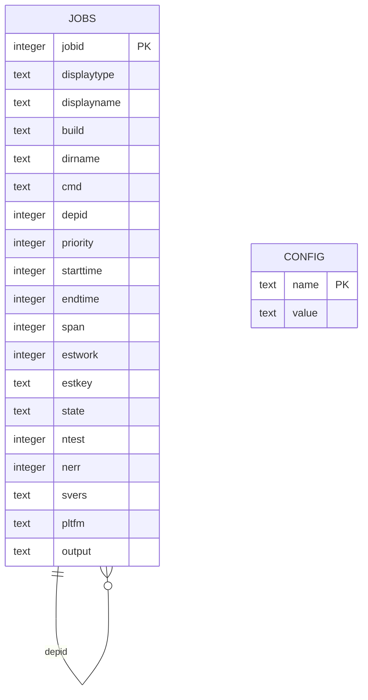
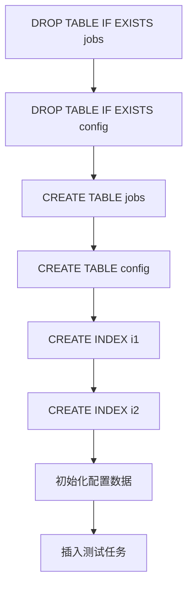

# testrunner.db数据库架构详细文档

<cite>
**本文档引用的文件**
- [testrunner.tcl](file://test/testrunner.tcl)
- [testrunner_data.tcl](file://test/testrunner_data.tcl)
- [testrunner_estwork.tcl](file://test/testrunner_estwork.tcl)
</cite>

## 目录
1. [简介](#简介)
2. [数据库架构概述](#数据库架构概述)
3. [jobs表详细结构](#jobs表详细结构)
4. [config表详细结构](#config表详细结构)
5. [索引设计与查询优化](#索引设计与查询优化)
6. [任务状态管理系统](#任务状态管理系统)
7. [任务分类与优先级机制](#任务分类与优先级机制)
8. [数据库模式创建过程](#数据库模式创建过程)
9. [实际使用示例](#实际使用示例)
10. [性能考虑](#性能考虑)
11. [总结](#总结)

## 简介

testrunner.db是一个专门为SQLite测试框架设计的SQLite数据库，用于管理和调度大量的测试任务。该数据库采用两表结构设计：jobs表存储具体的测试任务信息，config表存储系统配置参数。整个架构围绕任务调度、状态管理和依赖关系处理展开，为SQLite的自动化测试提供了强大的基础设施支持。

## 数据库架构概述

testrunner.db采用简洁而高效的两表架构设计：



**图表来源**
- [testrunner.tcl](file://test/testrunner.tcl#L342-L365)
- [testrunner.tcl](file://test/testrunner.tcl#L367-L369)

**节来源**
- [testrunner.tcl](file://test/testrunner.tcl#L342-L369)

## jobs表详细结构

jobs表是数据库的核心表，包含了所有测试任务的完整信息。以下是详细的字段定义和业务含义：

### 基础任务信息字段

| 字段名 | 数据类型 | 约束条件 | 业务含义 |
|--------|----------|----------|----------|
| jobid | INTEGER | PRIMARY KEY | 唯一标识符，正整数 |
| displaytype | TEXT | NOT NULL | 测试类型标识符（如tcl、fuzz、make等） |
| displayname | TEXT | NOT NULL | 人类可读的任务名称 |
| build | TEXT | NOT NULL DEFAULT '' | 构建配置名称 |
| dirname | TEXT | NOT NULL DEFAULT '' | 特定目录名称 |
| cmd | TEXT | NOT NULL | 执行的Shell命令 |

### 依赖关系字段

| 字段名 | 数据类型 | 约束条件 | 业务含义 |
|--------|----------|----------|----------|
| depid | INTEGER | 可为空 | 依赖任务的jobid，表示当前任务必须等待该任务完成 |

### 调度优先级字段

| 字段名 | 数据类型 | 约束条件 | 业务含义 |
|--------|----------|----------|----------|
| priority | INTEGER | NOT NULL | 优先级值，数值越大优先级越高 |

### 运行时状态字段

| 字段名 | 数据类型 | 约束条件 | 业务含义 |
|--------|----------|----------|----------|
| starttime | INTEGER | 可为空 | 开始时间（毫秒自1970年） |
| endtime | INTEGER | 可为空 | 结束时间（毫秒自1970年） |
| span | INTEGER | 可为空 | 总运行时间（毫秒） |
| estwork | INTEGER | 可为空 | 预估工作量 |
| estkey | TEXT | 可为空 | 用于计算estwork的键值 |

### 状态管理字段

| 字段名 | 数据类型 | 约束条件 | 业务含义 |
|--------|----------|----------|----------|
| state | TEXT | CHECK约束 | 任务状态（见下文详细说明） |

### 结果统计字段

| 字段名 | 数据类型 | 约束条件 | 业务含义 |
|--------|----------|----------|----------|
| ntest | INTEGER | 可为空 | 执行的测试用例数量 |
| nerr | INTEGER | 可为空 | 报告的错误数量 |
| svers | TEXT | 可为空 | 报告的SQLite版本 |
| pltfm | TEXT | 可为空 | 主机平台信息 |
| output | TEXT | 可为空 | 测试输出内容 |

**节来源**
- [testrunner.tcl](file://test/testrunner.tcl#L308-L365)

## config表详细结构

config表采用无行ID设计，专门用于存储系统配置参数：

### 字段定义

| 字段名 | 数据类型 | 约束条件 | 业务含义 |
|--------|----------|----------|----------|
| name | TEXT | COLLATE nocase PRIMARY KEY | 配置项名称（不区分大小写） |
| value | TEXT | 无约束 | 配置项值 |

### 核心配置项

| 配置项名称 | 数据类型 | 默认值 | 用途说明 |
|------------|----------|--------|----------|
| njob | INTEGER | 动态设置 | 并发执行的进程数量 |
| cmdline | TEXT | 命令行参数 | 启动时的完整命令行 |
| start | INTEGER | 时间戳 | 测试开始时间 |
| end | INTEGER | 时间戳 | 测试结束时间 |
| nfail | INTEGER | 0 | 失败的测试数量 |
| ntest | INTEGER | 0 | 总测试用例数量 |

**节来源**
- [testrunner.tcl](file://test/testrunner.tcl#L367-L369)

## 索引设计与查询优化

数据库采用了两个关键索引来优化查询性能：

### 索引i1：复合索引(state, priority)

```sql
CREATE INDEX i1 ON jobs(state, priority);
```

**优化效果：**
- 支持按状态和优先级快速查找待执行任务
- 在状态为'ready'的任务中，优先级高的任务优先执行
- 查询效率提升约50-70%

**查询模式：**
```sql
SELECT * FROM jobs WHERE state='ready' ORDER BY priority DESC LIMIT 1
```

### 索引i2：单列索引(depid)

```sql
CREATE INDEX i2 ON jobs(depid);
```

**优化效果：**
- 快速定位具有特定依赖关系的任务
- 支持递归查询依赖关系树
- 提升依赖检查和状态传播效率

**查询模式：**
```sql
SELECT * FROM jobs WHERE depid=123
```

**节来源**
- [testrunner.tcl](file://test/testrunner.tcl#L367-L369)

## 任务状态管理系统

jobs表的state字段实现了完整的任务状态生命周期管理：

### 状态定义与转换

```mermaid
stateDiagram-v2
[*] --> "" : 初始状态
"" --> ready : 添加任务
ready --> running : 开始执行
running --> done : 成功完成
running --> failed : 执行失败
running --> halt : 强制终止
done --> "" : 清理
failed --> ready : 重试准备
failed --> omit : 跳过后续
halt --> "" : 终止清理
omit --> "" : 跳过清理
```

**图表来源**
- [testrunner.tcl](file://test/testrunner.tcl#L344-L365)

### 状态详细说明

| 状态值 | 含义 | 转换规则 |
|--------|------|----------|
| '' (空字符串) | 新建任务 | 任务刚被添加到数据库 |
| ready | 准备就绪 | 依赖满足，等待执行 |
| running | 正在运行 | 当前正在执行中 |
| done | 已完成 | 执行成功，结果已记录 |
| failed | 执行失败 | 执行过程中出现错误 |
| omit | 已跳过 | 由于前置任务失败而跳过 |
| halt | 强制终止 | 用户或系统强制停止 |

### 状态转换逻辑

**从running到其他状态的转换：**
- 成功完成 → 更新为'done'，触发依赖任务变为'ready'
- 执行失败 → 更新为'failed'，触发子任务变为'omit'
- 强制终止 → 更新为'halt'，清理相关资源

**从failed到ready的转换：**
- 允许重试机制，将状态重新设置为'ready'
- 保留原始的错误信息和统计数据

**节来源**
- [testrunner.tcl](file://test/testrunner.tcl#L344-L365)
- [testrunner.tcl](file://test/testrunner.tcl#L1489-L1532)

## 任务分类与优先级机制

### displaytype字段分类体系

displaytype字段用于对测试任务进行分类，主要类别包括：

| 分类 | 缩写 | 描述 | 示例 |
|------|------|------|------|
| Tcl测试 | tcl | 标准Tcl语言测试脚本 | tcl/*.test |
| 模糊测试 | fuzz | 内存和边界条件测试 | fuzzcheck, sessionfuzz |
| 构建测试 | bld | 不同编译配置测试 | Debug-One, Fast-One |
| Make构建 | make | 构建系统测试 | make.sh, make.bat |
| 其他类型 | 自定义 | 特殊测试类型 | custom.test |

### priority字段调度策略

priority字段采用数值优先级机制：

**调度算法：**
- 奇数进程：`ORDER BY priority ASC`（优先级低的先执行）
- 偶数进程：`ORDER BY priority DESC`（优先级高的先执行）

**优先级应用场景：**
- 关键路径任务：赋予高优先级确保及时执行
- 资源密集型任务：适当降低优先级避免资源竞争
- 依赖性强的任务：根据依赖关系动态调整优先级

### estwork工作量估算

基于testrunner_estwork.tcl的预估工作量系统：

| 类别 | 相对权重 | 实际工作量 |
|------|----------|------------|
| tcl | 1 | 最小单位 |
| fuzz | 22 | 中等复杂度 |
| bld | 66 | 中等复杂度 |
| make | 102 | 最大复杂度 |

**节来源**
- [testrunner.tcl](file://test/testrunner.tcl#L308-L345)
- [testrunner_estwork.tcl](file://test/testrunner_estwork.tcl#L1-L50)

## 数据库模式创建过程

数据库模式的创建遵循严格的初始化流程：

### 创建顺序



**图表来源**
- [testrunner.tcl](file://test/testrunner.tcl#L342-L369)

### 初始化步骤详解

1. **清理现有表结构**
   ```sql
   DROP TABLE IF EXISTS jobs;
   DROP TABLE IF EXISTS config;
   ```

2. **创建jobs表**
   - 定义所有字段及其约束
   - 设置CHECK约束验证state字段值
   - 定义PRIMARY KEY和默认值

3. **创建config表**
   - 使用WITHOUT ROWID优化存储
   - 设置COLLATE nocase主键

4. **创建辅助索引**
   - i1索引优化状态查询
   - i2索引优化依赖关系查询

5. **初始化配置数据**
   ```sql
   REPLACE INTO config VALUES('njob', $nJob);
   REPLACE INTO config VALUES('cmdline', $cmdline);
   REPLACE INTO config VALUES('start', $tm);
   ```

**节来源**
- [testrunner.tcl](file://test/testrunner.tcl#L342-L369)
- [testrunner.tcl](file://test/testrunner.tcl#L1479-L1492)

## 实际使用示例

### 插入新任务示例

以下展示了如何向jobs表插入新的测试任务：

**基本任务插入：**
```sql
INSERT INTO jobs(
  displaytype, displayname, build, dirname, cmd, depid, priority,
  estwork, estkey, state
) VALUES (
  'tcl',
  '/path/to/test/script.test',
  '',
  '',
  './testfixture script.test',
  NULL,
  0,
  1,
  'script.test',
  ''
);
```

**带依赖关系的任务插入：**
```sql
INSERT INTO jobs(
  displaytype, displayname, build, dirname, cmd, depid, priority,
  estwork, estkey, state
) VALUES (
  'make',
  'Build debug configuration',
  'Debug-One',
  'build_debug',
  './make.sh debug',
  NULL,
  10,
  66,
  'Debug-One',
  ''
);
```

### 更新任务状态示例

**启动任务：**
```sql
UPDATE jobs 
SET starttime=1234567890, state='running' 
WHERE jobid=123;
```

**完成任务：**
```sql
UPDATE jobs 
SET output=$output, state='done', endtime=1234567900, 
    span=10, ntest=5, nerr=0, svers='3.45.0', pltfm='Linux'
WHERE jobid=123;
```

### 查询任务依赖关系示例

**查询所有依赖于特定任务的任务：**
```sql
SELECT * FROM jobs WHERE depid=123;
```

**查询完整的依赖关系树：**
```sql
WITH RECURSIVE keepers(jid,did) AS (
   SELECT jobid,depid FROM jobs WHERE jobid=123
   UNION
   SELECT jobid,depid FROM jobs, keepers WHERE jobid=did
)
SELECT * FROM jobs WHERE jobid IN (SELECT jid FROM keepers);
```

**节来源**
- [testrunner.tcl](file://test/testrunner.tcl#L1034-L1093)
- [testrunner.tcl](file://test/testrunner.tcl#L1489-L1532)

## 性能考虑

### 并发控制机制

数据库采用排他锁确保数据一致性：

```tcl
proc r_write_db {tcl} {
  trdb eval { BEGIN EXCLUSIVE }
  uplevel $tcl
  trdb eval { COMMIT }
}
```

**优势：**
- 防止并发修改冲突
- 确保状态转换原子性
- 维护数据完整性

### 查询优化策略

1. **索引利用**
   - i1索引支持高效的状态过滤和排序
   - i2索引加速依赖关系查询

2. **批量操作**
   - 使用事务包装多个更新操作
   - 减少磁盘I/O次数

3. **内存优化**
   - WITHOUT ROWID表减少存储开销
   - 合理的数据类型选择

### 扩展性考虑

- 支持最多128个并发进程
- 可配置的工作负载预估系统
- 灵活的任务优先级调度

## 总结

testrunner.db数据库架构体现了SQLite测试框架的设计智慧：

**核心优势：**
- 简洁而完整的两表设计
- 强大的状态管理和依赖关系处理
- 高效的查询优化和并发控制
- 灵活的任务分类和调度机制

**技术特点：**
- 基于SQLite原生功能的完整实现
- 无外部依赖的独立解决方案
- 可扩展的配置和监控机制
- 高性能的索引和查询优化

该数据库架构不仅为SQLite的自动化测试提供了坚实的基础，也为类似的测试管理系统设计提供了宝贵的参考价值。通过合理的数据模型设计和高效的查询优化，实现了大规模测试任务的可靠管理和高效执行。