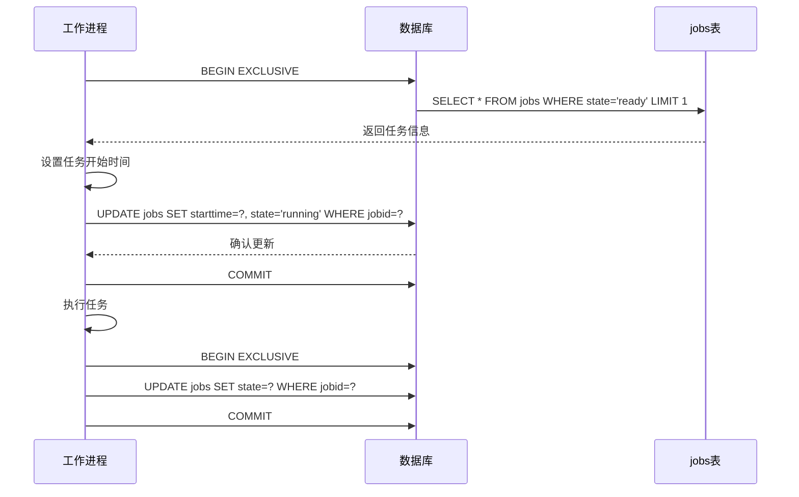
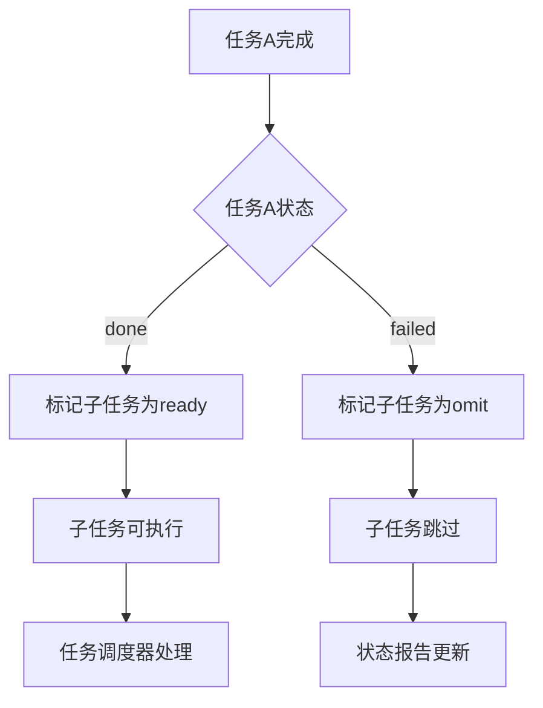
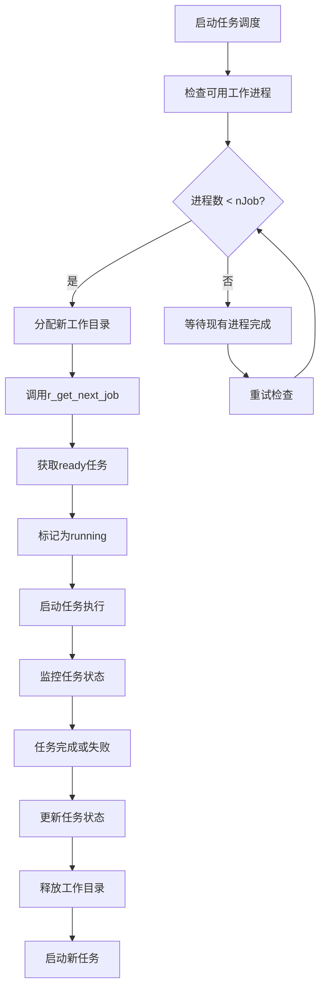
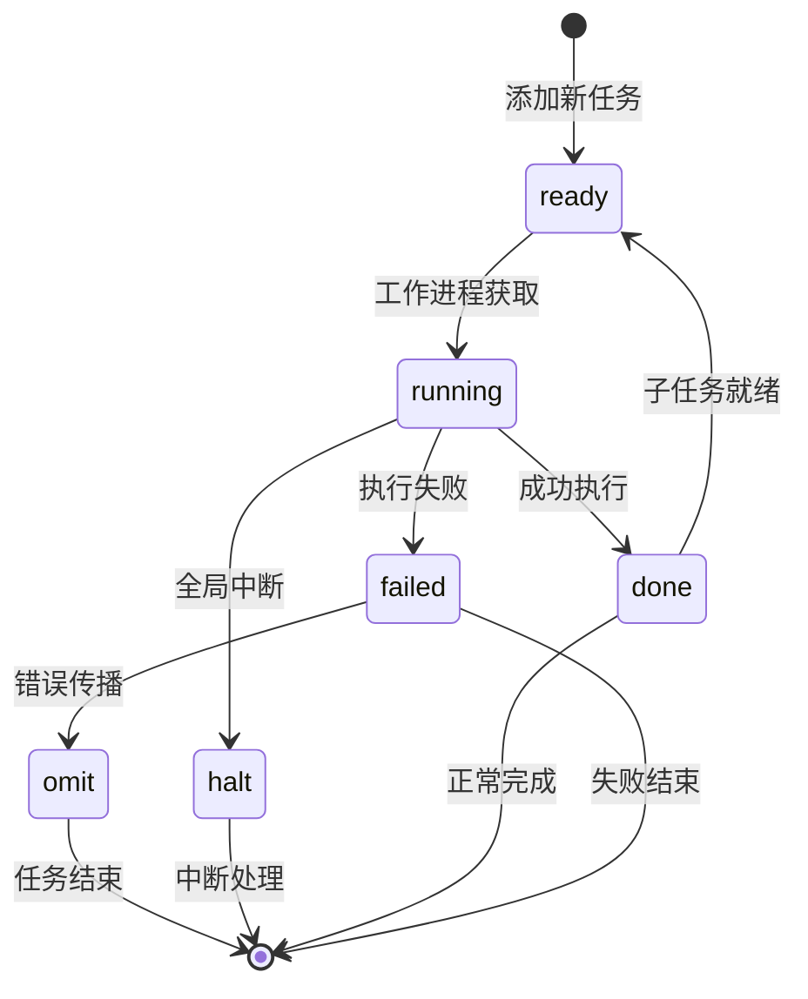

# 状态模型

<cite>
**本文档引用的文件**
- [testrunner.tcl](file://test/testrunner.tcl)
- [testrunner_data.tcl](file://test/testrunner_data.tcl)
</cite>

## 目录
1. [简介](#简介)
2. [jobs表结构概述](#jobs表结构概述)
3. [五种核心状态详解](#五种核心状态详解)
4. [状态转换机制](#状态转换机制)
5. [分布式任务协调](#分布式任务协调)
6. [状态转换图](#状态转换图)
7. [代码实现分析](#代码实现分析)
8. [性能优化考虑](#性能优化考虑)
9. [故障排除指南](#故障排除指南)
10. [总结](#总结)

## 简介

SQLite测试框架中的jobs表采用了一套精密的状态管理系统，用于协调和控制大量并发测试任务的执行。该系统通过五种核心状态（ready、running、done、failed、halt）实现了分布式任务调度、状态跟踪和错误处理的完整生命周期管理。

本文档深入分析了jobs表中state字段的五种核心状态，详细说明了它们的触发条件、转换逻辑以及在分布式任务协调中的重要作用。

## jobs表结构概述

jobs表是SQLite测试框架的核心数据结构，用于存储所有待执行测试任务的元数据和状态信息：

```mermaid
erDiagram
JOBS {
integer jobid PK
text displaytype
text displayname
text build
text dirname
text cmd
integer depid FK
integer priority
integer starttime
integer endtime
integer span
integer estwork
text estkey
text state CHECK
integer ntest
integer nerr
text svers
text pltfm
text output
}
CONFIG {
text name PK
text value
}
JOBS ||--o{ CONFIG : "has"
```

**图表来源**
- [testrunner.tcl](file://test/testrunner.tcl#L308-L365)

**节来源**
- [testrunner.tcl](file://test/testrunner.tcl#L308-L365)

## 五种核心状态详解

### ready状态

**触发条件：**
- 新建任务时自动设置为ready
- 依赖任务完成后重新标记为ready
- 使用`add_job`函数添加新任务时

**特性：**
- 表示任务已准备好等待执行
- 可以被多个工作进程同时获取
- 具有优先级排序机制

**节来源**
- [testrunner.tcl](file://test/testrunner.tcl#L1034-L1093)

### running状态

**触发条件：**
- 工作进程从ready状态获取任务
- 执行`r_get_next_job`函数时

**关键特性：**
- 防止任务被重复调度：通过exclusive事务确保同一时间只有一个进程能将任务标记为running
- 记录开始时间：自动设置starttime字段
- 标记为活跃执行：在状态转换过程中建立排他性锁定

**节来源**
- [testrunner.tcl](file://test/testrunner.tcl#L961-L1038)

### done状态

**触发条件：**
- 任务成功执行完成
- `mark_job_as_finished`函数正常执行
- 任务输出解析成功

**后续影响：**
- 子任务状态更新：自动将依赖当前任务的所有子任务标记为ready
- 统计信息更新：更新配置表中的测试计数器
- 输出记录保存：保存任务执行结果到output字段

**节来源**
- [testrunner.tcl](file://test/testrunner.tcl#L1489-L1532)

### failed状态

**触发条件：**
- 任务执行过程中发生错误
- 脚本输入读取失败
- 任务返回非零退出码

**关键行为：**
- 错误传播：自动将依赖当前任务的所有子任务标记为omit
- 错误计数：更新配置表中的失败计数器
- 任务终止：停止进一步的任务执行（如果启用了stopOnError选项）

**节来源**
- [testrunner.tcl](file://test/testrunner.tcl#L1489-L1532)

### halt状态

**触发条件：**
- 执行`halt`命令时
- 使用`UPDATE jobs SET state='halt' WHERE state IN ('ready','')`语句

**全局中断机制：**
- 立即停止所有ready状态的任务
- 不影响正在运行的任务
- 提供紧急停止功能
- 支持优雅的系统关闭

**节来源**
- [testrunner.tcl](file://test/testrunner.tcl#L440-L461)

## 状态转换机制

### 排他性事务保护

状态转换通过排他性事务确保原子性和一致性：



**图表来源**
- [testrunner.tcl](file://test/testrunner.tcl#L961-L1038)
- [testrunner.tcl](file://test/testrunner.tcl#L1489-L1532)

### 依赖关系处理



**图表来源**
- [testrunner.tcl](file://test/testrunner.tcl#L1519)

**节来源**
- [testrunner.tcl](file://test/testrunner.tcl#L1489-L1532)

## 分布式任务协调

### 并发控制机制

测试框架支持多进程并发执行，通过以下机制确保协调：

1. **工作进程池管理**：使用`nJob`配置控制最大并发数
2. **目录分配策略**：每个工作进程分配独立的工作目录
3. **状态同步**：通过数据库状态保持所有进程间的一致性

### 任务调度算法



**图表来源**
- [testrunner.tcl](file://test/testrunner.tcl#L1713-L1761)

**节来源**
- [testrunner.tcl](file://test/testrunner.tcl#L1713-L1761)

## 状态转换图



## 代码实现分析

### 状态检查与更新函数

#### r_get_next_job函数

该函数负责从ready状态的任务中选择下一个要执行的任务：

**关键实现要点：**
- 使用exclusive事务确保排他性访问
- 支持基于优先级的轮询调度
- 自动设置任务开始时间和状态

#### mark_job_as_finished函数

该函数处理任务完成后的状态更新和依赖关系处理：

**核心逻辑：**
1. 解析任务输出获取测试统计信息
2. 更新任务的基本状态信息
3. 根据任务结果决定子任务状态
4. 更新全局统计计数器

#### launch_another_job函数

该函数启动新的任务实例：

**执行流程：**
1. 获取下一个ready任务
2. 创建任务工作目录
3. 准备执行脚本
4. 启动异步任务执行
5. 注册状态监控回调

**节来源**
- [testrunner.tcl](file://test/testrunner.tcl#L961-L1038)
- [testrunner.tcl](file://test/testrunner.tcl#L1489-L1532)
- [testrunner.tcl](file://test/testrunner.tcl#L1589-L1713)

### UPDATE语句分析

testrunner.tcl中使用了多个关键的UPDATE语句来维护状态转换：

1. **任务获取更新**：
   ```sql
   UPDATE jobs SET starttime=$tm, state='running' WHERE jobid=$jobid
   ```

2. **任务完成更新**：
   ```sql
   UPDATE jobs SET state=$state WHERE jobid=$jobid
   ```

3. **子任务状态更新**：
   ```sql
   UPDATE jobs SET state=$childstate WHERE depid=$jobid AND state!='halt'
   ```

4. **全局状态更新**：
   ```sql
   UPDATE config SET value=value+$nerr WHERE name='nfail'
   ```

**节来源**
- [testrunner.tcl](file://test/testrunner.tcl#L1000)
- [testrunner.tcl](file://test/testrunner.tcl#L1519)

## 性能优化考虑

### 索引策略

jobs表使用了两个关键索引来优化查询性能：

1. **状态优先级索引**：`(state, priority)` - 支持高效的ready任务查找
2. **依赖关系索引**：`(depid)` - 加速子任务状态更新

### 并发优化

1. **排他性事务**：确保状态转换的原子性
2. **异步I/O**：使用文件事件监控任务输出
3. **连接池管理**：复用数据库连接减少开销

### 内存管理

1. **流式处理**：避免加载大任务输出到内存
2. **及时清理**：任务完成后立即释放资源
3. **缓存策略**：缓存频繁访问的配置信息

## 故障排除指南

### 常见问题诊断

#### 任务卡在ready状态

**可能原因：**
- 工作进程数量不足
- 数据库连接超时
- 系统资源限制

**解决方案：**
- 检查`njob`配置
- 验证数据库连接
- 监控系统资源使用

#### 任务重复执行

**可能原因：**
- 事务未正确提交
- 数据库锁定问题
- 并发冲突

**解决方案：**
- 检查事务日志
- 验证数据库完整性
- 调整并发参数

#### 状态不一致

**可能原因：**
- 异常中断导致状态损坏
- 并发访问冲突
- 数据库损坏

**解决方案：**
- 运行数据库完整性检查
- 重建损坏的状态
- 实施更严格的错误处理

### 调试工具

1. **status命令**：实时查看任务状态
2. **joblist命令**：列出所有任务及其状态
3. **errors命令**：查看失败任务的详细信息
4. **halt命令**：紧急停止所有任务

**节来源**
- [testrunner.tcl](file://test/testrunner.tcl#L658-L725)
- [testrunner.tcl](file://test/testrunner.tcl#L725-L783)

## 总结

SQLite测试框架中的jobs表状态模型是一个精心设计的分布式任务管理系统，通过五种核心状态（ready、running、done、failed、halt）实现了：

1. **完整的生命周期管理**：从任务创建到完成的全过程跟踪
2. **可靠的并发控制**：通过排他性事务确保状态转换的一致性
3. **智能的依赖处理**：自动处理任务间的依赖关系和错误传播
4. **灵活的调度策略**：支持优先级调度和动态负载均衡
5. **强大的错误恢复**：提供多种错误处理和恢复机制

该状态模型不仅保证了测试任务的可靠执行，还为大规模并行测试提供了坚实的基础架构。通过深入理解这些状态转换机制，开发者可以更好地利用SQLite测试框架进行软件质量保证和性能验证。