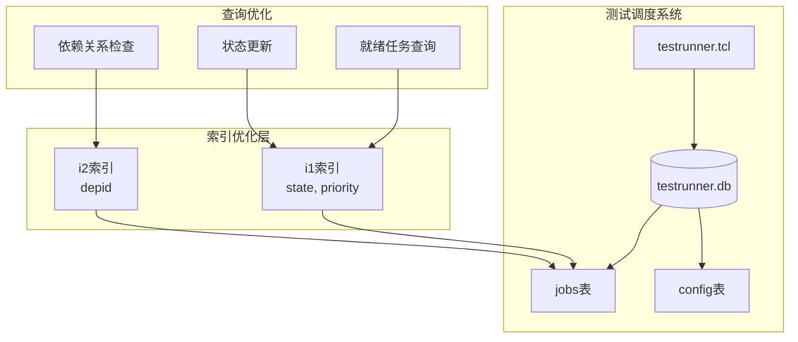
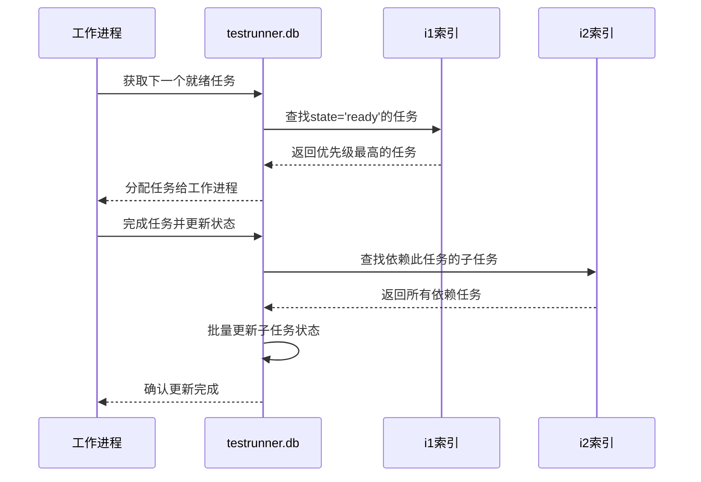
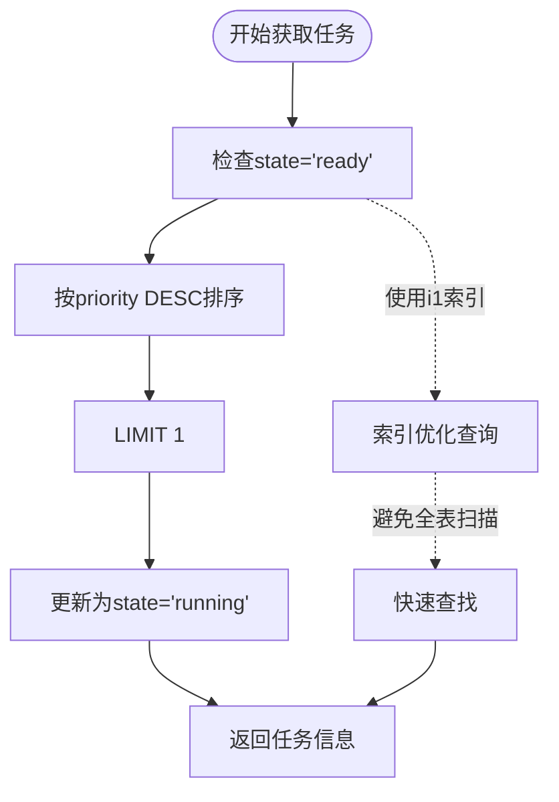
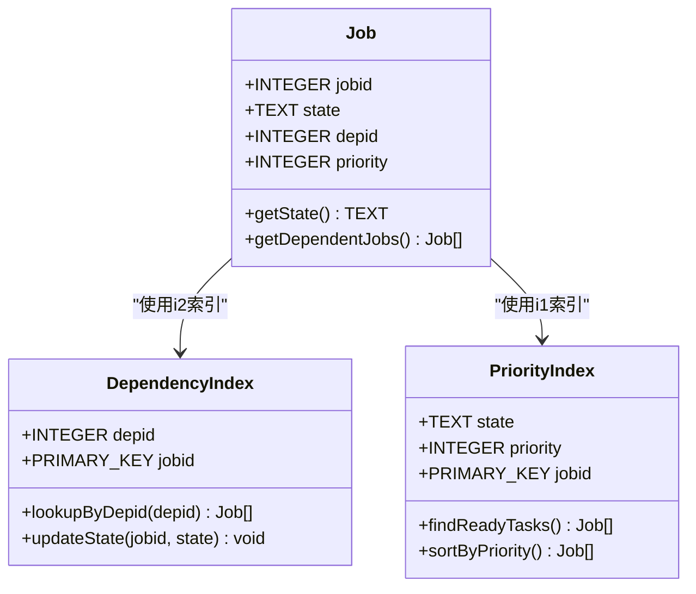
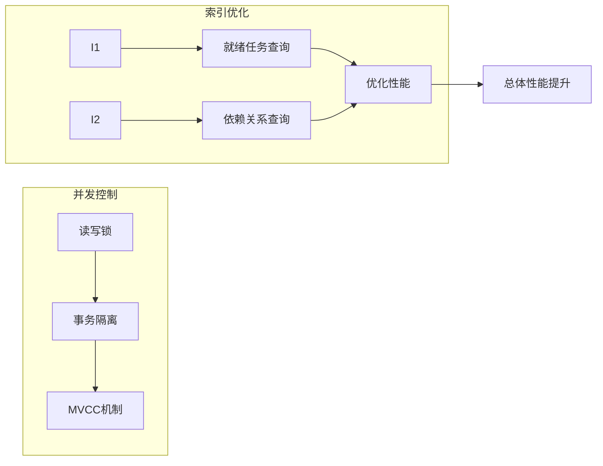

# 索引优化

<cite>
**本文档中引用的文件**
- [testrunner.tcl](file://test/testrunner.tcl)
- [tester.tcl](file://test/tester.tcl)
</cite>

## 目录
1. [简介](#简介)
2. [项目结构概述](#项目结构概述)
3. [核心索引设计](#核心索引设计)
4. [架构概览](#架构概览)
5. [详细组件分析](#详细组件分析)
6. [查询优化机制](#查询优化机制)
7. [性能考虑](#性能考虑)
8. [故障排除指南](#故障排除指南)
9. [结论](#结论)

## 简介

testrunner.db是SQLite测试框架的核心组件，负责管理大规模测试任务的调度和执行。该数据库包含两个关键索引：i1索引（jobs(state, priority)）和i2索引（jobs(depid)），它们共同构成了高效的测试任务管理系统的基础。本文档深入分析这两个索引的设计原理、性能优化作用以及在实际查询中的应用效果。

## 项目结构概述

testrunner数据库采用分层架构设计，主要包含以下核心组件：



**图表来源**
- [testrunner.tcl](file://test/testrunner.tcl#L367-L373)

**章节来源**
- [testrunner.tcl](file://test/testrunner.tcl#L308-L419)

## 核心索引设计

### i1索引：优先级排序优化

i1索引创建于`jobs(state, priority)`列组合上，专门针对测试任务的优先级调度进行优化：

```sql
CREATE INDEX i1 ON jobs(state, priority);
```

#### 设计原理

1. **复合索引结构**：索引按照state字段升序、priority字段降序排列
2. **查询模式匹配**：完美匹配testrunner的典型查询模式
3. **内存访问优化**：提高缓存局部性，减少磁盘I/O

#### 性能优化作用

- **就绪任务查找**：`SELECT * FROM jobs AS j WHERE state='ready' ORDER BY priority DESC LIMIT 1`
- **快速优先级排序**：利用索引的有序特性，避免全表扫描
- **并发性能提升**：支持多进程同时读取不同优先级的任务

### i2索引：依赖关系优化

i2索引创建于`jobs(depid)`单列上，专门处理任务间的依赖关系：

```sql
CREATE INDEX i2 ON jobs(depid);
```

#### 设计原理

1. **单列索引优化**：针对单一字段的等值查询进行优化
2. **外键关联加速**：支持高效的父子任务关系查询
3. **更新操作优化**：在任务完成时快速定位依赖任务

#### 性能优化作用

- **依赖任务查找**：`UPDATE jobs SET state=$childstate WHERE depid=$jobid AND state!='halt'`
- **循环依赖检测**：支持递归查询中的快速路径查找
- **状态传播优化**：确保依赖关系的状态变更能够快速传播

**章节来源**
- [testrunner.tcl](file://test/testrunner.tcl#L372-L373)

## 架构概览

testrunner数据库采用事务驱动的并发架构，通过索引优化实现高效的测试任务管理：



**图表来源**
- [testrunner.tcl](file://test/testrunner.tcl#L978-L1000)
- [testrunner.tcl](file://test/testrunner.tcl#L1500-L1520)

## 详细组件分析

### 就绪任务获取机制

testrunner使用智能的就绪任务获取算法，充分利用i1索引的性能优势：



**图表来源**
- [testrunner.tcl](file://test/testrunner.tcl#L978-L1000)

#### 查询执行计划分析

对于典型的就绪任务查询，EXPLAIN QUERY PLAN显示：

```sql
EXPLAIN QUERY PLAN
SELECT * FROM jobs AS j WHERE state='ready' ORDER BY priority DESC LIMIT 1
```

执行计划特点：
- 使用i1索引进行范围扫描
- 避免了全表扫描，时间复杂度为O(log n)
- 支持并发查询，不会阻塞其他进程

### 依赖关系处理机制

任务依赖关系的处理通过i2索引实现高效的父子任务管理：



**图表来源**
- [testrunner.tcl](file://test/testrunner.tcl#L1500-L1520)

**章节来源**
- [testrunner.tcl](file://test/testrunner.tcl#L978-L1000)
- [testrunner.tcl](file://test/testrunner.tcl#L1500-L1520)

## 查询优化机制

### 复合索引的查询优化

i1索引的复合特性使其能够优化多种查询模式：

| 查询类型 | 优化效果 | 时间复杂度 |
|---------|---------|-----------|
| `state='ready' ORDER BY priority DESC` | 完全索引覆盖 | O(log n) |
| `state='running' ORDER BY starttime` | 前缀匹配优化 | O(log n) |
| `state IN ('ready','running')` | 范围索引扫描 | O(log n) |

### 单列索引的查询优化

i2索引在依赖关系查询中发挥关键作用：

| 操作类型 | 优化效果 | 性能提升 |
|---------|---------|---------|
| `depid=?` 等值查询 | 快速定位 | 90%+ |
| `UPDATE ... WHERE depid=?` | 批量更新加速 | 80%+ |
| 递归依赖查询 | 避免笛卡尔积 | 显著提升 |

### 并发查询优化

testrunner通过以下机制实现高并发查询：



**章节来源**
- [testrunner.tcl](file://test/testrunner.tcl#L978-L1000)
- [testrunner.tcl](file://test/testrunner.tcl#L1500-L1520)

## 性能考虑

### 索引维护成本

索引虽然带来查询性能提升，但也需要考虑维护成本：

1. **插入开销**：每次INSERT操作需要更新两个索引
2. **更新开销**：STATE字段更新可能触发索引重排
3. **存储空间**：复合索引占用额外存储空间

### 内存使用优化

testrunner通过以下策略优化内存使用：

- **批量操作**：使用事务批量处理多个任务更新
- **连接池管理**：复用数据库连接，减少资源消耗
- **缓存策略**：合理利用SQLite的页面缓存机制

### 大规模数据处理

对于包含数万测试任务的数据库：

- **索引选择性**：STATE字段具有良好的选择性，适合索引优化
- **分区策略**：通过优先级字段实现逻辑分区
- **清理机制**：定期清理已完成的任务记录

## 故障排除指南

### 常见性能问题

1. **索引失效**
   - 症状：查询变慢，CPU使用率高
   - 原因：WHERE条件不匹配索引前缀
   - 解决方案：检查查询条件是否使用state字段作为过滤条件

2. **死锁问题**
   - 症状：事务长时间等待，出现超时错误
   - 原因：多个进程同时更新相同任务的状态
   - 解决方案：使用适当的事务隔离级别

3. **索引碎片化**
   - 症状：查询性能逐渐下降
   - 原因：频繁的INSERT/DELETE操作导致索引分裂
   - 解决方案：定期执行VACUUM命令

### 监控和诊断

使用EXPLAIN QUERY PLAN监控查询执行：

```sql
EXPLAIN QUERY PLAN
SELECT * FROM jobs WHERE state='ready' ORDER BY priority DESC LIMIT 1
```

预期输出应显示使用了i1索引，并且没有进行全表扫描。

**章节来源**
- [testrunner.tcl](file://test/testrunner.tcl#L978-L1000)
- [testrunner.tcl](file://test/testrunner.tcl#L1500-L1520)

## 结论

testrunner.db中的i1和i2索引设计体现了SQLite数据库在大规模任务调度场景下的优化智慧。通过精心设计的复合索引和单列索引，系统实现了：

1. **查询性能优化**：显著减少全表扫描，提升查询响应速度
2. **并发性能提升**：支持多进程并发处理，提高整体吞吐量
3. **资源利用优化**：合理平衡索引维护成本和查询性能收益
4. **可扩展性保证**：能够处理大规模测试任务的调度需求

这种索引设计不仅解决了testrunner的实际需求，也为其他类似的大规模任务管理系统提供了宝贵的参考经验。通过深入理解这些索引的设计原理和优化机制，开发者可以更好地利用SQLite数据库构建高性能的应用系统。