# 表结构

<cite>
**本文档中引用的文件**
- [testrunner.tcl](file://test/testrunner.tcl)
- [testrunner_data.tcl](file://test/testrunner_data.tcl)
- [testrunner.md](file://doc/testrunner.md)
</cite>

## 目录
1. [概述](#概述)
2. [Jobs表结构详解](#jobs表结构详解)
3. [Config表结构详解](#config表结构详解)
4. [表关系与约束](#表关系与约束)
5. [数据库初始化流程](#数据库初始化流程)
6. [作业插入与管理](#作业插入与管理)
7. [实际使用示例](#实际使用示例)
8. [性能优化考虑](#性能优化考虑)
9. [故障排除指南](#故障排除指南)

## 概述

testrunner.db数据库是SQLite测试框架的核心组件，包含两个主要表：jobs表用于存储待执行的测试任务，config表用于存储运行时配置参数。这两个表共同支持测试任务的调度、状态追踪和配置管理。

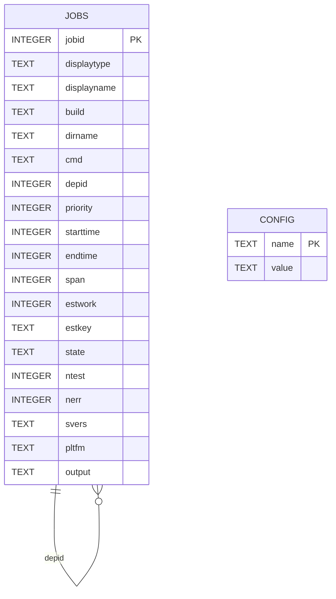

**图表来源**
- [testrunner.tcl](file://test/testrunner.tcl#L308-L367)

## Jobs表结构详解

Jobs表是testrunner.db中最重要的表，记录了所有需要执行的测试任务及其状态信息。

### 核心字段分析

#### 基础标识字段

| 字段名 | 数据类型 | 约束条件 | 业务含义 |
|--------|----------|----------|----------|
| `jobid` | INTEGER | PRIMARY KEY, NOT NULL | 测试任务的唯一标识符，正整数 |
| `displaytype` | TEXT | NOT NULL | 测试类型简写（如"tcl"、"fuzz"、"make"） |
| `displayname` | TEXT | NOT NULL | 人类可读的任务名称 |

#### 依赖关系字段

| 字段名 | 数据类型 | 约束条件 | 业务含义 |
|--------|----------|----------|----------|
| `depid` | INTEGER | FOREIGN KEY, 可为空 | 依赖的前置任务ID，确保任务按正确顺序执行 |
| `build` | TEXT | NOT NULL, DEFAULT '' | 构建配置名称，指定使用的编译选项 |

#### 执行控制字段

| 字段名 | 数据类型 | 约束条件 | 业务含义 |
|--------|----------|----------|----------|
| `cmd` | TEXT | NOT NULL | 要执行的Shell命令或批处理脚本 |
| `priority` | INTEGER | NOT NULL | 优先级值，影响任务调度顺序 |

#### 状态追踪字段

| 字段名 | 数据类型 | 约束条件 | 业务含义 |
|--------|----------|----------|----------|
| `starttime` | INTEGER | 可为空 | 开始时间（毫秒自1970年） |
| `endtime` | INTEGER | 可为空 | 结束时间（毫秒自1970年） |
| `span` | INTEGER | 可为空 | 总运行时间（毫秒） |
| `state` | TEXT | CHECK约束 | 任务状态：'', 'ready', 'running', 'done', 'failed', 'omit', 'halt' |

#### 性能估算字段

| 字段名 | 数据类型 | 约束条件 | 业务含义 |
|--------|----------|----------|----------|
| `estwork` | INTEGER | 可为空 | 预估工作量，相对值 |
| `estkey` | TEXT | 可为空 | 用于计算estwork的键值 |

#### 结果统计字段

| 字段名 | 数据类型 | 约束条件 | 业务含义 |
|--------|----------|----------|----------|
| `ntest` | INTEGER | 可为空 | 运行的测试用例数量 |
| `nerr` | INTEGER | 可为空 | 报告的错误数量 |
| `svers` | TEXT | 可为空 | 报告的SQLite版本号 |
| `pltfm` | TEXT | 可为空 | 主机平台信息 |

#### 输出存储字段

| 字段名 | 数据类型 | 约束条件 | 业务含义 |
|--------|----------|----------|----------|
| `output` | TEXT | 可为空 | 测试输出内容 |

**节来源**
- [testrunner.tcl](file://test/testrunner.tcl#L308-L365)

### Job ID设计原理

`jobid`字段采用INTEGER PRIMARY KEY的设计，具有以下特点：
- 自动生成递增的唯一标识符
- 支持高效的索引查找
- 确保每个任务的唯一性
- 方便与其他表建立关联关系

### Display Type语义

`displaytype`字段支持以下值：
- **tcl**: Tcl脚本测试
- **fuzz**: 模糊测试
- **make**: 构建任务
- **bld**: 编译构建
- **其他**: 自定义测试类型

### 依赖关系机制

通过`depid`字段实现任务依赖管理：
- 空值表示无依赖
- 正整数值指向前置任务
- 系统自动维护依赖链完整性
- 支持复杂的任务依赖图

**节来源**
- [testrunner.tcl](file://test/testrunner.tcl#L1450-L1492)

## Config表结构详解

Config表采用简单的键值对设计，用于存储运行时配置参数。

### 表结构定义

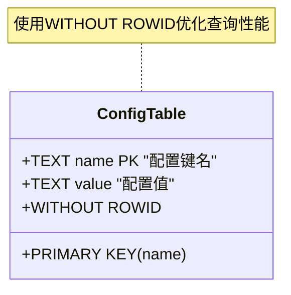

**图表来源**
- [testrunner.tcl](file://test/testrunner.tcl#L367-L369)

### 核心配置项

| 配置键名 | 数据类型 | 默认值 | 业务含义 |
|----------|----------|--------|----------|
| `njob` | INTEGER | 动态计算 | 并发执行的进程数量 |
| `cmdline` | TEXT | 空字符串 | 启动命令行参数 |
| `start` | INTEGER | 时间戳 | 测试开始时间 |
| `end` | INTEGER | 时间戳 | 测试结束时间 |
| `nfail` | INTEGER | 0 | 失败的测试数量 |
| `ntest` | INTEGER | 0 | 总测试用例数量 |

### 键值存储优势

Config表采用键值存储模式的优势：
- **灵活性**: 支持动态添加新配置项
- **简洁性**: 单表结构便于维护
- **高效性**: 使用PRIMARY KEY进行快速查找
- **一致性**: COLLATE nocase确保键名不区分大小写

### WITHOUT ROWID优化

表定义中使用`WITHOUT ROWID`特性：
- 减少存储空间占用
- 提高查询性能
- 特别适合小表和频繁查询的场景

**节来源**
- [testrunner.tcl](file://test/testrunner.tcl#L1470-L1492)

## 表关系与约束

### 索引设计

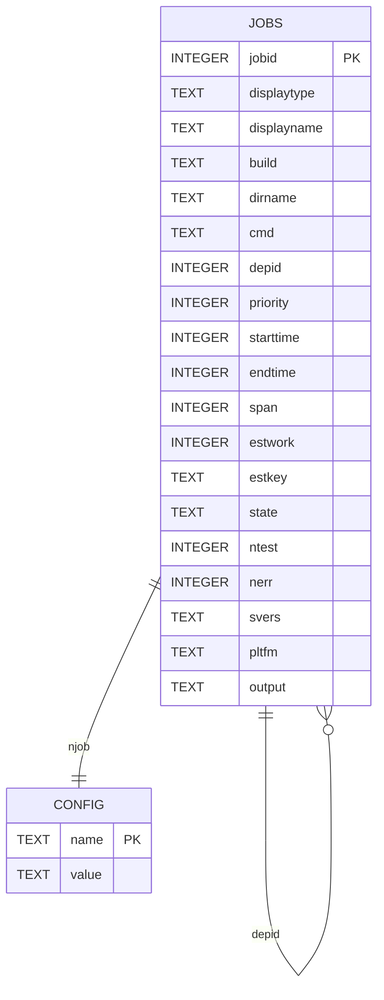

**图表来源**
- [testrunner.tcl](file://test/testrunner.tcl#L367-L369)

### 约束条件

#### Jobs表约束

1. **状态检查约束**
   ```sql
   state TEXT CHECK( state IN ('','ready','running','done','failed','omit','halt') )
   ```
   限制状态值范围，确保数据完整性。

2. **主键约束**
   - `jobid`必须唯一且非空
   - 支持自动递增

3. **外键约束**
   - `depid`引用同一表的`jobid`
   - 支持NULL值表示无依赖

#### Config表约束

1. **主键约束**
   - `name`字段为主键
   - 使用`COLLATE nocase`实现不区分大小写的键名匹配

2. **ROWID优化**
   - 使用`WITHOUT ROWID`减少存储开销

### 索引策略

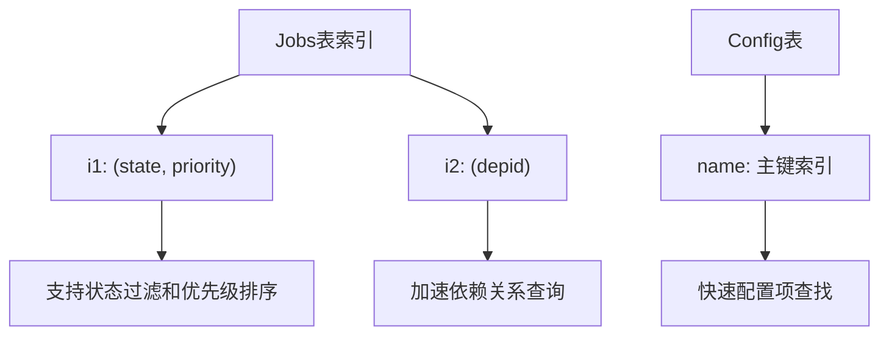

**图表来源**
- [testrunner.tcl](file://test/testrunner.tcl#L367-L369)

**节来源**
- [testrunner.tcl](file://test/testrunner.tcl#L367-L369)

## 数据库初始化流程

### 初始化序列

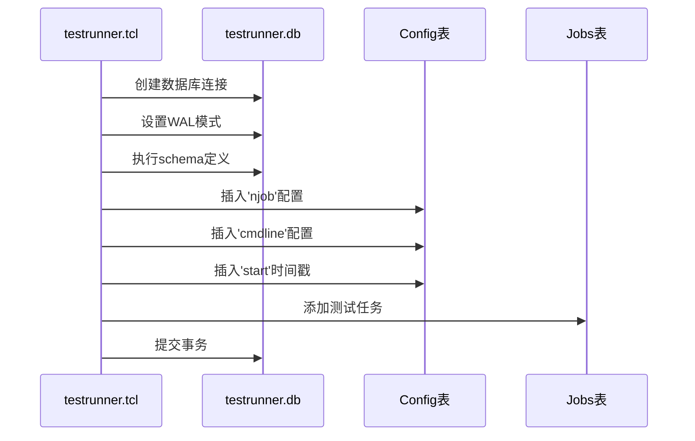

**图表来源**
- [testrunner.tcl](file://test/testrunner.tcl#L1470-L1492)

### Schema定义过程

数据库初始化包含以下关键步骤：

1. **清理现有表**
   ```sql
   DROP TABLE IF EXISTS jobs;
   DROP TABLE IF EXISTS config;
   ```

2. **创建Jobs表**
   - 定义所有字段及其约束
   - 设置默认值
   - 添加状态检查约束

3. **创建Config表**
   - 定义键值对结构
   - 应用ROWID优化
   - 设置键名不区分大小写

4. **创建索引**
   - `i1`: (state, priority) - 支持状态过滤和优先级排序
   - `i2`: (depid) - 加速依赖关系查询

### 配置初始化

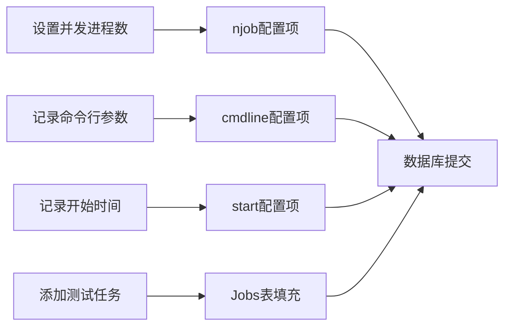

**图表来源**
- [testrunner.tcl](file://test/testrunner.tcl#L1470-L1492)

**节来源**
- [testrunner.tcl](file://test/testrunner.tcl#L1470-L1492)

## 作业插入与管理

### 作业添加机制

系统提供了灵活的作业添加接口：

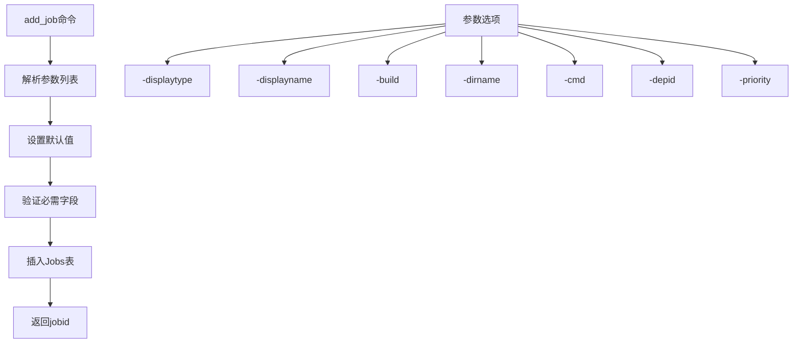

**图表来源**
- [testrunner.tcl](file://test/testrunner.tcl#L1038-L1149)

### 作业分类与优先级

#### 测试类型分类

根据`displaytype`字段，系统支持多种测试类型：

| 类型 | 含义 | 示例 |
|------|------|------|
| tcl | Tcl脚本测试 | 常规单元测试 |
| fuzz | 模糊测试 | 输入随机化测试 |
| make | 构建任务 | 编译和链接 |
| bld | 编译构建 | 特定配置编译 |
| 其他 | 自定义类型 | 扩展测试类型 |

#### 优先级机制

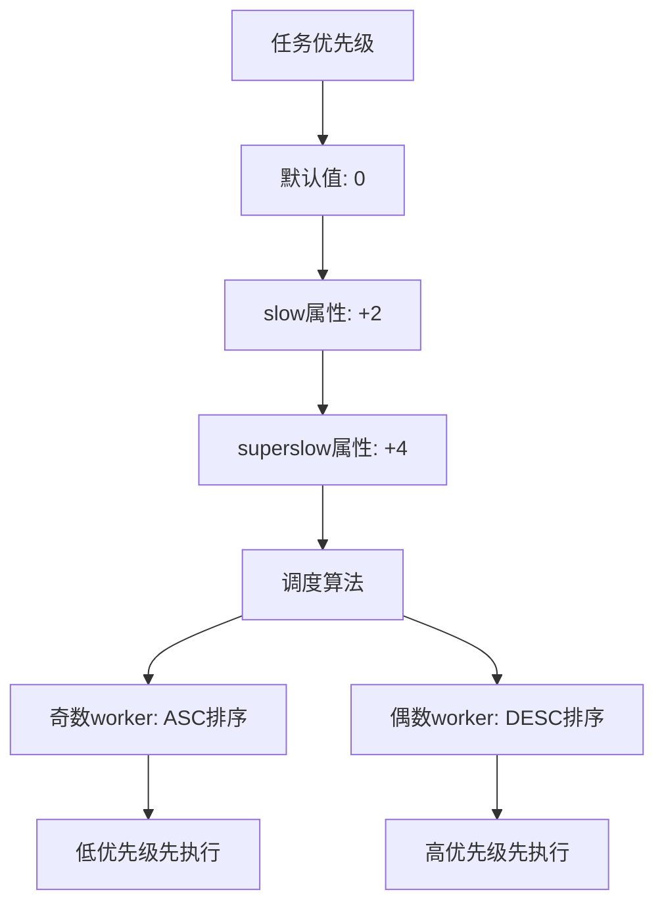

**图表来源**
- [testrunner.tcl](file://test/testrunner.tcl#L1151-L1195)

### 依赖关系管理

#### 依赖链维护

系统自动维护任务间的依赖关系：

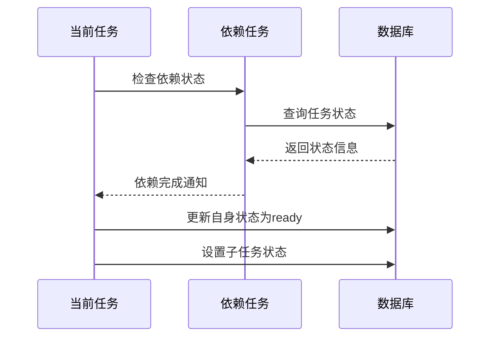

**图表来源**
- [testrunner.tcl](file://test/testrunner.tcl#L1490-L1532)

#### 依赖解除机制

当任务完成时，系统自动解除相关依赖：

1. **成功完成**: 子任务状态设为`ready`
2. **失败完成**: 子任务状态设为`omit`
3. **手动终止**: 状态设为`halt`

**节来源**
- [testrunner.tcl](file://test/testrunner.tcl#L1038-L1149)
- [testrunner.tcl](file://test/testrunner.tcl#L1490-L1532)

## 实际使用示例

### 基本作业插入

以下是典型的作业插入场景：

#### Tcl测试作业

```sql
-- 插入一个Tcl测试作业
INSERT INTO jobs (
    displaytype, displayname, build, cmd, priority
) VALUES (
    'tcl', 'test_basic_select', 'Default', 
    './testfixture ./test/select.test', 0
);
```

#### 构建作业

```sql
-- 插入一个构建作业
INSERT INTO jobs (
    displaytype, displayname, build, cmd, priority
) VALUES (
    'make', 'build_debug', 'All-Debug', 
    './make.sh debug', 1
);
```

### 依赖关系示例

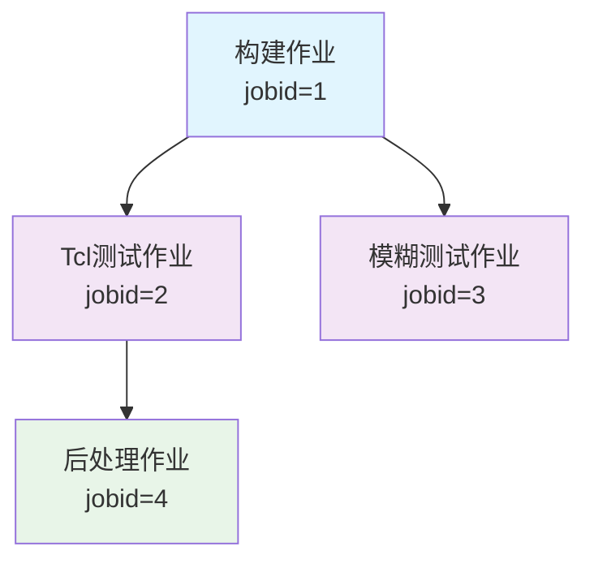

**图表来源**
- [testrunner.tcl](file://test/testrunner.tcl#L1490-L1532)

### 配置管理示例

#### 并发控制配置

```sql
-- 设置并发进程数为8
REPLACE INTO config VALUES('njob', 8);

-- 查看当前配置
SELECT * FROM config WHERE name='njob';
```

#### 测试状态监控

```sql
-- 查询所有任务状态分布
SELECT state, COUNT(*) as count 
FROM jobs 
GROUP BY state;

-- 查询正在运行的任务
SELECT * FROM jobs WHERE state='running';

-- 查询失败的任务
SELECT jobid, displayname, output 
FROM jobs WHERE state='failed';
```

**节来源**
- [testrunner.tcl](file://test/testrunner.tcl#L1470-L1492)

## 性能优化考虑

### 查询优化策略

#### 索引利用

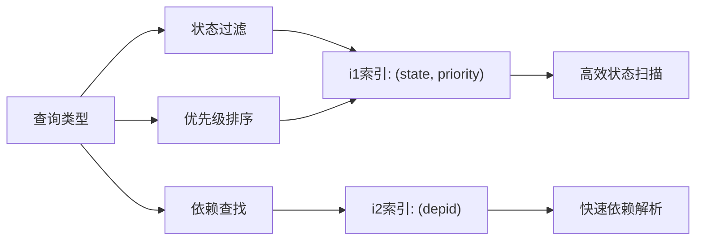

**图表来源**
- [testrunner.tcl](file://test/testrunner.tcl#L367-L369)

#### WAL模式优化

系统启用Write-Ahead Logging模式提升并发性能：
- 支持多进程同时读取
- 减少锁竞争
- 提高整体吞吐量

### 内存使用优化

#### ROWID优化

Config表使用`WITHOUT ROWID`特性：
- 减少B-tree层级深度
- 降低内存占用
- 提升查询速度

#### 数据类型选择

合理选择数据类型：
- INTEGER字段使用紧凑存储
- TEXT字段避免过长内容
- 索引字段选择合适长度

### 并发控制

#### 工作进程管理

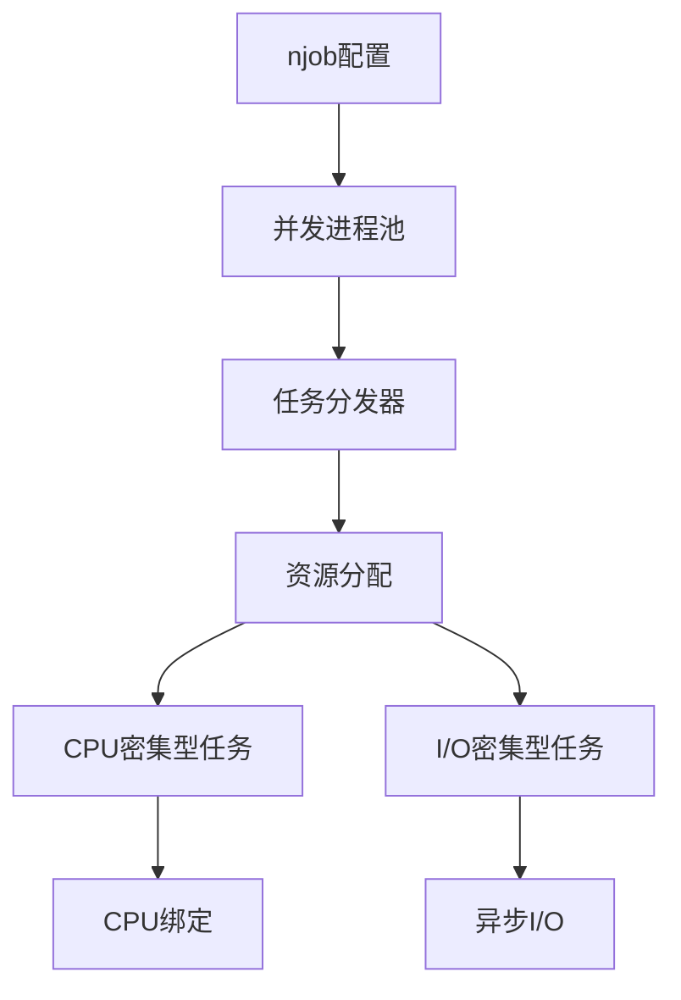

**图表来源**
- [testrunner.tcl](file://test/testrunner.tcl#L1713-L1761)

**节来源**
- [testrunner.tcl](file://test/testrunner.tcl#L367-L369)

## 故障排除指南

### 常见问题诊断

#### 作业状态异常

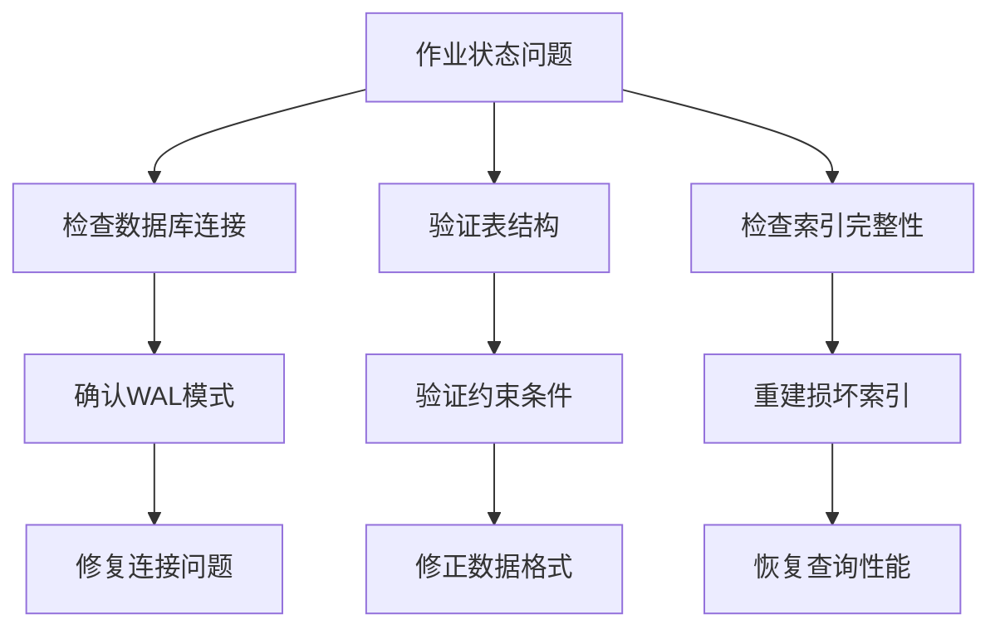

#### 依赖死锁检测

当出现依赖死锁时：
1. 检查`depid`循环引用
2. 验证任务完成状态
3. 清理孤立任务

#### 性能问题排查

```sql
-- 检查慢查询
EXPLAIN QUERY PLAN 
SELECT * FROM jobs 
WHERE state='ready' 
ORDER BY priority DESC 
LIMIT 1;

-- 分析索引使用情况
PRAGMA index_info(i1);
PRAGMA index_info(i2);
```

### 数据恢复策略

#### 备份与恢复

```sql
-- 创建备份
.backup testrunner.db.bak

-- 恢复数据库
.restore testrunner.db.bak
```

#### 数据修复

```sql
-- 修复损坏的索引
DROP INDEX i1;
CREATE INDEX i1 ON jobs(state, priority);

-- 重置失败任务
UPDATE jobs SET state='ready' WHERE state='failed';
```

### 监控指标

#### 关键性能指标

| 指标名称 | 查询语句 | 正常范围 |
|----------|----------|----------|
| 活跃任务数 | `SELECT COUNT(*) FROM jobs WHERE state='running'` | < njob |
| 失败率 | `SELECT COUNT(*) FROM jobs WHERE state='failed'` | < 5% |
| 平均执行时间 | `SELECT AVG(span) FROM jobs WHERE state='done'` | 变化较大 |
| 依赖完成率 | `SELECT COUNT(*) FROM jobs WHERE depid IS NOT NULL AND state='done'` | > 90% |

**节来源**
- [testrunner.tcl](file://test/testrunner.tcl#L1713-L1761)

## 结论

testrunner.db的jobs表和config表设计体现了良好的数据库范式和实用性的平衡。jobs表通过丰富的字段支持复杂的测试任务管理，而config表则提供了灵活的配置管理能力。两者配合使用，为SQLite测试框架提供了强大的任务调度和状态追踪功能。

这种设计不仅满足了当前的测试需求，还具备良好的扩展性，能够适应未来测试框架的发展变化。通过合理的索引设计和约束设置，确保了系统的高性能和数据完整性。