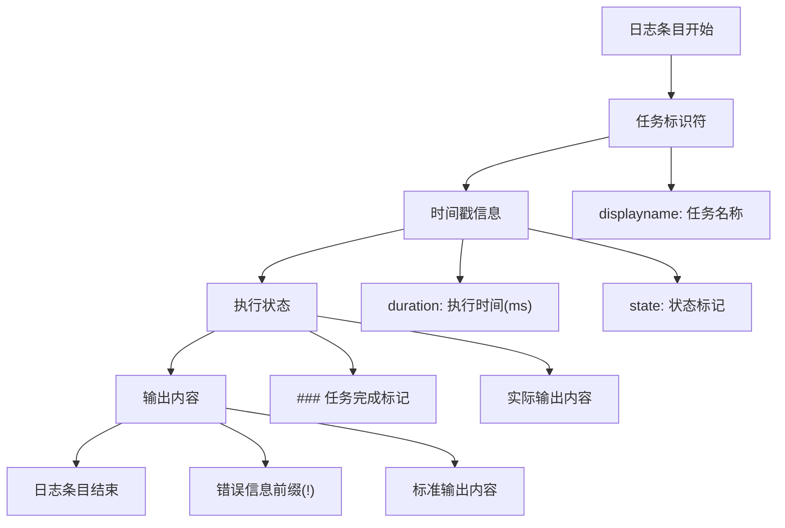
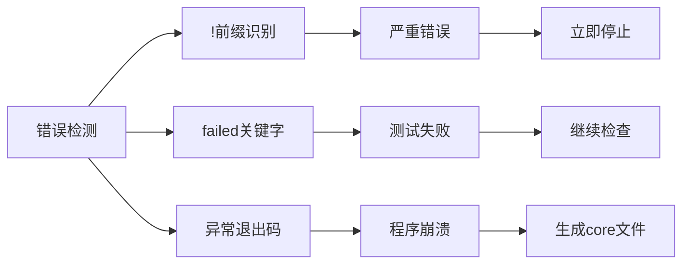
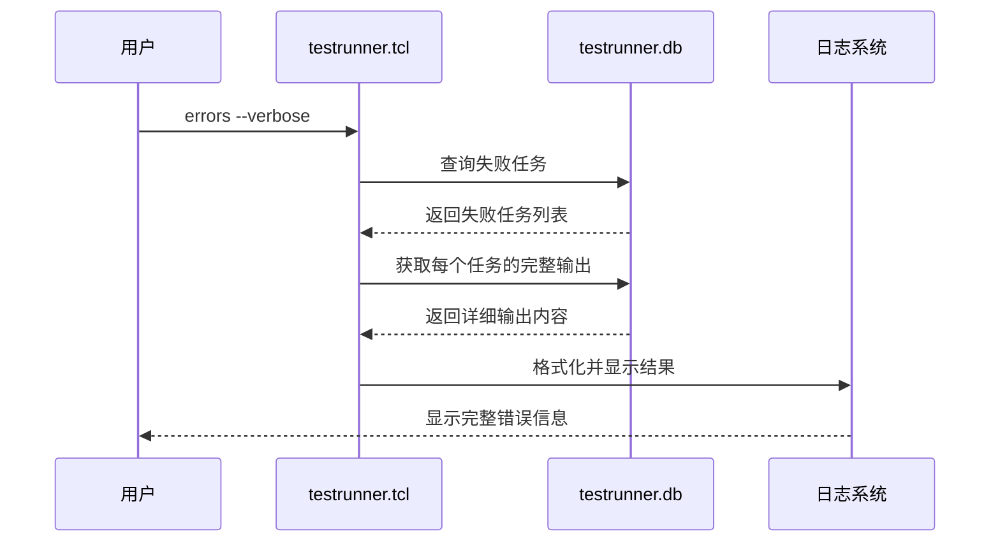
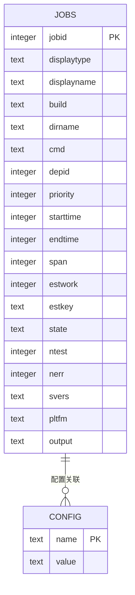
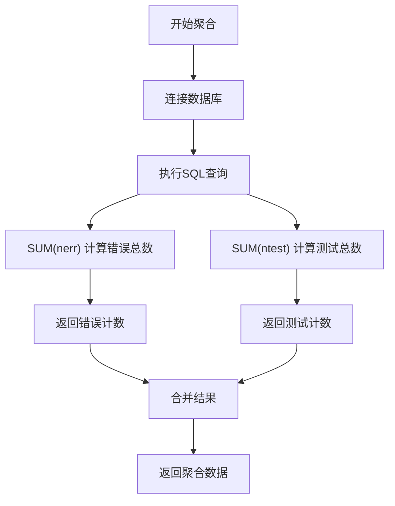

# 测试运行器日志分析机制详细文档

<cite>
**本文档引用的文件**
- [testrunner.tcl](file://test/testrunner.tcl)
- [testrunner_data.tcl](file://test/testrunner_data.tcl)
- [testrunner.md](file://doc/testrunner.md)
- [testrunner_estwork.tcl](file://test/testrunner_estwork.tcl)
</cite>

## 目录
1. [概述](#概述)
2. [testrunner.log文件格式规范](#testrunnerlog文件格式规范)
3. [错误信息定位机制](#错误信息定位机制)
4. [errors命令实现详解](#errors命令实现详解)
5. [数据库结构与数据聚合](#数据库结构与数据聚合)
6. [SQL查询示例与定制化报告](#sql查询示例与定制化报告)
7. [性能分析与优化建议](#性能分析与优化建议)
8. [故障排除指南](#故障排除指南)
9. [总结](#总结)

## 概述

测试运行器（testrunner）是SQLite项目中的核心测试框架，负责管理并行执行各种类型的测试。它通过testrunner.log文件记录详细的测试执行信息，并维护一个SQLite数据库testrunner.db来跟踪所有测试作业的状态和结果。本文档深入分析了日志文件格式、错误识别机制以及数据分析方法。

## testrunner.log文件格式规范

### 基本格式结构

testrunner.log文件采用统一的日志格式，每条记录包含以下关键元素：



**图表来源**
- [testrunner.tcl](file://test/testrunner.tcl#L1562-L1563)

### 时间戳和任务标识组织方式

日志条目的典型格式如下：

```
### 任务名称 执行时间(ms) (状态)
输出内容
```

例如：
```
### Build All-Debug (make) 12345ms (done)
(cd testrunner_build_all_debug ; make testfixture )
make: Entering directory `/home/user/sqlite/test'
gcc -O2 -DSQLITE_DEBUG=1 -DSQLITE_MEMDEBUG=1 ...
```

### 输出内容的组织方式

日志输出按照以下层次结构组织：

1. **任务级别标记**：使用`###`开头标识任务完成
2. **错误信息标记**：以`!`开头的行表示错误信息
3. **标准输出内容**：正常的测试输出
4. **平台和版本信息**：包含SQLite版本和平台信息

**节来源**
- [testrunner.tcl](file://test/testrunner.tcl#L1562-L1563)

## 错误信息定位机制

### grep命令快速定位错误

测试运行器提供了多种快速定位错误的方法：

#### 基本错误查找
```bash
# 查找所有错误标记
grep "^!" testrunner.log

# 查找失败的任务
grep failed testrunner.log
```

#### 高级过滤选项
```bash
# 查找特定模式的错误
grep -i "segmentation fault" testrunner.log

# 查找内存相关错误
grep -i "memory\|malloc\|free" testrunner.log

# 查找超时错误
grep -i "timeout\|exceeded" testrunner.log
```

### 错误信息识别模式

错误信息通常遵循以下模式：



**图表来源**
- [testrunner.tcl](file://test/testrunner.tcl#L1562-L1563)

**节来源**
- [testrunner.md](file://doc/testrunner.md#L40-L45)

## errors命令实现详解

### 命令语法和参数

errors命令提供两种主要模式：

```bash
# 基本错误报告
tclsh testrunner.tcl errors

# 详细模式
tclsh testrunner.tcl errors --verbose

# 摘要模式
tclsh testrunner.tcl errors --summary

# 带模式匹配
tclsh testrunner.tcl errors --verbose "pattern*"
```

### --verbose模式实现机制

verbose模式显示完整的测试输出，包括：

1. **完整输出显示**：显示所有测试脚本的完整输出
2. **非Tcl测试输出**：对于非Tcl测试（如fuzz测试），显示原始输出
3. **调试信息**：包含详细的执行步骤和中间结果



**图表来源**
- [testrunner.tcl](file://test/testrunner.tcl#L800-L850)

### --summary模式实现机制

summary模式提供精简的报告内容：

1. **任务摘要**：只列出失败的任务名称
2. **计数统计**：显示总错误数和测试总数
3. **快速定位**：帮助用户快速了解问题范围

**节来源**
- [testrunner.tcl](file://test/testrunner.tcl#L800-L850)

## 数据库结构与数据聚合

### testrunner.db数据库架构

testrunner.db采用关系型数据库设计，主要表结构如下：



**图表来源**
- [testrunner.tcl](file://test/testrunner.tcl#L308-L365)

### aggregate_test_counts过程分析

该过程负责从数据库中汇总测试用例和错误数量：



**图表来源**
- [testrunner.tcl](file://test/testrunner.tcl#L750-L760)

SQL查询实现：
```sql
SELECT sum(nerr) AS ne, sum(ntest) as nt FROM jobs
```

该查询计算所有作业的错误总数和测试总数，为用户提供整体测试质量概览。

**节来源**
- [testrunner.tcl](file://test/testrunner.tcl#L750-L760)

## SQL查询示例与定制化报告

### 统计各阶段平均耗时

```sql
-- 计算各类型任务的平均执行时间
SELECT 
    displaytype, 
    AVG(span) as avg_duration_ms,
    COUNT(*) as job_count
FROM jobs 
WHERE state='done'
GROUP BY displaytype
ORDER BY avg_duration_ms DESC;

-- 按优先级统计
SELECT 
    priority, 
    AVG(span) as avg_duration,
    SUM(estwork) as total_work
FROM jobs 
WHERE state='done'
GROUP BY priority
ORDER BY priority;
```

### 分析失败任务的分布模式

```sql
-- 失败任务按类型分布
SELECT 
    displaytype, 
    COUNT(*) as failure_count,
    SUM(nerr) as total_errors,
    AVG(span) as avg_failure_time
FROM jobs 
WHERE state='failed'
GROUP BY displaytype
ORDER BY failure_count DESC;

-- 平台相关失败分析
SELECT 
    pltfm, 
    COUNT(*) as failures,
    SUM(nerr) as errors,
    AVG(span) as avg_time
FROM jobs 
WHERE state='failed'
GROUP BY pltfm
HAVING COUNT(*) > 10;
```

### 高级性能分析查询

```sql
-- 性能回归检测
WITH baseline AS (
    SELECT displaytype, AVG(span) as avg_time
    FROM jobs 
    WHERE state='done' 
    AND endtime > strftime('%s', 'now', '-7 days') * 1000
    GROUP BY displaytype
)
SELECT 
    j.displaytype,
    j.jobid,
    j.span,
    b.avg_time,
    (j.span - b.avg_time) / b.avg_time * 100 as percentage_increase
FROM jobs j
JOIN baseline b ON j.displaytype = b.displaytype
WHERE j.state='done' 
AND j.span > b.avg_time * 1.5
ORDER BY percentage_increase DESC;

-- 资源使用分析
SELECT 
    displaytype,
    MAX(span) as max_time,
    MIN(span) as min_time,
    AVG(span) as avg_time,
    COUNT(*) as count
FROM jobs
WHERE state='done'
GROUP BY displaytype
HAVING AVG(span) > 10000;
```

**节来源**
- [testrunner.tcl](file://test/testrunner.tcl#L308-L365)

## 性能分析与优化建议

### 日志文件大小优化

1. **压缩策略**：定期压缩旧的日志文件
2. **轮转机制**：实施基于时间和大小的日志轮转
3. **选择性记录**：根据需要调整日志详细程度

### 数据库性能优化

1. **索引优化**：确保在常用查询字段上建立适当索引
2. **查询优化**：避免全表扫描，使用合适的WHERE条件
3. **连接池**：对于大规模测试，考虑使用连接池

### 内存使用优化

1. **批量操作**：使用事务批量更新数据库
2. **内存映射**：对于大型日志文件，考虑使用内存映射
3. **垃圾回收**：及时清理不再需要的临时数据

## 故障排除指南

### 常见问题诊断

#### 日志文件损坏
```bash
# 检查日志完整性
wc -l testrunner.log | grep -v "^[[:space:]]*0"

# 搜索不完整条目
grep -n "^###" testrunner.log | tail -10
```

#### 数据库锁定问题
```bash
# 检查数据库锁定状态
sqlite3 testrunner.db ".timeout 1000"
sqlite3 testrunner.db "PRAGMA locking_mode;"
```

#### 内存不足
```bash
# 监控内存使用
ps aux | grep testrunner

# 检查可用内存
free -h
```

### 调试技巧

1. **启用详细日志**：使用`--dryrun`选项查看预期行为
2. **分步验证**：逐个测试组件的功能
3. **环境隔离**：在干净环境中重现问题

**节来源**
- [testrunner.tcl](file://test/testrunner.tcl#L112-L115)

## 总结

测试运行器的日志分析机制为SQLite项目的质量保证提供了强大的工具集。通过理解testrunner.log文件格式、掌握错误定位技巧、熟练运用errors命令以及利用数据库进行深度分析，开发团队可以：

1. **快速定位问题**：通过grep命令和errors命令迅速找到失败原因
2. **全面质量评估**：利用数据库统计功能获得完整的测试质量视图
3. **持续改进**：基于历史数据识别趋势和回归问题
4. **性能优化**：通过详细的执行时间分析优化测试流程

这种综合性的日志分析方法不仅提高了问题解决效率，也为项目的长期维护和发展奠定了坚实的基础。随着测试规模的扩大和复杂度的增加，这套分析机制将继续发挥重要作用，确保SQLite项目的高质量交付。