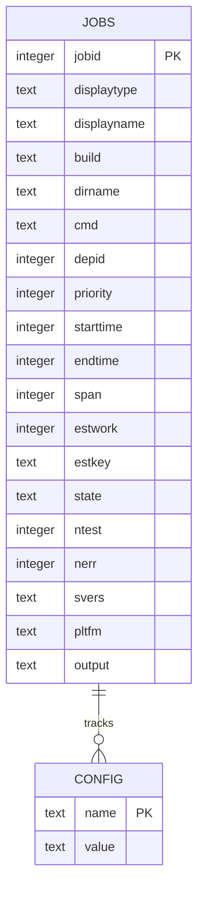
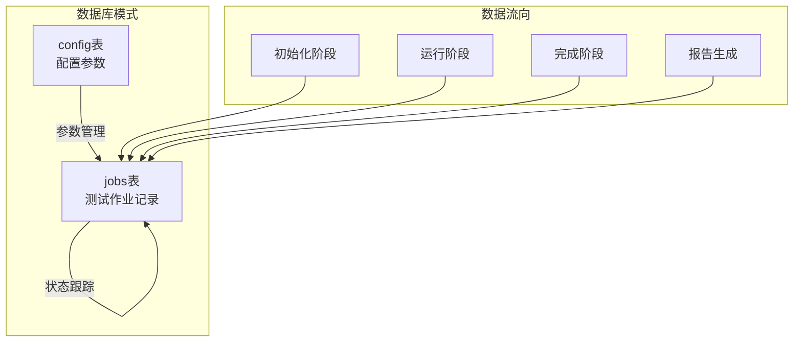
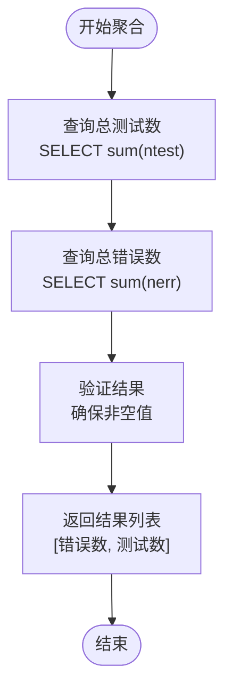
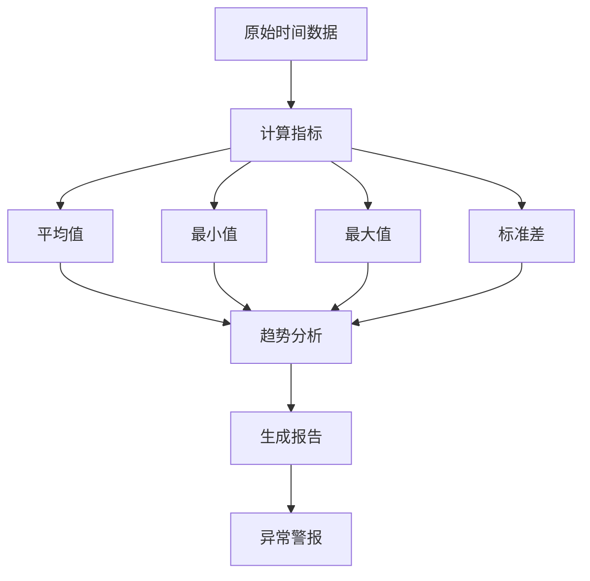

# 统计分析

<cite>
**本文档引用的文件**
- [testrunner.tcl](file://test/testrunner.tcl)
- [testrunner.md](file://doc/testrunner.md)
- [testrunner_data.tcl](file://test/testrunner_data.tcl)
- [testrunner_estwork.tcl](file://test/testrunner_estwork.tcl)
- [dbstat.c](file://src/dbstat.c)
</cite>

## 目录
1. [概述](#概述)
2. [数据库架构](#数据库架构)
3. [aggregate_test_counts过程](#aggregate_test_counts过程)
4. [jobs表详细分析](#jobs表详细分析)
5. [SQL查询示例](#sql查询示例)
6. [性能趋势分析](#性能趋势分析)
7. [质量评估方法](#质量评估方法)
8. [故障分析技术](#故障分析技术)
9. [最佳实践建议](#最佳实践建议)

## 概述

SQLite测试运行器（testrunner.tcl）使用一个专门设计的数据库模式来跟踪和分析测试执行情况。该系统通过`testrunner.db`数据库存储所有测试作业的详细信息，包括执行时间、错误数量、状态等关键指标。这种设计使得开发者能够深入分析测试性能、识别瓶颈并评估整体质量。

核心统计功能围绕`jobs`表展开，该表记录了每个测试作业的完整生命周期，从初始化到完成的所有状态变化。通过这个数据库，系统能够生成详细的统计报告，支持各种分析场景。

## 数据库架构

### 核心表结构

测试运行器使用两个主要表来管理测试数据：



**图表来源**
- [testrunner.tcl](file://test/testrunner.tcl#L342-L365)

### 表关系图



**图表来源**
- [testrunner.tcl](file://test/testrunner.tcl#L367-L375)

**节来源**
- [testrunner.tcl](file://test/testrunner.tcl#L308-L375)

## aggregate_test_counts过程

### 函数实现

`aggregate_test_counts`函数是测试统计分析的核心组件，负责从`jobs`表中汇总测试用例和错误数量的关键指标。



**图表来源**
- [testrunner.tcl](file://test/testrunner.tcl#L785-L790)

### 执行流程

该函数的执行遵循以下步骤：

1. **数据库连接**：建立与`testrunner.db`的连接
2. **查询执行**：执行两个关键查询分别获取总测试数和总错误数
3. **结果处理**：确保返回值不为空，提供默认值
4. **数据返回**：返回包含错误数和测试数的列表

### 使用示例

在实际应用中，该函数通常用于：
- 生成测试总结报告
- 计算测试覆盖率指标
- 评估整体测试质量

**节来源**
- [testrunner.tcl](file://test/testrunner.tcl#L785-L790)

## jobs表详细分析

### 字段详解

`jobs`表包含了测试作业的完整信息，每个字段都有特定的用途和含义：

| 字段名 | 类型 | 描述 | 用途 |
|--------|------|------|------|
| jobid | INTEGER | 唯一标识符 | 作业的主键，用于关联其他数据 |
| displaytype | TEXT | 测试类型 | 如"tcl"、"fuzz"、"bld"等分类标识 |
| displayname | TEXT | 显示名称 | 人类可读的作业描述 |
| build | TEXT | 构建配置 | 关联的构建配置名称 |
| dirname | TEXT | 目录名 | 作业使用的目录路径 |
| cmd | TEXT | 执行命令 | 实际要运行的shell命令 |
| depid | INTEGER | 依赖ID | 依赖的前序作业ID |
| priority | INTEGER | 优先级 | 决定执行顺序的优先级值 |

### 时间相关字段

| 字段名 | 类型 | 描述 | 计算方式 |
|--------|------|------|----------|
| starttime | INTEGER | 开始时间 | 毫秒级Unix时间戳 |
| endtime | INTEGER | 结束时间 | 毫秒级Unix时间戳 |
| span | INTEGER | 运行时长 | endtime - starttime |
| estwork | INTEGER | 预估工作量 | 相对于tcl测试的相对值 |

### 状态字段

`state`字段使用枚举值来表示作业的不同状态：
- ''（空字符串）：未初始化
- 'ready'：准备就绪
- 'running'：正在运行
- 'done'：已完成
- 'failed'：执行失败
- 'omit'：被跳过
- 'halt'：被中止

### 质量指标字段

| 字段名 | 类型 | 描述 | 分析用途 |
|--------|------|------|----------|
| ntest | INTEGER | 测试用例数 | 总测试覆盖范围 |
| nerr | INTEGER | 错误数量 | 质量评估指标 |
| svers | TEXT | SQLite版本 | 版本兼容性分析 |
| pltfm | TEXT | 平台信息 | 跨平台兼容性 |

**节来源**
- [testrunner.tcl](file://test/testrunner.tcl#L344-L365)

## SQL查询示例

### 基础统计查询

#### 获取总体统计信息

```sql
-- 基本测试统计
SELECT 
    SUM(ntest) AS total_tests,
    SUM(nerr) AS total_errors,
    COUNT(*) AS job_count,
    AVG(span) AS avg_duration_ms
FROM jobs;

-- 按类型分组统计
SELECT 
    displaytype,
    COUNT(*) AS job_count,
    SUM(ntest) AS total_tests,
    SUM(nerr) AS total_errors,
    AVG(span) AS avg_duration
FROM jobs
GROUP BY displaytype
ORDER BY avg_duration DESC;
```

#### 时间维度分析

```sql
-- 按时间段统计
SELECT 
    strftime('%Y-%m-%d', datetime(starttime/1000, 'unixepoch')) AS date,
    COUNT(*) AS job_count,
    SUM(ntest) AS total_tests,
    SUM(nerr) AS total_errors
FROM jobs
WHERE endtime > 0
GROUP BY date
ORDER BY date;

-- 平均执行时间分析
SELECT 
    displaytype,
    AVG(span) AS avg_time_ms,
    MIN(span) AS min_time_ms,
    MAX(span) AS max_time_ms,
    COUNT(*) AS job_count
FROM jobs
WHERE span > 0
GROUP BY displaytype
HAVING COUNT(*) > 10
ORDER BY avg_time_ms DESC;
```

### 高级分析查询

#### 性能趋势分析

```sql
-- 性能回归检测
WITH daily_stats AS (
    SELECT 
        DATE(datetime(starttime/1000, 'unixepoch')) AS test_date,
        displaytype,
        AVG(span) AS avg_duration,
        COUNT(*) AS job_count
    FROM jobs
    WHERE state = 'done'
    GROUP BY test_date, displaytype
)
SELECT 
    ds1.displaytype,
    ds1.test_date AS current_date,
    ds1.avg_duration AS current_avg,
    ds2.avg_duration AS previous_avg,
    (ds1.avg_duration - ds2.avg_duration) / ds2.avg_duration * 100 AS pct_change
FROM daily_stats ds1
LEFT JOIN daily_stats ds2 
    ON ds1.displaytype = ds2.displaytype 
    AND ds1.test_date = DATE(ds2.test_date, '+1 day')
WHERE ds2.test_date IS NOT NULL
    AND ABS((ds1.avg_duration - ds2.avg_duration) / ds2.avg_duration) > 0.1
ORDER BY pct_change DESC;
```

#### 错误模式分析

```sql
-- 失败作业分布分析
SELECT 
    displaytype,
    COUNT(*) AS failed_count,
    SUM(nerr) AS total_errors,
    SUM(ntest) AS total_tests,
    CAST(SUM(nerr) AS FLOAT) / SUM(ntest) * 100 AS failure_rate
FROM jobs
WHERE state = 'failed'
GROUP BY displaytype
ORDER BY failure_rate DESC;

-- 平台兼容性分析
SELECT 
    pltfm,
    COUNT(*) AS job_count,
    SUM(nerr) AS error_count,
    SUM(CASE WHEN nerr > 0 THEN 1 ELSE 0 END) AS failed_jobs,
    CAST(SUM(CASE WHEN nerr > 0 THEN 1 ELSE 0 END) AS FLOAT) / COUNT(*) * 100 AS failure_percentage
FROM jobs
WHERE pltfm IS NOT NULL
GROUP BY pltfm
ORDER BY failure_percentage DESC;
```

### 自定义报告生成

#### 详细作业报告

```sql
-- 生成详细作业报告
SELECT 
    jobid,
    displaytype,
    displayname,
    CASE 
        WHEN state = 'failed' THEN 'FAILURE'
        WHEN state = 'done' THEN 'SUCCESS'
        ELSE state
    END AS status,
    ntest,
    nerr,
    ROUND(span/1000.0, 2) AS duration_sec,
    ROUND((ntest - nerr) * 100.0 / NULLIF(ntest, 0), 2) AS pass_rate,
    datetime(starttime/1000, 'unixepoch') AS start_time,
    datetime(endtime/1000, 'unixepoch') AS end_time
FROM jobs
WHERE state IN ('failed', 'done')
ORDER BY span DESC;
```

#### 依赖关系分析

```sql
-- 分析作业依赖关系
WITH recursive job_chain AS (
    SELECT 
        jobid,
        displayname,
        depid,
        1 AS depth
    FROM jobs
    WHERE depid IS NULL
    
    UNION ALL
    
    SELECT 
        j.jobid,
        j.displayname,
        j.depid,
        jc.depth + 1
    FROM jobs j
    JOIN job_chain jc ON j.depid = jc.jobid
)
SELECT 
    jobid,
    displayname,
    depid,
    depth,
    REPEAT('    ', depth) || displayname AS indented_name
FROM job_chain
ORDER BY depth, jobid;
```

**节来源**
- [testrunner.tcl](file://test/testrunner.tcl#L1763-L1780)

## 性能趋势分析

### 平均耗时统计

系统提供了多种方式来分析测试执行的性能趋势：



**图表来源**
- [testrunner.tcl](file://test/testrunner.tcl#L487-L500)

### 性能指标计算

#### 基础性能指标

```sql
-- 计算各类测试的性能指标
SELECT 
    displaytype,
    COUNT(*) AS job_count,
    AVG(span) AS avg_duration_ms,
    MIN(span) AS min_duration_ms,
    MAX(span) AS max_duration_ms,
    STDDEV(span) AS duration_stddev,
    PERCENTILE_CONT(0.5) WITHIN GROUP (ORDER BY span) AS median_duration
FROM jobs
WHERE state = 'done' AND span > 0
GROUP BY displaytype
ORDER BY avg_duration_ms DESC;
```

#### 性能回归检测

```sql
-- 检测性能回归
WITH rolling_avg AS (
    SELECT 
        jobid,
        displaytype,
        span,
        AVG(span) OVER (
            PARTITION BY displaytype 
            ORDER BY starttime 
            ROWS BETWEEN 10 PRECEDING AND CURRENT ROW
        ) AS rolling_avg
    FROM jobs
    WHERE state = 'done' AND span > 0
)
SELECT 
    ra.displaytype,
    ra.span,
    ra.rolling_avg,
    (ra.span - ra.rolling_avg) / ra.rolling_avg * 100 AS pct_deviation
FROM rolling_avg ra
WHERE ABS((ra.span - ra.rolling_avg) / ra.rolling_avg) > 0.2
ORDER BY pct_deviation DESC;
```

### 资源利用率分析

#### 并发执行效率

```sql
-- 分析并发执行效率
WITH job_times AS (
    SELECT 
        jobid,
        starttime,
        endtime,
        span,
        ROW_NUMBER() OVER (ORDER BY starttime) AS job_order
    FROM jobs
    WHERE state = 'done' AND span > 0
)
SELECT 
    COUNT(*) AS total_jobs,
    SUM(span) / 1000.0 AS total_seconds,
    MAX(endtime) - MIN(starttime) AS actual_duration_ms,
    (MAX(endtime) - MIN(starttime)) / SUM(span) * 100 AS utilization_pct
FROM job_times;
```

**节来源**
- [testrunner.tcl](file://test/testrunner.tcl#L463-L500)

## 质量评估方法

### 错误率分析

#### 全局质量指标

```sql
-- 全局测试质量评估
SELECT 
    COUNT(*) AS total_jobs,
    SUM(CASE WHEN nerr > 0 THEN 1 ELSE 0 END) AS failed_jobs,
    SUM(nerr) AS total_errors,
    SUM(ntest) AS total_tests,
    CAST(SUM(nerr) AS FLOAT) / NULLIF(SUM(ntest), 0) * 100 AS error_rate,
    CAST(SUM(CASE WHEN nerr > 0 THEN 1 ELSE 0 END) AS FLOAT) / NULLIF(COUNT(*), 0) * 100 AS failure_rate
FROM jobs;
```

#### 分类质量分析

```sql
-- 按测试类型的质量分析
SELECT 
    displaytype,
    COUNT(*) AS job_count,
    SUM(CASE WHEN nerr > 0 THEN 1 ELSE 0 END) AS failed_jobs,
    SUM(nerr) AS total_errors,
    SUM(ntest) AS total_tests,
    CAST(SUM(nerr) AS FLOAT) / NULLIF(SUM(ntest), 0) * 100 AS error_rate,
    CAST(SUM(CASE WHEN nerr > 0 THEN 1 ELSE 0 END) AS FLOAT) / NULLIF(COUNT(*), 0) * 100 AS failure_rate
FROM jobs
GROUP BY displaytype
ORDER BY error_rate DESC;
```

### 覆盖率评估

#### 测试覆盖率指标

```sql
-- 测试覆盖率分析
SELECT 
    displaytype,
    COUNT(*) AS job_count,
    SUM(ntest) AS total_tests,
    SUM(nerr) AS total_errors,
    SUM(ntest) - SUM(nerr) AS successful_tests,
    CAST((SUM(ntest) - SUM(nerr)) AS FLOAT) / NULLIF(SUM(ntest), 0) * 100 AS coverage_rate
FROM jobs
WHERE state = 'done'
GROUP BY displaytype
ORDER BY coverage_rate DESC;
```

### 质量趋势监控

#### 时间序列质量分析

```sql
-- 质量趋势分析
WITH daily_quality AS (
    SELECT 
        DATE(datetime(starttime/1000, 'unixepoch')) AS test_date,
        displaytype,
        COUNT(*) AS job_count,
        SUM(ntest) AS total_tests,
        SUM(nerr) AS total_errors,
        CAST(SUM(nerr) AS FLOAT) / NULLIF(SUM(ntest), 0) * 100 AS daily_error_rate
    FROM jobs
    WHERE state = 'done' AND endtime > 0
    GROUP BY test_date, displaytype
)
SELECT 
    dq1.displaytype,
    dq1.test_date AS current_date,
    dq1.daily_error_rate AS current_rate,
    dq2.daily_error_rate AS previous_rate,
    dq1.daily_error_rate - dq2.daily_error_rate AS rate_change
FROM daily_quality dq1
LEFT JOIN daily_quality dq2 
    ON dq1.displaytype = dq2.displaytype 
    AND dq1.test_date = DATE(dq2.test_date, '+1 day')
WHERE dq2.test_date IS NOT NULL
ORDER BY rate_change DESC;
```

**节来源**
- [testrunner.tcl](file://test/testrunner.tcl#L1763-L1780)

## 故障分析技术

### 失败模式识别

#### 失败原因分类

```sql
-- 失败作业分析
SELECT 
    displaytype,
    COUNT(*) AS failed_count,
    SUM(nerr) AS total_errors,
    AVG(nerr) AS avg_errors_per_job,
    MAX(nerr) AS max_errors_in_job,
    SUM(CASE WHEN nerr > 0 THEN 1 ELSE 0 END) * 100.0 / COUNT(*) AS failure_percentage
FROM jobs
WHERE state = 'failed'
GROUP BY displaytype
ORDER BY failure_percentage DESC;
```

#### 平台特定问题

```sql
-- 平台兼容性问题分析
SELECT 
    pltfm,
    displaytype,
    COUNT(*) AS job_count,
    SUM(CASE WHEN nerr > 0 THEN 1 ELSE 0 END) AS failed_count,
    SUM(nerr) AS total_errors,
    CAST(SUM(CASE WHEN nerr > 0 THEN 1 ELSE 0 END) AS FLOAT) / COUNT(*) * 100 AS failure_rate
FROM jobs
WHERE state = 'failed' AND pltfm IS NOT NULL
GROUP BY pltfm, displaytype
ORDER BY failure_rate DESC;
```

### 根因分析

#### 依赖失败传播

```sql
-- 分析失败传播路径
WITH RECURSIVE failure_chain(jobid, displayname, depid, state, depth) AS (
    SELECT 
        jobid, displayname, depid, state, 0 AS depth
    FROM jobs
    WHERE state = 'failed'
    
    UNION ALL
    
    SELECT 
        j.jobid, j.displayname, j.depid, j.state, fc.depth + 1
    FROM jobs j
    JOIN failure_chain fc ON j.jobid = fc.depid
    WHERE j.state = 'omit'
)
SELECT 
    jobid,
    displayname,
    depid,
    state,
    depth,
    REPEAT('→ ', depth) || displayname AS failure_path
FROM failure_chain
ORDER BY depth DESC, jobid;
```

### 异常检测

#### 性能异常识别

```sql
-- 性能异常检测
WITH stats AS (
    SELECT 
        displaytype,
        AVG(span) AS avg_span,
        STDDEV(span) AS stddev_span,
        COUNT(*) AS job_count
    FROM jobs
    WHERE state = 'done' AND span > 0
    GROUP BY displaytype
)
SELECT 
    j.jobid,
    j.displaytype,
    j.displayname,
    j.span,
    s.avg_span,
    (j.span - s.avg_span) / s.stddev_span AS z_score
FROM jobs j
JOIN stats s ON j.displaytype = s.displaytype
WHERE ABS((j.span - s.avg_span) / s.stddev_span) > 2
    AND s.job_count > 30
ORDER BY z_score DESC;
```

**节来源**
- [testrunner.tcl](file://test/testrunner.tcl#L1489-L1532)

## 最佳实践建议

### 数据收集优化

#### 定期维护策略

1. **数据清理**：定期清理历史数据以保持数据库性能
2. **采样策略**：对于大规模测试，考虑使用采样而非全量数据
3. **索引优化**：确保关键查询字段有适当的索引

#### 查询性能优化

```sql
-- 创建性能优化索引
CREATE INDEX idx_jobs_state_starttime ON jobs(state, starttime);
CREATE INDEX idx_jobs_displaytype_span ON jobs(displaytype, span);
CREATE INDEX idx_jobs_endtime ON jobs(endtime);
```

### 报告自动化

#### 自动化报告生成

```sql
-- 生成每日质量报告
CREATE VIEW daily_quality_report AS
SELECT 
    DATE(datetime(starttime/1000, 'unixepoch')) AS report_date,
    displaytype,
    COUNT(*) AS total_jobs,
    SUM(CASE WHEN nerr > 0 THEN 1 ELSE 0 END) AS failed_jobs,
    SUM(ntest) AS total_tests,
    SUM(nerr) AS total_errors,
    CAST(SUM(nerr) AS FLOAT) / NULLIF(SUM(ntest), 0) * 100 AS error_rate
FROM jobs
WHERE state = 'done' AND endtime > 0
GROUP BY report_date, displaytype;
```

### 监控集成

#### 集成监控系统

```sql
-- 实时监控视图
CREATE VIEW real_time_monitoring AS
SELECT 
    COUNT(*) AS total_jobs,
    SUM(CASE WHEN state = 'running' THEN 1 ELSE 0 END) AS running_jobs,
    SUM(CASE WHEN state = 'failed' THEN 1 ELSE 0 END) AS failed_jobs,
    SUM(CASE WHEN state = 'done' THEN 1 ELSE 0 END) AS completed_jobs,
    AVG(CASE WHEN state = 'done' THEN span ELSE NULL END) AS avg_completion_time,
    MAX(endtime) - MIN(starttime) AS total_runtime
FROM jobs
WHERE starttime > strftime('%s', 'now', '-24 hours') * 1000;
```

### 分析工具扩展

#### 自定义分析函数

```sql
-- 创建性能分析函数
CREATE FUNCTION calculate_performance_metrics(type TEXT) RETURNS TEXT
BEGIN
    RETURN (
        SELECT json_object(
            'avg_duration', AVG(span),
            'min_duration', MIN(span),
            'max_duration', MAX(span),
            'stddev', STDDEV(span),
            'job_count', COUNT(*)
        )
        FROM jobs
        WHERE displaytype = type AND state = 'done'
    );
END;
```

### 故障排除指南

#### 常见问题诊断

1. **高错误率**：检查失败作业的输出日志
2. **性能下降**：分析最近的性能趋势
3. **资源不足**：监控并发作业数量
4. **数据不一致**：验证数据库完整性

通过这些统计分析技术和最佳实践，开发团队可以更好地理解测试执行情况，识别潜在问题，并持续改进测试质量和效率。