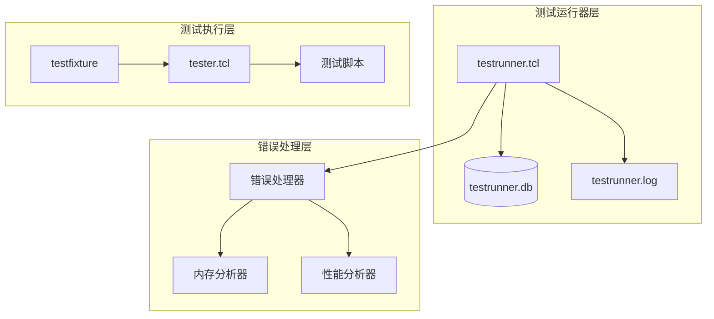
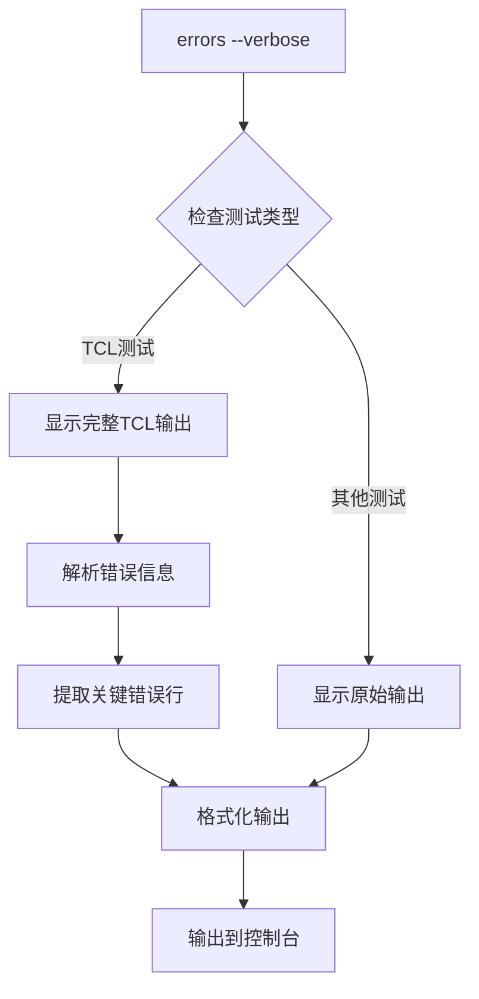
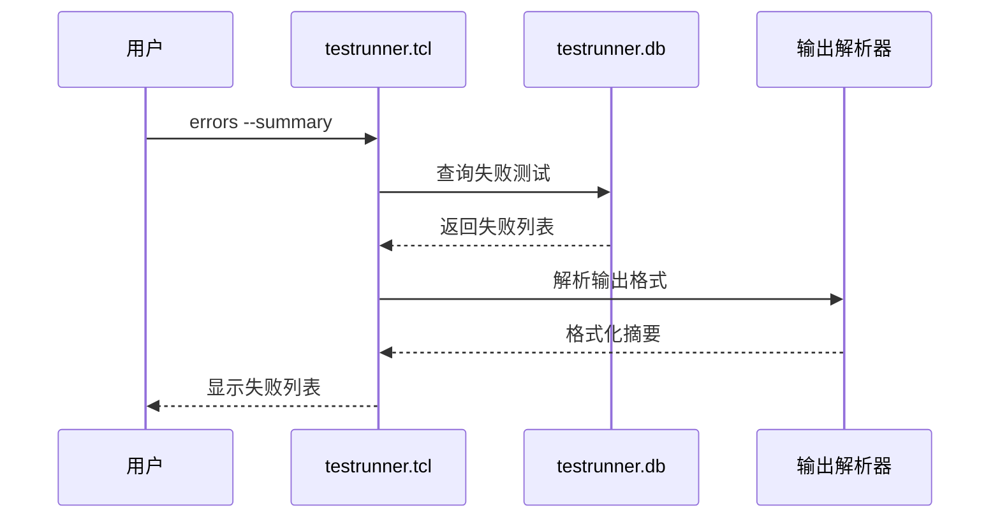
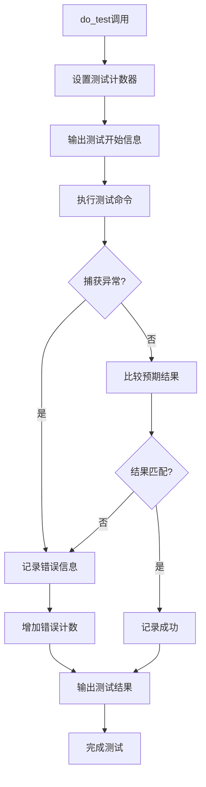
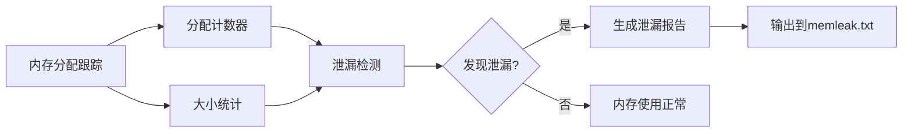
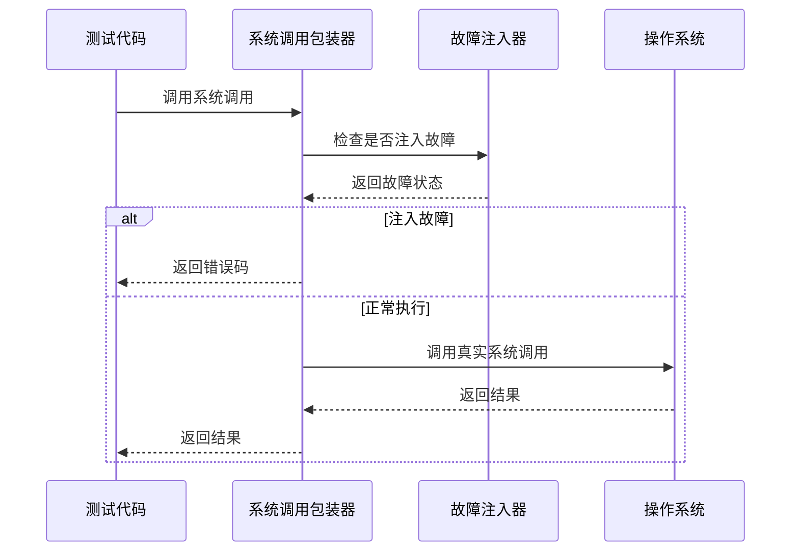
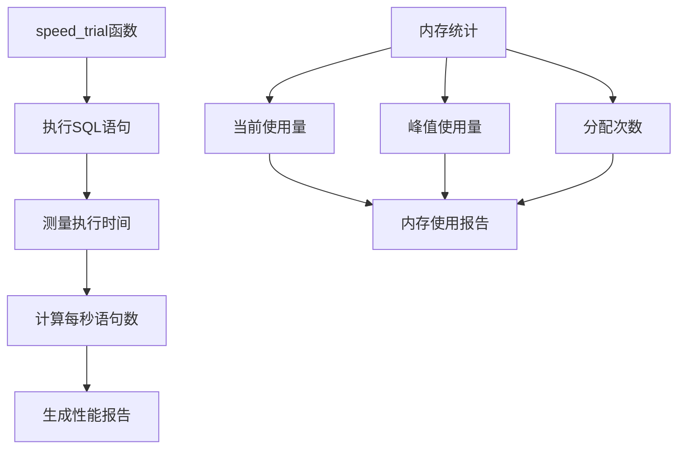

# 错误排查

<cite>
**本文档中引用的文件**
- [doc/testrunner.md](file://doc/testrunner.md)
- [test/testrunner.tcl](file://test/testrunner.tcl)
- [test/tester.tcl](file://test/tester.tcl)
- [src/test_malloc.c](file://src/test_malloc.c)
- [src/test_syscall.c](file://src/test_syscall.c)
- [src/test_vfs.c](file://src/test_vfs.c)
- [tool/fuzzershell.c](file://tool/fuzzershell.c)
- [test/threadtest3.c](file://test/threadtest3.c)
</cite>

## 目录
1. [概述](#概述)
2. [测试运行器架构](#测试运行器架构)
3. [错误日志系统](#错误日志系统)
4. [使用grep命令快速定位错误](#使用grep命令快速定位错误)
5. [errors命令详解](#errors命令详解)
6. [测试框架核心机制](#测试框架核心机制)
7. [常见错误模式识别](#常见错误模式识别)
8. [调试和故障排除](#调试和故障排除)
9. [性能监控和内存分析](#性能监控和内存分析)
10. [最佳实践和建议](#最佳实践和建议)

## 概述

SQLite测试系统是一个复杂的多层测试框架，包含测试运行器、测试执行器和错误诊断工具。本指南将详细介绍如何使用各种工具和技术来排查和解决测试过程中出现的各种错误。

## 测试运行器架构

SQLite测试系统采用分层架构设计：



**图表来源**
- [test/testrunner.tcl](file://test/testrunner.tcl#L1-L50)
- [test/tester.tcl](file://test/tester.tcl#L1-L50)

**章节来源**
- [test/testrunner.tcl](file://test/testrunner.tcl#L220-L242)
- [doc/testrunner.md](file://doc/testrunner.md#L1-L50)

## 错误日志系统

### 日志文件结构

SQLite测试系统维护两个主要的日志文件：

| 文件名 | 用途 | 内容类型 |
|--------|------|----------|
| testrunner.log | 主要错误日志 | 测试输出、错误信息、警告 |
| testrunner.db | 结构化数据库 | 测试状态、统计信息、详细结果 |

### 错误标记系统

测试系统使用特定的标记来标识不同类型的信息：

| 标记 | 含义 | 示例 |
|------|------|------|
| `!` | 严重错误或失败 | `! test123 expected: [1] got: [0]` |
| `FAILED` | 测试失败 | `FAILED: test_case_name` |
| `ERROR` | 系统错误 | `ERROR: malloc failed` |
| `WARNING` | 警告信息 | `Warning: memory leak detected` |

**章节来源**
- [test/testrunner.tcl](file://test/testrunner.tcl#L800-L846)

## 使用grep命令快速定位错误

### 基本grep命令

#### 快速查找所有错误信息
```bash
# 查找以感叹号开头的行（严重错误）
grep "^!" testrunner.log

# 查找包含"failed"关键词的行
grep failed testrunner.log

# 查找包含"ERROR"的行
grep ERROR testrunner.log

# 查找包含"WARNING"的行
grep WARNING testrunner.log
```

#### 高级grep搜索技巧

```bash
# 查找特定测试的错误信息
grep "^!.*test_name" testrunner.log

# 查找超时错误
grep "timeout\|timed out" testrunner.log

# 查找内存相关错误
grep -i "memory\|malloc\|leak" testrunner.log

# 查找断言失败
grep -i "assert\|failed" testrunner.log

# 查找段错误或核心转储
grep -i "segfault\|core dumped\|abort" testrunner.log
```

### 正则表达式高级搜索

```bash
# 查找格式化的错误消息
grep -E "^!.*expected.*got" testrunner.log

# 查找时间相关的错误
grep -E "(timeout|exceeded|slow)" testrunner.log

# 查找特定类型的测试失败
grep -E "test_[0-9]+.*FAILED" testrunner.log
```

**章节来源**
- [doc/testrunner.md](file://doc/testrunner.md#L30-L40)

## errors命令详解

### 基本语法

```bash
# 显示所有失败的测试
tclsh testrunner.tcl errors

# 显示详细输出（包含完整日志）
tclsh testrunner.tcl errors --verbose

# 显示摘要报告（只显示失败列表）
tclsh testrunner.tcl errors --summary

# 组合选项
tclsh testrunner.tcl errors --verbose --summary
```

### --verbose模式详解

`--verbose`模式显示完整的测试输出，包括：

1. **完整测试名称**：显示完整的测试路径和名称
2. **详细错误信息**：包含完整的错误堆栈和上下文
3. **预期与实际结果对比**：清晰展示差异
4. **环境信息**：操作系统、平台、配置等



**图表来源**
- [test/testrunner.tcl](file://test/testrunner.tcl#L820-L846)

### --summary模式详解

`--summary`模式提供精简的报告：

1. **失败测试列表**：只显示失败的测试名称
2. **统计信息**：总测试数、失败数、成功率
3. **快速概览**：帮助快速了解整体测试状态



**图表来源**
- [test/testrunner.tcl](file://test/testrunner.tcl#L800-L820)

**章节来源**
- [test/testrunner.tcl](file://test/testrunner.tcl#L785-L846)

## 测试框架核心机制

### do_test函数机制

测试框架的核心是`do_test`函数，它负责执行单个测试并验证结果：



**图表来源**
- [test/tester.tcl](file://test/tester.tcl#L700-L800)

### 测试执行流程

1. **测试初始化**：设置测试环境和数据库连接
2. **命令执行**：运行测试脚本或SQL语句
3. **结果验证**：比较实际输出与预期结果
4. **错误处理**：记录失败原因和上下文信息
5. **清理工作**：关闭数据库连接和临时文件

### 断言机制

测试框架提供了多种断言类型：

| 断言类型 | 用途 | 示例 |
|----------|------|------|
| `do_test` | 基本断言 | 验证简单结果 |
| `do_execsql_test` | SQL执行断言 | 验证SQL查询结果 |
| `do_catchsql_test` | 异常断言 | 验证错误情况 |
| `do_eqp_test` | 执行计划断言 | 验证查询优化 |

**章节来源**
- [test/tester.tcl](file://test/tester.tcl#L800-L1000)

## 常见错误模式识别

### 内存泄漏检测

SQLite测试系统内置了内存泄漏检测机制：



**图表来源**
- [test/tester.tcl](file://test/tester.tcl#L1300-L1400)

#### 内存泄漏典型日志特征

```
Unfreed memory: 1024 bytes in 5 allocations
Writing unfreed memory log to "./memleak.txt"
```

### 断言失败模式

#### 基本断言失败
```
! test123 expected: [1] got: [0]
```

#### 正则表达式断言失败
```
! test456 expected: /pattern/
! test456 got:      [actual_result]
```

#### 数值范围断言失败
```
! test789 expected: #/100..200/
! test789 got:      [95]
```

### 超时错误识别

#### 超时错误的典型特征
```
test timed out after 10000ms
timeout error: operation took too long
```

#### 性能问题检测
```
test exceeded expected runtime by 500%
slow test detected: execution time = 15000ms
```

### 系统调用错误

测试系统可以模拟系统调用失败：



**图表来源**
- [src/test_syscall.c](file://src/test_syscall.c#L171-L226)

**章节来源**
- [src/test_malloc.c](file://src/test_malloc.c#L587-L627)
- [src/test_syscall.c](file://src/test_syscall.c#L171-L226)

## 调试和故障排除

### 数据库状态检查

使用testrunner.db数据库进行状态分析：

```sql
-- 查看所有失败的测试
SELECT * FROM jobs WHERE state='failed';

-- 查看测试统计信息
SELECT COUNT(*) as total, 
       SUM(CASE WHEN state='failed' THEN 1 ELSE 0 END) as failed,
       SUM(CASE WHEN state='done' THEN 1 ELSE 0 END) as passed
FROM jobs;

-- 查看长时间运行的测试
SELECT displayname, span/1000.0 as duration_seconds 
FROM jobs 
WHERE span > 30000 
ORDER BY span DESC;
```

### 并发测试调试

对于线程测试，使用专门的调试工具：

```bash
# 运行线程测试
tclsh testrunner.tcl threadtest1

# 查看线程状态
tclsh testrunner.tcl status -d 2

# 分析线程冲突
grep -i "race\|deadlock\|mutex" testrunner.log
```

### 内存调试

启用内存调试功能：

```bash
# 启用内存跟踪
tclsh testrunner.tcl --malloctrace=1

# 设置堆限制
tclsh testrunner.tcl --soft-heap-limit=1000000

# 启用回溯跟踪
tclsh testrunner.tcl --backtrace=20
```

**章节来源**
- [test/testrunner.tcl](file://test/testrunner.tcl#L850-L950)

## 性能监控和内存分析

### 性能测试框架

SQLite提供了内置的性能测试工具：



**图表来源**
- [test/tester.tcl](file://test/tester.tcl#L1200-L1300)

### 内存分析工具

#### 自动内存泄漏检测
当测试完成时，系统会自动检查内存泄漏：

```bash
# 检查未释放的内存
grep "Unfreed memory" testrunner.log

# 查看内存使用统计
grep "Maximum memory usage" testrunner.log
```

#### 内存调试输出
```bash
# 生成内存使用报告
tclsh testrunner.tcl --malloctrace=1

# 查看malloc调用统计
grep "Number of malloc()" testrunner.log
```

### 性能瓶颈识别

#### 慢查询检测
```bash
# 查找慢于1秒的测试
grep "execution time.*[1-9]\." testrunner.log

# 查找性能下降的测试
grep "exceeded expected runtime" testrunner.log
```

#### 资源竞争检测
```bash
# 查找可能的竞争条件
grep -i "race condition\|thread conflict" testrunner.log

# 查找锁等待超时
grep -i "busy timeout\|lock wait" testrunner.log
```

**章节来源**
- [test/tester.tcl](file://test/tester.tcl#L1300-L1400)

## 最佳实践和建议

### 错误排查流程

1. **初步检查**
   ```bash
   # 查看总体测试状态
   tclsh testrunner.tcl status
   
   # 查看失败测试
   tclsh testrunner.tcl errors --summary
   ```

2. **详细分析**
   ```bash
   # 获取详细错误信息
   tclsh testrunner.tcl errors --verbose
   
   # 搜索特定错误模式
   grep "specific_error_pattern" testrunner.log
   ```

3. **深入调试**
   ```bash
   # 启用详细日志
   tclsh testrunner.tcl --verbose=2
   
   # 启用内存调试
   tclsh testrunner.tcl --malloctrace=1
   ```

### 常见问题解决方案

#### 测试超时问题
- 增加超时时间：`--timeout=30000`
- 检查系统资源：CPU、内存、磁盘IO
- 分析性能瓶颈：使用性能分析工具

#### 内存泄漏问题
- 启用内存跟踪：`--malloctrace=1`
- 分析内存使用模式
- 检查资源清理逻辑

#### 并发测试失败
- 减少并发进程数：`--jobs=4`
- 检查资源竞争
- 分析线程同步问题

### 调试工具推荐

| 工具 | 用途 | 使用场景 |
|------|------|----------|
| `tclsh testrunner.tcl errors` | 错误汇总 | 快速了解失败情况 |
| `grep` | 文本搜索 | 定位具体错误信息 |
| `--verbose` | 详细输出 | 深入分析错误原因 |
| `--malloctrace` | 内存调试 | 检测内存泄漏 |
| `--backtrace` | 堆栈跟踪 | 分析崩溃原因 |

### 自动化错误处理

```bash
#!/bin/bash
# 错误排查自动化脚本

echo "=== SQLite测试错误排查 ==="

# 1. 检查总体状态
echo "1. 测试状态检查:"
tclsh testrunner.tcl status

# 2. 查看失败测试
echo -e "\n2. 失败测试列表:"
tclsh testrunner.tcl errors --summary

# 3. 详细错误分析
echo -e "\n3. 详细错误信息:"
tclsh testrunner.tcl errors --verbose > detailed_errors.txt

# 4. 关键错误搜索
echo -e "\n4. 关键错误模式:"
grep -E "(ERROR|FAILED|timeout|memory|segfault)" detailed_errors.txt

# 5. 性能问题检查
echo -e "\n5. 性能问题检测:"
grep -E "(slow|exceeded|runtime)" detailed_errors.txt

echo -e "\n=== 排查完成 ==="
```

通过遵循这些最佳实践和使用适当的工具，开发者可以有效地诊断和解决SQLite测试过程中遇到的各种问题。记住，系统的分层架构设计使得错误排查可以从宏观到微观逐步深入，确保问题得到彻底解决。