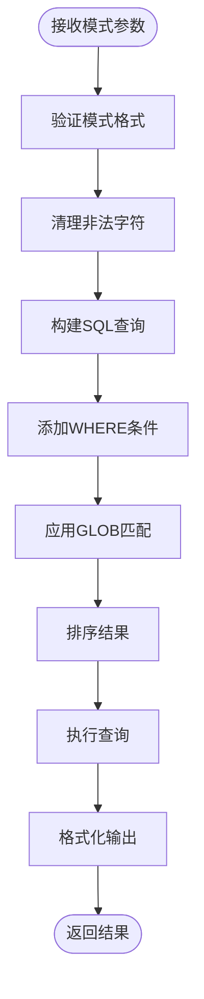

# 命令行工具

<cite>
**本文档中引用的文件**
- [testrunner.tcl](file://test/testrunner.tcl)
- [testrunner.md](file://doc/testrunner.md)
</cite>

## 目录
1. [简介](#简介)
2. [项目结构](#项目结构)
3. [核心组件](#核心组件)
4. [架构概览](#架构概览)
5. [详细组件分析](#详细组件分析)
6. [依赖关系分析](#依赖关系分析)
7. [性能考虑](#性能考虑)
8. [故障排除指南](#故障排除指南)
9. [结论](#结论)

## 简介

SQLite测试运行器是一个强大的命令行工具，专门用于管理和监控SQLite测试套件的执行。该工具提供了多种命令来控制测试进程、监控执行状态以及管理并行任务数量。主要功能包括实时状态监控、任务列表查看、动态调整并行度以及批量停止任务等。

## 项目结构

测试运行器工具位于SQLite项目的`test/`目录下，核心文件为`testrunner.tcl`，配合辅助文档`testrunner.md`提供完整功能说明。

**图表来源**
- [testrunner.tcl](file://test/testrunner.tcl#L658-L783)

**章节来源**
- [testrunner.tcl](file://test/testrunner.tcl#L1-L50)
- [testrunner.md](file://doc/testrunner.md#L1-L50)

## 核心组件

### 数据库架构

测试运行器使用SQLite数据库存储所有测试相关信息，包含两个主要表：

#### jobs表
存储每个测试任务的详细信息：
- `jobid`: 唯一标识符
- `displaytype`: 测试类型（如tcl、fuzz、make）
- `displayname`: 人类可读的任务名称
- `state`: 当前状态（ready、running、done、failed、omit、halt）
- `starttime/endtime`: 时间戳
- `ntest/nerr`: 测试计数和错误计数

#### config表
存储系统配置信息：
- `name`: 配置项名称
- `value`: 对应值

**章节来源**
- [testrunner.tcl](file://test/testrunner.tcl#L308-L365)
- [testrunner.tcl](file://test/testrunner.tcl#L367-L369)

## 架构概览

测试运行器采用事件驱动架构，通过命令行参数识别不同操作模式，并通过SQLite数据库维护状态信息。

**图表来源**
- [testrunner.tcl](file://test/testrunner.tcl#L658-L783)
- [testrunner.tcl](file://test/testrunner.tcl#L418-L461)

## 详细组件分析

### Status命令分析

Status命令提供实时测试状态监控功能，支持两种主要模式：

#### 参数解析机制
- `-d N`: 设置刷新间隔（秒），自动启用cls模式
- `--cls`: 清屏模式，使用VT100转义码格式化输出

#### 状态显示逻辑

**图表来源**
- [testrunner.tcl](file://test/testrunner.tcl#L555-L662)

#### VT100转义码处理
- `\033[H`: 移动光标到左上角
- `\033[2J`: 清屏
- `\033[0J`: 清除屏幕下方内容

**章节来源**
- [testrunner.tcl](file://test/testrunner.tcl#L658-L783)

### Joblist命令分析

Joblist命令提供任务过滤和列表功能，支持复杂的模式匹配机制。

#### 模式匹配算法

**图表来源**
- [testrunner.tcl](file://test/testrunner.tcl#L718-L783)

#### 匹配规则
- 支持通配符`*`、`.`、`-`、`/`
- 忽略大小写匹配
- 组合多个字段进行匹配：`state + displaytype + displayname`
- 使用`lower(concat(...)) GLOB '*pattern*'`进行模糊匹配

**章节来源**
- [testrunner.tcl](file://test/testrunner.tcl#L718-L783)

### Njob命令分析

Njob命令动态调整并行任务数量，通过config表实现配置持久化。

#### 配置更新流程

**图表来源**
- [testrunner.tcl](file://test/testrunner.tcl#L418-L461)

#### 并行度控制机制
- 默认值基于CPU核心数计算
- 可通过环境变量`NJOB`覆盖
- 动态调整不影响已运行任务

**章节来源**
- [testrunner.tcl](file://test/testrunner.tcl#L418-L461)
- [testrunner.tcl](file://test/testrunner.tcl#L1713-L1761)

### Halt命令分析

Halt命令提供批量任务终止功能，通过更新jobs表state字段实现。

#### 批量更新逻辑

**图表来源**
- [testrunner.tcl](file://test/testrunner.tcl#L463-L475)

#### 状态转换规则
- `ready` → `halt`: 立即停止待执行任务
- `''` → `halt`: 停止未分配状态的任务
- 不影响正在运行或已完成的任务

**章节来源**
- [testrunner.tcl](file://test/testrunner.tcl#L463-L475)

## 依赖关系分析

测试运行器与SQLite数据库紧密集成，依赖以下外部组件：

**图表来源**
- [testrunner.tcl](file://test/testrunner.tcl#L1-L50)

**章节来源**
- [testrunner.tcl](file://test/testrunner.tcl#L1-L50)

## 性能考虑

### 并行度优化
- 默认并行度为CPU核心数的一半
- 支持动态调整以适应不同负载
- 使用优先级队列优化任务调度

### 数据库性能
- 使用索引加速状态查询
- 批量操作减少I/O开销
- 事务保证数据一致性

### 内存使用
- 流式处理避免大量内存占用
- 及时释放不再需要的数据
- 合理设置超时防止死锁

## 故障排除指南

### 常见问题及解决方案

#### 数据库访问问题
- **症状**: "Cannot read database: testrunner.db"
- **原因**: 数据库文件不存在或权限不足
- **解决**: 检查文件存在性和访问权限

#### 状态显示异常
- **症状**: 屏幕显示混乱或VT100码显示
- **原因**: 终端不支持VT100转义码
- **解决**: 使用`--cls`选项或升级终端

#### 性能问题
- **症状**: 状态查询响应缓慢
- **原因**: 数据库过大或索引缺失
- **解决**: 重建索引或清理历史数据

**章节来源**
- [testrunner.tcl](file://test/testrunner.tcl#L555-L662)

## 结论

SQLite测试运行器命令行工具提供了完整的测试生命周期管理功能。通过status命令的实时监控、joblist命令的智能过滤、njob命令的动态调优以及halt命令的紧急停止，用户可以高效地管理和监控大规模测试套件的执行。这些工具的设计充分考虑了性能、可用性和易用性，是SQLite开发过程中不可或缺的重要组件。