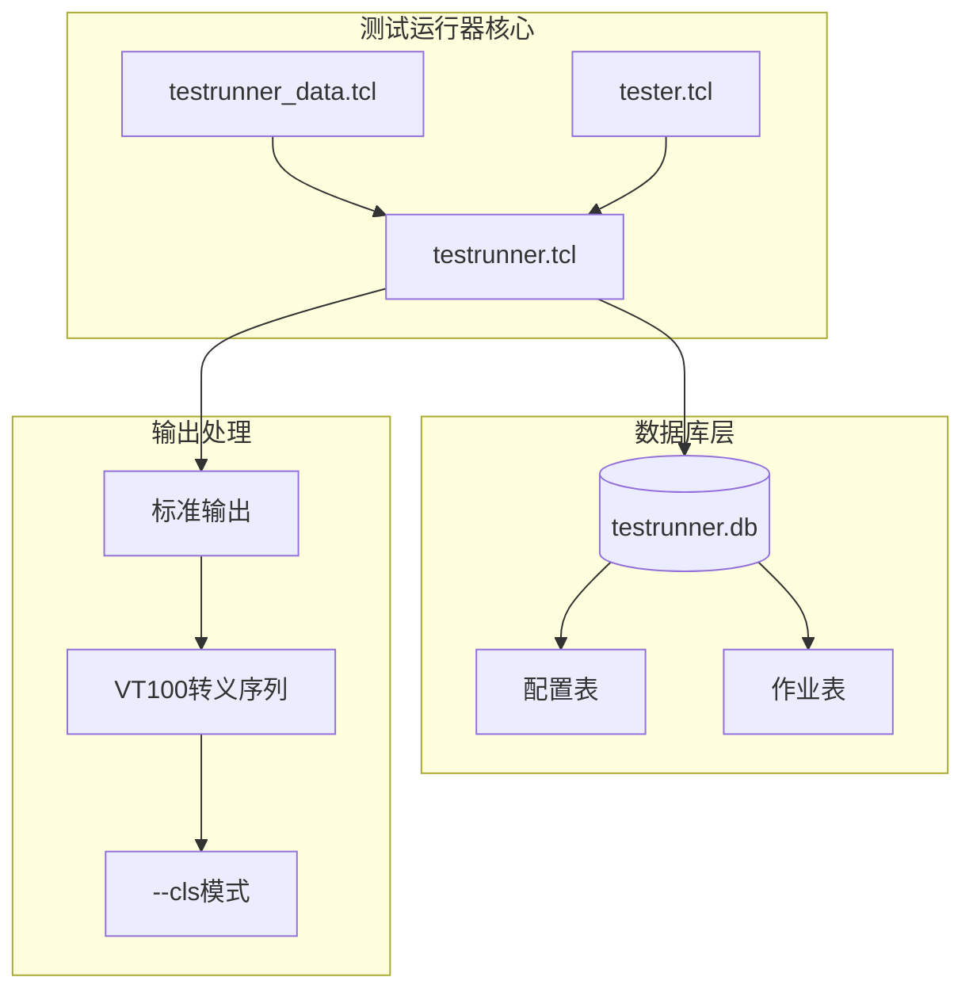
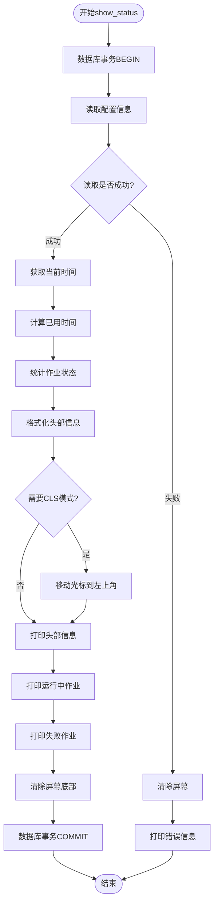
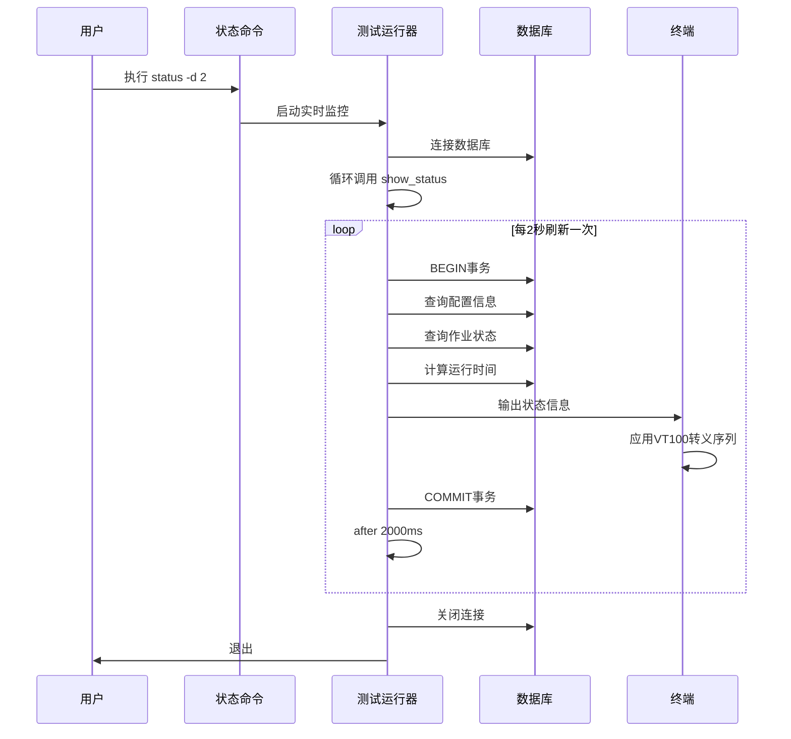
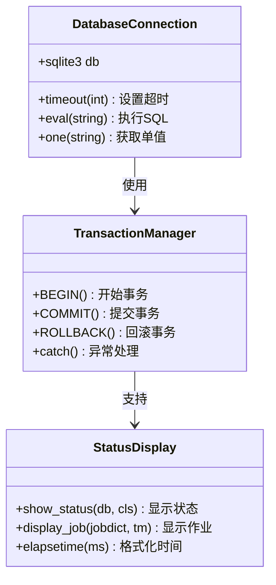
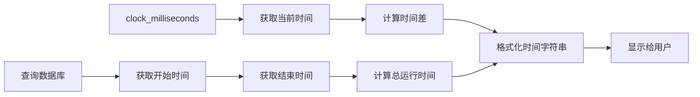
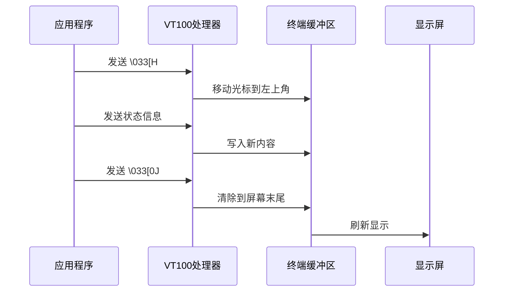
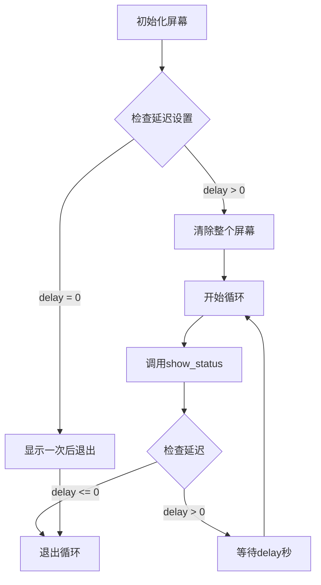
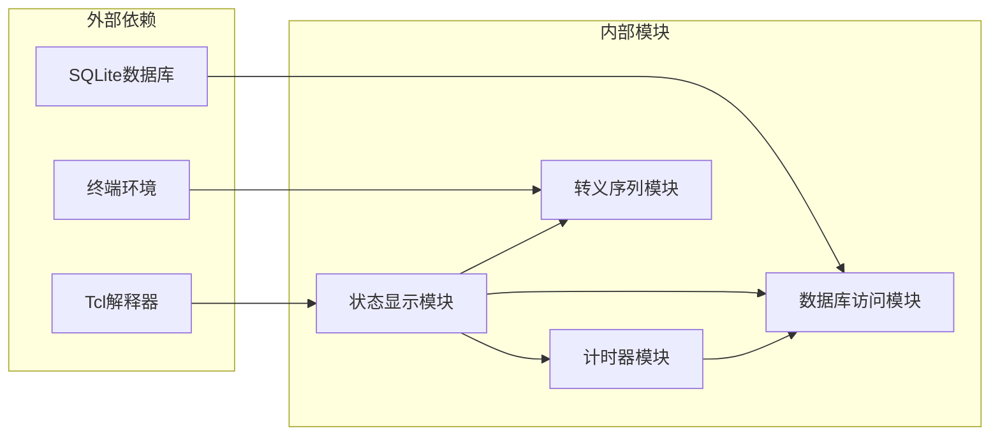

# 实时更新

<cite>
**本文档中引用的文件**
- [testrunner.tcl](file://test/testrunner.tcl)
- [testrunner_data.tcl](file://test/testrunner_data.tcl)
- [testrunner.md](file://doc/testrunner.md)
- [vt100-a.sql](file://test/vt100-a.sql)
- [tester.tcl](file://test/tester.tcl)
- [tclsqlite.c](file://src/tclsqlite.c)
- [date.c](file://src/date.c)
</cite>

## 目录
1. [简介](#简介)
2. [项目结构概述](#项目结构概述)
3. [核心组件分析](#核心组件分析)
4. [架构概览](#架构概览)
5. [详细组件分析](#详细组件分析)
6. [依赖关系分析](#依赖关系分析)
7. [性能考虑](#性能考虑)
8. [故障排除指南](#故障排除指南)
9. [结论](#结论)

## 简介

SQLite测试运行器（testrunner.tcl）是一个复杂的Tcl脚本，专门设计用于并行执行多个SQLite测试，从而显著减少多核机器上的测试时间。该系统的核心特性之一是其状态实时刷新机制，该机制通过VT100转义序列实现流畅的监控界面显示。

本文档深入分析了测试运行器的状态实时刷新机制，重点关注以下关键方面：
- VT100转义序列的屏幕定位与清屏原理
- --cls模式下的周期性刷新实现
- 数据库事务的隔离作用
- 计时器同步机制
- 光标定位和缓冲区刷新的具体实现

## 项目结构概述

测试运行器系统采用模块化架构，主要包含以下核心组件：

**图表来源**
- [testrunner.tcl](file://test/testrunner.tcl#L1-L50)
- [testrunner_data.tcl](file://test/testrunner_data.tcl#L1-L50)

**章节来源**
- [testrunner.tcl](file://test/testrunner.tcl#L1-L100)
- [testrunner_data.tcl](file://test/testrunner_data.tcl#L1-L100)

## 核心组件分析

### 显示状态函数（show_status）

`show_status`函数是整个实时刷新机制的核心，负责从数据库读取状态信息并格式化输出到终端。

**图表来源**
- [testrunner.tcl](file://test/testrunner.tcl#L575-L725)

### VT100转义序列处理

测试运行器使用VT100转义序列实现高效的屏幕控制：

| 转义序列 | 功能 | 用途 |
|---------|------|------|
| `\033[H` | 光标定位到左上角 | 清除屏幕并重新开始显示 |
| `\033[2J` | 清屏 | 初始化屏幕显示 |
| `\033[0J` | 清除光标到屏幕末尾 | 清理屏幕底部内容 |

**章节来源**
- [testrunner.tcl](file://test/testrunner.tcl#L575-L725)

## 架构概览

测试运行器的实时刷新架构采用分层设计，确保高效的状态更新和用户界面响应：

**图表来源**
- [testrunner.tcl](file://test/testrunner.tcl#L670-L690)

## 详细组件分析

### 数据库事务隔离机制

测试运行器使用SQLite数据库存储测试状态信息，通过事务管理确保数据一致性：

**图表来源**
- [testrunner.tcl](file://test/testrunner.tcl#L575-L585)
- [tclsqlite.c](file://src/tclsqlite.c#L3554-L3591)

### 计时器同步机制

系统使用精确的时间计算来提供准确的进度信息：

**图表来源**
- [testrunner.tcl](file://test/testrunner.tcl#L585-L595)
- [date.c](file://src/date.c#L1244-L1284)

### 光标定位和缓冲区刷新

实时刷新的关键在于精确的光标控制和缓冲区管理：

**图表来源**
- [testrunner.tcl](file://test/testrunner.tcl#L605-L615)
- [testrunner.tcl](file://test/testrunner.tcl#L675-L685)

**章节来源**
- [testrunner.tcl](file://test/testrunner.tcl#L575-L725)

### --cls模式下的周期性刷新

当启用`--cls`选项时，系统会定期清屏并重新显示完整状态：

**图表来源**
- [testrunner.tcl](file://test/testrunner.tcl#L670-L690)

**章节来源**
- [testrunner.tcl](file://test/testrunner.tcl#L670-L690)

## 依赖关系分析

测试运行器的状态实时刷新机制涉及多个组件的协调工作：

**图表来源**
- [testrunner.tcl](file://test/testrunner.tcl#L1-L50)
- [testrunner_data.tcl](file://test/testrunner_data.tcl#L1-L50)

**章节来源**
- [testrunner.tcl](file://test/testrunner.tcl#L1-L100)
- [testrunner_data.tcl](file://test/testrunner_data.tcl#L1-L100)

## 性能考虑

实时刷新机制在设计时充分考虑了性能优化：

### 数据库访问优化
- 使用事务减少数据库锁定开销
- 缓存配置信息避免重复查询
- 批量查询统计信息

### 屏幕更新优化
- 只在必要时发送VT100转义序列
- 使用流式输出避免缓冲区溢出
- 智能的时间格式化减少计算开销

### 内存管理
- 及时释放临时变量
- 避免大对象的频繁创建
- 合理的数组操作

## 故障排除指南

### 常见问题及解决方案

| 问题 | 症状 | 解决方案 |
|------|------|----------|
| 屏幕闪烁 | 实时刷新时出现屏幕闪烁 | 检查VT100支持，确保终端兼容 |
| 时间显示不准确 | 运行时间计算错误 | 验证数据库时间戳完整性 |
| 数据库连接超时 | 无法读取测试状态 | 增加数据库超时设置 |
| 内存占用过高 | 长时间运行后内存泄漏 | 检查循环中的资源释放 |

### 调试技巧
- 使用`--dryrun`选项预览执行计划
- 启用详细日志记录跟踪状态变化
- 监控数据库文件大小防止增长过快

**章节来源**
- [testrunner.tcl](file://test/testrunner.tcl#L575-L595)

## 结论

SQLite测试运行器的状态实时刷新机制是一个精心设计的系统，通过以下关键技术实现了高效的测试监控：

1. **VT100转义序列的应用**：精确控制屏幕显示，实现流畅的实时更新
2. **数据库事务管理**：确保状态读取的一致性和可靠性
3. **智能计时算法**：提供准确的进度估算和时间显示
4. **模块化架构设计**：便于维护和扩展功能

该机制不仅为开发者提供了直观的测试进度可视化，还展示了如何在Tcl环境中实现高性能的实时数据处理。通过合理使用这些技术，可以构建出响应迅速、用户体验良好的测试监控系统。