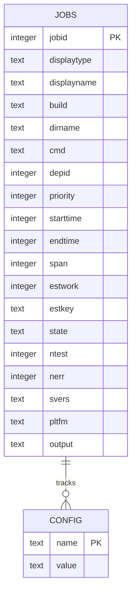
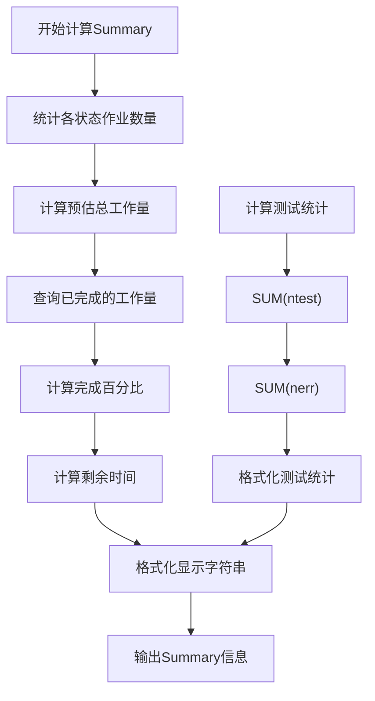
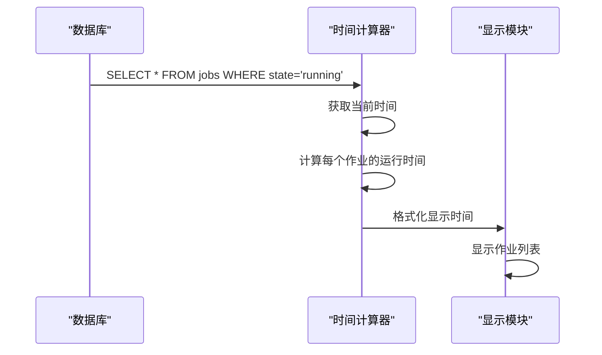
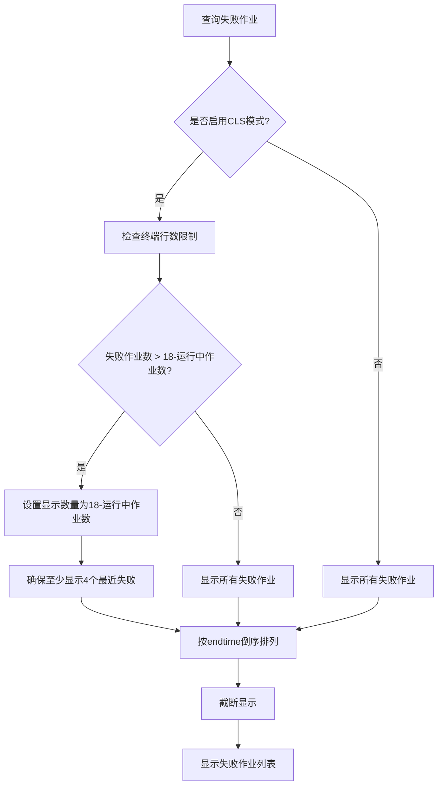
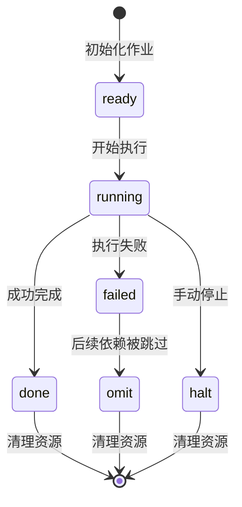
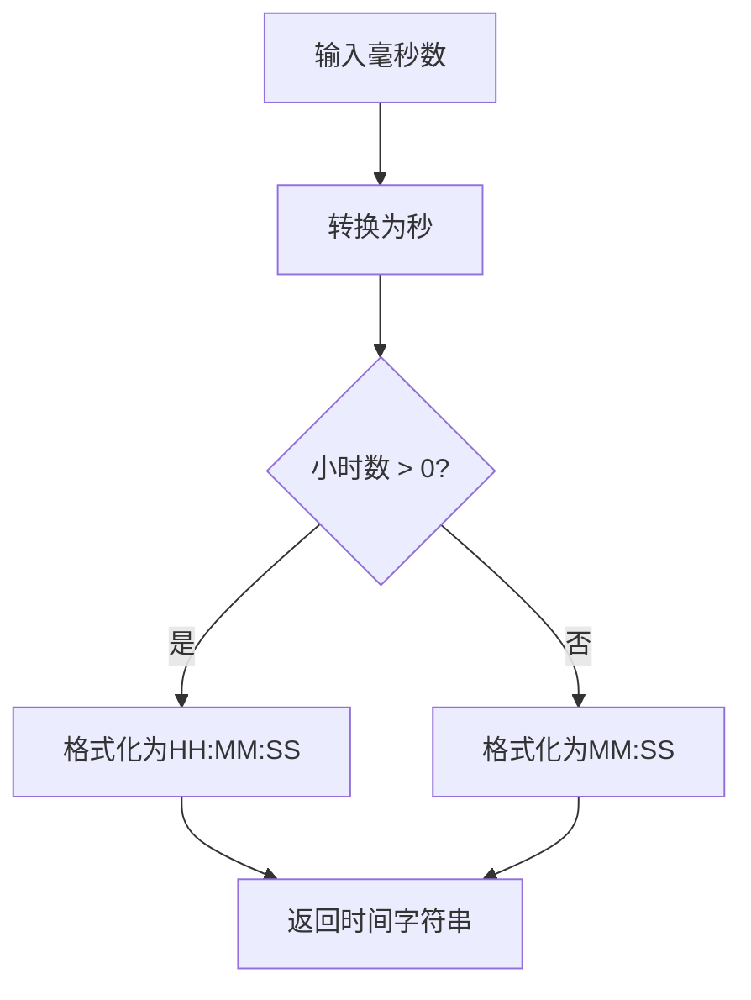

# 测试运行器状态监控报告结构详细文档

<cite>
**本文档引用的文件**
- [testrunner.tcl](file://test/testrunner.tcl)
- [testrunner_data.tcl](file://test/testrunner_data.tcl)
- [testrunner.md](file://doc/testrunner.md)
</cite>

## 目录
1. [概述](#概述)
2. [数据库架构分析](#数据库架构分析)
3. [报告结构详解](#报告结构详解)
4. [核心算法实现](#核心算法实现)
5. [实际输出示例](#实际输出示例)
6. [故障排除指南](#故障排除指南)
7. [总结](#总结)

## 概述

SQLite测试运行器（testrunner.tcl）是一个复杂的并行测试管理系统，它通过SQLite数据库记录和监控所有测试作业的状态。该系统提供了实时的状态监控报告，包含Summary、Running和Failed三个主要部分，每个部分都有其特定的计算逻辑和显示策略。

## 数据库架构分析

### Jobs表结构

测试运行器使用testrunner.db数据库存储所有测试作业的信息，核心的jobs表包含以下关键字段：



**图表来源**
- [testrunner.tcl](file://test/testrunner.tcl#L308-L365)

### 关键字段说明

| 字段名 | 类型 | 描述 | 在报告中的作用 |
|--------|------|------|----------------|
| state | TEXT | 作业状态：ready、running、done、failed、omit、halt | 决定作业在哪个报告部分显示 |
| starttime | INTEGER | 开始时间（毫秒自1970年） | 计算运行时间和剩余时间 |
| endtime | INTEGER | 结束时间（毫秒自1970年） | 计算总执行时间和错误统计 |
| span | INTEGER | 总运行时间（毫秒） | 显示单个作业的执行时间 |
| estwork | INTEGER | 预估工作量 | 计算完成百分比和剩余时间 |
| ntest | INTEGER | 测试用例数量 | 报告总测试数量 |
| nerr | INTEGER | 错误数量 | 报告总错误数量 |

**节来源**
- [testrunner.tcl](file://test/testrunner.tcl#L344-L365)

## 报告结构详解

### Summary部分计算逻辑

Summary部分是整个报告的核心，包含了总体进度信息：



**图表来源**
- [testrunner.tcl](file://test/testrunner.tcl#L596-L622)

#### 耗时计算

耗时计算基于数据库中的时间戳字段：
- 总运行时间：`COALESCE(end_time, current_time) - start_time`
- 单个作业时间：`endtime - starttime`

#### 完成率计算

完成率通过预估工作量计算：
- 已完成工作量：`SUM(CASE WHEN state IN ('done', 'failed', 'omit') THEN estwork ELSE 0 END)`
- 总预估工作量：`SUM(estwork)`
- 完成百分比：`(已完成工作量 / 总预估工作量) * 100`

#### 错误数和测试用例数

系统通过正则表达式从作业输出中提取测试统计：
```tcl
set re {\y(\d+) errors out of (\d+) tests( on [^\n]+\n)?}
if {[regexp $re $output all a b pltfm]} {
    set nerr $a
    set ntest $b
}
```

**节来源**
- [testrunner.tcl](file://test/testrunner.tcl#L1489-L1532)

### Running部分计算逻辑

Running部分显示正在运行的作业及其运行时间：



**图表来源**
- [testrunner.tcl](file://test/testrunner.tcl#L624-L635)

#### 运行时间计算

每个运行中作业的显示时间为：
- 当前时间 - starttime
- 使用`elapsetime`函数格式化为可读的时间字符串

#### 任务已运行时间

系统会根据最大并发数和完成百分比估算剩余时间：
- 剩余时间 = (总时间 / 已完成作业数) * 剩余作业数
- 如果剩余时间小于总时间的2%，则使用总时间的2%作为最小值

**节来源**
- [testrunner.tcl](file://test/testrunner.tcl#L624-L635)

### Failed部分排序和截断机制

Failed部分实现了智能的排序和截断策略：



**图表来源**
- [testrunner.tcl](file://test/testrunner.tcl#L658-L675)

#### 排序机制

失败作业按结束时间倒序排列：
```sql
SELECT * FROM jobs WHERE state='failed' ORDER BY endtime DESC LIMIT $toshow
```

#### 截断显示策略

1. **终端行数限制**：最多显示18行（减去运行中作业数）
2. **最小显示数量**：确保至少显示4个最近失败的作业
3. **省略提示**：如果显示数量少于总失败数量，显示省略信息

**节来源**
- [testrunner.tcl](file://test/testrunner.tcl#L658-L675)

## 核心算法实现

### 状态更新流程



**图表来源**
- [testrunner.tcl](file://test/testrunner.tcl#L1489-L1532)

### 时间格式化函数

`elapsetime`函数负责将毫秒转换为可读的时间格式：



**图表来源**
- [testrunner.tcl](file://test/testrunner.tcl#L550-L565)

### 作业显示格式化

`display_job`函数处理作业名称和时间的显示格式：

1. **名称截断**：超过65字符的名称截断为65字符并添加省略号
2. **时间显示**：使用8字符宽度格式化运行时间
3. **空值处理**：未开始或未结束的作业显示为空白

**节来源**
- [testrunner.tcl](file://test/testrunner.tcl#L555-L570)

## 实际输出示例

### 正常运行状态示例

```
Command: [testrunner.tcl veryquick]
Summary: 00:15, 45/100 jobs, 3 errors, 1200 tests
Running: 4 (max: 8) ETC 00:45
  fts5_common.test         00:02
  jsonb.test               00:01
  test1.test               00:03
  test2.test               00:04
Failed:  2 (must recent 2 shown)
  test3.test
  test4.test
  ... 1 jobs omitted due to failures
```

### 失败较多状态示例

```
Command: [testrunner.tcl release]
Summary: 02:30, 85/200 jobs, 15 errors, 5000 tests
Running: 6 (max: 8) ETC 01:15
  rtree.test               00:15
  fts3.test                00:10
  test5.test               00:08
  test6.test               00:05
  test7.test               00:03
  test8.test               00:02
Failed:  12
  test9.test
  test10.test
  test11.test
  test12.test
  test13.test
  test14.test
  test15.test
  test16.test
  test17.test
  test18.test
  test19.test
  test20.test
```

### 初始状态示例

```
Command: [testrunner.tcl mdevtest]
Summary: 00:00, 0/50 jobs, 0 errors, 0 tests
Running: 0 (max: 4)
```

## 故障排除指南

### 常见问题及解决方案

#### 1. 数据库连接问题

**症状**：显示"Cannot read database: testrunner.db"

**原因**：数据库文件不存在或权限不足

**解决方案**：
- 检查testrunner.db文件是否存在
- 确认当前用户有读写权限
- 使用`file readable`命令验证文件可读性

#### 2. 时间计算异常

**症状**：显示负数或异常大的时间值

**原因**：时间戳字段数据损坏或不一致

**解决方案**：
- 检查jobs表中的starttime和endtime字段
- 验证数据库完整性
- 重新初始化测试环境

#### 3. 失败作业显示不全

**症状**：Failed部分只显示少量作业

**原因**：终端行数限制或截断策略

**解决方案**：
- 减少运行中的作业数量
- 使用非CLS模式查看完整列表
- 增加终端行数

#### 4. 完成百分比计算错误

**症状**：完成百分比显示异常

**原因**：estwork字段数据不准确或缺失

**解决方案**：
- 检查estwork字段的计算逻辑
- 验证测试用例的预估工作量
- 重新生成estwork配置

**节来源**
- [testrunner.tcl](file://test/testrunner.tcl#L596-L622)

## 总结

SQLite测试运行器的状态监控报告系统是一个精心设计的实时监控解决方案。它通过SQLite数据库存储作业状态，利用SQL查询实现高效的统计计算，并通过Tcl脚本提供直观的文本界面。

### 主要特点

1. **实时性**：基于数据库的实时状态更新
2. **准确性**：精确的计时和统计计算
3. **可读性**：清晰的格式化输出和智能截断
4. **可靠性**：完善的错误处理和恢复机制

### 设计优势

- **模块化架构**：清晰分离数据存储、计算和显示层
- **扩展性**：支持多种测试类型和配置
- **容错性**：完善的错误检测和处理机制
- **用户体验**：直观的进度指示和状态反馈

该报告系统为SQLite项目的持续集成和质量保证提供了强有力的支持，确保开发者能够及时了解测试进度和发现问题。