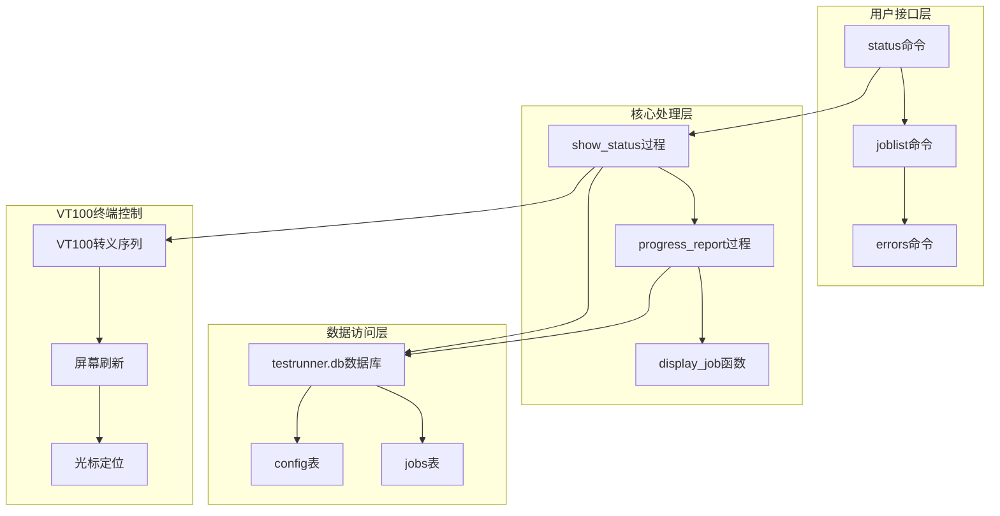
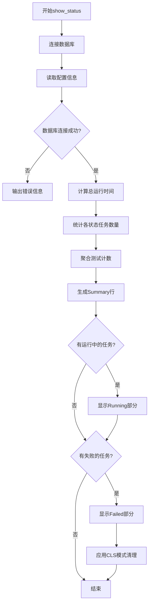
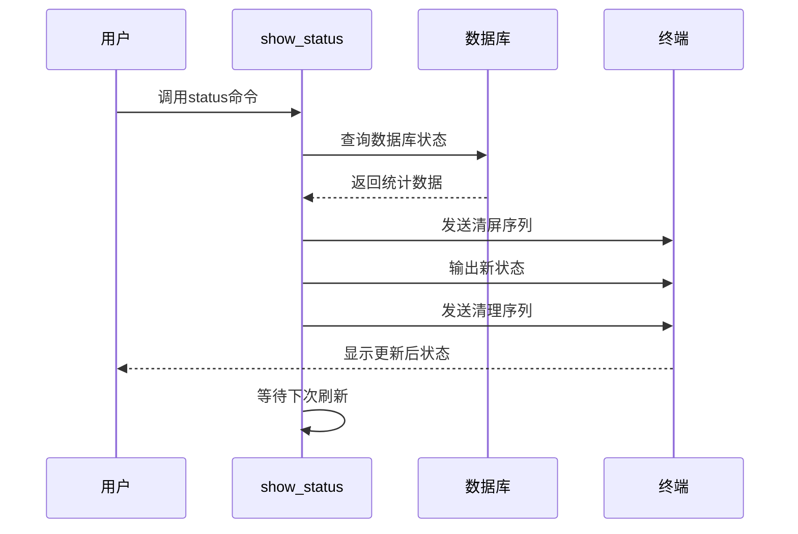

# 状态监控

<cite>
**本文档引用的文件**
- [testrunner.tcl](file://test/testrunner.tcl)
- [testrunner_data.tcl](file://test/testrunner_data.tcl)
</cite>

## 目录
1. [简介](#简介)
2. [系统架构概述](#系统架构概述)
3. [show_status过程详解](#show_status过程详解)
4. [数据库结构与数据聚合](#数据库结构与数据聚合)
5. [VT100转义序列与屏幕刷新](#vt100转义序列与屏幕刷新)
6. [实际使用示例](#实际使用示例)
7. [性能优化与监控指标](#性能优化与监控指标)
8. [故障排除指南](#故障排除指南)
9. [总结](#总结)

## 简介

SQLite测试运行器的状态监控机制是一个复杂而精密的系统，用于实时跟踪和显示测试执行进度。该系统通过`testrunner.db`数据库收集测试数据，并通过`show_status`过程生成详细的实时报告。本文档深入分析了这一机制的实现原理，包括数据聚合算法、屏幕刷新机制以及各种监控功能。

## 系统架构概述

测试运行器状态监控系统采用分层架构设计，主要包含以下组件：



**图表来源**
- [testrunner.tcl](file://test/testrunner.tcl#L555-L725)
- [testrunner.tcl](file://test/testrunner.tcl#L1659-L1711)

## show_status过程详解

`show_status`是状态监控的核心过程，负责从数据库中提取数据并生成格式化的状态报告。

### 核心实现逻辑



**图表来源**
- [testrunner.tcl](file://test/testrunner.tcl#L580-L670)

### 数据聚合算法

`show_status`过程实现了复杂的统计数据聚合算法：

#### 总体进度计算
- **总工作量计算**：通过`estwork`字段累加所有任务的估计工作量
- **已完成工作量**：累加`done`、`failed`和`omit`状态任务的工作量
- **完成百分比**：`(已完成工作量 / 总工作量) * 100`

#### 时间估算机制
系统使用智能的时间估算算法：
- **剩余时间计算**：`剩余时间 = (当前时间 / 已完成工作量) * 剩余工作量`
- **最小时间限制**：确保估算不会小于总时间的2%
- **ETC显示**：仅当完成度达到4%以上时显示预计完成时间

**节来源**
- [testrunner.tcl](file://test/testrunner.tcl#L624-L635)

## 数据库结构与数据聚合

### jobs表结构

`jobs`表是状态监控的核心数据存储结构：

| 字段名 | 类型 | 描述 |
|--------|------|------|
| jobid | INTEGER | 唯一标识符 |
| displaytype | TEXT | 测试类型（如tcl、fuzz、bld） |
| displayname | TEXT | 人类可读的作业名称 |
| state | TEXT | 作业状态（ready、running、done、failed、omit、halt） |
| starttime | INTEGER | 开始时间（毫秒） |
| endtime | INTEGER | 结束时间（毫秒） |
| estwork | INTEGER | 估计工作量 |
| ntest | INTEGER | 执行的测试用例数 |
| nerr | INTEGER | 报告的错误数 |

### 数据聚合查询

系统使用多个SQL查询来生成汇总信息：

#### 状态分布统计
```sql
SELECT state, count(*) AS cnt, sum(estwork) AS ew 
FROM jobs 
GROUP BY 1
```

#### 测试计数聚合
```sql
SELECT sum(ntest) AS nt, sum(nerr) AS ne 
FROM jobs 
HAVING nt>0
```

#### 运行中任务查询
```sql
SELECT * FROM jobs 
WHERE state='running' 
ORDER BY starttime
```

**节来源**
- [testrunner.tcl](file://test/testrunner.tcl#L344-L365)
- [testrunner.tcl](file://test/testrunner.tcl#L600-L610)

## VT100转义序列与屏幕刷新

### 屏幕刷新机制

在`--cls`模式下，系统使用VT100转义序列实现高效的屏幕刷新：

#### 关键转义序列
- `\033[H`：移动光标到屏幕左上角
- `\033[2J`：清除整个屏幕
- `\033[0J`：清除光标到屏幕底部的所有内容

#### 刷新流程



**图表来源**
- [testrunner.tcl](file://test/testrunner.tcl#L615-L620)
- [testrunner.tcl](file://test/testrunner.tcl#L670-L675)

### 失败任务显示策略

系统实现了智能的失败任务显示策略：

#### 数量限制机制
- **终端高度检测**：在24行终端中最多显示18行
- **运行中任务预留**：为运行中的任务预留空间
- **最小显示数量**：至少显示最近的4个失败任务

#### 排序规则
- **时间倒序**：按结束时间降序排列
- **最新优先**：最近失败的任务优先显示

**节来源**
- [testrunner.tcl](file://test/testrunner.tcl#L645-L660)

## 实际使用示例

### status命令使用

#### 基本状态查看
```bash
# 查看当前测试状态
./testrunner.tcl status

# 每5秒刷新一次状态
./testrunner.tcl status -d 5

# 使用CLS模式进行实时刷新
./testrunner.tcl status --cls
```

#### 高级状态监控
```bash
# 结合定时器进行持续监控
while true; do
    ./testrunner.tcl status --cls
    sleep 2
done
```

### joblist命令使用

#### 基本任务列表
```bash
# 显示所有任务
./testrunner.tcl joblist

# 按状态过滤任务
./testrunner.tcl joblist running
./testrunner.tcl joblist failed
./testrunner.tcl joblist "*test*"
```

#### 高级过滤
```bash
# 按显示类型过滤
./testrunner.tcl joblist "tcl*"

# 按名称模式匹配
./testrunner.tcl joblist "*quick*"
```

### errors命令使用

#### 错误信息查看
```bash
# 显示失败任务的摘要
./testrunner.tcl errors -s

# 显示详细的错误输出
./testrunner.tcl errors -v

# 按模式过滤错误
./testrunner.tcl errors "*timeout*"
```

**节来源**
- [testrunner.tcl](file://test/testrunner.tcl#L718-L783)
- [testrunner.tcl](file://test/testrunner.tcl#L785-L850)

## 性能优化与监控指标

### 进度报告优化

系统实现了多层次的性能优化：

#### 内存使用优化
- **延迟加载**：仅在需要时加载大量数据
- **缓存策略**：缓存频繁访问的统计数据
- **内存池**：重用字符串和数组对象

#### 计算效率优化
- **批量查询**：使用单次SQL查询替代多次查询
- **索引利用**：充分利用数据库索引加速查询
- **条件优化**：仅计算必要的统计数据

### 监控指标详解

#### Summary行指标
- **运行时间**：从开始到当前的总运行时间
- **任务完成率**：已完成任务占总任务的比例
- **错误总数**：所有失败任务的错误累计
- **测试总数**：所有任务执行的测试用例总数

#### Running部分指标
- **活跃任务数**：当前正在执行的任务数量
- **最大并发数**：配置的最大并发任务数
- **每个任务运行时间**：显示每个运行中任务的已运行时间

#### Failed部分指标
- **失败任务总数**：所有失败任务的数量
- **省略任务数**：因前置任务失败而被跳过的任务数
- **最近失败任务**：按时间顺序排列的失败任务列表

**节来源**
- [testrunner.tcl](file://test/testrunner.tcl#L1659-L1711)
- [testrunner.tcl](file://test/testrunner.tcl#L610-L620)

## 故障排除指南

### 常见问题诊断

#### 数据库连接问题
**症状**：显示"Cannot read database: testrunner.db"
**解决方案**：
1. 检查数据库文件是否存在
2. 验证文件权限设置
3. 确认数据库未被其他进程锁定

#### VT100支持问题
**症状**：屏幕显示混乱或转义字符可见
**解决方案**：
1. 确认终端支持VT100序列
2. 检查TERM环境变量设置
3. 尝试禁用CLS模式

#### 性能问题
**症状**：状态更新过于频繁或缓慢
**解决方案**：
1. 调整刷新间隔参数
2. 减少并发任务数量
3. 优化数据库查询性能

### 调试技巧

#### 启用详细日志
```bash
# 设置调试级别
export TESTRUNNER_DEBUG=1
./testrunner.tcl status
```

#### 数据库检查
```bash
# 直接查询数据库状态
sqlite3 testrunner.db "SELECT * FROM jobs WHERE state='running'"
```

**节来源**
- [testrunner.tcl](file://test/testrunner.tcl#L610-L615)

## 总结

SQLite测试运行器的状态监控机制是一个精心设计的系统，它通过以下关键特性提供了强大的测试进度监控能力：

1. **实时数据聚合**：通过智能的SQL查询和数据聚合算法，实时计算测试进度和性能指标
2. **高效屏幕刷新**：利用VT100转义序列实现无闪烁的屏幕更新
3. **智能显示策略**：根据终端能力和用户需求动态调整显示内容
4. **多维度监控**：提供任务状态、性能指标、错误统计等多个维度的监控信息

该系统不仅为开发者提供了直观的测试进度可视化，还通过详细的统计数据帮助识别性能瓶颈和潜在问题。其模块化的设计使得各个组件可以独立优化，同时保持整体系统的稳定性和可靠性。

对于测试工程师而言，掌握这些状态监控机制的原理和使用方法，能够显著提高测试效率，快速定位问题，并做出相应的优化决策。