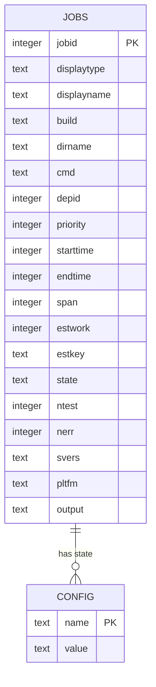
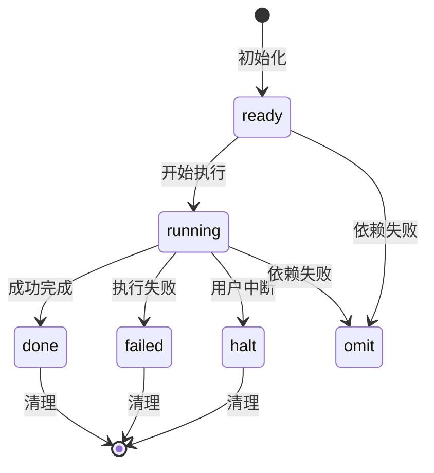
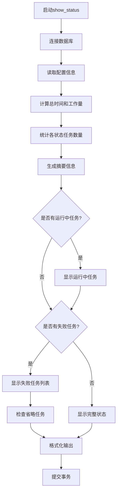
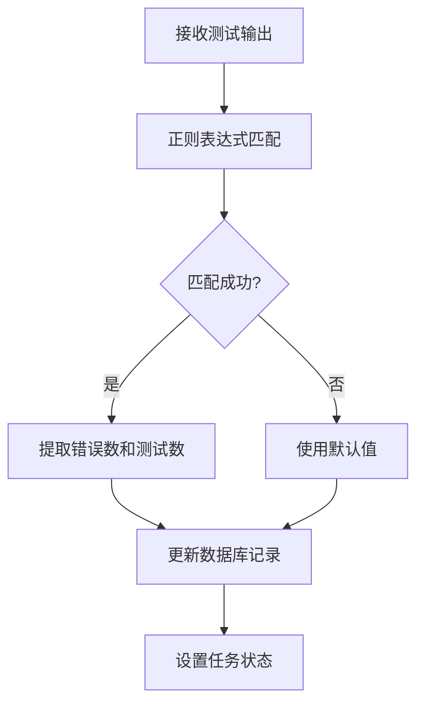
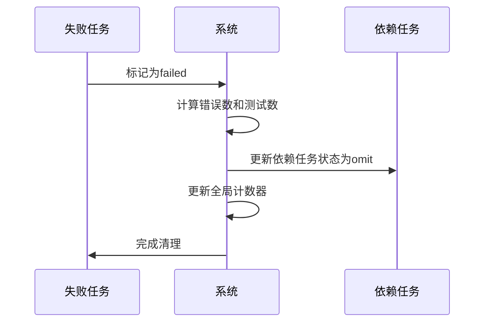
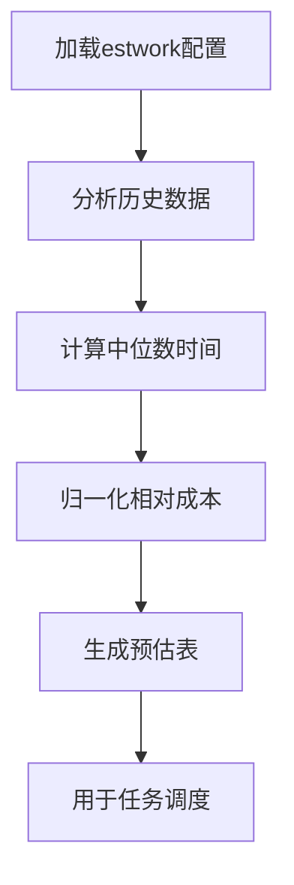

# 监控与诊断

<cite>
**本文档中引用的文件**
- [testrunner.tcl](file://test/testrunner.tcl)
- [testrunner_data.tcl](file://test/testrunner_data.tcl)
- [testrunner_estwork.tcl](file://test/testrunner_estwork.tcl)
- [testrunner.md](file://doc/testrunner.md)
</cite>

## 目录
1. [概述](#概述)
2. [testrunner.db数据库架构](#testrunnerdb数据库架构)
3. [状态管理系统](#状态管理系统)
4. [监控命令详解](#监控命令详解)
5. [日志系统](#日志系统)
6. [故障诊断机制](#故障诊断机制)
7. [SQL查询示例](#sql查询示例)
8. [性能分析](#性能分析)
9. [最佳实践](#最佳实践)

## 概述

SQLite测试运行器（testrunner.tcl）是一个强大的并发测试框架，提供了完整的监控与诊断机制。该系统通过testrunner.db数据库跟踪所有测试任务的状态，并通过testrunner.log文件记录详细的执行输出。本文档深入阐述了这个监控系统的设计原理和使用方法。

## testrunner.db数据库架构

### 数据库结构设计

testrunner.db采用两表结构设计，包含jobs表和config表，用于全面跟踪测试任务的生命周期。



**图表来源**
- [testrunner.tcl](file://test/testrunner.tcl#L302-L367)

### Jobs表结构详解

Jobs表是核心数据结构，包含以下关键字段：

| 字段名 | 类型 | 描述 | 状态转换 |
|--------|------|------|----------|
| jobid | INTEGER | 唯一标识符 | 初始化时分配 |
| displaytype | TEXT | 测试类型（tcl/fuzz/make等） | 不变 |
| displayname | TEXT | 人类可读的任务名称 | 不变 |
| build | TEXT | 构建配置名称 | 不变 |
| dirname | TEXT | 目录名称 | 不变 |
| cmd | TEXT | 执行命令 | 不变 |
| depid | INTEGER | 依赖任务ID | 不变 |
| priority | INTEGER | 优先级值 | 不变 |
| starttime | INTEGER | 开始时间戳（毫秒） | 运行时设置 |
| endtime | INTEGER | 结束时间戳（毫秒） | 运行时设置 |
| span | INTEGER | 总运行时间（毫秒） | 运行时计算 |
| estwork | INTEGER | 预估工作量 | 初始化时设置 |
| estkey | TEXT | 预估工作量键值 | 初始化时设置 |
| state | TEXT | 任务状态 | ready→running→done/failed |
| ntest | INTEGER | 测试用例数量 | 运行时统计 |
| nerr | INTEGER | 错误数量 | 运行时统计 |
| svers | TEXT | SQLite版本 | 运行时提取 |
| pltfm | TEXT | 平台信息 | 运行时提取 |
| output | TEXT | 测试输出内容 | 运行时收集 |

**节来源**
- [testrunner.tcl](file://test/testrunner.tcl#L308-L365)

### Config表结构

Config表存储全局配置信息：

| 字段名 | 类型 | 描述 |
|--------|------|------|
| name | TEXT | 配置项名称（不区分大小写） |
| value | TEXT | 配置项值 |

**节来源**
- [testrunner.tcl](file://test/testrunner.tcl#L367-L370)

### 状态转换机制

任务状态遵循严格的转换规则：



**图表来源**
- [testrunner.tcl](file://test/testrunner.tcl#L358-L359)

## 状态管理系统

### show_status过程详解

show_status过程是监控系统的核心，负责生成实时状态报告。



**图表来源**
- [testrunner.tcl](file://test/testrunner.tcl#L596-L717)

### 状态报告内容

show_status生成的报告包含以下信息：

1. **命令行信息**：显示正在执行的命令
2. **总体摘要**：运行时间、完成任务数、错误数、测试总数
3. **运行状态**：当前运行中的任务数量和最大并发数
4. **预计完成时间**：基于已完成任务的ETC估算
5. **运行中任务**：显示每个运行中任务的名称和已用时间
6. **失败任务**：列出失败的任务及其简要信息
7. **省略任务**：显示因依赖失败而被跳过的任务数量

**节来源**
- [testrunner.tcl](file://test/testrunner.tcl#L596-L717)

## 监控命令详解

### status命令

status命令提供实时状态监控功能：

```bash
# 基本状态显示
tclsh testrunner.tcl status

# 每2秒刷新一次状态
tclsh testrunner.tcl status -d 2

# 使用VT100转义序列全屏显示
tclsh testrunner.tcl status --cls
```

**功能特性**：
- 支持定时刷新（-d选项）
- 支持全屏显示（--cls选项）
- 自动检测终端能力
- 显示详细的进度信息

**节来源**
- [testrunner.tcl](file://test/testrunner.tcl#L690-L717)

### joblist命令

joblist命令允许按模式过滤和显示任务：

```bash
# 显示所有任务
tclsh testrunner.tcl joblist

# 按模式过滤任务
tclsh testrunner.tcl joblist "tcl*"
tclsh testrunner.tcl joblist "*fuzz*"
tclsh testrunner.tcl joblist "make*"

# 支持通配符匹配
tclsh testrunner.tcl joblist "*.test"
```

**过滤逻辑**：
- 将输入模式转换为小写
- 对state、displaytype、displayname进行GLOB匹配
- 支持通配符（*、?）和特殊字符替换

**节来源**
- [testrunner.tcl](file://test/testrunner.tcl#L725-L783)

### errors命令

errors命令专门用于故障诊断：

```bash
# 显示失败任务的基本信息
tclsh testrunner.tcl errors

# 显示详细输出（完整日志）
tclsh testrunner.tcl errors -v

# 显示摘要信息
tclsh testrunner.tcl errors -s

# 组合选项
tclsh testrunner.tcl errors -v -s
```

**输出格式**：
- 失败任务列表
- 每个失败任务的详细输出
- 错误统计信息
- 可选的详细日志输出

**节来源**
- [testrunner.tcl](file://test/testrunner.tcl#L785-L850)

### njob命令

njob命令动态调整并发进程数：

```bash
# 查看当前并发数
tclsh testrunner.tcl njob

# 设置新的并发数（1-128）
tclsh testrunner.tcl njob 8
```

**节来源**
- [testrunner.tcl](file://test/testrunner.tcl#L428-L445)

### halt命令

halt命令优雅地终止测试运行：

```bash
tclsh testrunner.tcl halt
```

该命令将所有ready和未开始的任务标记为halt状态，正在运行的任务会继续完成但不会启动新任务。

**节来源**
- [testrunner.tcl](file://test/testrunner.tcl#L455-L461)

## 日志系统

### testrunner.log文件结构

testrunner.log文件记录所有测试任务的详细输出：

```
### 测试任务名称 运行时间(ms) (状态)
[测试输出内容]
```

**日志格式特点**：
- 每个任务以###开头的标题行
- 紧接着是完整的测试输出
- 包含时间戳和状态信息
- 支持grep等工具进行搜索

**节来源**
- [testrunner.tcl](file://test/testrunner.tcl#L1570-L1575)

### 日志搜索技巧

常用的日志搜索命令：

```bash
# 查找所有失败任务
grep "^!" testrunner.log

# 查找失败信息
grep failed testrunner.log

# 查找特定模式的输出
grep "错误消息" testrunner.log

# 查找超时或异常情况
grep -i "timeout\|error\|fail" testrunner.log
```

### 输出重定向

在不同模式下，输出会被重定向到不同的目标：

- **正常模式**：输出到控制台和testrunner.log
- **--dryrun模式**：仅输出到testrunner.log
- **--explain模式**：输出到标准输出

**节来源**
- [testrunner.tcl](file://test/testrunner.tcl#L112)

## 故障诊断机制

### 自动错误检测

系统自动从测试输出中提取错误信息：



**图表来源**
- [testrunner.tcl](file://test/testrunner.tcl#L1495-L1505)

### 错误分类

系统支持多种错误类型的检测：

1. **语法错误**：编译或解析错误
2. **运行时错误**：执行过程中出现的异常
3. **超时错误**：任务执行超过预设时间
4. **核心转储**：程序崩溃产生的核心文件
5. **依赖失败**：由于前置任务失败导致的跳过

**节来源**
- [testrunner.tcl](file://test/testrunner.tcl#L1545-L1555)

### 依赖关系处理

当一个任务失败时，系统会自动处理依赖关系：



**图表来源**
- [testrunner.tcl](file://test/testrunner.tcl#L1506-L1515)

## SQL查询示例

### 基础统计查询

```sql
-- 获取总体统计信息
SELECT 
    COUNT(*) as total_jobs,
    SUM(CASE WHEN state='done' THEN 1 ELSE 0 END) as completed,
    SUM(CASE WHEN state='failed' THEN 1 ELSE 0 END) as failed,
    SUM(CASE WHEN state='running' THEN 1 ELSE 0 END) as running,
    SUM(CASE WHEN state='ready' THEN 1 ELSE 0 END) as pending
FROM jobs;

-- 按类型统计
SELECT displaytype, COUNT(*) as count 
FROM jobs 
GROUP BY displaytype 
ORDER BY count DESC;
```

### 性能分析查询

```sql
-- 分析各阶段耗时
SELECT 
    displaytype,
    AVG(span) as avg_time_ms,
    MIN(span) as min_time_ms,
    MAX(span) as max_time_ms,
    COUNT(*) as count
FROM jobs 
WHERE state='done'
GROUP BY displaytype
ORDER BY avg_time_ms DESC;

-- 查找最慢的任务
SELECT displayname, span/1000.0 as duration_sec 
FROM jobs 
WHERE state='done'
ORDER BY span DESC 
LIMIT 20;
```

### 失败模式分析

```sql
-- 查找重复失败的任务
SELECT displayname, COUNT(*) as failure_count
FROM jobs 
WHERE state='failed'
GROUP BY displayname
HAVING COUNT(*) > 1
ORDER BY failure_count DESC;

-- 分析失败原因
SELECT 
    SUBSTR(output, 1, 100) as error_sample,
    COUNT(*) as occurrence
FROM jobs 
WHERE state='failed'
GROUP BY error_sample
ORDER BY occurrence DESC;
```

### 资源利用率查询

```sql
-- 并发度分析
WITH time_slots AS (
    SELECT 
        jobid,
        starttime/1000000000 as start_slot,
        endtime/1000000000 as end_slot
    FROM jobs
    WHERE state='done'
)
SELECT 
    start_slot,
    COUNT(*) as concurrent_jobs
FROM time_slots
GROUP BY start_slot
ORDER BY concurrent_jobs DESC;

-- 工作负载分布
SELECT 
    displaytype,
    SUM(estwork) as total_work,
    COUNT(*) as job_count,
    SUM(estwork)/COUNT(*) as avg_work_per_job
FROM jobs
GROUP BY displaytype
ORDER BY total_work DESC;
```

## 性能分析

### 预估工作量系统

testrunner.tcl内置了复杂的工作量预估系统：



**图表来源**
- [testrunner_estwork.tcl](file://test/testrunner_estwork.tcl#L1-L50)

### 任务调度算法

系统使用优先级队列进行任务调度：

1. **优先级计算**：基于priority字段和依赖关系
2. **并发控制**：受njob参数限制
3. **负载均衡**：尽量均匀分布任务到可用进程
4. **依赖处理**：确保依赖任务先完成

### 性能优化建议

1. **合理设置并发数**：根据CPU核心数和I/O能力调整njob
2. **任务分组**：将相似类型的任务放在一起执行
3. **资源隔离**：避免同时运行大量内存密集型任务
4. **监控关键指标**：关注平均执行时间和失败率

**节来源**
- [testrunner.tcl](file://test/testrunner.tcl#L1713-L1725)

## 最佳实践

### 监控策略

1. **定期状态检查**
   ```bash
   # 使用watch命令持续监控
   watch -n 2 tclsh testrunner.tcl status
   
   # 或者使用内置的定时功能
   tclsh testrunner.tcl status -d 5
   ```

2. **日志轮转**
   ```bash
   # 在长时间测试前备份日志
   mv testrunner.log testrunner.log.prev
   
   # 或者使用管道重定向
   tclsh testrunner.tcl status -d 10 > status.log 2>&1 &
   ```

3. **关键指标监控**
   - 总任务数 vs 已完成任务数
   - 失败率趋势
   - 平均执行时间变化
   - 并发度利用率

### 故障排除流程

1. **快速诊断**
   ```bash
   # 1. 查看整体状态
   tclsh testrunner.tcl status
   
   # 2. 查看失败任务
   tclsh testrunner.tcl errors
   
   # 3. 查看具体任务详情
   tclsh testrunner.tcl joblist "*失败任务名*"
   ```

2. **深入分析**
   ```bash
   # 1. 查看详细日志
   tclsh testrunner.tcl errors -v
   
   # 2. 分析数据库状态
   sqlite3 testrunner.db ".schema"
   sqlite3 testrunner.db "SELECT * FROM jobs WHERE state='failed'"
   ```

3. **恢复操作**
   ```bash
   # 1. 中断测试
   tclsh testrunner.tcl halt
   
   # 2. 重新设置并发数
   tclsh testrunner.tcl njob 4
   
   # 3. 重新运行
   ./testfixture test/testrunner.tcl
   ```

### 自动化集成

1. **CI/CD集成**
   ```bash
   # 在构建脚本中添加监控
   tclsh test/testrunner.tcl status -d 30 &
   PID=$!
   
   # 执行测试
   ./testfixture test/testrunner.tcl
   
   # 清理监控进程
   kill $PID
   ```

2. **告警机制**
   ```bash
   # 监控失败率
   FAILURES=$(tclsh test/testrunner.tcl errors | wc -l)
   if [ $FAILURES -gt 0 ]; then
       echo "测试失败: $FAILURES个任务" | mail -s "测试失败" admin@example.com
   fi
   ```

3. **结果报告**
   ```bash
   # 生成HTML报告
   echo "<html><body>" > report.html
   echo "<h1>测试结果报告</h1>" >> report.html
   tclsh test/testrunner.tcl status >> report.html
   echo "</body></html>" >> report.html
   ```

通过掌握这些监控与诊断机制，开发者可以有效地管理和调试SQLite的测试套件，及时发现和解决问题，确保软件质量。