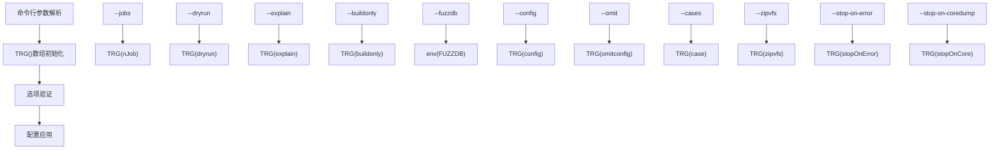
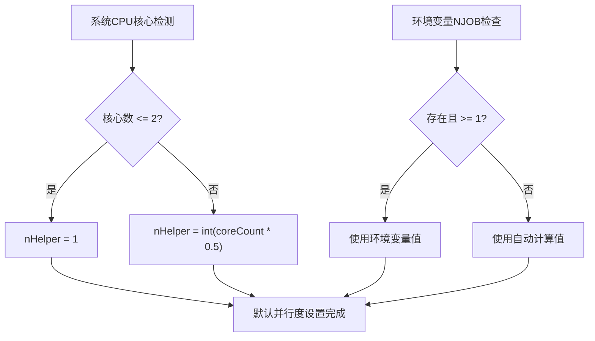
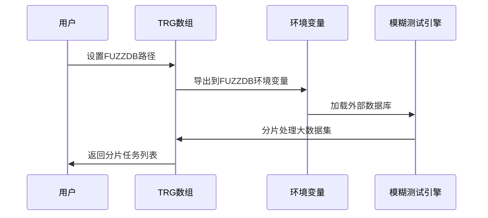
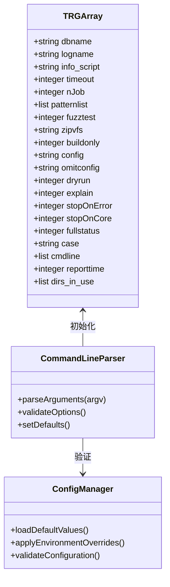

# SQLite测试运行器配置选项详细文档

<cite>
**本文档中引用的文件**
- [testrunner.tcl](file://test/testrunner.tcl)
- [testrunner.md](file://doc/testrunner.md)
- [testrunner_data.tcl](file://test/testrunner_data.tcl)
</cite>

## 目录
1. [概述](#概述)
2. [核心配置选项](#核心配置选项)
3. [并行度控制](#并行度控制)
4. [执行模式选项](#执行模式选项)
5. [数据库和路径选项](#数据库和路径选项)
6. [测试过滤和选择](#测试过滤和选择)
7. [错误处理选项](#错误处理选项)
8. [配置系统架构](#配置系统架构)
9. [实际使用示例](#实际使用示例)
10. [最佳实践建议](#最佳实践建议)

## 概述

SQLite测试运行器(`testrunner.tcl`)是一个功能强大的Tcl脚本，用于在多核机器上并行运行多个SQLite测试，显著减少测试时间。该脚本提供了丰富的命令行选项来控制测试行为，从简单的并行度调整到复杂的测试环境配置。

测试运行器支持多种类型的测试：
- **Tcl测试脚本**：标准的SQLite测试文件
- **模糊测试**：使用外部数据库进行模糊测试
- **构建测试**：通过`make`命令运行的测试（如`make devtest`）

## 核心配置选项

### 命令行参数解析机制

测试运行器通过全局`TRG()`数组存储所有配置选项，该数组在文件开头进行初始化：



**图表来源**
- [testrunner.tcl](file://test/testrunner.tcl#L220-L242)
- [testrunner.tcl](file://test/testrunner.tcl#L848-L889)

### 主要配置选项详解

| 选项 | 短选项 | 类型 | 默认值 | 描述 |
|------|--------|------|--------|------|
| `--jobs NUM` | `-j` | 整数 | 自动检测 | 设置并行工作进程数量 |
| `--dryrun` | `-d` | 布尔 | 0 | 预演模式，只记录而不执行测试 |
| `--explain` | `-e` | 布尔 | 0 | 显示执行计划摘要 |
| `--buildonly` | `-b` | 布尔 | 0 | 仅构建测试二进制文件，不运行测试 |
| `--fuzzdb FILENAME` | 无 | 字符串 | 空 | 指定外部模糊测试数据库文件 |
| `--config CONFIGS` | `-c` | 字符串 | 空 | 只使用逗号分隔列表中的配置 |
| `--omit CONFIGS` | 无 | 字符串 | 空 | 排除逗号分隔列表中的配置 |
| `--cases DISPLAYNAME` | 无 | 字符串 | 空 | 只运行匹配DISPLAYNAME的测试用例 |
| `--zipvfs ZIPVFSDIR` | `-z` | 字符串 | 空 | 指定ZIPVFS源代码目录 |

**节来源**
- [testrunner.tcl](file://test/testrunner.tcl#L108-L134)
- [testrunner.tcl](file://test/testrunner.tcl#L220-L242)

## 并行度控制

### 自动并行度计算

测试运行器会自动检测系统CPU核心数并计算最优的工作进程数量：



**图表来源**
- [testrunner.tcl](file://test/testrunner.tcl#L280-L300)

### 并行度配置方法

1. **自动检测**：默认行为，根据系统核心数自动设置
2. **环境变量**：设置`NJOB`环境变量覆盖自动检测
3. **命令行参数**：使用`--jobs`或`-j`手动指定
4. **运行时修改**：使用`njob`命令动态调整

**节来源**
- [testrunner.tcl](file://test/testrunner.tcl#L280-L300)
- [testrunner.md](file://doc/testrunner.md#L375-L404)

## 执行模式选项

### --dryrun 预演模式

预演模式不会实际执行任何测试，而是将计划执行的shell命令写入日志文件：

- **用途**：验证测试配置和计划
- **输出**：写入`testrunner.log`文件
- **特点**：不启动任何测试进程

### --explain 执行计划摘要

与`--dryrun`类似，但直接在标准输出显示可读的摘要信息：

- **用途**：快速了解将要执行的测试内容
- **输出**：直接显示在终端
- **特点**：便于快速审查测试计划

### --buildonly 仅构建模式

只构建测试所需的二进制文件，跳过实际测试执行：

- **用途**：验证构建配置和依赖关系
- **输出**：构建过程日志
- **特点**：节省测试时间，专注于构建验证

**节来源**
- [testrunner.tcl](file://test/testrunner.tcl#L108-L134)
- [testrunner.md](file://doc/testrunner.md#L320-L340)

## 数据库和路径选项

### --fuzzdb 外部模糊测试数据库

该选项允许使用外部生成的模糊测试数据库：



**图表来源**
- [testrunner.tcl](file://test/testrunner.tcl#L879-L881)
- [testrunner.md](file://doc/testrunner.md#L308-L335)

### --zipvfs ZIPVFS集成

启用ZIPVFS扩展的测试：

- **用途**：测试SQLite与ZIPVFS的集成
- **要求**：需要ZIPVFS源代码目录
- **特点**：支持混合SQLite和ZIPVFS测试

**节来源**
- [testrunner.tcl](file://test/testrunner.tcl#L869-L872)
- [testrunner.md](file://doc/testrunner.md#L280-L295)

## 测试过滤和选择

### 配置过滤选项

| 选项 | 功能 | 使用场景 |
|------|------|----------|
| `--config` | 包含特定配置 | 开发特定功能时的定向测试 |
| `--omit` | 排除特定配置 | 跳过已知失败或耗时的配置 |
| `--cases` | 按显示名称过滤 | 测试特定功能模块 |

### 模式匹配机制

测试运行器使用glob模式匹配来筛选测试：


**图表来源**
- [testrunner.tcl](file://test/testrunner.tcl#L1200-L1250)

**节来源**
- [testrunner.tcl](file://test/testrunner.tcl#L867-L877)
- [testrunner.tcl](file://test/testrunner.tcl#L1200-L1250)

## 错误处理选项

### --stop-on-error 错误停止

遇到第一个错误时立即停止测试：

- **用途**：快速定位问题
- **特点**：节省时间，避免不必要的后续测试
- **适用场景**：调试阶段和关键回归测试

### --stop-on-coredump 核转储停止

当测试产生核心转储时停止：

- **用途**：捕获严重崩溃问题
- **特点**：防止测试继续运行导致资源浪费
- **平台兼容性**：主要在Unix系统上有效

**节来源**
- [testrunner.tcl](file://test/testrunner.tcl#L883-L886)

## 配置系统架构

### TRG()数组结构

测试运行器使用全局`TRG()`数组存储所有配置状态：



**图表来源**
- [testrunner.tcl](file://test/testrunner.tcl#L220-L242)
- [testrunner.tcl](file://test/testrunner.tcl#L848-L889)

### 配置优先级

配置选项的优先级顺序：

1. **命令行参数**（最高）
2. **环境变量**（如`NJOMB`）
3. **默认值**（最低）

**节来源**
- [testrunner.tcl](file://test/testrunner.tcl#L220-L242)
- [testrunner.tcl](file://test/testrunner.tcl#L280-L300)

## 实际使用示例

### 开发前快速验证

```bash
# 快速验证基本功能
./testfixture test/testrunner.tcl --dryrun veryquick

# 预演完整测试计划
./testfixture test/testrunner.tcl --explain release

# 仅构建测试二进制文件
./testfixture test/testrunner.tcl --buildonly mdevtest
```

### 发布前全面测试

```bash
# 完整发布测试
./testfixture test/testrunner.tcl release

# 使用外部模糊测试数据库
./testfixture test/testrunner.tcl release --fuzzdb ../fuzz/20250415.db

# 限制并行度为8个进程
./testfixture test/testrunner.tcl --jobs 8 release

# 排除特定配置
./testfixture test/testrunner.tcl release --omit "Windows-Memdebug,Windows-Win32Heap"
```

### 调试和故障排除

```bash
# 遇到错误时立即停止
./testfixture test/testrunner.tcl --stop-on-error release

# 检查特定测试用例
./testfixture test/testrunner.tcl --cases "fts5*" release

# 使用ZIPVFS扩展测试
./testfixture test/testrunner.tcl --zipvfs /path/to/zipvfs mdevtest
```

### 性能优化配置

```bash
# 根据系统核心数优化并行度
./testfixture test/testrunner.tcl --jobs $(nproc)

# 在CI环境中使用固定并行度
./testfixture test/testrunner.tcl --jobs 4 release

# 使用环境变量控制并行度
export NJOB=6
./testfixture test/testrunner.tcl release
```

## 最佳实践建议

### 开发阶段

1. **使用`--dryrun`进行预演**：在执行完整测试前先验证配置
2. **使用`--explain`获取概览**：快速了解测试计划
3. **使用`--buildonly`验证构建**：确保编译配置正确
4. **使用`--cases`进行定向测试**：专注于特定功能模块

### 测试阶段

1. **合理设置并行度**：避免过度占用系统资源
2. **使用`--stop-on-error`加速调试**：快速定位问题
3. **监控系统资源**：确保测试不会导致系统过载
4. **定期清理测试数据**：避免磁盘空间不足

### 生产环境

1. **使用外部模糊测试数据库**：增强测试覆盖率
2. **配置适当的错误处理**：确保测试结果可靠性
3. **监控测试性能**：识别潜在的性能瓶颈
4. **建立测试报告机制**：跟踪测试结果变化

### 组合使用策略

```bash
# 开发提交前的快速验证
./testfixture test/testrunner.tcl --dryrun --explain veryquick

# 发布前的全面测试
./testfixture test/testrunner.tcl --jobs $(nproc) --stop-on-error --fuzzdb external.db release

# CI环境中的稳定测试
./testfixture test/testrunner.tcl --jobs 4 --omit "Debug,Slow" release
```

通过合理配置这些选项，可以显著提高SQLite测试的效率和效果，同时确保测试结果的可靠性和可重复性。