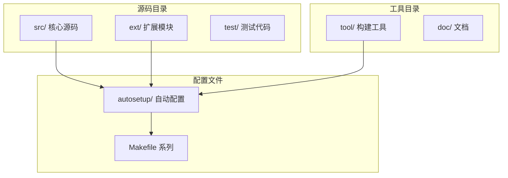
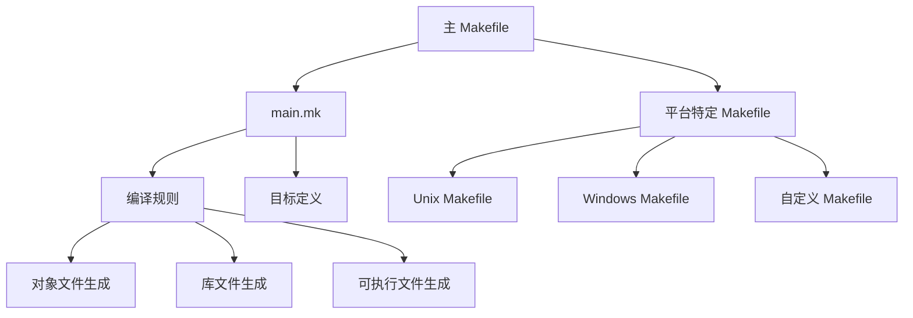
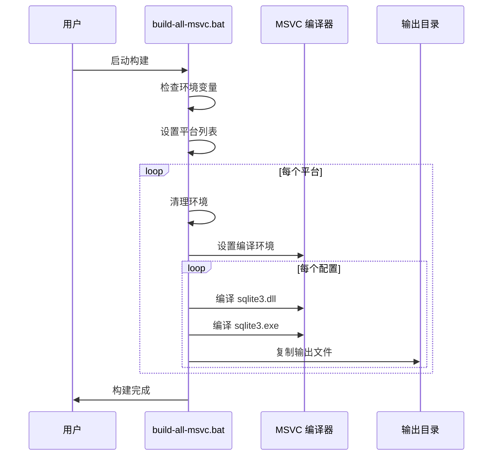
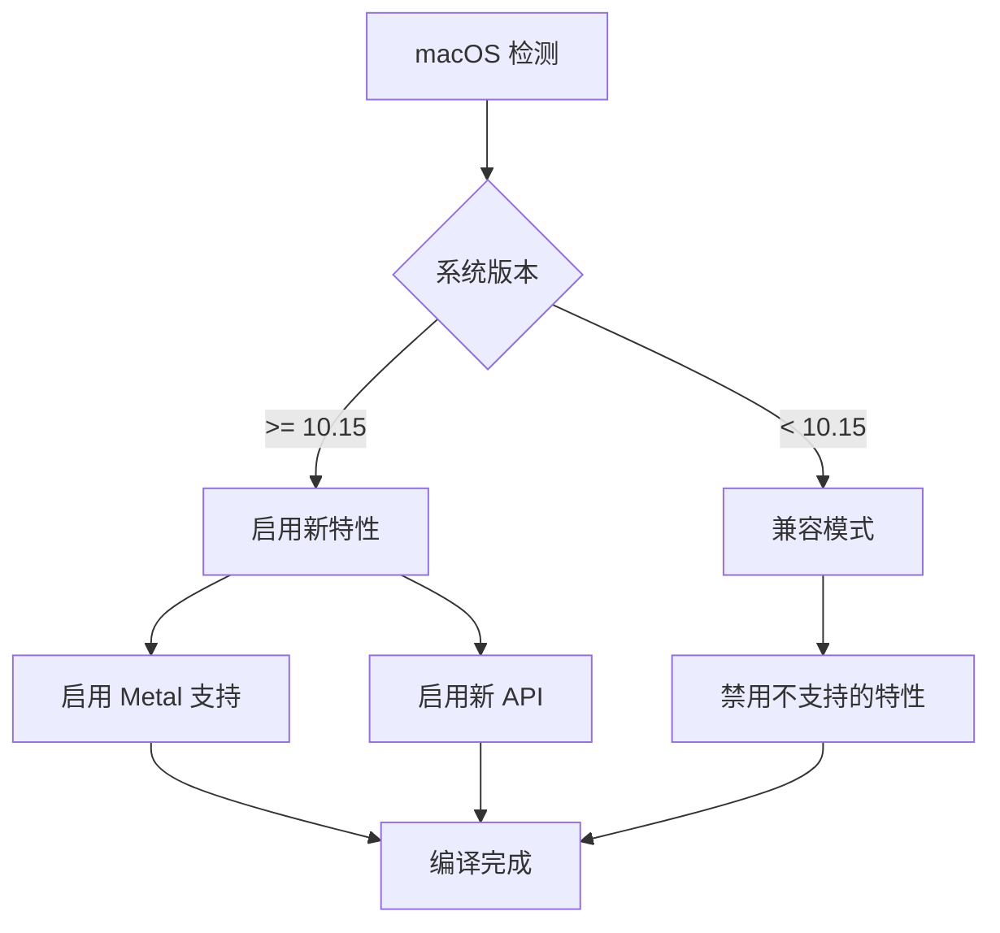
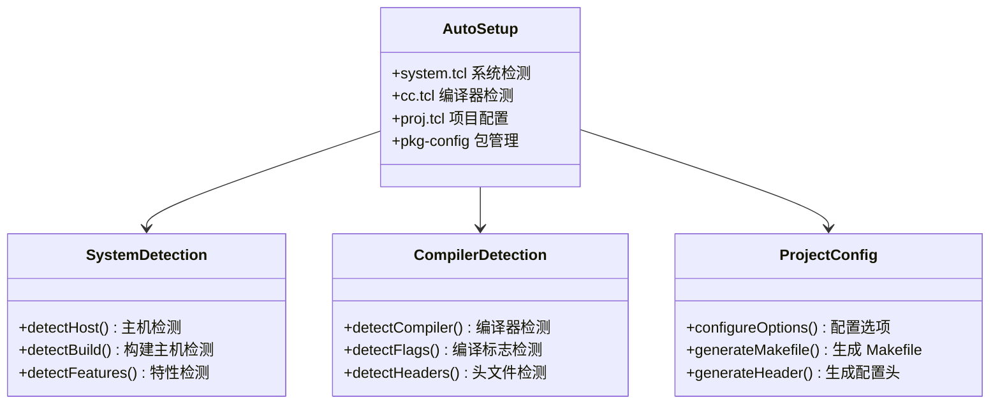
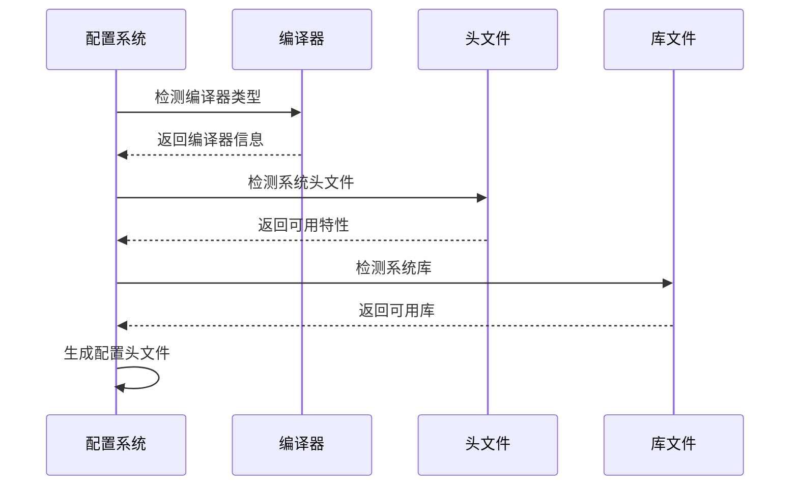

# 平台编译指南

<cite>
**本文档中引用的文件**
- [compile-for-unix.md](file://doc/compile-for-unix.md)
- [compile-for-windows.md](file://doc/compile-for-windows.md)
- [build-shell.sh](file://tool/build-shell.sh)
- [build-all-msvc.bat](file://tool/build-all-msvc.bat)
- [Makefile.msc](file://Makefile.msc)
- [main.mk](file://main.mk)
- [system.tcl](file://autosetup/system.tcl)
- [cc.tcl](file://autosetup/cc.tcl)
- [cc-lib.tcl](file://autosetup/cc-lib.tcl)
- [proj.tcl](file://autosetup/proj.tcl)
- [README.md](file://README.md)
</cite>

## 目录
1. [简介](#简介)
2. [项目结构概览](#项目结构概览)
3. [Unix-like 系统编译](#unix-like-系统编译)
4. [Windows 系统编译](#windows-系统编译)
5. [macOS 系统编译](#macos-系统编译)
6. [编译工具链详解](#编译工具链详解)
7. [平台特定配置](#平台特定配置)
8. [常见编译错误及解决方案](#常见编译错误及解决方案)
9. [性能优化建议](#性能优化建议)
10. [故障排除指南](#故障排除指南)
11. [总结](#总结)

## 简介

SQLite 是一个轻量级的关系型数据库引擎，支持多种操作系统平台。本指南提供了在 Unix-like 系统（Linux、macOS）、Windows 和其他平台上编译 SQLite 的详细步骤和最佳实践。

SQLite 的编译系统设计为高度可移植，支持多种编译器和构建工具：
- **Unix-like 系统**：使用 Makefile 和 shell 脚本
- **Windows 系统**：使用 MSVC（Microsoft Visual C++）和 NMAKE
- **交叉编译**：支持多种目标架构

## 项目结构概览

SQLite 项目采用模块化结构，支持灵活的编译配置：



**图表来源**
- [system.tcl](file://autosetup/system.tcl#L322-L365)
- [main.mk](file://main.mk#L1-L50)

**章节来源**
- [README.md](file://README.md#L1-L50)

## Unix-like 系统编译

### 基础编译环境准备

Unix-like 系统（包括 Linux 和 macOS）使用标准的 Unix 编译流程：

#### 必需工具安装
```bash
# Ubuntu/Debian 系统
sudo apt install gcc make tcl-dev

# CentOS/RHEL 系统  
sudo yum install gcc make tcl-devel

# macOS 系统（使用 Homebrew）
brew install gcc make tcl
```

#### 编译步骤详解

1. **环境准备**
```bash
# 安装必要的开发包
apt install gcc make tcl-dev  # Ubuntu/Debian
tar xzf sqlite.tar.gz         # 解压源码
mkdir bld                     # 创建构建目录
cd bld                        # 进入构建目录
```

2. **配置阶段**
```bash
# 基础配置
../sqlite/configure

# 调试版本配置
../sqlite/configure --enable-all --enable-debug CFLAGS='-O0 -g'

# 发布版本配置
../sqlite/configure --enable-all
```

3. **编译目标**
```bash
# 编译核心命令行工具
make sqlite3

# 生成合并源码文件
make sqlite3.c

# 编译辅助工具
make sqldiff
make sqlite3_rsync

# 需要 TCL 的目标
make tclextension-install
make devtest
make releasetest
make sqlite3_analyzer
```

### Shell 脚本编译方式

对于简单的编译需求，可以使用提供的 shell 脚本：

```bash
#!/bin/sh
# 示例：构建 SQLite 命令行工具
make sqlite3.c
gcc -o sqlite3 -g -Os -I. \
   -DSQLITE_THREADSAFE=0 \
   -DSQLITE_ENABLE_VFSTRACE \
   -DSQLITE_ENABLE_STAT3 \
   -DSQLITE_ENABLE_FTS4 \
   -DSQLITE_ENABLE_RTREE \
   -DHAVE_READLINE \
   ../sqlite/src/shell.c \
   ../sqlite/ext/misc/vfstrace.c \
   sqlite3.c -ldl -lreadline -lncurses
```

### Makefile 构建系统

SQLite 使用多层次的 Makefile 架构：



**图表来源**
- [main.mk](file://main.mk#L1-L100)
- [Makefile.msc](file://Makefile.msc#L1-L50)

**章节来源**
- [compile-for-unix.md](file://doc/compile-for-unix.md#L1-L71)
- [build-shell.sh](file://tool/build-shell.sh#L1-L22)

## Windows 系统编译

### MSVC 编译环境设置

Windows 编译主要使用 Microsoft Visual C++ 编译器：

#### 环境要求
- Visual Studio 2015 或更高版本
- Windows SDK
- TCL 开发库（可选）

#### 编译步骤

1. **启动编译环境**
```cmd
# 使用 x64 Native Tools Command Prompt
cd C:\dev\sqlite\core
call tool\build-all-msvc.bat C:\Temp
```

2. **基础编译命令**
```cmd
# 使用 nmake 编译
nmake /f Makefile.msc sqlite3.exe
nmake /f Makefile.msc sqlite3.c
nmake /f Makefile.msc sqldiff.exe

# 调试版本编译
nmake /f Makefile.msc DEBUG=3 clean sqlite3.exe
```

3. **多平台构建**
```cmd
# 设置平台变量
set PLATFORMS=x86 x86_amd64 x86_arm

# 设置配置变量
set CONFIGURATIONS=Debug Retail

# 执行多平台构建
call tool\build-all-msvc.bat C:\BuildOutput
```

### MSVC 批处理脚本详解

build-all-msvc.bat 脚本提供了完整的多平台构建功能：



**图表来源**
- [build-all-msvc.bat](file://tool/build-all-msvc.bat#L522-L580)

### Windows 特定配置选项

| 配置选项 | 描述 | 默认值 |
|---------|------|--------|
| `USE_AMALGAMATION` | 启用合并源码 | 1 |
| `USE_FULLWARN` | 启用完整警告 | 1 |
| `USE_RUNTIME_CHECKS` | 启用运行时检查 | 0 |
| `USE_STDCALL` | 使用 stdcall 调用约定 | 0 |
| `USE_SEH` | 启用结构化异常处理 | 1 |
| `STATICALLY_LINK_TCL` | 静态链接 TCL | 0 |
| `USE_CRT_DLL` | 动态链接 MSVC 运行时 | 0 |

**章节来源**
- [compile-for-windows.md](file://doc/compile-for-windows.md#L1-L192)
- [build-all-msvc.bat](file://tool/build-all-msvc.bat#L1-L100)

## macOS 系统编译

### Xcode 集成建议

macOS 编译可以与 Xcode 无缝集成：

#### 系统要求
- Xcode Command Line Tools
- macOS SDK
- Homebrew（推荐）

#### 编译配置

1. **使用 Xcode 命令行工具**
```bash
# 安装命令行工具
xcode-select --install

# 设置编译器
export CC=clang
export CXX=clang++
export CFLAGS="-mmacosx-version-min=10.15"
```

2. **配置脚本**
```bash
# macOS 特定配置
./configure --host=x86_64-apple-darwin \
           --enable-all \
           CFLAGS="-mmacosx-version-min=10.15 -DSQLITE_ENABLE_COLUMN_METADATA=1"
```

3. **Universal Binary 构建**
```bash
# 构建 Intel 版本
./configure --host=x86_64-apple-darwin --enable-all
make sqlite3

# 构建 Apple Silicon 版本
./configure --host=arm64-apple-darwin --enable-all
make sqlite3

# 合并为 Universal Binary
lipo -create -output sqlite3-universal sqlite3-x86_64 sqlite3-arm64
```

### macOS 平台特性检测

SQLite 自动检测 macOS 特性：



**图表来源**
- [system.tcl](file://autosetup/system.tcl#L367-L419)

**章节来源**
- [system.tcl](file://autosetup/system.tcl#L367-L419)

## 编译工具链详解

### 自动配置系统

SQLite 使用 autosetup 系统进行自动配置：



**图表来源**
- [system.tcl](file://autosetup/system.tcl#L322-L365)
- [cc.tcl](file://autosetup/cc.tcl#L538-L599)

### 编译器检测机制

SQLite 支持多种编译器的自动检测：

| 编译器 | 检测方式 | 特殊处理 |
|--------|----------|----------|
| GCC | `-dumpversion` | 版本解析 |
| Clang | `-v` | 版本和特性检测 |
| MSVC | 环境变量 | 平台检测 |
| Intel ICC | `--version` | 特性标志 |

### 特性检测流程



**图表来源**
- [cc.tcl](file://autosetup/cc.tcl#L485-L536)

**章节来源**
- [system.tcl](file://autosetup/system.tcl#L1-L100)
- [cc.tcl](file://autosetup/cc.tcl#L538-L599)

## 平台特定配置

### Unix-like 系统配置

#### 编译器标志配置

```bash
# GCC 特定标志
CFLAGS="$CFLAGS -Wall -Wextra -Werror"
CFLAGS="$CFLAGS -fPIC -fvisibility=hidden"
CFLAGS="$CFLAGS -DSQLITE_ENABLE_RTREE=1"

# Clang 特定标志
CFLAGS="$CFLAGS -Weverything"
CFLAGS="$CFLAGS -Wno-padded"
CFLAGS="$CFLAGS -Wno-disabled-macro-expansion"
```

#### 平台检测脚本

```bash
# 检测操作系统类型
case "$(uname -s)" in
    Linux*)
        export PLATFORM="linux"
        ;;
    Darwin*)
        export PLATFORM="darwin"
        ;;
    FreeBSD*)
        export PLATFORM="freebsd"
        ;;
    *)
        export PLATFORM="unknown"
        ;;
esac
```

### Windows 系统配置

#### MSVC 特定配置

```batch
# 设置编译器标志
set CFLAGS=/W4 /WX /D_CRT_SECURE_NO_WARNINGS
set CFLAGS=%CFLAGS% /DSQLITE_ENABLE_COLUMN_METADATA=1
set CFLAGS=%CFLAGS% /DSQLITE_ENABLE_RTREE=1

# 调试配置
set DEBUG=3
set CFLAGS=%CFLAGS% /Od /Zi /DSQLITE_DEBUG=1
```

#### 平台架构支持

| 平台 | 架构 | 编译器标志 |
|------|------|------------|
| x86 | 32位 | `/arch:X86` |
| x64 | 64位 | `/arch:AVX2` |
| ARM | 32位 | `/arch:ARM` |
| ARM64 | 64位 | `/arch:ARM64` |

### macOS 系统配置

#### SDK 版本检测

```bash
# 检测 macOS SDK 版本
MACOSX_DEPLOYMENT_TARGET=$(sw_vers -productVersion | cut -d. -f1,2)
export MACOSX_DEPLOYMENT_TARGET

# 设置编译标志
CFLAGS="$CFLAGS -mmacosx-version-min=$MACOSX_DEPLOYMENT_TARGET"
CFLAGS="$CFLAGS -arch x86_64 -arch arm64"
```

**章节来源**
- [system.tcl](file://autosetup/system.tcl#L367-L419)
- [Makefile.msc](file://Makefile.msc#L1-L100)

## 常见编译错误及解决方案

### 链接器错误

#### 错误类型 1：未找到库文件
```
/usr/bin/ld: cannot find -lcrypto
collect2: error: ld returned 1 exit status
```

**解决方案：**
```bash
# Ubuntu/Debian
sudo apt install libssl-dev

# CentOS/RHEL
sudo yum install openssl-devel

# macOS
brew install openssl
export LDFLAGS="-L/usr/local/opt/openssl/lib"
export CPPFLAGS="-I/usr/local/opt/openssl/include"
```

#### 错误类型 2：符号冲突
```
duplicate symbol _sqlite3_open in:
    .o
    .o
```

**解决方案：**
```bash
# 确保使用正确的编译标志
CFLAGS="$CFLAGS -fno-common"
CFLAGS="$CFLAGS -DSQLITE_OMIT_LOAD_EXTENSION=1"
```

### 头文件缺失错误

#### 错误类型 1：系统头文件找不到
```
fatal error: stdio.h: No such file or directory
```

**解决方案：**
```bash
# Ubuntu/Debian
sudo apt install build-essential

# CentOS/RHEL
sudo yum groupinstall "Development Tools"

# macOS
xcode-select --install
```

#### 错误类型 2：第三方库头文件缺失
```
fatal error: tcl.h: No such file or directory
```

**解决方案：**
```bash
# 安装 TCL 开发包
# Ubuntu/Debian
sudo apt install tcl-dev

# macOS
brew install tcl-tk
export TCLDIR=/usr/local/opt/tcl-tk
```

### 编译器兼容性问题

#### GCC 与 Clang 差异

```bash
# GCC 特有标志
if [ "$CC" = "gcc" ]; then
    CFLAGS="$CFLAGS -Wno-stringop-truncation"
    CFLAGS="$CFLAGS -Wno-stringop-overflow"
fi

# Clang 特有标志
if [ "$CC" = "clang" ]; then
    CFLAGS="$CFLAGS -Wno-unused-command-line-argument"
    CFLAGS="$CFLAGS -Wno-tautological-constant-out-of-range-compare"
fi
```

#### MSVC 兼容性问题

```batch
# MSVC 特有预处理器定义
if defined _MSC_VER (
    set CFLAGS=%CFLAGS% /D_CRT_SECURE_NO_WARNINGS
    set CFLAGS=%CFLAGS% /D_SCL_SECURE_NO_WARNINGS
    set CFLAGS=%CFLAGS% /D_CRT_NONSTDC_NO_DEPRECATE
)
```

### 平台特定问题

#### Linux 权限问题
```bash
# 确保有足够的权限
sudo chown -R $(whoami) /usr/local
chmod +x configure
```

#### macOS 代码签名问题
```bash
# 禁用代码签名（仅测试用途）
export CODE_SIGNING=0
```

**章节来源**
- [cc.tcl](file://autosetup/cc.tcl#L538-L599)
- [proj.tcl](file://autosetup/proj.tcl#L289-L321)

## 性能优化建议

### 编译优化级别

#### 调试版本 vs 发布版本

```bash
# 调试版本（开发时使用）
./configure --enable-all --enable-debug \
           CFLAGS="-O0 -g -DSQLITE_DEBUG=1"

# 发布版本（生产环境使用）
./configure --enable-all \
           CFLAGS="-O2 -DNDEBUG -DSQLITE_ENABLE_FTS5=1"
```

#### 编译器特定优化

```bash
# GCC 优化
CFLAGS="$CFLAGS -O3 -march=native -mtune=native"
CFLAGS="$CFLAGS -flto -fuse-linker-plugin"

# Clang 优化
CFLAGS="$CFLAGS -O3 -march=native"
CFLAGS="$CFLAGS -flto=thin -fwhole-program-vtables"

# MSVC 优化
CFLAGS="$CFLAGS /O2 /GL /Gy"
```

### 特性选择优化

#### 功能裁剪策略

| 功能 | 默认状态 | 推荐配置 | 影响 |
|------|----------|----------|------|
| FTS3 | 启用 | 可选 | 语言包大小 |
| FTS4 | 启用 | 可选 | 语言包大小 |
| FTS5 | 启用 | 可选 | 语言包大小 |
| RTree | 启用 | 可选 | 几何查询 |
| JSON1 | 启用 | 可选 | JSON 处理 |
| Session | 启用 | 可选 | 数据同步 |

#### 内存优化

```bash
# 内存优化配置
CFLAGS="$CFLAGS -DSQLITE_DEFAULT_CACHE_SIZE=10000"
CFLAGS="$CFLAGS -DSQLITE_DEFAULT_PAGE_SIZE=4096"
CFLAGS="$CFLAGS -DSQLITE_DEFAULT_TEMP_CACHE_SIZE=500"
```

### 并行编译优化

#### Makefile 并行配置

```bash
# 使用多个 CPU 核心
make -j$(nproc)

# Windows 平台
nmake /f Makefile.msc /MP
```

#### 编译缓存

```bash
# 使用 ccache（Unix 系统）
export CC="ccache gcc"
export CXX="ccache g++"

# 使用 sccache（跨平台）
export CC="sccache gcc"
export CXX="sccache g++"
```

## 故障排除指南

### 编译环境诊断

#### 环境检查脚本

```bash
#!/bin/bash
# SQLite 编译环境检查

echo "=== SQLite 编译环境诊断 ==="

# 检查编译器
echo "编译器检查:"
which gcc || echo "GCC 未安装"
which clang || echo "Clang 未安装"
which cl || echo "MSVC 未安装"

# 检查工具
echo "工具检查:"
which make || echo "Make 未安装"
which nmake || echo "NMAKE 未安装"
which tclsh || echo "TCL 未安装"

# 检查系统库
echo "库文件检查:"
ldconfig -p | grep ssl || echo "OpenSSL 未安装"
ldconfig -p | grep readline || echo "Readline 未安装"

echo "=== 诊断完成 ==="
```

#### 常见问题排查流程


### 日志分析

#### 编译日志解读

```bash
# 启用详细输出
make V=1 VERBOSE=1

# 记录完整编译过程
make 2>&1 | tee compile.log

# 分析错误信息
grep -E "(error|warning|fatal)" compile.log
```

#### 调试配置

```bash
# 启用调试模式
./configure --enable-all --enable-debug \
           CFLAGS="-O0 -g -DSQLITE_DEBUG=1 -DSQLITE_ENABLE_EXPENSIVE_ASSERT=1"

# 生成详细日志
export AUTOSYSTEM_DEBUG=1
./configure
```

### 性能问题诊断

#### 编译时间分析

```bash
# 测量编译时间
time make sqlite3

# 分析编译步骤
make -n | wc -l  # 统计步骤数
```

#### 内存使用监控

```bash
# 监控内存使用
/usr/bin/time -v make sqlite3

# 检查系统资源
top -p $(pgrep make)
```

**章节来源**
- [cc.tcl](file://autosetup/cc.tcl#L538-L599)
- [proj.tcl](file://autosetup/proj.tcl#L707-L769)

## 总结

SQLite 的跨平台编译系统设计精良，支持多种操作系统和编译器。通过本指南，您可以：

1. **掌握基本编译流程**：了解 Unix-like 系统、Windows 和 macOS 的编译步骤
2. **理解编译工具链**：熟悉 autosetup 系统和 Makefile 架构
3. **解决常见问题**：应对链接器错误、头文件缺失等典型问题
4. **优化编译性能**：通过合理的配置提升编译效率
5. **进行故障排除**：使用诊断工具快速定位和解决问题

### 最佳实践建议

1. **保持环境清洁**：定期清理构建目录，避免残留文件干扰
2. **使用版本控制**：对编译配置进行版本管理
3. **文档化配置**：记录特殊的编译选项和环境设置
4. **测试不同配置**：验证各种编译选项对功能的影响
5. **持续监控**：建立编译质量监控机制

### 进一步学习资源

- SQLite 官方文档：https://sqlite.org/docs.html
- autosetup 系统文档：项目中的 autosetup 目录
- 编译器手册：对应平台的编译器文档
- 社区论坛：SQLite 论坛和相关技术社区

通过遵循本指南的建议和最佳实践，您应该能够成功地在各种平台上编译 SQLite，并根据具体需求进行优化和定制。