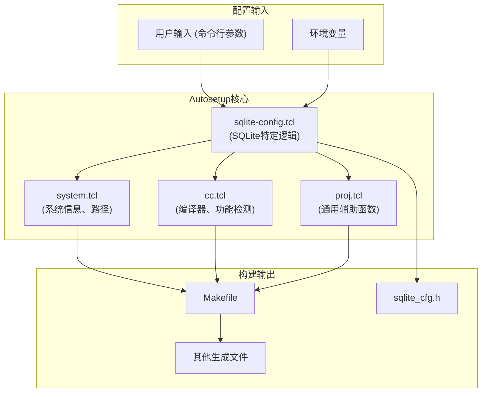
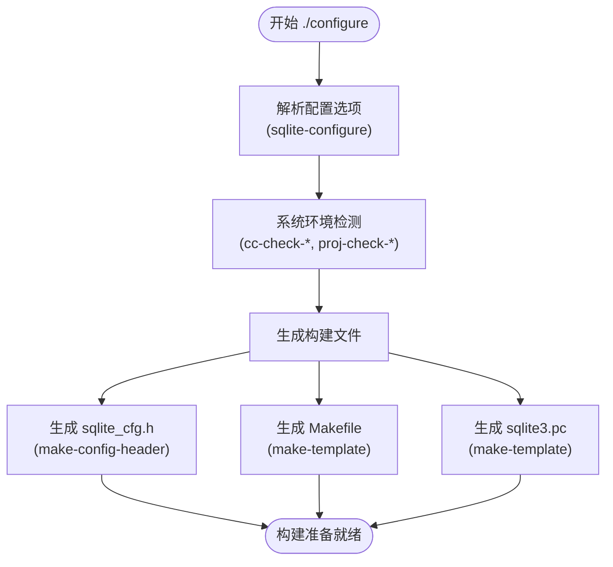

# 构建系统

<cite>
**本文档中引用的文件**  
- [auto.def](file://auto.def)
- [sqlite-config.tcl](file://autosetup/sqlite-config.tcl)
- [proj.tcl](file://autosetup/proj.tcl)
- [cc.tcl](file://autosetup/cc.tcl)
- [system.tcl](file://autosetup/system.tcl)
- [Makefile.in](file://Makefile.in)
- [main.mk](file://main.mk)
- [compile-for-unix.md](file://doc/compile-for-unix.md)
</cite>

## 目录
1. [引言](#引言)
2. [Autosetup构建系统概述](#autosetup构建系统概述)
3. [核心脚本职责分析](#核心脚本职责分析)
4. [构建流程详解](#构建流程详解)
5. [与传统Autoconf的对比](#与传统autoconf的对比)
6. [自定义构建脚本指导](#自定义构建脚本指导)
7. [构建问题调试技巧](#构建问题调试技巧)
8. [结论](#结论)

## 引言

SQLite的构建系统采用了一套轻量级、无外部依赖的Tcl脚本驱动方案，称为Autosetup。该系统旨在替代传统的Autoconf工具链，提供更简洁、更高效的配置和构建流程。Autosetup通过一系列Tcl脚本实现对系统环境的检测、配置选项的解析，并最终生成Makefile和项目文件。本文档将深入探讨Autosetup的工作原理，重点分析其核心组件和构建流程，为开发者提供全面的指导和参考。

**Section sources**
- [auto.def](file://auto.def)
- [compile-for-unix.md](file://doc/compile-for-unix.md)

## Autosetup构建系统概述

Autosetup是SQLite项目采用的配置系统，它是一个轻量级的、基于Tcl的构建框架，旨在简化和自动化软件的配置与构建过程。与传统的Autoconf不同，Autosetup不依赖于复杂的宏处理器（如m4），而是直接使用Tcl脚本语言来编写配置逻辑，这使得整个系统更加直观和易于维护。

Autosetup的核心设计理念是“无依赖”和“自包含”。它不强制要求系统上安装特定的工具或库，而是尽可能利用系统已有的资源。例如，在配置过程中，Autosetup会优先尝试使用系统安装的`Tclsh`，如果找不到，则会自动编译并使用内嵌的JimTCL解释器（`jimsh0.c`），从而确保在任何环境中都能顺利运行配置脚本。

整个构建系统由多个模块化的Tcl脚本组成，每个脚本负责特定的功能。`system.tcl`负责处理基本的系统信息和路径配置，`cc.tcl`提供编译器接口和功能检测，`proj.tcl`包含项目通用的辅助函数，而`sqlite-config.tcl`则封装了SQLite项目特有的配置逻辑。这些脚本协同工作，共同完成从环境检测到生成构建文件的全过程。



**Diagram sources**
- [system.tcl](file://autosetup/system.tcl)
- [cc.tcl](file://autosetup/cc.tcl)
- [proj.tcl](file://autosetup/proj.tcl)
- [sqlite-config.tcl](file://autosetup/sqlite-config.tcl)

**Section sources**
- [README.md](file://autosetup/README.md)
- [system.tcl](file://autosetup/system.tcl)
- [cc.tcl](file://autosetup/cc.tcl)

## 核心脚本职责分析

### cc.tcl（编译器接口）

`cc.tcl`是Autosetup中负责与C/C++编译器交互的核心模块。它提供了一套丰富的API，用于检测编译器的功能、检查头文件和函数的存在性、以及测试编译器标志。该脚本通过`cctest`命令执行临时的C代码片段来验证特定功能。

其主要职责包括：
- **编译器初始化**：根据环境变量（如`CC`, `CFLAGS`）设置编译器路径和默认标志。
- **功能检测**：提供`cc-check-includes`、`cc-check-functions`、`cc-check-types`等命令，用于检查系统是否支持特定的头文件、函数或数据类型。
- **标志测试**：通过`cc-check-flags`等命令验证编译器是否接受特定的编译选项（如`-g`, `-O2`）。
- **链接测试**：使用`cc-check-function-in-lib`来确定某个函数（如`log`）需要链接哪个库（如`-lm`）。

`cc.tcl`的设计使得配置脚本可以以一种声明式的方式进行系统检测，而无需编写复杂的shell命令或m4宏。

**Section sources**
- [cc.tcl](file://autosetup/cc.tcl)

### proj.tcl（项目定义）

`proj.tcl`是一个项目无关的辅助函数库，它包含了大量在SQLite及其他相关项目（如Fossil）中通用的Tcl函数。这些函数旨在提高配置脚本的可读性和可维护性。

其主要职责包括：
- **环境变量处理**：提供`get-env`和`proj-get-env`等函数，用于安全地获取环境变量或命令行参数的值。
- **文件操作**：包含`proj-file-content`、`proj-file-write`等函数，用于读取和写入文件内容。
- **路径和可执行文件查找**：通过`proj-find-executable-path`和`proj-bin-define`来搜索系统路径中的可执行文件。
- **条件判断和消息输出**：提供`proj-opt-truthy`、`proj-if-opt-truthy`等函数来判断配置选项的状态，并通过`proj-warn`、`proj-indented-notice`等函数输出格式化消息。
- **状态管理**：引入`proj__Config`数组来存储内部状态，避免污染全局命名空间。

`proj.tcl`体现了代码复用和模块化设计的思想，将通用逻辑从项目特定的配置中分离出来。

**Section sources**
- [proj.tcl](file://autosetup/proj.tcl)

### sqlite-config.tcl（配置逻辑）

`sqlite-config.tcl`是SQLite项目特有的配置逻辑中心。它定义了所有与SQLite构建相关的配置选项，并封装了处理这些选项的复杂逻辑。

其主要职责包括：
- **定义配置选项**：通过`sqlite-configure`函数，使用`options`和`options-add`命令声明所有可用的`--flag`，如`--enable-fts5`、`--with-tcl`等。
- **处理配置标志**：根据用户的选择，设置相应的编译标志（`CFLAGS`）、链接标志（`LDFLAGS`）和预处理器定义（`OPT_FEATURE_FLAGS`）。例如，启用FTS5扩展会自动添加`-DSQLITE_ENABLE_FTS5`标志。
- **管理构建模式**：支持不同的构建模式（如`canonical`和`autoconf`），并为每种模式定制配置流程。
- **执行系统检测**：调用`cc.tcl`和`proj.tcl`中的函数来检查系统依赖，如`zlib`、`readline`、`ICU`等。
- **最终化配置**：在`sqlite-configure-finalize`函数中，处理所有配置的最终步骤，如设置`rpath`、`soname`，并生成最终的构建文件。

该脚本是整个构建系统的“大脑”，协调各个模块完成复杂的配置任务。

**Section sources**
- [sqlite-config.tcl](file://autosetup/sqlite-config.tcl)

## 构建流程详解

SQLite的Autosetup构建流程是一个多阶段的、高度自动化的过程。从用户执行`./configure`命令开始，到最终生成`Makefile`，整个流程可以分为以下几个关键阶段：

### 1. 配置脚本启动与初始化

当用户运行`./configure`时，Autosetup框架首先会启动一个Tcl解释器（可能是系统`Tclsh`或编译出的`jimsh0`）。然后，它会加载`auto.def`文件，这是整个配置过程的入口点。`auto.def`的第一行`use sqlite-config`会加载`sqlite-config.tcl`脚本，从而引入所有SQLite特定的配置逻辑。

### 2. 解析配置选项

`auto.def`文件的核心是调用`sqlite-configure canonical {...}`。这个函数会：
- **定义所有选项**：根据`sqlite-config.tcl`中定义的`$allFlags`列表，通过`options-add`命令向Autosetup注册所有可用的配置标志。
- **处理用户输入**：Autosetup框架会自动解析命令行参数（如`--enable-debug`），并将其值存储在内部数据结构中。
- **执行模式特定逻辑**：`sqlite-configure`函数的第二个参数是一个Tcl脚本块，它包含了`canonical`构建模式特有的配置逻辑。例如，如果用户启用了`--dev`模式，脚本会自动启用调试、禁用合并构建等。

### 3. 系统环境检测

在解析完选项后，配置脚本会执行一系列系统检测。这是通过调用`cc.tcl`和`proj.tcl`中的函数来完成的：
- **编译器检查**：`cc-init`会查找`CC`、`CXX`等编译器，并验证它们是否能正常工作（通过编译一个简单的`stdlib.h`包含测试）。
- **系统特性检测**：`cc-check-lfs`会检查大文件支持，`cc-check-endian`会检测字节序。
- **依赖库查找**：`sqlite-check-common-system-deps`会检查`zlib`、`math`库等。对于`readline`，脚本会尝试通过`--with-readline-ldflags`等参数或自动搜索来定位库文件。

### 4. 生成构建文件

所有检测和配置完成后，Autosetup会进入最终化阶段：
- **生成头文件**：`make-config-header`函数会根据所有`define`的变量，生成`sqlite_cfg.h`头文件。例如，如果检测到`HAVE_ZLIB`，则会在头文件中定义`#define HAVE_ZLIB 1`。
- **生成Makefile**：`make-template`函数会处理`Makefile.in`模板文件。它会将模板中的`@VAR@`占位符替换为实际的值（如`@CC@`替换为`gcc`），并处理`@if VAR@ ... @endif`条件语句，最终生成适用于当前环境的`Makefile`。
- **生成其他文件**：类似地，`pkg-config`相关的文件（如`sqlite3.pc.in`）也会被处理并生成。



**Diagram sources**
- [auto.def](file://auto.def)
- [sqlite-config.tcl](file://autosetup/sqlite-config.tcl)
- [system.tcl](file://autosetup/system.tcl)
- [cc.tcl](file://autosetup/cc.tcl)

**Section sources**
- [auto.def](file://auto.def)
- [sqlite-config.tcl](file://autosetup/sqlite-config.tcl)
- [system.tcl](file://autosetup/system.tcl)
- [cc.tcl](file://autosetup/cc.tcl)

## 与传统autoconf的对比

Autosetup的设计哲学与传统的Autoconf工具有着显著的区别，主要体现在以下几个方面：

| 特性 | Autosetup | 传统Autoconf |
| :--- | :--- | :--- |
| **语言与工具** | 使用Tcl脚本语言，直接可读。 | 使用m4宏语言，代码晦涩难懂。 |
| **依赖性** | 轻量级，自带JimTCL解释器，几乎无外部依赖。 | 依赖m4、autoconf、automake等复杂工具链。 |
| **学习曲线** | 相对平缓，熟悉Tcl即可上手。 | 非常陡峭，需要掌握m4宏、shell脚本和Autoconf约定。 |
| **调试性** | 调试简单，可直接在Tcl解释器中运行和测试脚本。 | 调试困难，错误信息往往不直观，需要理解宏展开过程。 |
| **可维护性** | 代码逻辑清晰，易于理解和修改。 | 代码逻辑分散，维护成本高。 |
| **性能** | 启动和执行速度快。 | 启动慢，因为需要处理大量的宏展开。 |
| **灵活性** | 高度灵活，可以编写复杂的Tcl逻辑。 | 灵活性受限于Autoconf提供的宏。 |

Autosetup的“无依赖”设计是其最大的优势之一。它避免了开发者为了构建一个项目而必须安装一整套GNU构建工具的麻烦。同时，使用Tcl这种成熟的脚本语言，使得配置逻辑更加直观和强大，开发者可以轻松地实现复杂的条件判断和数据处理，而无需陷入m4宏的复杂语法中。

**Section sources**
- [README.md](file://autosetup/README.md)

## 自定义构建脚本指导

对于需要对SQLite构建过程进行定制的开发者，Autosetup提供了多种机制。

### 添加新的编译目标

要添加一个新的编译目标（例如，一个名为`mytool`的工具），可以在`main.mk`文件中定义一个新的规则。`main.mk`是`Makefile`的主要组成部分，它包含了大部分的构建逻辑。

```makefile
# 在 main.mk 中添加
mytool: $(MYTOOL_OBJ)
	$(T.cc) $(MYTOOL_CFLAGS) -o $@ $^ $(MYTOOL_LIBS)

# 定义源文件和对象文件
MYTOOL_SRC = src/mytool.c
MYTOOL_OBJ = $(MYTOOL_SRC:.c=.o)

# 定义编译和链接标志
MYTOOL_CFLAGS = $(OPT_FEATURE_FLAGS) $(CFLAGS)
MYTOOL_LIBS = -lsqlite3
```

然后，在`Makefile.in`中，确保`mytool`被包含在`all`目标中，或者作为一个独立的`make`目标。

### 修改编译规则

要修改现有的编译规则，例如为特定的源文件添加特殊的编译标志，可以通过在`auto.def`中设置特定的`define`来实现。

```tcl
# 在 auto.def 的 sqlite-configure 块中
if {[opt-bool my-special-feature]} {
    # 为特定的源文件添加编译标志
    define CFLAGS.my_special_file "-DSPECIAL_OPTIMIZATION"
    # 或者，为所有目标添加链接库
    define LDFLAGS.my_special_lib "-lmylib"
}
```

在`main.mk`中，可以使用`$(CFLAGS.my_special_file)`来引用这个特定的标志。

### 分支特定的自定义

对于特定的供应商分支，推荐使用`autosetup/sqlite-custom.tcl`文件进行自定义，以避免与主分支的合并冲突。创建此文件并定义`sqlite-custom-flags`和`sqlite-custom-handle-flags`过程。

```tcl
# autosetup/sqlite-custom.tcl
proc sqlite-custom-flags {} {
    return {
        my-vendor-flag => {Enable vendor-specific feature}
    }
}

proc sqlite-custom-handle-flags {} {
    if {[opt-bool my-vendor-flag]} {
        sqlite-add-feature-flag -DSQLITE_VENDOR_FEATURE
    }
}
```

**Section sources**
- [auto.def](file://auto.def)
- [main.mk](file://main.mk)
- [Makefile.in](file://Makefile.in)

## 构建问题调试技巧

当构建过程出现问题时，可以利用Autosetup提供的多种调试机制来追踪问题根源。

### 追踪配置决策

- **启用详细输出**：在运行`./configure`时，传递`msg-debug=1`参数。这会激活`sqlite-config.tcl`中的`msg-debug`函数，输出详细的调试信息，帮助理解配置脚本的执行流程。
- **检查`config.log`**：Autosetup会将所有编译器测试的详细输出记录在`config.log`文件中。如果某个功能检测失败（如找不到`readline`），查看`config.log`可以找到具体的错误信息和编译器输出。
- **使用`--dump-defines`**：这个隐藏的配置选项会将所有`define`的变量值转储到`config.defines.txt`文件中。这有助于验证配置选项是否被正确设置。

### 环境检测失败排查

- **验证编译器**：确保`CC`环境变量指向一个有效的C编译器。可以通过`echo $CC`和`$CC --version`来检查。
- **检查依赖库路径**：如果检测不到某个库（如`zlib`），请确认库文件（如`libz.so`）和头文件（如`zlib.h`）的路径是否正确。可以使用`--with-zlib-ldflags`和`--with-zlib-cflags`手动指定路径。
- **交叉编译问题**：在交叉编译时，确保`CROSS`环境变量或`--host`参数设置正确。`sqlite-handle-wasi-sdk`等特定处理函数可能会修改环境，需要特别注意。

### 调试Tcl脚本

- **直接运行Tcl代码**：由于配置脚本是Tcl代码，可以将其复制到一个`.tcl`文件中，并用`tclsh`或`jimsh`直接运行，以隔离和测试特定的逻辑片段。
- **使用`user-notice`**：在`auto.def`或`sqlite-config.tcl`中插入`user-notice "Debug: value is $value"`语句，可以在配置过程中输出自定义的调试信息。

**Section sources**
- [sqlite-config.tcl](file://autosetup/sqlite-config.tcl)
- [README.md](file://autosetup/README.md)

## 结论

SQLite的Autosetup构建系统是一个精心设计的、轻量级的配置框架。它通过使用Tcl脚本语言，成功地替代了传统复杂且笨重的Autoconf工具链，实现了更高的可读性、可维护性和灵活性。核心脚本`cc.tcl`、`proj.tcl`和`sqlite-config.tcl`各司其职，共同完成从环境检测到生成构建文件的复杂任务。其“无依赖”的设计哲学确保了构建过程的可靠性和可移植性。对于开发者而言，理解这套系统的工作原理不仅有助于顺利构建SQLite，也为定制和扩展构建流程提供了坚实的基础。通过掌握配置选项、构建流程和调试技巧，开发者可以高效地应对各种构建挑战。