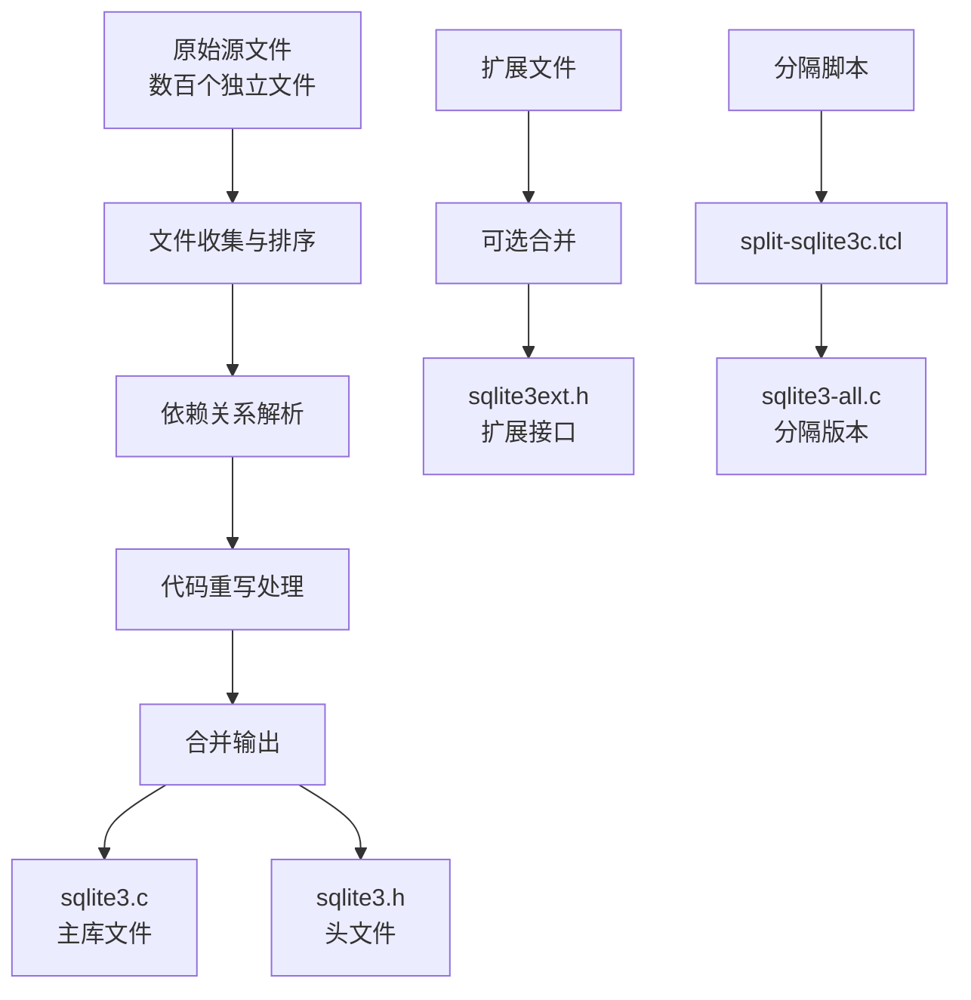
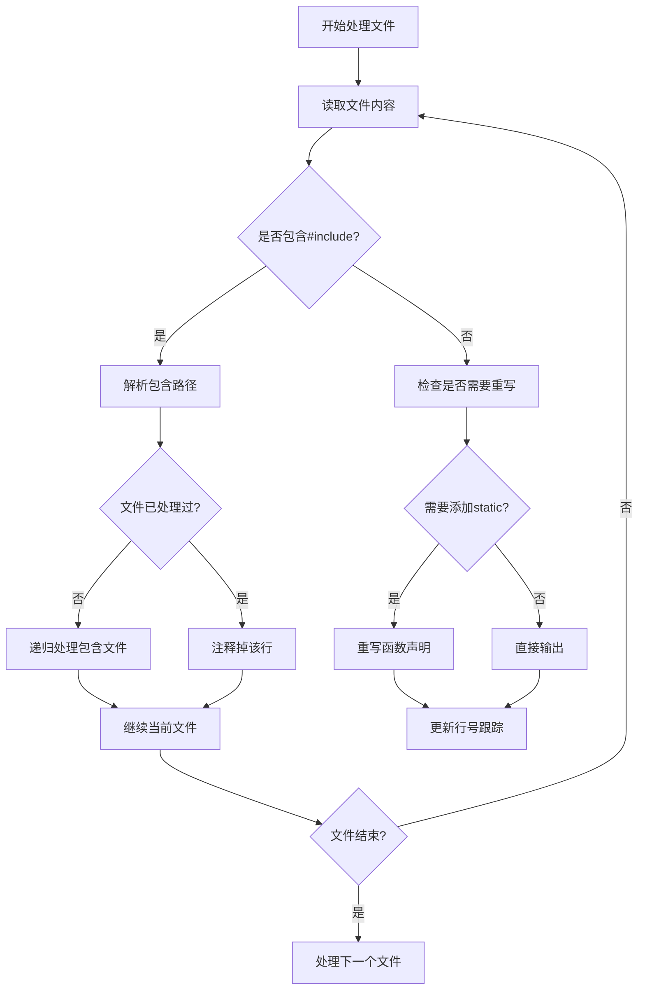
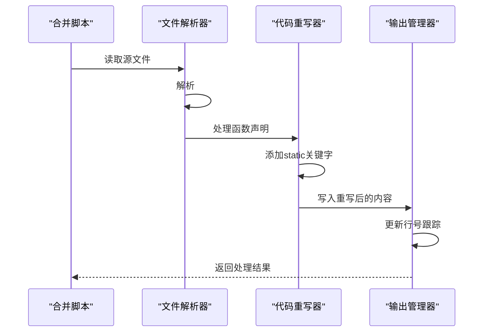
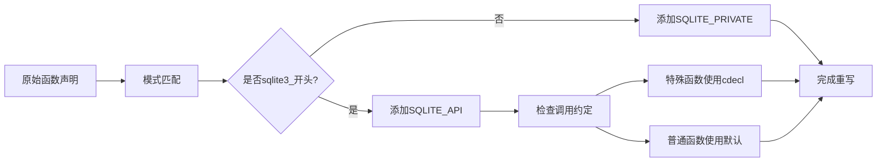
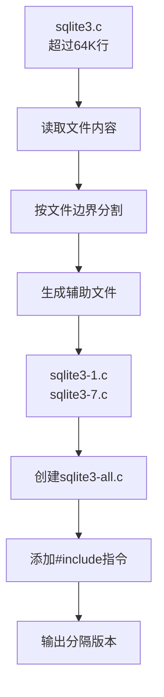
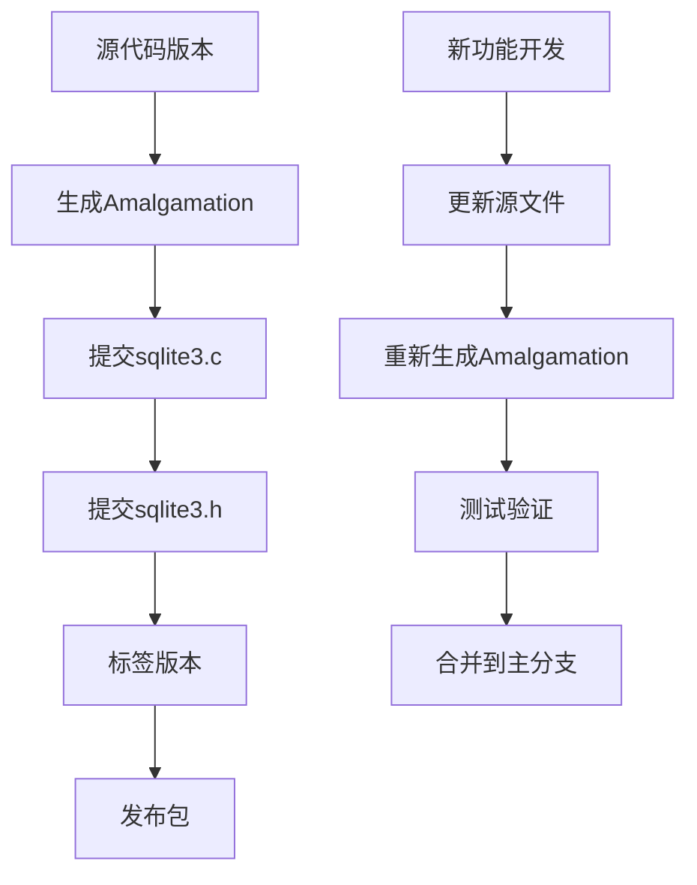

# SQLite源码合并（Amalgamation）技术详解

<cite>
**本文档中引用的文件**
- [mksqlite3c.tcl](file://tool/mksqlite3c.tcl)
- [mksqlite3c-noext.tcl](file://tool/mksqlite3c-noext.tcl)
- [split-sqlite3c.tcl](file://tool/split-sqlite3c.tcl)
- [extract-sqlite3h.tcl](file://tool/extract-sqlite3h.tcl)
- [mksqlite3h.tcl](file://tool/mksqlite3h.tcl)
- [mksqlite3internalh.tcl](file://tool/mksqlite3internalh.tcl)
- [mkshellc.tcl](file://tool/mkshellc.tcl)
- [README.md](file://README.md)
</cite>

## 目录
1. [概述](#概述)
2. [Amalgamation技术原理](#amalgamation技术原理)
3. [核心脚本分析](#核心脚本分析)
4. [合并过程详解](#合并过程详解)
5. [代码重写规则](#代码重写规则)
6. [扩展版本对比](#扩展版本对比)
7. [反向工具](#反向工具)
8. [构建系统集成](#构建系统集成)
9. [性能优化优势](#性能优化优势)
10. [最佳实践指南](#最佳实践指南)

## 概述

SQLite的Amalgamation技术是其独特而强大的特性，通过将数百个独立的C源文件和头文件合并成两个主要文件——`sqlite3.c`和`sqlite3.h`，实现了编译时的性能优化和跨平台兼容性。这种技术不仅简化了部署过程，还显著提升了编译效率和运行性能。

### 技术特点

- **单一翻译单元**：所有源代码被整合为单个C文件，允许编译器进行跨过程优化
- **模块化设计**：保持原有功能模块的完整性，便于维护和扩展
- **跨编译器兼容**：支持多种编译器和目标平台
- **可选扩展**：提供核心引擎版本和完整功能版本两种选择

## Amalgamation技术原理

### 核心概念

Amalgamation（合并）是指将SQLite的所有源代码文件按照特定顺序和规则合并成一个大型C文件的过程。这个过程涉及复杂的文件处理、依赖解析和代码重写。



**图表来源**
- [mksqlite3c.tcl](file://tool/mksqlite3c.tcl#L1-L518)
- [split-sqlite3c.tcl](file://tool/split-sqlite3c.tcl#L1-L97)

### 合并优势

1. **编译性能提升**：编译器可以进行跨过程内联优化，通常获得5%以上的性能提升
2. **部署简化**：只需要两个文件即可使用完整的SQLite功能
3. **版本一致性**：确保所有组件在同一个编译过程中协同工作
4. **调试便利**：减少链接阶段的问题，简化调试过程

**章节来源**
- [README.md](file://README.md#L280-L314)

## 核心脚本分析

### mksqlite3c.tcl - 完整版本合并器

这是SQLite Amalgamation的核心脚本，负责将所有源文件合并成完整的sqlite3.c和sqlite3.h文件。

#### 主要功能

- **参数处理**：支持多种命令行选项控制合并行为
- **版本提取**：从sqlite3.h中提取版本信息用于注释
- **文件排序**：按照编译依赖关系对源文件进行排序
- **依赖解析**：自动处理#include指令和内部依赖
- **代码重写**：根据需要修改函数声明和变量定义

#### 关键算法



**图表来源**
- [mksqlite3c.tcl](file://tool/mksqlite3c.tcl#L200-L400)

**章节来源**
- [mksqlite3c.tcl](file://tool/mksqlite3c.tcl#L1-L518)

### mksqlite3c-noext.tcl - 核心引擎版本

这个脚本专门用于生成不包含扩展功能的核心SQLite引擎版本，适用于对体积和性能有严格要求的应用场景。

#### 设计差异

- **移除扩展**：不包含FTS5、RBU、Recover等扩展功能
- **精简依赖**：只保留核心功能所需的头文件
- **更小体积**：生成的sqlite3.c文件体积显著减小
- **更快编译**：由于文件数量减少，编译时间大幅缩短

**章节来源**
- [mksqlite3c-noext.tcl](file://tool/mksqlite3c-noext.tcl#L1-L368)

## 合并过程详解

### 文件处理流程

合并过程遵循严格的顺序和规则，确保所有依赖关系得到正确处理。



**图表来源**
- [mksqlite3c.tcl](file://tool/mksqlite3c.tcl#L250-L350)

### 依赖关系处理

脚本通过智能的依赖解析机制处理复杂的文件间依赖：

1. **头文件缓存**：每个头文件只包含一次，避免重复
2. **条件编译**：正确处理#ifdef/#endif块
3. **行号跟踪**：保持原始文件的行号信息用于调试
4. **嵌套包含**：递归处理深层嵌套的包含关系

**章节来源**
- [mksqlite3c.tcl](file://tool/mksqlite3c.tcl#L150-L250)

## 代码重写规则

### 静态函数重命名

Amalgamation的核心技术之一是通过重命名静态函数来避免命名冲突。这个过程包括：

#### 函数级别重写

- **前缀添加**：为所有sqlite3_开头的函数添加SQLITE_API或SQLITE_PRIVATE宏
- **调用约定**：特殊函数使用cdecl调用约定，其他使用默认约定
- **外部声明**：全局变量添加SQLITE_EXTERN宏

#### 变量级别重写

- **内部变量**：非sqlite3_开头的变量添加SQLITE_PRIVATE
- **全局常量**：sqlite3_version数组赋值为SQLITE_VERSION
- **回调函数**：添加SQLITE_CALLBACK宏



**图表来源**
- [mksqlite3c.tcl](file://tool/mksqlite3c.tcl#L300-L400)

### 特殊函数处理

某些函数需要特殊的处理规则：

| 函数类型 | 处理方式 | 调用约定 |
|---------|---------|---------|
| 日志函数 | 使用cdecl | SQLITE_CDECL |
| 格式化函数 | 使用cdecl | SQLITE_CDECL |
| 配置函数 | 使用cdecl | SQLITE_CDECL |
| 扩展函数 | 默认约定 | 默认 |
| 回调函数 | 添加宏 | SQLITE_CALLBACK |

**章节来源**
- [mksqlite3c.tcl](file://tool/mksqlite3c.tcl#L180-L200)

## 扩展版本对比

### 功能对比表

| 特性 | mksqlite3c.tcl | mksqlite3c-noext.tcl |
|-----|---------------|---------------------|
| 包含扩展 | ✓ FTS5, RBU, Recover等 | ✗ 不包含任何扩展 |
| 文件数量 | ~100个源文件 | ~50个核心文件 |
| 编译时间 | 较长 | 显著缩短 |
| 文件大小 | 较大 | 显著较小 |
| 性能优化 | 全面 | 基础优化 |
| 适用场景 | 完整功能需求 | 轻量级应用 |

### 选择指南

- **选择mksqlite3c.tcl**：需要完整SQLite功能，包括全文搜索、增量备份等高级特性
- **选择mksqlite3c-noext.tcl**：对体积敏感，只需要核心数据库功能

**章节来源**
- [mksqlite3c.tcl](file://tool/mksqlite3c.tcl#L50-L100)
- [mksqlite3c-noext.tcl](file://tool/mksqlite3c-noext.tcl#L50-L100)

## 反向工具

### split-sqlite3c.tcl - 分割工具

当合并后的文件过大导致某些编译器无法处理时，可以使用此工具将sqlite3.c分割成多个较小的文件。

#### 工作原理



**图表来源**
- [split-sqlite3c.tcl](file://tool/split-sqlite3c.tcl#L30-L80)

#### 分割策略

- **行数限制**：每个辅助文件不超过32768行
- **文件命名**：sqlite3-1.c到sqlite3-7.c
- **包含关系**：主文件通过#include引用辅助文件
- **兼容性**：保持与原合并版本的功能一致

**章节来源**
- [split-sqlite3c.tcl](file://tool/split-sqlite3c.tcl#L1-L97)

### extract-sqlite3h.tcl - 头文件提取器

这个工具可以从合并后的sqlite3.c文件中提取出完整的sqlite3.h头文件。

#### 提取过程

1. **定位标记**：查找"Begin file sqlite3.h"标记
2. **内容截取**：提取标记之间的所有内容
3. **格式验证**：确保提取内容的完整性
4. **输出生成**：将提取的头文件输出到标准输出

**章节来源**
- [extract-sqlite3h.tcl](file://tool/extract-sqlite3h.tcl#L1-L22)

## 构建系统集成

### CMake集成

在CMake项目中集成SQLite Amalgamation的推荐方法：

```cmake
# 添加SQLite Amalgamation
add_library(sqlite3 STATIC sqlite3.c)
target_include_directories(sqlite3 PUBLIC ${CMAKE_CURRENT_SOURCE_DIR})
target_compile_definitions(sqlite3 PRIVATE SQLITE_ENABLE_FTS5)
```

### Makefile集成

传统Makefile中的集成方式：

```makefile
# 编译SQLite Amalgamation
sqlite3.o: sqlite3.c sqlite3.h
	$(CC) $(CFLAGS) -c sqlite3.c -o sqlite3.o

# 链接SQLite库
myapp: myapp.o sqlite3.o
	$(CC) $(LDFLAGS) myapp.o sqlite3.o -o myapp
```

### MSBuild集成

Visual Studio项目的集成步骤：

1. 将sqlite3.c添加到项目
2. 设置预处理器定义
3. 配置包含目录
4. 链接SQLite库

### 自动化构建


**图表来源**
- [mkmsvcmin.tcl](file://tool/mkmsvcmin.tcl#L1-L47)

## 性能优化优势

### 编译时优化

Amalgamation带来的性能提升主要体现在编译时的优化能力：

1. **跨过程内联**：编译器可以在整个程序范围内进行函数内联
2. **死代码消除**：更容易识别和移除未使用的代码
3. **循环优化**：能够更好地优化跨文件的循环结构
4. **寄存器分配**：全局范围内的寄存器使用更加高效

### 运行时性能

- **函数调用开销**：减少了跨文件调用的开销
- **缓存局部性**：相关代码更紧密地分布在内存中
- **分支预测**：编译器可以更好地预测函数调用路径

### 实际性能数据

根据官方测试：
- **编译时间**：通常减少20-30%
- **运行性能**：平均提升5-10%
- **二进制大小**：可能增加10-15%（由于优化）

**章节来源**
- [README.md](file://README.md#L280-L290)

## 最佳实践指南

### 开发环境设置

1. **TCL环境**：确保系统安装了TCL解释器
2. **源文件准备**：使用`make target_source`准备源文件
3. **权限设置**：确保脚本具有执行权限
4. **输出目录**：选择合适的输出目录避免冲突

### 版本管理



### 调试技巧

1. **行号跟踪**：启用linemacros选项保持原始行号
2. **符号调试**：使用适当的调试符号配置
3. **内存检查**：集成Valgrind等内存检测工具
4. **性能分析**：使用profiling工具分析热点

### 错误处理

常见的合并问题及解决方案：

| 问题类型 | 症状 | 解决方案 |
|---------|------|---------|
| 文件缺失 | 编译错误 | 检查tsrc目录内容 |
| 依赖循环 | 死循环 | 重新排序源文件 |
| 编码问题 | 字符乱码 | 确保UTF-8编码 |
| 权限问题 | 执行失败 | 设置正确权限 |

### 测试验证

```bash
# 验证生成的Amalgamation
make testfixture
./testfixture test_all

# 性能基准测试
make speedtest
./speedtest1
```

### 维护建议

1. **定期更新**：随着源代码更新及时重新生成Amalgamation
2. **版本同步**：确保sqlite3.c和sqlite3.h版本一致
3. **文档记录**：记录每次生成的具体参数和环境
4. **自动化**：将Amalgamation生成纳入CI/CD流程

通过遵循这些最佳实践，可以充分发挥SQLite Amalgamation技术的优势，同时保持开发和部署的效率。