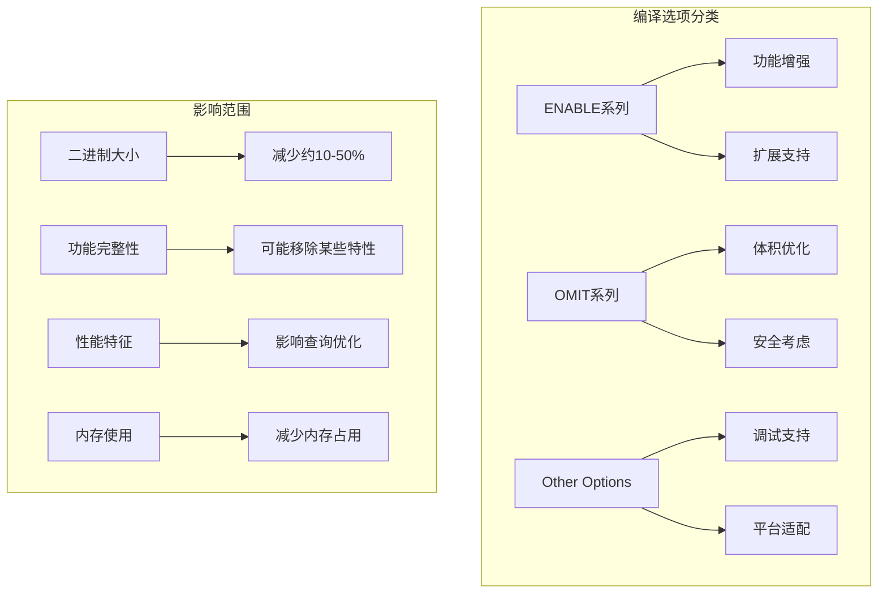
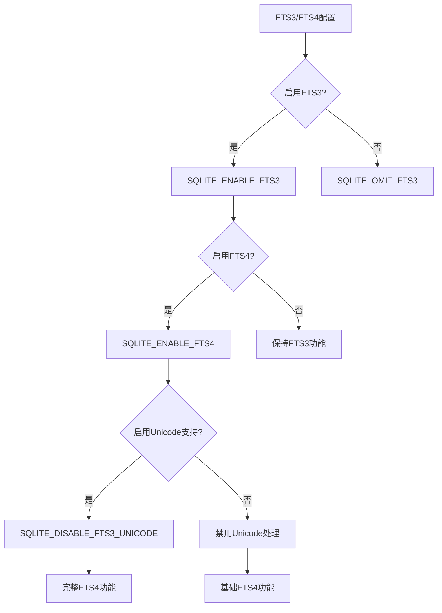
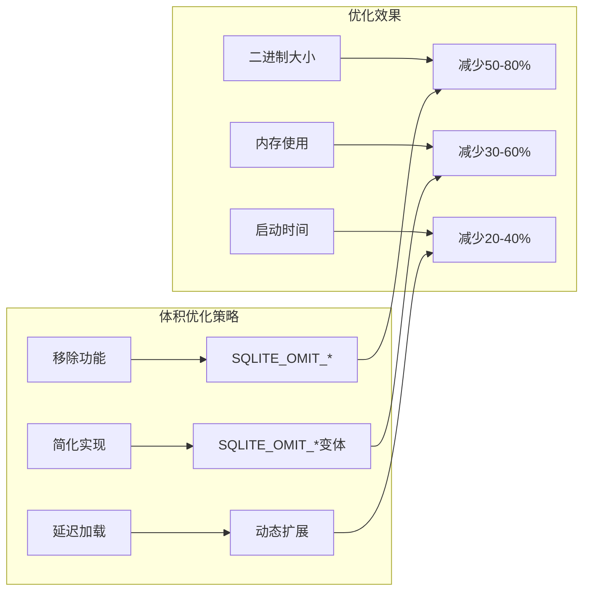
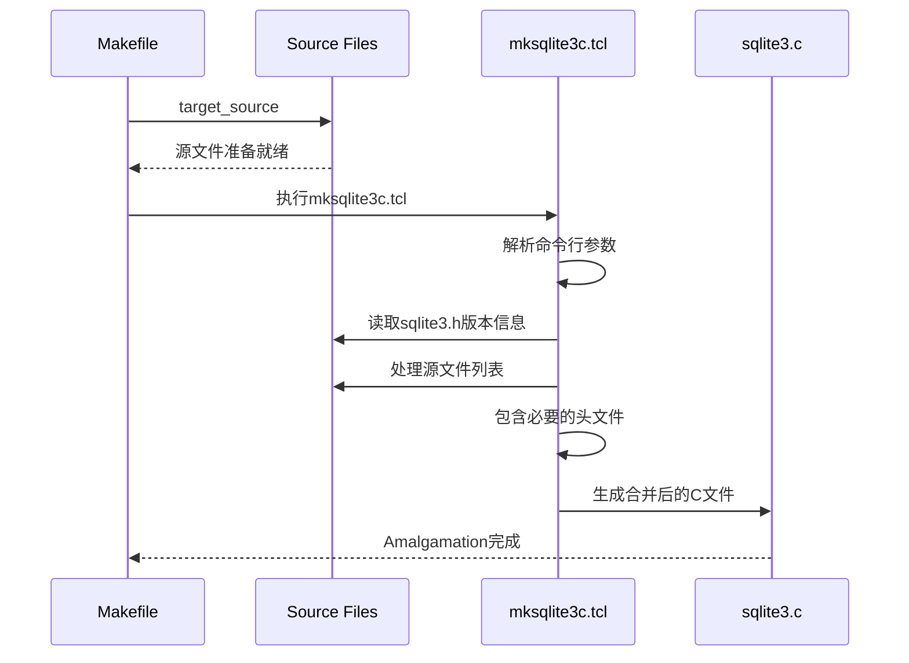
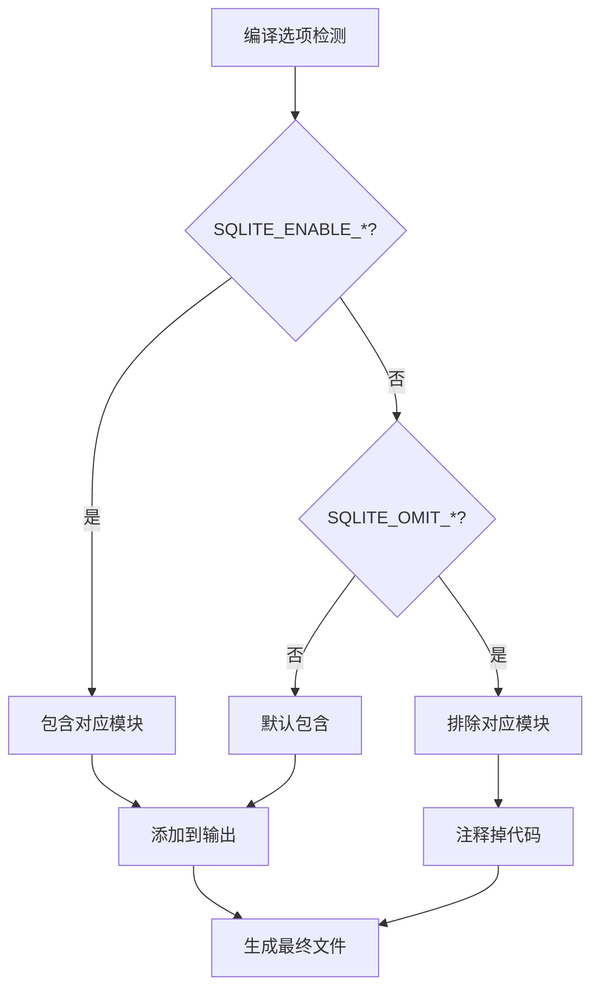
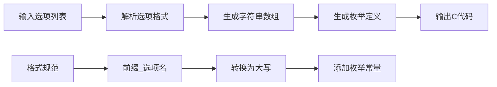
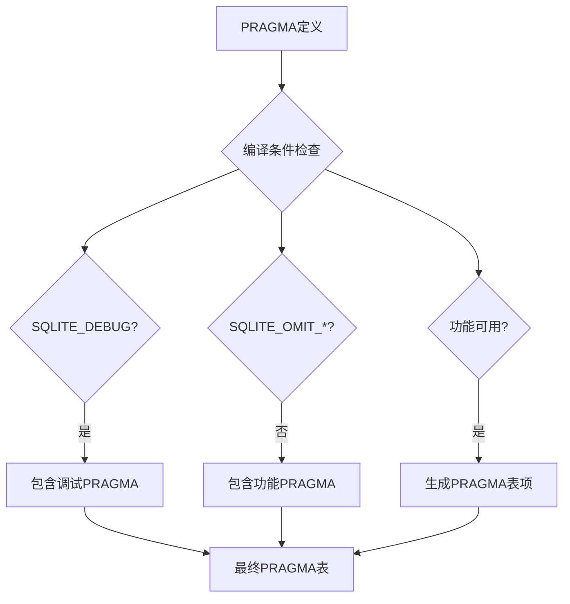
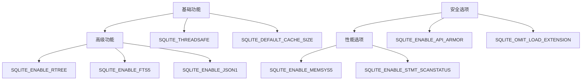

# 编译选项参考文档

<cite>
**本文档中引用的文件**
- [mksqlite3c.tcl](file://tool/mksqlite3c.tcl)
- [mkopts.tcl](file://tool/mkopts.tcl)
- [mkpragmatab.tcl](file://tool/mkpragmatab.tcl)
- [sqlite3ext.h](file://src/sqlite3ext.h)
- [sqliteInt.h](file://src/sqliteInt.h)
- [omittest.tcl](file://tool/omittest.tcl)
- [GNUmakefile](file://ext/jni/GNUmakefile)
- [compile-for-unix.md](file://doc/compile-for-unix.md)
- [teaish.tcl](file://autoconf/tea/teaish.tcl)
- [sqlite-config.tcl](file://autosetup/sqlite-config.tcl)
</cite>

## 目录
1. [简介](#简介)
2. [预处理器宏概述](#预处理器宏概述)
3. [核心编译选项](#核心编译选项)
4. [全文搜索扩展选项](#全文搜索扩展选项)
5. [空间优化选项](#空间优化选项)
6. [调试和诊断选项](#调试和诊断选项)
7. [Amalgamation生成机制](#amalgamation生成机制)
8. [工具脚本详解](#工具脚本详解)
9. [选项兼容性与最佳实践](#选项兼容性与最佳实践)
10. [实际应用示例](#实际应用示例)
11. [故障排除指南](#故障排除指南)

## 简介

SQLite提供了丰富的编译时配置选项，允许开发者根据具体需求定制数据库引擎的功能和性能特征。这些选项主要通过预处理器宏（preprocessor macros）的形式实现，包括`SQLITE_ENABLE_*`和`SQLITE_OMIT_*`两种类型的宏定义。

本文档系统性地介绍了SQLite的所有关键编译选项，详细说明了每个选项的功能影响、使用场景以及与其他选项的兼容性关系。通过理解这些编译选项，开发者可以：
- 最小化最终二进制文件的体积
- 启用高级功能特性
- 优化特定应用场景的性能
- 避免潜在的编译冲突

## 预处理器宏概述

SQLite的编译选项主要分为两大类：

### ENABLE系列宏
启用特定功能或扩展：
- `SQLITE_ENABLE_FTS5`: 启用全文搜索功能
- `SQLITE_ENABLE_RTREE`: 启用R-Tree索引支持
- `SQLITE_ENABLE_JSON1`: 启用JSON1扩展
- `SQLITE_ENABLE_COLUMN_METADATA`: 启用列元数据访问

### OMIT系列宏
禁用特定功能以减小二进制体积：
- `SQLITE_OMIT_FLOATING_POINT`: 禁用浮点数支持
- `SQLITE_OMIT_VIRTUALTABLE`: 禁用虚拟表支持
- `SQLITE_OMIT_TRIGGER`: 禁用触发器支持
- `SQLITE_OMIT_VIEW`: 禁用视图支持



**图表来源**
- [mksqlite3c.tcl](file://tool/mksqlite3c.tcl#L34-L81)
- [omittest.tcl](file://tool/omittest.tcl#L62-L113)

## 核心编译选项

### 基础功能控制

#### 线程安全选项
| 宏定义 | 功能描述 | 默认值 | 兼容性 |
|--------|----------|--------|--------|
| `SQLITE_THREADSAFE=0` | 禁用线程安全，单线程模式 | 关闭 | 所有平台 |
| `SQLITE_THREADSAFE=1` | 使用互斥锁保护共享数据 | 开启 | 所有平台 |
| `SQLITE_THREADSAFE=2` | 进程内共享，不使用互斥锁 | 开启 | 特定平台 |

#### 内存管理选项
| 宏定义 | 功能描述 | 性能影响 | 适用场景 |
|--------|----------|----------|----------|
| `SQLITE_ENABLE_MEMSYS3` | 使用自定义内存分配器 | 中等 | 嵌入式系统 |
| `SQLITE_ENABLE_MEMSYS5` | 使用改进的内存分配器 | 高 | 高性能应用 |
| `SQLITE_DEFAULT_CACHE_SIZE` | 设置默认缓存大小 | 高 | 大型数据库 |

#### 存储选项
| 宏定义 | 功能描述 | 存储影响 | 适用场景 |
|--------|----------|----------|----------|
| `SQLITE_TEMP_STORE=0` | 使用系统临时目录 | 中等 | 标准环境 |
| `SQLITE_TEMP_STORE=1` | 使用内存存储临时表 | 高 | 内存充足 |
| `SQLITE_TEMP_STORE=2` | 使用文件存储临时表 | 低 | 内存受限 |

**章节来源**
- [GNUmakefile](file://ext/jni/GNUmakefile#L203-L246)
- [sqliteInt.h](file://src/sqliteInt.h#L0-L200)

## 全文搜索扩展选项

### FTS3/FTS4选项



**图表来源**
- [teaish.tcl](file://autoconf/tea/teaish.tcl#L234-L273)

### FTS5高级选项

| 宏定义 | 功能描述 | 性能特征 | 兼容性 |
|--------|----------|----------|--------|
| `SQLITE_ENABLE_FTS5` | 启用FTS5全文搜索 | 高性能 | SQLite 3.9.0+ |
| `SQLITE_ENABLE_FTS5_TOKENIZER` | 支持自定义分词器 | 中等 | FTS5必需 |
| `SQLITE_ENABLE_FTS5_PARENTHESIS` | 支持括号表达式 | 高 | FTS5必需 |
| `SQLITE_ENABLE_FTS5_UNICODE` | 启用Unicode规范化 | 中等 | FTS5必需 |

### R-Tree索引选项

| 宏定义 | 功能描述 | 空间开销 | 应用场景 |
|--------|----------|----------|----------|
| `SQLITE_ENABLE_RTREE` | 启用R-Tree空间索引 | 中等 | 地理信息系统 |
| `SQLITE_ENABLE_GEOPOLY` | 启用地理多边形支持 | 高 | 复杂几何计算 |
| `SQLITE_RTREE_LITERAL_NAMES` | 使用字面量名称 | 低 | 简化调试 |

**章节来源**
- [sqlite-config.tcl](file://autosetup/sqlite-config.tcl#L769-L806)

## 空间优化选项

### 功能移除选项



**图表来源**
- [omittest.tcl](file://tool/omittest.tcl#L62-L113)

### 主要优化选项

| 选项类别 | 宏定义 | 体积节省 | 功能影响 |
|----------|--------|----------|----------|
| **基础移除** | `SQLITE_OMIT_FLOATING_POINT` | 15% | 移除浮点运算 |
| **语言特性** | `SQLITE_OMIT_TRIGGER` | 10% | 移除触发器 |
| **高级功能** | `SQLITE_OMIT_VIRTUALTABLE` | 25% | 移除虚拟表 |
| **系统接口** | `SQLITE_OMIT_LOAD_EXTENSION` | 5% | 移除扩展加载 |
| **调试功能** | `SQLITE_OMIT_TRACE` | 8% | 移除调试跟踪 |

### 条件编译选项

| 宏定义 | 条件依赖 | 功能描述 | 推荐场景 |
|--------|----------|----------|----------|
| `SQLITE_OMIT_DEPRECATED` | SQLite版本检查 | 移除废弃API | 生产环境 |
| `SQLITE_OMIT_INTEGRITY_CHECK` | 调试模式 | 移除完整性检查 | 发布版本 |
| `SQLITE_OMIT_SCHEMA_PRAGMAS` | 功能需求 | 移除模式查询 | 小型应用 |
| `SQLITE_OMIT_COMPILEOPTION_DIAGS` | 诊断需求 | 移除编译选项查询 | 嵌入式系统 |

**章节来源**
- [mksqlite3c.tcl](file://tool/mksqlite3c.tcl#L34-L81)

## 调试和诊断选项

### 调试支持选项

| 宏定义 | 功能描述 | 性能影响 | 调试价值 |
|--------|----------|----------|----------|
| `SQLITE_DEBUG` | 启用调试模式 | 中等 | 高 |
| `SQLITE_ENABLE_EXPENSIVE_ASSERT` | 启用昂贵断言 | 高 | 极高 |
| `SQLITE_ENABLE_API_ARMOR` | API参数验证 | 中等 | 高 |
| `SQLITE_ENABLE_COSTMULT` | 成本估算调试 | 低 | 中等 |

### 性能分析选项

| 宏定义 | 功能描述 | 分析维度 | 使用场景 |
|--------|----------|----------|----------|
| `SQLITE_ENABLE_STMT_SCANSTATUS` | 语句扫描状态 | 查询执行统计 | 性能调优 |
| `SQLITE_ENABLE_DBSTAT_VTAB` | 数据库统计虚拟表 | 索引使用情况 | 优化分析 |
| `SQLITE_ENABLE_DBPAGE_VTAB` | 页面信息虚拟表 | 存储布局分析 | 存储优化 |

### 日志和跟踪选项

| 宏定义 | 功能描述 | 输出格式 | 性能影响 |
|--------|----------|----------|----------|
| `SQLITE_ENABLE_SQLLOG` | SQL执行日志 | 文本日志 | 高 |
| `SQLITE_ENABLE_IOTRACE` | IO操作跟踪 | 详细跟踪 | 中等 |
| `SQLITE_ENABLE_VFSTRACE` | VFS层跟踪 | 文件系统操作 | 中等 |

**章节来源**
- [mkpragmatab.tcl](file://tool/mkpragmatab.tcl#L0-L641)

## Amalgamation生成机制

### mksqlite3c.tcl工作原理

SQLite的Amalgamation机制通过`mksqlite3c.tcl`脚本将所有源文件合并为单一的`sqlite3.c`文件，这种设计带来以下优势：



**图表来源**
- [mksqlite3c.tcl](file://tool/mksqlite3c.tcl#L0-L32)

### 编译选项对Amalgamation的影响

#### 命令行参数处理

| 参数 | 功能 | 影响范围 | 默认值 |
|------|------|----------|--------|
| `--nostatic` | 禁用静态链接 | 函数可见性 | 启用 |
| `--linemacros=0/1` | 控制行号宏 | 调试信息 | 启用 |
| `--useapicall` | 使用API调用约定 | 函数调用 | 禁用 |
| `--srcdir` | 指定源目录 | 文件路径 | tsrc |

#### 条件编译集成

Amalgamation脚本会根据编译选项自动包含或排除相应的代码模块：



**图表来源**
- [mksqlite3c.tcl](file://tool/mksqlite3c.tcl#L200-L300)

### 模块包含顺序

Amalgamation脚本按照特定顺序处理源文件，以优化编译器的内联机会：

1. **核心基础设施**：`sqliteInt.h`, `os_common.h`, `global.c`
2. **内存管理**：`mem0.c`到`mem5.c`, `malloc.c`
3. **存储层**：`pager.c`, `btree.c`, `wal.c`
4. **查询引擎**：`vdbe.c`, `select.c`, `where.c`
5. **扩展模块**：`fts3.c`, `fts5.c`, `rtree.c`

**章节来源**
- [mksqlite3c.tcl](file://tool/mksqlite3c.tcl#L400-L500)

## 工具脚本详解

### mkopts.tcl - 选项枚举生成

`mkopts.tcl`脚本用于生成TCL命令的子命令枚举数组和对应的枚举值：



**图表来源**
- [mkopts.tcl](file://tool/mkopts.tcl#L0-L52)

### mkpragmatab.tcl - PRAGMA指令表生成

该脚本负责生成PRAGMA指令的查找表和相关定义：

#### PRAGMA属性定义

| 属性类型 | 描述 | 示例 | 用途 |
|----------|------|------|------|
| `FLAG` | 标志型PRAGMA | `fullfsync` | 开关设置 |
| `HEADER_VALUE` | 头部值PRAGMA | `schema_version` | 数据库属性 |
| `TABLE_INFO` | 表信息PRAGMA | `table_info` | 模式查询 |
| `INTEGRITY_CHECK` | 完整性检查 | `integrity_check` | 数据验证 |

#### 条件编译支持



**图表来源**
- [mkpragmatab.tcl](file://tool/mkpragmatab.tcl#L500-L641)

### 其他重要工具

| 脚本名称 | 功能描述 | 输入格式 | 输出内容 |
|----------|----------|----------|----------|
| `mksqlite3h.tcl` | 生成sqlite3.h头文件 | 版本信息 | 完整头文件 |
| `mkopcodeh.tcl` | 生成操作码头文件 | 字节码定义 | 操作码映射 |
| `mkopcodec.tcl` | 生成操作码C代码 | 操作码定义 | 实现代码 |

**章节来源**
- [mkopts.tcl](file://tool/mkopts.tcl#L0-L52)
- [mkpragmatab.tcl](file://tool/mkpragmatab.tcl#L0-L641)

## 选项兼容性与最佳实践

### 选项依赖关系



### 兼容性矩阵

| 基础选项 | JSON1 | RTREE | FTS5 | SESSION | 备注 |
|----------|-------|-------|------|---------|------|
| 默认配置 | ✅ | ✅ | ✅ | ✅ | 完整功能集 |
| 最小配置 | ❌ | ❌ | ❌ | ❌ | 仅核心功能 |
| 移除FTS | ✅ | ✅ | ❌ | ✅ | FTS5依赖FTS3 |
| 移除RTREE | ✅ | ❌ | ✅ | ✅ | RTREE依赖GEOPOLY |
| 移除VIEW | ✅ | ✅ | ✅ | ✅ | VIEW不影响其他功能 |

### 最佳实践建议

#### 开发环境配置
```bash
# 调试友好配置
export CFLAGS="-DSQLITE_DEBUG=1 \
               -DSQLITE_ENABLE_EXPENSIVE_ASSERT=1 \
               -DSQLITE_ENABLE_API_ARMOR=1 \
               -DSQLITE_ENABLE_DBSTAT_VTAB=1"
```

#### 生产环境配置
```bash
# 性能优化配置
export CFLAGS="-DSQLITE_OMIT_FLOATING_POINT=1 \
               -DSQLITE_OMIT_DEPRECATED=1 \
               -DSQLITE_OMIT_INTEGRITY_CHECK=1 \
               -DSQLITE_DEFAULT_CACHE_SIZE=10000"
```

#### 嵌入式系统配置
```bash
# 内存受限配置
export CFLAGS="-DSQLITE_OMIT_FLOATING_POINT=1 \
               -DSQLITE_OMIT_TRIGGER=1 \
               -DSQLITE_OMIT_VIEW=1 \
               -DSQLITE_OMIT_VIRTUALTABLE=1 \
               -DSQLITE_DEFAULT_CACHE_SIZE=100 \
               -DSQLITE_ENABLE_MEMSYS3=1"
```

**章节来源**
- [teaish.tcl](file://autoconf/tea/teaish.tcl#L201-L287)

## 实际应用示例

### 示例1：最小化二进制体积

针对嵌入式设备的优化配置：

```bash
# 编译命令示例
gcc -o myapp \
    -DSQLITE_OMIT_FLOATING_POINT=1 \
    -DSQLITE_OMIT_TRIGGER=1 \
    -DSQLITE_OMIT_VIEW=1 \
    -DSQLITE_OMIT_VIRTUALTABLE=1 \
    -DSQLITE_OMIT_LOAD_EXTENSION=1 \
    -DSQLITE_OMIT_PROGRESS_CALLBACK=1 \
    -DSQLITE_OMIT_TRACE=1 \
    -DSQLITE_OMIT_DECLTYPE=1 \
    -DSQLITE_OMIT_DEPRECATED=1 \
    -DSQLITE_DEFAULT_CACHE_SIZE=100 \
    sqlite3.c myapp.c
```

### 示例2：启用高级功能

需要全文搜索和R-Tree支持的应用：

```bash
# 功能丰富配置
gcc -o advanced_app \
    -DSQLITE_ENABLE_FTS5=1 \
    -DSQLITE_ENABLE_RTREE=1 \
    -DSQLITE_ENABLE_JSON1=1 \
    -DSQLITE_ENABLE_GEOPOLY=1 \
    -DSQLITE_ENABLE_STMT_SCANSTATUS=1 \
    -DSQLITE_ENABLE_DBSTAT_VTAB=1 \
    -DSQLITE_DEFAULT_CACHE_SIZE=10000 \
    sqlite3.c app.c
```

### 示例3：调试和开发配置

开发阶段的完整调试支持：

```bash
# 调试配置
gcc -o debug_app \
    -DSQLITE_DEBUG=1 \
    -DSQLITE_ENABLE_EXPENSIVE_ASSERT=1 \
    -DSQLITE_ENABLE_API_ARMOR=1 \
    -DSQLITE_ENABLE_SQLLOG=1 \
    -DSQLITE_ENABLE_IOTRACE=1 \
    -DSQLITE_ENABLE_VFSTRACE=1 \
    -DSQLITE_DEFAULT_CACHE_SIZE=1000 \
    -DSQLITE_ENABLE_DBSTAT_VTAB=1 \
    -DSQLITE_ENABLE_STMT_SCANSTATUS=1 \
    sqlite3.c debug.c
```

### 示例4：性能基准测试配置

专门用于性能测试的配置：

```bash
# 性能测试配置
gcc -o benchmark \
    -DSQLITE_OMIT_FLOATING_POINT=1 \
    -DSQLITE_OMIT_PROGRESS_CALLBACK=1 \
    -DSQLITE_OMIT_TRACE=1 \
    -DSQLITE_DEFAULT_CACHE_SIZE=100000 \
    -DSQLITE_ENABLE_MEMSYS5=1 \
    -DSQLITE_ENABLE_STMT_SCANSTATUS=1 \
    sqlite3.c benchmark.c
```

## 故障排除指南

### 常见编译错误

#### 1. 选项冲突错误
**错误现象**：编译时出现重复定义或冲突警告

**解决方案**：
```bash
# 检查选项冲突
gcc -E -dM - < /dev/null | grep SQLITE_
```

#### 2. 缺少依赖库
**错误现象**：链接时找不到相关函数

**解决方案**：
```bash
# 检查数学库链接
gcc -o test -lm -DSQLITE_ENABLE_MATH_FUNCTIONS test.c
```

#### 3. Amalgamation生成失败
**错误现象**：mksqlite3c.tcl执行失败

**解决方案**：
1. 确保tsrc目录存在且包含所有源文件
2. 检查TCL版本兼容性
3. 验证文件权限

### 性能问题诊断

#### 内存使用过高
**排查步骤**：
1. 检查缓存大小设置
2. 分析是否启用了不必要的功能
3. 使用内存分析工具

#### 查询性能下降
**排查步骤**：
1. 检查索引使用情况
2. 分析查询计划
3. 检查编译选项影响

### 调试技巧

#### 编译选项验证
```c
// 在应用程序中检查编译选项
#include "sqlite3.h"

void print_compile_options() {
    sqlite3 *db;
    sqlite3_open(":memory:", &db);
    
    // 查询编译选项
    sqlite3_stmt *stmt;
    sqlite3_prepare_v2(db, "PRAGMA compile_options", -1, &stmt, NULL);
    
    while (sqlite3_step(stmt) == SQLITE_ROW) {
        printf("Compiled with: %s\n", sqlite3_column_text(stmt, 0));
    }
    
    sqlite3_finalize(stmt);
    sqlite3_close(db);
}
```

#### 运行时功能检测
```c
// 检查运行时功能可用性
#ifdef SQLITE_ENABLE_FTS5
    printf("FTS5 is available\n");
#else
    printf("FTS5 is disabled\n");
#endif

#ifdef SQLITE_OMIT_VIRTUALTABLE
    printf("Virtual tables are disabled\n");
#else
    printf("Virtual tables are available\n");
#endif
```

**章节来源**
- [compile-for-unix.md](file://doc/compile-for-unix.md#L0-L71)

## 结论

SQLite的编译选项系统提供了强大而灵活的配置能力，使开发者能够根据具体需求精确控制数据库引擎的功能和性能特征。通过合理选择编译选项，可以在功能完整性、性能表现和二进制体积之间找到最佳平衡点。

关键要点总结：
1. **功能优先**：根据应用需求选择必要的扩展功能
2. **性能优化**：在生产环境中移除不必要的调试和诊断功能
3. **兼容性考虑**：注意选项之间的依赖关系和冲突
4. **测试验证**：在不同配置下充分测试应用功能
5. **持续优化**：根据实际使用情况调整编译选项

通过深入理解和正确使用这些编译选项，开发者可以构建出既满足功能需求又具有优异性能的SQLite应用程序。