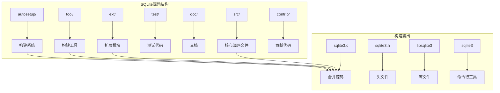
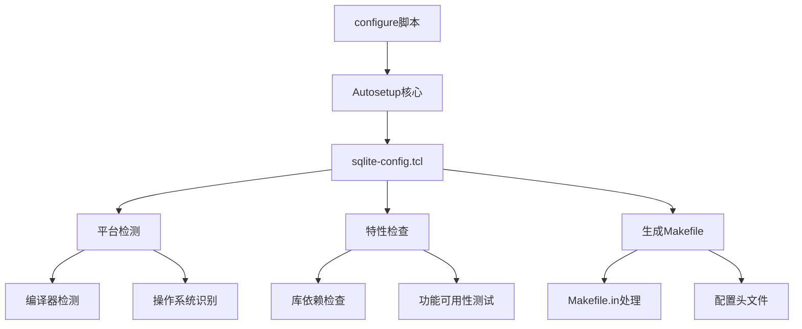
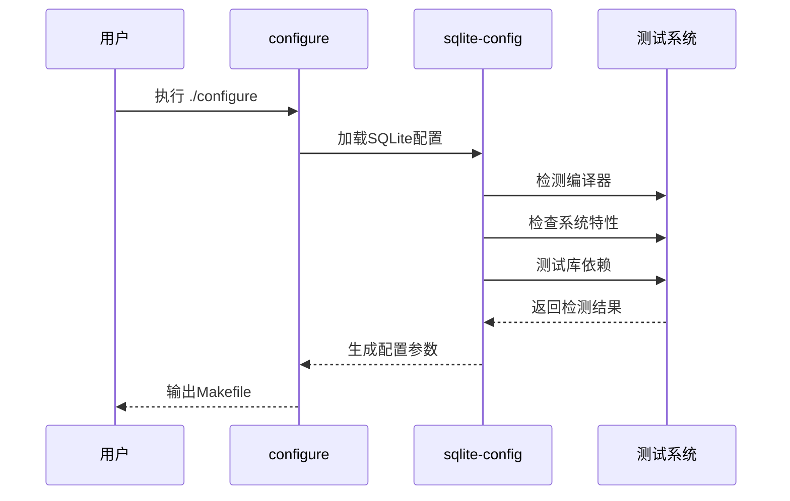
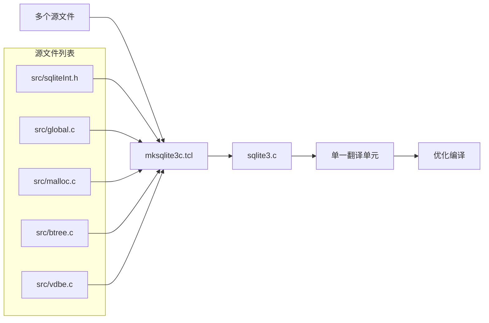
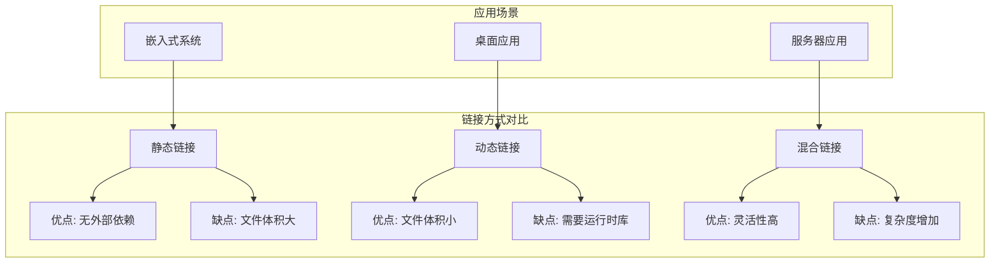

# 配置与编译

<cite>
**本文档中引用的文件**
- [README.md](file://README.md)
- [doc/compile-for-unix.md](file://doc/compile-for-unix.md)
- [doc/compile-for-windows.md](file://doc/compile-for-windows.md)
- [autosetup/README.md](file://autosetup/README.md)
- [autosetup/sqlite-config.tcl](file://autosetup/sqlite-config.tcl)
- [autosetup/proj.tcl](file://autosetup/proj.tcl)
- [tool/mksqlite3c.tcl](file://tool/mksqlite3c.tcl)
- [tool/mksqlite3c-noext.tcl](file://tool/mksqlite3c-noext.tcl)
- [Makefile.in](file://Makefile.in)
- [auto.def](file://auto.def)
- [main.mk](file://main.mk)
</cite>

## 目录
1. [简介](#简介)
2. [项目结构概览](#项目结构概览)
3. [Autosetup构建系统](#autosetup构建系统)
4. [编译配置详解](#编译配置详解)
5. [平台特定编译指南](#平台特定编译指南)
6. [Amalgamation合并源码](#amalgamation合并源码)
7. [编译时选项与特性标志](#编译时选项与特性标志)
8. [链接方式配置](#链接方式配置)
9. [常见编译问题解决](#常见编译问题解决)
10. [性能优化建议](#性能优化建议)

## 简介

SQLite是一个高度可配置的嵌入式数据库引擎，其编译系统基于Autosetup框架，提供了灵活而强大的配置选项。本文档详细介绍了SQLite的配置、编译过程，包括不同平台的编译步骤、关键编译选项的含义，以及如何定制编译以满足特定需求。

## 项目结构概览

SQLite项目采用模块化设计，主要目录结构如下：



**图表来源**
- [README.md](file://README.md#L1-L50)

**章节来源**
- [README.md](file://README.md#L1-L100)

## Autosetup构建系统

### 核心架构

Autosetup是SQLite使用的现代化构建系统，替代了传统的Autoconf/Automake组合。它提供了更简洁、更灵活的配置机制。



**图表来源**
- [autosetup/README.md](file://autosetup/README.md#L1-L50)
- [autosetup/sqlite-config.tcl](file://autosetup/sqlite-config.tcl#L1-L100)

### 主要组件

1. **proj.tcl**: 项目无关的通用工具函数
2. **sqlite-config.tcl**: SQLite特定的配置逻辑
3. **auto.def**: 主配置驱动程序
4. **cc.tcl**: 编译器检测和特性测试

**章节来源**
- [autosetup/README.md](file://autosetup/README.md#L50-L150)
- [autosetup/sqlite-config.tcl](file://autosetup/sqlite-config.tcl#L1-L200)

## 编译配置详解

### 基本配置流程

SQLite的配置过程包含以下关键步骤：



**图表来源**
- [auto.def](file://auto.def#L1-L70)
- [autosetup/sqlite-config.tcl](file://autosetup/sqlite-config.tcl#L100-L200)

### 关键配置选项

| 选项类别 | 主要选项 | 功能描述 |
|---------|---------|----------|
| 库模式 | `--enable-shared` | 启用共享库构建 |
| | `--enable-static` | 启用静态库构建 |
| 特性开关 | `--enable-fts5` | 启用FTS5全文搜索 |
| | `--enable-rtree` | 启用RTREE空间索引 |
| | `--enable-json1` | 启用JSON1扩展 |
| 调试选项 | `--enable-debug` | 启用调试模式 |
| | `--enable-profiling` | 启用性能分析 |

**章节来源**
- [autosetup/sqlite-config.tcl](file://autosetup/sqlite-config.tcl#L200-L400)

## 平台特定编译指南

### Unix/Linux编译

#### 基本步骤

1. **安装依赖工具**
```bash
# Ubuntu/Debian
sudo apt install gcc make tcl-dev

# CentOS/RHEL
sudo yum install gcc make tcl-devel
```

2. **配置和编译**
```bash
tar xzf sqlite.tar.gz
mkdir build
cd build
../sqlite/configure --enable-all
make sqlite3
make sqlite3.c
```

3. **高级配置选项**
```bash
# 调试版本
../sqlite/configure --enable-all --enable-debug CFLAGS='-O0 -g'

# 最小化配置
../sqlite/configure --disable-all --enable-fts5 --enable-rtree
```

**章节来源**
- [doc/compile-for-unix.md](file://doc/compile-for-unix.md#L1-L71)

### Windows编译

#### MSVC编译环境

1. **安装要求**
   - Visual Studio 2015或更高版本
   - Windows SDK
   - TCL开发库（可选）

2. **编译命令**
```batch
nmake /f Makefile.msc sqlite3.exe
nmake /f Makefile.msc sqlite3.c
nmake /f Makefile.msc sqldiff.exe
```

3. **DLL构建**
```batch
nmake /f Makefile.msc sqlite3.dll ^
  USE_NATIVE_LIBPATHS=1 ^
  "OPTS=-DSQLITE_ENABLE_FTS3=1 -DSQLITE_ENABLE_FTS4=1 -DSQLITE_ENABLE_FTS5=1"
```

**章节来源**
- [doc/compile-for-windows.md](file://doc/compile-for-windows.md#L1-L100)

### macOS编译

macOS平台编译与Unix类似，但需要注意：

1. **Xcode命令行工具**
```bash
xcode-select --install
```

2. **Homebrew包管理器**
```bash
brew install tcl
```

3. **交叉编译支持**
```bash
export CC=clang
export CFLAGS="-mmacosx-version-min=10.15"
```

## Amalgamation合并源码

### Amalgamation概念

Amalgamation是SQLite的一个重要特性，它将所有源文件合并为单个大文件，提供更好的编译优化机会。



**图表来源**
- [tool/mksqlite3c.tcl](file://tool/mksqlite3c.tcl#L1-L50)

### 生成过程

1. **准备源文件**
```bash
make target_source
```

2. **运行合并脚本**
```bash
tclsh tool/mksqlite3c.tcl
```

3. **高级选项**
```bash
# 不包含静态链接支持
tclsh tool/mksqlite3c.tcl --nostatic

# 包含行号宏
tclsh tool/mksqlite3c.tcl --linemacros=1

# 使用API调用约定
tclsh tool/mksqlite3c.tcl --useapicall
```

**章节来源**
- [tool/mksqlite3c.tcl](file://tool/mksqlite3c.tcl#L1-L100)
- [tool/mksqlite3c-noext.tcl](file://tool/mksqlite3c-noext.tcl#L1-L100)

## 编译时选项与特性标志

### 核心特性标志

SQLite提供了丰富的编译时选项，通过`-DSQLITE_ENABLE_*`和`-DSQLITE_OMIT_*`标志控制功能：

| 功能类别 | 启用标志 | 描述 |
|---------|---------|------|
| 全文搜索 | `SQLITE_ENABLE_FTS5` | 启用FTS5全文搜索 |
| | `SQLITE_ENABLE_FTS3` | 启用FTS3/4全文搜索 |
| 空间索引 | `SQLITE_ENABLE_RTREE` | 启用RTREE空间索引 |
| JSON支持 | `SQLITE_ENABLE_JSON1` | 启用JSON1扩展 |
| 几何图形 | `SQLITE_ENABLE_GEOPOLY` | 启用几何多边形支持 |
| 会话管理 | `SQLITE_ENABLE_SESSION` | 启用会话扩展 |
| 数学函数 | `SQLITE_ENABLE_MATH_FUNCTIONS` | 启用数学函数 |
| 内存分配器 | `SQLITE_ENABLE_MEMSYS5` | 启用MEMSYS5内存分配器 |

### 性能相关选项

```bash
# 启用各种优化
-DSQLITE_ENABLE_API_ARMOR=1      # API保护
-DSQLITE_ENABLE_CURSOR_HINTS=1   # 游标提示
-DSQLITE_ENABLE_STAT4=1          # 统计信息增强
-DSQLITE_ENABLE_DBSTAT_VTAB=1    # 数据库统计视图
```

### 调试和诊断选项

```bash
# 调试支持
-DSQLITE_DEBUG=1                # 启用调试模式
-DSQLITE_ENABLE_EXPENSIVE_ASSERT=1 # 昂贵断言
-DSQLITE_ENABLE_API_ARMOR=1     # API保护

# 性能分析
-DSQLITE_ENABLE_STMT_SCANSTATUS=1 # 语句扫描状态
-DSQLITE_ENABLE_COSTMULT=1      # 成本乘数
```

**章节来源**
- [autosetup/sqlite-config.tcl](file://autosetup/sqlite-config.tcl#L700-L800)

## 链接方式配置

### 静态链接 vs 动态链接

SQLite支持多种链接方式，每种都有其适用场景：



### 链接配置选项

1. **库类型选择**
```bash
# 只构建静态库
./configure --enable-static --disable-shared

# 只构建共享库  
./configure --disable-static --enable-shared

# 同时构建两者
./configure --enable-static --enable-shared
```

2. **CLI工具链接**
```bash
# 静态链接CLI工具
./configure --enable-static-cli-shell

# 动态链接CLI工具
./configure --disable-static-cli-shell
```

3. **TCL扩展链接**
```bash
# 静态链接TCL扩展
./configure --enable-static-tclsqlite3

# 动态链接TCL扩展
./configure --disable-static-tclsqlite3
```

**章节来源**
- [Makefile.in](file://Makefile.in#L50-L150)

## 常见编译问题解决

### 编译器兼容性问题

1. **GCC版本问题**
```bash
# 检查GCC版本
gcc --version

# 使用特定GCC版本
export CC=gcc-9
./configure
```

2. **C99标准支持**
```bash
# 强制使用C99标准
./configure CFLAGS="-std=c99 -pedantic"
```

### 头文件缺失问题

1. **系统头文件**
```bash
# Ubuntu/Debian
sudo apt install build-essential

# CentOS/RHEL
sudo yum groupinstall "Development Tools"
```

2. **TCL开发库**
```bash
# Ubuntu/Debian
sudo apt install tcl-dev

# macOS
brew install tcl-tk
```

### 链接器错误

1. **库路径问题**
```bash
# 指定库路径
./configure LDFLAGS="-L/usr/local/lib"
./configure CPPFLAGS="-I/usr/local/include"
```

2. **符号冲突**
```bash
# 使用符号版本
./configure --enable-soname=9.10
```

### 平台特定问题

1. **Windows编译**
```batch
# 设置正确的环境变量
set TCLDIR=C:\Tcl
set PATH=%TCLDIR%\bin;%PATH%
```

2. **交叉编译**
```bash
# ARM交叉编译
export CC=arm-linux-gnueabihf-gcc
export AR=arm-linux-gnueabihf-ar
./configure --host=arm-linux-gnueabihf
```

**章节来源**
- [doc/compile-for-unix.md](file://doc/compile-for-unix.md#L50-L71)
- [doc/compile-for-windows.md](file://doc/compile-for-windows.md#L100-L192)

## 性能优化建议

### 编译器优化

1. **优化级别**
```bash
# 生产环境
./configure CFLAGS="-O2 -DNDEBUG"

# 最大优化
./configure CFLAGS="-O3 -DNDEBUG -march=native"
```

2. **特定优化**
```bash
# 启用各种优化标志
./configure CFLAGS="-O2 -DNDEBUG \
  -DSQLITE_ENABLE_RTREE=1 \
  -DSQLITE_ENABLE_FTS5=1 \
  -DSQLITE_ENABLE_JSON1=1"
```

### 运行时优化

1. **内存管理**
```bash
# 自定义内存分配器
./configure --enable-memstat --enable-debug
```

2. **缓存优化**
```bash
# 调整页面大小
./configure CFLAGS="-DSQLITE_DEFAULT_PAGE_SIZE=4096 \
  -DSQLITE_DEFAULT_CACHE_SIZE=10000"
```

### 平台特定优化

1. **ARM平台**
```bash
./configure CFLAGS="-mcpu=cortex-a72 -mfpu=neon-vfpv4"
```

2. **x86_64平台**
```bash
./configure CFLAGS="-march=x86-64-v3 -mtune=intel"
```

### 调试和分析

1. **性能分析**
```bash
# 启用性能分析
./configure --enable-profiling CFLAGS="-pg"
```

2. **内存调试**
```bash
# 启用内存调试
./configure --enable-debug CFLAGS="-fsanitize=address -g"
```

通过合理配置这些选项，可以显著提升SQLite在特定环境下的性能表现。建议根据实际应用场景进行测试和调整。